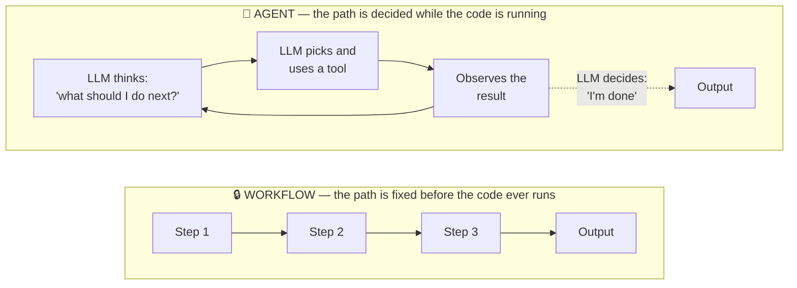
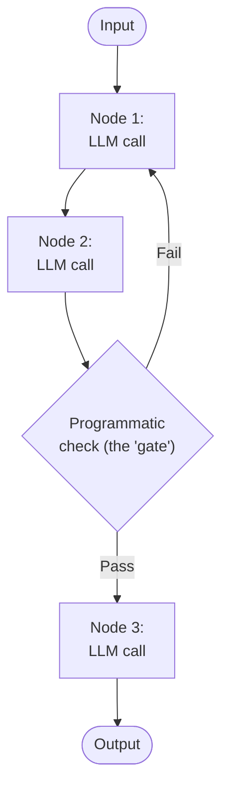
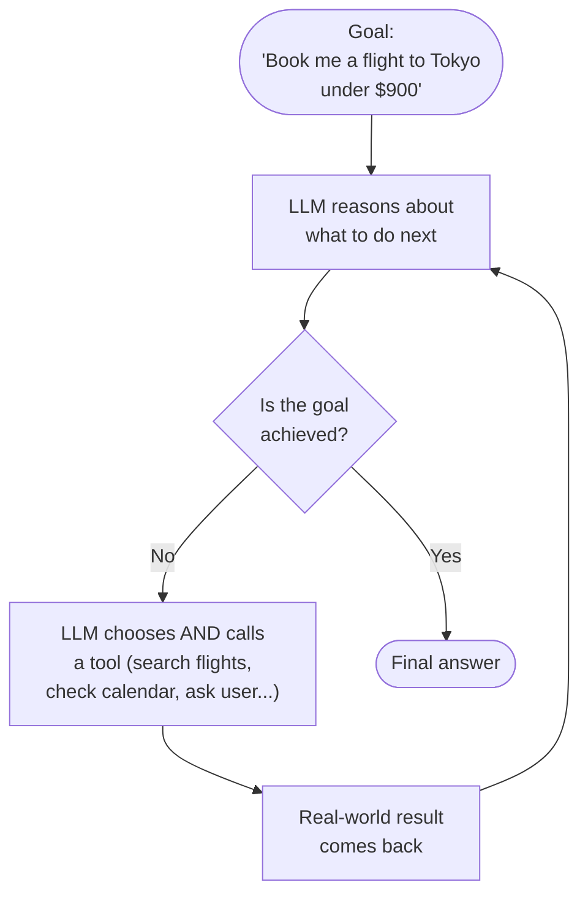
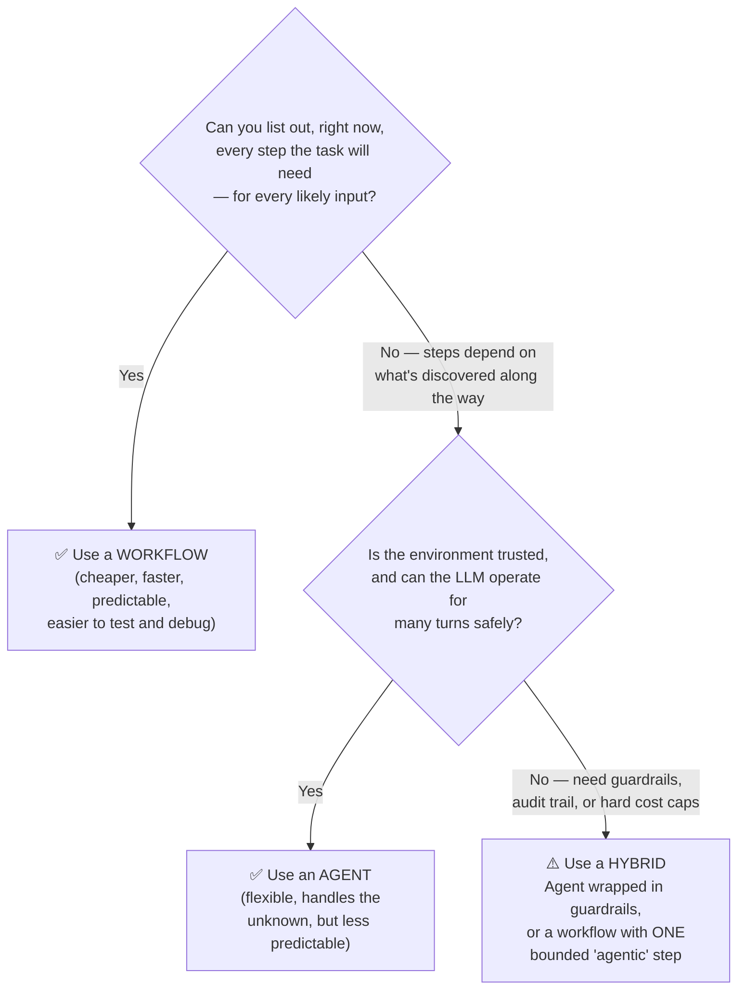
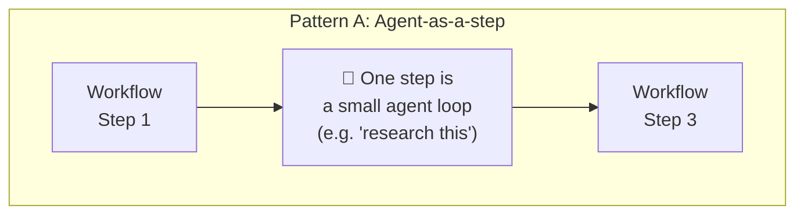
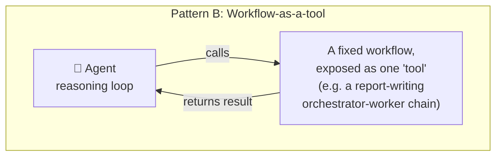

# Workflow vs. Agentic Patterns

> **Who this is for:** total beginners who want a clear mental model, and anyone prepping for an AI engineering interview where "explain the difference between a workflow and an agent" is a near-guaranteed question.

---

## Table of Contents

1. [The One-Line Answer](#the-one-line-answer)
2. [The Core Idea, Visually](#the-core-idea-visually)
3. [But the LLM Decides in Routing and Orchestrator-Worker Too — So What's Really Different?](#but-the-llm-decides-in-routing-and-orchestrator-worker-too--so-whats-really-different)
4. [What Is a Workflow?](#what-is-a-workflow)
5. [What Is an Agent?](#what-is-an-agent)
6. [Side-by-Side Comparison](#side-by-side-comparison)
7. [How to Decide Which One to Build](#how-to-decide-which-one-to-build)
8. [Can You Mix Them?](#can-you-mix-them-hybrid-systems)
9. [Real-World Examples](#real-world-examples)
10. [Interview Cheat Sheet](#interview-cheat-sheet)
11. [Common Interview Questions & Model Answers](#common-interview-questions--model-answers)
12. [Quick-Fire Q&A (Rapid Review)](#quick-fire-qa-rapid-review)
13. [Glossary](#glossary)

---

## The One-Line Answer

> **A workflow is a recipe. An agent is a chef.**
>
> A **workflow** follows a path a *developer* wrote in code, in advance. An **agent** decides its own path, step by step, at *runtime*, based on what it observes.

This is the same distinction Anthropic draws in their widely-cited engineering post *Building Effective Agents* (Dec 2024):

> **Workflows** are systems where LLMs and tools are orchestrated through predefined code paths.
> **Agents**, on the other hand, are systems where LLMs dynamically direct their own processes and tool usage, maintaining control over how they accomplish tasks.

> 💡 **Important pointer:** "Agentic AI" is often used loosely to mean "any system that uses an LLM." Technically, that's wrong. The five patterns in this repo's `4. Workflow_Pattern` folder (Prompt Chaining, Routing, Parallelization, Orchestrator-Worker, Evaluator-Optimizer) are **workflows**, not agents — even though people casually call them "agentic patterns." True agents live in the sibling `5. Agent Pattern` folder.

---

## The Core Idea, Visually



**What to notice:**
- In the **Workflow** box, arrows only go forward. A developer drew this graph before deployment, and it never changes shape — no matter what input comes in.
- In the **Agent** box, there's a **loop**. The LLM itself decides, on every iteration, whether to keep going and what to do next. The *number* of loops and the *specific tools used* aren't fixed — they emerge at runtime.

---

## But the LLM Decides in Routing and Orchestrator-Worker Too — So What's Really Different?

This is the single most common follow-up question, and it's a great one — because the answer isn't "does the LLM decide anything," it's **the *shape* and *scope* of what it's allowed to decide.**

### Routing: the LLM picks one option from a list the developer already wrote code for

```python
routing_map = {
    "story": "generate_story",
    "poem": "generate_poem",
    "joke": "generate_joke",
}
return routing_map.get(state["routing_decision"], "generate_story")
```

The LLM's entire contribution is: *which key in this dict?* It cannot invent a 4th destination, loop back, or call a tool nobody wired up. The developer's code still fully determines **every possible path the graph can take** — the LLM just selects which *already-drawn* edge to follow. This is a **classification decision**, not process control.

### Orchestrator-Worker: the LLM picks *how many times* to run one pre-defined action

```python
return [Send("llm_call", {"section": s}) for s in state["sections"]]
```

The LLM decides the *count* (`sections` might be 2 or 8), but the *type* of node it can spawn is fixed — always `"llm_call"`, doing the same job, feeding the same synthesizer afterward. There is exactly **one** planning decision, made **once**, at a single point in the graph. After that, no further flow decisions happen — it's just mechanical fan-out then fan-in.

### Agent: the LLM picks any action, from an open-ended toolbox, every turn, indefinitely — including when to stop

```python
while True:
    response = llm_with_tools.invoke(messages)
    if not response.tool_calls:
        break              # <- the LLM itself decides "I'm done"
    messages = run_tools(response.tool_calls)
```

Here the code has almost no structural opinion left. It doesn't know how many turns will happen, which tools get called, in what order, or when it ends — that's *entirely* emergent from the LLM's reasoning at runtime. The "graph" is really just "keep calling the LLM until it says stop."

### The test that actually separates them

Ask: **"Before running this, could I draw the complete set of paths execution might take?"**

| Pattern | Can you draw all possible paths in advance? | What the LLM actually decides |
|---|---|---|
| **Routing** | Yes — exactly N branches, drawn on paper before any code runs | *Which* pre-wired branch to take (a classification) |
| **Orchestrator-Worker** | Yes, structurally — "plan → spawn N of the same worker type → synthesize" | *How many* times to run one fixed action (a cardinality) |
| **Agent** | No — the sequence of tool calls, their count, and the stopping point aren't enumerable until you actually run it | *Which* action, *how many times*, *in what order*, and *when to stop* — all of it |

> 💡 **Important pointer:** So Anthropic's phrase "predefined code paths" does **not** mean zero LLM judgment. It means **the complete space of paths the LLM is choosing among was drawn by a human in advance.** Routing and Orchestrator-Worker use the LLM as a smart *selector* or *sizer* operating **inside** a graph the developer fully authored. An agent uses the LLM **as** the graph — generating the path itself, call by call, with no upper bound baked into the structure (only a safety cap you bolt on separately, like a max-turn limit).

---

## What Is a Workflow?

A workflow is **LLM calls wired together through code that a human wrote in advance**. The LLM does the "thinking" *inside* each step, but the human decides the *shape* of the whole system — how many steps there are, what order they run in, and when to branch.



> 💡 **Important pointer:** Even though a workflow can loop (see the `Gate -->|Fail| S1` arrow above, used in Prompt Chaining and Evaluator-Optimizer), it's **still a workflow**, not an agent — because *the developer defined every possible path the loop can take*. The LLM never invents a new node that wasn't in the graph.

### Characteristics of a Workflow

| Trait | Description |
|---|---|
| **Control flow** | Defined by code (`if/else`, fixed edges in a graph) |
| **Predictability** | High — the same *shape* of execution happens every time |
| **Number of steps** | Fixed, or bounded within a known range (e.g. "retry up to 3 times") |
| **Tool/model choice per step** | Decided in advance by the developer |
| **Where LLM "judgment" is used** | Inside individual steps (e.g., classify this, summarize that) — never to invent new steps |
| **Best for** | Tasks that can be cleanly broken into known sub-tasks |

---

## What Is an Agent?

An agent is a system where **the LLM itself is the control flow**. Instead of a developer pre-wiring "step 1 → step 2 → step 3," the developer gives the LLM a goal, a set of tools, and lets it decide — on every turn — what to do next, until it decides the task is done.



> 💡 **Important pointer:** This loop is often called the **ReAct loop** (Reason → Act → Observe, repeat). It's the most common way agents are implemented in practice — see LangGraph's `create_react_agent` for a pre-built version of exactly this loop.

### Characteristics of an Agent

| Trait | Description |
|---|---|
| **Control flow** | Decided by the LLM itself, turn by turn |
| **Predictability** | Lower — the same input can take a different *number* of steps or a different *route* each run |
| **Number of steps** | Open-ended (bounded only by a safety limit, e.g. "max 25 turns") |
| **Tool/model choice per step** | Decided by the LLM at runtime, from a toolbox it was given |
| **Where LLM "judgment" is used** | To decide the *entire trajectory* — what to do, in what order, and when to stop |
| **Best for** | Open-ended tasks where you can't predict the steps in advance, and you can trust the LLM to operate with some autonomy |

---

## Side-by-Side Comparison

| Dimension | Workflow | Agent |
|---|---|---|
| **Who decides the path** | Developer (at build time) | LLM (at run time) |
| **Graph shape** | Fixed — same shape every run | Dynamic — varies per run |
| **Predictability** | High | Lower |
| **Debuggability** | Easier — you can reason about every possible path | Harder — the path is only known after execution |
| **Cost/latency control** | Easy to bound (fixed number of LLM calls) | Harder to bound (loop could run many turns) |
| **Failure mode** | A step fails → the whole run fails predictably | The LLM could loop, pick a bad tool, or "wander" off-task |
| **Trust required in the LLM** | Low — LLM only does local reasoning per step | High — LLM controls the whole trajectory |
| **Typical latency** | Lower (fewer, more predictable calls) | Higher (many turns possible) |
| **Best when...** | Sub-tasks are known and decomposable in advance | The number/order of steps genuinely can't be known ahead of time |
| **Example** | "Summarize this document in 3 fixed steps" | "Investigate why this server is down and fix it" |

> 💡 **Important pointer (interview gold):** The #1 engineering reason to prefer a workflow over an agent isn't quality — it's **predictability and cost control**. Workflows make a fixed number of LLM calls; agents can spiral into many calls if the LLM gets stuck reasoning in circles. Anthropic's own guidance: *"start with the simplest solution possible, and only increase complexity when needed."* That means: **default to a workflow, escalate to an agent only when the task truly demands open-ended autonomy.**

---

## How to Decide Which One to Build



**Rules of thumb:**

- **Default to a workflow.** It's simpler, cheaper, and easier to reason about. Only reach for an agent when a workflow genuinely can't express the task.
- **Ask: "could I hardcode the exact steps before seeing the specific input?"** If yes → workflow. If the steps only reveal themselves as the system works the problem → agent (or at minimum, Orchestrator-Worker, which is the workflow pattern closest to an agent).
- **Ask: "how bad is it if this runs longer / costs more than expected?"** Workflows bound this naturally. Agents need explicit safety limits (max turns, timeouts, budget caps).

---

## Can You Mix Them? (Hybrid Systems)

Yes — and in production, most real systems are hybrids. Two common shapes:





> 💡 **Important pointer:** Orchestrator-Worker (see `4. Orchestrator_Worker/` in this repo) is the workflow pattern that sits **closest to an agent** on this spectrum — the orchestrator LLM does decide *how many* subtasks to create at runtime. But it's still a workflow, not an agent, because the *set of possible actions* (spawn a worker, synthesize) is fixed by the developer; the LLM never gains a new capability or open-ended tool loop mid-run.

---

## Real-World Examples

| System | Workflow or Agent? | Why |
|---|---|---|
| Extract structured data from an invoice, then validate the schema | **Workflow** (Prompt Chaining) | Steps are always: extract → validate → format. Never changes. |
| Route a support ticket to billing/technical/general | **Workflow** (Routing) | A fixed, known set of categories with one classify step. |
| "Fix the failing test in this repo" (coding agent) | **Agent** | Can't know in advance which files need changes, how many edits, or which tools (grep, run tests, edit file) will be needed — and in what order. |
| Generate a multi-section report where topic complexity is unknown | **Workflow** (Orchestrator-Worker) | The *number* of sections is dynamic, but the only actions available are "plan sections" and "write a section" — a fixed, small action set. |
| A customer-support bot that can look things up, escalate, or issue a refund across an open-ended conversation | **Agent** | The conversation can go anywhere; the bot needs to decide, turn by turn, which of many tools to invoke. |
| Translate a document, then have a second LLM call critique and refine it up to 3 times | **Workflow** (Evaluator-Optimizer) | The loop exists, but its shape (generate → evaluate → maybe loop back) is fixed by the developer. |

---

## Interview Cheat Sheet

Memorize this table — it answers 90% of "workflow vs. agent" interview questions on its own.

| | **Workflow** | **Agent** |
|---|---|---|
| **One-word summary** | Recipe | Chef |
| **Who controls the path** | Developer's code | The LLM |
| **When path is decided** | Build time | Run time |
| **Predictable # of LLM calls?** | Yes | No (needs a turn limit) |
| **Anthropic's advice** | Start here | Escalate here only if needed |
| **Risk** | May be too rigid for novel inputs | May loop, wander, or run away in cost |
| **Real analogy** | Assembly line | Autonomous employee |

---

## Common Interview Questions & Model Answers

**Q1. What's the fundamental difference between a workflow and an agent in the context of LLM systems?**
> A workflow's control flow — which steps run, in what order — is fixed by the developer's code at build time. An agent's control flow is decided by the LLM itself, dynamically, at run time, based on what it observes as it goes.

**Q2. Why would you choose a workflow over an agent, even though agents are more "powerful"?**
> Predictability, cost, latency, and debuggability. A workflow makes a bounded, known number of LLM calls, so you can predict cost and latency and reason about every path it can take. An agent's number of steps is open-ended, so cost/latency are harder to bound, and failures (looping, wrong tool choice) are harder to trace. Anthropic explicitly recommends starting with the simplest workflow that solves the problem and only reaching for agent autonomy when the task can't be decomposed in advance.

**Q3. Is Orchestrator-Worker an agent, since it decides things dynamically?**
> No. It's the workflow pattern closest to agent-like behavior because the orchestrator LLM decides *how many* subtasks to spawn at runtime — but the set of possible actions (plan, dispatch a worker, synthesize) is still fixed by the developer. An agent, by contrast, can pick from an open-ended set of tools and decide its own stopping condition across arbitrarily many turns.

**Q4. What's a practical risk of agents that workflows don't have?**
> Runaway loops / cost — an agent can keep reasoning and calling tools far longer than expected if it doesn't recognize the task is done, or gets stuck retrying a failing approach. This is why production agents need hard safety limits (max turns, timeouts, budget caps) that workflows don't strictly need, since a workflow's call count is bounded by its graph.

**Q5. Can a system be both a workflow and an agent?**
> Yes — hybrids are common. Two typical shapes: (1) a fixed workflow where *one step* is itself a small agent loop (e.g., a "research this" step that the LLM handles autonomously before returning to the fixed pipeline), or (2) an agent whose *tool* is actually a fixed workflow underneath (e.g., an agent that calls a "generate report" tool, which internally runs an Orchestrator-Worker workflow).

**Q6. Give an example of a task that's a poor fit for a pure workflow.**
> Any task where you can't enumerate the steps in advance — e.g., "debug why this production service is returning 500s." The number of files to check, commands to run, and logs to inspect is only discoverable as you investigate; a fixed graph can't capture that, so this needs agent-style autonomy (or at least a loop where the LLM decides what to check next).

**Q7. How does Anthropic define these two terms, and why does the distinction matter operationally?**
> "Workflows are systems where LLMs and tools are orchestrated through predefined code paths. Agents are systems where LLMs dynamically direct their own processes and tool usage, maintaining control over how they accomplish tasks." It matters operationally because it changes what you need to build around the system: workflows need good prompts and gates; agents additionally need turn limits, cost monitoring, tool-use guardrails, and often human-in-the-loop checkpoints, because you're trusting the LLM with more control.

**Q8. Name the five workflow patterns and one line on each.**
> Prompt Chaining (sequential steps with a gate), Routing (classify then dispatch to a specialist), Parallelization (independent branches run concurrently, fixed count), Orchestrator-Worker (orchestrator plans a *dynamic* number of subtasks, workers execute them), Evaluator-Optimizer (generate → critique → refine loop until criteria pass). See [`README.md`](README.md) in this folder for the full breakdown and a decision tree between them.

---

## Quick-Fire Q&A (Rapid Review)

One or two sentences each — for a fast pre-interview scan. Grouped by topic.

### Fundamentals

**Q. What's the single-sentence definition of a workflow vs. an agent?**
> Workflow = LLM calls wired together by code the developer wrote in advance. Agent = the LLM itself decides what to do next, turn by turn, at runtime.

**Q. What is the "augmented LLM"?**
> Anthropic's term for an LLM equipped with structured output, tool calling, and retrieval — the basic building block every workflow and agent pattern is assembled from.

**Q. Why does Anthropic recommend starting simple — single LLM call, then workflow, then agent — rather than jumping straight to an agent?**
> Complexity should be earned: each step up (single call → workflow → agent) trades predictability and cost control for flexibility, so you only pay that cost when a simpler option genuinely can't do the job.

**Q. Is a basic RAG pipeline (retrieve → generate) a workflow or an agent?**
> A workflow — it's a fixed two-step chain. It only becomes agentic ("agentic RAG") if the LLM itself decides *whether*, *when*, and *how many times* to retrieve.

### Prompt Chaining

**Q. What problem does prompt chaining solve that one giant prompt doesn't?**
> It reduces the cognitive load per LLM call — each step is a simpler, more focused task, which trades latency for higher accuracy.

**Q. What's a "gate" in prompt chaining?**
> A programmatic (non-LLM) check inserted between steps to verify the previous step's output is good enough before continuing — e.g. checking length or required keywords.

**Q. What happens if you skip the gate in a multi-step chain?**
> A bad intermediate output silently flows downstream and compounds — by the last step you may not be able to tell the final result is built on a flawed foundation.

### Routing

**Q. Why route instead of using one prompt for everything?**
> Different input categories often need different instructions or models; one prompt optimized for all categories tends to underperform on each individually.

**Q. What happens if the router misclassifies an input?**
> It gets sent to the wrong specialist handler and produces an off-target (though not necessarily crashing) response — this is why routing accuracy is worth evaluating on its own.

**Q. Must the router be an LLM?**
> No — a cheaper traditional classifier or rules engine works fine when categories are simple and well-defined; an LLM router is worth it mainly when classification needs nuanced language understanding.

### Parallelization

**Q. What's the difference between "sectioning" and "voting"?**
> Sectioning splits one task into independent, different sub-tasks run concurrently; voting runs the *same* task multiple times (possibly with variation) to cross-check or build confidence in the result.

**Q. Why do parallel nodes writing to the same state key need a reducer (e.g. `operator.add`)?**
> Without one, whichever parallel write finishes last silently overwrites the others — a reducer instead defines how to merge concurrent updates (e.g. list concatenation).

**Q. What's the risk if you fan out parallel branches without a reducer?**
> Silent data loss — the graph runs without erroring, but only one branch's result survives.

### Orchestrator-Worker

**Q. What LangGraph primitive makes Orchestrator-Worker possible, and why?**
> The `Send` API — it lets a single conditional edge spawn a *variable* number of worker executions decided at runtime, which a static `add_edge` can't express.

**Q. Are Orchestrator-Worker's workers usually different functions or the same one reused?**
> The same one, reused — each `Send` call passes different data (e.g. a different report section) into one shared worker function.

**Q. What's the one thing that must be true for an Orchestrator-Worker implementation to actually be correct?**
> The workers must genuinely consume the orchestrator's plan (not just display it) — a common bug is generating a dynamic plan that the fixed workers then ignore.

### Evaluator-Optimizer

**Q. What are the two roles in Evaluator-Optimizer?**
> A generator that produces (or revises) content, and an evaluator that grades it against explicit criteria and returns actionable feedback.

**Q. When does Evaluator-Optimizer NOT work well?**
> When "better" can't be stated as concrete, checkable criteria — if a human reviewer couldn't give crisp feedback either, an LLM evaluator won't reliably improve things.

**Q. What safety mechanism does an Evaluator-Optimizer loop need?**
> A max-iteration cap — without one, a generator/evaluator pair that never agrees "good enough" loops forever.

### Agents

**Q. What does the ReAct loop stand for?**
> Reason → Act → Observe, repeated until the LLM decides the task is complete.

**Q. Why do agents need a recursion/turn limit even though workflows usually don't?**
> An agent's loop has no structural end condition baked in — only the LLM's own judgment decides when to stop, so a hard cap is the safety net against runaway loops.

**Q. What's the practical risk of giving an agent too many tools?**
> Tool-selection confusion and latency — with more options, the LLM is more likely to pick the wrong tool or spend reasoning cycles deciding, and every tool description also eats context.

**Q. What's "human-in-the-loop," and why does it matter more for agents than workflows?**
> A checkpoint where a human approves an action before it executes; it matters more for agents because their action sequence is unpredictable and can include higher-stakes, irreversible steps (e.g. sending an email, spending money).

### Practical / System Design

**Q. What's one concrete engineering advantage of a workflow's determinism?**
> You can write deterministic unit tests per node, since the set of possible paths is fully enumerable in advance — much harder for an agent's emergent trajectories.

**Q. What's a clear signal that a workflow should be upgraded to an agent?**
> You keep adding new branches/nodes to the graph for edge cases you didn't originally anticipate — that's a sign the task's shape genuinely isn't fixed.

**Q. What's a clear signal that an agent is overkill and should be downgraded to a workflow?**
> The agent's tool-call trajectory is actually the same every time in practice — if the path never varies, you're paying for open-ended autonomy you're not using.

**Q. In LangGraph specifically, what's the difference between the Graph API and the Functional API?**
> The Graph API builds an explicit `StateGraph` of nodes and edges; the Functional API expresses the same logic as plain Python functions decorated with `@task`/`@entrypoint` — same underlying execution model, different authoring style.

---

## Glossary

| Term | Meaning |
|---|---|
| **Control flow** | The logic that decides what runs next. In a workflow, this is code; in an agent, this is the LLM's own reasoning. |
| **ReAct loop** | Reason → Act → Observe → repeat. The most common agent implementation pattern. |
| **Tool use / function calling** | Giving an LLM the ability to invoke external functions (search, code execution, APIs) and read back the results. |
| **Gate** | A programmatic check inserted between workflow steps to validate output before continuing (used in Prompt Chaining). |
| **Orchestrator** | In Orchestrator-Worker, the LLM call that plans how to break a task into subtasks. |
| **`Send` API** | LangGraph's mechanism for dynamically spawning a variable number of parallel worker nodes at runtime. |
| **Hybrid system** | A system that combines both patterns — e.g., an agent that calls a fixed workflow as one of its tools. |

---

**See also:**
- [`README.md`](README.md) — which primary notebook to open for each of the five workflow patterns, plus a decision tree between them
- [`workflows.md`](workflows.md) — full pattern definitions with reference LangGraph/functional-API code
- [`../5. Agent Pattern/`](../5.%20Agent%20Pattern/) — the sibling folder covering true agent loops
