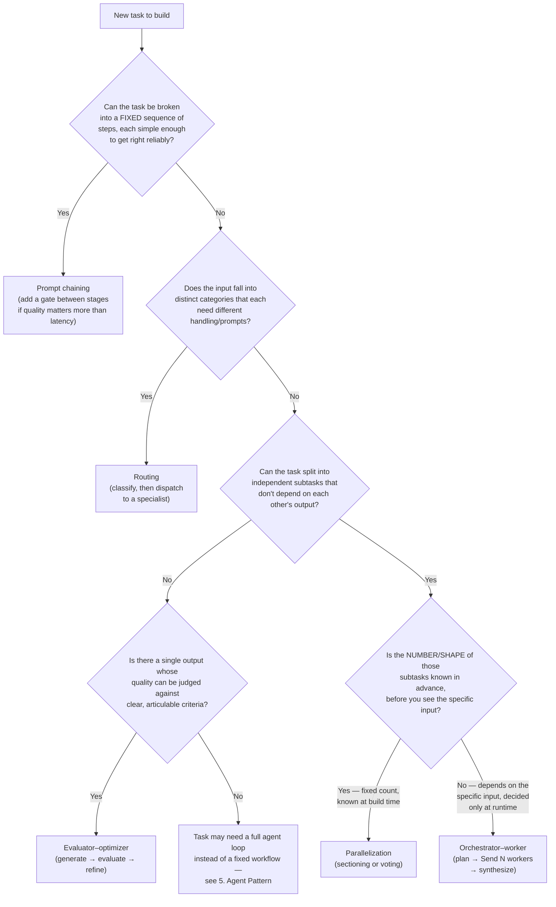

# Workflow Patterns

Hands-on notebooks for the five agentic **workflow** patterns from Anthropic’s *Building Effective Agents*.

These are **predefined graphs** (code decides the path). They are not autonomous **agents**. Agent loops and tool-use patterns live in the sibling folder [`5. Agent Pattern`](../5.%20Agent%20Pattern/).

## What this README is for

- Which notebook to open for each pattern
- When to pick that pattern on a new problem

Pattern definitions, diagrams, and reference LangGraph / functional-API code are in [`workflows.md`](workflows.md). This file does not repeat that.

## Folder layout

Each numbered subfolder has:

- `notebooks/` — **one primary notebook** (named after the pattern, no numeric prefix)
- `notebooks/backup/` — earlier or alternate notebooks, kept for reference only
- `theory/` — short pattern notes (where present)

## Primary notebooks

| # | Pattern | Primary notebook | Backup (reference only) |
|---|---------|------------------|-------------------------|
| 1 | Prompt chaining | [`Prompt_Chaining.ipynb`](1.%20Prompt_Chaining/notebooks/Prompt_Chaining.ipynb) | `backup/Prompt_Chaining_Structured_Output.ipynb` |
| 2 | Routing | [`Routing.ipynb`](2.%20Routing/notebooks/Routing.ipynb) | — |
| 3 | Parallelization | [`Parallelization.ipynb`](3.%20Parallelization/notebooks/Parallelization.ipynb) | `backup/Parallelization_Sectioning_Example.ipynb` |
| 4 | Orchestrator–worker | [`Orchestrator_Worker.ipynb`](4.%20Orchestrator_Worker/notebooks/Orchestrator_Worker.ipynb) | `backup/Map_Reduce_with_Send_API.ipynb`; `backup/Orchestrator_Worker_Fixed_Workers_Flawed_Example.ipynb` (known-broken — “what not to do”) |
| 5 | Evaluator–optimizer | [`Evaluator_Optimizer.ipynb`](5.%20Evaluator_Optimizer/notebooks/Evaluator_Optimizer.ipynb) | — |

---

## The five patterns

### 1. Prompt chaining

Fixed sequence of steps, with an optional quality gate between stages.

**What the notebook builds**

- Email pipeline: extract key points → validate (gate) → write draft → polish → final email
- Gate checks for actionable language and length
- Failed checks loop back and regenerate (max 3 attempts), then stop instead of emitting a weak draft

**Use when**

- The task is a **known sequence** of simpler steps
- Combining everything into one giant prompt hurts quality
- An intermediate check (schema, regex, or a second LLM call) should stop bad output from flowing downstream

**Typical uses**

- Document / report pipelines: outline → draft sections → fact-check → format
- Extract → transform → summarize, with a “does this look valid?” gate
- Customer-response drafting: extract intent → draft → polish

---

### 2. Routing

Classify the input, then send it to one specialist path.

**What the notebook builds**

- Creative-content router
- Classifies a free-text request as `story`, `poem`, or `joke` (structured output)
- Dispatches to a specialized generation node per class

**Use when**

- Inputs fall into **distinct categories**
- Each category needs a different prompt, tool, or model
- You can classify reliably before doing expensive work

**Typical uses**

- Support triage: billing vs technical vs general
- Multi-tool assistants: calculator vs search vs plain LLM
- Moderation pre-filter: safe / needs review / unsafe

---

### 3. Parallelization

Independent branches run at the same time, then merge. Branch count is **fixed at graph-build time**.

**What the notebook builds**

- LangGraph fan-out / fan-in (including asymmetric-path `add_edge([...], ...)` sync)
- Wikipedia search + web search **in parallel**, then one LLM call synthesizes a single answer

**Use when**

- Subtasks do **not** depend on each other’s output
- You already know **which** branches exist, and **how many**, before seeing this specific input

**Typical uses**

- Multi-source retrieval (latency = slowest source, not the sum)
- Concurrent checks on the same draft (safety, factuality, tone)
- Voting / self-consistency: same prompt N times, then aggregate

**Do not use when** the number of workers depends on the input — that is orchestrator–worker.

---

### 4. Orchestrator–worker

An orchestrator LLM **plans** subtasks at runtime, then `Send` dispatches one worker per subtask.

**What the notebook builds**

- Report generator
- Orchestrator decides how many sections a topic needs and what each covers (narrow topic → ~2; broad → 5+)
- One worker per section via LangGraph `Send`
- Synthesizer merges sections into a final report

**Use when**

- Subtasks are independent **after** they are planned
- Count and shape of subtasks are **unknown until you inspect this input**

**Typical uses**

- Coding agents that touch a variable number of files
- Research / reports whose depth depends on the topic
- Multi-step customer requests (“cancel and refund…”) whose sub-actions depend on account state

---

### 5. Evaluator–optimizer

Generate → critique → refine until explicit criteria pass.

**What the notebook builds**

- Joke generator + evaluator
- Evaluator grades `approved` / `needs_improvement` against: funny, appropriate, coherent, clear setup/punchline
- Generator incorporates feedback until approval

**Use when**

- One output matters more than latency
- You can state **checkable** criteria for “better”
- A human reviewer could give crisp feedback (if they couldn’t, this pattern won’t help)

**Typical uses**

- Code generation with test / lint failures as the evaluator
- Translation: generate → critique fluency/accuracy → refine
- Writing against a house style rubric

---

## Which pattern should I use?

### Quick chooser

| If… | …and… | Use |
|---|---|---|
| The task is a fixed, known sequence of steps | Each step is simpler than the whole task | **Prompt chaining** |
| The input needs different handling by category | Classification is reliable | **Routing** |
| Subtasks are independent | Number and identity of branches are known **before** runtime | **Parallelization** |
| Subtasks are independent | Number and shape of branches are known **only after** seeing the input | **Orchestrator–worker** |
| One output’s quality matters more than latency | Criteria for “better” are concrete and checkable | **Evaluator–optimizer** |
| Steps and tools cannot be predicted at all | The task is open-ended | **Agent pattern** (see `5. Agent Pattern`) |

### Parallelization vs orchestrator–worker

These two graphs look the same (fan out, then fan in). The difference is **when** the branch count is decided:

- **Parallelization** — hardcoded at graph-build time
- **Orchestrator–worker** — an LLM inspects this input and plans N workers at runtime

Ask: *Could I have hardcoded the exact number of parallel nodes before seeing this input?*

- Yes → parallelization
- No → orchestrator–worker
