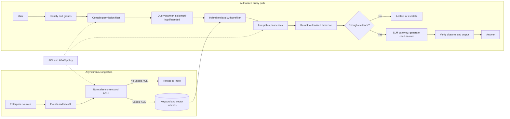

# G01 — Enterprise Knowledge Assistant: Interview Guide

> **Core idea:** This is not primarily a vector-search problem. It is a permission-aware RAG problem. Different employees can ask the same question and legitimately need different answers.

## G01 is the anchor case study

Use this guide as the **master case study** for enterprise RAG and knowledge-assistant interviews. Learn the shared architecture here, then adapt it to each variant's dominant constraint.

| Related case | What changes from G01 |
|---|---|
| **Enterprise Support Assistant** | Support knowledge, tickets and runbooks become central; add workflow integrations, escalation paths and customer-specific visibility. |
| **Legal RAG** | Increase citation precision, source authority, version tracking, auditability and review; control cost while handling high-risk answers. |
| **Sub-100ms Search** | Latency dominates; use permission-aware precomputation and caches, bounded retrieval and often remove live generation from the hot path. |
| **Enterprise / LLM Search** | Emphasize broad source coverage, relevance, freshness, scale and search UX; preserve the same authorization boundary. |
| **Meridian Assist** | Keep the enterprise-assistant foundation, then adapt source systems, users, workflows and domain-specific policies to the scenario. |
| **Security / incident cases** | Focus on threat model, blast radius, detection, containment, revocation, recovery and evidence that no unauthorized data escaped. |

~~~text
                         G01
          Enterprise Knowledge Assistant
                           |
       +-------------------+--------------------+
       |                   |                    |
 Enterprise Support     Legal RAG      Enterprise / LLM Search
       |                   |                    |
       +----------+--------+--------------------+
                  |                             
       Sub-100ms Search, Meridian Assist, Security / Incident cases
                  |
     Same core: identity → authorization → retrieval → grounded answer
       Adapt the data, workflow and dominant quality constraint
~~~

## 0. The mental model

~~~text
User
  ↓
Identity
  ↓
Authorization
  ↓
Query understanding
  ↓
Permission-aware retrieval
  ↓
Rerank
  ↓
Evidence selection
  ↓
LLM
  ↓
Citation / policy verification
  ↓
Answer / Abstain / Escalate
~~~

**The LLM is never the authorization system.** If the user cannot see a document, that document must not enter the model context.

---

## 1. How I would open

> “Anyone can build multi-source RAG. The difficult part is that a Tier-1 agent, a Tier-3 engineer and an account manager may ask the same question but should see different information. So I’ll treat permission fidelity as the primary constraint and optimize retrieval quality inside that boundary.”

### Questions to ask the interviewer

Ask the questions that change a design decision. The [source case, §1](G01_Enterprise_Knowledge_Assistant.md#1-name-permission-fidelity-as-the-constraint-before-drawing-anything) expands these into the full discovery table.

| Question to ask | What it's really asking | What you then decide |
| --- | --- | --- |
| Which source is authoritative for each content type, and what if sources disagree? | If Confluence says one SLA and the handbook PDF says another, which one do we quote? | Source ranking, how conflicts are shown, and whether to flag uncertainty. |
| Must inherited permissions and group changes be checked live, or is bounded sync lag acceptable? | If someone just left a group, can they still get last week's docs in the answer? | Live auth vs a named stale window. |
| How fast must updates, deletions, and access revocations take effect? | If a doc is deleted or access is revoked, how long can it still appear in an answer? | Freshness SLO, tombstones, and how often you reconcile. |
| Should answers synthesize across sources, and do citations need a passage or whole document? | Can we blend three docs into one answer, and must the citation be the exact paragraph? | Evidence mix, context budget, and citation grain. |
| What should happen when evidence is weak, retrieval fails, or sources conflict? | If we only have a maybe, do we still answer, or say we don't know? | Answer, mark stale, abstain, or escalate. |
| Who asks questions, who investigates wrong answers, and who owns an over-sharing incident? | When an intern sees a salary doc they shouldn't, who gets paged — and who may open the traces? | Personas, incident owner, and who can inspect traces. |
| What are p95 latency, scale, residency, retention, and cost limits? | How fast, how many users, which country the data must stay in, and what we can spend? | Latency budget, partitioning, region, and how long logs are kept. |
| Who may inspect traces, and what must an audit reconstruct? | After a leak scare, can we prove which docs went into the model and who was allowed to see them? | Logged IDs, versions, policy, evidence, and citation set. |

If answers are unavailable, state the assumptions before drawing: read-only, query-time permission checks, passage citations, and fail-closed behavior on uncertain access.

**Default MVP:** read-only Q&A; Drive, SharePoint, Slack, wiki and tickets; multi-tenant; ABAC/ACL-aware; query-time authorization; passage citations; sub-3-second chat target; no write-back, personal files, unapproved web, cross-tenant search or persistent memory.

---

## 2. Requirements: Functional + Non-Functional

The easiest way to frame requirements in an interview is:

> **Functional = what the system does. Non-functional = how well it does it and what constraints it must satisfy.**

### Functional requirements — what the system must do

1. **Ingest enterprise sources** — Drive, SharePoint, Slack, Confluence/wiki, Jira/tickets, etc.
2. **Normalize permissions** — convert source-specific ACLs/groups into a common authorization model.
3. **Retrieve authorized content** — unauthorized chunks must never enter model context.
4. **Answer questions** — use retrieved evidence rather than unsupported model knowledge.
5. **Provide citations** — citations should point to the actual supporting, authorized evidence.
6. **Abstain when necessary** — if evidence is weak or unavailable, do not guess.
7. **Handle changes** — propagate document updates, deletions, ACL changes and revocations.
8. **Support different personas/tenants** — the same query can legitimately produce different results.
9. **Audit decisions** — preserve enough information to explain why an answer was produced.

### Non-functional requirements — how well / under what constraints

| Requirement | Example target / constraint |
|---|---|
| **Security** | Zero unauthorized disclosure; fail closed on authorization failure |
| **Latency** | Chat target around p95 <3s; tighter targets need caching/precomputation |
| **Freshness** | ACL changes/deletions reflected within a defined SLO |
| **Scalability** | Example: 100k employees, 50M chunks, 100 QPS peak |
| **Availability** | Degrade safely when retrieval/reranking/LLM components fail |
| **Cost** | Define a cost/request budget and control model + retrieval spend |
| **Auditability** | Replay why an answer and authorization decision occurred |
| **Reliability** | Idempotent ingestion, retries, backfill and reconciliation |
| **Maintainability** | Centralized, deterministic authorization rather than scattered permission logic |

### Interview shortcut

If asked **“What are the requirements?”**, say:

> **“Functionally, I need to ingest enterprise data, understand permissions, retrieve only authorized evidence, and generate a cited answer or abstain. Non-functionally, the big constraints are zero data leakage, permission freshness, latency, scalability, cost, and auditability.”**

---

## 3. Architecture

Think in two planes.

### Control plane

Identity mapping, ACL/ABAC policy, source configuration, retrieval configuration, model routing, evaluation, audit policy and admin controls.

### Data plane

Ingestion, normalization, indexing, query authorization, retrieval, reranking, evidence selection, generation, citation verification and response/escalation.

### Architecture diagram

This is the interview-size version of the [source architecture, §5](G01_Enterprise_Knowledge_Assistant.md#5-draw-the-architecture-end-to-end).

### Step-by-step architecture

- **Step 1.** **Ingest sources.** Source events and backfills bring enterprise documents into an asynchronous pipeline.
- **Step 2.** **Normalize permissions.** Convert content and source ACLs into a consistent form; refuse to index an item if it has no usable ACL.
- **Step 3.** **Build the search indexes.** Put eligible content into keyword and vector indexes for hybrid retrieval.
- **Step 4.** **Establish the user's scope.** Authenticate the user, resolve groups and attributes, compile the ACL/ABAC permission filter, and plan a multi-hop question only when needed.
- **Step 5.** **Retrieve and check.** Run hybrid search with that filter, then apply a live policy post-check before any candidate reaches reranking or the model.
- **Step 6.** **Select evidence.** Rerank only authorized candidates and decide whether the evidence is sufficient; abstain or escalate if it is not.
- **Step 7.** **Answer and verify.** The LLM gateway generates a cited answer from authorized evidence; citation and output checks run before returning it.

**Model and agent role:** This is an LLM-powered RAG assistant. A query planner may decompose a multi-hop question, but it does not grant access; deterministic ACL/ABAC checks decide what the LLM may see. The LLM gateway handles generation and model routing after those checks. It is not a free-running write agent.

### Trust boundary

~~~text
Retrieve only what the user may see
              ↓
        final policy check
              ↓
             LLM
~~~

Forbidden content must stay outside the model context.

---

## 4. Ingestion: normalize permissions first

A connector does more than download documents. It translates each source's permission model into one internal representation.

Keep:

- stable source/document ID
- tenant
- owner
- version
- updated-at
- principals/groups
- classification
- deletion/tombstone state
- ingestion checkpoint
- ACL/index version

Typical source concerns:

| Source | Main risk |
|---|---|
| Drive | Inherited sharing, personal files, external sharing |
| SharePoint | Broken inheritance, stale site/library permissions |
| Slack | Private channels/DMs, secrets, prompt injection |
| Wiki | Page restrictions, stale policy, malicious content |
| Tickets | Customer visibility, PII, exact ticket/error identifiers |

**Rule:** no usable ACL means do not silently assume “internal”. Embeddings are derived search state, not the permission authority.

---

## 5. Freshness and deletion

Use:

~~~text
Source event
 → Queue
 → Fetch authoritative record
 → Normalize content + ACL
 → Index / tombstone
 → Reconciliation
~~~

Use change events where possible, idempotent processing, backfill, tombstones and periodic reconciliation.

Important distinction:

> **Authorization correctness and freshness correctness are different checks.**

A connector can miss a delete while the ACL still looks valid. If freshness is outside the agreed SLO, fail closed or clearly withhold/label the answer.

---

## 6. Authorization: two layers

### Layer 1 — Pre-filter

Compile the user's identity/attributes into the search filter.

Examples: tenant, groups, clearance, region, project, customer/account, classification.

This improves retrieval quality and latency because forbidden documents never compete for top-k.

### Layer 2 — Authoritative post-check

Before generation, verify the final evidence set again.

This catches:

- live revocation
- stale ACLs
- time-based embargoes
- need-to-know rules
- redaction obligations
- changes between retrieval and generation

### Why not only post-filter?

If top-10 contains six forbidden documents, filtering afterward leaves only four useful candidates. The user may miss relevant authorized evidence.

> **Pre-filter for efficiency and recall. Post-check for correctness.**

---

## 7. ABAC

ACL asks “can this principal access this document?”

ABAC can combine:

- user tenant
- groups
- department
- clearance
- region
- document classification
- customer/account
- time window

Authorization stays deterministic. **Never ask the LLM to decide whether a user is allowed to see something.**

---

## 8. Retrieval

Use hybrid retrieval.

**Dense search:** semantic similarity and paraphrases.

**BM25/lexical search:** ticket IDs, error codes, policy IDs, product names and exact identifiers.

**RRF:** combine rank from dense and lexical systems.

Then rerank the **authorized** candidate pool.

Correct order:

~~~text
Authorize
 → Retrieve
 → Fuse
 → Rerank
 → Select evidence
 → Generate
~~~

Not retrieve → rerank everything → remove forbidden documents.

---

## 9. Reranking and context

Reranking improves ordering but adds latency/cost.

Use it for ambiguous queries or when quality justifies it. Reduce or skip it for safe cache hits, high-confidence single-source answers and very tight latency targets.

Do not stuff the entire top-k into the prompt.

Use:

1. authorized candidates
2. rerank
3. evidence selection
4. compression if needed
5. generation

A small, high-quality evidence set is usually better than prompt stuffing.

---

## 10. Generation, citations and abstention

The LLM should answer from selected evidence.

~~~text
Evidence
 → Answer
 → Citation builder
 → Citation verifier
 → Output policy
 → User
~~~

Every citation must refer to evidence the user is authorized to see and that actually supports the claim.

If evidence is insufficient:

> **Abstain.**

Possible outcomes:

- Answer
- Answer with limitation/staleness warning
- Abstain
- Escalate

---

## 11. Prompt injection

Retrieved documents are **data, not instructions**.

A wiki page can contain malicious text telling the model to ignore its instructions. The model must not turn that into a tool action or security decision.

Use:

- clear instruction/data boundaries
- deterministic authorization
- tool gateway
- allowlisted tools/actions
- argument validation
- output checks
- human approval for risky writes

Prompt injection is not solved by prompting alone.

---

## 12. Evaluation

Evaluate separate layers.

### Retrieval

- Recall@k
- MRR/NDCG where useful
- exact-match retrieval for IDs/errors
- source coverage

### Grounding

- answer supported by evidence
- citation correctness
- citation completeness

### Security

- unauthorized retrieval
- unauthorized citation
- cross-tenant leakage
- revoked/deleted document tests

**Leakage is a release gate, not merely a metric.** One exposure blocks release.

### Freshness

Test update, deletion, ACL revocation and reconciliation lag.

### Operations

Track p50/p95/p99 latency, token usage, cost/request, cache hit rate, escalation rate, connector lag, index freshness and model/version changes.

---

## 13. Persona-based testing

Create a persona × document visibility matrix.

Example personas:

- Tier-1 support
- Tier-3 engineer
- account manager
- security/admin
- external contractor
- cross-tenant user

Run the same questions as each identity.

The question is not just “did we get the right answer?” but:

> **“Did each persona get the right authorized answer?”**

Include negative cases where the correct result is zero accessible documents.

---

## 14. Observability and audit

A replayable trace should capture, subject to privacy policy:

- request ID
- identity/tenant reference
- source event/version
- ACL/index version
- policy decision
- retrieved IDs
- final evidence/citations
- model/version
- prompt/template version
- stage latency
- cost
- output policy decision

The audit system itself needs access control.

---

## 15. Scale and latency

Use round numbers as reasoning examples.

| Number | What it forces |
|---|---|
| 100k employees | ACL/identity cardinality |
| 50M chunks | Refresh/deletion problem |
| 20 QPS | Average load |
| 100 QPS | Peak serving pressure |
| <3 s | Chat-grade target |
| <8 s | Relaxed interactive target |
| ~100 ms | Generation cannot stay on the hot path |

At 100 QPS and ~3 seconds of generation, there can be roughly 300 in-flight generations. That is a serving problem.

Latency should be budgeted across:

**identity/auth → retrieval → rerank → generation → verification**

Use permission-aware caching, bounded top-k, selective reranking, model routing, async ingestion and circuit breakers.

**Timeouts must degrade safely; they must never fail open.**

---

## 16. Scalability, latency & cost: production design

Use one framework: **measure the workload, find the bottleneck, then bound or route the expensive work without weakening authorization or answer quality.**

| Concern | What drives it | Production choices | What to measure |
|---|---|---|---|
| **Scalability** | Corpus size, peak QPS, ACL/group cardinality, ingestion churn | Separate asynchronous ingestion from serving; partition/shard by tenant or useful scope; incremental indexing and tombstones; bounded candidate sets; scale stateless serving independently | Peak and sustained QPS, queue lag, index freshness, retrieval capacity, error rate |
| **Latency** | Identity/policy lookup, retrieval, reranking, generation and verification | Apply authorization in retrieval; keep top-k bounded; rerank selectively; parallelize independent safe work; use permission-aware caches; stream when useful; set stage deadlines and degrade to safe partial results or abstention | p50/p95/p99 per stage, timeout rate, cache hit rate, time to first token |
| **Cost** | Embedding/index refresh, search, reranking, model calls and context tokens | Incremental/batched embeddings; route simple tasks to smaller models; compress evidence; cap top-k/context; rerank only when expected quality gain justifies it; cache only with permission/version-aware keys | Cost per request and tenant, tokens, embedding/index spend, rerank rate, cost by route |

### How to reason through it in an interview

1. **Quantify first.** Ask for corpus size, average and peak QPS, concurrency, freshness/revocation SLO, p95 target, quality target and cost budget. State assumptions if the interviewer has no numbers.
2. **Protect the invariant.** Authorization pre-filtering and the final policy check stay in place. A timeout or cache hit must never bypass permissions or serve stale revoked content.
3. **Optimize the measured bottleneck.** Profile each stage before choosing a fix. Reduce candidate count or skip reranking only when evaluation shows quality remains acceptable; route up to a stronger model for high-risk or difficult synthesis.
4. **Scale ingestion separately.** Queue connector work, make it idempotent, process changes incrementally, and reconcile periodically. This prevents backfills from competing with interactive serving.
5. **Set safe degradation paths.** On a deadline, stop optional reranking or return fewer verified results; if authorization/freshness cannot be established, fail closed and abstain.
6. **Prove the trade-off.** Replay representative queries across personas and track answer quality, citation correctness, leakage, latency and cost together. Zero leakage remains a release gate.

**Interview-ready answer:**

> “I’d start by quantifying corpus size, peak QPS, freshness, latency and cost targets. I’d separate asynchronous ingestion from online serving and scale retrieval and generation independently. On the query path I’d enforce permissions inside retrieval, keep top-k and context bounded, and use reranking and model size selectively based on measured quality. I’d cache only with tenant, permission and index or policy versions in the key, and invalidate on changes. Then I’d track p95 by stage, cost per request, freshness and answer quality together. Under pressure I can skip optional work or abstain, but I never relax authorization.”

---
## 17. Safe caching

Never cache simply:

~~~text
query → answer
~~~

Use a key containing at least:

~~~text
tenant
+ permission signature
+ index version
+ query
~~~

Potentially also model/prompt version.

Invalidate on ACL changes, deletes, source updates and index/policy changes.

---

## 18. Multi-tenancy

Isolation should exist across:

- identity
- authorization
- retrieval filters
- cache keys
- storage/index partitioning
- audit
- evaluation

A cross-tenant principal with broad groups must still return zero results for another tenant.

---

## 19. Failure playbook

**Retrieval down:** partial safe coverage or abstain; never invent.

**LLM down:** retrieval-only result if useful/safe, otherwise abstain.

**Connector down:** serve only data still inside its freshness SLO.

**Permission service down:** fail closed.

**Missed deletion:** tombstone + reconciliation + revalidation.

**Reranker too slow:** smaller candidate set, cheaper reranker or selective reranking.

**Embedding model changes:** version index, offline eval, staged cutover and rollback.

**Long context hurts quality:** tighten evidence and compress.

---

## 20. Cost optimization

Think:

~~~text
Measure
 → Route
 → Bound
 → Compress
 → Selective rerank
 → Cache safely
~~~

Use smaller models for classification/routing, calibrated top-k, selective reranking, evidence compression, batch embeddings and incremental indexing.

For legal/high-risk RAG:

~~~text
auth
 → tenant/ACL filters
 → hybrid retrieval
 → optional rerank
 → compressed evidence
 → cited answer
 → audit
~~~

Simple clause lookup can use a cheaper model. High-risk synthesis can escalate.

---

## 21. 100 ms pivot

At ~100 ms, ordinary end-to-end generation cannot remain on the hot path.

Use:

- cached embeddings
- cached permission-aware retrieval
- verified semantic answer cache
- pre-filter inside search
- selective/skip reranking
- precomputation for common queries
- streaming where appropriate

This becomes closer to a permission-aware search product with a cached-answer layer.

---

## 22. Databricks

Important lesson:

> **Governed source data does not automatically make a copied search index governed.**

Verify:

- where identity is evaluated
- how revocation propagates
- whether the index can inherit source governance
- how row/column controls interact with indexing
- deletion/ACL SLO

Ask the interviewer:

1. Is Unity Catalog the governance boundary today?
2. Are groups SCIM-synced or managed in-workspace?
3. How faithfully must source permissions be mirrored?
4. What is the revocation SLO?

Prove the design with a persona-by-document visibility matrix rather than only verbal claims.

---

## 23. Interview story

Opening:

> “I built an enterprise AI search system where the hardest part wasn't finding the right answer. It was making sure the same question produced the right answer for the right person.”

Five beats:

1. **Problem:** multiple roles need different slices of the same information.
2. **Decision:** authorization becomes a retrieval constraint.
3. **Design:** normalize ACLs → pre-filter → retrieve → post-check → rerank → evidence → generate → verify.
4. **Lessons:** bad test labels, untested security rules and model-based security decisions can all mislead you.
5. **Limitation:** a small corpus can make retrieval strategies look similar; large-scale retrieval claims need a representative corpus.

---

## 24. Interview trigger → answer

| Interviewer asks | Mental trigger |
|---|---|
| Functional vs non-functional? | What it does vs how well/under what constraints |
| Why not post-filter? | Wastes top-k and hurts recall |
| Why two checks? | Fast pre-filter + authoritative post-check |
| ACL changes? | Query-time enforcement |
| Deletion missed? | Tombstone + reconciliation |
| Why hybrid? | Semantic + exact match |
| Why rerank after auth? | Rank only authorized pool |
| Prompt injection? | Retrieved text is data |
| Hallucination? | Evidence + citation + abstain |
| Scale? | Peak QPS + refresh |
| No leaks? | Fail closed + leak suite |
| 100 ms? | Remove generation from hot path |
| Cost? | Route + bound + selective rerank + cache |
| Databricks? | Verify governance at the index boundary |

---

## 25. 60-minute delivery

| Time | Focus |
|---|---|
| 0–2 min | Problem + permission constraint |
| 2–5 min | Clarifying questions + requirements |
| 5–10 min | Architecture |
| 10–20 min | Permission model |
| 20–30 min | Retrieval + reranking |
| 30–40 min | Generation + citations + security |
| 40–50 min | Scale + latency + cost + reliability |
| 50–60 min | Evaluation + incidents + close |

### Final mental model

> **Permission first. Retrieval second. Generation third.**

Remember the flow:

**Identity → Authorization → Pre-filter → Hybrid retrieval → Rerank → Evidence → LLM → Verify → Answer/Abstain/Escalate.**

And the release rule:

> **Leak count must be zero.**
