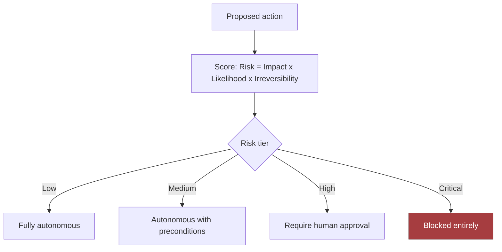
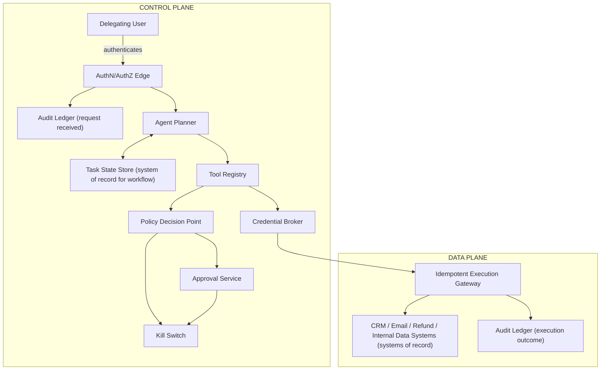
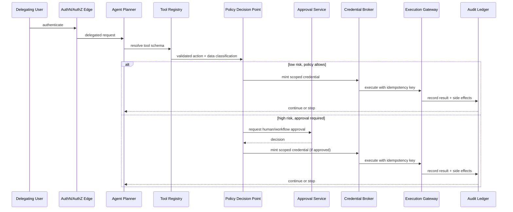
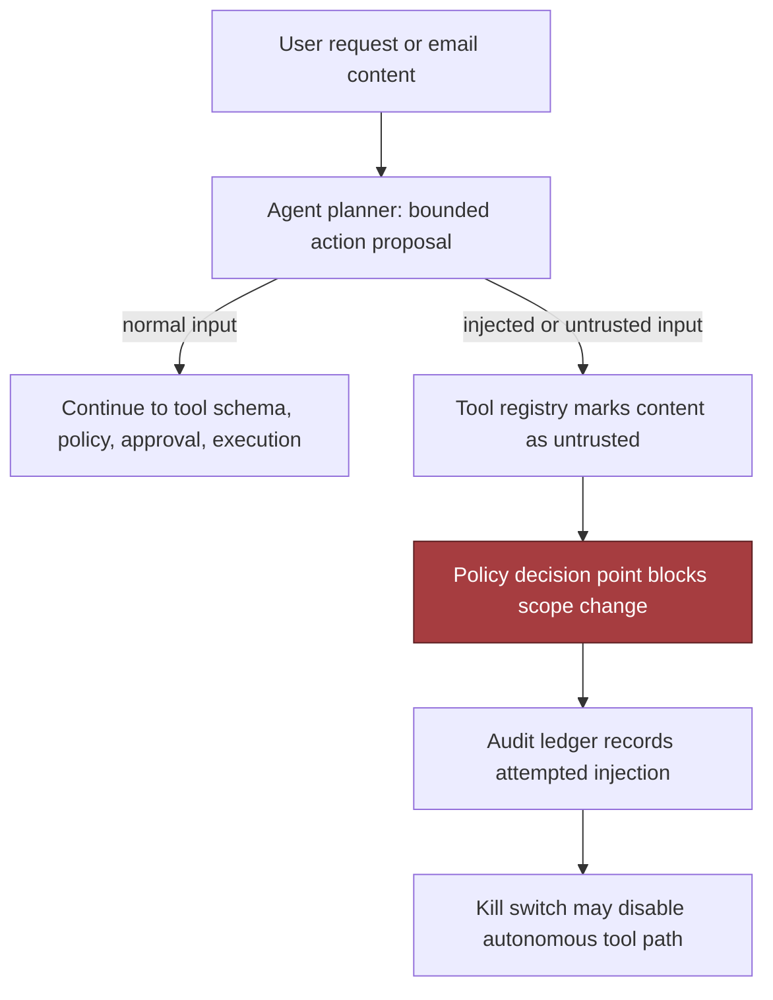
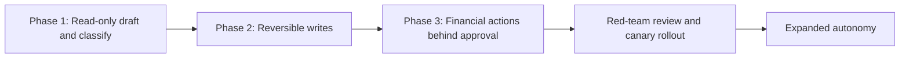
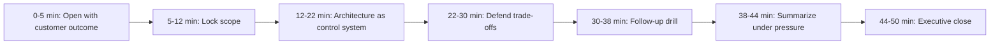

# Tool-Using AI Agent with Safety Controls

*Let the model act on email, CRM and refunds without ever letting it decide, because usefulness comes from acting and trust comes from never deciding.*

◷ 38 min

The hard part of this system is not getting a model to call a tool. It is that an agent which reads email, queries systems, updates CRM and issues refunds has to be useful without holding any authority. So the model proposes and deterministic systems decide. This page consolidates group G03 of `CASE_STUDY_INDEX.xlsx` into one read for the day before. Everything else in the group is a delta on it.

| Case in the group | What it contributes here |
|---|---|
| #22 Tool-Using AI Agent with Safety Controls (anchor) | Sections 1 to 10: the design, requirements, evaluation and rollout |
| #1 Enterprise AI Assistant over 100+ internal applications | Section 6: REST, function calling, MCP and agent frameworks as layers; the tool registry at scale; identity propagation |
| #50 OpenAI Q6, AI Agent for Enterprise Workflow Automation | Section 11: the focus list and the refund follow-up |
| #82 Reported Salesforce prompt: agent loop, tool interfaces, memory, orchestration, safety | Section 6 and 11: the loop shape and the Tier 2 probes |
| #90 Incident: refund tool called above the approval threshold | Section 13 |
| #107 and #118 §15 scenarios: agent loops on tools, tool workflow times out | Section 12 |
| #22 self-drill: the agent gets slow and expensive | Section 12 |

---

## 1. Name the Model as the Proposer, Never the Authority

Open with the disagreement, not the feature list. The customer asks for an agent that reads email, queries internal systems, updates CRM records and issues refunds. Everyone nods at the feature list, then disagrees completely. Operations wants speed. Security wants hard approval gates. The support manager wants routine cases handled without friction. Finance fears irreversible money movement. That disagreement is the design problem. So restate the ask as a testable outcome: enable useful automation while deterministic controls govern identity, permissions, risk and irreversible effects. The consequence is that the model is not the authority. It interprets and proposes. Deterministic systems decide who may act, what may change and whether an action can be reversed.

> *"Let me restate the problem first. We need a tool-using agent that can read email, query internal systems, update CRM records, and sometimes trigger refunds, but the model itself should not have unchecked authority. So I'd frame the outcome as enabling useful automation while deterministic controls govern identity, permissions, risk, and irreversible effects."*

The three answer tiers show what that framing buys. The weak answer connects the agent to email and CRM and lets it issue refunds when it decides the customer deserves one. It makes the model the authority, hands it credentials instead of scoped capabilities, and has no defence against instructions hidden in a ticket. The average answer plans tool calls, checks permissions before each one, requires approval for large refunds, logs everything and adds retries. It still treats tool output as trusted, never bounds loops or spend, and adds retries without idempotency, which is how one refund quietly becomes two. The strong answer has the planner propose one bounded action. A typed schema validates it. A deterministic policy engine returns allow, block or needs-approval. A credential broker mints a short-lived token scoped to that single action. An idempotent gateway guarantees exactly one effect. Tool observations are untrusted data, never instructions. Loops, spend, refund amounts and destinations all have hard ceilings.

Then ask the questions that change what may be built, because a useful question is not the one that sounds thorough.

| Question to ask | What the answer decides |
|---|---|
| Which actions are reversible and which are not, and exactly where does the money boundary sit? | Whether the design is a control system with payment and escalation rules, or an assistant with tools |
| Does the agent act as the user, a service account, or a delegated actor with a narrow role? | Blast radius. Full-record access widens it; case-specific field access contains injection damage |
| What may the agent do on its own, what needs review, what must never happen automatically? | The autonomy matrix: action classes, thresholds, exception paths. Autonomy is never a single switch |
| Is email content untrusted input? | Yes, always. A message may carry instructions to override policy, exfiltrate data or trigger a tool |
| What must be logged, retained, reviewable or exportable for audit and disputes? | The ledger schema and retention; auditability is a design input, not an afterthought |
| How is the system disabled when something goes wrong? | The kill switch and the incident path. The interviewer wants to hear the system can be stopped before it is perfected |
| Which systems are the source of truth for identity, customer state and financial actions? | Where the planner reads and where it may never write |
| Is success fewer handling minutes, higher resolution rate, lower error rate or better satisfaction? | The metric the business inspects, which sets the autonomy threshold |

Map the people, because each stakeholder defines a different success condition.

| User | Workflow | Failure they notice first | What the agent gives them | Approval needed |
|---|---|---|---|---|
| Business user | Delegates inbox and case work, wants less manual handling | The agent stalls or does the wrong thing to a customer | Triage, drafts, prepared refund cases, closed loops on low-risk cases | None for reads and drafts |
| Approver | Decides when a risky action is allowed | A refund executed without them, or a queue that never drains | An approval record with reviewer, timestamp, rationale and the exact payload | They are the approval |
| Security owner | Defines identity, authorization and audit rules | A long-lived credential in a prompt, or a tool called on an injected instruction | Scoped tokens, a policy gate outside the model, a tamper-evident ledger | Signs off on each tool class |
| Tool and data owner | Owns email, CRM, customer DB, refund service | Their system called in unsupported ways, or duplicated writes | A declared schema per tool, idempotency keys, per-tool concurrency limits | Owns the revert procedure |
| Operator | Monitors, retries, escalates | No way to stop it, no way to explain a decision | Kill switch, runbook, replayable decision record | Runs containment |

State the assumptions where the interviewer withholds answers, ranked by risk. With no approval process defined, assume a conservative human gate on every irreversible action. With retention unspecified, assume enough is stored to reconstruct any action, and leave the exact period to customer policy. With tenancy unclear, assume strict isolation and a separate authorization check at every tool boundary. The CRM is the source of truth for customer context. Refunds above a threshold require approval. The agent may draft actions but cannot execute high-risk steps unless the policy engine allows it.

## 2. State Requirements as Testable Constraints

A requirement the customer cannot test is a preference. "It should be safe" is a preference; "no arbitrary command execution" is a constraint, and only the second one changes the architecture. Distinguish what the system must do, how safely it must do it, and what it must never do.

The six must-have functional requirements are a set, and interviewers ask for them cold. Separate planning from execution, so the model proposes a plan and a separate control layer decides whether any tool call is allowed. Validate tool name, arguments, identity and policy against an allowlist, a parameter schema, the caller's identity and the policy rules before anything runs. Use scoped, short-lived credentials, so the agent never holds a broad secret and receives only the minimum for the next approved step. Require approval for high-risk actions, meaning refunds, account changes and any irreversible external write cross a human boundary unless the customer accepts a narrower automated threshold. Make effects idempotent and auditable, so a retry cannot double-refund and every decision leaves a replayable trace. Stop safely under uncertainty: poor confidence, a malformed tool response, unclear policy or an inconsistent environment means pause, escalate or fail closed, never improvise.

Three should-haves belong in the first usable version. A declared registry with schema and data class for every tool, so undeclared tools cannot be called. A tested kill switch that halts autonomous paths without a deploy. Approval captured as a first-class record. The could-haves wait: richer policy expression, adaptive risk scoring, queued multi-step orchestration, replay tooling, operator dashboards, anomaly detection on action patterns, per-tenant policy overlays.

Declare the non-goals, because the strongest candidates draw a narrower boundary than the prompt suggests:

- free-form code execution or shell access
- open-ended tool discovery
- unbounded autonomous loops
- automatic refunds without approval thresholds
- cross-tenant data access
- self-modifying policy logic

The constraints are the lines that cannot be crossed, and each is stated so a test can fail it.

| Constraint | Stated so it can be tested |
|---|---|
| Latency | Model-planning time budgeted separately from tool time; p95 completion under about 15 seconds for low-risk tasks; approval queue time bounded by an escalation rule, for example 99.5% of approval requests leave the queue within 2 minutes |
| Availability | At 50,000 users and 20 QPS peak, 10 actions per task means roughly 200 tool actions per second. Reads parallelize; writes and approvals do not. Concurrency capped per user, per tool and globally |
| Cost | Hard ceilings on tool calls per task, per-task spend, refund amount and allowable destinations. These are guardrails, not tuning knobs |
| Security | Short-lived, narrowly scoped credentials minted per workflow; the model never holds a reusable API key or admin token. No arbitrary command execution. Tool observations are untrusted input |
| Audit and compliance | A tamper-evident ledger records intent, policy decision, approval and outcome for every action. Every decision is replayable from versioned prompts, policies, proposals and outcomes |
| Reliability | Writes fail closed when the credential broker or policy engine is unavailable; only the lowest-risk reads degrade. A write is never retried without proven idempotency |
| Operability | A rapid global disable for the agent, a tool category, or both, without a deployment cycle |

Every must-have then needs an owner in the architecture, and the traceability table is the proof.

| Requirement | Control point | Component |
|---|---|---|
| Separate planning from execution | Plan/execute boundary | Orchestrator that emits candidate actions but cannot perform them |
| Validate tool name, arguments, identity, policy | Policy gate | Authorization service with schema validation and allowlists |
| Use scoped short-lived credentials | Secret broker | Token minting layer with time-limited, least-privilege credentials |
| Require approval for high-risk actions | Human approval flow | Review queue with explicit accept/reject and reason capture |
| Idempotent, auditable effects | Action ledger | Durable event log and idempotency keys |
| Stop safely under uncertainty | Fail-closed controller | Error handler that pauses execution and alerts operators |
| No arbitrary command execution | Execution sandbox | Restricted tool adapters only, no shell escape |
| Bounded autonomous steps and spend | Budget governor | Step counter, retry cap, spend threshold |
| Replayable decisions | Decision record | Versioned prompts, policies, tool proposals, outcomes |
| Rapid global disable | Kill switch | Central feature flag or routing gate that stops all agent actions |

## 3. Size by Workload Shape and Risk, Not by Request Count

One request is not one unit of work. Use the planning anchor of 50,000 users, 10 actions per task and 20 QPS peak. Then separate three layers of load. How often tasks arrive. How many tool calls, model calls and policy checks each task triggers. How many actions can actually change records, money or permissions.

| Estimate | Number | What it forces |
|---|---|---|
| Planning decisions | 20 per second at peak; 40 to 60 model calls per second under iterative planning bursts | The planner is a queueing problem before it is a throughput problem; size planner and tool adapters separately |
| Tool actions | roughly 200 per second at peak | Reads parallelize; writes and approvals do not; concurrency caps must assume worst-case composition |
| Audit storage | ~5 KB decision record and ~20 KB audit trail per task, so 100 KB/s to 400 KB/s | About 8.6 GB to 34.6 GB per day of raw append-only data before indexing and replication |
| Planner compute | ~1 second of planner time per task, so about 20 core-seconds per second at peak | Reasoned about as a throughput-constrained service with slack for tail latency |

The estimate that most affects the design is not CPU. It is the ratio of model time to tool time, plus the irreversibility of tool effects. Planning fast and tools slow means invest in async orchestration, caching and queueing. Tool effects high-risk means invest in policy checks, staged execution and audit logging even at the cost of latency. Human review as the bottleneck means clearer escalation rules and fewer ambiguous cases.

Derive the risk tier before deciding autonomy. The decision aid is `Risk = Impact × Likelihood × Irreversibility`, not literal arithmetic. A low-impact read of a public FAQ can be fully autonomous. A CRM update can be partially reversible and still costly if it misroutes a customer. A refund may be technically reversible and still meaningfully irreversible through customer dissatisfaction, accounting noise or abuse. The tiers are fully autonomous, autonomous with preconditions, requires human approval, and blocked entirely.



Show the sensitivity range instead of false precision. The 10× growth case is the real test: which part breaks first, the planner, the approval queue, a tool adapter, the audit log or the refund service?

| Scenario | Task peak | Internal action pressure | Likely design implication |
|---|---|---|---|
| Baseline | 20 QPS | Moderate | Single queue, bounded retries, tight approval gate |
| 10x growth | 200 QPS | High | Partition by tenant or workflow class, add backpressure, move more work async |
| 10x lower | 2 QPS | Low | Simpler deployment may work, but keep safety controls identical |

Concurrency limits are a safety feature, not only a performance one. Cap per user, so nobody floods the system with parallel tasks; per tool, so a noisy downstream is not overwhelmed; and globally. Encode value limits too, so many low-risk reads are allowed while the number and value of refunds in flight stays bounded. A well-designed limit stops a prompt injection from becoming a cascade.

## 4. Draw the Architecture End to End

One diagram carries the whole design, and the organising split is control plane against data plane. The control plane decides what the agent is allowed to do, under what conditions and with which approvals. The data plane performs the bounded business work once those decisions are made. The model sits entirely inside the control plane's proposal step and never touches the data plane directly.

```
 ╔════════════════════════════════ CONTROL PLANE (decides what may happen) ═════════════════════════════════╗
 ║                                                                                                            ║
 ║  user ─> AuthN/AuthZ edge ─> AGENT PLANNER <──> task state store                                           ║
 ║            (delegation rights)   │ proposes ONE bounded action; forbidden from executing                   ║
 ║                                  v                                                                         ║
 ║                             TOOL REGISTRY   (allowed tools, arg schemas, data class, risk label)           ║
 ║                                  │ undeclared tool cannot be called; schema validation BEFORE policy       ║
 ║                                  v                                                                         ║
 ║                        POLICY DECISION POINT  ──> allow | block | needs-approval  + scopes + reason        ║
 ║                             │         │                                                                    ║
 ║                             │         └──> APPROVAL SERVICE (human sign-off bound to a snapshot + expiry)  ║
 ║                             v                                                                              ║
 ║                       CREDENTIAL BROKER  mints token: one tenant · one workflow · one action · one expiry  ║
 ║                             │                                                                              ║
 ║        KILL SWITCH ─────────┼── halts new tool calls, cancels queued work, revokes tokens, marks in-flight ║
 ║                             │                                                                              ║
 ╚═════════════════════════════╪══════════════════════════════════════════════════════════════════════════════╝
                               │ scoped token + idempotency key
 ╔═════════════════════════════╪═════════════ DATA PLANE (performs the bounded work) ═════════════════════════╗
 ║                             v                                                                              ║
 ║              IDEMPOTENT EXECUTION GATEWAY  (exactly one effect per proposal; replay returns the receipt)   ║
 ║                             │                                                                              ║
 ║                             v                                                                              ║
 ║        CRM · email · refund service · internal data  (systems of record; tool output is UNTRUSTED data)   ║
 ║                                                                                                            ║
 ║  AUDIT LEDGER (tamper-evident): request received · proposal · policy verdict · approval · receipt          ║
 ║  OBSERVABILITY: policy denial rate · unsafe actions · duplicate effects · approval delay · override rate   ║
 ╚════════════════════════════════════════════════════════════════════════════════════════════════════════════╝
```

The same flow as a rendered diagram, for viewers that draw Mermaid:



Read the nine components in dependency order, because that is the order they have to exist and the order they fail.

| Component | Responsibility | Trust boundary | Fails how |
|---|---|---|---|
| Agent planner | Propose the next bounded action, never execute | Model to control plane | Degrades: pauses and escalates on low confidence |
| Task state store | Track workflow progress and intermediate results | Durable workflow state, not business truth | Closed for writes: no state, no continuation |
| Tool registry | Declare allowed tools, schemas, data class, risk label | Approved tool catalog | Closed: undeclared tool cannot be called |
| Policy decision point | Return allow, block or needs-approval with scopes and a reason | Authorization and risk gate | Closed: unavailable means no writes |
| Credential broker | Mint one scoped, short-lived token per approved action | Identity and secret boundary | Closed for writes; reads degrade only where policy allows a cached path |
| Approval service | Capture human sign-off bound to a snapshot with expiry | Human-in-the-loop control | Closed: expired approval means re-request |
| Idempotent execution gateway | Exactly one side effect per proposal, replay returns the receipt | Execution safety boundary | Reconciles: uncertain writes go to a reconciliation state, never blind retry |
| Audit ledger | Intent, decision, approval, outcome, tamper-evident | Immutable trace layer | Closed: incomplete evidence means stop and escalate |
| Kill switch | Halt autonomous paths without a deploy | Operational safety boundary | Tested before launch; it is the last layer |

Four trust-boundary sentences are worth saying verbatim. The user boundary ends at authentication. The planner boundary ends at proposing intent, not action. The policy boundary ends at allow, deny or approve. The execution boundary ends at a scoped, logged side effect in a downstream system of record. Mark the systems of record explicitly. CRM owns customer attributes and refund history. The email system owns transport and inbox state. The internal data source owns account and entitlement data. The task state store owns workflow progress but not business truth. Caches may sit beside the planner or registry for low-risk lookups and must never become the source of truth for permissions or refunds.

Not every boundary is synchronous. "Plan the next action" and policy evaluation are synchronous, because a human waits on a gating decision. Tool execution may be synchronous for one low-latency action, but bulk and slow steps go through queues. Audit writes can be asynchronous as long as the log never falls behind the point where a failure becomes unrecoverable. Use backpressure when risk rises faster than capacity: if approvers are saturated, slow autonomous execution rather than letting risky actions accumulate. Partition by workflow or account, so all actions for one account share a key and two conflicting refunds cannot run in parallel.

## 5. Narrate One Request Before Drawing the Deep Dive

Walk the representative request in order without skipping a handoff. The request is: "Read the customer's email, check whether the account qualifies for a refund, update the CRM note, and issue the refund if policy allows." The interviewer should hear where control moves from the model to deterministic services and back.

1. Authenticate the delegating user. The front door verifies who is asking and what delegation rights they hold; a support agent is not a finance approver.
2. Plan the bounded next action. The planner selects the next smallest step, such as "retrieve the latest email thread", not the whole workflow.
3. Resolve the tool schema. The registry returns the exact contract, including field names and data sensitivity labels.
4. Validate arguments and data classification, for shape, missing fields, dangerous content and regulated data that changes handling.
5. Evaluate policy and risk. The decision point compares action, user role, data class and downstream effect against current policy; a note update may pass, a refund may need approval.
6. Obtain approval if required, captured as a record bound to the exact payload.
7. Execute with a scoped credential and an idempotency key, so a retry cannot duplicate the refund.
8. Record the result and decide whether to continue. The ledger stores input, policy result, approval outcome, tool result and side effects; the planner picks the next bounded action or stops.



The data model follows from the walk, and two records must never be conflated. AgentTask(id, actor, goal, state, step_budget). ToolDefinition(name, schema, data_class, scopes). ActionProposal(id, task_id, tool, args_hash, policy_decision). PolicyDecision(proposal_id, verdict, scopes, reason). ActionReceipt(proposal_id, idempotency_key, outcome). The proposal is the model's recommendation; the receipt is the only proof a side effect occurred. Arguments are canonicalized before hashing, so the same logical input always yields the same idempotency seed. A repeated key returns the stored receipt instead of calling the tool again, which is what makes retries safe. Schema validation runs before policy evaluation, so malformed arguments are rejected before any authorization logic executes.

## 6. Layer the Integrations and Propagate Identity Through Every Call

The tool layer is where the "agent over 100+ applications" case joins this one. REST, function calling, MCP and agent frameworks are layers, not competing technologies, and the test is whether they are treated that way.

```
 agent framework     coordinates more than one decision across a multi-step task
       ▲
 MCP                 how the model DISCOVERS which functions exist, without 1,500 hardcoded schemas
       ▲
 function calling    the model's mechanism for DECIDING to invoke one thing
       ▲
 REST / SOAP / SQL   what actually EXECUTES
```

REST is ideal when the interface is stable, operations are deterministic and no reasoning is needed. But a model does not natively understand authentication, endpoint discovery or request schemas, so REST alone never adds up to an assistant. Function calling works while the tool count is small. The model chooses reasonably among twenty functions. Scale to 1,500 functions across 100 applications and it breaks: prompt size explodes, selection gets inaccurate, every schema has to be maintained and re-embedded. MCP solves discoverability, one server per application advertising its tools and resources, so the assistant asks what is exposed instead of hardcoding schemas. MCP does not replace REST; REST remains the transport, and an MCP server may call REST, SOAP, SQL or a legacy system underneath. The axis that separates REST from function calling is who decides to make the call: fixed application code, or the model from natural language. Same wire call, two layers, because another REST endpoint is cheap and another function the model must choose between costs prompt space and accuracy.

| Technology | Best use |
|---|---|
| REST API | Direct application communication |
| Function calling | Small, deterministic tool execution |
| MCP | Enterprise tool discovery and standardised AI integration |
| Agent framework | Multi-step planning, orchestration, reasoning |

Agent frameworks earn their place when a request needs multi-step reasoning. "Prepare a renewal report for our top customers and email their managers" means finding customers, retrieving CRM data, generating a report, storing a PDF and sending an email. No single function coordinates that. A single agent suits one tool, a short workflow and deterministic execution. A multi-agent shape suits planning across many domains with independent specialists. "Create a Jira ticket" with an orchestrator would be overhead.

The tool registry is what makes this scale. Loading every MCP server up front does not scale. The registry sits between the planner and the universe of servers and loads only the ones relevant to the current task, keeping the prompt small. In this design the registry also carries the arg schema, the data class and the risk label. That is what lets the policy point decide without asking the model. At 500+ applications and 200,000 employees the rest of the scaling list is short:

- caching of employee profiles, org hierarchy and holiday calendar
- stateless horizontal scaling of planner, gateway and LLM routing
- per-user and per-application quotas, with circuit breakers against runaway agents
- async execution that returns a job ID for long workflows
- regional gateways, region-local MCP servers and data-residency controls

The security principle in one sentence: no application trusts the LLM; applications trust enterprise identity. Every request propagates the user's identity, an OAuth token, RBAC or ABAC, and an audit record, and the gateway attaches the identity so no backend ever trusts the model directly. That is identity propagation, and it is the same rule as the credential broker: the model receives context to reason with, never a secret to act with.

The reported Salesforce prompt asks for the loop, the tool interfaces, the memory design, the orchestration and the safety in one architecture, and the shape above answers it. The loop is propose, validate, decide, execute, record, repeat, with a step budget. Tool interfaces are the registry's typed schemas with data class and risk. Memory is the task state store for workflow progress plus the ledger for what happened, and neither is business truth. Orchestration is the planner choosing one bounded action at a time over a queue partitioned by account. Safety is every layer below the planner.

## 7. Hold the Four Security Controls as One Set

Security starts from the hostile case, not the happy path. A message that looks like ordinary customer email is a prompt injection asking the agent to ignore policy, pull a privileged record and issue an unauthorized refund. The right move is not to debate whether the model understands the instruction. It is to contain the blast radius, preserve evidence and keep every irreversible action behind deterministic checks. The model sees information; it does not inherit trust.

Four controls answer almost any "how do you secure an agent with tool access" question, and they are memorised as a set. Treat tool observations as untrusted. A CRM response, ticket thread, database row or fetched page can carry hostile instructions. If the model can read it, the model can be manipulated by it, so tool output is never a command, a policy override or an approval signal. Never give the model broad, long-lived credentials. A broker mints capability tokens tied to one tenant, one workflow, one action type and one expiry window. If the broker is down, writes fail closed. Validate output before downstream use. The model may propose "refund $5,000", and a $500 task limit rejects it however confident the model sounds. Validation is where policy becomes enforceable. Bound the dangerous dimensions with hard ceilings on tool calls, per-task spend, maximum refund amount, allowable CRM objects and destinations.

Blast radius is a design variable along four axes: tenant, region, workflow and dependency. A single-tenant outage beats a cross-tenant incident. A regional backlog beats a global write failure. A refund-workflow failure should not block email triage. A broker outage should not take down read-only analytics that can safely degrade. Defence in depth means no single control is load-bearing. The model is constrained by policy, the action layer validates output, the broker scopes identity, the gateway tracks idempotency, the ledger preserves evidence, and the operator can kill the workflow. When asked for the single most important control, name all six.

## 8. Fail Closed on Writes and Degrade Only Reads

Design the failure path with the happy path. Five rules organise the table. Reads that support a recommendation may degrade or queue. Writes that change customer state fail closed when authorization, validation or identity is uncertain. Irreversible effects require approval or a second deterministic check. A write is never retried without proven idempotency. Incomplete evidence means stop and escalate.

| Fails | Behaviour |
|---|---|
| Prompt injection requests an unauthorized tool | Detected by policy evaluation on the proposed action, not by the model's judgement. The tool is never invoked, the message and observation are preserved, the task is quarantined or routed to a human. The model never held a credential that could have succeeded |
| Tool succeeds but the response is lost | If idempotent, reconcile via the idempotency key or transaction record before any retry. If not, move to a reconciliation state, mark the action uncertain, escalate if the final state cannot be confirmed. Never repeat a write blindly |
| Approval becomes stale before execution | Approval is bound to a snapshot: tenant, record version, amount, expiry. If the snapshot no longer matches at execution time, the approval is invalid and is re-requested |
| Agent loops on the same action | Attempt counter, backoff, circuit breaker that opens after repeated failure. N attempts without a state change means stop and escalate |
| Credential broker is unavailable | Writes fail closed. Reads degrade only to a cached, non-sensitive path that policy explicitly allows. Queue the work, notify the operator, keep the evidence. Never fall back to a broad static secret to keep the demo alive |
| Proposal exceeds the task's refund limit | Validator rejects before policy runs, regardless of model confidence |
| Policy engine unavailable | Fail closed for every write. Say this row slowly |

Replay the path under the one failure that matters most. A malicious instruction arrives inside an email. The planner still extracts a bounded action. The registry marks the email content as untrusted. The policy decision point rejects any instruction that attempts to modify scope. The approval service is never reached. The ledger records the attempted injection. The kill switch can disable the autonomous tool path if the pattern repeats. This is where the control-plane split becomes concrete: the model may read adversarial content in the data plane, but that content must not rewrite policy in the control plane.



Before launch the team needs evidence and a runbook. Evidence shows which prompt version ran and which proposals were generated. It shows which validations passed or failed, which approval artifact was attached, which identity token was used and which external calls were made. The runbook tells an operator how to quarantine a workflow, revoke a capability, replay a safe read-only step and reconcile uncertain writes without making things worse. That record is what answers, after the fact, what happened, what was allowed, what was blocked and what the recovery path was.

## 9. Gate the Release on Unsafe Actions and Duplicate Effects

The two counts that gate every expansion are unsafe actions and duplicate effects, and both must be zero. High tool success with a rising duplicate-effect count is a deployment blocker, not a product victory.

| Metric | What it proves | Strong threshold | Dataset / method | Owner |
|---|---|---|---|---|
| Unsafe action count | The control boundary actually held | Zero in any sensitive workflow | Audit review, incident tickets, rule checks | Incident commander / ops lead |
| Duplicate-effect count | Retries and replays cannot double-charge | Zero; any occurrence alerts immediately | Idempotency logs and reconciliation reports | Reliability engineer |
| Policy denial rate | Denials reflect real policy, not a broken prompt | Stable against baseline; spikes investigated | Policy engine logs | Platform / trust-and-safety |
| Approval rate and delay | Human gates protect without stalling the workflow | Delay within SLO; rate stable | Approval service logs | Business operations |
| Tool success rate | Downstream systems are called in supported ways | Stable; failures alert when throughput stalls | Tool execution telemetry | Downstream system owner |
| Task completion rate | Automation finishes work without manual rescue | Holds or improves after each expansion | Workflow state machine, case closures | Product and FDE |
| Human override rate | The agent is earning its place in the queue | Low enough to justify the automation | Review UI, post-action edits | Operations manager |

Report four dashboard layers, because the customer buys workflow improvement under control, not model accuracy. Technical health is tool success, duplicate effects, error rate, queue latency, denial rate. Model quality is task completion, approval rate and delay, and how often a proposed action is later corrected. Adoption is override rate, usage by team, share of eligible requests routed through the agent. Business outcome is time to resolution, refund cycle time, backlog reduction and the customer KPI the workflow exists to move. A healthy service can still fail the business. A high denial rate may mean the guardrails work or the schema is too restrictive. A high override rate may mean the model underperforms or policy needs calibration.

Red-team before granting more power, as a release gate rather than a stunt. Feed the system emails, documents and ticket text with adversarial instructions hidden in legitimate content. Ask whether it can be steered into calling tools it should not, leaking context, or skipping approvals. The go/no-go for autonomy has three parts. The obvious attack paths were exercised. The policy layer rejected them. The agent degraded to read-only or human review instead of improvising around the control plane. The red-team list covers five attack families:

- indirect injection in CRM records, tickets, database rows and fetched pages
- over-broad credentials that turn one manipulated plan into fleet-wide access
- unvalidated proposals, such as a confident $5,000 refund against a $500 limit
- lost responses that a naive retry turns into a second refund
- stale approvals or action loops that authorize the wrong state or retry into a bill

## 10. Roll Out Read-Only First and Keep Money Behind a Human

Autonomy is earned in phases, and the go/no-go at each phase is a control claim, not a model claim.



| Week | Gate |
|---|---|
| 0-1 | Classify every action by reversibility and financial impact; name the approver for each risky class |
| 1-2 | Read-only triage and drafting, no write path at all. Exit when drafts are useful for a defined slice, the policy layer blocks disallowed actions correctly, and every recommendation traces back to inputs and tool calls |
| 2-3 | Prove reversibility on a narrow set of CRM writes. Each tool has an owner, a documented revert procedure and an idempotency strategy |
| 3-4 | Add write paths only where rollback is demonstrated; every financial action stays behind a human. The gate is "the tool succeeded, the change was logged, the revert path exists, duplicates are under control" |
| 5 | Red-team the prompt with hostile tool observations before any additional power |
| 6-8 | Canary a small representative slice; watch policy denials, duplicate effects, approval delay and override rate; stop and fix on any of them |
| After | Expand autonomy only where unsafe-action count stays at zero and duplicate effects never appear |

A practical approval gate includes reviewer identity, decision timestamp, policy rationale and the exact payload that will execute. An approval that ages out expires rather than executing later. A policy change updates the gate before the next rollout step, not after an incident.

Keep a risk register with the shape risk, owner, mitigation, trigger, rollback, and reuse it for any de-risking question. Prompt injection causes an unauthorized tool call: security reviewer; injection tests, allowlists, policy checks, read-only fallback; any confirmed unauthorized attempt; disable autonomous tool calls and revert to human review. Duplicate CRM writes after retries: reliability engineer; idempotency keys, reconciliation jobs, replay-safe contracts; any duplicated side effect; pause write traffic and drain the queue. Refund approvals stall operations: finance operations lead; approval SLAs, escalation path, reviewer training; delay exceeds target or queue depth climbs; narrow the eligible refund scope or route more to manual.

The rollout is also a training and support plan. Users need to know what the agent can do, what it will refuse, how approvals work and how to escalate when a result looks wrong. Support needs a runbook for inspecting logs, finding the policy rule that fired and recovering a stuck workflow. Build the approval service, idempotency layer, policy engine and ledger as shared services, and keep the customer-specific pieces, CRM fields, refund rules, routing and thresholds, in configuration and adapters. The durable product asset is the control plane.

## 11. Deliver It in Fifty Minutes

Organise the sketch around trust boundaries, not the model, and spend minutes where the stakes are: identity, authorization, duplicate execution and malicious instructions. A weak answer covers prompts, vector search, OCR, channels and regions at once; a better one narrows by risk.



| Minutes | Phase |
|---|---|
| 0–5 | Open with the customer outcome and the hidden constraint (section 1); invite redirection: strict safety, lower latency or faster rollout |
| 5–12 | Lock scope: what may the agent do versus suggest, which actions are reversible, dollar thresholds, staged CRM updates, stable identifiers (sections 1 and 2) |
| 12–22 | Architecture as a control system: model plans, policy decides, gateway executes, ledger records, state machine tracks (sections 4 and 5) |
| 22–30 | The four trade-offs (below) |
| 30–38 | The follow-up drill (below) |
| 38–44 | What to build first: read-only, then reversible writes with approval, then low-value automated writes, refunds last (section 10) |
| 44–50 | The ninety-second decision memo |

The four trade-offs each have a resolved shape, "give a little here to protect X", and interviewers probe exactly these pairs.

| Trade-off | Resolution |
|---|---|
| Agent flexibility vs deterministic workflow | Flexible interpretation, deterministic execution. The model drafts, the workflow validates; letting the model choose the final action raises variance, audit complexity and blast radius |
| Fine-grained scopes vs integration burden | Optimise scopes around irreversible effects first, then simplify with shared auth patterns and reusable wrappers |
| Automatic execution vs approval latency | Tiered automation: low risk auto-runs, medium risk queues for review, high risk needs explicit approval or a second check. Accept approval latency to protect against irreversible financial harm |
| Central tool gateway vs direct integrations | The gateway is the default, because it is the one place for auth, policy, audit, idempotency and schema validation; direct integrations multiply the places a bad prompt can reach a write API |

The follow-ups arrive in a predictable order, and each has a prepared answer.

| Follow-up | Answer |
|---|---|
| Can the model hold credentials? | No. It receives the minimum context to reason, never a long-lived secret. Credentials live in a secrets manager or token broker; the model requests an action and a trusted service mints a constrained token for that exact operation |
| How do you stop duplicate refunds? | Idempotency at the business-action layer, not only the API layer. Every refund carries a durable identifier tied to case, customer and policy decision; before execution the workflow checks whether it completed, is in flight or partially applied, and on retry returns the existing outcome |
| What if the email contains malicious instructions? | Assume it will. Email is untrusted input, never command authority. The model classifies and extracts facts and does not obey embedded instructions about overrides, credentials or approvals. Prompt separation, tool allowlisting, policy outside the model, strict role boundaries |
| How does the kill switch work mid-task? | More than a flag on new requests: halt new tool invocations, cancel queued workflows, revoke or expire delegated tokens, and mark in-flight tasks so downstream services reject completion. The state machine makes the pause point explicit |
| OpenAI Q6, an agent that reads incoming requests and performs actions across Salesforce, SAP, Jira and email: "The agent wants to issue a refund. Should it be allowed to do so automatically?" | Only below a threshold, only as a delegated actor with a scoped token, only through the idempotent gateway, and only where the revert path is proven. Above the threshold it creates a proposed refund ticket for approval. Assume the model will occasionally be wrong and design so the blast radius is limited |
| How do tool schemas reduce hallucinated actions? (Tier 2) | Typed arguments, enums over free text, required fields, a data-class and risk label per tool, and validation before policy so a malformed proposal never reaches authorization |
| How do you sandbox tool execution? | Restricted adapters only, no shell escape, per-tool concurrency limits, and a gateway that is the only path to any write API |
| How do you control cost explosions from runaway tool calls? | Step budgets per task, retry caps, a circuit breaker on repeated identical calls, per-user and global concurrency, and a spend ceiling that trips the kill switch |
| When do you route to a human, and how does auditing drive that? | On risk tier, on low confidence, on policy ambiguity, on any inconsistency. The ledger's denial and override rates recalibrate the thresholds |
| Circuit breakers, rate limits, degradation when the model is unavailable? | Per-tool breakers, per-user and per-tool quotas, and degradation to read-only or human-review mode, never to a bigger static credential |

The ninety-second decision memo that closes the round:

> *"We're building an agent that turns unstructured email into safe operational action, but we are not giving the model unchecked authority. The model handles interpretation and recommendation; deterministic services handle identity, authorization, idempotency, approvals, audit, and execution. The key trade-off is flexibility versus control: we accept some workflow rigidity so that refunds and CRM writes are gated, logged, and reversible where possible. The first gate is not 'the agent can do everything'; it is that the control plane demonstrably prevents unauthorized actions, duplicate execution, and uncontrolled side effects."*

The interviewer will challenge the riskiest assumption: "what if the email itself is trying to steer the agent into a refund it should not make?" Answer calmly and specifically. The email is untrusted input for classification and extraction only. The policy engine outside the model decides whether the request is eligible for any write path. The workflow requires a durable action record plus approval for risky cases. Content that looks like injection or conflicting instructions fails closed.

The two-minute spoken answer, for when the whole design has to fit in a summary:

> *I would not start with the model. The customer asks for an agent that reads email, queries internal systems, updates CRM records, and issues refunds, and everyone nods at the feature list before disagreeing completely: operations wants speed, security wants hard gates, finance fears irreversible money movement. That disagreement is the design problem. So I would restate the outcome as enabling useful automation while deterministic controls govern identity, permissions, risk, and irreversible effects. The crucial consequence is that the model is not the authority: it can interpret and propose, but deterministic systems decide who may act, what may change, and whether an action can be reversed. Concretely, the planner proposes one bounded action, a typed schema validates the arguments before policy even runs, a deterministic policy engine returns allow, block, or needs-approval with the scopes it grants, a credential broker mints a short-lived token tied to one workflow and one action type, and an idempotent execution gateway guarantees exactly one side effect no matter how many retries occur. Tool observations are untrusted data, never commands, so a prompt injection hidden in a ticket fails at the policy gate rather than depending on the model to notice it. Loops, per-task spend, refund amounts, and destinations all carry hard ceilings. I would roll out read-only first, prove reversibility before enabling any write path, keep money behind a human, and red-team the prompt before granting more autonomy. Success is fewer handling minutes with zero unauthorized or unreviewed irreversible changes.*

The lines that carry the round:

1. *"The model proposes; it never decides."*
2. *"Flexible interpretation, deterministic execution."*
3. *"Tool output is untrusted data, never instructions."*
4. *"The model sees information; it does not inherit trust."*
5. *"No application trusts the LLM. Applications trust enterprise identity."*
6. *"Validation is where policy becomes enforceable, and it runs before policy does."*
7. *"A retry without idempotency is how one refund becomes two."*
8. *"Fail closed on writes. Degrade only the lowest-risk reads. Never fall back to a broad secret to keep the demo alive."*
9. *"Ceilings on steps, spend, refund amount and destinations are guardrails, not tuning knobs."*
10. *"The first production gate is that the control plane prevents unauthorized actions, duplicate execution and uncontrolled side effects."*

Repair the common weak answers on the spot. Talking about the model too long becomes re-centring the control plane. Optimising for elegance becomes acknowledging the cost of fine-grained scopes and approval queues. Assuming email is trustworthy becomes stating untrusted-input handling early. Describing the kill switch as a UI flag becomes tying it to cancellation, token revocation and downstream rejection. Drowning the interviewer in components becomes saying what ships first and what is deferred.

## 12. Answer the Cost and Latency Pivot in Ten Minutes

The pivot after a good design is "the agent is slow and expensive". On this system the dominant driver is agent steps and tool calls, plus retries after failed or rejected actions. An agent that acts must be bounded before it is optimised. The bounds already exist in the design. Cap the steps. Make the common paths deterministic. Cache read-only tool results within the request. Let the approval gate stop the loop. Do not give the loop a bigger model and a longer budget. Prove it with steps per request, tool latency, retry count and cost per request.

| | |
|---|---|
| Dominant driver | Agent steps and tool calls, plus retries after failed or rejected actions |
| Cheapest lever first | Bound steps per request; deterministic route for known intents; cache read-only tool results within the request; approval gate as the loop breaker |
| Metric that proves it | Steps per request; tool latency; retry count; cost per request |
| Do not | Give the loop a bigger model and a longer budget |
| 60-second line | An agent that acts must be bounded before it is optimised. Cap the steps, make the common paths deterministic, and let the approval gate stop the loop |

Two production scenarios arrive as the same pivot in different words. "The agent keeps calling tools repeatedly": it repeats a CRM lookup or retrieval and times out. Ask which tool repeats, what observation triggers it and whether state is preserved. The causes are a poor stopping condition, ambiguous tool descriptions, missing memory, a failed parse or no result cache. Inspect the trace, find the loop trigger and the missing state transition. Now: set max steps, cache the tool result, improve the schema, add a deterministic route. Later: agent budget tests and trace-based loop detection. Prevent with unit tests for tool selection and loop prevention. Say: *"I would treat this as a control-loop bug. The fix is step budgets, better tool routing, cached results, and explicit stopping criteria."*

"The tool-calling workflow times out": the response fails because an external workflow exceeds the timeout. Ask which tool is slow, whether it can be async and whether the result is needed immediately. The causes are a slow external API, serial calls, no timeout budget or synchronous side effects. Trace the calls and find the critical-path dependency. Now: set tool timeouts, parallelise read-only calls, return a partial answer or an async job. Later: dependency SLAs and circuit breakers. Prevent with a workflow design review before adding tools. Say: *"A tool timeout is not always an LLM issue. I would redesign slow side effects as async and keep the user informed."*

Every strong cost answer is generated by four verbs in order. Measure, by tracing and attributing first. Route, matching model and path to risk. Bound, with limits on steps, tokens, timeouts and budgets. Cache safely, with tenant, permission and version in the key. Deliver it in six moves: frame the business impact, decompose the path, name the largest measured driver, fix safely, prove with before and after, prevent recurrence. Where the interviewer wants unit economics, the model-time to tool-time ratio decides the lever. Batch reads into one planning pass when planning is expensive. Cache safe reads and prefetch context when tool calls dominate. Tighten the threshold so only high-value cases reach a person when human time is the cost.

## 13. Debug the Refund Near Miss as Detect, Contain, Root Cause, Prevent

The incident on this design is a near miss, and the trap is to say there was no problem because the gateway blocked it. A retail support assistant may summarise orders, draft replies, check policy and recommend refunds. It may not execute refunds above €250 without manager approval. It may only create a proposed refund ticket. On 2026-07-08 an agent asked it to "handle all delayed VIP shipments from yesterday". The planner selected the refund tool for 18 orders, including several above the threshold. The tool gateway blocked execution, so no money moved.

```text
2026-07-08T16:07:51.119Z level=warn service=agent-planner
  trace_id=trc_tool_9031 request_id=req_retail_22018 tenant_id=shopline
  user_role=support_agent user_intent="handle delayed VIP shipments from yesterday"
  planned_tool_calls=18 selected_tool=refund_customer
  policy_doc_version=refund_policy_v3 planner_model=agent_planner_2026_07

2026-07-08T16:07:51.522Z level=critical service=tool-gateway
  trace_id=trc_tool_9031 tool_call_id=tc_77881 tool=refund_customer
  order_id=ord_884120 customer_tier=vip refund_amount_eur=740.00
  approval_state=missing user_role=support_agent max_allowed_without_approval_eur=250.00
  tool_call_blocked=true block_reason=approval_required policy_decision=deny

2026-07-08T16:07:51.800Z level=warn service=agent-safety-evaluator
  trace_id=trc_tool_9031 event=unsafe_bulk_action_near_miss
  bulk_action=true affected_orders=18 blocked_calls=6 allowed_calls=12
  safer_alternative=create_refund_review_ticket
  planner_policy_compliance_score=0.42
```

Detect from the telemetry: 18 planned calls, 6 blocked and 12 allowed, a €740 refund against a €250 limit with approval state missing, and a planner compliance score of 0.42. The gateway's critical line is enforcement working; the safety evaluator's line is the planner failing. Contain immediately: disable bulk refund planning, force all VIP refund actions into review-ticket mode, and add a user confirmation step for financial actions. Then audit the 12 allowed calls to confirm the smaller refunds were legitimate.

The root cause is a planner prompt, `agent_planner_2026_07`, deployed to make the agent "more action-oriented", whose examples emphasised completing workflows end to end and omitted bulk-action approval boundaries. The planner over-generalised "handle delayed shipments" into direct refund execution, retrieved the refund policy, and failed to apply the threshold during planning. The gateway policy was unchanged and blocked correctly. The distinction that matters is planner failure versus enforcement success: a near miss, not a completed unauthorized transaction.

Prevent with defence in depth rather than a prompt edit:

- risk-aware tool schemas that encode the approval threshold
- pre-execution policy simulation
- planner training examples for thresholds
- a separate action-risk classifier before tool calls
- hard enforcement kept in the gateway regardless of planner confidence

The same pattern applies to account deletion, data export and permission changes. A malicious user can phrase any of them as operational cleanup.

> *"This is a near miss. The gateway prevented loss, but the planner attempted unauthorized high-value refunds. I would inspect the planned calls, policy retrieval, and gateway decisions. Then I would disable bulk refund execution, route VIP refunds to review tickets, encode approval thresholds in the tool schema, add policy simulation before execution, and keep the gateway as a non-bypassable enforcement layer."*

The weak answer is "the tool was blocked, so there is no problem, I would tell the agent to be more careful". The scorecard rewards four things. Reading planned, blocked and allowed calls with role, amount and approval state. Separating planner failure from gateway success. Auditing plan, policy context, schema and gateway logs rather than editing the prompt. Naming the fraud and unauthorized-action risk.

---

## Key Takeaways

- The model proposes and never decides, and the disagreement between operations, security and finance is the design problem to name in the first two minutes.
- Requirements are the six must-haves as a set, the constraints stated so a test can fail them, and a component owner for every one.
- Sizing is workload shape and risk: 20 QPS becomes about 200 tool actions per second, and `Risk = Impact × Likelihood × Irreversibility` sets the autonomy tier.
- One diagram splits the control plane that decides from the data plane that performs, with nine components in dependency order and four trust boundaries.
- One narrated request shows where control moves from the model to deterministic services, and the proposal is never the receipt.
- REST, function calling, MCP and agent frameworks are layers; the registry keeps the prompt small; no application trusts the LLM, only enterprise identity.
- Four security controls are held as one set: untrusted observations, no broad credentials, validated output, bounded dimensions.
- Writes fail closed and only reads degrade, with injection, lost responses, stale approvals, loops and broker outage each rehearsed.
- The release gate is zero unsafe actions and zero duplicate effects, reported across technical health, model quality, adoption and business outcome.
- Rollout is read-only first, reversible writes second, money behind a human, red-team before power, canary before scale.
- The fifty minutes are organised around trust boundaries, with four resolved trade-offs and the four follow-ups rehearsed.
- The cost pivot is answered by bounding before optimising: step caps, deterministic routes, in-request caches, the approval gate as loop breaker.
- The refund near miss is a planner failure and an enforcement success, prevented by encoding thresholds in schemas and keeping the gateway non-bypassable.

## Check Yourself

1. **Why is "the model refuses" not a security control?** Because the model sees information and does not inherit trust; enforcement lives in the policy point, the broker and the gateway, so an injected instruction fails there even if the model is fooled.
2. **What makes a retry safe?** A canonical argument hash as the idempotency seed and a gateway that returns the stored receipt for a repeated key instead of calling the tool again. Without that, do not retry a write.
3. **What does an approval bind to, and why?** A snapshot of tenant, record version, amount and expiry, so a change to the record before execution invalidates it and it is re-requested.
4. **Where does the policy boundary end?** At allow, deny or approve. The execution boundary ends at a scoped, logged side effect in a system of record.
5. **Why does validation run before policy?** So malformed or over-limit arguments, such as a $5,000 refund on a $500 task, are rejected before any authorization logic executes, whatever the model's confidence.
6. **What happens to writes when the credential broker is down?** They fail closed; only reads with a cached, non-sensitive path that policy explicitly allows degrade, and never to a broad static secret.
7. **At what scale does function calling break, and what replaces it?** Around 1,500 functions across 100 applications, when prompt size and selection accuracy collapse; MCP gives discovery and a tool registry loads only the servers a task needs.
8. **Which two counts gate every autonomy expansion?** Unsafe actions and duplicate effects, both zero.
9. **What is the refund near miss's root cause, and what is its fix?** A planner prompt that omitted bulk-action approval boundaries; risk-aware schemas, policy simulation before execution, a risk classifier, and enforcement kept in the gateway.
10. **What is the first production gate?** That the control plane demonstrably prevents unauthorized actions, duplicate execution and uncontrolled side effects, not that the agent can do everything.

## References

All paths are relative to `06_Interview_Prep/`.

| Section | Source |
|---|---|
| 1, 2, 4, 5, 8, 9, 10, 11 | `FDE/FDE_System_Design_Interview_20_Scenarios/Version_3/11_tool_using_ai_agent_with_safety_controls.md` and `answer_keys/11_tool_using_ai_agent_with_safety_controls_answer_key.md` |
| 1 to 5, 7 to 11 (tutorial material) | `FDE/FDE_System_Design_Interview_20_Scenarios/Version_2/chapter-11-tool-using-ai-agent-with-safety-controls-tutorial_v2.md`, sections 1 to 4 and 6 to 8 |
| 6 | `Handbook/09_AI_System_Design_Casebook/01_Enterprise_AI_Assistant.md` |
| 11 (follow-ups) | `OpenAI_Applied/Sample_Questions/OpenAI Applied_Engineer_Problem_Decomposition_Questions.md`, question 6; `OpenAI_Applied/Sample_Questions/openai_decomposition_interview_prep.html`, Tier 1 item 17 and Tier 2 "Tool use & execution" and "Safety, guardrails & human-in-the-loop" |
| 12 | `CASE_STUDY_INDEX.xlsx`, Drill Add-ons tab, row 22; `Study_Guides/Cost_Latency_Optimization/CRAM_SHEET_S15_S16.md` §15 scenarios 4 and 15, §4 and §5 |
| 13 | `FDE/Complete GEN AI FDE Interview System — Core + GenAI/05_PRODUCTION_DEBUGGING_OBSERVABILITY_AND_OPTIMIZATION/04_PRODUCTION_INCIDENT_LOGS/06_tool_call_near_miss.md` |
| Not included | The V1 long tutorial for chapter 11, the V2 tutorial's section 5 working code and contract tests, and the site mirror under `site/content/`, which repeat the above in other forms |
