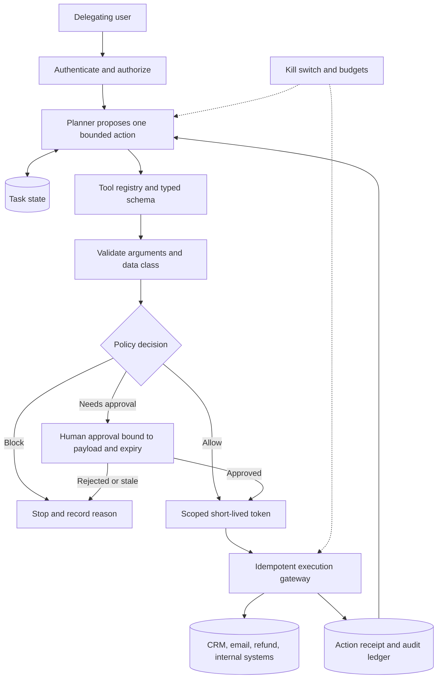

# G03 — Tool-Using Agent with Safety Controls: Main Interview Guide

> **Core idea:** The model proposes one bounded action. Deterministic services validate, authorize, approve, execute, and record it. The agent never holds broad credentials or decides whether its own action is allowed.

Use this for the spoken design. The [Deep Dive](G03_Tool_Using_Agent_With_Safety_Controls_Deep_Dive.md) holds the mechanics, and the unchanged [source case](G03_Tool_Using_Agent_With_Safety_Controls.md) holds the full reference.

## 1. Open with the authority boundary

> “We want an agent that reads email, checks internal systems, updates CRM, and sometimes issues refunds. The useful part is interpreting the request; the dangerous part is letting that interpretation become authority. I’ll let the model propose actions, while identity, policy, approval, and an idempotent gateway decide what can actually happen.”

The same request matters differently to operations, security, finance, and tool owners. Ask what the agent may do alone, what requires review, and what it must never do. Treat customer email and tool responses as untrusted input.

### Questions to ask the interviewer

The [source discovery table, §1](G03_Tool_Using_Agent_With_Safety_Controls.md#1-name-the-model-as-the-proposer-never-the-authority) gives the full set. These questions change the controls:

| Question to ask | What the answer decides |
|---|---|
| Which actions are reversible, and where is the money or permission boundary? | Action risk tiers and the human approval threshold. |
| Does the agent act as the user, a service account, or a delegated actor? | Identity propagation, token scope, and blast radius. |
| What can run autonomously, what needs approval, and what is forbidden? | Tool allowlist, policy verdicts, and rollout scope. |
| Which systems own customer, identity, and refund truth? | Live reads, reconciliation, and where workflow state must not substitute for business state. |
| What must be logged and retained for an audit or dispute? | Decision ledger fields and retention policy. |
| How can operators stop an in-flight task? | Kill switch, queued work cancellation, and token revocation. |
| What workload and business outcome matter? | Planner/tool capacity, approval staffing, and success metric. |

If approval policy is unspecified, assume a human gate for irreversible actions; do not invent a permissive refund threshold.

### G03 is the anchor for its variants

| Related case | What changes from G03 |
|---|---|
| Enterprise assistant over 100+ apps | Tool discovery and registry loading at scale; enterprise identity must reach every application. |
| Enterprise workflow automation / reported agent design prompts | More orchestration and memory detail, with the same proposal-to-execution boundary. |
| Slow, looping, or timed-out agent | Step budgets, cached safe reads, async work, per-tool timeouts, and explicit stop conditions dominate. |
| Refund near miss | Separate planner failure from gateway enforcement success; contain risky bulk plans. |

## 2. Requirements and scope

### Functional requirements

1. Authenticate the delegating actor and record their rights.
2. Let the planner propose one bounded next action, not perform it.
3. Resolve a declared tool and validate its typed arguments and data class.
4. Return a deterministic **allow / block / needs-approval** decision.
5. Mint a short-lived, least-privilege credential only for an approved action.
6. Execute through one idempotent gateway, record the receipt, and stop safely on uncertainty.

The first usable version also needs a tool registry, a real approval record, and a tested kill switch. Exclude free-form code or shell execution, open-ended tool discovery, unbounded loops, cross-tenant access, self-modifying policy, and unrestricted refunds.

### Non-functional requirements

| Constraint | Source-case planning example |
|---|---|
| Latency | Budget model planning separately from tool time; low-risk task completion around p95 <15 s. Approval queue needs an escalation rule. |
| Capacity | 50,000 users, 20 QPS peak, 10 actions/task imply roughly 200 tool actions/s; read parallelism and write limits differ. |
| Security | No broad reusable secret in the model. Tool observations remain untrusted. Scope tokens by tenant, workflow, action, and expiry. |
| Reliability | Policy or broker failure closes writes; uncertain side effects reconcile before retry. |
| Cost and safety | Hard ceilings on steps, tool calls, spend, refund amount, destinations, and concurrency. |
| Audit and operability | Tamper-evident decision ledger and a kill switch without deployment. |

These are illustrative interview numbers, not measured production demand. Risk is a decision aid: **impact × likelihood × irreversibility**. It yields autonomous, conditional, approval-required, or blocked action tiers.

## 3. Architecture

This is a whiteboard version of the [source architecture, §4](G03_Tool_Using_Agent_With_Safety_Controls.md#4-draw-the-architecture-end-to-end).

**Say the boundaries:** the planner can propose, the registry defines legal tool shapes, validation rejects malformed or over-limit arguments, policy decides, approval binds to the exact state, the broker supplies one narrow capability, and the gateway is the only write path. A proposal is not proof of execution; the receipt is. The task state store remembers workflow progress, while downstream systems remain the business systems of record.

## 4. Walk one request

For “read an email, check refund eligibility, update the CRM note, and refund if allowed”:

1. Verify the support agent’s delegated rights.
2. Propose the next smallest step, such as reading the email or checking the account.
3. Resolve the approved tool; validate schema, amount, account, data class, and destination.
4. Ask the policy point to allow, block, or request approval.
5. Bind any approval to tenant, record version, amount, and expiry.
6. Execute with a scoped credential and an idempotency key; record the result.
7. Continue only if the new task state and evidence justify another bounded step.

The four core security controls are **untrusted observations, narrow credentials, validated proposals, and hard ceilings**. Prompt instructions alone do not enforce any of them.

## 5. Failure and recovery

| Failure | Safe response |
|---|---|
| Malicious instruction in email or tool output | Treat as data; policy blocks any scope change; preserve evidence. |
| Policy engine or credential broker down | No writes. Only explicitly permitted, non-sensitive cached reads may degrade. |
| Tool succeeds but response is lost | Query the action record by idempotency key; reconcile before retry. |
| Approval became stale | Re-request against the current record/version; do not reuse it. |
| Repeated tool loop | Step/retry cap, breaker, cached result, explicit stop or human handoff. |
| Proposed refund exceeds task limit | Schema/limit validation rejects it before policy evaluation. |

The kill switch must stop new tool calls, cancel queued work, revoke or expire tokens, and mark in-flight tasks for downstream rejection. A dashboard flag that merely blocks new user requests is insufficient.

## 6. Scale, latency, and cost

At the source’s illustrative 20 QPS and 10 actions/task, plan for about 200 tool actions/s, with 40–60 model calls/s during iterative planning bursts. The source estimates roughly 5 KB of decision record plus 20 KB audit trail per task, or about 8.6–34.6 GB/day of raw append-only data at its assumed range. Ask whether planner time, downstream tool time, or human approval is the actual bottleneck.

At 10×, partition by tenant or workflow, cap concurrency per user/tool/globally, queue slow actions, and keep ordered actions for one account together. REST executes; function calling selects among a small set; MCP can expose tool discovery; an agent framework coordinates multi-step work. A registry loads only relevant schemas instead of placing 1,500 functions from 100 apps in one prompt. Backend services trust enterprise identity, not the LLM.

If the agent is slow or expensive: **trace → route common intents deterministically → bound steps, retries, tokens and tool time → cache safe read results within the request → move slow side effects async**. Never lengthen an unbounded loop to make it “more capable.”

## 7. Evaluation and rollout

**Release gates: zero unsafe actions and zero duplicate effects.** Track policy denials, approval delay, tool success, task completion, overrides, latency, and cost beside those gates. Red-team indirect instructions in emails, CRM rows, tickets, and fetched pages; stale approvals; over-broad tokens; over-limit refunds; lost responses; and runaway loops.

Roll out in layers: read-only triage and drafting → narrow reversible CRM writes with proven revert/idempotency → financial actions behind human approval → adversarial tests and canary → expand only while the two zero-count gates hold. The control plane, gateway, broker, ledger, and approval service are reusable; customer-specific CRM fields and thresholds live in adapters/configuration.

## 8. Refund near-miss drill

In the [source incident, §13](G03_Tool_Using_Agent_With_Safety_Controls.md#13-debug-the-refund-near-miss-as-detect-contain-root-cause-prevent), the planner proposed 18 refunds for delayed VIP shipments, including a €740 refund above a €250 approval limit. The gateway blocked six calls, but 12 were allowed. No unauthorized money moved; the planner still failed by proposing a risky bulk action.

**Detect:** read planned, blocked, and allowed calls with amount, role, approval state, policy version. **Contain:** disable bulk refund planning, route VIP refunds to review tickets, and audit the 12 allowed calls. **Root cause:** action-oriented planner examples omitted bulk approval boundaries; the gateway policy still worked. **Prevent:** risk-aware tool schemas, policy simulation, a separate action-risk check, and non-bypassable gateway enforcement.

## 9. Interview delivery

Spend roughly 50 minutes: opening/scope (12), architecture and one-request walk (10), trade-offs and failure drills (16), rollout/measurement (6), close (6). Keep the technical detail in reserve; the interviewer should hear the control boundary early.

> “The model interprets requests and proposes one bounded action. A registry and validator check the tool and arguments; deterministic policy returns allow, block, or approval. A broker mints a short-lived scoped token, and an idempotent gateway executes once and writes a receipt. Tool output is untrusted, writes fail closed, and budgets cap loops and spend. I would ship read-only first, add reversible writes with a revert plan, keep money behind human approval, and gate expansion on zero unsafe or duplicate effects.”

| Follow-up | Short answer |
|---|---|
| Can the model hold credentials? | No; a trusted broker mints one scoped token for an approved action. |
| How do you avoid duplicate refunds? | Durable business-action key, stored receipt, reconciliation after uncertainty. |
| What if an email instructs a refund? | Email is data; policy and gateway decide, never the email or model. |
| Why not direct integrations? | One gateway centralizes authorization, validation, audit, and idempotency. |
| When do you stop? | On risk, ambiguity, missing state, stale approval, policy failure, or budget ceiling. |

**Final mental model:** Propose → validate → decide → approve if needed → scope credential → execute once → record → stop or repeat within budget.
