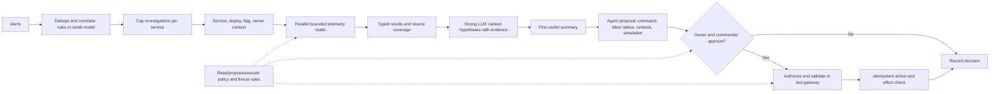

# G04 — SRE Incident Response Agent: Main Interview Guide

**Incident response** is: pages go off, someone finds a cause, someone changes production. Wrong rollback at 3 a.m. is worse than a slow summary.

**G04 covers one slice:** collapse the alert storm, look with read-only tools, then *suggest* a fix. Humans still approve writes.

End to end, as checkout 5xx after a deploy:

1. **400 alerts hit.** Rules or a small model fold them into one investigation.
2. **We attach service, last deploy, owner, freeze.**
3. **We read metrics, logs, traces in parallel** and mark empty vs down vs denied.
4. **A strong model ranks causes** from that pack, with citations and coverage gaps.
5. **It proposes a rollback command**, blast radius, runbook, dry-run — it does not run it.
6. **Owner/commander click yes.** One gateway executes once. Timeline records it.

That’s it: **dedupe → read → hypothesize → propose → human → maybe write.** Auto-restart of prod is later, if ever.

> **Core idea:** Dedupe the alert storm, investigate with read-only tools, show evidence and missing sources, then stage any mitigation for human approval. The agent runs outside the failure it is investigating.

Use this guide for the interview. The [Deep Dive](G04_SRE_Incident_Response_Agent_Deep_Dive.md) contains the technical drills, and the unchanged [source case](G04_SRE_Incident_Response_Agent.md) is the full reference.

## 1. Open with the read-only boundary

> “The agent may query anything it is authorized to read and change nothing on its own. A ten-second approval is acceptable during an incident; an autonomous rollback based on a wrong hypothesis is not. I’ll optimize for a useful, evidence-backed summary within 30 seconds, even when telemetry is degraded.”

The dependency inversion is the distinctive risk: the observability stack the agent queries may be degraded by the same incident. It must disclose source coverage and distinguish “nothing found” from “source unavailable.”

### Questions to ask the interviewer

The [source discovery, §1](G04_SRE_Incident_Response_Agent.md#1-name-the-read-only-boundary-before-drawing-anything) gives the full set. Ask these before choosing tools:

| Question to ask                                                                         | What it's really asking                                                                              | What you then decide                                                       |
| --------------------------------------------------------------------------------------- | ---------------------------------------------------------------------------------------------------- | -------------------------------------------------------------------------- |
| Which alert class and responder decision are in scope first?                            | Are we helping with "checkout 5xx" first, or trying to cover every page in week one?                 | Pilot slice, golden set, and which runbooks you load.                      |
| Who is on call, who owns the service, and who approves a mitigation?                    | When we want to roll back, whose phone buzzes — on-call, service owner, or incident commander?      | Identity, ownership map, and who can approve a write.                      |
| Which diagnostics are read-only, which writes may be proposed, and which are forbidden? | Can it run logs itself, only*suggest* a restart, and never run a destructive command?              | Tool allowlist and the exact write line.                                   |
| Which telemetry sources are authoritative, fresh, and permissioned?                     | If Prometheus is down in the same outage, do we pretend we looked, or say we couldn't see?           | Parallel reads, ACLs, coverage status, and stale warnings.                 |
| What alert burst and first-output target must hold?                                     | When 400 alerts hit in 90 seconds, can we still give a useful summary in 30?                         | Dedupe capacity and the 30-second budget.                                  |
| What evidence must support a cause or proposed command?                                 | If we recommend a rollback, can we show the deploy, the metric, and the runbook — or is it a guess? | Citations, confidence, simulation, and when to refuse.                     |
| What proves a 30-day pilot helped?                                                      | After a month, did responders actually use the summaries, or just ignore them?                       | Precision, acceptance, time to a useful summary, and how often we reverse. |
| What audit and rollback evidence is required?                                           | After a bad rollback, can we reconstruct who approved it and what command ran?                       | Incident timeline, proposal record, and change controls.                   |

If the interviewer cannot provide all numbers, state assumptions for throughput, latency, horizon, accuracy, cost, autonomy, data class, and recovery. Name the oracle: post-incident review of the hypothesis and outcome.

### G04 is the anchor for its incident variants

| Related case                                    | What changes from G04                                                                                           |
| ----------------------------------------------- | --------------------------------------------------------------------------------------------------------------- |
| SRE triage worksheet and mocks                  | Requirements, source ownership, golden set, and rollout probes become more explicit.                            |
| Operations/incident-response assistant question | Tests the progression from read-only investigation to suggested, approved, then narrowly autonomous mitigation. |
| Latency self-drill                              | Raw telemetry and serial diagnostics become the dominant bottleneck; pre-aggregate and parallelize.             |

## 2. Requirements and first-release scope

### Functional requirements

1. Correlate alerts with logs, metrics, traces, deployments, flags, and approved runbooks.
2. Produce ranked hypotheses with supporting evidence, uncertainty, and source coverage.
3. Run only authorized, read-only diagnostics automatically.
4. Build a mitigation proposal with exact command, blast radius, evidence, runbook, freeze status, and simulation where possible.
5. Route writes through service-owner/incident-commander approval and one tool gateway.
6. Record timeline, policy decisions, source gaps, and outcomes for replay.

First release: one alert class, read-only investigation, staged proposals. No autonomous restarts or rollbacks, no destructive command without a dry run, no action during a freeze without its owner, and no source with unmapped ACL metadata.

### Non-functional requirements

| Constraint   | Source-case target or rule                                                                                                     |
| ------------ | ------------------------------------------------------------------------------------------------------------------------------ |
| Latency      | First useful summary <30 s from alert; follow-ups 3–8 s; long investigations async with progress.                             |
| Burst        | Design for 400 alerts in 90 s, not only the 1,200/day average.                                                                 |
| Availability | Run outside affected blast radius; report each missing/degraded source.                                                        |
| Security     | SSO, service ownership, scoped read credentials, redacted logs, human approval for writes.                                     |
| Reliability  | Permission uncertainty, absent destructive-action simulation, or missing approval fail closed. Telemetry gaps degrade visibly. |
| Cost         | Rules/small models cluster alerts; strong model synthesizes hypotheses; bound lookback and tokens.                             |

These are the source’s interview assumptions and example targets, not claims of observed load.

## 3. Architecture

This diagram condenses the [source architecture, §4](G04_SRE_Incident_Response_Agent.md#4-draw-the-architecture-end-to-end).

### Step-by-step architecture

- **Step 1.** **Collapse alerts first.** Rules or a small model correlate and deduplicate alerts; cap concurrent investigations per service before any strong-LLM call.
- **Step 2.** **Assemble incident context.** Add service ownership, recent deploys, and flag changes to the investigation.
- **Step 3.** **Read telemetry within bounds.** Query relevant sources in parallel with limits; record whether each result is available, empty, stale, or denied.
- **Step 4.** **Form an evidence-backed view.** The strong LLM synthesizes ranked hypotheses from bounded telemetry; the agent presents a cited first summary with source coverage.
- **Step 5.** **Prepare a mitigation.** If action is warranted, propose the exact command, blast radius, runbook, and simulation result.
- **Step 6.** **Get the right approval.** Apply read/propose/execute and freeze policies, then ask the owner and commander; a declined proposal is recorded without a write.
- **Step 7.** **Execute and check.** Route an approved command through the authorized tool gateway, execute idempotently, verify its effect, and add the decision to the incident timeline.

**Model and agent role:** The incident agent uses read-only tools to gather evidence. Rules or a small model handle alert clustering, while a strong LLM synthesizes hypotheses and proposes mitigation. The agent cannot execute a production change without the human approval and tool gateway shown above.

**Three boundaries:** dedupe before model calls; read-only investigation before approval; all approved writes through one gateway. Keep the agent outside the affected service’s blast radius. The summary states which sources were reached, stale, empty, or unavailable, so a confident hypothesis cannot conceal missing evidence.

## 4. How investigation works

Collapse related alerts into one incident before spending model calls. Attach new alerts to an active investigation and cap concurrent runs per service. Build context from service topology, deploys, flags, owners, and freeze status. Query telemetry in parallel with bounded lookback; pre-aggregate log signatures, metric buckets, trace samples, and deploy diffs before they become model tokens. Use the strong model for a small set of ranked hypotheses, not raw-log search.

Every tool returns one typed state: **SUCCESS, EMPTY, UNAVAILABLE, DENIED, INVALID**. `EMPTY` means the query worked and found nothing; `UNAVAILABLE` means the source did not answer. Neither is evidence for the same conclusion. `DENIED` is a dead end to the model; details go into the human audit, not a workaround hint.

The mitigation is always a proposal first. Compute blast radius from the service catalog/topology, cite evidence and runbook, check change freeze and simulation, then route to the right humans. Approval is bound to the proposal and expires. The gateway authorizes before validating arguments so unauthorized callers cannot learn a protected tool schema from validation errors.

## 5. Latency, scale, and cost

At the source’s burst of **400 alerts/90 s**, one investigation per alert would overload the telemetry stack and produce noisy summaries. Dedupe/correlation should take under a second; context building ~1–2 s; parallel telemetry fan-out ~5–10 s for the slowest source; strong-model synthesis ~10–15 s, streamed; verification completes the under-30-second first output. Track time to first useful hypothesis, not only final response time.

At 10×, provider quotas and telemetry rate limits likely bind first. Per-service caps and pre-aggregation keep strong-model calls tied to real incidents rather than alert count. Profile input tokens and serial steps before choosing a faster model. Cache versioned service catalogs/runbooks, shrink lookback and top-k, and parallelize independent read-only calls. Spend is per resolved investigation; it remains visible even when a SEV-1 justifies a larger budget.

## 6. Failure and safety playbook

| Failure                             | Safe response                                                                                |
| ----------------------------------- | -------------------------------------------------------------------------------------------- |
| Metrics/logs/traces slow or missing | Return`UNAVAILABLE` or partial coverage within timeout; lower confidence and name the gap. |
| Deploy metadata absent              | State that deploy correlation was not possible.                                              |
| Runbook stale or absent             | Mark proposal unguided/stale; do not imply approval.                                         |
| Injection in log/runbook            | Treat content as data; exclude flagged chunks; no tool authority from text.                  |
| Alert storm                         | Attach alerts to the active cluster; queue visibly; do not silently drop.                    |
| Approval or policy unavailable      | No execution. Proposal waits, expires, or a responder acts manually.                         |
| Model provider degraded             | Read-only investigation continues through a bounded fallback route.                          |

Use a visible degradation ladder chosen from system health, with the selected rung in the trace and responder view. Circuit breakers should use a windowed failure rate with a minimum sample, because agent traffic is bursty.

## 7. Evaluation and rollout

**The falsifying metric is hypothesis precision**, confirmed in post-incident reviews: responders stop reading a tool that repeatedly points them the wrong way. Gate with time to first useful output <30 s under the alert burst, source coverage reported on every run, permission and tool-call safety at zero violations, and review of any harmful proposed mitigation. The source also gives example groundedness ≥90%, citation accuracy ≥95%, high-risk escalation ≥95%, and task completion ≥80%; agree thresholds per alert class with the customer.

Start with historical incidents and one alert class. Build an SME-approved golden set, red-team logs/runbooks/roles, run in shadow mode, then show live read-only summaries with citations and coverage. Add approved low-risk actions only after precision, latency, and safety hold. Pin model versions, canary changes, and roll back on leaks, acted-on wrong hypotheses, missed latency, or responders ignoring output.

## 8. Interview delivery

For a 45-minute round: requirements and oracle (8), records/action space (4), architecture (8), failure ladder and gates (8), scale/cost arithmetic (7), measurement/rollout (6), questions back (4).

> “I’d start with a read-only incident assistant. It deduplicates an alert storm before any model call, builds service/deploy context, queries telemetry in parallel, and presents ranked hypotheses with evidence and explicit source coverage within 30 seconds. Since telemetry can fail during the incident, it distinguishes empty from unavailable and runs outside the affected blast radius. A mitigation is an exact, blast-radius-aware proposal; only the service owner and incident commander can approve a write through a gateway. I’d validate precision against post-incident reviews, shadow it first, then ship live read-only summaries before allowing approved low-risk actions.”

| Follow-up                      | Short answer                                                                                                         |
| ------------------------------ | -------------------------------------------------------------------------------------------------------------------- |
| Restart automatically?         | Read-only first, then suggestions, then human-approved execution; autonomy only for proven low-risk reversible work. |
| What breaks at 10×?           | Telemetry quotas and provider limits; cap per service and pre-aggregate.                                             |
| What if a source says nothing? | Show whether it was`EMPTY` or `UNAVAILABLE`; never infer from a missing source.                                  |
| Slow prototype?                | Decompose stages, parallelize reads, send less telemetry, stream, keep verification.                                 |
| How do you know it helps?      | Post-incident hypothesis precision, source coverage, responder acceptance, reversal rate.                            |

**Final mental model:** Dedupe → read-only evidence → ranked hypothesis + coverage → proposal → human approval → safe gateway → verified outcome.
