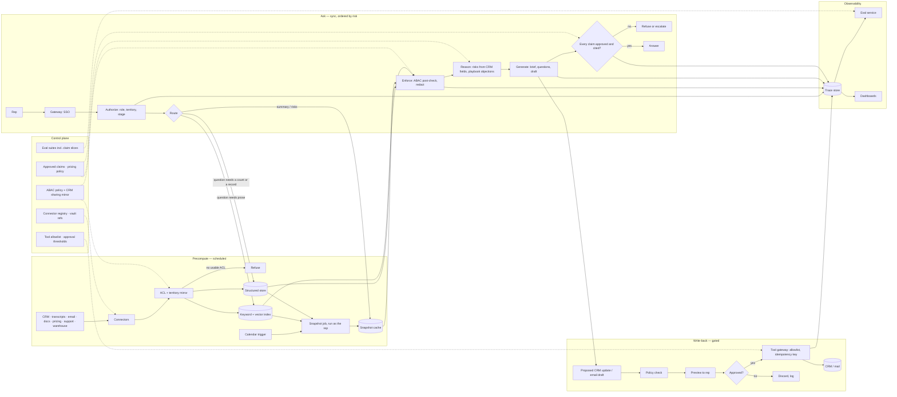

# Sales Copilot for Account Executives

*An assistant that knows the account better than the rep, without ever seeing more of the CRM than the rep may.*

◷ 28 min

The hard part of a sales copilot is not summarising an account. It is that every useful answer touches CRM records, call transcripts and pricing policy permissioned by territory, role and deal stage. One invented customer fact or unapproved claim can reach a customer's inbox. This page consolidates group G05 of `CASE_STUDY_INDEX.xlsx` into one read for the day before. The group has no bespoke worked design, only a templated purchased worksheet, so the CRM-permission and account-data detail here is added for this pack and marked where it appears.

| Case in the group | What it contributes here |
|---|---|
| #28 Sales Copilot for Account Executives (anchor) | Sections 1 to 12: the worksheet, answer key, requirements, evaluation, rollout and spoken answer |
| #48 OpenAI Q4 AI-Powered Sales or Account-Research Assistant | The explore list and success metrics in sections 1 and 10, the fabricated-fact follow-up in section 12 |
| #40 Reduce latency for an agentic CRM assistant | Section 13 |
| Incident 7, model regression missed by a weak eval suite (mapped to G13 in the sheet, walked here because it is a sales copilot) | Sections 10 and 14 |
| Handbook Module 06 docs 1 and 5 (identity, connectors, structured-data router) | The permission and CRM-connector detail in sections 3, 6 and 7 |

---

## 1. Name the Workflow and the Risk Boundary Before Drawing Anything

Do not start with the model. Start with the workflow. Which B2B sales workflow is slow, risky or inconsistent today? Who decides at the end of it? Which risk cannot be automated? A copilot that saves ten minutes and sends one unapproved claim has lost more than it saved. So the risk boundary is named before the first box.

The workflow is the pre-meeting hour. An account executive prepares for a meeting. They ask for an account summary, the opportunity risks, suggested discovery questions, email drafts and CRM update suggestions. Each of those five outputs sits on a different side of the risk boundary. The summary and risks are read-only assistance. The questions and drafts are draft-only. The CRM update is an action, and it needs explicit approval before write-back.

The three answer tiers show what the framing buys. The weak answer connects the documents to a vector database, uses an LLM to answer questions and adds a chatbot UI. It ignores the workflow, the permission boundaries, source freshness, evaluation, human approval and monitoring. The average answer builds RAG over the company data, adds citations and tests with sample questions. It never separates low-risk assistance from high-risk actions, never defines the data model or permission checks, and never explains rollout gates. The strong answer maps the workflow and the risk boundary first, then designs a permission-aware system. It ingests approved sources with metadata, freshness and ACLs. It uses hybrid retrieval with pre-generation permission filtering, generates cited answers, exposes uncertainty and missing evidence, and routes risky actions to human approval. It proves the system with golden cases, permission red-team tests, groundedness and citation metrics, latency and cost budgets, and a staged rollout from offline prototype to approved write-back.

Ask the questions that decide the design and write the answers where they stay visible.

| Question to ask | What the answer decides |
|---|---|
| What exact sales workflow is slow, risky or inconsistent today, and what decision does the user make at the end of it? | The five outputs and which side of the risk boundary each sits on |
| Who is the primary user, who reviews the output, and who owns the operational risk if the assistant is wrong? | The approver for drafts and CRM writes; the trace store's audience |
| Which tasks are read-only, which are draft-only, and which need explicit approval before write-back? | The tool allowlist and the approval gate |
| Which systems hold the trusted source of truth, and how do their permissions, freshness and ownership differ? | The connector map and the permission model per source |
| What are the top five recurring cases by volume and the top five highest-risk cases by impact? | Which requests get a deterministic route and which need the agent |
| What does a successful 30-day pilot prove: less handling time, higher accuracy, better compliance, fewer escalations, or satisfaction? | The success metrics agreed at intake |
| What must the assistant refuse or escalate instead of generating? | Pricing promises, unapproved claims, competitor facts without a source |
| What audit evidence must exist so security, legal or management can reconstruct why the system answered as it did? | The audit log schema |

Map the people, because each notices a different failure first.

| User | Workflow | Failure they notice first | What the copilot gives them | Approval needed |
|---|---|---|---|---|
| Account executive | Prepares for the meeting, asks for summary, risks, questions, drafts, CRM updates | A wrong or invented account fact | A cited account brief, risk list grounded in CRM fields, drafts from approved messaging | None for read-only; every draft is theirs to send; every CRM write is previewed |
| Sales manager / reviewer | Reviews pipeline hygiene and outbound claims | A polished draft with an unsupported claim | Claim-level flags, escalation reasons, pipeline updates as proposals | Approves high-risk drafts and writes above the threshold |
| Admin / security | Owns CRM permissions, connector credentials, audit export | A rep seeing an account outside their territory | Permission-aware retrieval, connector registry, immutable audit | Signs off each source and each write tool |
| Executive sponsor | Tracks adoption and time saved | A tool nobody opens before meetings | Preparation-time reduction, adoption, conversion and meeting-quality metrics | Approves rollout stages |

The OpenAI question-bank version of this prompt asks for account briefs. It lists what to explore:

- CRM, email, product-usage, support and public-data integrations
- entity resolution
- freshness and source prioritisation
- permission boundaries
- citation and provenance
- personalisation
- human review
- measuring seller adoption and time saved

Every item lands in a section below.

## 2. State Requirements as Testable Constraints

A requirement the customer cannot test is a preference. "Make the brief accurate" is a preference; "90 percent of claims supported by cited evidence, zero permission violations" is a constraint, and only the second changes the architecture. Split the functional list with MoSCoW so the launch gate is the smallest set that keeps the promise.

The must-haves are four. Support the core workflow: account summary, opportunity risks, discovery questions, email drafts and CRM update suggestions, in that order of risk. Return grounded answers with citations to approved source systems, and never answer an unsupported claim confidently. Apply user, role, tenant, region and sensitivity permissions before retrieval and again before final generation. Keep every write tool behind a preview and a human approval.

The should-haves belong in the first usable version. Show confidence, missing evidence and the escalation reason when the system is uncertain or the policy risk is high. Collect user feedback and reviewer corrections for evaluation, never for training without governance. Provide admin controls for source inclusion, document freshness, policy rules, blocked actions and audit export. Precompute the account snapshot before the meeting so the interactive path stays fast. Personalisation by segment and playbook, public-data enrichment, and conversion attribution can wait.

Declare the non-goals, because a sales copilot sprawls into a CRM replacement if nobody stops it:

- sending email on the rep's behalf
- writing to the CRM without a previewed, approved draft
- quoting prices or discounts outside the approved policy
- scoring or ranking leads (biased lead scoring is a named red-team risk)
- reading accounts outside the rep's territory or role
- long-term memory of a customer beyond the CRM record

The non-functional requirements are the operating constraints, stated so a test can fail them.

| Constraint | Stated so it can be tested |
|---|---|
| Latency | Interactive answers in 3 to 8 seconds for normal questions. Longer workflows go asynchronous with progress state. The pre-meeting brief is precomputed, so the interactive ask reads a snapshot rather than fanning out to the CRM |
| Availability | Business-critical selling hours. Graceful degradation if the LLM, the vector store or the CRM is down: serve the last snapshot with a staleness label, or refuse |
| Cost | Token budgets, caching of stable documents, retrieval pruning, small models for classification, expensive reasoning only where the risk justifies it. Reported as cost per workflow |
| Security and privacy | SSO, RBAC and ABAC, source-level ACLs, encryption in transit and at rest, secrets management, no training on customer data unless the contract allows it |
| Audit and compliance | Immutable logs of queries, retrieved evidence, model version, policy decisions, approvals and final output |
| Reliability | Fail closed on permission uncertainty, stale data, missing citations and high-risk write actions |

Every must-have needs an owner in the architecture.

| Requirement | Primary component(s) |
|---|---|
| Five outputs by risk order | Intent router, snapshot service, draft generator, CRM write proposer |
| Grounded answers with citations | Approved-claims retriever, evidence selector, citation builder, claim verifier |
| Permissions before retrieval and before generation | Identity gateway, CRM permission mirror, ABAC pre-filter, policy post-check |
| Write tools behind preview and approval | Tool gateway, allowlist, draft store with approval status, idempotency keys |
| Confidence and escalation shown | Grader, output policy engine |
| Feedback for evaluation only | Feedback store separated from ground truth, SME approval step |
| Admin controls and audit export | Control plane, audit log |
| Precomputed snapshot | Scheduled snapshot job, snapshot cache keyed on account and rep permission signature |

## 3. Map Every Source With Its Permission Model

The answer key names the sources: Salesforce or HubSpot, Gong or Zoom transcripts, email and calendar, product docs, pricing and discount policy, customer support history, and the data warehouse. What it does not say is how each one is permissioned, and that is the part the interviewer probes. The permission model per source below is added for this pack.

| Data source | Format | Owner | Freshness | Permission model (added) | Risk |
|---|---|---|---|---|---|
| CRM (Salesforce / HubSpot) | Accounts, opportunities, contacts, activities, notes | Sales operations | Minutes; change events plus nightly reconciliation | Record-level sharing: owner, role hierarchy, territory, sharing rules, field-level security on amount and stage | A rep seeing a peer's territory; forecast fields leaking; stale stage after a close |
| Call transcripts (Gong / Zoom) | Transcript text, participants, timestamps | Sales enablement | Hours after the call | Participant and manager access; recording consent by region | PII and customer confidences; prompt injection in what a customer said |
| Email and calendar | Threads, invites, attendees | Individual mailbox owner | Real time | Mailbox owner only, delegated access explicit | Reading another rep's mailbox; injection in inbound mail |
| Product docs | Pages, PDFs | Product marketing | Days | Internal, some partner-tier | Superseded features; internal roadmap leaking into customer drafts |
| Pricing and discount policy | Policy docs, approval matrices | Deal desk | Weeks; versioned | Internal; regional variants | Disallowed pricing promises; stale discount thresholds |
| Support history | Tickets, escalations | Support | Minutes | Account-scoped; tenant-scoped in multi-tenant support | Cross-account leakage; severity fields mis-summarised |
| Data warehouse | Usage metrics, ROI pilots, renewals | Analytics | Daily | Row-level by account and role; internal-only pilot results | Internal-only ROI numbers used as external claims (the incident) |

State the integration assumptions aloud. Every source record has a stable ID, owner metadata, a last-updated timestamp and access-control metadata. A source that lacks ACL metadata is excluded from production retrieval until it is mapped. Embeddings are not the authority for permissions; permissions are checked through metadata filters and, for sensitive records, through source-system authorisation checks. Source freshness varies by system, so the answer shows a stale-source warning when a record is older than the approved threshold. User feedback is stored separately from ground truth, and SME-reviewed corrections become evaluation data only after approval.

The core records follow. Account(id, segment, industry, region, owner, entitlements). Opportunity(id, stage, amount, close_date, competitors, next_step). Interaction(id, account_id, type, transcript, participants, timestamp). Playbook(id, segment, approved_claims, objections). Draft(id, account_id, user_id, content, approval_status). AuditLog(user_id, account_id, source_ids, output_type). Two of these carry the safety story: `Playbook.approved_claims` is the only place an outbound claim may come from, and `Draft.approval_status` is the gate every write passes through.

## 4. Draw the Architecture End to End

One diagram carries the whole design. The organising split is control plane against data plane. Inside the data plane, two lanes must never share a hot path. The pre-meeting precompute lane is slow and scheduled. The interactive ask lane reads what precompute produced. Write-back is a third, gated lane.

```
 ╔══════════════════════════════ CONTROL PLANE (changes are releases) ══════════════════════════════╗
 ║  ABAC policy + CRM sharing-rule mirror · connector registry + schedules · credentials (vault refs) ║
 ║  approved-claims playbooks · pricing policy versions · prompt / model / route versions              ║
 ║  tool allowlist + approval thresholds · eval suites incl. claim-level slices · budgets              ║
 ╚═══════════════════════════════════════╤═══════════════════════════════════════════════════════════╝
                                         │ configures every box below
 ╔══════════════════════════════ DATA PLANE (calls are requests) ═══════════════════════════════════╗
 ║                                                                                                   ║
 ║  PRECOMPUTE — scheduled, before the meeting                                                       ║
 ║   CRM · transcripts · email/calendar · docs · pricing · support · warehouse                        ║
 ║        │ change events + nightly reconciliation (connector registry, one schedule per source)     ║
 ║        v                                                                                          ║
 ║   connectors ─> normalise ─> ACL + territory mirror ─> chunk / embed ─┬─> keyword + vector index   ║
 ║                                     │ refuse: no usable ACL           └─> structured store (CRM)   ║
 ║   calendar trigger ─> SNAPSHOT JOB: summary · open risks · last interactions · approved claims     ║
 ║                       (built as the rep, permission-checked, cached on account + rep signature)    ║
 ║                                                                                                   ║
 ║  ASK — synchronous, ordered by risk                                                               ║
 ║   rep ─> gateway ─> AUTHORIZE ─> ROUTE ─> FETCH ─> ENFORCE ─> REASON ─> GENERATE ─> VERIFY ─> answer
 ║           SSO      resolve      intent:   snapshot   ABAC     risks from  cited      claim +      ║
 ║           via      role,        summary   cache;     post-    CRM fields; brief,     citation     ║
 ║           IdP      territory,   risk      structured check,   playbook    questions, check,       ║
 ║                    deal stage   draft     query or   redact   objections  draft      output       ║
 ║                                 update    hybrid                                     policy       ║
 ║                                           search                                         │        ║
 ║                                                                     insufficient / unapproved     ║
 ║                                                                     claim ─> REFUSE + escalate    ║
 ║                                                                                                   ║
 ║  WRITE-BACK — gated                                                                               ║
 ║   proposed CRM update or email draft ─> policy check ─> PREVIEW to rep ─> APPROVE ─> tool gateway ║
 ║   (allowlist, idempotency key) ─> CRM / mail ─> audit                                              ║
 ║                                                                                                   ║
 ║  OBSERVABILITY — every stage writes                                                               ║
 ║   trace store ─> eval service (golden set · claim-level slices · permission red team · shadow)     ║
 ║               ─> dashboards (unsupported-claim rate · permission violations · step count ·         ║
 ║                  snapshot hit rate · cost per workflow · adoption)                                 ║
 ╚═══════════════════════════════════════════════════════════════════════════════════════════════════╝
```

The same flow as a rendered diagram:



Read the components in dependency order, because that is the order they exist and the order they fail.

| Component | Responsibility | Fails how |
|---|---|---|
| Identity gateway | Validate the SSO token, load role, territory, tenant and deal-stage context, classify the request as read-only, draft-only or action-taking | Closed: no identity, no answer |
| Connector registry | One schedule and one credential reference per source; change tokens where the source API supports them; health as its own signal | Degrades: one source's outage is quarantined to that source |
| ACL and territory mirror | Translate CRM sharing rules, field-level security and transcript participant access into one attribute model | Closed: no usable ACL, not indexed |
| Snapshot job and cache | Build the brief before the meeting as the rep, cache it keyed on account plus the rep's permission signature | Degrades: serve the last snapshot with a staleness label |
| Intent router | Decide summary, risk, draft or update; decide structured query versus semantic search versus both | Degrades: fall through to the agent path |
| Structured store and indexes | CRM fields for counts, lookups and stage; documents and transcripts for prose | Degrades: keyword when vector is down, labeled |
| Policy post-check | Re-run ABAC on fresh attributes; redact PII from transcripts as an obligation | Closed: policy engine down, refuse |
| Reasoning layer | Risks from CRM fields and playbook objections; never from model memory | Refuses when evidence is missing |
| Claim verifier and output policy | Every outbound claim traced to an approved-claims entry; block, never warn, on external claims | Closed on an unapproved claim |
| Tool gateway | Allowlist, idempotency keys, preview, approval, audit | Closed: no approval, no write |
| Trace store, eval, dashboards | Replayable runs, claim-level slices, permission red team, online unsupported-claim monitor | Degrades: answer served, gap logged |

Three boundaries are worth pointing at while the diagram is up. The precompute-versus-ask boundary keeps CRM fan-out off the interactive path. The trust boundary sits at ENFORCE: everything to its left may hold records the rep cannot see, nothing to its right may. The write boundary sits at APPROVE: nothing reaches the CRM or a mailbox without a previewed, approved draft carrying an idempotency key.

## 5. Precompute the Account Snapshot Before the Meeting

The interactive path cannot fan out to the CRM, the transcript store and the warehouse on every question. A meeting is on the calendar hours in advance. So the brief is built then, not when the rep opens the panel. That single decision is what makes the 3-to-8-second target and the latency drill in section 13 achievable.

The snapshot job runs on a calendar trigger, or on demand with a visible progress state. It builds the account summary, the open opportunities with stage and next step, the last interactions across calls and email, the open support escalations, and the approved claims and objections for the account's segment. It runs as the rep, so the permission check happens at build time. It is cached keyed on the account and the rep's permission signature. A manager and a rep on the same account get different snapshots. They may see different fields.

Precomputation is an optimisation, never a permission model. A snapshot is a materialised view, and a materialised view can outlive a permission change: a rep moved off a territory at noon must not read the 9 a.m. snapshot at 2 p.m. So the ask lane re-checks the policy on fresh attributes before serving it, and a territory or role change invalidates every snapshot keyed on that rep. Say that sentence in the room; it is the same two-layer rule as permission-aware RAG.

## 6. Propagate CRM Permissions and Territory Rules Into Retrieval

*This section is added for this pack. The purchased key says "apply user, role, tenant, region and sensitivity permissions before retrieval" and stops there. The material below draws on Handbook Module 06 docs 1 and 5.*

Identity is established before any permission logic runs. Authenticate through the customer's own identity provider, validate the token's signature, expiry and audience, and map the customer's own groups into the platform's role vocabulary rather than inventing roles locally. Group mapping is configuration that can drift, so a renamed group on the customer's side must surface as an alert, not silently orphan a rep. A user from a newly connected customer is provisioned just in time from the token's claims, scoped to their company, never with more access than intended by default.

CRM permissions are richer than document ACLs, and the mirror has to carry all of them. Salesforce decides visibility by record owner, role hierarchy, territory assignment, sharing rules and field-level security. The mirror translates each into an attribute on the record: `owner_id`, `territory_ids`, `role_visible_from`, and a field mask that hides forecast amount or stage from roles that cannot see them. The pre-filter compiled into retrieval carries tenant, territory and role; the post-check re-verifies the field mask and any sharing rule that changed since the index was written. A structured leak is still a leak: a count of open opportunities that includes a peer's territory is as serious as a forbidden document, and it is held to the same zero-violation gate.

Credentials for the CRM, the call recorder and the mailbox are references to a vault, never values. They are resolved at the moment of use, never logged, never written into a trace, and scoped per connection rather than per connector type, so one customer's Salesforce credential can never reach another customer's Salesforce. Per-tenant encryption keys bound the blast radius of a storage breach to one tenant.

The interview lens, in one line:

> *"Authorisation logic assumes identity is already established. In front of it I validate the customer's own token and map their groups. Underneath it, credentials come from a vault by reference and never appear in a trace."*

## 7. Ground Opportunity Risks in CRM Fields, Not Model Memory

"What are the risks on this opportunity?" is a structured question wearing a conversational coat. Embed it and search a document index, and the answer is the most similar-sounding notes. It is not the stage that has not moved in 40 days, the competitor named in the last call, or the close date that slipped twice. Semantic search answers "which things are like this", never "how many", "which is most recent" or "did this field change". A router in front of retrieval decides which kind of question this is.

| Question shape | Right tool | Why plain search fails |
|---|---|---|
| "Summarise the last three calls with this account" | Semantic search over transcripts | — |
| "How many open opportunities does this account have past their close date?" | A structured query on CRM fields | Search returns similar records, not a count |
| "What is the status of opportunity 0065g00000?" | Direct lookup by ID | An ID is not ordinary text |
| "Which objections came up across all late-stage deals this quarter?" | Both: filter first, then summarise the filtered transcripts | A filter cannot summarise prose; search cannot scope to "this quarter's late-stage deals" |

Prefer a fixed set of reviewed operations on the CRM over generating queries from natural language: get opportunities by stage, get account by ID, get interactions since a date. A model that generates a query can invent fields or touch every row, and "the copilot queried the whole pipeline" is a real incident. The fixed operations are the tool registry pointed at a record system, and they are the same allowlist the tool gateway enforces.

Opportunity risks are then reasoned from evidence the system fetched: stage age, slipped close dates, competitor mentions in transcripts, unanswered emails, open escalations, and the playbook's known objections for the segment. Each risk carries its citation. When the fields are missing or the transcripts are stale, the copilot says so and lists what it could not check, rather than filling the gap from what a typical deal looks like.

## 8. Draft From Approved Claims and Preview Every Write

An email draft is the copilot's most visible output. It is also the most dangerous one, because it leaves the building. The rule is that every outbound claim traces to an entry in the approved-claims playbook, and the claim verifier blocks rather than warns on anything it cannot trace. Pricing and discount language comes only from the versioned policy, and the copilot refuses to quote outside it.

Personalisation is drawn from the account's own record and interactions: the rep's last thread, the customer's stated priorities from the transcript, the open escalation. It is never drawn from the model's sense of what a company like this probably cares about. Discovery questions follow the same rule, generated from the playbook's objection list and the gaps in the CRM record.

CRM update suggestions are proposals, not writes. The copilot proposes a stage change, a next step or a note. The rep sees a preview of the exact fields that would change. Approval routes the write through the tool gateway with an idempotency key, so a retried approval cannot write twice. Read tools run automatically. Write tools require a policy check, an idempotency key, preview mode and human approval for anything above the risk threshold. Sending mail, closing an opportunity, changing an amount and emailing externally sit above the threshold on day one.

## 9. Degrade on Everything Except Authorisation and Approval

Design the failure path with the happy path. Authorisation and approval fail closed. Everything else degrades visibly.

| Fails | Behaviour |
|---|---|
| Bad retrieval or missing context | Say what could not be checked; list the missing evidence; never fill from model memory |
| Hallucinated policy or procedure | Claim verifier blocks; pricing language only from the versioned policy |
| Cross-tenant or role-based data leakage | Pre-filter on tenant, territory and role; post-check on fresh attributes; zero-violation gate |
| Unsafe tool call or write-back action | Allowlist, preview, approval, idempotency key; nothing above the threshold executes |
| Stale documents or bad sync | Staleness label on the snapshot; nightly reconciliation; connector health alert |
| Cost or latency spike | Step caps, snapshot cache, deterministic routes; see section 13 |
| CRM down | Serve the last snapshot, labeled; no writes |
| Model provider down | Fail over to a secondary route; drafts queue with progress state |
| Prompt injection in a transcript or inbound email | Retrieved content is evidence, never instructions; cannot unlock a write tool |
| Policy engine or approval service down | Fail closed. Refuse. Never fail open on authorisation or approval |

Scale is bounded by the precompute lane. At ten times the accounts, shard the snapshot job by territory. Make the connector registry config-driven, with one schedule per source, so one rate-limited source does not stall the others. The interactive path scales with the snapshot cache hit rate, not with the CRM's API limits.

## 10. Gate the Release on Claims, Not Fluency

An eval suite that measures grammar, tone and general groundedness will pass a model that writes beautifully and invents a security certification. The incident in section 14 is exactly that: a 96.7 percent pass rate on 120 cases hid an 83.3 percent pass rate on the six regulated-claim cases that mattered. The gate therefore has slices, and the critical slices pass independently or the release does not ship.

| Metric | Good threshold | Bad threshold | Test dataset | Owner |
|---|---:|---:|---|---|
| Answer groundedness | ≥ 90% supported claims | < 80% | Golden Q&A plus SME review | FDE / SME |
| Permission violations | 0 | > 0 | Red-team set: same question from users with different roles, territories, tenants | Security |
| Citation accuracy | ≥ 95% correct citations | < 85% | Source-span audit of sampled drafts | SME |
| Task completion | ≥ 80% of target workflows completed with less manual effort | < 65% | Workflow replay tests | Product |
| Escalation quality | ≥ 95% correct escalation on high-risk cases | Missed high-risk case | Risk-labeled scenarios | Product / support |
| Unsupported-claim rate (added, from the incident) | Zero critical failures on regulated-claim slices; online rate at baseline | Any pending-approval or internal-only claim in an external draft | Claim-level suite: security certifications, ROI numbers, customer references, with negative examples the model must refuse | Legal / enablement |
| Latency and cost | p95 within target; cost per workflow below budget | Breach at peak | Load test plus production telemetry | Platform |

The OpenAI question-bank version adds the business metrics that prove adoption: preparation-time reduction, brief accuracy, citation coverage, sales-representative adoption, conversion improvement and meeting-quality improvement. Report them beside the safety metrics, because a copilot that is safe and unused has also failed.

Red-team the boundary directly:

- invented customer facts and disallowed pricing promises
- confidential account leakage across territories and tenants
- biased lead scoring, which is why scoring is a non-goal
- indirect prompt injection hidden in transcripts, email threads, tickets or uploaded files
- data exfiltration: summarise every account in the region, expose hidden metadata, reveal the tool schema
- unsafe automation: close, approve, refund, email externally, change priority without approval
- staleness and conflict: an old discount policy contradicting the current one, where the system must surface the conflict and prefer the approved current source

## 11. Roll Out From Read-Only to Approved Write-Back

Week one is not the whole diagram. It is one CRM connector, the territory mirror provably right for three reps in three territories, a golden set built from historical account briefs with the enablement team, and the permission red team standing.

| Week | Gate |
|---|---|
| 0-1 | Define the workflow, the risk boundary, success metrics, source owners, approval rules and non-goals |
| 1-2 | Ingest a limited approved corpus; offline prototype with no write-back and no external communication |
| 2-3 | Golden dataset from historical cases and SME-approved answers; red-team and permission tests; claim-level slices |
| 3-4 | Shadow mode against historical and live cases; compare with the rep's own briefs without showing output |
| 5 | Read-only pilot with citations, confidence, feedback capture and an escalation path |
| 6-8 | Draft-only workflow actions behind human approval; every high-risk action stays gated |
| After | Expand sources and users only while eval metrics, incident rate, latency and cost hold; keep the rollback plan |

Close on the trade-offs and what would change them.

| Decision | Chose | Would revisit if |
|---|---|---|
| Precomputed snapshot over live fan-out | Precompute on the calendar trigger, re-check permissions at serve time | Meetings were mostly unscheduled, then a fast partial snapshot on open |
| Fixed CRM operations over NL-to-query | Fixed, reviewed operations through the tool gateway | The question set were genuinely open-ended and a validated query layer existed |
| Block over warn on unapproved claims | Block | Never for external drafts; warn is acceptable only for internal notes |
| Draft-then-approve write-back | Every write previewed and approved | Low-risk field updates such as "last contacted" earned auto-approval after a clean pilot |

## 12. Deliver It in Sixty Minutes

Spend minutes in proportion to risk. The permission model, the claim boundary and the write gate deserve more of the hour than the retrieval stack.

| Minutes | Phase |
|---|---|
| 0–8 | Workflow, decision owner, risk boundary, the five outputs by risk (section 1) |
| 8–15 | Sources and their permission models, the core records (section 3) |
| 15–25 | The end-to-end diagram, precompute versus ask versus write-back (sections 4 and 5) |
| 25–40 | Deep dive: CRM permissions and territory, structured versus semantic, claims and previews (sections 6 to 8) |
| 40–50 | Failure modes, evaluation slices, rollout gates (sections 9 to 11) |
| 50–60 | Close: spoken summary, trade-offs, week one |

The two-minute spoken answer:

> *I would not start with the model. I would start by clarifying the broken B2B sales productivity workflow, who uses the system, what decision they need to make, and what risk we cannot automate. For Sales Copilot for Account Executives, I would design a permission-aware assistant around the workflow: AE prepares for account meeting, asks for account summary, opportunity risks, suggested discovery questions, email drafts, and CRM update suggestions. The architecture would ingest approved sources from systems like Salesforce/HubSpot, Gong/Zoom transcripts, emails/calendar, product docs, pricing/discount policy, customer support history, data warehouse, preserve metadata, freshness, and ACLs, then use hybrid retrieval with permission filtering before generation. The LLM would produce cited answers, show uncertainty, and escalate when evidence is missing or risk is high. Tool use would be allowlisted: read-only tools can run automatically, but any write-back or externally visible action needs preview and human approval. I would evaluate with SME-approved golden cases, citation accuracy, groundedness, permission red-team tests, task completion, latency, and cost. Rollout would be staged: offline prototype, shadow mode, read-only pilot, then limited approved actions with monitoring and rollback. The production goal is not a flashy demo; it is a trusted workflow assistant that is secure, auditable, and measurably improves the business process.*

The lines that carry the round:

1. *"The five outputs sit on three sides of the risk boundary: read-only, draft-only, and approved write-back."*
2. *"The brief is built before the meeting, as the rep, and re-checked at serve time. Precompute is an optimisation, never a permission model."*
3. *"A count that includes a peer's territory is as much a leak as a forbidden document."*
4. *"Risks come from CRM fields and transcripts the system fetched, never from what a typical deal looks like."*
5. *"Every outbound claim traces to an approved-claims entry, and the verifier blocks, it does not warn."*
6. *"Read tools run. Write tools preview, approve, and carry an idempotency key."*
7. *"A 96.7 percent pass rate hid the six cases that mattered. Critical slices pass independently or nothing ships."*
8. *"Fail closed on authorisation and approval. Degrade on everything else."*

The follow-ups arrive in a predictable order.

| Follow-up | Answer |
|---|---|
| What if the model generates a fabricated customer fact? | By design and by test. Every fact in a brief carries a citation to a record or transcript the system fetched; the reasoning layer refuses to fill a missing field from model memory; the claim verifier blocks any outbound claim without an approved source. Test it with a golden set that includes accounts with deliberately sparse records and score groundedness per claim, not per answer. Online, monitor the unsupported-claim rate against baseline |
| How do you stop a rep seeing accounts outside their territory? | Mirror the CRM's sharing model, owner, role hierarchy, territory and field-level security, into attributes on every record; compile territory and role into the retrieval pre-filter; re-check on fresh attributes at serve time; invalidate snapshots on any territory change; hold structured counts to the same zero-violation gate |
| Why not let the copilot update the CRM directly? | A CRM write is an externally consequential action. Propose, preview the exact fields, approve, then write through the tool gateway with an idempotency key. After a clean pilot, low-risk fields may earn auto-approval; amounts, stages and closes never do on day one |
| How do you keep answers fast when the CRM is slow? | Precompute the snapshot on the calendar trigger and serve from cache; route common asks deterministically; parallelise the read-only calls that remain; cap agent steps; see section 13 |
| How would you know the eval suite is good enough? | Compare offline pass rates with online failure modes by slice. If a slice is small and critical, it gets its own gate. Add negative examples the model must refuse |

Repair the weak answers on the spot. "RAG with a vector database and ask GPT" becomes a workflow with a risk boundary and permission-aware retrieval. "Sales reps will review the drafts" becomes a claim verifier that blocks, with human review as the second line. "The model is too creative" becomes an eval and launch-gate problem with slice-based gates. "We'll add the CRM write later" becomes a tool gateway designed on day one with preview and approval.

## 13. Answer the Latency Pivot in Ten Minutes

The pivot after a good design is "sales users complain account prep takes 30 to 45 seconds." Answer it in the same sitting with the same architecture.

| | |
|---|---|
| Ask | Which tools are called? Serial or parallel? How many agent steps? Which data is required synchronously? Can account snapshots be precomputed? |
| Dominant driver | Agent steps and serial tool calls |
| Weak move | Switch to a faster model without inspecting agent traces |
| Strong move | Trace the agent, cap steps, cache account data, parallelise read-only calls, precompute account summaries, route common requests to deterministic workflows |
| Path | user → deterministic intent route → account cache → parallel CRM/tool calls → summarization → optional agent for ambiguous next steps |
| Trade-offs | Agent flexibility is useful, but common CRM operations should be deterministic and cache-backed |
| Metrics that prove it | Agent step count, tool latency, cache hit rate, timeout rate, cost per request |
| Recommendation | Replace the open-ended agent loop with a bounded execution graph |

The sixty-second line:

> *"Replace the open-ended agent loop with a bounded execution graph. Common CRM operations are deterministic and cache-backed; the agent handles only the ambiguous next step."*

The snapshot lane in section 5 is that graph's first node. The design and the drill answer are the same thing.

Every strong cost answer is generated by four verbs in order. Measure, by tracing and attributing first. Route, matching model and path to risk. Bound, with limits on steps, tokens, top-k, timeouts and budgets. Cache safely, with tenant, permission and version in the key. Deliver it in six moves: frame the business impact, decompose the path, name the largest measured driver, fix safely, prove with before and after, prevent recurrence.

The sibling drill is a real-time sales assistant with a sub-3-second target during calls. It is a different system and lives in G16. Its answer is to precompute before the call, stream small suggestions during, and enrich asynchronously after.

## 14. Debug the Model-Regression Incident

The sheet maps this incident to G13, evaluation and release gating, because that is the lesson. It is walked here because the system is a sales copilot drafting outreach emails from CRM notes, product documentation and approved messaging. It is the failure the claim verifier in section 8 exists to prevent.

Detect. The company moved sales email drafting from `llm_standard_v2` to `llm_premium_v3` on 2026-07-08 at 09:00 after an offline eval showed better fluency and personalisation. Sales leaders then saw persuasive drafts claiming "SOC 2 Type II renewal completed in June 2026" and "average 34% support cost reduction". The SOC 2 claim was not yet approved for external use, and the ROI number came from an internal pilot. Offline evals had passed.

```text
2026-07-08T12:16:44.921Z level=warn service=online-eval-monitor
  workflow=sales_email_draft model_route=llm_premium_v3 previous_model_route=llm_standard_v2
  unsupported_claim_rate=8.7% baseline=1.2% sample_size=430
  external_claim_policy_failures=37 severity=high

2026-07-08T12:17:03.108Z level=info service=eval-runner
  eval_suite=sales_copilot_release_gate version=eval_v14
  total_cases=120 pass_rate=96.7% release_gate=pass
  regulated_claim_cases=6 regulated_claim_pass_rate=83.3%
  missing_cases=[security_cert_pending,roi_internal_only,customer_logo_permission]

2026-07-08T12:17:11.339Z level=error service=claim-verifier
  trace_id=trc_eval_4402 request_id=req_sales_91902 tenant_id=acme
  generated_claim="SOC 2 Type II renewal completed in June 2026"
  claim_status=pending_approval approved_for_external_use=false
  retrieved_claim_doc_id=doc_security_roadmap_internal visibility=internal_only
  policy_action=should_block actual_action=warn_only
```

Contain. Roll back to `llm_standard_v2`. Restore block mode for external claims. Add review banners to every draft from the experiment.

Root cause. The eval suite over-measured writing quality and under-measured unsupported business claims. It had 120 cases and only 6 about regulated claims, and lacked cases for pending security certifications, internal-only ROI numbers and unapproved customer references. The model upgrade increased persuasive extrapolation. The policy evaluator had been switched from block to warn-only during the experiment to reduce false positives, so the risky drafts went through. Three changes lined up. A stronger model. A weaker gate. A suite blind to the slice that mattered.

Prevent. Build a claim-level eval suite with labeled approval status. Add slice-based release gates and require zero critical failures on regulated claims. Monitor the unsupported-claim rate online against baseline. Add negative examples where the model must refuse to use internal-only claims. Never run a policy evaluator in warn-only mode for external drafts, whatever the false-positive rate.

The strong answer in the room:

> *"The failure is an eval and launch-gate problem. The suite passed at 96.7%, but it had only six regulated-claim cases and the online unsupported-claim rate jumped to 8.7%. I would roll back the model route, restore blocking for external claims, add claim-level evals for security, ROI, and customer-logo claims, and require critical slices to pass independently before release."*

The weak answer is "the model is too creative, make the prompt stricter and ask reps to review."

| Criterion | Strong Signal | Weak Signal |
|---|---|---|
| Problem framing | Identifies eval coverage regression | Says model is "too creative" only |
| Telemetry interpretation | Reads slice pass rates, unsupported claim rate, policy action | Cites aggregate pass rate only |
| Root-cause reasoning | Connects model route, weak evals, warn-only policy | Blames prompt alone |
| Production debugging | Compares offline/online failures by slice | Manually edits one draft |
| Security/privacy awareness | Notes legal/commercial risk of unsupported claims | Treats as style issue |
| Mitigation quality | Rollback, block mode, claim-level gates | Adds generic human review only |
| Communication clarity | Explains why evals missed critical slice | Says "evals passed" defensively |

---

## Key Takeaways

- The workflow is the pre-meeting hour, and its five outputs sit on three sides of a risk boundary: read-only, draft-only, approved write-back.
- Requirements are stated so a test can fail them: four must-haves as the launch gate, a non-goals list, and a component owner for each.
- Every source carries its own permission model, and the CRM's is the richest: owner, role hierarchy, territory, sharing rules, field-level security.
- One diagram splits control plane from data plane and keeps three lanes apart: precompute, ask and gated write-back.
- The brief is built before the meeting, as the rep, cached on the rep's permission signature and re-checked at serve time.
- Identity comes from the customer's own IdP, CRM sharing rules are mirrored into attributes, and a structured leak is held to the document leak's gate.
- A router sends counts and lookups to fixed CRM operations and prose to search, and risks are reasoned from fetched fields, never model memory.
- Every outbound claim traces to an approved-claims entry, the verifier blocks rather than warns, and every write is previewed and approved.
- Authorisation and approval fail closed; everything else degrades visibly with a label.
- The release gate has slices, and the critical slices pass independently or nothing ships.
- Rollout runs from offline prototype through shadow mode and read-only pilot to draft-only actions behind approval.
- The hour is spent on permissions, claims and the write gate, with the spoken answer and eight lines ready.
- The latency pivot is answered by the bounded execution graph the design already has.
- The regression incident is an eval and launch-gate failure: stronger model, weaker gate, suite blind to the slice that mattered.

## Check Yourself

1. **Which of the five outputs may be written back without approval on day one?** None. Summary and risks are read-only, questions and drafts are the rep's to send, and every CRM update is previewed and approved through the tool gateway.
2. **Why is a precomputed snapshot re-checked at serve time?** A snapshot is a materialised view and can outlive a permission change; a rep moved off a territory must not read the morning's snapshot in the afternoon.
3. **What does the CRM permission mirror carry that a document ACL does not?** Owner, role hierarchy, territory assignment, sharing rules and field-level security, so forecast amount or stage can be hidden from roles that cannot see them.
4. **Why prefer fixed CRM operations over generating queries from natural language?** A generated query can invent fields or touch every row; a reviewed set of operations bounds what can happen and is the same allowlist the tool gateway enforces.
5. **Where may an outbound claim come from, and what happens otherwise?** Only from the approved-claims playbook; the claim verifier blocks the draft, it does not warn.
6. **What hid the regression in the incident?** A 96.7 percent aggregate pass rate over 120 cases, with only six regulated-claim cases passing at 83.3 percent, and a policy evaluator switched to warn-only.
7. **What is the dominant driver when account prep takes 30 to 45 seconds, and the fix?** Agent steps and serial tool calls; trace first, cap steps, cache and precompute the account, parallelise read-only calls, route common asks deterministically, and replace the open loop with a bounded execution graph.
8. **What is the answer to "what if the model fabricates a customer fact"?** Citations per claim to fetched records, refusal to fill missing fields from model memory, a blocking claim verifier, per-claim groundedness scoring on a sparse-record golden set, and an online unsupported-claim monitor.

## References

All paths are relative to `06_Interview_Prep/`.

| Section | Source |
|---|---|
| 1, 2, 3, 9, 10, 11, 12 | `FDE/Complete GEN AI FDE Interview System — Core + GenAI/01_CUSTOMER_DISCOVERY_AND_DECOMPOSITION/04_CASE_STUDY_WORKSHEET/02_sales_copilot.md` and `answer_keys/answer-keys-in-md/02_sales_copilot_answer_key.md` |
| 1, 10, 12 (explore list, success metrics, follow-up) | `OpenAI_Applied/Sample_Questions/OpenAI Applied_Engineer_Problem_Decomposition_Questions.md`, question 4 |
| 6, 7 (identity, secrets, structured-data router, connector registry) | `Handbook/06_Cross_Cutting_Concerns/01_Identity_Secrets_Tenant_Fairness.md` and `05_Structured_Data_Routers_Connectors.md` |
| 13 | `Study_Guides/Cost_Latency_Optimization/CRAM_SHEET_S15_S16.md`, §16 case 3 (and case 6 for the G16 sibling), §4 and §5; `CASE_STUDY_INDEX.xlsx`, Drill Add-ons tab, row 40 |
| 10, 14 | `FDE/Complete GEN AI FDE Interview System — Core + GenAI/05_PRODUCTION_DEBUGGING_OBSERVABILITY_AND_OPTIMIZATION/04_PRODUCTION_INCIDENT_LOGS/07_eval_regression.md` |
| Added for this pack | The permission model column in section 3, all of section 6, the router table and fixed-operations argument in section 7, the unsupported-claim row in section 10, and the trade-offs table in section 11. None of these are in the purchased key |
