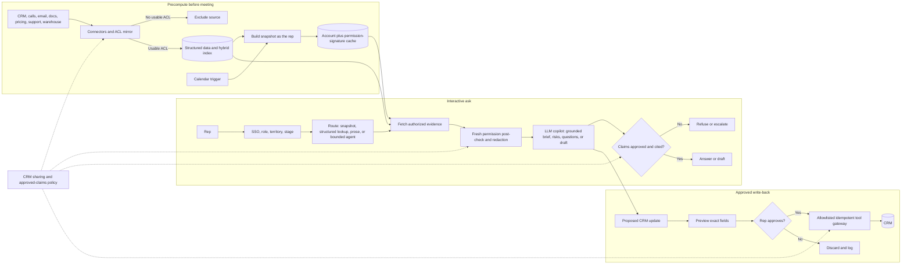

# G05 — Sales Copilot: Main Interview Guide

**Sales process** is the path from “we might sell” to “the deal is won or lost”: find a company, book a meeting, learn their pain, send a proposal, negotiate, update CRM, close.

**G05 covers one slice of that loop:** prep for a meeting, then maybe a follow-up and a CRM update. Not the whole funnel.

End to end, as Sara:

1. **Calendar says Acme tomorrow.** Overnight we pack her Acme brief (only what she is allowed to see).
2. **She opens the copilot** and asks: summary, risks, discovery questions, draft email, suggested CRM fields.
3. **We check who she is**, pick a path (cached brief, a number lookup, search in notes, or a short agent), and fetch allowed evidence.
4. **We check permissions again**, then the model writes from that evidence.
5. **If she wants an email or a discount claim**, we block anything not on the approved sheet.
6. **If she wants CRM changed**, she previews the exact fields, clicks yes, we write once.

That’s it: **prepare → ask → prove it from her data → don’t invent claims → don’t write CRM until she says yes.** Prospecting, legal, and billing stay out of scope.

> **Core idea:** Give a rep a useful, cited account brief without showing records they cannot access, inventing customer facts, making unapproved claims, or writing to CRM without preview and approval.

Use this for the spoken design. The [Deep Dive](G05_Sales_Copilot_Deep_Dive.md) has the mechanisms and incident drill, and the unchanged [source case](G05_Sales_Copilot.md) is the full reference.

## 1. Start with the workflow and risk boundary

An account executive has a meeting soon. They need an **account summary**, **opportunity risks**, **discovery questions**, **email drafts**, and **CRM update suggestions**. These outputs sit on three levels of risk: read-only assistance, drafts the rep reviews, and approved write-back. A ten-minute saving is worthless if the draft invents a certification or the rep sees a peer’s territory.

> “I’ll start from the pre-meeting workflow and separate reading, drafting, and writing. I’ll make the brief fast by precomputing it as the rep, then recheck their permissions at serve time. Any customer-facing claim must be approved and cited; any CRM write must be previewed and approved.”

### Questions to ask the interviewer

The [source discovery, §1](G05_Sales_Copilot.md#1-name-the-workflow-and-the-risk-boundary-before-drawing-anything) expands these questions:

| Question to ask                                                                  | What it's really asking                                                                                            | What you then decide                                                          |
| -------------------------------------------------------------------------------- | ------------------------------------------------------------------------------------------------------------------ | ----------------------------------------------------------------------------- |
| Which sales task is slow or inconsistent, and what decision follows the brief?   | Is this "prep me for the Acme call in 20 minutes," and does the brief change what they say on the call?            | First workflow, the five outputs, and the success metric.                     |
| Who uses, reviews, and owns a wrong answer or outbound claim?                    | If the email claims a certification we don't have, who gets blamed — the rep, sales ops, or legal?                | Who approves, who audits, and who we escalate to.                             |
| Which tasks are read-only, draft-only, or require approved write-back?           | Can it show CRM facts, only draft an email, or actually update the opportunity after a click?                      | Tool allowlist and what v1 may write.                                         |
| Which systems are authoritative, fresh, and permissioned by account/territory?   | Can a rep see a peer's deal in another territory, and is last quarter's usage still "current"?                     | Connectors, structured vs semantic route, and snapshot freshness.             |
| Which claims, prices, discounts, or customer references are approved externally? | Can the draft promise 20% off, or only prices from the approved sheet?                                             | Claim verifier and which pricing policy version is live.                      |
| What must be refused when evidence or access is missing?                         | If we don't have the contract, do we invent a renewal date or say we don't know?                                   | Abstain, mark stale, or fall back.                                            |
| What should a 30-day pilot prove?                                                | After a month, did prep get faster without fake claims going out?                                                  | Accuracy, prep time, adoption, claim safety, and outcomes.                    |
| What must an audit reconstruct?                                                  | If legal asks why that email mentioned HIPAA, can we show the source, the permission check, and who approved send? | Evidence IDs, versions, permission checks, draft approval, and write receipt. |

If these answers are missing, keep the first release read-only, restrict sources to approved accounts, and treat external drafts and CRM writes as gated.

### G05 is the anchor for its sales-assistant variants

| Related case                          | What changes from G05                                                                                         |
| ------------------------------------- | ------------------------------------------------------------------------------------------------------------- |
| Account-research assistant question   | Broader CRM/email/usage/support/public-source integration, entity resolution, seller adoption and time saved. |
| Slow agentic CRM assistant            | Serial tool calls and agent steps dominate; precompute, cache, parallelize reads, and bound the graph.        |
| Sales email model-regression incident | Claim-level release gates, online unsupported-claim monitoring, and block-mode policy enforcement dominate.   |

## 2. Requirements and scope

### Functional requirements

1. Produce the five workflow outputs, each with its own risk level.
2. Ingest approved CRM, transcript, email/calendar, product, pricing, support, and warehouse sources with IDs, freshness, and ACL metadata.
3. Pre-filter by tenant, role, territory, sharing rules, and field access; recheck before generation/serving.
4. Cite account facts and opportunity risks to fetched records; expose missing evidence.
5. Verify every outbound claim against approved messaging and versioned pricing policy.
6. Preview exact CRM field changes and require approval before any write-back.

First release excludes autonomous email sending, unapproved CRM writes, disallowed price/discount quotes, lead scoring, out-of-territory access, and independent long-term customer memory.

### Non-functional requirements

| Constraint   | Source-case target or rule                                                                                                           |
| ------------ | ------------------------------------------------------------------------------------------------------------------------------------ |
| Latency      | Interactive answers around 3–8 s; pre-meeting brief built ahead of time; long work async.                                           |
| Availability | During selling hours, serve a permitted last snapshot with a staleness label when safe, or refuse.                                   |
| Security     | SSO, CRM record/field permissions, tenant/region constraints, scoped secrets, no customer-data training without contract permission. |
| Correctness  | Unsupported external claims blocked; missing citations or uncertain access fail closed.                                              |
| Audit        | Queries, evidence, permissions, model/policy version, draft approvals, final output, write receipt.                                  |
| Cost         | Budget per workflow; cache stable sources; prune retrieval; small models for routing, stronger model only when justified.            |

## 3. Architecture

This condenses the [source architecture, §4](G05_Sales_Copilot.md#4-draw-the-architecture-end-to-end) into three lanes.

### Step-by-step architecture

- **Step 1.** **Prepare authorized data.** Connect CRM and other sources, mirror their ACLs, and exclude records whose permissions cannot be represented.
- **Step 2.** **Precompute a rep-scoped snapshot.** Keep structured facts and searchable prose; a calendar trigger builds a meeting snapshot as the rep and caches it with a permission signature.
- **Step 3.** **Resolve the current rep context.** At question time, check SSO identity, role, territory, and deal stage.
- **Step 4.** **Route and fetch.** Use deterministic snapshot, structured lookup, or prose routes for common asks; reserve a bounded agent path for ambiguous multi-step asks.
- **Step 5.** **Recheck access.** Apply fresh permission checks and field redaction before using cached or live evidence; a snapshot never grants access.
- **Step 6.** **Ground and verify.** The LLM copilot builds the brief, risks, questions, or draft from authorized evidence; verify citations and approved claims, or refuse and escalate.
- **Step 7.** **Control CRM write-back.** Preview exact proposed fields, require the rep's approval, and send approved updates through the allowlisted idempotent gateway; discard and log rejected changes.

**Model and agent role:** The LLM copilot summarizes and drafts from permission-checked evidence. A bounded agent can coordinate ambiguous next steps, but common CRM counts and lookups stay on reviewed deterministic routes. The model cannot approve an external claim or write to CRM.

**Three boundaries:** precompute keeps slow source fan-out off the question path; the permission post-check protects a snapshot after a territory change; preview and approval protect every CRM write. Precomputation speeds access but never grants access.

## 4. Source authority and permission fidelity

CRM has account and opportunity truth. Its sharing rules include record owner, role hierarchy, territory, special sharing, and field-level security. Calls/transcripts need participant and consent rules. Mailbox data belongs to the mailbox owner unless delegated. Pricing comes from a versioned deal-desk policy; approved outbound claims from a playbook. Support and warehouse facts can be account- or role-scoped. A structured count over another rep’s territory is a leak just as much as a forbidden document.

Mirror source ACLs at ingest and compile tenant/territory/role filters into retrieval. Recheck fresh source attributes, sharing, and field masks before serving or generating. A rep moved off a territory at noon must not see a 9 a.m. cached snapshot. Invalidate on role/territory change and key the snapshot by account plus permission signature. Source credentials stay in a vault by reference and never appear in model context or traces.

## 5. Route questions to the right evidence

Use **semantic/hybrid search** for “summarize the last three calls,” a **fixed structured CRM operation** for “how many open opportunities missed the close date?”, and **direct ID lookup** for a named opportunity. Mixed questions filter CRM records first, then summarize related prose. A vector search cannot compute an authoritative count; a generated database query may invent fields or scan outside the rep’s scope. Use reviewed operations behind the same allowlist as tool calls.

Opportunity risks come from fetched fields: old stage, slipped close date, competitor mention, unanswered follow-up, open escalation, and relevant playbook objection. Cite each. If fields are absent or transcripts stale, say what could not be checked; do not infer what a typical deal “probably” looks like.

## 6. Claims and write-back

Every external email claim must map to an **approved-claims playbook entry** or current pricing policy. The verifier **blocks**, rather than merely warns, on unsupported or internal-only claims. Personalization uses the account’s own record and interactions. A draft remains the rep’s to review and send; the assistant does not send email in the first release.

A CRM update is a proposal: exact fields previewed → policy check → human approval → idempotent gateway → CRM receipt/audit. Read tools may run automatically. Amount, stage, close, and externally visible actions remain above the risk threshold on day one; only proven low-risk fields might later earn auto-approval.

## 7. Failure, latency, and cost

| Failure                                  | Safe response                                                        |
| ---------------------------------------- | -------------------------------------------------------------------- |
| CRM down                                 | Last authorized snapshot with staleness label where safe; no writes. |
| Permission or approval service down      | Fail closed; no answer from uncertain access and no write.           |
| Missing/stale evidence                   | Disclose gap, abstain or escalate; never fill from model memory.     |
| Unapproved price/certification/ROI claim | Block external draft.                                                |
| Prompt injection in transcript/email     | Treat as data; cannot unlock tools or override claim policy.         |
| Model or vector path down                | Narrow labeled fallback or queue with progress.                      |

At 10× accounts, shard snapshot jobs by territory and isolate connectors by source. If account prep takes 30–45 s, trace steps and tool latency first. Precompute on the calendar event; use deterministic routes, cache the permission-scoped snapshot, parallelize remaining read-only calls, cap steps/top-k, and reserve an agent for ambiguous work. Measure cache hit rate, p95, steps, tool time, and cost per workflow.

## 8. Evaluation, rollout, and regression drill

Gate on **zero permission violations** and **zero critical unsupported external claims**. The source’s example thresholds also include ≥90% grounded claims, ≥95% correct citations, ≥80% target workflow completion, and ≥95% correct high-risk escalation. Report prep-time reduction, adoption, brief accuracy, citation coverage, conversion/meeting quality, latency, and cost alongside safety. Critical slices pass independently; an aggregate score cannot hide them.

Start with one CRM connector, three reps in distinct territories, historical briefs and SME-approved answers. Add permission red-team and claim-level negative cases, shadow mode, live read-only pilot, then drafts and approved write-back. Keep model versions pinned and canary each route change.

The [source regression, §14](G05_Sales_Copilot.md#14-debug-the-model-regression-incident) shows why: a model upgrade had a **96.7% aggregate pass rate over 120 cases**, but only **six regulated-claim cases** passed at **83.3%**; online unsupported claims rose from **1.2% to 8.7%**, and the verifier had been changed to warn-only. Contain by rolling back the model route and restoring block mode. Add independent gates for pending certifications, internal-only ROI, and unapproved customer references.

## 9. Interview delivery

Spend the hour on workflow and risk (8 min), sources/permissions (7), architecture (10), CRM and evidence/claim boundaries (15), failure/evaluation/rollout (10), close and follow-ups (10).

> “I’d design around the rep’s pre-meeting workflow. I’d build an account snapshot ahead of time as that rep, keyed by their permission signature, but recheck current territory and field access before serving it. A router chooses the snapshot, reviewed CRM operations, or hybrid search. Every fact and opportunity risk comes from fetched, authorized evidence. External drafts pass a blocking approved-claims check; CRM changes are previewed and approved before an idempotent tool call. I’d start read-only, test cross-territory access and claim-level failures, then expand only when critical slices, adoption, latency, and cost hold.”

| Follow-up                            | Short answer                                                                              |
| ------------------------------------ | ----------------------------------------------------------------------------------------- |
| Fabricated customer fact?            | Claim-level citations to fetched records; abstain on missing data; block external claims. |
| Rep changed territory?               | Invalidate snapshot, recheck fresh policy at serve time.                                  |
| Why not a model-generated CRM query? | Fixed reviewed operations bound fields, rows, and permission scope.                       |
| Why not direct write?                | Exact-field preview, approval, idempotency, audit.                                        |
| Slow account prep?                   | Calendar precompute and bounded deterministic ask path.                                   |

**Final mental model:** Authorized sources → precompute as rep → reauthorize at ask → route evidence → cite and verify claims → preview and approve any write.
