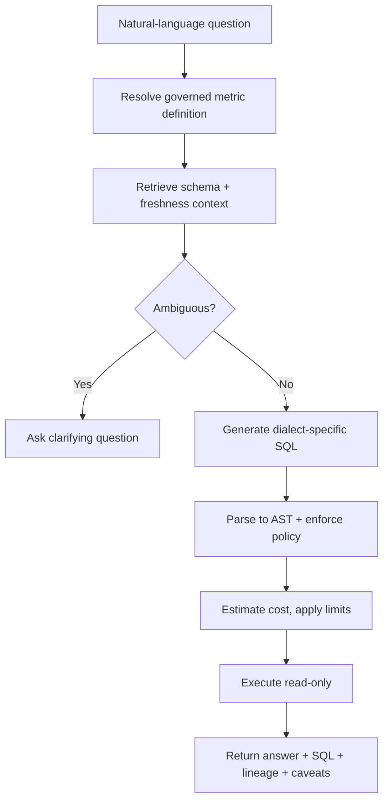
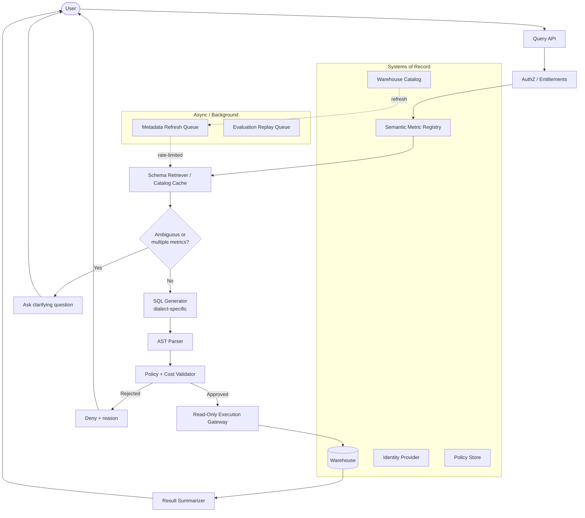
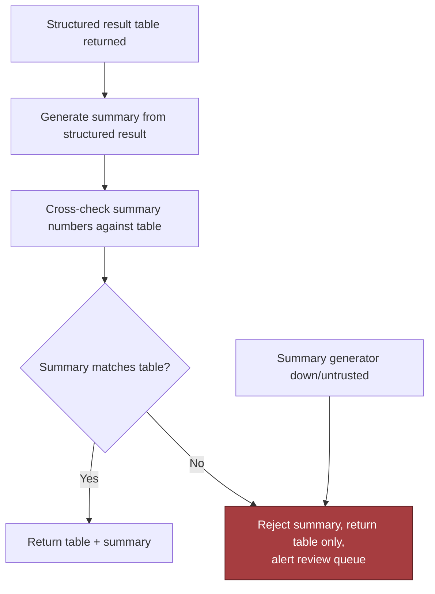
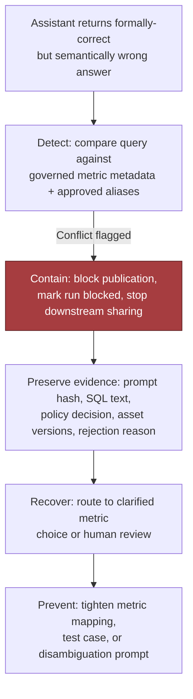
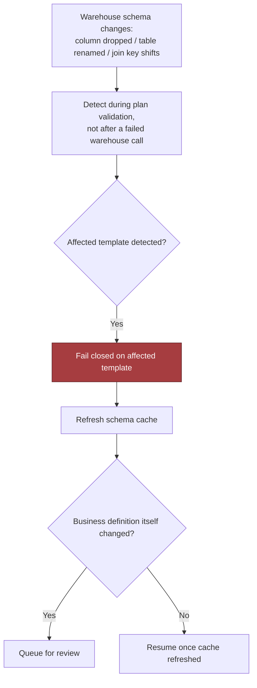
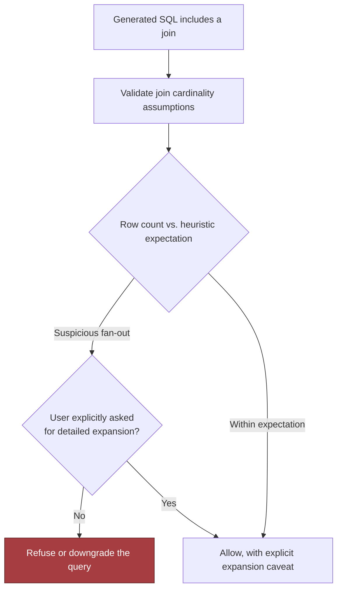
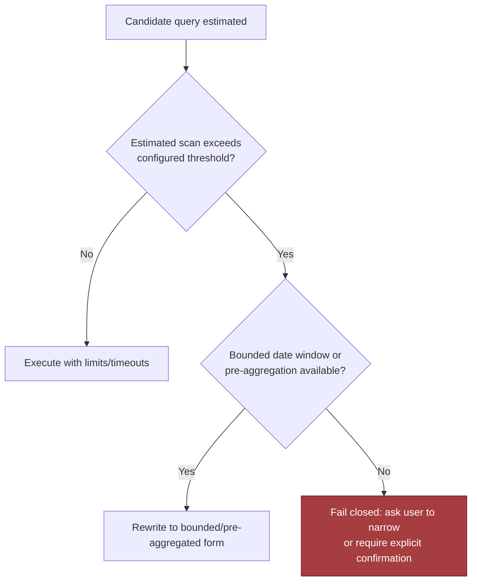
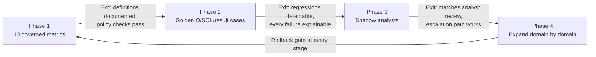
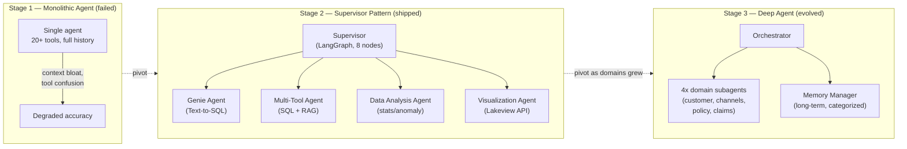

# Natural Language over Governed Data

*Give executives an answer in seconds without ever letting the model decide what "revenue" means: the semantic layer, not the model, is the product.*

◷ 40 min

The hard part of this system is not generating SQL. It is that a syntactically perfect query against the wrong definition of a metric is a governance failure dressed up as a working feature. So the design anchors every question on a governed definition before it touches a table. This page consolidates group G06 of `CASE_STUDY_INDEX.xlsx` into one read for the day before. Everything else in the group is a delta on it.

| Case in the group | What it contributes here |
|---|---|
| #17 Natural-Language-to-SQL Analytics Assistant (anchor) | Sections 1 to 12: the design, requirements, validation, failure drills, evaluation, rollout and delivery |
| #36 Executive Dashboard Copilot | The executive persona and variance explanation in sections 1 and 8; its escalate-to-analyst rule |
| #34 Retail Demand Forecast Explanation Assistant | The planner persona, driver attribution and the correlation-versus-causation risk in section 8 |
| #13 From Supervisor to Deep Agent (AIA governed data assistant) | The seven metric views, the Genie-versus-Multi-Tool split, the clarify-below-60% gate, and section 13's story |
| Self-drill for #17 | Section 14, the cost pivot |

---

## 1. Name the Wrong-Answer Risk Before Drawing Anything

Open with the failure, not the pipeline. Executives ask analysts the same handful of questions every week, and each time someone hand-translates English into SQL, runs it and sanity-checks the result. The naive pitch, "let an LLM write the SQL", loses the interview immediately, because generation is not the hard part. "Revenue" might mean booked, recognized or cash collected. The system must never produce valid SQL that confidently answers the wrong business question. That failure is more dangerous than an outright error, because the SQL ran, the chart rendered, and the number looks plausible.

Reframe the ask from "build a text-to-SQL model" to "build a governed decision-support system that only speaks in terms the business has already agreed to". That framing implies three things from day one. A semantic layer of governed metric definitions. A safety boundary around the warehouse that is read-only and cost-bounded. And an explicit way to say "I don't know which definition you mean" instead of guessing.

The three answer tiers show what the reframe buys. The weak answer lets an LLM write SQL against the schema and run it. It ignores who owns metric definitions, allows an unapproved reading of revenue, and has no AST validation, cost bound or way to notice a confident wrong answer. The average answer adds a semantic layer, validates before running, executes read-only with row limits and logs every query. It still never says what happens when the question is ambiguous, when the schema drifts, or when the prose summary disagrees with the table. The strong answer consults the metric registry before any physical table and turns ambiguity into a clarifying question. It parses SQL into a tree and checks it against policy and a scan budget before a read-only gateway sees it. It re-checks entitlements at execution. And it proves the whole thing on ten governed metrics with golden cases before any executive sees output.

Then ask the questions that change the architecture, before sketching a box. Each one decides a component.

| Question to ask | What the answer decides |
|---|---|
| Who owns each metric definition, how often do definitions change, and who approves a change? | Whether a metric registry exists as a product, and who is the named owner per domain |
| Is there already a semantic layer or metrics catalog, or must this system build one? | The largest single scope decision in the project |
| Which SQL dialects and warehouses are in scope? | Generation and validation breadth; one dialect or many |
| What is the tolerance for latency versus cost? Synchronous, or async and cached? | Where the sync/async boundary sits |
| Is row-level and column-level security already enforced by the warehouse, or would the assistant reimplement it? | Whether authorization is reused or rebuilt, which is the classic bug |
| What happens when the assistant is unsure: ask, refuse, or escalate to an analyst? | The ambiguity gate's three modes |
| Which ten metrics matter most, and what does "revenue" actually mean: booked, recognized, or collected? | The MVP scope and the first golden cases |
| What audit evidence must exist so someone can reconstruct why a number was produced? | The query-run record's schema |

Map the people, because the three groups want different things and the architecture has to satisfy all three at once. That tension is exactly why the semantic layer and the policy and cost validator are first-class components rather than afterthoughts bolted onto a chat UI.

| User | Wants | Failure they notice first | What the assistant gives them |
|---|---|---|---|
| Executive | Fast, correct answers with minimal back-and-forth, never "let me check with analytics" | A plausible number that turns out to be the wrong definition | Governed answers with the definition shown, variance explained, uncertain cases escalated |
| Analyst | Repetitive definitional lookups taken off their plate, without the assistant inventing new interpretations | The assistant redefines a metric they maintain | Golden cases they review; escalation queue; the analyst stays the source of truth during shadowing |
| Data / platform engineer | Bounded blast radius: no whole-warehouse scans, no restricted-column leaks, no company-wide budget blowups | One ambiguous question exhausting concurrency | Read-only gateway, scan budgets, warehouse-native policies reused |
| Metric owner | One versioned definition every consumer shares | Two answers to one question | The registry as the single artefact, with approval on change |

The same design arrives with two more personas from the purchased worksheets. The Executive Dashboard Copilot user asks natural-language KPI questions. The copilot translates them to governed metrics, retrieves dashboard and data context, explains variance, cites metric definitions, and escalates uncertain answers to analysts. The Retail Demand Forecast Explanation Assistant user is a planner reviewing forecast variance who asks why demand changed. The assistant explains drivers using sales history, promotions, weather, inventory and events, and recommends human-reviewed planning actions. Neither changes the architecture. Both add a variance-explanation step after the query, which section 8 covers.

Declare the non-goals as a scope fence. This is not a system that lets users author write queries or modify data. It is not a general-purpose exploration tool for every table in the warehouse; it answers a governed set of business questions. And it is not responsible for defining what "revenue" means. That is a business decision the semantic layer records, not one the assistant makes on the fly.

## 2. State Requirements as Testable Constraints

Correctness dominates every other axis. A fast, confidently wrong answer is the single worst outcome, because the executive has no way to know it is wrong. So the system trades latency for safety every time. Asking, narrowing scope or refusing are all preferable to guessing. Depth on ten metrics beats shallow coverage of the whole warehouse.

The functional core is one pipeline, and the must-haves are its stages. Take a natural-language question. Resolve it against governed metric definitions before touching physical tables. Retrieve only the tables, joins and freshness context needed, never the whole schema. Detect ambiguity and ask rather than silently choosing one of several plausible metrics. Generate dialect-specific SQL from the narrowed context only. Parse it into an AST and enforce policy against the tree, not the text. Estimate cost and execute read-only with limits. Return the result with the exact SQL, metric lineage and caveats such as snapshot staleness.



The should-haves come from the copilot personas:

- show confidence, missing evidence and the escalation reason when uncertain
- collect user feedback and reviewer corrections for evaluation, never for ungoverned training
- give admins controls over source inclusion, freshness thresholds, policy rules, blocked actions and audit export

Richer query planning, human approval for ambiguous cases, learned query ranking, federated sources and semantic search over data dictionaries can wait.

"Good" for the MVP has one definition: the system reliably answers ten governed metrics with full lineage and explainability. If it cannot do that, it is not ready to become a general interface to the warehouse.

| Constraint | Stated so it can be tested |
|---|---|
| Correctness | A fast, confidently wrong answer is the worst outcome, so latency is traded for safety every time |
| Latency | The user-facing path stays synchronous. Anything that only improves future answers moves to background queues. Interactive answers 3 to 8 s for the copilot personas; longer workflows async with progress state |
| Security | A read-only identity that reaches only approved datasets, with warehouse-native row and column policies reused rather than reimplemented. SSO, encryption in transit and at rest, secrets management, no training on customer data unless the contract allows |
| Compliance | Append-only query runs recording actor, SQL hash, policy decision, bytes scanned, and the schema and metric versions used |
| Reliability | Fail closed on policy evaluation, planner timeouts and suspicious scan volume. Degrade on formatting or explanation failures |
| Cost | Scan budgets, row limits, timeouts and bounded date windows, because an unbounded query is a reliability problem, not just a bill. Token budgets and small models for routing |

Every must-have then needs an owner in the architecture.

| Requirement | Primary component(s) |
|---|---|
| Anchor on a governed definition | Semantic metric registry, consulted first |
| Retrieve only what is needed | Schema retriever with catalog cache, TTLs and version stamps |
| Ask rather than guess | Ambiguity check with a confidence threshold |
| Dialect-specific generation from narrowed context | SQL generator, stateless |
| Policy against the tree | AST parser, policy and cost validator |
| Bounded, read-only execution | Read-only execution gateway with the narrowest credentials |
| Answer with SQL, lineage, caveats | Result summarizer with cross-check against the table |
| Reconstruct any number | Append-only query-run store, versioned metrics, schema snapshots and policy bundles |

## 3. Map Every Source and Who Owns Its Definition

Three kinds of state exist here, and each has one owner. The warehouse catalog owns physical schema truth. The semantic metric registry owns business definitions. The identity provider owns authentication and the policy store owns access decisions. Caches hold schema snippets, metric lookups and recent plans only as a performance layer, with TTLs and version stamps so the system can explain what it used. Question interpretation, candidate SQL, the AST, the validation result and the execution trace are short-lived workflow state and must not become hidden durable state.

| Data source | Owner | Freshness | Permission model | Risk |
|---|---|---|---|---|
| Warehouse (fact and dimension tables, gold layer) | Data owner | Minutes to daily by table | Warehouse-native row and column security | Join fan-out, unbounded scans, renamed tables |
| Semantic layer / metrics store | Metric owners per domain | Changes on approval | Definition-level ownership, versioned | Two definitions of one word; silent overwrite by another team |
| Warehouse catalog and lineage | Data platform | Crawled on a schedule | Filtered to what the caller may see | Stale join paths after an overnight rename |
| BI dashboards | Dashboard owners | Refresh time per dashboard | Dashboard sharing | Stale refresh presented as current |
| Financial planning, CRM, ERP | Finance and sales systems owners | Daily to weekly | Source-system roles | Numbers that disagree with the warehouse |
| Forecasting platform, POS sales, inventory, promotions calendar, pricing, weather and event feeds (retail persona) | Planning and merchandising | Daily; feeds hourly | Region and store scope | Stale promotions data; correlation read as causation |

The core records follow. Metric(id, name, definition, dimensions, owner, version). SchemaAsset(id, engine, object, columns, sensitivity). QueryRun(id, actor, sql_hash, policy_decision, bytes_scanned, result_ref). The copilot personas add KPIValue(metric_id, period, dimension, value, source_table), Dashboard(id, owner, metric_ids, refresh_time), Insight(id, metric_id, explanation, supporting_queries, confidence) and UserAccess(user_id, metric_id, dimension_scope). The retail persona adds SKU, Store, Forecast(id, sku_id, store_id, horizon, prediction, confidence), ActualSales, DriverSignal(id, type, value, source, timestamp) and Explanation(forecast_id, top_drivers, confidence, caveats).

State the versioning rules aloud. Metric versions are retained long enough to reconstruct why last quarter's dashboard produced a different number than today's. QueryRun is write-once and append-only, because query history is where incident review and adoption analysis start. Every artifact that influences behavior is versioned, whether metric definitions, schema snapshots, policy bundles or generated plans, or the system works in the happy path and fails at rollout. Idempotency keys go on question submission and feedback, and optimistic concurrency on metric edits, so one team cannot silently overwrite another team's definition.

## 4. Draw the Architecture End to End

The architecture is a chain of trust boundaries, best explained in dependency order rather than as a flat list of boxes. One diagram carries the whole design; sections 5 to 8 zoom into its stages. The organising split is control plane against data plane: definitions, policies, schedules and evaluation rules are releases; every question is a request.

```
 ╔═══════════════════════════════ CONTROL PLANE (changes are releases) ═══════════════════════════════╗
 ║  semantic metric registry (versioned, owner-approved) · policy bundles (tables, columns, joins,     ║
 ║  scan budgets) · warehouse-native RLS/CLS · catalog crawl schedules · prompt + model versions ·      ║
 ║  golden question/SQL/result cases · dashboards of record                                             ║
 ╚══════════════════════════════════════╤═══════════════════════════════════════════════════════════════╝
                                        │ configures every box below
 ╔═══════════════════════════════ DATA PLANE (calls are requests) ════════════════════════════════════╗
 ║                                                                                                      ║
 ║  BACKGROUND — asynchronous, partitioned by tenant / warehouse / dataset family                       ║
 ║   catalog crawler ─> metadata refresh queue (rate-limited) ─> catalog cache (TTL + version stamp)    ║
 ║   evaluation replay queue ─> golden-set replay on every change ─> regression report                  ║
 ║                                                                                                      ║
 ║  QUERY — synchronous, ordered by risk                                                                ║
 ║   user ─> query API ─> AUTHZ ─> METRIC REGISTRY ─> SCHEMA RETRIEVER ─> AMBIGUITY? ─> SQL GEN ─>      ║
 ║           authN,      entitle-  governed         only the tables,   < threshold:  dialect-          ║
 ║           intent      ments     definition       joins, freshness   ASK, not      specific,          ║
 ║                                 first            needed; freshness  guess         narrowed context   ║
 ║                                                  gate                                                 ║
 ║        ─> AST PARSE ─> POLICY + COST VALIDATOR ─> READ-ONLY GATEWAY ─> WAREHOUSE ─> SUMMARIZER ─> answer
 ║           tree, not    tables, columns, joins,    narrowest creds,    RLS/CLS      table + SQL +     ║
 ║           text         writes, cross joins,       timeout, row        enforced     lineage + caveats;║
 ║                        scan budget; re-check      limit, cost         natively     summary cross-    ║
 ║                        entitlement at execution   estimate                          checked vs table  ║
 ║                              │ reject                    │ budget exceeded                │ mismatch   ║
 ║                              v                           v                               v            ║
 ║                        deny + reason           cancel + safe fallback        table only + review queue ║
 ║                                                                                                      ║
 ║  OBSERVABILITY — every stage writes                                                                  ║
 ║   append-only query runs (actor, sql_hash, policy decision, bytes scanned, metric + schema versions) ║
 ║   ─> dashboard: business outcome / model quality / system health · alerts on escaped policy, scan   ║
 ║      drift, trust decline                                                                            ║
 ╚══════════════════════════════════════════════════════════════════════════════════════════════════════╝
```

The tutorial's own component view, with its systems of record and queues, is the rendered form of the same flow.



Read the components in dependency order. Every box should answer who owns its state, how fresh it is, and why it exists; a box without those answers was premature.

| Component | Responsibility | State owner | Boundary type | MVP or later |
|---|---|---|---|---|
| Catalog crawler | Ingest warehouse schema, comments, freshness, lineage | Warehouse metadata source | Async background | MVP if warehouse is small; later if manually seeded initially |
| Semantic metric registry | Governed metric definitions and allowed grains | Product/data governance | Sync read, async update | MVP |
| Schema retriever | Fetch relevant tables, joins, freshness, permissions | Cache with source-of-record fallback | Mostly sync | MVP |
| SQL generator | Produce dialect-specific candidate SQL | Stateless service | Sync | MVP |
| AST parser | Normalize and inspect candidate SQL | Stateless service | Sync | MVP |
| Policy and cost validator | Enforce entitlement, query shape, scan limits, and execution rules | Policy store | Sync | MVP |
| Read-only execution gateway | Submit approved queries with limits and audit | Warehouse credentials / gateway | Sync | MVP |
| Result summarizer | Convert rows into explanation, SQL, lineage, caveats | Stateless service | Sync | MVP |
| Evaluation harness | Replay prompts, compare outputs, detect regressions | Test corpus / telemetry store | Async | Later evolution, but useful early |

Three boundaries are worth pointing at while the diagram is up. The sync/async boundary follows one rule: anything that must be correct before one answer is returned stays synchronous; anything that improves future answers can be asynchronous. The trust boundary sits at the read-only gateway, which holds the narrowest credentials and no write path; nothing generated by the model reaches the warehouse except through it. And consistency points are explicit. Entitlement and policy are re-checked at the moment of execution, not only at planning. A user who loses access between planning and execution is refused. A material registry version change never silently reuses an old interpretation. The partitioning key for queues preserves the natural isolation boundary, usually tenant, warehouse, region or dataset family. One noisy customer or one large catalog refresh then cannot starve unrelated work.

## 5. Anchor Every Question on a Governed Metric

The semantic layer is the product, and the model is a translator into it. "Revenue last week" must anchor on the governed definition of revenue before the system starts searching for tables. A model cannot infer a business definition that the business has not written down. The registry is consulted first, before any physical table, and raw schema access is an escape hatch for approved exploratory workflows, never the default.

The AIA engagement in section 13 makes the same choice concrete: seven governed metric views, not raw fact tables. If the agent and a human analyst compute "claims by region" differently, with different date logic or different exclusions, trust in the whole system collapses. A metric view makes the KPI definition one versioned artefact every consumer shares, and the semantic-layer version of that sentence is the strongest line in this section.

Put a router in front of retrieval, because a real deployment mixes structured and semantic questions freely. Semantic search answers "which things are like this", never "how many", "which is most recent" or "sum this field".

| Question shape | Right tool | Why plain search fails |
|---|---|---|
| "Why did this customer's system break in March?" | Semantic search over documents and post-mortems | — |
| "How many high-priority tickets did they file last week?" | A structured query (count/filter) | Search returns *similar* records, not a count |
| "What's the status of ticket #4821?" | Direct lookup by ID | Treating an ID as ordinary text is wasteful and imprecise |
| "Summarise the pattern across all high-priority billing tickets this quarter" | **Both**: filter first, then summarise the filtered set | A filter cannot summarise prose; search cannot reliably scope to "this quarter's high-priority billing tickets" |

The structured path itself is a choice between two mechanisms. Generate a query from natural language and run it against a small, fixed, well-documented view. That is fast, but the model can invent fields, so the query must be validated or its result sanity-checked before it is trusted. Or call a small set of fixed, well-defined operations. That is safer, because the surface of what can happen is a reviewed set of operations rather than an open-ended language. Fixed operations are usually the better default in an enterprise. The AIA design made that decision per specialist. A managed text-to-SQL service over curated tables is the safe default. One deliberately narrower place allows hand-generated SQL for ad-hoc questions outside the curated scope.

Two rehearsed answers live here. When asked how to handle revenue with three definitions, name the ambiguity and ask a clarifying question. Show the supported definitions. Default only where the business has an approved canonical meaning for that context. If users ask it often, put it in the semantic layer with explicit aliases. And when the interviewer pushes on the riskiest assumption, that the model can infer the right business meaning from the prompt:

> *"I would not rely on the model to infer business definitions from raw text. I would anchor every answer to a governed semantic layer, and treat any question that falls outside that layer as an explicit ambiguity to resolve, not a guess to make."*

## 6. Ask When Ambiguous, Never Guess

If a question could map to multiple governed metrics or grain levels, the system stops and asks. A valid SQL query that answers the wrong business question is still a failure, and a clarifying question costs one round trip where a guess costs an executive decision. The gate has three modes, agreed with the customer in discovery: ask a clarifying question, refuse, or escalate to an analyst.

Give the gate a number. The AIA supervisor classifies each question into `simple_kpi`, `deep_analysis`, `document_lookup`, `visualization` or `conversational` with a confidence score, and its clarify node fires only below 60%. "Show me the numbers" gets a clarifying question, not a guess. A threshold makes the behaviour testable and tunable; "the model will ask when unsure" does not.

Ambiguity is also a freshness signal. When the catalog is stale beyond a threshold, the retriever refreshes through the async queue before allowing generation, falls back to a narrower supported question set, or asks. If freshness is uncertain, do not pretend precision. And the failure policy for a business-definition conflict is human intervention, because a wrong answer is worse than a slower answer.

## 7. Validate SQL as a Tree, Then Execute Read-Only

Valid SQL is not safe SQL. Regex can spot an obvious `DROP TABLE` string but cannot understand aliases, nested selects, CTEs, comments, obfuscation or a harmless-looking subquery that becomes unsafe after rewrite. A parser can inspect structure: statements allowed, tables allowed, columns allowed, joins allowed, functions allowed, limits present, aggregate semantics acceptable. Safety depends on syntax trees and policy rules, not pattern-matching theatre.

Four controls make up the boundary, and each reduces risk differently, so together they are defence in depth.

| Control | What it does | Abuse it stops |
|---|---|---|
| Least privilege | A read-only identity that can inspect only approved datasets and only the operations needed for analysis | A prompt injection or bad plan becoming a write, delete or privilege escalation. A request for hidden customer emails is rejected because the identity cannot read that column, not because the model probably refuses |
| Warehouse-native row and column policies | Let the warehouse enforce which tenant, region or role sees which slice, instead of reimplementing it in application code | The classic bug where the application filters one path and forgets another; an error in one tenant's policy exposing another tenant |
| Parse, do not regex | Inspect the AST for writes, unbounded cross joins, unauthorized tables, unexpected functions, missing limits and scan-budget violations | Obfuscated or nested SQL that passes a string filter |
| Result hygiene | Mask sensitive fields on the response path; log hashes or redacted fingerprints instead of raw data | A second leakage channel through logs; a replayable copy of sensitive output |

The hidden-column invariant is worth proving in front of the interviewer. It shows that a valid SQL string is still rejected when it requests a column outside the actor's permissions. A production version uses a dialect-aware parser and a policy source from the warehouse or a central registry, and logs the decision with redacted evidence.

```python
class PolicyError(Exception):
    pass

@dataclass(frozen=True)
class Actor:
    name: str
    permitted_columns: frozenset[str]

marketing_user = Actor(name="marketing", permitted_columns=frozenset({"customer_id", "country", "plan"}))

def parse_selected_columns(sql: str) -> list[str]:
    normalized = " ".join(sql.strip().split())
    upper = normalized.upper()
    if not upper.startswith("SELECT ") or " FROM " not in upper:
        raise PolicyError("Only simple SELECT queries are allowed in this sketch")
    select_part = normalized[7 : upper.index(" FROM ")].strip()
    if select_part == "*":
        raise PolicyError("Wildcard selects are not allowed")
    columns = [c.strip() for c in select_part.split(",")]
    if any(not c for c in columns):
        raise PolicyError("Malformed column list")
    return columns

def approve(sql: str, actor: Actor) -> bool:
    columns = parse_selected_columns(sql)
    denied = [col for col in columns if col not in actor.permitted_columns]
    if denied:
        raise PolicyError(f"actor {actor.name} may not access columns: {', '.join(denied)}")
    return True

def test_rejects_hidden_column_exfiltration():
    sql = "SELECT email FROM customers"
    with pytest.raises(PolicyError):
        approve(sql, actor=marketing_user)
```

After policy, estimate cost. Approved queries get a cost estimate, a timeout and a row limit, then run through the read-only gateway. Prefer bounded date windows and pre-aggregations. When a request would scan beyond the configured threshold, ask the user to narrow it, propose a cheaper rewrite, or require approval from a more privileged role. Never let the model "just try it". The model must not rewrite access predicates either, and if the assistant needs schema metadata, that metadata is filtered to what the user can see.

Execution is risk-based. Auto-run only when confidence is high, the query fits an approved pattern, the user has permission and the estimated cost is below threshold. Otherwise show the draft SQL and ask for confirmation or analyst review. Full auto-execution feels magical and is dangerous when a query may touch sensitive rows, incur high cost or answer an ambiguous request.

## 8. Explain Variance From the Data, Not From Memory

The executive reads the prose, not the rows. So the summary is generated from the structured result and its key values are cross-checked against the table. Any summary whose numbers do not match is rejected. The table alone is returned, with an alert to the review queue. If the summary generator is down or untrusted, degrade to the table rather than fabricate confidence.



The two copilot personas extend the summary into an explanation, and the same rule holds: every driver named must trace to a query. The executive copilot explains variance against the governed definition, cites the metric definition it used, and escalates uncertain answers to analysts. The retail explainer attributes a forecast variance to drivers from sales history, promotions, weather, inventory and events, then recommends planning actions that a human reviews before any order changes. Its red-team list names the risks precisely: confusing correlation with causation, hallucinated drivers, stale promotions data, recommendations biased against stores or regions, and over-ordering because an explanation sounded confident.

Keep the statistics deterministic. The AIA design's analysis agent computes Z-score anomalies and trend statistics rather than reasoning about them, so the model cannot invent a plausible but wrong number. The explanation layer then narrates computed drivers; it never produces them. Show confidence, missing evidence and the escalation reason whenever the drivers are weak, and route board-level narratives through an analyst before they leave the system.

## 9. Fail Closed on Policy, Degrade on Everything Else

A strong answer says exactly what fails open, what fails closed, what degrades, what queues and what escalates to a human. Not every incident deserves the same reaction: a policy engine outage differs from a visualization glitch, and a query scan that explodes cost differs from a benign cache miss. Memorise the pattern by category: authorization closed, connectivity degrade or queue, ambiguity human, suspicious scan closed and alert.

| Situation | Preferred policy | Why |
|---|---|---|
| Authorization or policy evaluation fails | Fail closed | Better to deny than to expose data accidentally |
| Warehouse connection is briefly unavailable | Degrade or queue, depending on freshness needs | Preserve request intent if the use case tolerates delay |
| Query planner exceeds a safe timeout | Fail closed with a retry suggestion | Prevent runaway cost and long-tail blocking |
| Low-risk formatting or explanation service fails | Degrade | User may still get a safe, reduced answer path |
| Ambiguous metric mapping or business-definition conflict | Human intervention | A wrong answer is worse than a slower answer |
| Execution produces a suspicious row count or scan volume | Fail closed and alert | Treat unexpected scale as a probable correctness or cost issue |

Five drills cover the failures that survive unit tests. The headline drill is the wrong business question. The user asks for "active customers". The assistant quietly uses login activity when the definition requires paid activity. The SQL returns rows and the chart renders. Detect by comparing the generated query against governed metric metadata and approved aliases. Contain by blocking publication and marking the run. Preserve the prompt hash, SQL text, policy decision, asset versions and rejection reason. Recover by routing to a clarified metric choice or human review. Prevent by tightening the mapping, the test case or the disambiguation prompt. The blast radius is scoped by tenant, workflow and metric family, never "all analytics is broken".



Schema drift is the second drill. A column disappears, a table is renamed overnight, a join key shifts, and a previously good template still produces something that looks reasonable. Detect it during plan validation, not after a failed warehouse call. Fail closed on the affected template, refresh the schema cache, and queue a review if the business definition itself changed.



Join fan-out is the third. A join multiplies rows and inflates totals while remaining syntactically valid and passing every SQL check. Validate join cardinality assumptions, compare expected row counts against heuristics, and block suspicious fan-out unless the user explicitly asked for a detailed expansion. If the join cannot be proven safe, refuse or downgrade; never hope the aggregate still looks plausible.



Excessive scans are the fourth, and cost is a reliability issue because one query can exhaust concurrency and slow other tenants. Estimate before executing. Where the estimate exceeds the threshold, rewrite to a bounded window or a pre-aggregation if one exists; otherwise fail closed and ask the user to narrow or confirm.



The summary contradicting the table is the fifth, already drawn in section 8. Around all five sit the operational safeguards:

- a bounded timeout on every warehouse query
- limited, idempotent retries, only when the failure is likely transient
- no indefinite retry of a policy failure, because a bad prompt is not a network glitch
- a dead-letter path with enough redacted context for support when a queued request keeps failing
- a human escalation route for any ambiguous mapping or repeated semantic mismatch

Human escalation is part of the design, not a sign of weakness.

Backpressure belongs to the background lane. Crawler and registry refresh jobs sit behind a queue with rate-limited bursts, so they never stampede the warehouse during peak query traffic. The query API degrades gracefully when metadata confidence drops. The compact failure policy reads as one flow:

```
request received
  -> authenticate user
  -> authorize against tenant + role + metric policy
  -> parse SQL AST
  -> validate tables, columns, joins, limits, and query shape
  -> if policy or semantic check fails: reject + log redacted evidence
  -> execute with read-only identity and warehouse-native RLS/CLS
  -> if scan/time budget exceeded: cancel + surface safe fallback
  -> if results pass checks: mask sensitive fields
  -> generate summary from structured result
  -> if summary mismatch detected: return table only, alert review queue
```

## 10. Gate the Release on Semantic Correctness, Not Execution Success

A query that runs is not a query that is right. So the evaluation separates two things. Execution accuracy is proved by the golden-set replay. Semantic correctness is proved only by analyst review against the governed definition, and that is the release gate. Golden cases pair the user's natural-language question, the approved SQL and the expected result shape. They include easy examples, ambiguous paraphrases, edge cases with filters and time windows, and known traps where a valid query answers the wrong question.

| Metric | Good threshold | Bad threshold | Dataset / method | Owner |
|---|---:|---:|---|---|
| Semantic correctness | Matches analyst review on scope | Any silent mismatch | Golden question/SQL/result cases | Analytics lead |
| Execution accuracy | No unexplained regression on the golden set | Any unexplained regression | Golden-set replay on every change | Application owner |
| Policy violations | 0 escaped | > 0 escaped; investigate repeated blocks (more than five identical blocked attempts in a day) | Policy decisions in the query-run audit | Security |
| Bytes scanned per answer | Within the 7-day baseline | > 20% above baseline | Warehouse telemetry | Data platform |
| User trust score | ≥ launch target (4.2/5 or 80% positive) | Two consecutive review periods of decline, even if usage rises | In-product feedback and periodic survey | Product |
| p95 latency and escalation volume | Within target; escalations trending down | Breach or rising escalations | Request traces plus analyst ticket counts | Platform / SRE |
| Groundedness and citation accuracy (copilot personas) | ≥ 90% supported claims; ≥ 95% correct citations | Below | Golden Q&A with SME review; source-span audit | ML / eval |
| Escalation quality (copilot personas) | ≥ 95% correct escalation on high-risk cases | Missed high-risk case | Risk-labeled scenarios | Product / support |

Measure in four buckets, so model quality is never confused with operational health or business value:

- technical health: bytes scanned, p95, availability
- model quality: execution accuracy, semantic correctness, clarification rate, policy violations
- adoption: trust score
- business outcome: answer turnaround before and after, analyst escalation volume, executive self-service rate

A successful assistant changes behaviour. If executives keep asking analysts to re-check, the product has not solved the problem. The dashboard is layered the same way: business outcome on top, model quality in the middle, system health at the bottom. Each business metric is wired to the component that can move it. A trust drop then points at slow answers, too many clarifications, broken mapping, or policy blocks that feel arbitrary.

Red-team the definitions, not only the SQL. Semantic substitution, where login activity stands in for paid activity. Schema drift that keeps a template plausible. Join explosions that pass every SQL check. Excessive scans that slow other tenants. Summary drift, where the table is right and the prose misstates the trend. And for the copilot personas: fabricated business reasons, leakage across regions or business units, stale dashboard refreshes presented as current, and an overconfident board-level narrative.

## 11. Roll Out Ten Metrics at a Time

The rollout must prove three things in order. The assistant answers a narrow set of governed questions correctly. It does so safely under policy. Real users adopt it because it improves their workflow rather than impressing them in a demo. Left to right is increasing blast radius, not increasing ambition. The assistant advances only when the prior phase's exit criteria are met.



| Week | Gate |
|---|---|
| 0-1 | Ten governed metrics with stable definitions, known owners and visible impact (revenue, active customers, pipeline, churn, support backlog); non-goals documented |
| 1-2 | Metric definitions documented, query templates reviewed; the assistant can explain which metric it used and why |
| 2-3 | Golden cases built, including ambiguous paraphrases and known traps |
| 3-4 | Golden set replayed on every change; execution accuracy and semantic correctness compared; every failure explained |
| 5 | Shadow analysts on real questions; users still see the analyst's answer as truth; analysts mark correct, merely plausible, or wrong for subtle reasons (wrong grain, wrong definition, wrong segment filter) |
| 6-8 | Executive release once the assistant consistently matches analyst-reviewed answers and escalation works |
| After | Expand domain by domain, each with a named metric owner who approves definitions, reviews golden cases and owns semantic-layer changes |

Name the owners, because a plan without owners is a hope. The metric owner approves definitions and golden cases. The application owner owns the runtime, prompt assembly, generation and API contracts. The data owner owns warehouse tables, the semantic layer and policy mappings. The security owner reviews access control, audit logging and blocked-query handling. The support owner receives escalations and coordinates rollback. Rollback triggers are a spike in policy violations, a drop in semantic correctness, a jump in bytes scanned, or users routing around the assistant because they stopped trusting it. Rollback is the mechanism that keeps a partial success from becoming an incident.

Decide what is configuration, adapter, shared service and core product, because an FDE system creates leverage only when the next customer inherits the stable core and swaps the edges. Metric definitions, allowed domains and rollout thresholds are configuration. Warehouse and identity integrations are adapters. Query validation, policy enforcement, tracing and audit logging are shared services. Question understanding, explanation behaviour and safe query orchestration are the core. Five delivery items make it stick:

- a canary on a small user group or metric set
- staged migration of governed questions from analyst workflows
- user training on what the assistant can and cannot answer and how it signals uncertainty
- documented escalation paths
- a maintained metric catalog with known limitations

| Risk | Owner | Mitigation | Trigger |
|---|---|---|---|
| Correct SQL answers the wrong business question | Analytics lead | Golden cases, semantic review, approved metric catalog | A valid query passes execution but fails analyst review |
| Policy block frustrates users | Security + product | Better clarifying prompts and explanation text | Repeated blocked attempts on the same workflow |
| Warehouse cost spikes | Platform owner | Query limits, result caching, scan monitoring | Bytes scanned per answer drifts upward |

## 12. Deliver It in Fifty Minutes

Begin where the customer is already hurt, executives wanting governed natural-language answers with correct definitions and no unsafe queries, not with a diagram. Then spend the minutes where the risk is.

| Minutes | Phase |
|---|---|
| 0–5 | Discovery: the questions in section 1, the ten metrics, the meaning of revenue |
| 5–10 | Success and failure in business language: correct interpretation, acceptable latency, low unsafe-query rate, adoption; and the failure modes: wrong business question, RLS leakage, harmless-looking expensive scans |
| 10–18 | Sketch the architecture with the semantic layer in the centre; raw schema access as an escape hatch |
| 18–28 | Trade-offs, each tied back to the customer outcome |
| 28–35 | Security and correctness end to end; the service account cannot query unrestricted data on behalf of users |
| 35–50 | One implementation slice (validation and approval for one metric), rollout gates, questions |

The 90-second architecture summary:

> *"We're building a governed natural-language-to-SQL assistant for executives and analysts who need fast answers but cannot afford incorrect metrics or unsafe queries. I'd put a semantic layer between the model and the warehouse so the assistant generates SQL from approved business definitions rather than raw table names. The service would accept a user question, classify intent and risk, resolve the relevant metric definitions, generate a constrained draft query, validate it for policy and cost, and then either execute automatically or route for approval depending on sensitivity and confidence. Row-level security must be enforced in the warehouse, not in the prompt. I'd log the question, the generated SQL, the metric mapping, the cost estimate, the execution result, and the user identity for audit and debugging. The biggest trade-off is flexibility versus correctness: I'd optimize for governed answers first, then add templates and fallback pathways for the long tail. My first rollout gate would be a small set of executive metrics with a golden test corpus and a hard stop on ambiguous or expensive queries."*

The 2-minute spoken answer:

> *I would not start with the model. The naive pitch here is to let an LLM write the SQL, and that loses immediately, because generation is not the hard part. The hard part is that "revenue" might mean booked, recognized, or collected, and a syntactically perfect query against the wrong definition is a governance failure dressed up as a working feature. So I would reframe the problem as building a governed decision-support system that only speaks in terms the business has already agreed to. That means three things from day one: a semantic layer of governed metric definitions, a safety boundary around the warehouse that is read-only and cost-bounded, and an explicit way to say "I don't know which definition you mean" instead of guessing. Architecturally, the query API authenticates and resolves entitlements, the metric registry is consulted before any physical table, the schema retriever pulls only what is needed, ambiguity triggers a clarifying question, and the generated SQL is parsed into an AST and checked against policy and a scan budget before a read-only gateway executes it with timeouts and row limits. I would prove it on ten governed metrics with golden cases pairing question, approved SQL, and expected result, then shadow analysts before any executive sees output, then expand domain by domain with named metric owners. Success is not a fast answer; it is an answer nobody has to re-check.*

The lines that carry the round:

1. *"The danger isn't failing to produce SQL. It's producing valid SQL that confidently answers the wrong business question."*
2. *"Anchor on the governed metric before touching a table. The semantic layer is the product."*
3. *"Ask rather than guess. A clarifying question costs a round trip; a guess costs a decision."*
4. *"Parse, don't regex. Safety lives in the syntax tree, not in pattern matching."*
5. *"Row-level security is enforced in the warehouse, not in the prompt."*
6. *"Valid SQL is not safe SQL. Estimate cost before you execute."*
7. *"Anything that must be correct before one answer is returned stays synchronous; anything that improves future answers can be asynchronous."*
8. *"Ten metrics, golden cases, shadow analysts, then domain by domain. Trust is earned, not assumed."*
9. *"Success is not a fast answer; it is an answer nobody has to re-check."*

Name the trade-offs with a balanced verdict each. Raw schema prompting versus semantic layer: default to the layer for governed metrics, allow raw schema only for approved exploratory workflows. Automatic execution versus approval: risk-based execution, auto-run only on high confidence, an approved pattern, permission and low cost, otherwise show the draft and ask. Flexibility versus templates: a hybrid, templates for common governed workflows, free-form for the long tail, and a policy gate deciding when free-form is allowed. Speed versus warehouse cost: bound the search space with the semantic layer and cache aggressively for repeat questions. Treat any large scan as a signal to narrow scope, not to optimise the query.

| Follow-up | Answer |
|---|---|
| How do you handle "revenue" with three definitions? | Name the ambiguity and force clarification. Show the supported definitions, default only where the business has an approved canonical meaning, and surface the definition used. If it is asked often, put it in the semantic layer with explicit aliases |
| What if the SQL is valid but catastrophically expensive? | Valid is not safe. A cost-estimation and policy step before execution looks for unbounded scans, missing date filters, explosive joins and table-specific budget breaches. Too expensive: narrow the question, propose a cheaper rewrite, or require a privileged approval |
| What is the riskiest assumption in this design? | That the model can infer business meaning from the prompt. Say the rehearsed line from section 5 |
| How do you keep a service account from reading unrestricted data on a user's behalf? | Warehouse-native RLS/CLS on a read-only identity, entitlements resolved per request and re-checked at execution, and schema metadata filtered to what the user may see |
| Two queries look different but should return the same number. How do you know? | Golden cases pair question, approved SQL and expected result shape; semantic correctness is judged against the governed definition, not by comparing SQL text |
| The executive says the number changed since last quarter. Why? | Metric versions are retained; the query run records the metric and schema versions used, so the two runs are diffed by definition, not by guesswork |
| How does an executive get an explanation, not just a table? | Section 8: summary generated from the structured result and cross-checked; drivers computed deterministically and narrated; uncertain explanations escalated to an analyst |

Repair the weak answers on the spot. "Let the LLM write the SQL" becomes registry first, AST policy, read-only gateway. "The database handles permissions" becomes warehouse-native policies reused plus entitlement re-check at execution. "We'll test the SQL" becomes golden cases judged for semantic correctness. "It will ask when unsure" becomes a confidence threshold with a number. "We'll just run it and see" becomes cost estimation before execution.

Score a dry run on six dimensions: estimation, architecture, depth (ambiguity, cost, failure paths), security (authorization, RLS, validation, audit), delivery (gates, fallback, support) and communication. A miss in any one is a design gap to fix, not a phrase to memorise.

## 13. Tell It as Something Built

For "tell me about a project you led end to end", the same system exists as a production engagement. It is a governed data assistant for Asia's largest publicly listed life insurer, built on Databricks in an 8 to 9 week advisory-plus-build engagement. Tell it as an architecture evolution with two real pivots. Lead with one sentence and then stop talking.

> *"At AIA, Asia's largest listed life insurer, I built a multi-agent system to replace a 2-to-10-day BI queue with natural-language, self-serve answers, and my first design broke down live in testing, which is actually the more interesting part of the story."*

The problem beat: actuaries, claims managers and regional analysts needed answers over governed data, but every question went through a BI queue. An ad-hoc question took 2 to 10 business days; a new dashboard took about four weeks.



The first-pivot beat is the failure that taught the architecture. One agent, one prompt, twenty-plus tools broke on two axes in real testing. Context bloat, because every tool schema sat in context on every turn. Tool confusion, because with that many tools competing the agent picked the wrong one often enough to be unusable. The fix was not a bigger model or better prompting. It was architectural: split deciding what to do from doing it. If asked why it broke specifically, say that stuffing 20-plus tool schemas plus full history into one prompt measurably degrades tool-selection accuracy. It is a context-bloat effect, not vague confusion.

The supervisor is an eight-node state machine.

```
classify_intent → clarify_or_disambiguate → resolve_assets_with_context_index
    → route_to_{genie | multi_tool | analysis | visualization} → compose_answer
```

Intent is classified with a confidence score. Clarification fires only below 60%. The supervisor, and only the supervisor, resolves assets against a 16-asset Context Index of Genie Spaces, metric views, tables and document indexes, with endorsed assets ranked first. It passes the resolved list to one of four specialists on shared state. Centralising resolution costs one hop of latency. It buys a single auditable source of truth for what data any answer is based on. Two workers resolving to different tables for the same question is a governance nightmare in insurance.

| Agent | Role | Tools | The trade-off it embodies |
|---|---|---|---|
| **Genie** | BI specialist | Genie Space API (managed text-to-SQL) | A managed service over a hand-rolled text-to-SQL chain: less flexible, but far lower prompt- and SQL-injection surface, and non-engineers can curate the underlying tables directly |
| **Multi-Tool** | Generalist | LLM-generated SQL + Vector Search RAG over policy docs | The *one* place hand-generated SQL was allowed, for ad-hoc questions outside Genie's curated scope, under deliberately narrower governance |
| **Data Analysis** | Statistical | Z-score anomaly detection, trend statistics | Kept **deterministic**: thresholds are computed, not "reasoned about", so the model cannot invent a plausible but wrong number |
| **Visualization** | Dashboard creator | Lakeview REST API | Publishes real, clickable dashboards rather than a static chart image, closing the loop on the four-week dashboard pain |

The governance beat sits underneath, in five pieces:

- seven governed metric views instead of raw fact tables
- short-term memory in a Delta table keyed by thread, 30-day retention, so conversations survive a restart and stay auditable
- base-plus-overlay prompts in a governed table with a five-minute cache, so behaviour is tunable without a redeploy
- MLflow tracing on every node, so a wrong answer traces to the exact node and tool call
- an AI Gateway doing rate limiting, PII filtering and guardrails in front of the endpoint, because the raw endpoint is never exposed

| Requirement | Why LangGraph fit |
|---|---|
| **Conditional routing on confidence** | Explicit conditional edges: `classify_intent` routes to `clarify_or_disambiguate` only when confidence < 60%. Role-based delegation frameworks do not expose deterministic branching this cleanly |
| **Durable, resumable state** | Multi-turn conversations backed by Delta checkpoints, a governance requirement; every conversation state must be auditable. The checkpointer abstraction maps directly onto a Delta table |
| **Deterministic composition** | A governed insurance environment cannot tolerate open-ended agent-to-agent chat deciding its own flow. The graph is inspectable and fixed at build time: eight nodes, each nameable |

The second-pivot beat is the same failure one level up. As domains grew, the supervisor's own tool list re-approached the original bloat. So the fix was applied again, as a deep-agent pattern. An orchestrator delegates to fully self-contained sub-agents, one per analytics domain: customer, distribution channels, policy and underwriting, claims. Each has its own prompt, small toolset, context window and Genie Space. A memory-manager sub-agent owns long-term memory in a categorised table of preference, fact, decision, project and feedback. The cost was more infrastructure surface. The gain was a ceiling on tool-selection degradation that does not reappear as the system grows.

The platform-reality beat: the managed Multi-Agent Supervisor was not GA in the customer's Azure region. So the supervisor was hand-built on GA primitives only, rather than blocking on a beta feature's regional rollout. More code to own, in exchange for a production path nobody outside the engagement controlled.

State the results honestly. Time-to-insight went from 2 to 10 business days to minutes. Dashboard delivery went from about four weeks to governed self-serve. Platform consumption grew about 35% year to date after rollout, which is a correlational signal, not a controlled experiment, and worth saying exactly that before being asked. MVP in 8 to 9 weeks. If rebuilt today: instrument resolution-time and accuracy metrics from day one rather than relying on tracing for post-hoc debugging, and invest earlier in the offline evaluation dataset.

Close on whichever thread the conversation ended on. On the pivots: the same failure showed up twice at two scales, and both times the fix was the same instinct, specialise and keep each unit's context small. On governance: the part that matters most at an insurer is something provably safe to hand to a regulated business user. On results: better to say exactly what can and cannot be claimed than to let a number go unquestioned.

## 14. Answer the Cost Pivot in Ten Minutes

The interviewer's pivot after a good design is "the warehouse bill and the model bill are both climbing". On this system the driver is retries on invalid or wrong SQL, and the full schema carried as input tokens on every call. The weak move is to retry with a stronger model until the SQL runs. The strong move is the design already on the board.

| | |
|---|---|
| Dominant driver | Retries on invalid or wrong SQL, and the full schema carried as input tokens on every call |
| Cheapest lever first | Semantic layer so the prompt carries metrics not tables; validate and dry-run SQL before execution; cache metric definitions and recurring executive questions; small model for routing |
| Metric that proves it | First-try success rate; retry rate; cost per query; P95 latency |
| Do not | Retry with a stronger model until the SQL runs |
| The sixty-second line | *"Valid SQL that answers the wrong question is the failure, so the fix is a semantic layer and validation, not more retries. That also removes the schema from every prompt."* |

Add the warehouse side in the same breath. Bytes scanned per answer is the cost metric that matters. Scan budgets and bounded date windows are the lever. A rising 7-day average is the alert. Every strong cost answer is generated by four verbs in order. Measure, by tracing and attributing first. Route, matching model and path to risk. Bound, with limits on steps, tokens, top-k, timeouts and budgets. Cache safely, with tenant, permission and version in the key.

---

## Key Takeaways

- The failure to design against is valid SQL that confidently answers the wrong business question, named in the first two minutes.
- Requirements are stated so a test can fail them: correctness over speed, ten governed metrics as the definition of good, and an owner for every constraint.
- State has one owner each: the catalog owns schema truth, the registry owns definitions, caches are performance only, and every behaviour-changing artifact is versioned.
- One end-to-end diagram splits control plane from data plane, and the trust boundary is the read-only gateway with entitlements re-checked at execution.
- Every question anchors on a governed metric before touching a table, with a router deciding structured, semantic or both, and fixed operations preferred over open generation.
- Ambiguity triggers a clarifying question, with a numeric confidence threshold, never a guess.
- SQL is validated as a tree against policy and a scan budget, executed read-only under warehouse-native row and column security.
- Explanations are generated from the structured result, cross-checked against the table, and built on deterministic statistics.
- Authorization fails closed and everything else degrades, with five rehearsed drills from wrong definition to summary drift.
- The release gate is semantic correctness judged by analysts, not execution success.
- Rollout runs ten metrics, golden cases, shadow analysts, then domain by domain with named owners.
- The fifty minutes are spent in proportion to risk, with the 90-second summary, the 2-minute answer and nine carrying lines ready.
- As a story, the same system is a two-pivot engagement: a monolith that failed on context bloat, a supervisor that shipped, a deep agent that scaled, with results stated as correlational.
- The cost pivot is answered by the design itself: the semantic layer and validation remove retries and the schema from every prompt.

## Check Yourself

1. **Why is a wrong-definition answer more dangerous than a failed query?** The SQL ran, the chart rendered and the number looks plausible, so the executive has no way to know it is wrong and acts on it.
2. **What is consulted before any physical table, and why?** The semantic metric registry, because "revenue" must anchor on the governed definition before the system searches for tables the model thinks look relevant.
3. **What number makes "ask when unsure" testable?** A confidence threshold on intent classification; the AIA supervisor clarifies below 60%.
4. **Why parse SQL instead of regex-filtering it?** Regex cannot understand aliases, nested selects, CTEs, comments or obfuscation; a parser inspects statements, tables, columns, joins, functions, limits and aggregate semantics.
5. **Where is row-level security enforced, and what is re-checked at execution?** In the warehouse, natively, on a read-only identity; entitlement and policy are re-checked at the moment of execution so a user who lost access between planning and execution is refused.
6. **How is a summary that contradicts its table handled?** The summary is generated from the structured result and cross-checked; a mismatch returns the table alone and alerts the review queue.
7. **State the fail-open versus fail-closed pattern by category.** Authorization closed; connectivity degrade or queue; ambiguity human; suspicious scan closed and alert.
8. **What is the release gate, and what is it not?** Semantic correctness against the governed definition judged by analyst review; not execution success on the golden set, which only proves the SQL ran.
9. **Name the four rollout phases and the exit of the third.** Ten governed metrics, golden cases, shadow analysts, domain-by-domain expansion; the assistant advances from shadowing when it consistently matches analyst-reviewed answers and escalation works.
10. **Why did the AIA monolith fail, and why did the same fix apply twice?** Context bloat and tool confusion from 20-plus tool schemas in one prompt; the supervisor's own tool list later re-approached the same bloat, so specialisation was applied again at the next level.
11. **What is the sixty-second cost answer?** The semantic layer and validation remove retries and the schema from every prompt, so the fix is not a stronger model retrying until the SQL runs.

## References

All paths are relative to `06_Interview_Prep/`.

| Section | Source |
|---|---|
| 1, 2, 3, 10, 11, 12 | `FDE/FDE_System_Design_Interview_20_Scenarios/Version_3/03_natural_language_to_sql_analytics_assistant.md` and its `answer_keys/03_natural_language_to_sql_analytics_assistant_answer_key.md` |
| 1 to 4, 7, 9, 10, 11, 12 (tutorial material, diagrams and drills verbatim) | `FDE/FDE_System_Design_Interview_20_Scenarios/Version_2/chapter-3-natural-language-to-sql-analytics-assistant-tutorial_v2.md`, sections 1 to 4 and 6 to 8 |
| 1, 3, 8, 10 (executive persona) | `FDE/Complete GEN AI FDE Interview System — Core + GenAI/01_CUSTOMER_DISCOVERY_AND_DECOMPOSITION/04_CASE_STUDY_WORKSHEET/answer_keys/answer-keys-in-md/10_executive_dashboard_copilot_answer_key.md` |
| 1, 3, 8, 10 (retail persona) | same folder, `08_retail_demand_explainer_answer_key.md` |
| 5, 6, 8, 13 | `Handbook/07_Multi_Agent_Systems/05_Case_Study_Supervisor_To_Deep_Agent.md` |
| 13 (story beats) | `FDE/Star_Stories/AIA_Group/AIA_MultiAgent_Conversational_Guide.md` |
| 5 (router, fixed operations) | `Handbook/06_Cross_Cutting_Concerns/05_Structured_Data_Routers_Connectors.md` |
| 14 | `CASE_STUDY_INDEX.xlsx`, Drill Add-ons tab, self-drill row for #17 |
| Not included | The V2 tutorial's section 5 working code, API contracts and contract tests beyond the hidden-column sketch; the V1 long tutorial; the purchased worksheets' blank templates; the AIA 15–20 minute deep-dive script, which repeats section 13 in fixed order |
