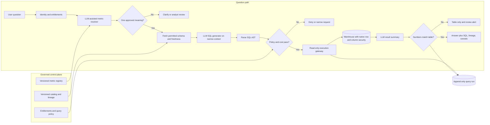

# G06 — Natural Language over Governed Data: Main Interview Guide

**Analytics process** is: someone asks a business question, SQL hits the warehouse, a number shows up on a slide. The trap is **valid SQL for the wrong meaning of “revenue.”**

**G06 covers one slice:** map the question to an approved metric, then a read-only query with a paper trail. Not “chat with every table.”

End to end, as an exec asking “What’s Q3 revenue?”

1. **We resolve who they are** and which rows they may see.
2. **We pin “revenue” to Finance’s versioned metric**, not a guess.
3. **If 30-day vs 90-day is unclear**, we ask or send to an analyst — we do not pick.
4. **We generate SQL, parse it, cap the scan**, then run read-only.
5. **We return the number, the SQL, lineage, freshness.** Prose is checked against the numbers.
6. **Next quarter we can replay** who asked, which metric version, which SQL hash.

That’s it: **metric first → permitted SQL → bounded run → explain from the result.** Writes and inventing KPIs stay out.

The failure to design against is **valid SQL that answers the wrong business question**. “Revenue” can mean booked, recognized, or collected revenue; the model cannot choose that definition on the business’s behalf. Anchor the question to a versioned metric before exposing a physical schema, then bound and audit every query.

This is the anchor for the related executive-dashboard and retail-forecast explanation cases in the [source study](G06_NL_Over_Governed_Data.md). Learn the governed query path once; change the final explanation and review workflow for each variant.

| Case | Shared foundation | What changes |
|---|---|---|
| NL-to-SQL analytics assistant | Governed metric → permitted schema → validated read-only query | General business questions and SQL safety |
| Executive Dashboard Copilot | Same metric registry and query evidence | KPI variance narrative, dashboard freshness, analyst escalation |
| Retail Demand Forecast Explainer | Same governed evidence and result checks | Deterministic driver statistics from sales, promotions, inventory, weather, and events; human review of planning actions |
| AIA governed data assistant | Governed metric views and auditable asset resolution | Supervisor routes to Genie, a narrow SQL/RAG worker, deterministic analysis, or visualization; later specialized domain agents |

## 1. Questions to ask the interviewer

| Question to ask | What it's really asking | What you then decide |
| --- | --- | --- |
| Who owns “revenue,” “active customer,” and the other first ten metrics? Is a semantic layer already approved? | If Finance means recognized revenue and Sales means booked, who wins — or does that dictionary already exist? | Registry scope, owners, and whether you wire to an existing layer or build one. |
| Which warehouse, dialect, and approved datasets are in scope? | Are we on Snowflake over approved finance views, or every table in the lake? | SQL generator, catalog adapter, parser, and policy rules. |
| Where are row and column permissions enforced today? | If a regional manager asks for all salaries, does the warehouse already hide those rows? | Reuse warehouse ACLs, or build the missing layer. |
| When a term maps to two metrics or grains, should we clarify, refuse, or send it to an analyst? | If “active customer” could mean 30-day or 90-day, do we ask, refuse, or hand it to an analyst? | Ambiguity gate and review queue. |
| What are the latency and scan-cost limits? Are large requests allowed to run asynchronously? | If a question would scan a year of events, do we block it, queue it, or blow the warehouse bill? | Query budget, timeouts, cache, and async queue. |
| Must users see SQL, lineage, freshness, and a reconstruction of past answers? | Next quarter, can we prove which SQL and metric version produced last month’s board number? | Response format and append-only `QueryRun` record. |
| Which explanations are board-facing or action-triggering? | Is this a FYI chart, or will someone change prices from this answer? | Extra checks and the human-review line. |

## 2. Requirements and success

**Functional:** resolve a question to a governed metric first; retrieve only permitted tables, joins, and freshness context; ask on ambiguity; produce dialect-specific SQL; parse its AST and check tables, columns, joins, shape, and estimated scan; execute through a read-only gateway; return the result, SQL, metric lineage, and caveats. A prose explanation is generated from the structured result and checked against its numbers. Keep a query-run audit with actor, decision, SQL hash, bytes scanned, and metric/schema/policy versions.

**Non-functional:** correctness outranks speed; warehouse-native row/column policies and entitlement checks protect every execution; policy failure or suspicious scans fail closed. The source’s copilot examples target **3–8 s** interactive responses, with longer work asynchronous and visible. Enforce row limits, timeouts, date windows, and scan budgets. Cache metric and schema metadata with versions and TTLs; keep credentials narrow and logs redacted.

**First release:** ten owner-approved metrics, golden question/SQL/result cases, analyst shadow review, then a small executive audience. It is not a general interface to every warehouse table, a write-query tool, or a machine that defines business metrics.

## 3. Architecture

This is the interview-size view of the [source architecture, §4](G06_NL_Over_Governed_Data.md#4-draw-the-architecture-end-to-end). The LLM interprets and explains; registry, policy, warehouse, and analysts keep authority.

### Step-by-step architecture

- **Step 1.** Authenticate the user and resolve entitlements before any schema or data lookup.
- **Step 2.** Use an LLM-assisted resolver against the versioned metric registry. If “revenue” has multiple supported meanings, clarify or escalate; do not guess.
- **Step 3.** Retrieve only the allowed schema, join path, lineage, and freshness facts needed for the selected metric.
- **Step 4.** Generate dialect-specific SQL from that narrow context. The model proposes a query; it does not approve one.
- **Step 5.** Parse the SQL into an AST, enforce table/column/join and read-only rules, recheck entitlements, and estimate scan cost. Reject or narrow anything unsafe or over budget.
- **Step 6.** Execute through a bounded read-only gateway under warehouse-native row and column security, with timeout and row limits.
- **Step 7.** Summarize the structured result and verify every number against the table. On mismatch, return the table alone and alert reviewers.
- **Step 8.** Return the definition, SQL, lineage, freshness caveats, and answer; record the versions, decision, and bytes scanned for replay.

**Agent role:** the default design is a governed LLM query workflow. A supervisor/agent is useful only when one question needs multiple approved specialists, as in the AIA variant. It routes among Genie, a restricted SQL/RAG worker, deterministic analysis, and visualization; neither that agent nor its LLMs may define metrics or bypass the query gate.

## 4. Three decisions to defend

| Decision | Default and reason | Failure to avoid |
|---|---|---|
| Semantic layer before schema | Resolve a named, versioned business metric before searching physical tables | Valid SQL using the wrong grain, exclusions, or definition |
| Clarify before query | Show supported meanings; a numeric confidence gate can trigger clarification (the AIA supervisor used **<60%** for its own intent clarification) | A plausible answer to an unstated business interpretation |
| Fixed operations or managed SQL before open SQL | Use reviewed operations or curated Genie-like views for common questions; allow hand-generated SQL only in a narrower approved path | Invented columns, excessive scans, and permission drift |

For mixed questions, route each subtask to its right source: semantic search finds related prose, structured queries compute counts and sums, direct lookup resolves IDs. A retail “why” answer computes drivers deterministically and lets the LLM narrate them; correlation is not proof of causation.

## 5. Failure playbook

| Symptom | Response |
|---|---|
| Correct-looking number uses the wrong metric | Block publication, preserve the query run and versions, clarify or send to an analyst, then add a golden case. |
| Schema drift or a dropped join key | Stop the affected template, refresh the catalog, review any changed definition before resuming. |
| Join fan-out inflates totals | Check cardinality and expected row count before execution; refuse or show the expansion explicitly. |
| Scan estimate or live scan exceeds budget | Narrow the date range or use an approved pre-aggregation; cancel and explain rather than “try it.” |
| Policy engine or entitlement check unavailable | Fail closed. Do not substitute an unrestricted service account. |
| Warehouse or summary service unavailable | Queue if freshness permits; return a safe table-only result when only explanation fails. |
| Summary contradicts the table | Reject the prose, serve the table and lineage, alert the review queue. |

## 6. Scale, latency, and cost

Keep metric resolution, authorization, validation, and execution synchronous because they determine the one answer. Crawl catalogs, refresh caches, and replay evaluations asynchronously, partitioned by tenant or warehouse so background jobs do not stampede query traffic. Cache only with tenant, permission signature, metric/schema version, and freshness in mind.

Measure first-try semantic correctness, SQL retry rate, bytes scanned per answer, token spend, and p95 by stage. The source flags **>20% above the seven-day bytes-scanned baseline** as a cost warning. The cheapest levers are narrower metric context, approved templates, dry-run cost checks, bounded windows, and safe caching. Repeatedly asking a stronger model to repair invalid SQL raises both bills and can still answer the wrong question.

## 7. Evaluation and rollout

**Release gate:** semantic correctness against analyst-approved definitions. Query execution success is a separate, weaker measure. Golden cases pair question, approved SQL, and expected result shape; include ambiguity, wrong grain, join fan-out, hidden columns, scan explosions, and a summary that misstates a correct table. Zero escaped policy violations. The copilot variants add groundedness, citation and high-risk escalation review; their source examples cite **≥90% supported claims, ≥95% correct citations, and ≥95% correct high-risk escalation** as goals to agree with the customer.

Roll out in order: ten governed metrics with owners → golden replay on every change → shadow analysts on live questions → small executive release → domain-by-domain expansion with a named metric owner. Stop or roll back on semantic mismatches, escaped policy, rising scan cost, or declining user trust. An answer users still ask analysts to recheck has not solved the workflow.

## 8. Interview answer to rehearse

> “I would first ask who owns the metric definitions, because valid SQL against the wrong meaning of revenue is the worst failure here. I would resolve each question to a versioned governed metric, clarify ambiguity, retrieve only permitted schema, and let the LLM propose SQL from that small context. An AST policy and cost gate rechecks entitlements before a read-only warehouse gateway runs it under native row and column controls. The answer includes the definition, SQL, lineage, and freshness; any prose is cross-checked against the table. I would prove ten metrics with golden cases and analyst shadowing before executives rely on it. At scale I would trim schema context, use reviewed routes, bound scans, and measure semantic correctness and cost per answer.”

**Memory line:** “The semantic layer defines the answer; the LLM translates and explains it.”

For parser mechanics, the AIA two-pivot agent story, the incident drills, and the detailed evaluation signals, use the [Deep Dive](G06_NL_Over_Governed_Data_Deep_Dive.md). For a final-minute pass, use the [Cheat Sheet](G06_NL_Over_Governed_Data_Cheat_Sheet.md).
