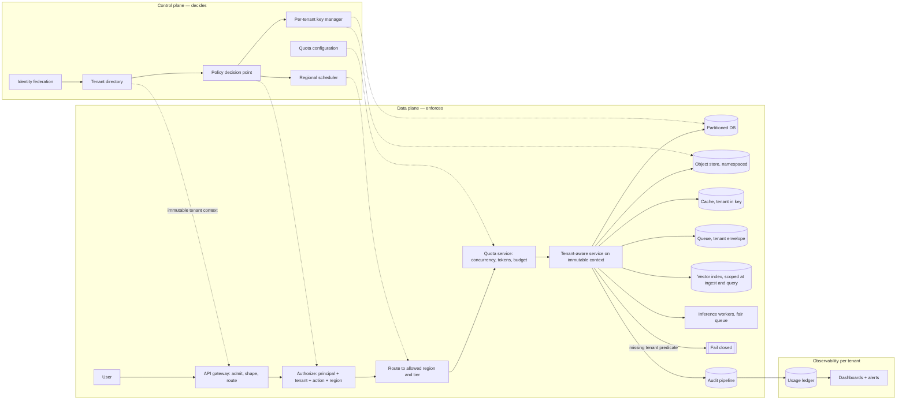
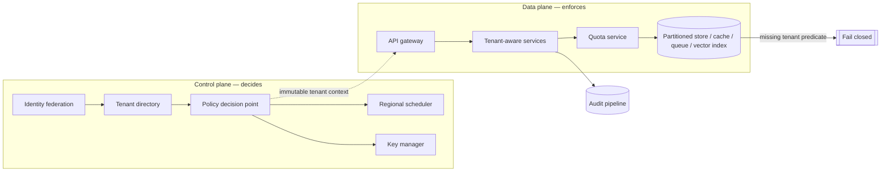
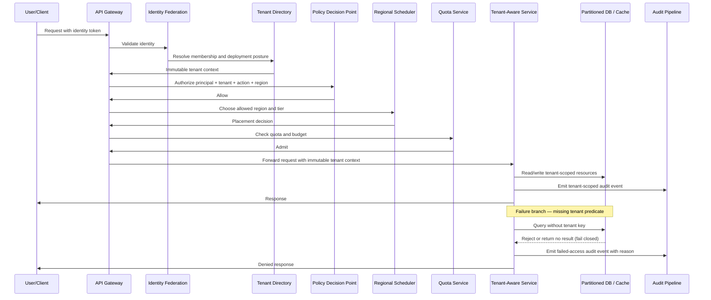
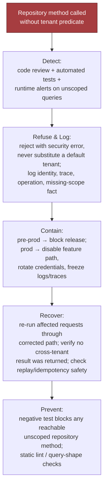
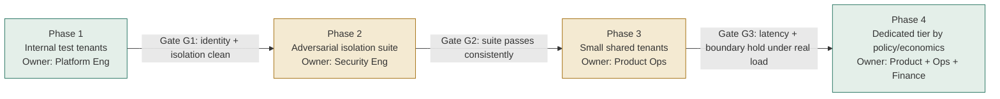

# Secure Multi-Tenant AI Platform

*One application serving 500 tenants: shared enough to be affordable, isolated enough that a missing predicate is impossible rather than unlikely.*

◷ 43 min

The dangerous failure is not a bad answer. It is a query, cache lookup, queue message or export that runs without a tenant predicate and reads whatever matches. This page consolidates group G07 of `CASE_STUDY_INDEX.xlsx` into one read for the day before. It holds the chapter 2 worksheet and answer key, the tutorial's high-yield sections, the two cost scenarios and the cross-tenant leak incident. The two-layer enforcement mechanics are owned by G01 section 6 and referenced here rather than repeated.

| Case in the group | What it contributes here |
|---|---|
| #16 Secure Multi-Tenant AI Platform (anchor, book ch 2) | Sections 1 to 12: the design, requirements, sizing, enforcement, evaluation, rollout and delivery |
| #41 Multi-tenant GenAI platform with per-customer budgets | Section 13, the cost drill card |
| #108 One tenant has unusually high usage | Section 13, the §15 scenario answer |
| #85 Cross-tenant retrieval leak through a missing metadata filter | Section 14, the incident walked through with its telemetry |

---

## 1. Separate the Feature From the Business Result

Open with the outcome, not the topology. The feature asked for is one AI application for 500 enterprise tenants. The business result is a cost-efficient shared platform with defensible isolation, plus a dedicated path for the exceptions. Opening with Kubernetes, a vector database and a model gateway signals feature-first thinking, and that is the tell an FDE interviewer listens for.

> *"Support 500 enterprise tenants preserving isolation, predictable performance and regional controls. I'd clarify shared versus dedicated tenants, cross-region data limits, and success criteria per stakeholder. Default: a shared control plane with tenant-aware data and inference paths, strong authorization at every boundary, and an escape hatch for premium tenants that need dedicated infrastructure."*

The headline ask hides a disagreement between four stakeholders about what isolation and success mean. Map the people before the boxes.

| Stakeholder | Job to be done | What they want |
|---|---|---|
| Tenant end user | Summarise internal content and answer questions without exposing anyone else's data | Fast, reliable, useful, no cross-tenant exposure |
| Tenant administrator | Configure policy once and roll it out safely | Control over access, configuration, usage and regional placement; onboarding without platform tickets |
| Platform operator | Run one shared fleet without noisy neighbours dominating it | A control plane that is observable, supportable and cheap at scale |
| Security and compliance auditor | Prove access and residency constraints are enforced consistently | Evidence: policies, logs, boundaries, retention rules, isolation guarantees that hold under failure |

Only about six questions fit a forty-five-minute interview, so ask the ones that change the architecture. Each should produce scope, assumptions, risks and owners.

| Question to ask | What the answer decides |
|---|---|
| Which tenant data classes are in scope, and which are explicitly out for the first release? | The trust surface of the MVP |
| Are regional controls hard requirements, soft preferences or customer-specific exceptions? | Routing, storage, backup and logging design |
| What does "predictable performance" mean: throughput, latency, queue time or fairness across tenants? | Whether the answer is capacity, quotas, or a fair scheduler |
| Which tenants can share infrastructure, and which need a dedicated tier? | One universal topology with tiered isolation, or a hybrid with an explicit premium tier |
| What evidence do auditors need: logs, policy snapshots, access reviews or data lineage? | The audit pipeline's schema and retention |
| Which failure is most expensive: leakage, unavailability, slow inference or misrouted regional traffic? | Where the hour is spent |
| Do customers bring their own identity provider and their own keys, and is deletion hard or best-effort? | Federation, key management and the deletion workflow |
| What is the workload shape, steady, bursty, skewed or mixed, and what noisy-neighbour tolerance is acceptable? | Quotas, admission control, queue isolation, reserved capacity |

The three answer tiers show what the opening buys. The weak answer uses microservices and Kubernetes, puts a tenant_id column on every row and adds row-level security. It is solution-first, names no customer outcome, and treats one row label as the whole enforcement stack. The average answer builds a shared platform with per-tenant authorization, quotas, regional routing, audit logging and per-tenant latency monitoring. It never says where tenant context originates, never makes every isolation layer agree, and never defines when a customer graduates to dedicated infrastructure. The strong answer defaults to shared because pooled economics are the point across 500 tenants. It derives tenant context once from verified identity, never from the request body, and makes it immutable. The control plane decides policy, region, quota and key; the data plane enforces at the gateway, the services and every store. Seven layers enforce independently, a missing predicate fails closed, and an adversarial isolation suite gates every external tenant.

State assumptions if the interviewer withholds answers, and choose the ones that protect the most dangerous failure. Assume tenants bring their own identity provider. Assume regional restrictions apply to stored data and inference logs. Assume premium customers may pay for dedicated capacity. Assume model selection is already approved. Have the line for interviewer silence ready:

> *"If we do not know tenant variability yet, I will assume the shared tier must support most customers, but I will design an explicit dedicated path for customers with stricter residency or performance needs."*

## 2. State Requirements as Testable Constraints

Split the conversation into four buckets, functional requirements, non-functional requirements, explicit exclusions and hard constraints, because the trap here is premature certainty. The interviewer only answers half the questions.

The functional requirements are ordered by value, and the order matters: the control plane is foundational and the dedicated tier is an escape hatch, not a default.

1. **Tenant-aware control plane.** Onboard tenants, assign policies, provision configuration, manage keys, record admin actions.
2. **Isolated data-plane request path.** Every request carries tenant identity, policy context and authorization through the whole call chain.
3. **Per-tenant policy, quotas, keys and configuration** without bespoke code paths per customer.
4. **Regional routing and retention controls.** Direct requests and artifacts to the correct region; retain or delete per tenant policy.
5. **Auditable administration.** Answer who changed what, when, under which tenant context.
6. **Dedicated deployment tier where justified.** An explicit escape hatch for exceptional customers.

The first five are must-haves, because each protects a highest-risk failure mode. Richer quota tuning and broader automation are should-haves. Advanced tenant analytics and convenience workflows are could-haves, and a could-have never expands the core design or delays launch. If a tenant's must-have cannot be satisfied safely in the shared tier, that is the justification for the dedicated path.

Exclude these from the MVP unless the interviewer pushes, because each expands the trust surface or the support burden:

- arbitrary tenant-managed plugin execution inside the core platform
- cross-region active-active writes for every tenant
- fully custom per-tenant runtime stacks
- unlimited per-request model swapping
- manual exception handling for every onboarding request
- ad hoc shared-secret administration outside the control plane

The safety goals are stated as measurable constraints, and so are the operating constraints.

| Constraint | Stated so it can be tested |
|---|---|
| Zero cross-tenant reads or writes | No exposure of another tenant's data, prompts, embeddings, outputs, logs or admin state through authorized or accidental paths. Tenant context derives from verified identity, never the request body |
| Bounded resource contention | One tenant's workload cannot cause unbounded latency or throughput collapse for others. Shared infrastructure shares constraints |
| Tenant-scoped blast radius | A failed deploy, bad policy or revoked credential affects only the minimum necessary tenant set |
| Latency | Per-tenant p95 measured and alerted separately. A 2-second budget forces fewer hops and more caching; a 15-second budget permits durable queues and async work |
| Availability | Sized for load shape, not average. 200 QPS peak with 20x skew makes any uniform-tenant assumption unsafe |
| Compliance | Append-only audit of tenant, actor, action, resource and decision, retained per tenant policy |
| Cost | `C_tenant = C_fixed/N + C_usage + C_isolation`. Pay the isolation premium only where a requirement demands it |

Every requirement then needs the component that enforces it. If a requirement has no component it is probably not real yet, and if a component has no requirement it is probably scope creep. Say that out loud when presenting the table.

| Requirement | Primary component or mechanism |
|---|---|
| Tenant-aware control plane | Tenant registry, provisioning workflow, admin API |
| Isolated data-plane request path | Auth gateway, request context propagation, policy enforcement point |
| Per-tenant policy, quotas, keys, and configuration | Policy store, quota service, secrets management, config service |
| Regional routing and retention controls | Traffic router, region-aware storage, retention scheduler |
| Auditable administration | Append-only audit log, admin event pipeline |
| Dedicated deployment tier | Separate cluster or namespace boundary with tenant-specific capacity |
| Zero cross-tenant reads or writes | Authorization checks, row-level or object-level isolation, test gates |
| Bounded resource contention | Quotas, admission control, queue isolation, autoscaling limits |
| Tenant-scoped blast radius | Deployment partitions, scoped rollout, tenant-level feature flags |
| Safe onboarding and offboarding | Provisioning workflows, deletion jobs, verification checks |

## 3. Size for the Load Shape, Not the Average

A design that is plausible at average traffic fails exactly when customers feel pain. Size for average, peak, growth and skew, with round numbers whose only job is to force decisions: 500 tenants, 50,000 active users, 200 QPS peak, 20x workload skew.

At 200 QPS across 500 tenants the average tenant looks trivial at 0.4 QPS. With 20x skew a few large tenants drive a material share of peak. So no uniform-tenant assumption is safe for queue sizing, cache partitioning, rate limiting, retry policy or noisy-neighbour protection. The most consequential estimate is usually the shape of peak concurrency after retries, fan-out and long-tail latency, not raw QPS. Targeting exactly the naive peak is already broken. Reserve headroom for tenant concentration, retried requests, failover overhead, deploy-time capacity loss and growth before the next tuning cycle.

Pair pooled capacity with four per-tenant controls. A token quota caps monthly or hourly usage to protect spend and fairness. A concurrency quota stops one tenant saturating worker pools or model backends. A burst quota allows short spikes without immediate throttling. Reserved capacity protects contractual performance for premium tenants. Name the trade-off: quotas too tight produce artificial customer-visible failures, quotas too loose let one tenant consume the shared budget.

Anchor SLOs in the customer workflow rather than in what the platform team prefers to measure:

- availability as successful requests or job completions over a window
- latency as end-to-end response time or completion time
- freshness as time from source update to model-visible update
- quality as task success rate and grounded-answer rate
- security indicators as authorization failures, policy denials and blocked cross-tenant attempts
- cost per request, per tenant and per successful task

Tie one to a workflow aloud. If this powers support agents, the latency budget must preserve the agent's interaction loop, or a technically successful response arrives functionally useless.

The unit economics settle the shared-versus-dedicated argument.

```
C_tenant = C_fixed / N + C_usage + C_isolation
```

The first term is shared platform cost spread across N tenants. The second is the variable cost a tenant directly drives in tokens, storage, retrieval, egress and compute. The third is the premium for stronger separation: dedicated pools, stricter network boundaries, regional duplication, customer-specific encryption, extra compliance controls. Pooled economics win when most tenants can share safely; pay the isolation premium only where the requirement demands it.

| Assumption | Current illustrative case | 10x growth case |
|---|---|---|
| Tenants | 500 | 5,000 |
| Active users | 50,000 | 500,000 |
| Peak QPS | 200 | 2,000 |
| Skew | 20x | 20x or worse |
| Shared capacity strategy | pooled plus quotas | pooled plus stricter partitioning |
| Isolation posture | shared by default, dedicated for exceptions | more dedicated pools, more explicit regional controls |

What changes at 10x is not the table but the dominant risk. Noisy neighbours, cache churn and operational complexity shift the architecture from one shared tier with guardrails to tiered tenancy with explicit partitioning. Define the per-region recovery objective before the happy path too, since RPO and RTO decide replication, failover routing and queue durability. And define the missing-tenant-predicate drill up front: can a request, query, export, cache lookup or admin action cross a tenant boundary if a filter is omitted? A design without that test is incomplete.

> *"I will size for average, peak, and growth; reserve headroom for skew and failover; give each tenant token and concurrency quotas; and tie latency and availability targets to the customer's workflow. I prefer pooled economics for the common case, but I will pay for stronger isolation when the risk, performance, or regional requirement justifies it."*

## 4. Draw the Architecture End to End

One diagram carries the design. The organising split is control plane against data plane. The control plane decides who may do what, where and under which limits. Its changes are slower, more privileged and more auditable. The data plane does the work. A tenant moving to the dedicated tier is a controlled configuration change in the control plane, not an ad hoc code path.

```
 ╔═══════════════════ CONTROL PLANE — decides who may do what, where, under which limits ═══════════════════╗
 ║  identity federation (customer IdP) ─> tenant directory ─> policy decision point ─┬─> regional scheduler   ║
 ║  quota configuration · per-tenant key manager · tenant registry + provisioning    └─> key selection       ║
 ║  central policy definition · regional enforcement · SCIM group sync · retention policy per tenant         ║
 ╚═══════════════════════════════════════╤═══════════════════════════════════════════════════════════════════╝
                                         │ immutable tenant context (never re-derived below this line)
 ╔═══════════════════ DATA PLANE — enforces, per region, shared by default ═══════════════════════════════════╗
 ║                                                                                                            ║
 ║  REQUEST PATH — synchronous, strict dependency order                                                       ║
 ║   user ─> API GATEWAY ─> AUTHORIZE ─> ROUTE ─> ADMIT ─> TENANT-AWARE SERVICE ─> STORES ─> AUDIT ─> answer  ║
 ║           admit,       PDP: role,   region +  quota:    executes only on      row · object ·   tenant-   ║
 ║           shape,       tenant,      tier      concur-   immutable context     cache · queue ·  scoped    ║
 ║           reject early action,                rency,                          vector · key     event     ║
 ║                        region                 tokens,        │ missing tenant predicate                   ║
 ║                                               budget         v                                            ║
 ║                                                           FAIL CLOSED (reject / 404 / no result)          ║
 ║                                                                                                            ║
 ║  STORES — tenant key in the physical layout AND in every predicate                                         ║
 ║   partitioned DB (tenant_id) · object store (namespace per tenant) · cache (tenant in key)                 ║
 ║   queues (tenant envelope, per-tenant dead-letter) · vector index (scoped at ingest AND query)             ║
 ║   per-tenant data-encryption keys (envelope) · inference workers (fair queue, reserved lanes)              ║
 ║                                                                                                            ║
 ║  REGIONS — shared control plane, regional data planes; residency decided by the scheduler, not the app     ║
 ║                                                                                                            ║
 ║  OBSERVABILITY — per tenant                                                                                ║
 ║   audit pipeline (append-only) ─> usage ledger (cost attribution) ─> dashboards: p95 by tenant, quota     ║
 ║   rejections, cost/tenant, cross_tenant_retrieval_count, isolation-test pass rate, failover time           ║
 ╚════════════════════════════════════════════════════════════════════════════════════════════════════════════╝
```

The same flow as a rendered diagram:



The answer key's own diagram is the compressed form, and it is the one to draw first if time is short:



Read the components in dependency order, because that is the order they must exist and the order they fail.

| Component | Responsibility | Trust boundary | Plane | Fails how |
|---|---|---|---|---|
| Identity federation | Authenticate the caller through the customer's identity provider and deliver verified claims | External customer boundary to platform boundary | Control | Closed: no verified token, no request |
| Tenant directory | Map identity to tenant membership, posture and allowed regions | Platform authority boundary | Control | Closed: unresolved membership is denied |
| Policy decision point | Decide whether the action is permitted for this tenant, principal and region | Privileged policy boundary | Control | Closed: no decision, no admission |
| API gateway | Admit, shape and route requests; reject malformed or disallowed traffic early | Edge boundary | Data | Closed on auth, degrades on capacity |
| Tenant-aware services | Execute business logic using immutable tenant context only | Service boundary inside the shared platform | Data | Closed on a missing predicate |
| Partitioned databases and indexes | Persist tenant-scoped records with tenant-aware keys and predicates | Storage boundary | Data | Closed: the store refuses an unscoped read |
| Quota service | Enforce concurrency, token and budget limits per tenant or tier | Shared-resource governance boundary | Control with data-plane hooks | Degrades that tenant only; closed if the quota system is compromised |
| Per-tenant key manager | Select or issue tenant-specific encryption context | Key-management boundary | Control | Closed: no key, no read |
| Regional scheduler | Place workload into an allowed region and tier | Placement and residency boundary | Control | Closed for sensitive writes; queue or reroute otherwise |
| Audit pipeline | Capture immutable tenant-scoped events for investigation and billing | Observability and compliance boundary | Data | Degrades: the action completes, the gap is alerted |

Three boundaries are worth pointing at while the diagram is up. The sync/async boundary sits after audit: authentication, authorization, quota admission and region selection are synchronous, and reporting, logging and offline enrichment may be asynchronous. Anything that could cross a trust boundary or consume scarce capacity is never deferred blindly to a background task. The systems of record are the tenant directory for membership, the partitioned database for tenant data, the quota service for usage and the audit pipeline for traceability. A boundary mistake among them is a security incident. Caches improve latency and are never the source of truth for membership or authorization. Queues carry tenant identifiers and policy context explicitly, because backpressure is only safe when the worker knows which tenant it is slowing down.

The MVP is one policy service, one gateway, one tenant-aware application tier, one partitioned data store, one quota service, one regional control plane and one audit stream. That is enough to prove isolation, performance shaping and regional routing. Dedicated customer clusters, per-service SLOs, richer workload classification and a more granular policy language are extensions, not prerequisites.

## 5. Derive Tenant Context Once and Make It Immutable

Tenant context comes from verified identity, never from the request body. A header, claim, session or signed token can be authenticated and logged. A JSON field can be spoofed, replayed or forwarded across tenants by accident. That one choice governs everything downstream, because row filters, object ownership, cache keys, queue partitions, log redaction and vector-index lookup must all consume the same verified context.

The dependency order is strict, and each step has a reason. Identity must come first. Context must become immutable early. Policy must run before expensive work. Region is a control-plane decision, not a late optimization. Audit happens after the action but close to it.

1. **Identity federation** authenticates the human or workload through the customer's IdP.
2. **Tenant directory** maps the principal to tenant membership and allowed deployment posture.
3. **Policy decision point** evaluates principal, action, resource and region together.
4. **API gateway** admits, shapes and routes into the correct service tier.
5. **Tenant-aware services** execute only after receiving immutable context.
6. **Partitioned databases and indexes** carry the tenant key in physical layout and in every predicate.
7. **Quota service** tracks concurrency, token and budget limits.
8. **Per-tenant key manager** selects the encryption context for tenant and tier.
9. **Regional scheduler** decides which region and cluster class may serve the request.
10. **Audit pipeline** records tenant-scoped activity.

Narrate the happy path and tie each step to a customer reason. Authenticate through federation, because the customer keeps their own identity source. Derive immutable tenant context, because one company may have several subsidiaries. Authorize against policy, because authorization must be explainable and centrally governed. Route to the allowed region and tier, because location control is part of the product promise. Apply quota before inference, because shared cannot mean noisy neighbour. Read and write only tenant-scoped resources. Emit a tenant-scoped audit event, because enterprise buyers need traceability.



If the missing-predicate case is not obvious from the diagram, the design is still too hand-wavy. That is the diagnostic test for the diagram itself. The strongest signal in the round is not the drawing but the narration of how identity, data, state and failure move through it.

Production identity has three problems in front of the policy engine, and none of them is authorization. Token validation checks the signature against the IdP's published keys, the expiry, and that the token was issued for this application, before any permission logic runs. Group mapping is owned by the customer. Their Okta or Azure AD groups are the source of truth, mapped into the platform's role vocabulary. That mapping is configuration that drifts silently when a group is renamed. Just-in-time provisioning creates the first local record from the token's claims, scoped to the customer and never with more access than intended by default.

## 6. Enforce Isolation at Seven Layers That Do Not Trust Each Other

One row label is one defence layer. It is easy to omit in application code, ad hoc queries, background jobs and admin tools. It covers nothing in backups, object storage, search indexes, caches, analytics pipelines or service-to-service auth. So seven layers enforce independently, and one missed check is not a full breach.

| Layer | What must be true |
|---|---|
| Row | Every query includes the tenant predicate, and the database enforces it where possible |
| Object | Files, blobs and embeddings are namespaced or separately authorized by tenant |
| Cache | Every cache key includes the tenant id; a shared cache never returns data with ambiguous authorization context |
| Queue | Messages never expose payload metadata across tenants, especially in shared dead-letter and retry channels |
| Log | Logs never expose secrets, raw prompts or cross-tenant identifiers that let someone reconstruct another customer's state |
| Vector index | Tenant scoping applied at ingestion and at query time, because semantic search otherwise surfaces neighbouring content |
| Key | Tenant-scoped encryption keys with envelope encryption, so one compromise does not span the fleet |

The tenant predicate is the mechanism this group owns. The rule is that the store itself refuses to return a row unless the request is already scoped to one tenant. Row-level security bound to the session, or physical partitioning, does that. Isolation then never depends on every engineer remembering `WHERE tenant_id = …`. A future API that forgets the clause returns nothing rather than another company's data. The same predicate is compiled into the vector-search filter and into the cache key, keyed on tenant, permission signature and version. The two-layer pattern that makes a pre-filter cheap and a post-check authoritative is G01's section 6, and it applies here unchanged. The tenant predicate is layer 1 in the search. The post-retrieval invariant `request.tenant_id == chunk.doc_tenant_id` is the layer 2 check, and section 14's incident shows it being skipped.

Pick a tenancy level and justify it, because the interviewer will ask how strongly tenants are isolated.

| Level | What it means | When |
|---|---|---|
| Shared infra + tenant id on every row | One database, one set of tables. Every row tagged; every read and write includes the tag | The default: cheapest, fastest to ship |
| Separate schema / namespace per tenant | Same cluster; one tenant's tables are not another's | Stronger isolation without an extra deployment |
| Dedicated deployment per tenant | Separate cluster, region and encryption keys | Banks, healthcare, anyone who cannot share a box |

Start at level 1 and make the default honest with two follow-ups. The database enforces the tenant rather than the application. And there is a named escalation path for regulated customers, from a tagged row to their own keys, region or deployment. Per-tenant keys answer the question *"what happens if someone gets raw read access to the storage layer?"* With per-tenant data-encryption keys wrapped by a master key, they get one tenant's ciphertext. Only that tenant's key would decrypt it. With one platform-wide key the same breach exposes every customer at once.

Two more principles belong on the board. Least privilege: each service sees only the tenant scope it needs, only for the operation it performs. Blast radius as the design unit: by tenant, by region, by workflow, by dependency. And negative isolation tests matter more than positive ones, because the platform should actively prove the wrong tenant cannot read, infer, cache, dequeue or search another tenant's data.

> *"I'd start with shared infrastructure and a tenant id on every record, that's the right default. The filter has to live in the data layer, not in application code: the store should refuse to return a row unless the request is tenant-scoped. For regulated customers I'd escalate to a separate schema or a dedicated region and keys, not just a different tag in the same table."*

## 7. Meter Before the Call and Share Fairly

Apply quota and budget before inference, storage growth or batch fan-out, never after. A budget checked after the call is a bill, not a control, and budgets here are contractual. The quota service enforces concurrency, token and burst limits per tenant or tier. The usage ledger attributes every request to a tenant. Quota alerts fire before the limit rather than at it.

Rate limiting and fairness are different problems, and a real platform needs both. A rate limit answers whether this request may proceed at all, a ceiling on one tenant's own allotment. A fair queue answers in what order requests are served under load. A large tenant's burst then cannot make a small, well-behaved tenant wait longer for its turn, even though the small tenant never exceeded any limit. The mechanism is weighted fair queuing, or a token bucket per tenant feeding a shared worker pool, so throughput is shared proportionally under contention rather than first-come-first-served.

Contain a noisy neighbour in two steps. First the per-tenant quotas, rate limits, concurrency caps and workload classification. Then isolate the expensive parts: admission control before inference, queue partitioning, reserved capacity for premium tenants, circuit breakers past the envelope. Noise caused by a bug gets fast detection and a kill switch. Legitimate burst demand gets fairness, not punishment.

Move a customer to dedicated infrastructure when shared tenancy no longer satisfies risk, performance or operational requirements at acceptable cost. The triggers are regulatory residency constraints, unusually strict latency SLOs, high-value workloads with low tolerance for contention, and a customer policy demanding a harder boundary. Avoid "big customers get dedicated"; define measurable thresholds and an exception review path.

## 8. Route by Region and Keep Policy Central

Regional controls reshape routing, storage, backup and logging, so settle early whether they are hard requirements or customer exceptions. The balanced answer is central policy definition with regional enforcement, unless residency or availability forces local control. A central control plane keeps policy consistent but can become a latency and residency problem; a fully regional one improves locality but multiplies duplication, rollout complexity and policy-drift risk.

The regional scheduler places work in an allowed region and tier as a control-plane decision. The same rule covers artifacts. Logs, backups and inference traces follow the tenant's residency policy, not the platform's convenience. Retention is part of the data model, attached to the tenant record or a versioned policy it references, so no service rediscovers policy from brittle configuration.

A control-plane outage is not always a full outage, but it is always serious. Policy distribution, deployment coordination and config updates may be impaired while requests still flow. Monitor control-plane health separately from the data plane and alert when the local authority source stops refreshing. If local auth, cached policy and preloaded keys are sufficient, keep serving verified-safe operations only. Otherwise fail closed for sensitive changes, queue non-critical writes, or reroute. Never silently continue with stale control state for irreversible actions. Recover by restoring the regional controller, reconciling queued changes and confirming sync with the authoritative policy source. Prevent by designing for stale-control tolerance, caching minimum policy state locally, rehearsing regional failover, and keeping distinct emergency access paths.

Export and delete across regions deserve their own answer. A tenant inventory and a deletion workflow span every store: relational rows, blobs, logs, embeddings, caches, queues and derived artifacts. Export assembles a complete package with clear ownership and time bounds. Deletion is a coordinated job with verification, retention exceptions and an auditable completion record. Backup deletion semantics follow retention windows and restore controls, not ad hoc surgical erasure.

## 9. Fail Closed on Security, Degrade on Capacity

Memorise the pattern, not the table. Security defects fail closed. Capacity pressure degrades. Metadata leaks quarantine and escalate to a human. Control-plane loss depends on whether local enforcement still holds.

| Scenario | Recommended behavior | Why |
|---|---|---|
| Missing tenant predicate | Fail closed immediately | An unscoped read/write is a security defect, not a transient error |
| Cache key omits tenant id | Fail closed and invalidate affected entries | A shared cache hit can leak data across tenants even when the database is safe |
| Shared queue leaks payload metadata | Fail closed, quarantine the queue, and rotate credentials if needed | Message metadata can reveal customer identity or workflow state |
| One tenant exhausts model quota | Degrade for that tenant, not the whole platform | Shared capacity should protect neighbours and preserve fairness |
| Regional control plane outage | Queue, reroute, or degrade depending on dependency criticality | Control-plane loss should not take down data-plane operations if local enforcement still works |
| Vector index surfaces a neighbour | Fail closed on the post-retrieval tenant invariant; block the response | Scoping applied at query time but not at ingestion is the classic cause |
| Misrouted regional traffic | Reject at the scheduler; alert; audit the route | A route sending protected data to an unauthorised region is a residency breach |

Each of the first five has a rehearsed drill in the tutorial, and they share a shape: detect, refuse and log, contain, recover, prevent. For the missing predicate, detection is code review plus automated tests plus runtime alerts on any query reaching a repository without tenant scope; it never depends on a customer ticket. Refusal is a security error, never a silently substituted default tenant, with identity, trace, operation and the missing-scope fact logged. Containment blocks the release in pre-production. In production it disables the feature path, rotates credentials and freezes logs and traces. In-flight retries keep failing closed rather than retrying into a different scope. Recovery re-runs affected requests through the corrected path and confirms idempotency keys and replay logs cannot bypass the fixed check. Prevention is a negative test that fails if any unscoped repository method is reachable, plus static query-shape lint, so the unscoped path is hard to call rather than merely undesirable.



The cache drill is the one candidates underrate. A cache bug looks harmless in isolation, because the database stays protected, but a shared cache replays the wrong tenant's object if the key misses tenant scope. Detect by instrumenting key components in metrics and traces. Contain by disabling the cache path or namespace, invalidating suspect entries and falling back to the source of truth. Recover by rebuilding from correctly scoped reads and re-checking responses served in the window. Prevent by requiring tenant id in every cache-key helper, centralising key construction, and a negative test asserting a cross-tenant lookup is a miss. If the cache holds auth-sensitive material, treat it as a security incident, not a performance bug.

Production failure behaviour is the difference between a toy and a system. Timeouts tight enough to avoid pile-ups of stale work. Retries only for transient failures, never for authorization failures or malformed requests. Idempotency on writes, billing events and workflow triggers. Circuit breakers on dependencies returning repeated failures. Dead-letter queues that hold poison messages for inspection rather than endless reprocessing. Human escalation for policy corruption, suspected isolation failure or ambiguous tenant ownership. The honest system says what it can recover automatically and what needs a human with authority.

Say what breaks first at 10x. Noisy-neighbour risk and cache churn become dominant, so pooled-plus-quotas becomes pooled-plus-partitioning, with more dedicated pools and more explicit regional controls.

## 10. Gate the Release on an Adversarial Isolation Suite

The central promise is proven by a suite that tries to break the boundary, and a single unexplained boundary failure halts promotion. The goal is not to prove perfection but to prove the system fails safely and visibly under attack.

| Metric | Good threshold | Bad threshold | Test dataset | Owner |
|---|---:|---:|---|---|
| Cross-tenant incident count | Zero confirmed | Any incident halts promotion | Incident reports and audit-log review | Security / incident commander |
| Isolation-test pass rate | Full pass | Any new boundary failure blocks release | Adversarial negative-test suite: cross-tenant object access, stale cache reads, replayed tokens, malformed filters, namespace collisions, missing predicates | Security engineering |
| Per-tenant p95 latency | Within SLO per tenant, not in aggregate | Sustained breach | Request telemetry segmented by tenant | SRE |
| Quota rejection rate | Low and explainable per tenant class | Mis-sized quotas or poor onboarding | Admission and quota logs | Platform ops + product |
| Cost per tenant | Within the band for the tenant class | Above band | Billing mapped to tenant usage | Finance + platform |
| Regional failover time | Within the agreed RTO | Recovery exceeds target | Game-day and failover drills | SRE |

Keep technical health, model quality, adoption and business outcome as separate metric layers, because blurring them loses the ability to tell an engineering problem from product fit from customer behaviour. Trace a user outcome back to component telemetry in one chain. "Document processing feels slow" becomes request arrival, quota admission, queue depth, inference duration, retrieval latency, cache hit ratio and regional routing.

The interview-sized isolation test proves one invariant at the API level, not only in the database. A secret created under one tenant is invisible to another. The other tenant does not even learn that the object exists.

```python
import pytest

class TenantSession:
    def __init__(self, tenant_id, store, next_id):
        self._tenant_id = tenant_id
        self._store = store
        self._next_id = next_id

    async def create_secret(self, value):
        secret_id = str(self._next_id())
        self._store[(self._tenant_id, secret_id)] = value
        return type("Secret", (), {"id": secret_id})()

    async def get_secret(self, secret_id):
        if (self._tenant_id, secret_id) not in self._store:
            return type("Response", (), {"status_code": 404})()
        return type("Response", (), {"status_code": 200, "value": self._store[(self._tenant_id, secret_id)]})()

class FakeApi:
    def __init__(self):
        self._store = {}
        self._next_id_value = 1

    def _next_id(self):
        current = self._next_id_value
        self._next_id_value += 1
        return current

    def as_tenant(self, tenant_id):
        if not tenant_id:
            raise ValueError("tenant context required")
        return TenantSession(tenant_id, self._store, self._next_id)

@pytest.mark.asyncio
async def test_cross_tenant_ids_are_invisible():
    api = FakeApi()
    created = await api.as_tenant("alpha").create_secret("A")
    response = await api.as_tenant("beta").get_secret(created.id)
    assert response.status_code == 404
```

It deliberately omits authentication middleware, request signing, database transactions, observability hooks and retry wrappers, and says so. Before launch, hold the evidence that the controls exist and are exercised:

- access logs showing tenant-derived context
- the negative isolation tests
- role and permission reviews
- queue and cache namespace checks
- key-rotation procedures
- incident runbooks for suspected boundary failures

The operational question is not "do we have security?" It is "can we prove the system fails in the right direction, and recover without widening the blast radius?" Every external dependency and irreversible action needs an explicit failure and recovery policy. The absence of a policy is itself a policy, and it usually fails open.

The data model carries four ownership boundaries rather than four tables. Tenant(id, region, tier, key_ref, retention_policy) is data ownership. Membership(user_id, tenant_id, role, status) is authority. UsageLedger(tenant_id, period, tokens, requests, cost) is commercial control. AuditEvent(tenant_id, actor, action, resource, decision) is defensibility. Every write boundary needs an idempotency key, which stops duplicate writes from retries, and optimistic concurrency, which stops lost updates from concurrent writers. Model output never flows raw into the system; it is parsed into a typed schema and policy-checked before persistence.

## 11. Roll Out Internal Tenants First and the Dedicated Tier Last

The platform is done only when users adopt it, the workflow improves and the operating team can support it. A staged rollout with measurable gates, named owners and rollback paths is the answer to "when can this be trusted in production?"

| Phase | Owner | Exit criteria | Go / no-go |
|---|---|---|---|
| 1. Onboard internal test tenants | Platform engineering; security and product as reviewers | Authentication, tenant resolution, row-level filtering, storage partitioning and logging all work; every access path carries tenant context end to end; every admin action is attributable | Stop if identity propagation is inconsistent, tenant data is queryable from the wrong context, or support cannot trace a request |
| 2. Run the adversarial isolation suite | Security engineering; platform engineering fixes | Repeatable negative tests: cross-tenant object access, stale cache reads, replayed tokens, malformed filters, namespace collisions, missing predicates | The suite passes consistently before any external tenant; one unexplained boundary failure halts promotion |
| 3. Introduce small shared tenants | Product operations; support and reliability on call | Low-risk customers in the shared tier under conservative quotas and strict monitoring | Continue only if boundaries hold, latency stays in target, and operators explain every incident without guessing |
| 4. Offer a dedicated tier by policy and economics | Product management + platform operations; finance and security input | A dedicated option for customers whose regulatory, residency, workload or risk profile makes shared tenancy a poor fit, as a deliberate policy choice | The team can explain when a customer belongs in shared versus dedicated, and the cost and support implications of each |



In weeks: 0-1 name stakeholders, the dangerous failure and explicit exclusions. 1-2 internal tenants. 2-3 the isolation suite. 3-4 hold promotion until it passes. 5 low-risk shared tenants under conservative quotas. 6-8 validate boundaries, latency and operator understanding. After the pilot, the dedicated tier on measurable thresholds rather than for whoever asks loudest.

Rollout is more than code promotion. A canary takes a tiny slice of low-risk traffic first. Rollback returns to the prior configuration with no data loss and no cross-tenant contamination. Migration moves tenant metadata, quotas and routing with validation at each step. Training makes support and customer-facing teams fluent in the guarantees and non-guarantees. Documentation covers setup, limits, escalation paths and what a quota error means. Ownership is named: platform engineering owns runtime, security owns boundary validation, support owns first-response triage, product owns tiering policy, SRE owns service health and failover rehearsals.

Keep four kinds of thing apart, because anything re-implemented per customer is the symptom of a platform becoming a bundle of one-off projects. Configuration is what varies per customer without code: quotas, region preferences, feature flags, retention, routing policy. Adapters absorb external variance: identity providers, storage systems, logging sinks, approval workflows. Shared services are expensive to rebuild and central to leverage: tenant registry, policy enforcement, metering, audit, failover orchestration. Core product defines the platform: isolation, admission, data access boundaries, observability primitives, internal APIs.

| Risk | Owner | Mitigation | Trigger |
|---|---|---|---|
| Missing tenant predicate | Platform engineering | Negative tests, code review checklists | Any request reaching a non-tenant-scoped path |
| Cache bleed | SRE + platform engineering | Tenant-keyed cache design, namespace validation | Any cache hit crossing tenant boundaries |
| Misrouted regional traffic | Infra + security | Region-aware routing rules, deployment checks | A route sending protected data to an unauthorized region |

Name the failure conditions explicitly. Cost reduced but users do not adopt: not succeeded. Users adopt but support cannot operate it: not succeeded. Fast but unable to prove tenant boundaries: not succeeded.

## 12. Deliver It in Fifty Minutes

Spend time in proportion to risk. Isolation, export and delete, quotas, regional controls and rollback deserve the depth; a row of generic services does not.

| Minutes | Phase |
|---|---|
| 0–5 | Frame the outcome: shared platform, 500 tenants, defensible isolation, predictable performance, regional controls (section 1) |
| 5–12 | Discovery and assumptions: data classes by region, BYOK, hard delete, burst pattern, what "predictable" means, the highest-risk tenant action (sections 1 and 2) |
| 12–18 | Rough sizing, proportional to risk: tenant count, peak concurrency per tenant, request size, storage growth, export and delete frequency (section 3) |
| 18–28 | Core architecture: where tenant context is attached, verified and impossible to bypass (sections 4 to 6) |
| 28–35 | Defend the trade-offs, each tied to a customer outcome, an operational burden and a failure mode (below) |
| 35–42 | Failure cases and controls: why a row tag is not enough, export and delete, noisy neighbours, the dedicated threshold (sections 7 to 9) |
| 42–46 | Delivery and operability: staged rollout, kill switches, tenant migration, support tooling (sections 10 and 11) |
| 46–50 | Executive summary: what was built, why it is the right default, who gets dedicated, and the first production gate |

The sample exchange at minute zero: the interviewer says "start from minute zero, what do you say?" and the candidate frames the outcome and the cheapest-safe-shared assumption. The probe follows: "what if your cheapest-shared assumption is wrong?" The answer is to change the control boundary, not just the capacity. Test whether any customer needs strict residency or dedicated inference, and bias the architecture toward stronger isolation if so.

The ninety-second architecture summary:

> *"I'd default to a shared platform because it gives the best cost and operational leverage across 500 enterprise customers. Each request carries authenticated tenant context; that context is enforced at the application boundary, in the data layer, and in storage and queue paths. I'd use namespace-level isolation plus network policy and quotas for the common case, with reserved inference capacity for premium or burst-sensitive customers and dedicated clusters or databases only when risk or performance requires it. The control plane would manage policy and rollout, while regional enforcement would preserve residency and latency constraints. Defense in depth is the point, one control alone is not enough. I'd verify tenant isolation with adversarial tests, monitor for cross-tenant access attempts, and define a clear export/delete workflow that spans all tenant-owned data stores."*

The two-minute spoken answer:

> *I would not start with the model. I would start by separating the feature they asked for, one AI application for 500 tenants, from the business result, which is a cost-efficient shared platform with defensible isolation plus a dedicated path for the exceptions. Four stakeholders mean four definitions of success, so I would clarify which data classes are in scope, whether regional controls are hard requirements, what predictable performance means, and which failure is most expensive. My default is shared-by-default with tiered isolation. The non-negotiable rule is that tenant context comes from verified identity, never the request body, is established once, and becomes immutable. The control plane federates identity, resolves the tenant directory, evaluates policy, schedules the region, and selects keys; the data plane admits at the gateway, applies quotas before expensive inference, and reads and writes only tenant-scoped resources. Seven isolation layers enforce independently, row, object, cache, queue, log, vector index, and key, so a single missed check is not a breach, and a missing tenant predicate fails closed rather than reading whatever matches. I would size for load shape rather than the average, since 20x skew means a few tenants drive peak. I would gate the rollout on an adversarial isolation suite, then internal tenants, small shared tenants, and finally a dedicated tier justified by measurable thresholds. Success is not elegance; it is adoption, an improved workflow, and an operations team that can support it.*

The delivery close, in ninety seconds:

> *"I would deliver this platform in four steps: internal tenants, adversarial isolation testing, small shared tenants, then a dedicated tier for customers whose policy or economics justify it. I would track isolation-test pass rate, cross-tenant incidents, per-tenant p95 latency, quota rejections, cost per tenant, and regional failover time, while separating technical health from adoption and business outcomes. The rollout would have named owners, explicit go/no-go gates, rollback triggers, training, support, and documentation. The system is successful only when users adopt it, the workflow improves, and the operating team can support it."*

Defend four trade-off pairs, each with a balanced verdict.

| Pair | Default | Verdict |
|---|---|---|
| Shared database vs database per tenant | Shared: cost, fleet simplicity, product reuse; raises the bar on filtering, backup, export/delete and containment | Shared by default, with a pathway to dedicated storage when isolation, regulatory or performance needs justify the cost |
| Namespace vs cluster isolation | Namespace with strong network policy, admission control, resource quotas and service identity | Namespace is the common case; dedicated clusters are the premium or exception path |
| Central vs regional control plane | Central policy is simpler and consistent but can become a latency and residency problem | Central policy definition with regional enforcement, unless residency or availability forces local control |
| Pooled vs reserved inference capacity | Pooled fits the shared-platform goal; needs backpressure, quotas and admission control | Mature platforms support both in a tiered model; the trade-off is cost and fairness |

The follow-ups arrive in a predictable order.

| Follow-up | Answer |
|---|---|
| Why is tenant_id on every row insufficient? | It is one line of defence. It does not protect caches, blob stores, indexes, background jobs, analytics or admin tooling, and it fails if a developer omits the predicate once. A secure system needs enforced policy in multiple layers, not a convention in application code |
| How does a tenant export and delete all its data? | A tenant inventory and a deletion workflow spanning every store; export as a complete package with ownership and time bounds; deletion as a coordinated, verified, auditable job; backup semantics by retention policy |
| How do you contain a noisy neighbour? | Quotas, rate limits, concurrency caps and workload classification first; then admission control before inference, queue partitioning, reserved capacity, circuit breakers. Bug-caused noise gets a kill switch; legitimate burst gets fairness |
| When does a customer move to dedicated infrastructure? | When shared tenancy no longer meets risk, performance or operational requirements at acceptable cost: residency constraints, strict latency SLOs, contention-intolerant workloads, a customer policy demanding a harder boundary. Measurable thresholds and an exception review path, never "big customers" |
| What if the cheapest-shared assumption is wrong? | Change the control boundary, not just the capacity: test for residency or dedicated-inference needs and move toward stronger isolation |
| How do you prove deletion? | A verification pass across every store in the tenant inventory, an auditable completion record, and the retention exceptions named up front |
| What breaks under a noisy neighbour? | Shared worker pools and model backends saturate, queue depth and p95 rise for neighbours, and the fix is admission control and fair queuing, not autoscaling alone |

Repair the weak answers on the spot. "I'd just put tenant_id on every query" becomes the enforcement stack and the failure mode of a missed predicate. "I'd isolate everything" becomes a question about what everything costs, then the shared default with an exception path. "The control plane can be centralized for all cases" becomes policy management separated from residency and regional execution. "We'll autoscale if latency rises" becomes capacity planning, queue control, fairness and reserved tiers as different things. "Deletion is just a database delete" becomes every place tenant data can exist, with retention and backup constraints. "Noisy neighbours are rare" becomes a containment plan before the incident.

The lines that carry the round:

1. *"Tenant context comes from verified identity, never the request body, is established once, and becomes immutable."*
2. *"The control plane decides; the data plane enforces."*
3. *"Seven layers enforce independently, so one missed check is not a breach."*
4. *"A missing tenant predicate fails closed. It never reads whatever matches."*
5. *"The store refuses to return a row unless the request is already tenant-scoped."*
6. *"Security defects fail closed; capacity pressure degrades; metadata leaks quarantine."*
7. *"Size for the load shape, not the average. 20x skew means a few tenants drive peak."*
8. *"Pay the isolation premium only where a requirement demands it."*
9. *"A cache hit across tenants is a security incident, not a performance bug."*
10. *"Blast radius is the design unit."*

Practise it three ways:

- ten minutes answering aloud, then cut every sentence that does not change a design decision
- a pair mock where the partner interrupts on "secure", "scale" and "optimized" until the mechanism is named
- one enforcement point (row-level authorization, tenant-scoped export and delete, or per-tenant rate limiting) written with tests, failure handling and a rollback plan

## 13. Answer the Cost Pivot in Ten Minutes

The interviewer's pivot after a good design is budgets: a SaaS company wants GenAI features across customers with strict tenant isolation and budget controls. Answer it in the same sitting with the same architecture, because the budget check is already in the request path.

| | |
|---|---|
| Ask | How are tenants isolated today? Which budgets are contractual? Can tenants choose model tiers? What data retention and audit policies apply? How is billing reported? |
| Dominant driver | Uncontrolled spend with no attribution, and a shared cache that leaks across tenants |
| Weak move | Add a global token limit and a shared cache |
| Strong move | Tenant-aware gateway, per-tenant budgets, permission-aware cache, tenant-specific observability, model-routing policy, quota alerts, isolation tests |
| Path | tenant gateway → auth → budget check → cache/model route → tenant-scoped data plane → cost attribution → dashboards |
| Trade-off | Caching and routing are powerful but dangerous without tenant keys and budget ownership |
| Metrics that prove it | Cost per tenant, quota usage, cross-tenant access tests, cache hit rate by tenant, P95 latency |
| Recommendation | Make `tenant_id` and `permission_signature` first-class across every service |

The sixty-second line: make tenant_id and permission_signature first-class in every service, and because budgets are contractual, meter before the call, not after.

The second pivot is the §15 scenario where one tenant has unusually high usage. Distinguish healthy adoption from runaway automation first, because the response differs. Ask whether it is legitimate adoption, abuse, a loop, a batch job or an integration bug. The causes are an automated integration loop, heavy document processing, a power-user workflow or a missing quota. Segment usage by API key, user, feature, time of day and prompt version. Watch cost per tenant, cost per user, request source, tokens per request, batch jobs and agent steps. Now: a tenant rate limit, a conversation with the customer, and a pause on the suspicious workflow if necessary. Later: tenant budgets, a usage dashboard, anomaly alerts and integration safeguards. Prevent with contract-aligned quotas and notifications.

> *"I would first distinguish healthy adoption from runaway automation. The response differs: support scale-up for healthy usage, throttle loops or abuse."*

Every strong cost answer is generated by four verbs in order. Measure, by tracing and attributing first. Route, matching model and path to risk. Bound, with limits on steps, tokens, top-k, timeouts and budgets. Cache safely, with tenant, permission and version in the key. Deliver it in six moves: frame the business impact, decompose the path, name the largest measured driver, fix safely, prove with before and after, prevent recurrence.

## 14. Debug the Cross-Tenant Leak

The incident is the design's failure mode observed in production, and it tests whether debugging goes beyond "retrieval quality". Frame it as a multi-tenant isolation failure, never as a hallucination.

Acme uses an enterprise support copilot over customer contracts, escalation policies and entitlements. The vector database stores chunks from several enterprise customers in one collection, with `tenant_id`, `doc_tenant_id`, `visibility`, `source_connector`, `acl_hash` and `metadata_filter_version` on each chunk. The intended invariant is that `tenant_id` on the request matches `doc_tenant_id` on every retrieved chunk, and the ACL service authorizes each chunk before it reaches the prompt. On 2026-07-08 a support agent asked whether Acme customers could receive premium onboarding under the 2026 renewal terms. The assistant said yes and cited a "Premium Success Addendum" that belonged to Globex.

```text
2026-07-08T09:12:44.129Z level=warn service=rag-api env=prod region=eu-central-1
  trace_id=trc_7f91c2 request_id=req_acme_88421 query_id=q_20260708_091244_19
  user_id=u_acme_support_044 tenant_id=acme user_role=support_agent
  workflow=contract_entitlement_answer retriever_version=2026-07-07
  metadata_filter_version=v3 filter_expression="visibility in ['public','internal']"
  expected_filter_expression="tenant_id == 'acme' AND visibility in ['public','internal']"

2026-07-08T09:12:44.388Z level=info service=vector-retriever
  trace_id=trc_7f91c2 collection=enterprise_contract_chunks index=contracts_hnsw_v22
  retrieval_k=12 returned_k=12 top_score=0.81
  retrieved_chunk_ids=[chk_globex_9921,chk_acme_1710,chk_acme_1709,chk_globex_9922]
  retrieved_doc_ids=[doc_globex_renewal_2026,doc_acme_msa_2025]
  doc_tenant_ids=[globex,acme,acme,globex]

2026-07-08T09:12:44.421Z level=error service=acl-enforcer
  trace_id=trc_7f91c2 acl_check=skipped reason="pre_authorized_connector_flag=true"
  connector=sharepoint connector_scope=tenant_shared acl_cache_key=acl:v2:sharepoint:contracts
  request_tenant_id=acme doc_tenant_id=globex policy_decision=not_evaluated

2026-07-08T09:12:45.221Z level=error service=response-evaluator
  trace_id=trc_7f91c2 eval=tenant_isolation_violation severity=critical
  response_served=true citation_doc_id=doc_globex_renewal_2026 citation_chunk_id=chk_globex_9921
  tenant_id=acme doc_tenant_id=globex human_review=false
```

**Detect.** Start from the known bad answer and open the full trace. Compare `tenant_id` on the request with `doc_tenant_id` on the retrieved chunks, read the filter expression the retriever actually used, and check whether ACL was evaluated per chunk. The telemetry already says it. The filter dropped the tenant equality. Two Globex chunks came back. The ACL check was skipped because of a connector flag. The response evaluator flagged a critical isolation violation after the response was served. Then query every trace on `metadata_filter_version=v3` for `tenant_id != doc_tenant_id`, and compare the canary cohort with the control cohort still on v2. Do not re-run the question in the UI; it may not reproduce the canary route, the cache state or the retrieval order. The path is trace-first: request, filter, retrieved chunks, ACL decision, prompt context, citation.

**Contain.** Disable `metadata_filter_version=v3`. Purge affected answer-cache entries. Block every response where any retrieved chunk has `tenant_id != doc_tenant_id`. Force human review for contract-entitlement answers generated in the incident window. Notify the customer, because a leaked clause can expose pricing, support commitments or regulated data.

**Root cause.** A retrieval deploy on 2026-07-07 introduced filter version v3 to support global product documentation. The filter builder treated connector-level "pre-authorized" documents as safe and omitted the tenant equality predicate for one SharePoint collection. The ACL service then skipped chunk-level checks because it trusted the connector-level scope. The rollout reached 15% of Acme traffic at 08:45 on 2026-07-08. Two layers failed together, which is exactly what section 6's independence rule exists to prevent.

**Prevent.** Make tenant isolation a non-bypassable server-side predicate. Add a hard post-retrieval invariant check before context assembly. Remove connector-level ACL shortcutting. Add an automated eval that fails deployment if cross-tenant chunks appear in retrieved context. Add a dashboard panel for `cross_tenant_retrieval_count` by tenant, connector, retriever version and filter version. Say why the enforcement lives outside the LLM and outside prompt instructions: a malicious user could deliberately query for rare phrases that retrieve neighbouring tenant documents if filters are weak.

> *"I would treat this as a critical data isolation incident. First I would disable the new filter version and stop serving answers from suspicious traces. Then I would inspect the trace for request tenant, retrieved chunk tenant, filter expression, and ACL decision. The telemetry already shows tenant_id=acme, doc_tenant_id=globex, and acl_check=skipped, so the root cause is likely the filter/ACL path, not the model. The fix is to enforce tenant equality as a hard backend invariant before context assembly, add post-retrieval validation, purge affected cache, and add a deployment gate that fails on cross-tenant retrieval."*

| Criterion | Strong signal | Weak signal |
|---|---|---|
| Problem framing | Identifies a critical multi-tenant isolation failure | Calls it a generic bad answer |
| Telemetry interpretation | Compares request tenant, document tenant, filter version, ACL decision | Looks only at latency or model output |
| Root-cause reasoning | Traces the filter builder and the ACL shortcut | Blames prompt quality |
| Production debugging | Uses traces, canary cohort, cache audit, invariant checks | Reproduces manually in the UI only |
| Security/privacy awareness | Mentions confidentiality, blast radius, customer notification | Ignores data-leak impact |
| Mitigation quality | Rollback, block invariant violations, purge cache, add gates | "Improve the prompt" |
| Communication clarity | Explains severity and remediation to security, product and the customer | Gives a vague engineering update |

---

## Key Takeaways

- The feature is one application for 500 tenants; the business result is a cost-efficient shared platform with defensible isolation and a dedicated path for exceptions.
- Requirements are stated so a test can fail them: five must-haves, three measurable safety goals, an exclusion list, and a component owner for every constraint.
- Sizing is for load shape, not average: 200 QPS at 20x skew means a few tenants drive peak, and the unit-economics equation decides where the isolation premium is paid.
- One diagram splits the control plane that decides from the data plane that enforces, with the fail-closed branch drawn on it.
- Tenant context is derived once from verified identity, never the request body, and becomes immutable before any expensive work.
- Seven isolation layers enforce independently, the store refuses unscoped reads, and the tenancy level is chosen and justified with a named escalation path.
- Quotas and budgets are applied before the call, and fairness is a separate mechanism from rate limits.
- Policy is defined centrally and enforced regionally, and a control-plane outage never continues stale state into an irreversible action.
- Security defects fail closed, capacity pressure degrades, metadata leaks quarantine.
- The release gate is an adversarial isolation suite, with cross-tenant incidents at zero and per-tenant p95 measured separately.
- Rollout goes internal tenants, isolation suite, small shared tenants, then a dedicated tier by policy, each phase with an owner and a go/no-go.
- The fifty minutes are spent in proportion to risk, with four trade-off pairs and the row-tag follow-up ready.
- The cost pivot is answered with the same architecture: meter before the call, attribute per tenant, key caches on tenant and permission.
- The cross-tenant leak is debugged trace-first, contained by rollback and cache purge, and prevented by a non-bypassable predicate plus a deployment gate.

## Check Yourself

1. **Why is tenant_id on every row insufficient?** It is one defence layer that covers nothing in caches, blob stores, indexes, background jobs, analytics or admin tooling, and it fails the first time a developer omits the predicate. Enforcement has to exist independently in several layers.
2. **Where does tenant context come from, and why not the request body?** From verified identity, because a header, claim or signed token can be authenticated and logged, while a JSON field can be spoofed, replayed or forwarded across tenants.
3. **What is the fail-closed rule for a missing predicate?** Reject with a security error and never substitute a default tenant; log identity, trace, operation and the missing-scope fact; keep in-flight retries failing closed.
4. **A cache key omits the tenant id and the database is still protected. What kind of incident is it?** A security incident, because a shared cache can replay another tenant's object; disable the path, invalidate, rebuild from scoped reads, and add a negative test asserting a cross-tenant lookup is a miss.
5. **What is the difference between a rate limit and a fair queue?** A rate limit is a ceiling on one tenant's own allotment; a fair queue decides the order of service under load so a large tenant's burst cannot delay a small tenant who never exceeded any limit.
6. **What does the unit-economics equation say about when to pay for isolation?** `C_tenant = C_fixed/N + C_usage + C_isolation`: pooled economics win when most tenants can share safely, and the isolation premium is paid only where a requirement demands it.
7. **What are the three tenancy levels and the honest default?** Shared infra with a tenant id on every row, a separate schema or namespace per tenant, and a dedicated deployment per tenant. Start at level 1 with the database enforcing the tenant and a named escalation path for regulated customers.
8. **In the incident, which two layers failed and why did that matter?** The filter builder dropped the tenant predicate for pre-authorized connectors and the ACL service skipped chunk checks because it trusted connector scope. Two layers failing together is exactly what independent enforcement is meant to make impossible.
9. **What is the sixty-second cost answer?** Make tenant_id and permission_signature first-class in every service, and meter before the call because budgets are contractual.

## References

All paths are relative to `06_Interview_Prep/`.

| Section | Source |
|---|---|
| 1, 2, 4, 9, 10, 11, 12 | `FDE/FDE_System_Design_Interview_20_Scenarios/Version_3/02_secure_multi_tenant_ai_platform.md` and its `answer_keys/02_secure_multi_tenant_ai_platform_answer_key.md` |
| 1 to 5, 8 to 12 (tutorial material, diagrams, isolation test, drills, rollout, trade-offs, follow-ups) | `FDE/FDE_System_Design_Interview_20_Scenarios/Version_2/chapter-2-secure-multi-tenant-ai-platform-tutorial_v2.md` |
| 5, 6, 7 (SSO/OIDC, envelope encryption, per-tenant keys, fair queuing) | `Handbook/06_Cross_Cutting_Concerns/01_Identity_Secrets_Tenant_Fairness.md` |
| 6 (tenancy levels, the store enforces the tenant, escalation path) | `Handbook/06_Cross_Cutting_Concerns/04_Prompt_Injection_Egress_Tenancy.md` |
| 6 (two-layer enforcement, referenced not repeated) | `Case_Study_Groups/G01_Enterprise_Knowledge_Assistant/G01_Enterprise_Knowledge_Assistant.md`, section 6 |
| 13 | `Study_Guides/Cost_Latency_Optimization/CRAM_SHEET_S15_S16.md`, §16 case 4 and §15 scenario 5; `CASE_STUDY_INDEX.xlsx`, Drill Add-ons row 41 |
| 14 | `FDE/Complete GEN AI FDE Interview System — Core + GenAI/05_PRODUCTION_DEBUGGING_OBSERVABILITY_AND_OPTIMIZATION/04_PRODUCTION_INCIDENT_LOGS/01_cross_tenant_retrieval.md` |
| Not included | The V1 long tutorial, the V2 section 5 request-handling code walkthrough and API contract surface, the V2 drill diagrams for queue, quota and control-plane outage (rendered as prose in section 9), and the site mirror under `site/content/` |
