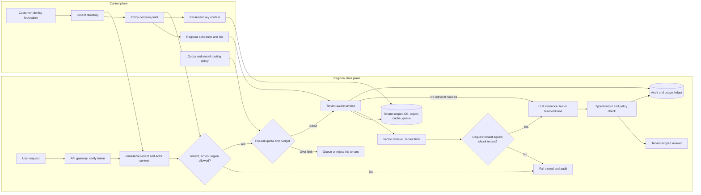

# G07 — Secure Multi-Tenant AI Platform: Main Interview Guide

**Multi-tenant AI** is one platform, many customers. Cheaper than a stack per customer. The failure is **Acme seeing Globex’s docs**, in a cache, a log, or a prompt.

**G07 covers one slice:** identity → tenant stamp that never changes → every store and model call respects it. Not “put tenant_id on a row and hope.”

End to end, as Acme user Maya asking her assistant:

1. **SSO proves Maya is Acme.** That tenant id is frozen on the request.
2. **Quotas and region** — maybe Frankfurt only, including logs.
3. **Retrieval, cache, and the model see only Acme bytes.**
4. **If Globex is noisy**, fair queues protect Maya; we don’t leak by sharing a hot cache key.
5. **Spend is metered before the model call**, so Acme cannot burn Globex’s budget.
6. **If Acme leaves**, we prove keys and copies are gone.

That’s it: **verify tenant once → enforce everywhere → meter and isolate.** Arbitrary tenant plugins stay out.

The promise is one affordable AI platform for many customers **without a cross-tenant read, write, cache hit, or model context leak**. A tenant ID on a row is insufficient. Derive tenant context from verified identity once, keep it immutable, and enforce it independently at every storage and inference boundary.

G07 is the [source study](G07_Secure_Multi_Tenant_AI_Platform.md)’s anchor for the shared platform, per-tenant budget, noisy-neighbor, and cross-tenant retrieval cases.

| Variant | Shared foundation | What changes |
|---|---|---|
| Secure platform for 500 tenants | Identity-derived scope, layered isolation, quotas, regional routing | Full platform design and shared-versus-dedicated choice |
| Per-customer GenAI budgets | Same tenant context and request path | Meter before the model call; attribute spend and key caches by tenant and permission |
| One unusually active tenant | Same admission and usage ledger | Distinguish healthy adoption from a loop or abuse before throttling |
| Cross-tenant retrieval incident | Same retrieval and ACL boundary | Detect mismatched request/document tenant, roll back filter, purge cache, notify affected customer |

## 1. Questions to ask the interviewer

| Question to ask | What it's really asking | What you then decide |
| --- | --- | --- |
| Which tenant data classes and AI tasks are in scope? | Are we hosting chat over tickets, or also embeddings of contracts and logs of prompts? | Storage, inference, logging, and the first-release trust surface. |
| Are residency rules hard, customer-specific, or preferences? Do logs and backups count? | If a German tenant’s data cannot leave Frankfurt, do chat logs and backups count? | Regional placement and what must stay local. |
| Which tenants may share, and what qualifies for dedicated capacity, keys, or clusters? | Can tenant A sit next to tenant B on the same GPU, or do banks get their own cluster? | Tiers and how much isolation you pay for. |
| What does “predictable performance” mean per tenant? What is peak skew? | If one tenant sends 20× traffic, do the other 499 get slow? | Quotas, fair queues, and reserved lanes. |
| Do customers federate identity or bring keys? What does verified deletion require? | When a customer leaves, can we prove every copy — including keys — is gone? | Membership mapping, keys, inventory, and offboarding. |
| Which budgets are contractual, and can tenants choose model tiers? | Can a tenant burn $10k overnight on a frontier model, or do we stop them before the call? | Pre-call admission, routing, metering, and billing. |
| What proof must an auditor or incident commander see? | After a suspected leak, can we show tenant B’s docs never entered tenant A’s context? | Isolation tests, tenant-scoped audit, and retention. |

## 2. Requirements and sizing

**Functional:** tenant onboarding and policy configuration; immutable tenant context on every request; per-tenant quotas, keys, regions, and retention; tenant-scoped data, cache, queues, vector retrieval, and inference; auditable administration; a dedicated tier for justified exceptions; coordinated export and deletion.

**Non-functional:** zero confirmed cross-tenant exposure; one tenant cannot cause unbounded latency for neighbors; measure p95 and cost by tenant, not only fleet average; security failures fail closed. Control-plane changes are auditable. The source’s sizing exercise uses **500 tenants, 50,000 active users, 200 QPS peak, and 20× workload skew**. Mean load is only 0.4 QPS per tenant, which hides the heavy tenants. A 2-second SLO implies fewer hops; a 15-second workflow can use a durable queue.

**Scope fence:** no arbitrary tenant plugins in the core, universal custom runtime, cross-region active-active writes for everyone, or unlimited model choice at launch. Model selection is an approved platform capability, not tenant-supplied arbitrary execution.

The unit-economics frame is `C_tenant = C_fixed/N + C_usage + C_isolation`. Share fixed capacity when safe; pay the isolation premium when residency, risk, or performance requires it.

## 3. Architecture

This condenses the [source architecture, §4](G07_Secure_Multi_Tenant_AI_Platform.md#4-draw-the-architecture-end-to-end). The platform hosts LLM inference, but the model receives only tenant-scoped inputs and never decides tenant membership or authorization.

### Step-by-step architecture

- **Step 1.** Validate the identity token and map the principal through the tenant directory; ignore tenant IDs supplied in a request body.
- **Step 2.** Create immutable actor, tenant, role, and region context, then evaluate policy for the specific action and resource.
- **Step 3.** Route only to an allowed region and shared or dedicated tier; select tenant-specific keys and retention policy.
- **Step 4.** Meter tokens, concurrency, and budget **before** inference; a tenant over quota queues or is rejected without stalling neighbors.
- **Step 5.** Tenant-aware services read and write scoped DB rows, object namespaces, cache keys, queue envelopes, and vector indexes. A missing scope fails closed.
- **Step 6.** Apply tenant filtering at vector ingestion and query, then independently check `request.tenant_id == chunk.doc_tenant_id` before building the LLM prompt.
- **Step 7.** Route the permitted request to fair shared or reserved LLM inference. Validate typed model output before any persistence or downstream action.
- **Step 8.** Emit tenant-scoped audit and usage events; return the answer only within the verified context.

**Agent role:** this is a multi-tenant **AI platform**, not one universal autonomous agent. It can host RAG assistants and bounded agents. Every model prompt, retrieval, tool call, cache hit, output, and trace inherits the same immutable tenant context; agent plans are proposals checked by platform policy.

## 4. The seven isolation layers

| Layer | Enforced rule |
|---|---|
| Row | Database or session policy refuses an unscoped query; application convention alone is not enough. |
| Object | Blob and embedding namespaces are tenant-scoped. |
| Cache | Key includes tenant, permission signature, and version; cross-tenant hit is an incident. |
| Queue | Envelope and dead-letter path preserve tenant scope. |
| Log | No raw prompt, secret, or other tenant’s identifiers in shared telemetry. |
| Vector index | Tenant scoped at ingestion and search, with a post-retrieval tenant invariant. |
| Key | Tenant data keys limit raw-storage compromise blast radius. |

Default to shared infrastructure with enforced tenant rows for the common case. A separate namespace adds a stronger boundary without a whole deployment; a dedicated cluster/region/key set is for requirements the shared tier cannot safely or economically meet. Least privilege applies to every service identity. The blast radius is measured by tenant, region, workflow, and dependency.

## 5. Fairness, regions, and failures

Rate limiting caps a tenant’s own usage; fair queuing decides order under contention. Use token, concurrency, and burst quotas feeding a shared worker pool; reserve capacity for contractual tiers. Diagnose unusually high usage by API key, user, feature, time, model route, tokens, batch jobs, and agent steps. Support legitimate adoption; stop loops or abuse. Do not rely on autoscaling alone.

Define policy centrally and enforce it regionally when residency requires. Data, traces, logs, backups, and derived indexes follow placement and retention. During a control-plane outage, continue only operations whose local verified policy and keys remain sufficient; block sensitive changes, queue where safe, and reconcile on recovery.

| Failure | Response |
|---|---|
| Missing tenant predicate, mismatched chunk, or region route | Reject, audit, and stop the affected path. |
| Cache key missing tenant | Disable path, invalidate entries, inspect what was served. |
| Queue leaks metadata | Quarantine, investigate, rotate credentials if necessary. |
| One tenant exhausts quota | Throttle or degrade **that tenant** while preserving fair service. |
| Key or policy authority unavailable | Fail closed for protected data or actions. |

Export and deletion need a tenant inventory across rows, blobs, embeddings, caches, queues, logs, and backups, plus verified completion and retention exceptions. A database delete alone is not offboarding.

## 6. Evaluation, rollout, and interview close

**Release gate:** an adversarial isolation suite for cross-tenant object reads, stale cache, replayed tokens, malformed filters, namespace collisions, missing predicates, and vector retrieval. Any unexplained boundary failure stops promotion; confirmed cross-tenant incidents target zero. Track per-tenant p95, quota rejection, cost, and regional failover against agreed SLOs.

Roll out internal tenants → negative isolation suite → small shared tenants with conservative quotas → dedicated tier by policy and economics. Canary, rollback, operator runbooks, support training, and audited admin actions are part of delivery.

> “I would default to a shared platform for 500 tenants, but derive tenant context from verified identity once and make it immutable. The control plane sets membership, policy, region, keys, and quotas; the data plane enforces scope independently in rows, objects, caches, queues, logs, indexes, and keys. I would meter before LLM inference and use fair queues so a large tenant cannot starve the rest. A missing tenant predicate or cross-tenant retrieved chunk fails closed. I would prove that with an adversarial suite before external rollout, then offer dedicated capacity only when the customer’s risk, residency, or SLO requires it.”

Use the [Deep Dive](G07_Secure_Multi_Tenant_AI_Platform_Deep_Dive.md) for the leak drill and isolation mechanics and the [Cheat Sheet](G07_Secure_Multi_Tenant_AI_Platform_Cheat_Sheet.md) for last-minute recall.
