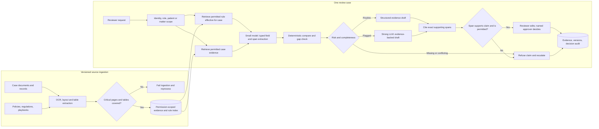

# G08 — Document Review Copilot: Main Interview Guide

**Extraction is cheap; judgment is expensive.** The copilot extracts evidence, compares it with the governing rule, cites the exact supporting span, and drafts. A named clinician, compliance reviewer, or lawyer makes the material decision. Missing evidence, a broken citation, or uncertain access stops the path.

The [source study](G08_Document_Review_Copilot.md) treats three cases as variations of one spine:

| Case | Shared foundation | What changes |
|---|---|---|
| Healthcare prior authorization, the anchor | Document → typed evidence → versioned rule → gap/risk → cited draft → human approval | Patient/PHI boundary, payer/plan/procedure/date rule, clinician decision |
| Financial compliance reviewer | Same extraction, rule mapping, exact citation, review | Jurisdiction/product obligations, severity, high-recall surveillance, false-positive burden |
| Legal contract copilot | Same clause-to-rule comparison and review | Playbook position, fallback language, privilege, material deviation to counsel |
| Claims-processing assistant | Same triage and evidence controls | Claim-type rollout, anomaly signals, adjudication held for later governance |

## 1. Questions to ask the interviewer

| Ask | What the answer changes |
|---|---|
| Which document and decision are slow or risky today? Who owns the final call? | First slice, reviewer, approval route |
| What is read-only, draft-only, or externally submitted? | Tool allowlist and whether write-back exists at launch |
| What is the governing source: payer rule, regulation, or playbook? How is its effective version selected? | Rule ingestion, versioning, and retrieval |
| Which fields or tables are crucial, and what extraction coverage is acceptable? | Typed schema, parser mode, ingestion gate |
| Which PHI, privileged, or financial fields may enter prompts, logs, and the model provider? | Data minimization, redaction, deployment boundary |
| What must the assistant refuse or escalate? What evidence must the reviewer see? | Risk tiers, span verifier, review UI |
| How much false-positive burden can the reviewer absorb, and what cost per true issue is acceptable? | Screening tiers and evaluation thresholds |

## 2. Requirements and first release

**Functional:** retrieve the rule effective for the case; extract relevant fields and exact source spans; compare evidence with criteria; flag missing, stale, or conflicting facts; classify risk; produce an editable draft with a span citation for every claim; verify that each span supports the claim and the user may view it; route material or uncertain cases to a named human; audit evidence IDs, rule/prompt/model versions, edits, and approval.

**Non-functional:** source ACL and patient/matter scope must hold before generation; PHI and privileged content are minimized in prompts and redacted from logs; no customer-data training without agreement. The source examples call for **3–8 s** interactive questions, **10–20 s** packet generation, and overnight batch for bulk surveillance, with analyst drill-down under **10 s**. Fail closed on access, stale governing rule, missing citation, or material approval; degrade visibly on non-authoritative formatting and source outages. Measure cost per document **and per true issue found**.

**Version one:** one document type, one rule source, internal drafts, every material case approved. No autonomous clinical, legal, or regulatory decision and no external submission. An unmapped ACL or critical parser coverage failure excludes the source until repaired.

## 3. Architecture

This diagram condenses the [source architecture, §4](G08_Document_Review_Copilot.md#4-draw-the-architecture-end-to-end) into the ingest and review lanes. It names where the cheap model and strong LLM run and where they lose authority.

### Step-by-step architecture

- **Step 1.** Ingest case records and governing rules with version, effective date, ACL, and page/span metadata.
- **Step 2.** Parse text and tables. For a high-risk policy, low table or page coverage fails ingestion and triggers OCR/table reprocessing; missing content cannot be retrieved later.
- **Step 3.** Authenticate the reviewer and apply role plus patient, matter, or tenant scope before retrieving both the rule in force and the case evidence.
- **Step 4.** A small model extracts typed fields and exact evidence spans. Low-confidence fields become gaps, never invented facts.
- **Step 5.** Compare fields with the governing criteria, detect missing or conflicting evidence, and assign a risk tier.
- **Step 6.** Use a structured routine draft or send flagged risk to a strong LLM for an evidence-backed draft. Missing or conflicting support takes the refusal/escalation branch.
- **Step 7.** Cite the span actually used, then verify both claim-to-span support and permission. A wrong citation blocks the output even if the answer sounds correct.
- **Step 8.** The human reviewer edits, approves, or rejects. Record evidence, rule version, model/prompt version, edits, and final decision; nothing external is submitted in version one.

**Model and agent role:** this is a bounded document-review copilot, not an autonomous clinical, legal, or compliance decider. A small extraction model processes the broad page set, and the strong LLM drafts only flagged work. Deterministic rules, the citation verifier, and the named professional control what can be relied on and what leaves the workflow.

## 4. Controls worth defending

| Boundary | Why it exists |
|---|---|
| Typed extraction schema | Payer, plan, procedure, diagnosis, date, therapy, lab, imaging; or jurisdiction/obligation/evidence; or clause type/playbook/deviation. Comparison needs named facts. |
| Parser coverage gate | A table-heavy PDF flattened into prose may silently lose an approval matrix. Check detected versus extracted tables and page coverage before indexing. |
| Rule version | Payer rule by plan/procedure/date of service; regulation by jurisdiction/product; playbook by clause type and effective date. |
| Span-level citation | A correct answer with a misleading citation can be more dangerous than refusal. The verifier checks the actual supporting span, not the nearest ranked chunk. |
| Sensitive-data boundary | Restrict what enters prompt, index, logs, provider, and reviewer view; no permission granted by a prompt instruction. |
| Human decision | Drafts and suggestions never become clinical, compliance, or legal rulings automatically. |

## 5. Failure and cost playbook

| Failure | Response |
|---|---|
| PDF parser misses tables on high-risk policy | Fail ingestion, use OCR/table fallback, block affected answers until corrected index is live. |
| Governing rule stale or missing | Refuse draft; show required rule version and route to reviewer. |
| Step therapy or other clinical evidence absent | Flag the gap; do not invent a treatment history. |
| Citation does not support claim | Reject output and send to review, regardless of overall groundedness score. |
| Wrong patient or privileged matter | Access check fails closed before retrieval. |
| LLM or retrieval unavailable | Partial packet with labeled gaps or refusal; bulk work may queue. |
| Approval unavailable | Nothing external leaves. |

Bulk surveillance is a screening funnel: rules and small classifiers process all documents; the strong model sees only borderline or flagged risk. Dedupe templated packets by content hash, batch non-urgent work off-peak, cap context and top-k, and watch the **flagged fraction** because it drives strong-model spend. Keep the citation verifier on the path that a material draft takes.

## 6. Evaluation and rollout

Use separate datasets and gates for extraction fields, answer groundedness, **citation span accuracy**, high-risk escalation, and PHI/permission safety. The source examples offer **≥90% grounded claims**, **≥95% correct span citations**, **≥95% high-risk escalation**, **≥80% task completion**, and **zero** permission/PHI violations; agree final thresholds per workflow. Track reviewer overrides, false-positive burden, preparation time, first-pass approval/denial, p95, and cost per true issue found.

The two source incidents show why gates are separate. In the legal citation incident, the answer was supported but cited the wrong clause; grounding scored **0.91** while citation accuracy was **0.38**. In the parser incident, **17** tables were detected but only **9** extracted (**52.9%** coverage), leaving pages 31–33 and the approval matrix out of the index. Retrieval tuning cannot repair either missing input or a verifier that ignores span mismatch.

Roll out one document type and rule source → offline golden cases → red-team and shadow mode → read-only reviewer pilot → one low-risk category with approved drafting. Expand only while extraction, citation, escalation, and privacy gates hold. Reviewer corrections feed a governed evaluation set, not silent training.

## 7. Interview answer to rehearse

> “I would first clarify which decision the reviewer makes and what the assistant must never decide. I would ingest the right rule version and case evidence under patient or matter permissions, with a parser gate for critical tables. A small model extracts typed fields and spans, deterministic checks compare them to criteria and flag gaps, and a strong LLM drafts only flagged cases. Every claim cites the exact span used; a separate verifier blocks a mismatched or forbidden citation. A named human approves material cases, and versioned evidence and edits go into the audit. I would launch on one document type, shadow real reviewers, and gate on extraction, citation, escalation, and zero privacy violations. Cost is controlled by cheap screening and strong-model routing, not by skipping review.”

Use the [Deep Dive](G08_Document_Review_Copilot_Deep_Dive.md) for incident and schema details and the [Cheat Sheet](G08_Document_Review_Copilot_Cheat_Sheet.md) for recall.
