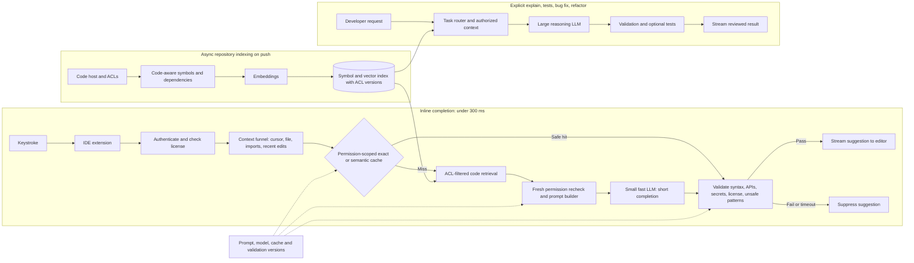

# G09 — Enterprise Coding Assistant: Main Interview Guide

An inline completion must arrive before the developer’s next keystroke **and** respect a private repository’s permissions. Design the context funnel and latency budget first. Do not send the whole repository to a large model, and do not let a cached or retrieved snippet cross an access boundary.

The [source study](G09_Enterprise_Coding_Assistant.md) combines the under-300 ms coding-assistant anchor with the enterprise private-repository variant. The latter adds incremental indexing, repository ACLs, licensing and productivity proof; it keeps the same fast completion spine.

## 1. Questions to ask the interviewer

| Ask | What the answer changes |
|---|---|
| Are suggestions real-time as the user types? What p95 and first-token target? | Whether completion needs the sub-300 ms hot path or a slower interactive path |
| Which IDEs, languages, and tasks come first? | Extension protocol, validators, and model routes |
| How much of the repository may be used? What does the code host say this developer can read? | Permission mirror, symbol index, context budget |
| Can code leave the customer’s environment? Is training on private code allowed? | Cloud versus private deployment, masking, provider contract |
| What kinds of output must be blocked: nonexistent API, secret, unsafe pattern, license conflict? | Validation gate and release suite |
| What would prove developer value beyond clicks or suggestions served? | Acceptance slices and controlled productivity comparison |
| What is the peak typing load and model-cost budget? | Cache, rate limits, inference capacity, completion length cap |

## 2. Requirements and budget

**Functional:** IDE single- and multi-line completion, repository-grounded context under code-host ACLs, validation before display, and accept/partial-accept/reject telemetry without retaining source. Explain, test generation, bug fix, refactor, Q&A, and code search run on a separate slower route. Index repository code incrementally on push by symbol, file, and dependency rather than generic token windows.

**Non-functional:** p95 inline completion **under 300 ms** end to end; source’s illustrative stage budget is **~10 ms cache, ~40 ms context, ~200 ms streamed small-model inference, ~50 ms validation**. That totals the entire limit, so leave operational headroom rather than treating each estimate as a guaranteed allowance. A cache hit is faster; a slow request is suppressed rather than shown after the user has moved on. Never train on private enterprise code without explicit consent, never retain source in telemetry, mask secrets before context leaves the IDE, and fail closed on stale access or validation. The source discusses millions of developers and bursty keystrokes; scale stateless APIs, sharded indexes, and GPU inference while measuring the p95 under load.

## 3. Architecture

This is the whiteboard version of the [source architecture, §4](G09_Enterprise_Coding_Assistant.md#4-draw-the-architecture-end-to-end). The hot path uses a small LLM; slower explicit tasks use a larger reasoning model. Neither model decides access or whether unsafe code may be shown.

### Step-by-step architecture

- **Step 1.** On a repository push, incrementally chunk code by symbol and dependency, mirror code-host ACLs, and refresh the index in the background.
- **Step 2.** The IDE extension sends the keystroke context over a persistent connection; authenticate the developer and check their license.
- **Step 3.** Funnel current function/file, imports, cursor, tabs, edits, and relevant diagnostics into a small context; never send the whole repository.
- **Step 4.** Check an exact or conservatively tuned semantic cache keyed by tenant, permission scope, code and prompt version. A safe hit goes to output validation; a miss triggers retrieval.
- **Step 5.** On a miss, retrieve only authorized snippets from the symbol/vector index, recheck freshness and access, and assemble a bounded prompt.
- **Step 6.** Route inline completion to a small fast LLM with a short output cap. Explicit explanation, test, fix, and refactor tasks use a larger reasoning LLM on a slower, isolated path.
- **Step 7.** Validate syntax, known APIs against the symbol index, secrets, license, and unsafe patterns before display. Suppress invalid or late output.
- **Step 8.** Stream the accepted suggestion to the editor and record latency, cache, model, validation, and acceptance events without saving source code.

**Agent role:** the core completion product is a routed LLM assistant, not an autonomous coding agent. An optional chat mode that runs tests or opens a pull request would need the separate acting-agent controls from G03: allowlisted tools, scoped credentials, approval for writes, and audit. Those actions are not on the completion hot path.

## 4. Context, cache, and model routing

The funnel is **repository → relevant signals → ranked snippets → prompt**. Local file and cursor are high value; nearby symbols and imports beat distant history. Retrieve project helpers and internal APIs semantically, but use code-aware chunks so a function/class and its imports stay together. The index’s symbol map also checks whether a suggested API exists.

Exact-match caching is the safest start. Semantic caching can reuse similar completions but may confidently serve a wrong answer for two nearby requests; tune conservatively and never match across tenant, repository permission, or version boundaries. Put the cache **before** embedding and retrieval. Prompt-prefix and unchanged-chunk embedding caches help without substituting for permission checks.

Completion uses a small model; multi-line may use a medium tier where the budget permits; explain, tests, bug fix, refactor, and architecture questions take a larger reasoning route. The task type comes from the user action, not a model’s guess. A refactor request must not queue ahead of keystroke completions.

## 5. Failure, scale, and cost

| Failure | Response |
|---|---|
| Backend or fast model unavailable/late | No completion; editor keeps working. |
| Vector index unavailable | Use permitted local context or a safe cache hit; mark retrieval degraded. |
| Permission mirror stale or cache crosses scope | Refuse affected snippet or disable cache path; treat a leak as a security incident. |
| Validator unavailable or output fails | No suggestion. |
| Secret in input/output | Mask input before model; suppress output and audit safely. |
| Large model unavailable | Explicit slow-path task queues with visible status; hot path remains unaffected. |

At 10×, partition indexes by repository and region, re-index on push asynchronously, autoscale inference for bursty typing, and rate-limit abusive paths. Trace input context size, output tokens, cache hit rate, first-token time, total p95, acceptance, and cost per thousand completions. Trim context and cap generated length before moving every request to a stronger model. Streaming improves when the developer sees tokens; it does not shorten total generation time.

## 6. Evaluation and rollout

**Product metric:** accepted and partially accepted completions, sliced by task, language, and repository. Acceptance is necessary but not sufficient: compare adopters with a matched control on time-to-merge, review rework, and defects with effect and sample size chosen in advance. **Safety gates:** zero secret/license and cross-repository leaks, hallucinated APIs blocked by validation, p95 under 300 ms at peak, first token under the source’s example **100 ms** target where achievable. Nightly regression catches model drift even without a code change.

Roll out one repository with real permissions and three developers with different access → cache/local-context path → ACL-filtered retrieval and leak suite → silent suggestions → live completion for one team → expand repositories and slower tasks one at a time. Source and prompts are never training data without explicit consent.

## 7. Interview answer to rehearse

> “I would start with two constraints: inline completion needs p95 under 300 milliseconds, and private repository code must never cross permission boundaries. I would index on push by symbol and mirror the code host’s ACLs. On a keystroke, a context funnel keeps only the current function, imports, nearby files, and relevant edits. An early permission-scoped cache can end the request; on a miss, authorized retrieval builds a small prompt for a fast LLM. A larger reasoning model handles explicit explain, test, and refactor tasks away from the hot path. Every output is checked for syntax, nonexistent APIs, secrets, license, and unsafe patterns before the editor sees it. I would measure acceptance and a controlled productivity outcome, plus p95 and zero leak gates, then roll out one repository at a time.”

**Memory line:** “Cache first, retrieve on a miss, route by task, validate before display.”

Use the [Deep Dive](G09_Enterprise_Coding_Assistant_Deep_Dive.md) for budget and permission mechanics and the [Cheat Sheet](G09_Enterprise_Coding_Assistant_Cheat_Sheet.md) for a final pass.
