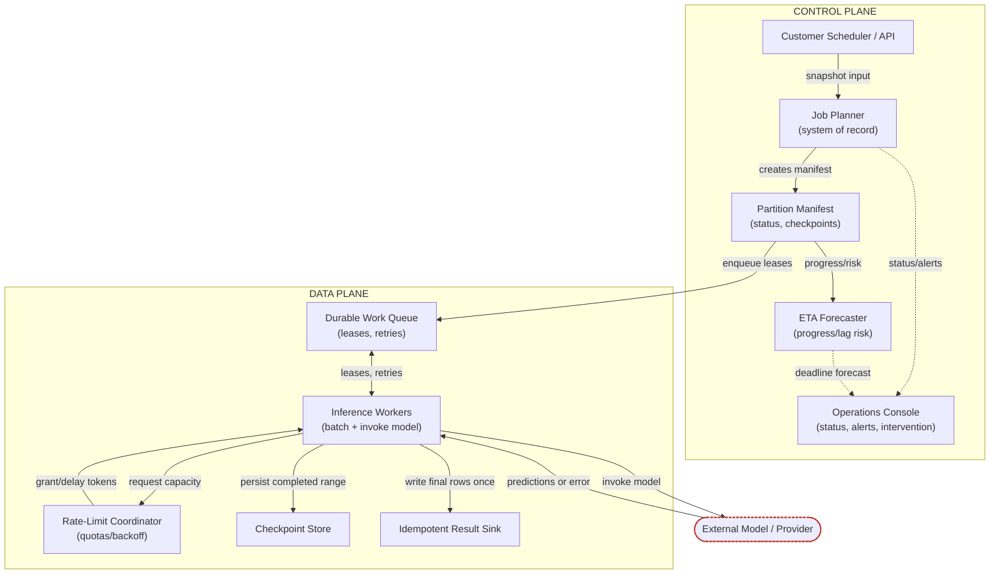
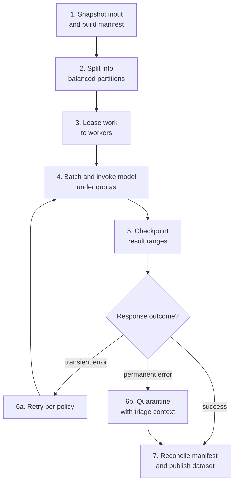
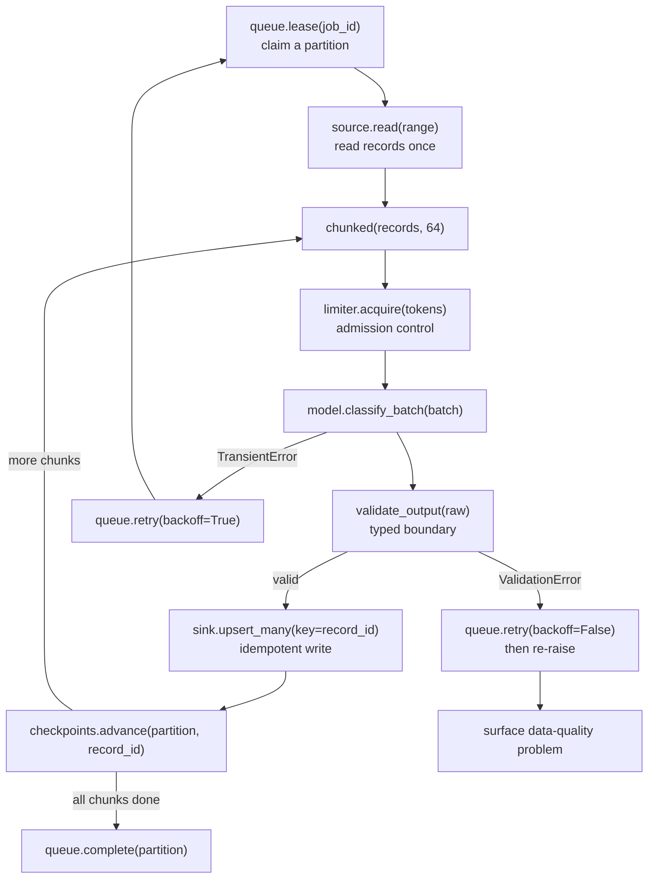
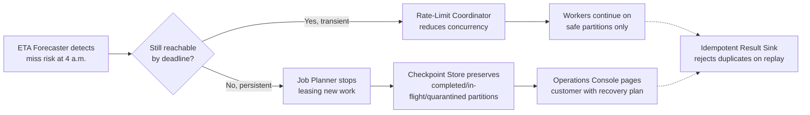
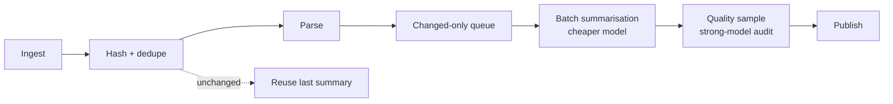

# High-Volume Batch Inference and Document Pipelines

*Finish a hundred million records before the business day starts, without paying twice for any of them or losing the ability to replay the night.*

◷ 35 min

Throughput is not the hard part of this system. The hard part is the decision at 4 a.m., when the job is behind and someone has to choose what ships. This page consolidates group G10 of `CASE_STUDY_INDEX.xlsx` into one read for the day before. The anchor is the nightly classification batch, and every other member is a delta on it.

| Case in the group | What it contributes here |
|---|---|
| #21 High-Volume Batch Inference System, 100M records before 6 a.m. (anchor) | Sections 1 to 12 and 14: the design, requirements, sizing, failure policy, evaluation, rollout and delivery |
| #49 OpenAI Q5 Enterprise Document-Processing Platform (bank, millions of documents) | Section 13: extraction schema, confidence, human review and format drift on the same spine |
| #42 Nightly PDF summarisation is too expensive (playbook drill) | Section 15, first card |
| #116 §15 scenario 13, batch embedding job became too expensive | Section 15, second card |

Sections and tables marked *(own construction)* were built for this page from the sources' arguments and are not in the sources verbatim.

---

## 1. Restate the Throughput Prompt as a Recovery Problem

The prompt sounds simple: classify 100 million records every night before 6:00 a.m. The room splits three ways at once. The business owner says, "We just need classifications ready by morning." The data platform lead says, "Only if it doesn't break the warehouse." The on-call engineer says, "Only if we can rerun it safely when the model or upstream feed fails."

That disagreement is the real problem, not the throughput number. So restate the target before drawing anything.

> *"Complete a replayable, cost-controlled batch by deadline with clear recovery decisions when behind schedule."*

Lead with that sentence verbatim. Interviewers use it as a checkpoint. It tells them whether the candidate is solving the business problem or only the throughput problem.

The technology-neutral opening does the same work in a longer form:

> *"We need a nightly batch inference system that classifies about 100 million records and finishes before 6:00 a.m. The design has to account for model rate limits, cost constraints, and downstream capacity so the output is usable by morning. I'd first clarify who consumes the results, what happens if we're behind schedule, and what replay and audit requirements exist before choosing the execution architecture."*

The weak version names tools: *"We should build a batch classifier with a fast inference service and a scheduler."* The corrected version names value: *"The customer needs reliable nightly classification results delivered before business users need them, with predictable cost and a clear recovery path when the batch falls behind."*

Map the stakeholders next. Each one hires the platform for a different job, and naming them settles who owns which decision.

| User | Workflow | Current pain | What the system gives them | Owns which decision |
|---|---|---|---|---|
| Morning operations team (end user) | Consumes classifications before planning and outreach | Output late or untrusted | Usable results by 6 a.m., with explicit status | Not retry semantics |
| On-call data platform engineer (operator) | Restarts failed jobs, checks lag, judges whether a partial run is safe | Alert fatigue, manual cleanup, unclear rerun safety | Bounded replay, a forecast, a runbook | Not whether stale output is acceptable for a campaign |
| Model owner | Versions and approves the model | Input contract drift, wrong artifact in production | Version pinning, the approved artifact per run | Not the downstream SLA |
| Security owner | Reviews access to source records, outputs, logs | Sensitive data in queues and checkpoints | Opaque identifiers, encryption, audit trail | Access and retention |
| Business sponsor | Justifies the recurring cost | A nightly fire drill | A predictable process at a known unit cost | The contingency policy, jointly with operations |

The business does not decide batch retry semantics. The on-call engineer does not decide whether a stale classification is acceptable. The model owner does not own the downstream SLA. That division keeps the design aligned with reality rather than with one enthusiastic stakeholder.

## 2. Ask the Partial-Result Question First

The brief is incomplete on purpose. The interviewer may confirm the volume and the deadline, then stop. That is the test, not a trap.

Protect the one constraint that most changes the architecture. **Can the batch be partial, or must it be all-or-nothing?** A late but correct job can be rerun or explained. A job that silently drops or duplicates records is much harder to trust. The partial-result answer sets the retry strategy, the checkpoint cadence and how much to spend on the last 10%.

| Question | Design axis it unlocks |
|---|---|
| Who consumes the output, and what breaks if it is late? | SLA: whether the deadline is hard, soft or tiered by segment |
| Can the batch be partial, or must it be all-or-nothing? | Retry strategy, checkpointing, downstream handoff |
| What happens when the job is behind at 4 a.m.? | The recovery decision: speed up, reduce scope, fallback model, or partial results |
| How often does the model change, and who approves it? | Version pinning, validation and rollout control |
| What downstream system receives the classifications, and what can it absorb? | Sink capacity, so inference finishing does not overwhelm the consumer |
| What audit, retention or residency constraints apply? | Storage, logging and data movement |
| Are records pre-partitioned by tenant, region or date? | Whether ingestion becomes part of the design |
| How many tokens per record, and is the tail heavy? | Batching, rate limiting, throughput planning and cost exposure |
| Native batch APIs? Global and per-tenant rate limits? | A simple worker pool versus a submission scheduler |
| Does downstream need ordering, or only exactly-once logical results? | Checkpointing, output naming, safe partition replay |
| Is there a hard cost ceiling, and which degraded mode is preferred? | Keeps the design from becoming an uncontrolled compute bill |

When an answer is withheld, state the assumption and keep moving. The reusable form:

> *"Given the missing details, I'm going to assume the records are independently partitionable, partial results are only useful if they're explicit and auditable, and the highest-risk constraint is finishing by the deadline without duplicates. That means I'll prioritize shardable work, checkpointed progress, idempotent writes, and rate limiting before I optimize for cost or advanced scheduling. If any of those assumptions are wrong, the design changes in specific ways, so I'd want to validate them early."*

Assumptions carry risk too, so name it. If one record depends on another's result, naive parallelism breaks correctness. If a tenant expects strict completion, a degraded mode that skips low-priority work breaks the contract. If the provider's batch API has different semantics from synchronous calls, a naive retry loop duplicates output.

## 3. State Requirements as Testable Constraints

Split what the system must do from how well it must do it. "Batch the model calls" is a feature. "Finish by deadline" is a constraint. "Scale workers up and down" is a mechanism, not an outcome.

**Functional requirements.**

| # | Requirement |
|---|---|
| F1 | Freeze a nightly input snapshot, partition it, classify every record under quota, and publish usable output before the deadline |
| F2 | Partition work into independent, balanced units so the system scales by parallelism rather than by heroics |
| F3 | Schedule and autoscale workers, batching model calls where the provider supports it |
| F4 | Rate-limit globally and per tenant, so retries never stampede the provider into self-inflicted throttling |
| F5 | Checkpoint progress and write idempotently, so a replay never produces duplicate logical results |
| F6 | Forecast completion continuously and invoke a pre-agreed contingency mode when the deadline is at risk |
| F7 | Retry transient errors with backoff; quarantine permanent ones with triage context |
| F8 | Expose pause and replay-failures as authorised, idempotent operations |

**Non-functional requirements.**

| Constraint | Stated so it can be tested |
|---|---|
| Latency | `RPS = (N_records / T_window) × (1 + h)`. 100M records in a 6-hour window is about 4,630 records/sec, or 5,320 with 15% headroom. The budget covers queueing, batching, writeback, validation and reconciliation, not only inference |
| Availability | The pipeline accepts and processes work throughout its window; sized against the tail of large or slow records, not the mean, because the last 5% of a batch is the hardest |
| Correctness | No missing or duplicate logical results; bounded replay from durable checkpoints after any crash |
| Quality | An agreed error rate, confidence threshold or validation pass rate before publishing |
| Freshness | Results available downstream within an agreed time after the source closes |
| Security | Inputs, prompts and outputs protected per the customer's access and retention rules across every hop |
| Compliance | An auditable record of which snapshot, model version and partition produced every classification |
| Cost | Cost per million records measured; retries, which can double token spend, and stragglers, which keep workers warm, watched as cost lines |

Prioritise with a strict ladder when answers are partial. **Must:** independent partitioning, deadline protection, idempotent writes, restartable execution. **Should:** autoscaling, batching where it helps, global plus per-tenant limits. **Could:** ranking low-value records, richer per-customer scheduling, manual override tooling.

Fence the MVP explicitly. It excludes cross-job optimisation across unrelated workloads and any per-record interactive feedback loop. It also excludes a training pipeline in the batch path, arbitrary ad hoc queries, and optimal cost in every failure mode. More responsibilities make deadline risk harder to reason about.

Every component then traces to a named requirement:

| Requirement | Design element |
|---|---|
| Partition work independently | Input sharding, partition metadata, and per-shard task queues |
| Schedule and autoscale workers | Queue depth monitoring, worker pool, and autoscaling policy |
| Batch model calls where appropriate | Request bundling layer and provider batch submission path |
| Rate-limit globally and by tenant | Central admission controller and tenant quota enforcement |
| Checkpoint progress and write idempotently | Durable checkpoint store and idempotent output sink |
| Forecast completion and invoke contingency plans | Progress estimator and alerting / fallback controller |
| Finish by deadline | Scheduling policy that favors the critical path |
| No missing or duplicate logical results | Idempotency keys, replay-safe writes, and reconciliation checks |
| Bounded cost | Spend guardrails, batch sizing policy, and degraded-mode rules |
| Restart without full replay | Partition-level checkpoints and resumable task state |

## 4. Size From the Deadline and the Tail

The first pass is always too optimistic: a queue, a few workers and a model endpoint. That works at average load. It ignores the deadline, the retry rate and the hard last 5%.

Derive the number live rather than reciting it. With 100,000,000 records and a window of 6 × 3,600 = 21,600 seconds, the base rate is about **4,630 records/second**. That is the floor, not a design. Adding 15% headroom for retries, stragglers and reconciliation gives a planning rate of about **5,320 records/second**.

| Scenario | Records | Window | Base rate | With 15% headroom |
|---|---|---|---|---|
| Current batch | 100M | 6 hours | ~4,630 rps | ~5,320 rps |
| 10x growth | 1B | 6 hours | ~46,300 rps | ~53,200 rps |

The 10x row is not tomorrow's expectation. It tests whether the design is fragile or absurdly overbuilt. Keep headroom and growth apart: headroom covers noise inside one batch, while growth covers next quarter's larger batch. State average, peak, growth and headroom rather than one point estimate.

Tokens turn the record rate into a factory. At 250 input plus 20 output tokens, each record costs 270 tokens before retries. That token figure, not the record count, usually drives partitioning and component choice.

Say the uncertainty out loud rather than hiding it:

> *"At 100 million records, I would plan for about 4,630 records per second before retries. If the average prompt is smaller than expected, model throughput becomes easier; if the tail of large records is heavier, we need more headroom or more aggressive partitioning. I would size the system around the tail, not the mean."*

The chapter treats cost only qualitatively. The V2 tutorial's author closes the gap with a live dollar formula, which is supplementary perspective and not chapter content. At 270 tokens a record and ~5,320 rps, the fleet sustains roughly 1.43M tokens/second. Across the window that is about 5.15B tokens for 100M records. Apply the per-million-token price for a cost per run, then divide by 100 for cost per million records. Retries re-spend the full 270 tokens each. At a 5% retry rate that is roughly 5% more spend. The 15% headroom is itself a cost line, and stragglers burn compute past the window. So the cost ceiling belongs inside the rate-limit coordinator's backoff behaviour, not in a separate finance conversation.

## 5. Draw the Architecture End to End

The organising rule is that each layer owns a different kind of truth. The planner owns what "this batch" means. The queue owns who is working on what. The sink owns what has been published. Planner, manifest, forecaster and console are control-plane concerns that coordinate the run. Workers and sink are data-plane concerns that move records through the model into durable output. They scale and change at different rates, which is why they are drawn apart.

The system with its planes and trust boundaries *(own construction)*:

```
 ╔══════════════════════════ CONTROL PLANE (coordinates the run) ══════════════════════════╗
 ║  customer scheduler / API ─> JOB PLANNER ─> PARTITION MANIFEST ─> ETA FORECASTER          ║
 ║  (idempotency key)          freeze snapshot  ranges, attempts,     progress vs deadline   ║
 ║                             model_version,   checkpoints              │                   ║
 ║                             deadline, policy     │                    v                   ║
 ║                                                  │            OPERATIONS CONSOLE          ║
 ║                                                  │            status · pause · replay ·   ║
 ║                                                  │            contingency mode + owner    ║
 ╚══════════════════════════════════════════════════╪════════════════════════════════════════╝
            TRUST BOUNDARY 1: snapshot frozen ───────┤ enqueue leases (opaque ids only)
 ╔══════════════════════════ DATA PLANE (moves records) ═════════╪═════════════════════════╗
 ║                                                               v                         ║
 ║   DURABLE WORK QUEUE ── lease ──> INFERENCE WORKERS (autoscaled) ── read range once     ║
 ║   leases, visibility timeout      │   chunk into batches (e.g. 64)                        ║
 ║   retries, dead letter            │                                                      ║
 ║        ^                          v                                                      ║
 ║        │               RATE-LIMIT COORDINATOR  grant / delay tokens + concurrency        ║
 ║        │               (global + per tenant; backpressure lives here)                    ║
 ║        │                          │                                                      ║
 ║        │     TRUST BOUNDARY 2 ────┼──> EXTERNAL MODEL / PROVIDER (timeouts, 429s, junk)   ║
 ║        │                          v                                                      ║
 ║        │               validate_output()  typed boundary; bad output -> quarantine       ║
 ║        │                          │                                                      ║
 ║        │     TRUST BOUNDARY 3 ────┼──> IDEMPOTENT RESULT SINK                             ║
 ║        │                          │    upsert on job_id + record_id + model_version      ║
 ║        │                          v                                                      ║
 ║        └── ack / release ── CHECKPOINT STORE  advances only after the sink write succeeds ║
 ╚═════════════════════════════════════════════════════════════════════════════════════════╝
```

The source's control-plane and data-plane diagram:



The components, with the failure behaviour of each *(the "Fails how" column is own construction)*:

| # | Component | Responsibility | State owned | Fails how |
|---|---|---|---|---|
| 01 | Job planner | Accepts the nightly run, freezes the input snapshot, and creates the batch plan | Run metadata, snapshot pointer, deadlines | Closed: a broken snapshot hash or unknown model version stops the run |
| 02 | Partition manifest | Lists balanced work units and their status | Partition IDs, ranges, attempts, checkpoints | Closed: a corrupted manifest is never guessed around |
| 03 | Durable work queue | Hands out partitions to workers with leases | Lease state, visibility timeout, retry eligibility | Degrades: an expired lease is reissued; dead-letter after too many attempts |
| 04 | Rate-limit coordinator | Shapes outbound calls to stay under quota | Token budget, concurrency budget | Degrades: slows leases rather than letting retries stampede |
| 05 | Autoscaled inference workers | Batch records and call the model | Ephemeral execution state | Degrades: a crash loses no committed work; the lease expires |
| 06 | Checkpoint store | Persists completed ranges and partial progress | Last successful offset, result hashes | Closed: a corrupted checkpoint fails the partition, never skips it |
| 07 | Idempotent result sink | Writes final classifications once per record | Final output by record key | Degrades: bounded buffer and backpressure, then circuit-break |
| 08 | ETA forecaster | Estimates completion and lag risk | Progress rate, remaining work, backlog | Degrades: a missing forecast is itself an alert |
| 09 | Operations console | Shows run status, warnings, and intervention controls | Human-facing incident and rollout state | Degrades: runbook and pager still work without it |

Walk the happy path in seven steps. First, snapshot the input and build the manifest, recording dataset version, deadline and run policy. Second, split into partitions balanced by processing cost. Tenant, payload-size band or historical latency beats record count alone. Third, lease work to workers through the durable queue, so the planner never waits on any worker. Fourth, batch records and ask the rate-limit coordinator for capacity before calling the model. Fifth, checkpoint the completed range and write rows to the idempotent sink. Sixth, retry transient errors per policy and quarantine permanent ones with triage context. Seventh, reconcile the manifest and publish the completed dataset.



Three trust boundaries carry the security story. After the planner freezes the snapshot, the run cannot drift if upstream data changes. The model call is external, so the worker assumes timeouts, throttling, malformed responses and partial failures. Publication must be idempotent, so replays cannot create duplicate classifications.

The MVP is planner, manifest, queue, worker fleet, checkpointing, idempotent sink and a basic ETA panel. Smarter rebalancing, historical throughput prediction and tenant-aware scheduling come later. The common mistake is treating those later items as the architecture itself. Draw the flow, but speak in obligations: every component protects deadline, cost, replayability or operator confidence.

## 6. Make Duplicate Work Harmless

A crashed worker will redo some work. The design choice is whether that is dangerous or harmless. A sink cannot duplicate a row it upserts by the same key.

Three records carry the durable state.

| Record | Key | Fields | Lifecycle |
|---|---|---|---|
| BatchJob | `id` | `input_snapshot`, `deadline`, `model`, `state` | `queued`, `running`, `paused`, `completed`, `failed`, `replaying` |
| Partition | `job_id + partition_id` | `range`, `lease`, `attempts`, `completed_count`, checkpoint | `available` → `leased` → `completed`; `retryable` on transient failure; `abandoned`/`dead_lettered` after too many attempts |
| InferenceResult | `job_id + record_id + model_version` | `output`, `status`, confidence | `pending` → `written` → `validated`; `failed` if rejected or unpersistable |

The `input_snapshot` is an immutable pointer to the exact dataset version. It is the ownership boundary that makes replay possible. The result is keyed by business identity plus model version, never by worker or attempt. Be ready for "why not just `record_id`?" Without the model version, a rerun under a new model silently overwrites yesterday's answer and replay loses its meaning.

The API surface stays small.

| Endpoint | Contract |
|---|---|
| `POST /v1/batch-jobs` | Authenticated; validates manifest and model reference. Idempotency key, so a client retry after a timeout does not create two jobs. Same key with a different payload is a conflict, not a merge |
| `GET /v1/batch-jobs/{id}` | Read model: progress, partition counts, failure counts, deadline, model version, state, compact error summary. Unknown id is not-found; no access is a permission error that neither confirms nor denies existence |
| `POST /v1/batch-jobs/{id}/pause` | Stops new leases and preserves progress. Optimistic concurrency via ETag. Already terminal is a state conflict, not a pretend success. Retried pauses are harmless |
| `POST /v1/batch-jobs/{id}/replay-failures` | Privileged, because replay reconsumes capacity. Selector for all failed, a named subset, or after a checkpoint. Reused key returns the same replay outcome, never a second attempt |

Idempotency applies at every write boundary, not only the sink. A duplicate create must not create a second job. A duplicate lease renewal must not invalidate the original lease. A duplicate result write overwrites the same logical record. A duplicate pause or replay request is harmless. Versioning matters for the same reason: when the model, schema or validation policy changes, old and new results must stay distinguishable.

The smallest code path that proves the design is one worker loop. It claims a lease and reads the range once. It chunks records into batches of 64 and acquires tokens from the limiter before the call, because admission control belongs before the quota breach. It then validates output at a typed boundary and upserts by `record_id`. The checkpoint advances only after the sink write succeeds, which prevents false progress. The partition completes only after every batch succeeds. A `TransientError` retries with backoff. A `ValidationError` retries once without backoff and then surfaces as a data-quality problem.



Two tests prove it. The contract test repeats `POST /v1/batch-jobs` with the same key and confirms one job and one id. The failure-injection test crashes the worker after `upsert_many()` but before `complete()`. On retry the sink still holds one logical result per `record_id`. The source's assertion is that distinct `record_id` count equals row count.

The sketch deliberately omits multi-worker contention, logging, metrics, tracing, cancellation, authentication, throttling and dead-letter routing. That is acceptable only when each omission can be named and placed.

## 7. Scope Workers to Immutable Snapshots

The most important security control is not on the model. It is that every worker processes a versioned snapshot that cannot change beneath it. A retry against a mutable table cannot prove what it retried.

Snapshot immutability does three jobs at once. It removes ambiguity during retries, it makes evidence replayable after an incident, and it limits blast radius. A malformed or malicious tenant dataset touches only that tenant's snapshot, not a global table.

Keep raw payloads out of queue metadata. Messages carry only opaque identifiers, snapshot versions, partition keys and lease information. An exported or replayed queue then discloses nothing. Encrypt result and checkpoint stores and restrict them to least privilege. Checkpoint state reveals business data shape and partial outputs, so treat it as sensitive.

Record model version, code version, prompt or feature schema version and deployment identity for every run. That is how the team proves which artifact produced which result when a customer asks why today's classification differs from yesterday's.

The chapter names no external framework, and the V2 author treats that as a gap. Their supplementary answer: ask which framework applies before claiming compliance. With personal data, purpose limitation and data minimisation apply to snapshot and result retention. In finance or healthcare, SOC 2 or HIPAA-style evidence applies to the audit trail. They also propose a per-run "processing basis" field on `BatchJob`. The controls are necessary but not sufficient without a named framework to test them against.

## 8. Decide the Failure Policy Before the Run

"We retry" is not a failure policy. A policy answers what to retry, how long, against which snapshot, with what evidence, and who is paged. Every external dependency and every irreversible action needs one.

| Failure policy | Example triggers |
|---|---|
| Fail closed | Broken snapshot hash, unauthorized worker, corrupted checkpoint, unknown model version |
| Degrade | Transient downstream throttling, temporary feature store slowness, short-lived queue depth spikes |
| Queue | Quota reduction, noncritical partition backlog, scheduled maintenance window |
| Human intervention | 45% complete at 4 a.m. with no plausible path to deadline, repeated sink throttling, repeated crash loop, or any case where delayed output is worse than no output |

Memorise one trigger per row. An interviewer who invents a novel failure wants it classified into this table on the spot.

The five drills, each as detection, containment, recovery and prevention:

| Drill | Detect | Contain | Recover | Prevent |
|---|---|---|---|---|
| 1. The 4 a.m. incident | Progress metrics, partition completion, deadline projection, not the pager at 5:59 | Freeze risky retries, preserve the checkpoint, snapshot evidence: lease holder, active partitions, error budget, queue depth, sink health, quota state | Raise concurrency within safe limits if reachable; otherwise degraded mode | Tighter scheduling assumptions, earlier canaries, a forecast visible long before the final hour |
| 2. Provider quota reduction | Spike in rate-limit responses, drop in successful calls per minute | Immediate backoff and a circuit breaker | Rebalance across remaining capacity, smaller batches, defer low-priority partitions | Quota-aware scheduling, preflight capacity checks, a runbook naming which tenant classes pause first |
| 3. Hot partition, stragglers | Partition duration histograms, worker idle time | Split the hot partition or reassign workers if the snapshot model allows | Redistribute load; cap retries per shard | Partition keys with better cardinality; detect "elephant" tenants before the run |
| 4. Worker crash after the model call | Lease expiry | Nothing is marked complete until every row is durable | Resume from the immutable snapshot; overwrite identical results or skip finalised rows | Deterministic record keys; complete only after all rows are written |
| 5. Result sink throttles | Sink latency, queue age | Bounded retries with jitter, then circuit-break the sink and slow intake upstream | Past the retry budget, move partitions to a dead-letter path or durable retry queue and page a human | Escalation policy in the runbook before launch |

The pattern across all five: never push harder against a failing dependency. Slow the arrival rate at the coordinator, preserve evidence before repair, and escalate when the deadline is no longer recoverable. The ownership statement to say in the room:

> *"This design contains blast radius by tenant, region, workflow, and dependency; it retries only within a bounded policy; it preserves evidence before repair; and it escalates when the deadline is no longer recoverable."*

## 9. Answer the 4 a.m. Question Before It Is Asked

The signature follow-up is that the job is 45% complete at 4 a.m. The forecaster should have flagged it already. The console should answer three questions, not just turn red. Can we still finish by 6:00 a.m.? Which lever do we pull first? What is the blast radius if we keep going?

Find the bottleneck before choosing the lever. It is compute, a hot partition, provider throttling or downstream backpressure. Then choose the smallest intervention that restores schedule confidence. That means raising concurrency if there is headroom, splitting slow partitions, or switching remaining work to a fallback model. Alternatively, publish only the subset that meets the correctness and policy bar. If throttling is temporary, the coordinator reduces concurrency and keeps the run stable. If it is persistent, stop taking new leases, checkpoint everything and page the customer with a recovery plan.



The contingency modes are business decisions agreed before launch, each with a named owner. They are: continue at full accuracy until cutoff, switch to a cheaper or smaller model, or reduce low-value record classes. The other two are narrowing scope to the highest-priority segments and pausing nonessential enrichment. The product owner and operations lead agree them before the first run, not after the first miss.

Partial results are publishable only under a partial-acceptance policy the customer defined. Some workloads can publish completed partitions if each unit is independently valid and clearly labelled. Others need all-or-nothing, because downstream cannot handle mixed vintages. State which regime applies. If partial, define the exact publish gate and completeness metadata.

Two more probes arrive in this part of the round. To rebalance a hot partition, detect it early through lag, runtime histograms and queue age. Split it with a deterministic key so work stays replayable. If it is in flight, move only the unprocessed remainder and record the new ownership. To avoid paying twice after a timeout, treat the timeout as ambiguous: it may or may not have completed. Idempotency keys, durable checkpoints and write-side deduplication make the retry cheap and harmless.

## 10. Defend Four Trade-Offs With a Verdict First

State each verdict in one sentence before the justification. Slogans like "always batch bigger" cost more than missing detail.

| Trade-off | Verdict |
|---|---|
| Larger batches vs tail latency | Batch as large as needed for throughput, but small enough that a failed or slow partition can be retried without jeopardising the window. Batch size is a risk-control knob |
| Provider API vs self-hosting | Provider when time-to-value and operational simplicity dominate; self-hosting when latency control, cost predictability or data residency justify the burden |
| Dynamic repartitioning vs manifest simplicity | Start with a static manifest, which is easier to replay and audit, and explain how skew is detected and the offending slice split manually |
| Full quality vs fallback model at deadline risk | Switch remaining work to a cheaper, faster fallback only if the output is still useful and clearly marked, under a publishability policy the business owns |

The riskiest assumption is that the backlog is evenly distributed and model runtime is stable. When the interviewer challenges it, agree rather than defend.

> *"If skew is worse than expected, I would treat partition imbalance as the first-class risk, because a few hot shards can dominate the batch window. I would size the system so that we can split or retry those shards without restarting the entire job."*

## 11. Measure Deadline, Duplicates and Stragglers

"The job finished" is not an evaluation. A batch can finish and still have published duplicates, run twice the budget, or been saved by one operator at 5:50. The scorecard separates throughput, correctness and cost.

| Metric | What it proves | Calculation and source | Strong threshold | Owner |
|---|---|---|---|---|
| Completion forecast vs deadline | The run will land before 6 a.m. | Completed work / remaining work plus observed throughput | Never crosses the deadline without a contingency activated | Operations |
| Duplicate logical result count | Replay is safe and the sink truly idempotent | Comparing logical keys, not storage rows | Within the tolerated replay window | Data engineering |
| Records per second | Sustained throughput meets the required rate | Worker telemetry and sink acknowledgments | At or above the forecast needed to finish | Platform |
| Tokens per second | Explains cost and quota pressure better than records | Request logs, model client instrumentation | Does not rise faster than the representative distribution | ML platform |
| Straggler age | No single partition monopolises the fleet | Partition timestamps and duration histograms | Oldest active partition within the recovery budget | Batch platform |
| Retry rate | Failures are transient, not systemic | Retry counters and failure taxonomy | Within the normal band by failure class | On-call |
| Cost per million records | Unit economics hold under retries and stragglers | Cloud billing plus model usage logs | Inside the approved budget envelope | Finance / platform |

Build the dashboard as a story, not a wall of charts. The headline asks one question: will the batch complete by 6:00 a.m.? It shows the forecast, remaining partitions and the contingency mode. Below it sit the levers that explain the forecast: records/sec, tokens/sec, retry rate, straggler age, queue depth and sink lag. Below those sit correctness signals: duplicates, rejected inputs, checkpoint freshness and replayed partitions. A business user sees whether the run is on track. An operator sees which subsystem is slowing it. An engineer traces a retry spike to a quota cut or a bad input cohort.

Keep four layers distinct: technical health, model quality from sampled evaluation, adoption by downstream teams, and business outcome.

## 12. Roll Out Through a Load-Test Ladder

Launch is a sequence of controlled reductions in uncertainty. The customer's question is not "does it work?" but "when can this be trusted in production?"

| Stage | Gate | Owner |
|---|---|---|
| Week 0-1 | Agree who consumes the output, whether partial results have value, and the cost ceiling | FDE with the business sponsor |
| Week 1-2 | Benchmark the representative token distribution: short records, long records, edge cases, known skew, not a toy sample | Platform / ML infrastructure; data owner confirms representativeness |
| Week 2-3 | 1% load test: parsing, auth, model invocation, sink writes and checkpointing hold under real concurrency | Engineering, operations and business jointly |
| Week 3-4 | 10% load test: retry behaviour, throttling and downstream capacity still fit the deadline envelope. A failed 1% gate blocks it, not "a little delayed" | Same joint gate |
| Week 5 | Practise failure on purpose: crash a worker, cut quota, kill a downstream dependency, drain and restore a queue | Batch platform (crash), dependency owner (quota), on-call (incident log) |
| Week 6-8 | Confirm bounded replay, durable checkpoints and graceful degradation rather than retry-storm oscillation | Batch platform |
| After pilot | Define contingency modes with named owners before the job is ever late | Product owner and operations lead |

A wrong input distribution makes every later estimate wrong: throughput, queue pressure, quota burn and downstream lag. That is why the benchmark comes first.

Carry a risk register with owner, mitigation and trigger.

| Risk | Owner | Mitigation | Trigger |
|---|---|---|---|
| Quota shrinks unexpectedly | Dependency owner | Lower-rate contingency mode | Sustained throttling or forecast slippage |
| Duplicate logical results rise | Data engineering | Stricter idempotency checks and replay review | Duplicate count above tolerated threshold |
| Sink latency spikes | Platform ops or downstream team | Buffering and backpressure | Queue age exceeding the recovery window |
| Worker crash loop | On-call owner | Rollback or reduced concurrency | Repeated restarts in the canary slice |

The go/no-go gate is blunt. Without stable throughput, rehearsed crash recovery and an available contingency owner, do not expand. That sounds conservative until the batch misses one deadline because nobody wanted to say no.

Complete the launch plan with canarying, rollback, migration, training, support and documentation. A slice of nightly work runs the new path while the old one stays as fallback. Rollback stops new work, preserves checkpoints and resumes on the stable path. Separate reusable value from delivery work too. Thresholds, deadlines, model choice and contingency policy are configuration. Warehouse, queue and identity integrations are adapters. Retry, checkpoint and rate-limit wrappers become a common service. Partition orchestration, replay semantics and the push/degrade/stop policy engine are core product.

## 13. Extend the Anchor to the Bank Document Platform

Member #49 is OpenAI question-bank Q5: *"A bank processes millions of financial documents and wants to extract structured data using AI."* It is the same spine with a different payload. Records become documents, and a label becomes a schema.

The source lists the decomposition. It runs ingestion, file validation, document classification, OCR or multimodal extraction, schema-constrained output, and confidence scoring. It continues with validation against business rules, human review, correction feedback, audit storage, and reprocessing with model versioning. It asks for discussion of batch versus online processing, idempotency, retry behaviour, data lineage, model versioning and document-format drift.

Map each stage onto the anchor rather than drawing a new system *(own construction)*.

| Q5 stage | Where it lives on the anchor | What is new |
|---|---|---|
| Ingestion, file validation | Job planner and snapshot | A document hash and file-type check before a document enters the manifest; corrupt files quarantined, never retried |
| Document classification | First worker pass | Routes each document to its extraction schema; low confidence goes to review, not to a guess |
| OCR or multimodal extraction | Inference workers | Page-level cost dominates, so partition by page count band, not document count |
| Schema-constrained output | `validate_output()` typed boundary | The schema is the contract; a field that fails type or range is rejected, never stored |
| Confidence scoring, business-rule validation | After the typed boundary | Rules such as totals reconciling or dates in range catch plausible-but-wrong extraction |
| Human review, correction feedback | New lane off the sink | A review queue for low-confidence and rule-failed fields; corrections become labelled evaluation data |
| Audit storage, data lineage | `InferenceResult` plus snapshot pointer | Every field traces to document hash, page, model version and reviewer |
| Reprocessing, model versioning | `replay-failures` and `model_version` in the key | Reprocess a cohort under a new model without overwriting the old answers |

Batch versus online is a per-workflow decision. Bulk backfills and nightly statements are batch, which buys throughput and quota smoothing. A document a customer uploads while waiting needs an online path with its own latency budget. The two paths can share the extraction schema and the typed boundary *(own construction)*.

The likely follow-up is *"How would you handle a new document format appearing without warning?"* The answer *(own construction)* has four parts. Detect it: classification confidence drops, and schema-validation and business-rule failure rates rise for one cohort. Contain it: fail that cohort to the review queue rather than publishing low-confidence fields. Recover: add the format to the classifier and schema, then replay only the quarantined cohort through `replay-failures`. Prevent: monitor confidence and rejection rates by source and template, because format drift is a data-quality incident, not a model bug.

## 14. Deliver It in Fifty Minutes

Open with the outcome, then ask the judgment question. If everything cannot be perfect, what matters most: deadline, accuracy, cost or safe replay? That one question prevents overbuilding the wrong axis.

> *"I'll first pin down the batch deadline, correctness tolerance, and failure recovery expectations. Then I'll estimate throughput and identify the bottlenecks that actually threaten the schedule. After that I'll propose a partitioned ingestion and inference pipeline with idempotent writes, monitoring, and a deliberate fallback path if we're behind at 4 a.m."*

| Minutes | Phase |
|---|---|
| 0–5 | Discovery: size, deadline, freshness, quality bar, retry policy, whether partial output is useful (sections 1 and 2) |
| 5–10 | Estimation: 4,630 and 5,320 rps, tokens per record, where margin is thin (section 4) |
| 10–18 | Architecture: control plane, manifest, workers, checkpoints, sink (section 5) |
| 18–25 | Normal run, then a degraded run: worker failure, hot partition, throttling, falling behind (sections 6 and 8) |
| 25–32 | Trade-offs (section 10) |
| 32–38 | Security and operations, each control tied to a failure mode (section 7) |
| 38–45 | Follow-up drill: 4 a.m., rebalancing, paying twice, partial publish (section 9) |
| 45–50 | Close in ninety seconds, name the riskiest trade-off, specify the first rollout gate (section 12) |

Running out of time before the trade-offs or the failure drill is how a technically strong answer scores as not interview-strong.

The two-minute spoken answer, from the answer key:

> *I would not start with the model. The prompt sounds like a throughput problem — classify 100 million records every night before 6 a.m. — but the room splits three ways immediately: the business owner wants classifications by morning, the platform lead wants the warehouse intact, and the on-call engineer wants to rerun safely when something fails. That disagreement is the real problem, so I would restate the target as completing a replayable, cost-controlled batch by deadline with clear recovery decisions when behind schedule. The first question I need answered is whether partial results have value, because that one answer determines retry strategy, checkpointing cadence, and how much money to spend on the last ten percent. On sizing, 100 million records across a six-hour window is about 4,630 records per second, and with fifteen percent headroom for retries and stragglers, roughly 5,320 — and I would size from the tail of large records, not the mean. Architecturally, a planner freezes an immutable snapshot, a manifest splits it into partitions balanced for processing cost rather than row count, a durable queue hands out leases, and a rate-limit coordinator holds backpressure so tightening quota slows leases instead of triggering a retry storm. Checkpoints make recovery bounded and the sink upserts on the record key so replay cannot duplicate. The failure I would rehearse out loud is being 45% complete at 4 a.m., and the answer is that the contingency mode — narrow scope, cheaper model, or partial output with explicit status — was agreed with a named owner before launch.*

The ninety-second architecture summary, from the V2 tutorial:

> *"We have a nightly batch that must classify all records before the business deadline, so I would prioritize replayability, clear ownership, and deadline-aware recovery over exotic optimization. I'd partition the input into deterministic shards, track each shard in a durable manifest, and run workers that call either a provider API or a self-hosted model depending on the cost, latency, and control constraints. Every write would be idempotent, every shard would checkpoint progress, and every retry would be safe to rerun. I'd monitor shard lag, provider throttling, queue age, and downstream sink health so we can detect whether we're on track by the middle of the window. If we're behind at 4 a.m., I'd first identify the bottleneck, then decide whether to split hot partitions, raise concurrency, or switch the remaining work to a fallback model if the quality policy allows it. The main trade-off is between throughput and flexibility: larger batches improve efficiency, but smaller, deterministic units make recovery safer. I'd start rollout with a small representative slice, verify stable throughput and idempotent replay, and only then expand to the full nightly workload."*

The three answer tiers, from the answer key. The weak answer builds a batch classifier with an inference service and a scheduler and runs it nightly. It names tools instead of value and says nothing about snapshots, 4 a.m. or replay. The average answer partitions, runs workers with retries, checkpoints and alerts when late. It treats "alert when late" as a recovery plan and never shapes calls against quota. The strong answer freezes a snapshot and balances partitions by processing cost. It leases durably, holds backpressure in a coordinator, checkpoints for bounded replay, upserts by record key, and agrees contingency modes before the run is ever late.

The lines that carry the round *(own construction from the sources' arguments)*:

1. *"Throughput is not the hard part. The decision at 4 a.m. is."*
2. *"Can the batch be partial? That one answer sets retry, checkpointing and the spend on the last ten percent."*
3. *"4,630 records a second is the floor. 5,320 with headroom. Size from the tail, not the mean."*
4. *"Backpressure lives in the rate-limit coordinator. Quota tightening slows leases, it does not trigger a retry storm."*
5. *"The checkpoint advances only after the sink write succeeds."*
6. *"Upsert on job, record and model version. Duplicate work becomes harmless instead of dangerous."*
7. *"Fail closed on the snapshot hash, the model version and the checkpoint. Degrade on everything else."*
8. *"The contingency mode has a named owner before launch, not after the first miss."*

The follow-ups arrive in a predictable order.

| Follow-up | Answer |
|---|---|
| What do you do at 4 a.m. with 45% done? | Identify the bottleneck, then pull the smallest lever: concurrency if there is headroom, split hot partitions, fallback model, or publish the subset that meets the bar. Make the decision explicit; never leave the batch in limbo |
| How do you rebalance a hot partition? | Detect through lag, runtime histograms and queue age; split with a deterministic key; move only the unprocessed remainder and record new ownership in the manifest |
| How do you avoid paying twice after a timeout? | Treat the timeout as ambiguous; idempotency keys, durable checkpoints and write-side dedup; record progress at commit boundaries, not only at job end |
| When are partial results publishable? | Only under a partial-acceptance policy the customer defined; label completeness; all-or-nothing when downstream cannot handle mixed vintages |
| Why is the result keyed by model version too? | So a rerun under a new model does not silently overwrite yesterday's answer, and replay stays meaningful across model changes |
| Where does the cost ceiling live? | In the rate-limit coordinator's backoff and the degraded-mode rules, not in a separate finance report |
| What if the provider's batch API behaves differently from synchronous calls? | Retries can duplicate output; the idempotent sink absorbs it, and the submission scheduler replaces the naive worker pool |
| How does a new document format get handled? (#49) | Detect by confidence and rejection rates per cohort; route to review; add to classifier and schema; replay only that cohort |

## 15. Answer the Cost Pivots in Ten Minutes

The interviewer's pivot after a good design is "the nightly bill is too high." Two members of the group are that pivot, and both have the same root: reprocessing what did not change.

**#42, nightly PDF summarisation is too expensive.** Thousands of PDFs are processed nightly and cost is too high. Ask first. Are documents new or changed? Is full summarisation required every time? What is the SLA? Can work be batched off-peak? What quality checks are needed?

| | |
|---|---|
| Dominant driver | Reprocessing unchanged documents on a premium model |
| Cheapest lever first | Content hash and change detection; dedupe; cheaper model in batch mode; sampled strong-model audit |
| Metric that proves it | Changed ratio; cost per document; queue depth; eval score on the sample |
| Do not | Run every PDF through the premium model every night |
| 60-second line | Never reprocess an unchanged document without a reason. Batch buys throughput not latency, so quality is proven by sampling. |

The source's strong answer adds incremental processing, queue budgets and sampled evaluation. Its architecture is ingest, hash and dedupe, parse, changed-only queue, batch summarisation, quality sample, publish. The trade-off: batch optimises throughput, not interactive latency, and quality is checked by sampling plus strong-model audits.



**#116, §15 scenario 13, the batch embedding job became too expensive.** The nightly embedding bill spikes after a document refresh. Ask whether all documents are re-embedded or only changed content. The causes are full re-indexing, duplicate documents, no content hash, or a larger embedding model.

| | |
|---|---|
| Dominant driver | Re-embedding unchanged and duplicate documents on every refresh |
| Cheapest lever first | Pause the full job; switch to incremental indexing; deduplicate. Later, a content-hash embedding cache with change detection, and off-peak scheduling |
| Metric that proves it | Embeddings generated vs documents changed; duplicate rate; model version; job retries |
| Do not | Re-index the whole corpus because the refresh touched it |
| 60-second line | Embedding should be incremental. Re-embedding unchanged documents is usually a pipeline design issue. |

The debugging step is a single comparison: changed document count against embedded document count. If the two differ, the pipeline is the bill. Prevention is an indexing budget with anomaly alerts. A silent embedding-model upgrade is also a re-index, so the model version belongs in the cache key *(own construction)*.

Both cards connect back to the anchor. The content hash is the same idea as the immutable snapshot: know exactly what this run is about, and skip what it is not. The sampled audit is the same idea as the tail-sized evaluation: prove quality on a sample instead of paying the premium model on everything.

Every strong cost answer is generated by four verbs in order. Measure, by comparing changed against processed and tracing cost per document. Route, sending the bulk to a cheaper model and the audit sample to the strong one. Bound, with queue budgets, an indexing budget and anomaly alerts. Cache safely, keyed on content hash and model version.

---

## Key Takeaways

- The prompt is a throughput problem on the surface and a 4 a.m. recovery decision underneath, so restate it as a replayable, cost-controlled batch by deadline.
- The partial-result question is asked first, because it sets retry, checkpointing and the spend on the last ten percent.
- Requirements are split into features and constraints, prioritised must, should, could, and each traced to a component.
- Sizing starts at 4,630 records per second, plans for 5,320 with headroom, and is driven by the tail and the 270 tokens a record.
- One diagram separates the control plane that coordinates the run from the data plane that moves records, with three trust boundaries.
- Duplicate work is made harmless by keying results on job, record and model version and advancing the checkpoint only after the sink write.
- Workers read immutable snapshots, queues carry opaque identifiers, and every run records its model, code and schema versions.
- The failure policy is decided before launch: fail closed, degrade, queue or human intervention, with five rehearsed drills.
- The 4 a.m. answer finds the bottleneck, pulls the smallest lever, and uses a contingency mode that already had an owner.
- Four trade-offs are defended with a verdict first, and skew is treated as the riskiest assumption.
- The scorecard tracks completion forecast, duplicates, straggler age, retry rate and cost per million records, not "the job finished".
- Rollout climbs from a representative benchmark through 1% and 10% gates to deliberate failure drills.
- The bank document platform is the same spine, with a schema at the typed boundary, a review lane and format drift treated as a data-quality incident.
- The hour opens with the outcome, spends its middle on failure and trade-offs, and closes on the first rollout gate.
- Both cost pivots are answered with change detection: never reprocess or re-embed what did not change.

## Check Yourself

1. **What is the one-sentence restatement of the prompt?** Complete a replayable, cost-controlled batch by deadline with clear recovery decisions when behind schedule.
2. **Which clarifying question is protected first when time is short, and why?** Whether partial results have value; it decides retry strategy, checkpoint cadence and how much to spend on the last 10%.
3. **Derive the planning rate.** 100,000,000 / 21,600 s ≈ 4,630 rps; ×1.15 headroom ≈ 5,320 rps.
4. **Why is headroom kept separate from growth factor?** Headroom covers noise inside one batch; growth covers next quarter's larger batch. Mixing them hides both.
5. **Where does backpressure live, and what does it do when quota tightens?** In the rate-limit coordinator; it slows leases or per-worker concurrency instead of letting retries stampede the provider.
6. **Why is `InferenceResult` keyed on `job_id + record_id + model_version`, not `record_id`?** So replay is idempotent within a run and a rerun under a new model cannot silently overwrite the old answer.
7. **When does the checkpoint advance?** Only after the sink write succeeds, which prevents false progress.
8. **Name one trigger for each failure policy.** Fail closed: broken snapshot hash. Degrade: transient sink throttling. Queue: quota reduction. Human intervention: 45% at 4 a.m. with no path to the deadline.
9. **What three questions should the console answer at 4 a.m.?** Can we still finish? Which lever first? What is the blast radius if we keep going?
10. **What changes when the payload is a bank's financial documents (#49)?** A schema at the typed boundary, confidence and business-rule checks, a human-review lane, and lineage down to document hash and page.
11. **What is the sixty-second line for the nightly PDF bill (#42)?** Never reprocess an unchanged document without a reason. Batch buys throughput not latency, so quality is proven by sampling.
12. **What single comparison diagnoses the embedding bill spike (#116)?** Changed document count against embedded document count.

## References

All paths are relative to `06_Interview_Prep/`.

| Section | Source |
|---|---|
| 1, 2, 3, 5, 6, 11, 12, 14 | `FDE/FDE_System_Design_Interview_20_Scenarios/Version_3/10_high_volume_batch_inference_system.md` and `answer_keys/10_high_volume_batch_inference_system_answer_key.md` (the anchor, #21) |
| 1 to 12, 14 (ninety-second summary, pacing, trade-offs, probes) | `FDE/FDE_System_Design_Interview_20_Scenarios/Version_2/chapter-10-high-volume-batch-inference-system-tutorial_v2.md` |
| Same material in long prose | `FDE/FDE_System_Design_Interview_20_Scenarios/Version_1/chapter-10-high-volume-batch-inference-system-tutorial.md` |
| 4 (dollar formula), 7 (named frameworks) | V2 tutorial, "My Perspective on the Gaps", which its author marks as supplementary and not chapter content |
| 13 | `OpenAI_Applied/Sample_Questions/OpenAI Applied_Engineer_Problem_Decomposition_Questions.md`, question 5 (#49) |
| 15 (#42) | `Study_Guides/Cost_Latency_Optimization/CRAM_SHEET_S15_S16.md`, Case 5; `CASE_STUDY_INDEX.xlsx`, Drill Add-ons tab, playbook row for #42 |
| 15 (#116) | `Study_Guides/Cost_Latency_Optimization/CRAM_SHEET_S15_S16.md`, scenario 13 and its §2 one-liner |
| Every item marked own construction | Built for this page from the sources' arguments; not source material |
