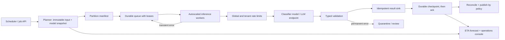

# G10 — High-Volume Batch Pipeline: Main Interview Guide

**Overnight batch** is: a huge file must be classified before morning. Miss the window and the site publishes nothing — or publishes a partial, if they allow it.

**G10 covers one slice:** freeze the job, chew through 100 million records, retry the flaky ones, quarantine the junk, publish by policy. Not a chat agent picking the next task.

End to end, as Tuesday’s 6 a.m. catalog job:

1. **Ops creates the job.** Input and model versions freeze. No silent prompt tweaks mid-run.
2. **We partition and queue** work. Workers pull with leases.
3. **The model labels a record.** Typed validation accepts or rejects the shape.
4. **A 429 retries.** Garbage JSON goes to quarantine, not an infinite loop.
5. **Each success writes once** with an idempotency key, then checkpoints.
6. **At 4 a.m. we are behind.** Named owner publishes 90% or holds all — they already said which.

That’s it: **snapshot → partition → infer → validate → checkpoint → publish or hold.** Interactive Q&A is out.

> **Source:** [G10_High_Volume_Batch_Pipeline.md](G10_High_Volume_Batch_Pipeline.md). This guide is the interview route through the unchanged source; use the [Deep Dive](G10_High_Volume_Batch_Pipeline_Deep_Dive.md) for mechanics and the [Cheat Sheet](G10_High_Volume_Batch_Pipeline_Cheat_Sheet.md) for rehearsal.

## The case in one sentence

Classify 100 million records overnight, finish within a six-hour window, recover predictably from failures, and know what can be published if the deadline cannot be met. The first design choice is the customer's answer to **partial results or all-or-nothing?**

## Questions to ask the interviewer

| Question to ask | What it's really asking | What you then decide |
| --- | --- | --- |
| Is 6 a.m. a hard publication deadline? Is partial output acceptable? | If we miss 6 a.m., do we publish 90% of scores or hold everything? | Reconciliation, fallback, and publication policy. |
| What is the record-size and token distribution, not just the mean? | Are most records 200 tokens, or is there a fat tail of 8k-token files? | Throughput, batching, and cost forecast. |
| Is inference deterministic and which model/prompt/schema versions must be replayable? | If we rerun Tuesday’s job, must we get the same labels from the same model snapshot? | Snapshot and idempotency key. |
| What provider quotas, tenant limits and regional restrictions apply? | Does the provider cap us at 2k RPM, and must EU records stay in the EU? | Rate coordination and worker pool. |
| Which errors are transient versus permanent? | Is a 429 a retry, or is bad JSON a quarantine forever? | Retry vs quarantine and review. |
| Who owns a missed deadline and which fallback model is approved? | At 4 a.m., who can switch to the cheaper model — and is that model even allowed? | The 4 a.m. runbook. |
| Must output be complete, ordered, auditable or available incrementally? | Can downstream start reading finished partitions, or must the file be whole and ordered? | Sink and publication contract. |

## Requirements: Functional + Non-Functional

The easiest way to frame requirements in an interview is:

> **Functional = what the system does. Non-functional = how well it does it and what constraints it must satisfy.**

### Functional requirements — what the system must do

1. **Create, inspect, pause, and replay jobs.**
2. **Freeze input and model configuration.**
3. **Partition and process records.**
4. **Validate typed outputs.**
5. **Write once logically.**
6. **Retry transient failures; quarantine permanent ones.**
7. **Reconcile and publish** by the agreed policy.

### Non-functional requirements — how well / under what constraints

| Requirement | Example target / constraint |
|---|---|
| **Deadline** | Six-hour completion window. |
| **Cost** | Bounded spend and provider calls. |
| **Security** | Tenant isolation; secure records/results; auth on job APIs and data paths. |
| **Reliability** | Durable checkpoints, recoverable workers; queue messages carry opaque IDs, not payloads. |
| **Operability** | Observable ETA and explicit incident ownership. |
| **Throughput (illustrative)** | 100M records / 21,600 s ≈ **4,630 rec/s**; 15% headroom ≈ **5,320 rec/s**. 270 tokens/record ≈ **27B tokens**/run (use 100M × 270, not the source’s 5.15B). 5% retries add ~5% spend. 10× ≈ 53,200 rec/s. |

Replace token assumptions with the customer’s distribution and measured provider throughput.

### Interview shortcut

If asked **“What are the requirements?”**, say:

> **“Functionally, freeze the job, process partitions, validate, write once, retry or quarantine, then publish by policy. Non-functionally, hit the six-hour window, isolate tenants, and know at 4 a.m. whether partial output is allowed.”**

## Architecture

The model or LLM performs classification or extraction. Deterministic orchestration owns partitioning, deadlines, retries and publication. This workload does not need an autonomous agent to decide what work to do next.

### Step-by-step architecture

1. The scheduler accepts an idempotent job request and records its deadline, publication policy, model, prompt and schema versions.
2. The planner freezes an immutable input snapshot and creates a partition manifest; the ETA forecaster watches remaining work.
3. Durable leases assign opaque record IDs to autoscaled workers; workers fetch scoped input and batch where the provider allows it.
4. A shared rate coordinator respects provider and per-tenant quotas before workers call the classifier model or LLM.
5. Workers validate typed output, then upsert using `(job_id, record_id, model_version)` so replay cannot duplicate a result.
6. Only after a successful sink write does the worker advance the durable checkpoint and acknowledge the lease. Transient errors retry; permanent errors enter quarantine.
7. Reconciliation compares results, failures and the manifest. Publication follows the customer's pre-agreed complete or partial-output rule.

## Decisions, failures and trade-offs

**At 4 a.m., only 45% is done:** use the forecast before this point to alert. Diagnose compute saturation, hot partitions, quota pressure and sink latency. Increase concurrency only if quota and sink headroom exist; split deterministic remaining work; use an approved fallback model or partial publication only when policy allows. If the deadline is impossible, stop new leases, preserve checkpoints and page the owner. Never silently publish a partial dataset.

**Exactly-once effect:** workers may run more than once. Leases plus an idempotent sink and checkpoint-after-write provide one logical result per key. Avoid claiming physical exactly-once execution.

**Scale, latency and cost:** shard the immutable manifest and autoscale workers to measured records/s; batch calls while respecting output size and tail latency; use global rate control so local worker increases do not overload a provider. Track tokens per record, retry spend, cost per million records, queue age and deadline forecast. Hash and skip unchanged documents for nightly PDF work; incremental indexing avoids unnecessary re-embedding. These are workload-specific cost pivots, not a reason to weaken correctness.

**Document-platform variant:** for bank documents, add file validation, classification, OCR or multimodal extraction, typed schema checks, confidence/business rules, human review, lineage and reprocessing by model version. Document-format drift becomes a first-class risk.

## Evaluation and rollout

Measure completion before deadline, predicted versus actual ETA, throughput, partition skew, duplicate-key conflicts, retry and quarantine rates, typed-output validity, provider quota errors and cost per million records. Test representative token sizes and deliberately crash a worker after sink write but before ack. Ramp from representative data to 1% and 10%, then exercise quota and sink failures. Assign a contingency owner and write the missed-deadline decision before launch.

## Two-minute interview answer

“I would first establish whether the six-hour deadline requires a complete dataset or permits an explicitly labelled partial one. I freeze the input and model configuration, partition 100 million records, and process them from durable leases with autoscaled workers behind global and tenant rate limits. Each worker validates the model output and idempotently upserts it before checkpointing or acknowledging. That makes retries safe. At roughly 4,630 records per second baseline, I plan for about 5,320 with headroom and forecast ETA continuously. If we fall behind, I diagnose quota, skew, compute and sink capacity, then apply only a pre-approved fallback. Reconciliation controls publication, and the operations dashboard shows deadline risk, failures and cost.”
