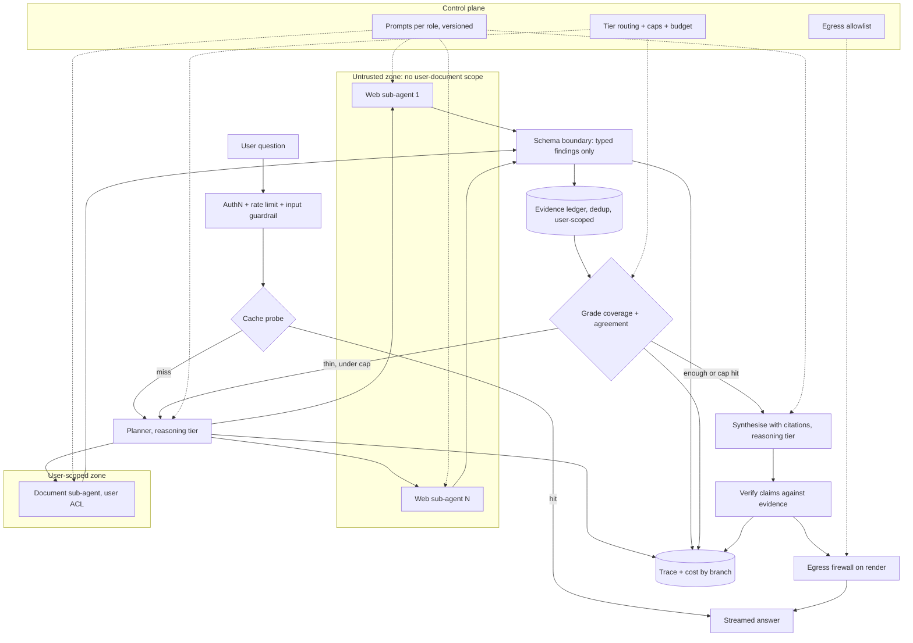

# Deep Research Agent at Consumer Scale

*Every extra search round makes the answer better grounded and the run slower and dearer, and the web pages that ground it are also the attack surface.*

◷ 25 min

A research agent does not fail because it is hard to call a model. It fails when an unbounded fan-out quietly spends the budget. It also fails when a fetched page reaches data it should never have seen. This page covers group G11 of `CASE_STUDY_INDEX.xlsx` in one read for the day before. It pairs one worked whiteboard design with one deployed system and one mock prompt.

| Case in the group | What it contributes here |
|---|---|
| #10 Deep Research Agent at consumer scale (anchor) | Sections 1 to 10 and 13: requirements, state, architecture, the arithmetic, the trifecta, measurement, the 45-minute script, the follow-up bank |
| #12 The Research Platform (multi-agent, deployed on AWS) | Section 11: the same product as nine running layers, with gateway, guardrails, pgvector and PyRIT |
| #103 Research system with a supervisor and workers (study-guide mock) | Sections 3, 8 and 12: the reducer, the three termination defences, the supervisor–worker build |
| Self-drill on #10, Drill Add-ons tab | Section 14 |

Sections and tables marked *(own construction)* were built for this page from the sources' arguments and are not in the sources verbatim.

---

## 1. Restate the Problem and Name the Oracle First

The first eight minutes buy every later answer. Twenty minutes on requirements leaves the design unfinished. Two minutes leaves it generic. Rehearse against a clock until the pacing is automatic.

Make three opening moves, every time. Restate the problem in one sentence. Ask for the eight numbers: throughput, latency, horizon, accuracy, cost, autonomy, data class and recovery. Then name the oracle and cut scope: "how will we know a run succeeded", and "I'll treat X as out of scope unless you want it in".

The prompt: design a read-only, citation-grounded research agent for ~100K daily users. It searches the public web and the user's own documents, then writes an answer in which every claim is cited.

Close requirements by restating the whole system as one sentence and asking "is that the system?". It costs 20 seconds. Interviewers consistently mark it as a strong signal, because it is what a technical lead does at the start of a real project.

> *"A read-only research agent for about a hundred thousand daily users, forty thousand runs a day, under ninety seconds at p95 and twenty cents a run, where success means every claim is cited to a source a reviewer would accept. Is that the system?"*

## 2. State Requirements as Testable Constraints

A requirement that cannot fail a test is a preference. "Well-researched" is a preference. "Every claim cited to a source a reviewer would accept" is an oracle, and only an oracle shapes the architecture.

The must-haves are five *(the MoSCoW split is own construction; the items are the source's)*. Decompose a question into a dependency-aware plan. Search the public web and the user's documents in parallel. Collect findings into one deduplicated evidence ledger. Synthesise an answer with citations. Verify each claim against the evidence before streaming it with a coverage note.

The should-haves come after the core path is trusted. Probe a cache before planning. Replan when coverage is thin. Grade agreement between sources. Answer "not enough evidence" rather than guess.

Read-only is a requirement, not an omission. There are no writes, so no approval subsystem is needed. Say so explicitly, because the interviewer is listening for whether the autonomy question was asked.

| Constraint | Stated so it can be tested |
|---|---|
| Throughput | ~40K research runs/day, peak 3x mean |
| Latency | p95 under 90s; first signal under 3s |
| Horizon | 3-12 steps per run |
| Accuracy (the oracle) | Every claim cited to a source a reviewer would accept |
| Cost | $0.20/run ceiling |
| Autonomy | Read-only: no writes, so no approval subsystem |
| Data class | Public web plus user documents; per-user isolation required |
| Recovery | A failed branch returns partial results with an explicit gap note, never a silent drop *(from #103)* |

Every must-have then needs an owner in the architecture *(own construction)*.

| Requirement | Primary component(s) |
|---|---|
| Decompose the question | Planner on the reasoning tier |
| Search web and documents | Web sub-agents (no user-document scope); document sub-agent (user-scoped) |
| One deduplicated evidence base | Schema boundary, then the user-scoped evidence ledger |
| First signal under 3s | Cache probe, streamed plan and progress |
| Every claim cited | Synthesiser with citations, then the claim verifier |
| $0.20/run | Sub-agent isolation, prefix caching, tier routing, budget dict |
| Per-user isolation | User-scoped ledger and document sub-agent; web agents hold zero document scope |

## 3. Carry State That Cannot Lose a Branch

State is the contract between the planner, the sub-agents and the synthesiser. Parallel branches that write one key under a last-write-wins rule lose all results but one. That is the fan-out data-loss defect, and it is silent.

The anchor's state carries seven things. Run and user identity. The goal. A dependency-aware plan. An evidence list with a *concatenating* merge rule. Tool errors. The draft and its verification score. Step and replan counters, and a budget dict summed across branches.

| Field | Why it is there |
|---|---|
| Run and user identity | Scopes the document sub-agent and the ledger; keys the trace |
| Goal | Non-evictable; the planner and verifier both read it |
| Dependency-aware plan | Lets independent sub-questions run in parallel and dependent ones wait |
| Evidence list, concatenating merge | Parallel writes accumulate instead of overwriting |
| Tool errors | A failed branch becomes a recorded gap, not a vanished one |
| Draft and verification score | The verifier's output decides stream, replan or refuse |
| Step, replan and hop counters | The termination defences read them |
| Budget dict, summed across branches | The $0.20 ceiling is enforced per run, not per branch |

The mock (#103) names the fix in one line: any key more than one node writes needs a reducer that accumulates. The same mock warns against the scalar version of the bug. Several agents writing one `summary` key means the final answer reflects only the last one to run. Accumulate findings into a list, then synthesise once at the end.

## 4. Draw the Architecture End to End

The organising rule is privilege separation first, then cost. Web sub-agents read untrusted content and hold no user-document scope. Only typed findings cross back to the parent, and everything after the schema boundary is user-scoped.

The source's flow, redrawn as text:

```
Question + cache probe
        │
Plan (reasoning tier): decompose?
   ┌────┴─────────────────────┐
Web sub-agents             Document sub-agent
(untrusted, NO user        (user-scoped)
 doc access)                   │
   └────┬─────────────────────┘
Schema boundary — typed findings only
        │
Evidence ledger (user-scoped, dedups sources)
        │
Grade coverage + agreement
        │
Synthesize with citations
        │
Verify claims against evidence
        │
Streamed answer + citations + coverage note
```

The same system with its planes and trust zones *(own construction)*: a control plane that changes by release, and a data plane split by who may see what.

```
 ╔══════════════════════ CONTROL PLANE (changes are releases) ══════════════════════╗
 ║ prompts per role (versioned) · tier routing · hop/step caps · budget ceiling      ║
 ║ egress allowlist for rendering · cache thresholds · grader rubric · eval gates    ║
 ╚══════════════════════════════════════╤════════════════════════════════════════════╝
                                        │ configures every box below
 ╔══════════════════════ DATA PLANE (calls are requests) ═══════════════════════════╗
 ║                                                                                   ║
 ║  ENTRY   user ─> authN + rate limit ─> input guardrail ─> CACHE PROBE ─ hit ─> out║
 ║                                                              │ miss               ║
 ║  PLAN                                     PLANNER (reasoning tier, plan + budget) ║
 ║                                             │ dependency-aware sub-questions      ║
 ║  ┌──────────── UNTRUSTED ZONE ────────────┐ │ ┌──────── USER-SCOPED ZONE ───────┐ ║
 ║  │ web sub-agents × N (small model)       │<┴>│ document sub-agent (user ACL)   │ ║
 ║  │ fetch · read · extract  NO doc scope   │   │ retrieve · extract              │ ║
 ║  └───────────────┬────────────────────────┘   └───────────────┬─────────────────┘ ║
 ║                  └──────── SCHEMA BOUNDARY: typed findings ────┘                   ║
 ║                                        │                                          ║
 ║  SYNTH   evidence ledger (dedup, user-scoped) ─> grade ─ thin ─> replan (capped)  ║
 ║                                        │ enough                                   ║
 ║          synthesise w/ citations (reasoning tier) ─> VERIFY claims vs evidence    ║
 ║                                        │                                          ║
 ║  OUT     EGRESS FIREWALL on render (strip images, non-allowlisted links) ─> stream║
 ║                                                                                   ║
 ║  OBSERVE trace per run, sub-agent traces linked · tokens + $ by branch · grades   ║
 ╚═══════════════════════════════════════════════════════════════════════════════════╝
```

The same flow for viewers that render Mermaid *(own construction)*:



Read the components in dependency order *(own construction; the components are the source's)*.

| # | Component | Responsibility | Fails how |
|---|---|---|---|
| 01 | Entry and rate limit | Identity, per-principal rate and cost governor | Closed: no identity, no run |
| 02 | Cache probe | Returns a finished answer for a near-identical question | Degrades to a miss; never serves across users for private-document answers |
| 03 | Planner (reasoning tier) | Decides whether to decompose; writes a dependency-aware plan and budget | Degrades to a single-query plan |
| 04 | Web sub-agents | Fetch and read untrusted pages in their own windows; return findings | Degrades: a failed branch becomes a gap note |
| 05 | Document sub-agent | Retrieves from the user's own documents under the user's ACL | Closed on permission; degrades on availability |
| 06 | Schema boundary | Admits typed findings only, never raw page text | Closed: malformed findings are dropped and logged |
| 07 | Evidence ledger | Accumulates and deduplicates sources, user-scoped | Closed on scope mismatch |
| 08 | Grader | Scores coverage and cross-source agreement | Degrades: thin coverage triggers a capped replan |
| 09 | Synthesiser (reasoning tier) | Writes the answer with a citation per claim | Degrades to a shorter answer over the evidence it has |
| 10 | Claim verifier | Checks every claim against the ledger | Closed: an unsupported claim is cut or flagged |
| 11 | Egress firewall on render | Strips Markdown images, non-allowlisted links and fetch-inducing markup | Closed: nothing renders unfiltered |
| 12 | Trace and cost meter | One trace per run, sub-agent traces linked; tokens and dollars by branch | Degrades: the answer still ships, the gap is logged |

## 5. Isolate Sub-Agents So the Parent Stays Small

Sub-agent isolation is the single largest cost lever in this design. A parent that accumulates raw pages resends every token on every later step. A parent that receives one short conclusion per sub-agent grows by hundreds of tokens, not thousands.

Context rot compounds the cost problem. Model accuracy degrades as the window fills, and unevenly, so information stuck in the middle is retrieved less reliably. A run with three well-chosen observations often beats the same run stuffed with twelve.

Isolate when a subtask's intermediate steps are not needed downstream. That is the common case for research, verification and extraction. Share context only when steps must reason across each other's intermediates, which is rarer than it feels. On a real ten-step run, isolating typically cuts billed input tokens by an order of magnitude.

Isolation gives up one thing: auditability across the boundary. Store each sub-agent's full trace and link it from the parent's span. Otherwise a wrong conclusion becomes unexplainable.

Isolation is also the security boundary. A web sub-agent that never holds user-document scope cannot leak a private document, whatever a fetched page tells it to do. Section 7 builds on this.

## 6. Say the Arithmetic Aloud

Numbers said out loud are the senior signal. Derive them in front of the interviewer rather than quoting them. The derivation is the part being scored.

| Step | Arithmetic | Result |
|---|---|---|
| Mean rate | 40K runs ÷ 1,440 minutes | ~28 runs/min *(own derivation)* |
| Peak rate | ~28 × 3, rounded up | ≈ 100 runs/min at peak |
| In flight (Little's Law) | 100 runs/min × 70 s p95 ÷ 60 | ~120 in-flight |
| Concurrency to provision | 120 ÷ 0.70 utilization target | around 170 |
| Naive cost | 7 steps, ≈ 30K input tokens | Blows the $0.20 budget |

Little's Law says work in flight equals arrival rate times time in system. It is the one formula that turns a throughput number into a capacity number. Name it by name.

Three levers bring the naive run under $0.20. Sub-agent isolation means the parent sees hundreds of tokens, not raw pages, and it is the largest lever. Prefix caching covers the stable instructions and tool definitions. Tier routing sends extraction and summarisation to a small model and keeps the reasoning tier for the plan and verification only.

The binding constraint at 10x is usually provider quota, not compute. Name it first, then the arithmetic, then which lever to pull and what it costs.

## 7. Volunteer the Trifecta Analysis Before Anyone Asks

The lethal trifecta is three capabilities that are dangerous together. They are reading private data, processing untrusted content, and communicating externally. An agent holding all three can be told by a web page to send a user's documents somewhere.

This agent reads private data and processes untrusted web content. It has no external communication tool, so the third leg looks absent. It is not. The rendered answer is itself a channel. A Markdown image whose URL encodes private text is exfiltration the moment the client fetches it.

So an egress firewall on the rendering path is mandatory. It strips Markdown images, non-allowlisted links and fetch-inducing markup. Web sub-agents hold zero user-document scope. An injection in a fetched page cannot reach the private corpus, even in principle. That is privilege separation, and it should be stated in those words.

Prompt defences are rate-reducers, not boundaries. Keep them, and never present them as the control. The boundary is the gateway, the scope separation, and egress control on both the tool path and the rendering path.

## 8. Bound the Loop in Both Directions

A research run can fail by stopping too early or by never stopping. Stopping early abandons solvable work. Never stopping burns budget on unsolvable work. Termination needs care in both directions.

The mock (#103) combines three defences, all read by one routing function. An explicit done flag from the supervisor. A hard hop cap. A no-progress check that compares this delegation with the last one.

```python
MAX_HOPS = 8

def route(state) -> Literal["agent", "give_up", "end"]:
    if state["task_complete"]:
        return "end"
    if state["hops"] >= MAX_HOPS:
        return "give_up"                       # partial results, with a reason
    # Same agent, same request as last hop -> the loop is not converging
    signature = f"{state['next_agent']}::{state['messages'][-1].content[:200]}"
    if signature == state.get("last_delegation"):
        return "give_up"
    return "agent"
```

The no-progress signature is the piece people leave out. A hop cap alone still lets a supervisor and worker burn the whole budget rejecting and retrying the identical request. It only bounds how much they burn. The signature catches the loop on hop two instead of hop eight.

The canonical multi-agent failure is exactly this: the supervisor rejects, the worker retries the same way, the supervisor rejects again. The third defence is feedback specific enough for the worker to change its approach.

Every ceiling returns partial results with a reason rather than raising. Add the per-run budget as a fourth ceiling: the anchor's budget dict, summed across branches, stops the run at $0.20. The deployed platform (#12) uses the same shape. Its Critic loops back to Search while under `agent_max_iterations`, and a YES or an exhausted budget ends the graph.

## 9. Degrade Every Branch to a Gap, Never to Silence

A research answer is only as honest as its gaps. Ten parallel workers where one fails should produce nine findings and a gap note, not nothing. The wrong answer is losing nine successes to one failure because no one decided.

Rehearse "what breaks first?" most of all. "Hallucinations" is the wrong answer. The right shape names a symptom, a mechanism, a metric and a fix in one breath:

> *"The web search tool returns empty result sets during a partial outage. The agent treats empty as valid, and we ship an ungrounded response with no citations. The signal is citation-free answer rate. The fix is a typed result distinguishing empty from unavailable."*

The ladder below applies that shape to each component *(own construction)*.

| Fails | Behaviour |
|---|---|
| Search tool returns empty during an outage | Typed `UNAVAILABLE` vs `EMPTY`; unavailable becomes a gap note, never evidence of absence |
| One web sub-agent errors or times out | Error marker in state; synthesis proceeds with a coverage note naming the gap |
| Coverage grade stays thin | One capped replan; then answer with explicit low coverage, or say "not enough evidence" |
| Verifier finds an unsupported claim | Cut or flag the claim; never stream it as cited |
| Reasoning tier unavailable | Queue with visible status; never downgrade the verifier silently |
| Budget ceiling reached | Stop, synthesise from the ledger so far, state what was not searched |
| Fetched page contains injected instructions | Contained by scope; the finding is typed data, and rendering is filtered |
| Hop cap or no-progress check trips | Partial result with the reason attached |

## 10. Measure It and Name the Metric That Would Prove It Wrong

A design that cannot be falsified cannot be improved. Name the one metric whose value would say the architecture was the wrong bet.

Here that metric is the grade distribution. If most runs grade poorly even after correction, the corpus is the constraint, not the architecture, and the wrong thing was built.

Evaluate at two levels. Outcome evaluation asks whether the final answer was right. Trajectory evaluation asks whether it took a sensible path: did the planner decompose sensibly, did agents stay in role, how many hops. Trajectory matters more in a multi-agent system. A run that reaches the right answer through six wasted hops is one prompt change away from not reaching it.

| Question a worried owner asks | Metric *(own construction)* |
|---|---|
| Is every claim actually supported? | Claim-support rate from the verifier, audited by human sample |
| Are we shipping answers with no sources? | Citation-free answer rate |
| Is coverage good enough to trust? | Grade distribution after correction (the falsifying metric) |
| Are runs taking sensible paths? | Hops per run; replan rate; routing accuracy on a labelled set |
| Are we inside budget? | Cost per run, split by branch and tier; share of runs hitting the ceiling |
| Does it feel fast? | Time to first signal (under 3s); p95 total (under 90s) |
| Is the private corpus safe? | Cross-user retrieval tests at zero; egress-firewall trigger rate |

Debug a bad run from the trace keyed by run ID. Record per hop which agent ran, why it was chosen, what it saw and what it returned. The routing reasoning is the highest-value thing to log, because most bad multi-agent outputs are bad routing rather than bad agents. Find the first hop where the trajectory diverged.

## 11. Read the Deployed Research Platform as Proof (#12)

The Research Platform is the same product running on AWS. Given a topic, it researches, writes a full report, safety-checks it, caches it and remembers it. Read it once as evidence that each whiteboard box is a real component.

It has nine layers, and one request passes through them top to bottom.

| Layer | What it does | Detail worth quoting |
|---|---|---|
| 1 · Entry and security | API-key check, rate limit, input guardrail, then a job on a queue | Wrong key → 401; a Redis counter per client IP, 10 requests per 60 s; Bedrock Guardrails screen raw input *before any LLM sees the text*; Redis Stream queue decouples accepted from processed |
| 2 · Smart lookup | Three progressively looser checks before any agent runs | Semantic cache ≥ 0.85; exact long-term-memory match ≥ 0.88; related LTM 0.50–0.88 passed to the Writer as context |
| 3 · Agent pipeline | Search → Summarize → Writer → Critic | Search finds 5 key facts using the last four turns of history; a Critic NO under `agent_max_iterations` loops back to Search |
| 4 · LLM gateway | Every call goes through one sidecar, TensorZero | Agents name a *function*, not a model; primary OpenAI GPT-4o, fallback Groq `llama-3.1-8b-instant` |
| 5 · Output, save, evaluate | Output guardrail, persist, score | Bedrock again on generated content; LLM-as-judge on relevance, completeness, hallucination and quality, in parallel and non-blocking |
| 6 · Storage | Redis for fast and short-lived, Postgres for durable | RDS PostgreSQL 15 + pgvector; every report as a 384-dimension embedding |
| 7 · Observability | One trace per request | LangSmith spans with eval scores attached; in-process `all-MiniLM-L6-v2` embeddings add no gateway latency or cost |
| 8 · Red team | PyRIT attacks the real `/query` endpoint | Jailbreaks, XPIA, Crescendo, Skeleton Key; every Monday at 02:00 UTC via EventBridge |
| 9 · Infra and CI/CD | Terraform, GitHub Actions, ECS Fargate | Auto-rollback on failed health checks; Secrets Manager; CloudWatch logs kept seven days |

The delta from the anchor is the infrastructure. Four pieces carry it.

The gateway means an outage, rate limit or price change is a config change, not a code change in five places. The guardrails run on both sides, because a model can produce harmful output from a benign prompt. The input check runs on raw user input, not on an agent's interpretation of it. pgvector turns the cache from short-lived to durable. A report evicted from Redis is still found at ≥ 0.88, and a related one in the 0.50–0.88 band seeds the Writer. PyRIT attacks through the same auth, rate-limit and guardrail path as a real user. A passing run is therefore genuine evidence the defences hold, not a test of a mock.

Be precise about its shape. Layer 3 is a pipeline with a loop and a gate, closer to single-agent multi-step than to supervisor and workers. Its agents share one context and one tool set. What earns the split is the Critic's independent judgement and the bounded retry.

Name what it lacks, because that is the coverage-map habit. It has no per-user access control: one API key, no tenant model, so every user sees every cached report. That is fine for a research tool and wrong for an enterprise one, and it is exactly the anchor's per-user isolation requirement. It also has no deterministic release gate, since the judge scores are observability, not a gate.

## 12. Build the Supervisor-and-Workers Version (#103)

The mock prompt is "design a research system with a supervisor and workers". It is the anchor's implementation view. The supervisor plans N queries, workers execute them independently in parallel, and a synthesiser merges.

State carries findings with `operator.add`, so parallel writes accumulate. Bound it with a hop cap and a per-run model-call budget. Then volunteer the honest trade-off. The supervisor's planning call is pure overhead if the query decomposition was predictable, and in that case hardcode it.

Parallel is right here because the queries are independent. Parallel costs N calls at once, merge logic and partial failure. It buys the latency of the slowest branch rather than the sum. Sequential is right only when a later step needs an earlier one's result.

Justify multi-agent by naming what it buys. The three honest reasons are real parallelism, distinct tool permissions per role, and context one agent cannot hold. This design has all three. It fans out searches, web agents hold different permissions from the document agent, and isolation keeps the parent's window small. If none of the three can be named, use one agent with more tools.

Four costs belong in the answer *(from #103)*. A supervisor adds one model call per hop. Passing full history to every agent makes hop N pay for hops 1 to N-1, so pass a summary instead. Constrain routing with a `Literal` over the real agent names so the supervisor cannot route to one that does not exist. Parallel agents over one corpus duplicate retrieval, so share one retrieval step upstream.

## 13. Deliver It in Forty-Five Minutes

The binding constraint in the round is time. Miss the first 8 minutes and every later answer is guesswork. Miss the last 5 and the leveling signal is gone.

| Minutes | Phase | Sections |
|---|---|---|
| 0-8 | Requirements: 8 numbers, the oracle, scope cut | 1, 2 |
| 8-12 | State schema + action space | 3 |
| 12-20 | Control pattern, draw architecture | 4, 5 |
| 20-28 | Failure ladder, safety, human gates | 7, 8, 9 |
| 28-35 | Scale, cost arithmetic, capacity | 6, 14 |
| 35-41 | Measurement and rollout | 10 |
| 41-45 | Questions for the interviewer | — |

Cover the whole design at consistent depth first, then offer depth explicitly: "I can go deeper on the evaluation layer or the cost model — which is more useful to you?" Candidates who go deep unprompted usually pick the component they know best. They then run out of time before the failure and measurement sections, where the leveling signal lives.

The follow-up bank, with the shape of a strong answer:

| Follow-up | Shape of a strong answer |
|---|---|
| How does this scale 10x? | Name the *binding constraint* first (usually provider quota), then the arithmetic, then which lever you'd pull and its cost |
| What breaks first? | A specific component with a specific symptom and the metric that reveals it — never "hallucinations" |
| How do you know it works? | The oracle, sampled online measurement, the offline gate, and the offline suite's power limitation |
| What if the model gets worse? | Version pinning, evaluation before adoption, canary with guardrails, automatic rollback, a second provider behind an adapter |
| How much does it cost? | The per-run arithmetic derived aloud, the blended figure, the levers with expected effect |
| Where's the security boundary? | The gateway, the trifecta analysis, egress control on both the tool path and the rendering path |
| What would you cut for a 2-week version? | A specific reduced scope that still has an oracle and a failure ladder — and what you would NOT cut, and why |
| How do you handle a bad actor? | Rate limits, a cost governor per principal, anomalous tool-sequence detection — and that prompt defenses are rate-reducers, not boundaries |

The leveling rubric describes what to say, not who the candidate is.

| Level | Sounds like | Missing |
|---|---|---|
| Mid | Correct components, names a framework, describes a working happy path | Numbers, failure design, trade-offs stated as choices |
| Senior | Requirements as numbers, names the control pattern *and the rejected alternative*, walks a degradation ladder, does cost arithmetic | Organizational consequences, migration path, second-order effects |
| Staff | All of the above, plus: what to build first and why, what to deliberately *not* build, how the design changes at 10x, the measurement that would falsify it | Little — at this level differences are about scope of influence |

Recover a round that goes sideways out loud. Behind on time: say so and reprioritise aloud. The interviewer keeps redirecting: stop defending the path, follow, and ask what they want to assess. A wrong number: correct it immediately. Self-correction is a strong signal, and an uncorrected error that was noticed is a weak one. An unfamiliar domain: say so and ask two questions that make it reasonable. The failure is not running out of time. It is running out of time without saying so.

The two-minute spoken answer *(own construction from the source's design)*:

> *This is a read-only research agent, forty thousand runs a day, peaking at three times the mean, under ninety seconds at p95 with a first signal in three, and twenty cents a run. Success is every claim cited to a source a reviewer would accept. A planner on the reasoning tier decides whether to decompose and writes a dependency-aware plan. Web sub-agents fetch and read in their own windows and hold no access to the user's documents. A separate user-scoped sub-agent reads those. Only typed findings cross the schema boundary into a deduplicated evidence ledger with a concatenating merge, so no parallel branch is lost. A grader checks coverage and agreement, the synthesiser writes with citations, and a verifier checks every claim before the answer streams with a coverage note. At peak that is about a hundred runs a minute and around a hundred and twenty in flight, so I would provision around a hundred and seventy. A naive seven-step run blows the budget, and sub-agent isolation, prefix caching and tier routing bring it back. On safety, the agent reads private data and untrusted pages. The rendered answer is its outbound channel, so rendering goes through an egress firewall. The metric that would prove me wrong is the grade distribution.*

The lines that carry the round *(own construction from the source's arguments)*:

1. *"Read-only, so no approval subsystem. I'm saying that on purpose."*
2. *"Sub-agent isolation is the single largest cost lever. The parent sees hundreds of tokens, not raw pages."*
3. *"Evidence merges by concatenation. Last-write-wins silently loses branches."*
4. *"A hundred a minute, a hundred and twenty in flight, a hundred and seventy provisioned."*
5. *"The rendered answer is a channel. Egress control goes on the rendering path too."*
6. *"Web agents hold zero document scope, so an injection can't reach the private corpus even in principle."*
7. *"Empty is not unavailable. Type the difference."*
8. *"If most runs grade poorly after correction, the corpus is the constraint, not the architecture."*

## 14. Answer the Cost-per-Report Pivot in Ten Minutes

The interviewer's pivot after a good design is "each report costs too much." Cost here is search fan-out times synthesis context. The answer is the self-drill card.

| | |
|---|---|
| Dominant driver | Agent steps as search rounds, and long-context synthesis over every source found |
| Cheapest lever first | Cap search rounds; dedupe sources before reading; compress evidence before synthesis; cache finished reports by topic (the deployed research platform already does this) |
| Metric that proves it | Searches per report; cost per report; cache hit rate; tokens into synthesis |
| Do not | Let the agent search until it is satisfied |
| 60-second line | Cost here is search fan-out times synthesis context. Bound the rounds, dedupe, compress, and never research the same topic twice. |

Each lever maps to a part of the design already drawn. The round cap is the hop cap and budget dict from section 8. Deduplication is the evidence ledger from section 4. Compression before synthesis is sub-agent isolation from section 5. The topic cache is the deployed platform's smart lookup from section 11, with its 0.85 and 0.88 thresholds.

The multi-agent mock adds the accounting step that must come first. Split cost per run by agent and by hop, so it is clear whether routing calls, agent calls or retries dominate. Collapse agents whose only job is passing messages along. Route only hard steps to the expensive model. Ship every cut with an eval number showing quality held.

Every strong cost answer follows four verbs in order. Measure, by tracing tokens and dollars by branch first. Route, with the small model for extraction and the reasoning tier for plan and verification. Bound, with caps on rounds, hops and the per-run budget. Cache safely, never serving a private-document answer across users.

---

## Key Takeaways

- The first eight minutes set the eight numbers, the oracle and the scope cut, and end with "is that the system?".
- Requirements are testable: ~40K runs/day, p95 under 90s, first signal under 3s, $0.20/run, read-only, per-user isolation.
- State carries a concatenating evidence list and a budget summed across branches, so no parallel result is lost.
- The architecture separates an untrusted web zone from a user-scoped zone, joined only by typed findings.
- Sub-agent isolation is the largest cost lever and also the security boundary.
- The arithmetic is 100 runs/min at peak, ~120 in flight by Little's Law, around 170 provisioned.
- The rendered answer is an exfiltration channel, so an egress firewall on rendering is mandatory.
- Termination uses a done flag, a hop cap, a no-progress check and a per-run budget, each returning partial results.
- Every failed branch degrades to a gap note, and empty is typed apart from unavailable.
- The grade distribution is the falsifying metric, and trajectory evaluation matters more than outcome alone.
- The deployed platform proves the boxes are real, and lacks per-user access control and a release gate.
- The supervisor–worker build fans out N independent queries, with the honest caveat that predictable decomposition should be hardcoded.
- The 45-minute script, the follow-up bank and the rubric decide the level more than the diagram does.
- The cost pivot is answered by capping rounds, deduplicating, compressing and caching by topic.

## Check Yourself

1. **What are the eight numbers, and which one makes an approval subsystem unnecessary here?** Throughput, latency, horizon, accuracy, cost, autonomy, data class, recovery. Autonomy: the agent is read-only.
2. **Why must the evidence list use a concatenating merge?** Parallel branches writing one key under last-write-wins lose all results but one, silently.
3. **Derive the concurrency number.** 40K/day peaked 3x ≈ 100 runs/min; at 70 s p95, Little's Law gives ~120 in flight; at a 70% utilization target, provision around 170.
4. **What is the single largest cost lever, and what does it give up?** Sub-agent isolation; it gives up auditability across the boundary unless sub-agent traces are stored and linked.
5. **The agent has no email or webhook tool. Why is the trifecta still live?** The rendered answer is a channel: a Markdown image URL can carry private text out when the client fetches it. Filter rendering.
6. **A hop cap is in place. Why add a no-progress check?** A cap only bounds the burn; the signature check catches an identical rejected retry on hop two instead of hop eight.
7. **What is the strong answer to "what breaks first?"** Search returns empty during an outage, empty is treated as valid, an uncited answer ships; watch citation-free answer rate; type empty apart from unavailable.
8. **Which metric would prove the design wrong?** The grade distribution: if most runs grade poorly even after correction, the corpus is the constraint.
9. **Name two properties the deployed Research Platform lacks.** Per-user access control, and a deterministic release gate.
10. **When is the supervisor's planning call pure overhead?** When the query decomposition is predictable; hardcode it instead.
11. **What is the sixty-second cost answer?** Cost is search fan-out times synthesis context: bound the rounds, dedupe, compress, and never research the same topic twice.

## References

All paths are relative to `06_Interview_Prep/`.

| Section | Source |
|---|---|
| 1, 2, 3, 4, 6, 7, 9, 10, 13 | `FDE/Cracking_Agentic_AI_System_Design_Interviews/ch28_system_design_interview.md`, "The Forty-Five Minute Script", "Worked Design One", the follow-up bank, the rubric and recovery moves (the anchor, #10) |
| 5 | `FDE/Cracking_Agentic_AI_System_Design_Interviews/ch06_orchestration_context_engineering.md`, "Context Rot and Sub-Agent Isolation" |
| 7 | `FDE/Cracking_Agentic_AI_System_Design_Interviews/ch23_system_design_patterns.md` (Trifecta Guard, Provenance Tagging) and `ch05_tool_use_agent_computer_interface.md` (cross-server data flow) |
| 8, 11, 14 | `Handbook/07_Multi_Agent_Systems/04_Case_Study_Research_Platform.md` (#12); deployed code under `Handbook/07_Multi_Agent_Systems/reference_code/` |
| 3, 8, 9, 10, 12, 14 | `Study_Guides/07_multi_agent_systems_INTERVIEW_TUTORIAL.md`, sections 1.6, 2, 3 and question 7 (#103) |
| 14 | `CASE_STUDY_INDEX.xlsx`, Drill Add-ons tab, self-drill row for #10 |
| 2 (MoSCoW split), 4 (trust-zone diagrams, component table), 9 (ladder), 10 (metric table), 13 (spoken answer, lines), and every item marked own construction | Built for this page from the sources' arguments; not source material |
| Not included | Chapter 28's "Worked Design Two", the incident response agent, belongs to group G04 and is covered in `G04_SRE_Incident_Response_Agent/G04_SRE_Incident_Response_Agent.md` |
