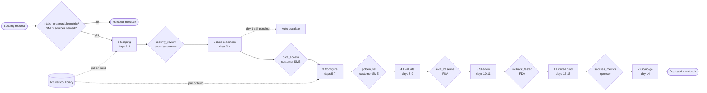
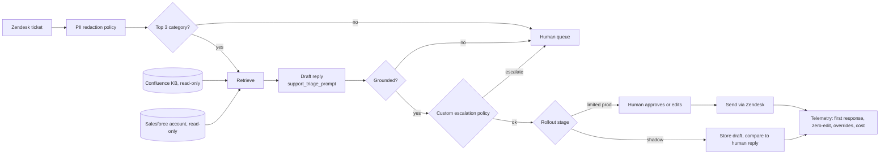

# Scoping Doc to Deployed Agent in Two Weeks

*Two weeks is fast enough to lose the customer's trust by cutting a corner, and slow enough to prove the process never needed one.*

◷ 24 min

This is not a software architecture question, even though it is asked in a system design round. It is an operating-model question, and the design is a state machine whose gates are code rather than trust. The page consolidates group G12 of `CASE_STUDY_INDEX.xlsx` into one read for the day before.

| Case in the group | What it contributes here |
|---|---|
| #9 Scoping Doc to Deployed Agent in Two Weeks, 60-minute whiteboard script (anchor) | Sections 1 to 11 and 14: framing, clarifying questions, gates, the library, risks, failure modes, scale, the close |
| #65 Northwind Logistics tier-1 support triage, Module 10 running case and the AI_Engineer interview script and code project | The fourteen-day table, the five metrics, the evidence-bar critique and the verified numbers; the delta is in section 13 |
| Self-drill on #9, Drill Add-ons tab | Section 15 |
| Module 10 doc 4 and the project's `docs/05` | Sections 6, 9 and 10 |

Sections and tables marked *(own construction)* were built for this page from the sources' arguments and are not in the sources verbatim. The triage agent's internals in section 4 are the largest such addition, because the sources design the delivery pipeline and name the agent without drawing it.

---

## 1. Frame the Round as an Operating-Model Question

Say the framing sentence in the first two minutes. It names the real test before any box is drawn.

> *"This isn't really a software architecture question — it's an operating-model question. Anyone can draw a pipeline with seven boxes. The signal is whether each box is a real, enforced gate or just a status someone reports honestly. I designed it so the gates are code, not trust."*

The naive answer is "work faster" or "hire more people", and that is the trap. Two weeks is only possible if most of the work already existed before the customer showed up. If every engagement starts from a blank page, two weeks is not a schedule, it is a wish. So speed has to be a side effect of reuse and hard gates, never a target chased by cutting corners.

That splits the answer into two questions, and a strong answer spends its time on both:

| QUESTION THE ROUND IS REALLY ASKING | WHAT ANSWERS IT |
|---|---|
| How do we know each stage is safe to leave, not just that time passed? | Gates: a named, checkable condition, signed off by the right role, never by the person closest to the work |
| How do we make two weeks achievable for a different customer every time? | A library of reusable assets that most of each stage is assembled from, not written |

A weak answer draws seven boxes labelled scoping, data, build, test and launch, then stops. That is a checklist, and checklists get skipped under deadline pressure. Restate the problem in one breath when asked:

> *"We're designing a repeatable delivery pipeline — not a one-off project plan — where speed comes from a reusable accelerator library, and safety comes from hard, role-gated checkpoints between stages, so that two weeks is an achievable outcome of the process, not a deadline we hope to hit by cutting corners."*

## 2. Ask the Five Questions That Change the Design

A clarifying question earns its minute only if a different answer changes a box. These five each do.

| QUESTION | WHAT CHANGES WITH THE ANSWER |
|---|---|
| Is "2 weeks" a hard SLA or a target? | Whether a gate failure means "slip the date" or "abort and re-scope" |
| Who owns the go/no-go decision: the FDA, the account team, or the customer? | Who the `success_metrics_met` gate's allowed role should be |
| What is genuinely reusable across customers versus inherently one-off? | Whether the library covers day 1 of a new engagement type, or only the 50th customer of a proven one |
| What happens if a hard gate fails outright, not late but genuinely? | Whether the engagement pauses or terminates when a security review finds a real blocker |
| Is this framework for one team or an org-wide standard? | Whether the library is a shared asset with ownership and versioning, or tribal knowledge |

Then scope out loud. Design the pipeline as a state machine with named, role-gated checkpoints and a reusable asset library behind each stage. Name the infrastructure-provisioning layer under "configure, do not code" as a real system in its own right, say what it must do, and move on.

## 3. Write the Success Metrics Before Day 1

A two-week clock started against something nobody can measure is worse than no clock. So the requirements of this case are the scoping document's contents, and intake refuses the engagement if they are missing. The running case is Northwind Logistics: a tier-1 support triage agent over Zendesk, Confluence and Salesforce.

**Success metrics, agreed at intake, in writing** (verbatim from `case_study.json`):

| Metric | How it is measured |
|---|---|
| Tier-1 ticket first-response time drops below 5 minutes for the top 3 ticket categories | Ticket timestamps |
| Agent-drafted replies are sent with no human edit on at least 60% of eligible tickets by week 4 | Edit history |

Both are measurable from data the customer already has, not "the agent should be helpful". Say that aloud: if a metric cannot be measured this cleanly, intake refuses rather than starting a clock against it.

**Functional requirements of the delivery framework.** Most are the source's; the MoSCoW split is *(own construction)*.

| Priority | Requirement |
|---|---|
| Must | Intake refuses a request with no measurable success metric, no named customer SME, or no named data sources; no engagement object is created |
| Must | Seven stages in fixed order, each blocked by a gate; no code path skips a stage |
| Must | Every gate is signed by an allowed role, with evidence, in order; deny overrides |
| Must | Every stage pulls assets from the accelerator library before building custom, and every custom build is logged |
| Must | Data access still pending on day 3 raises an escalation automatically |
| Must | Every sign-off attempt, stage move, escalation and pull is written to a replayable event log, allowed or denied |
| Must | Day 14 hands over a runbook, dashboards and a named owner |
| Should | Scope changes after intake go through the sponsor's authority (named, not yet built) |
| Should | Gate evidence has a required shape, a checklist rather than a sentence (section 10) |
| Could | A portfolio view across engagements per FDA |

**Functional requirements of the agent being delivered** *(own construction, from the case's metrics and library assets)*: classify incoming tier-1 tickets and handle the top 3 categories; draft a grounded reply from the Confluence knowledge base and the customer's Salesforce record; redact PII; escalate anything outside policy to a human; in shadow mode draft without sending, and in limited production send only after human approval.

**Non-functional requirements** *(own construction; figures are the source's)*:

| Attribute | Target | Why it is the bar |
|---|---|---|
| Time to deploy | Day 14, or a named gate explains why not | The promise is the process, not the date |
| Agent latency | First response under 5 minutes on the top 3 categories | The customer's own success metric |
| Quality at handover | Eval score clears the agreed baseline (0.83 vs 0.75 in the demo) | The number true when responsibility transfers |
| Safety of rollout | Rollback tested, not documented (verified under 2 min in the demo) | The first real action must not be the first unwatched one |
| Auditability | Every gate decision replayable with signer, role, evidence and reason | "Why did it stall at day 3?" has one answer |
| Data access | Read-only tokens, scoped to the engagement, revoked at handover | The delivery process holds live customer credentials |
| Repeatability | Accelerator reuse rate tracked per engagement (83% on Northwind) | The measure of productised versus bespoke |

**Constraints.** Two calendar weeks. A customer SME who has other work. Security review before any connection is made. Three of the six gates need a customer signature, so customer-side delay is the default risk.

**Non-goals, said out loud.** Real infrastructure provisioning under "configure, do not code". A running eval harness, since the Evaluate stage references one. More than one engagement at a time. A versioned rollback mechanism, since the gate attests that rollback was tested elsewhere. The honest limit sits above all four: some engagements should not be two weeks, and knowing which ones to reject is part of the framework.

## 4. Draw the Architecture End to End

Two systems sit on this board, and naming both is the move. The delivery pipeline is the answer. The triage agent is what the pipeline produces, and one diagram of it shows the gates are about something real.

Write the nouns before the boxes:

```
Engagement · Stage · Gate · Principal (role) · Artifact · AcceleratorAsset · Escalation · Metric
```

Narrate one engagement end to end before drawing:

> *"A scoping request comes in. Intake checks it's actually measurable and has an SME assigned, or refuses it outright. Accepted, it enters day 1 at the Scoping stage. Each of the next six stages is blocked behind a named gate, signed off only by the role authorized for that gate — the FDA cannot sign the security gate, no matter how senior. Every stage pulls what it needs from a reusable accelerator library before building anything custom. On day 14, if the agreed success metrics were actually met, the sponsor signs the go/no-go gate and the engagement deploys with a runbook and dashboards handed over."*

The source's pipeline, kept verbatim. Label every gate with who signs it.

```
 SCOPING ──> gate:security_review ──> DATA READY ──> gate:data_access ──> CONFIGURE
  (1-2)         (security reviewer)     (3-4)           (customer SME)      (5-7)
                                            |
                                   day 3, still pending?
                                   AUTO-ESCALATE
                                            v
      gate:golden_set ──> EVALUATE ──> gate:eval_baseline ──> SHADOW
       (customer SME)       (8-9)          (FDA)              (10-11)
                                                                   |
      gate:rollback_tested ──> LIMITED PROD ──> gate:success_metrics ──> GO/NO-GO
             (FDA)                (12-13)            (sponsor)              (14)
                                                                                |
                                                                          DEPLOYED
```

Both layers on one board, with the agent inside the pipeline *(own construction)*:

```
 ╔══════════════════ DELIVERY CONTROL PLANE (the framework) ═══════════════════════╗
 ║ scoping request ─> INTAKE ──fails──> REFUSED (no engagement, no clock)          ║
 ║                      │ passes                                                   ║
 ║                      v                                                          ║
 ║ ENGAGEMENT state ─> 7-stage state machine ─> 6 role-gated sign-offs ─> DEPLOYED ║
 ║   │   stage, day, gates, artifacts, pulls, escalations                          ║
 ║   ├─> ACCELERATOR LIBRARY: connectors · prompt templates · eval harness ·       ║
 ║   │     guardrail policies · dashboards   (pull, or build custom + log)         ║
 ║   ├─> ESCALATION CHECK: data access pending on day 3 -> raise once              ║
 ║   ├─> EVENT LOG: every attempt, allowed or denied, replayable                   ║
 ║   └─> METRICS: time-to-value · eval score · override rate · week-4 retention ·  ║
 ║         reuse rate                                                              ║
 ╚══════════════════════════════════╤═════════════════════════════════════════════╝
                                    │ configures and gates
 ╔══════════════════ THE DELIVERED AGENT (Northwind tier-1 triage) ════════════════╗
 ║ Zendesk ticket ─> webhook ─> PII redaction ─> classify (top 3 categories?)       ║
 ║                                                │ no -> route to human queue      ║
 ║                                                v yes                            ║
 ║   retrieve: Confluence KB (read-only) + Salesforce account (read-only)          ║
 ║                                                v                                ║
 ║   draft reply (support_triage_prompt) ─> groundedness check ─> escalation policy ║
 ║                                                v                                ║
 ║   SHADOW (days 10-11): store draft, human writes own reply, compare             ║
 ║   LIMITED PROD (12-13): human approves or edits, then send; rollback tested      ║
 ║                                                v                                ║
 ║   telemetry: first-response time · zero-edit sends · override rate · cost       ║
 ╚═════════════════════════════════════════════════════════════════════════════════╝
```

The delivery pipeline for viewers that render Mermaid, compressed from the source's state machine:



The delivered agent *(own construction)*:



Read the components in dependency order. The pipeline rows are the source's; the agent rows and the failure column are own construction.

| Component | Job | What goes wrong without it |
|---|---|---|
| Intake validation | Refuses unmeasurable, SME-less or source-less requests | A clock starts against a goal nobody can prove |
| Engagement state | The one piece of mutable state, threaded through every stage | Status lives in five trackers and disagrees |
| Stage state machine (`advance_stage`) | Moves only to the immediate next stage | A stage is skipped under deadline pressure |
| Gate engine (`sign_off`) | Role, evidence and order checks, deny overrides | The FDA certifies their own security review |
| Escalation check | Raises data-access delay on day 3, once, logged | The delay is noticed on day 6 |
| Accelerator library (`pull_or_build`) | Pulls a named asset or logs a custom build | Week two turns into bespoke code |
| Event log | Every attempt, allowed or denied | "It's taking longer than expected" |
| Metrics | Computed on demand from the engagement's history | Success is argued, not read |
| Connectors (Zendesk, Confluence, Salesforce) | Read-only ingestion from the customer's systems | Data readiness slips; credentials sprawl |
| PII redaction policy | Strips personal data before the model sees it | Customer data leaks into prompts and logs |
| Triage classifier | Keeps the agent to the top 3 categories | The agent answers what it was never evaluated on |
| Draft plus groundedness check | Reply built from retrieved evidence, judged before a human sees it | A fluent, wrong reply reaches a customer |
| Custom escalation policy | Northwind's own rules for what goes to a human | The one custom asset is skipped because it is custom |
| Human approval step | The override signal in shadow and limited production | Trust is assumed rather than earned |
| Handover bundle | Runbook, dashboards, named owner | Day 15 has nobody to call |

Point at two lines while the diagram is up. "This is deliberately the same decision shape as the RAG project's ABAC engine: a named rule, a role check, deny overrides, and an explicit reason." And "there is no code path that jumps a stage, the same way the RAG project has no code path that queries the vector store without the ACL filter."

## 5. Walk the Fourteen Days in Order

The order is not optional. Configuring against unconnected data fails, evaluating against an unsigned golden set proves nothing, and limited production without a tested undo is a gamble. So transitions are a state machine with hard gates, not a checklist.

| Days | Stage | What has to be true to leave it | Northwind evidence in the demo | Signed by |
|---|---|---|---|---|
| 0 | Intake | Measurable metrics, a named SME, named sources; otherwise refused | `case_study.json` accepted | — |
| 1–2 | Scoping and qualification | Metrics written down and measurable; SME assigned; security review started | `scoping_questionnaire.pdf`, `success_metrics_signoff.pdf`; Zendesk and Confluence connectors pulled; "SEC-2026-0142 review report, no blocking findings" | Security reviewer |
| 3–4 | Data readiness | Sources connected; access live and verified, not "requested" | "Read-only Zendesk/Confluence/Salesforce tokens verified live"; escalation check runs on day 3 | Customer SME |
| 5–7 | Configure, do not code | Assembled from the library and configured for this customer | Triage prompt, golden-set harness, PII policy pulled; Northwind escalation policy built custom; `golden_set_v1.json` | Customer SME ("golden_set_v1.json reviewed, 40 cases approved") |
| 8–9 | Evaluate and iterate | Golden set signed off as representative; baseline clears the bar | "eval_baseline_report.pdf - 0.83 vs 0.75 agreed baseline" | FDA |
| 10–11 | Shadow mode | Agent sees real traffic, decides, takes no action; humans compare | 5 shadow approvals, 2 overridden; "rollback_runbook.md - tested in staging, verified <2min" | FDA |
| 12–13 | Limited production | Agent acts for real with a human approving, and a tested rollback | 6 approvals, 1 overridden; cumulative override rate 0.27 | — |
| 14 | Go/no-go and handover | The day-1 metric was met; runbook, dashboards, owner handed over | "Week-2 metrics: first-response 4m12s, 63% zero-edit sends"; `handover_runbook.md`, `dashboards_live.url` | Sponsor |

The table's last two evidence columns come from `scripts/run_engagement_demo.py`. Shadow mode and limited production are the same two-step trust ladder as Module 05's `SHADOW` and `LIVE`. Never let a system's first real action also be the first time nobody is watching.

## 6. Make Every Gate a Decision With a Named Authority

A checkbox is a status. A gate is a decision with a named authority behind it.

```
  Naive version:  "security review complete: [x]"     <- a checkbox anyone can tick
  This version:   sign_off(gate, signer, evidence)
                    signer.role must be in gate.allowed_roles   <- deny overrides
                    evidence must be non-empty                  <- "approved" is not evidence
                    every earlier gate must already be PASSED   <- no signing out of order
```

| Gate | Blocks entry to | Signed by |
|---|---|---|
| `security_review_passed` | Data readiness | Security reviewer |
| `data_access_granted` | Configure | Customer SME |
| `golden_set_signed_off` | Evaluate | Customer SME |
| `eval_baseline_met` | Shadow mode | Forward Deployed Architect |
| `rollback_tested` | Limited production | Forward Deployed Architect |
| `success_metrics_met` | Go/no-go, deploy | Executive sponsor |

Three ordered deny rules decide every sign-off, and every attempt is logged, allowed or denied.

| # | Rule | Denies when |
|---|---|---|
| 1 | `wrong_role` | The signer's role is not in the gate's `allowed_roles`, with no exception for seniority |
| 2 | `no_evidence` | An approval has no artefact behind it |
| 3 | `prior_gate_incomplete` | An earlier-stage gate has not passed |

Seniority is not an override, and the reason is the same one that keeps an LLM from enforcing its own access control. The person closest to the work is not automatically the person authorised to certify it is safe.

Two pairs of gates sound alike and check different things, which makes them a favourite follow-up. `security_review_passed` asks whether it is safe to touch this customer's systems at all. `data_access_granted` asks whether the agreed sources actually connected. One is a go-ahead; the other confirms the thing done afterwards worked. `golden_set_signed_off` certifies the exam is fair, judged by the SME who knows the business. `eval_baseline_met` certifies the agent passed it, judged by the FDA. A representative set with a failing score, or a rigorous score against a bad set, both correctly fail.

The Northwind stall answers "are the gates real?" in three rows:

| Who is asking | What actually happened |
|---|---|
| The FDA, wanting to sign off the security gate themselves | Denied, `wrong_role`. Only a security reviewer can sign that gate, however senior the FDA is |
| The customer SME, signing the data-access gate with "looks good" as evidence | Denied, `no_evidence`. An approval with no artefact behind it is not a sign-off |
| Anyone, on day 3, with data access still not granted | The system escalated automatically; nobody had to notice and raise it |

## 7. Refuse at Intake Rather Than Start a Clock

Immeasurable-metric refusal is the cheapest, highest-signal move in the design, so say it before drawing a single box. Intake raises `ScopingRefused` and creates no engagement at all. It is the delivery version of Module 04's refusal to index a document with no usable ACL.

The SME requirement is refused at intake for a structural reason. Three of the six gates need an SME signature. An engagement with no SME cannot finish, and it is better to know on day 0 than on day 8.

The trade-off has a revisit condition. A strategic customer may be accepted despite the risk. Then intake needs an explicit override path with its own sign-off, never a silent bypass.

## 8. Turn Reuse Into a Number

"Productised process, not bespoke heroics" is the thesis of this problem type, and a thesis on a slide proves nothing. So every asset a stage needs is either pulled from the library or built custom and logged, with no third option.

```
  Every stage needs an asset (a connector, a prompt template, a guardrail policy...)
  Pull it from the library?  -> reused = true
  Not there yet?             -> build it custom, reused = false, LOGGED

  accelerator_reuse_rate = reused pulls / total pulls
```

The library holds connectors, prompt templates, an eval harness, guardrail policies and dashboard templates. By name: `zendesk_connector`, `confluence_connector`, `salesforce_connector`, `support_triage_prompt`, `groundedness_prompt`, `golden_set_harness` ("recall@k / MRR / groundedness / leak-rate harness"), `pii_redaction_policy`, `destructive_action_gate`, `eval_baseline_dashboard`, `cost_attribution_dashboard`.

On Northwind the rate is 83%: 5 of 6 assets came straight from the library, and one guardrail policy was custom. A rising custom-build count is the early signal that two weeks is about to slip. Tracked across engagements, the ratio says whether the framework works or is quietly turning bespoke again.

Be honest about what the library is not. The entries are named assets, not the connector code or the eval harness. The real harness exists one project over, in the RAG platform, and wiring the Evaluate stage to call it is on the punch list. The gate mechanism is real; the number behind one piece of evidence is not yet.

## 9. Make Risk Mitigations Checks, Not Reminders

A reminder fires only if someone is watching. A check fires anyway, and lands in the permanent event log.

| Risk | Mitigation | How it is enforced | Built? |
|---|---|---|---|
| Data access delays | "Start day 1, escalate day 3" | `check_escalation_triggers()` raises it once if `data_access_granted` is pending on day 3 | Yes |
| Scope creep | Change-control on the signed scope | A `request_scope_change()` requiring the sponsor role, reusing `sign_off()`'s pattern | No, sized as low effort |
| Unmeasurable success criteria | Refuse to start | `intake()` raises `ScopingRefused` | Yes |
| No customer SME | Contractual prerequisite | Also enforced at `intake()` | Yes |

> *"I'd rather show you three of four real and name the honest gap on the fourth than claim all four and get caught on it under a follow-up."*

## 10. Raise the Evidence Bar Behind Each Signature

A gate can be structurally real and still be a rubber stamp. The right role must sign, which is a genuine control. But "does the gate exist" and "what counts as sufficient evidence" are separate questions.

| What a thorough security review should include | Does a generic "security review passed" checkbox prove it happened? |
|---|---|
| Basic output validation | No, a quality check, not a security check |
| Retrieval and tool-selection accuracy | No |
| Task success on real test cases | No, that is the evaluation gate |
| **Adversarial testing: prompt injection, permission-boundary probes** | **This is what a security review should mean, and free-text evidence cannot prove it happened** |
| Ongoing production monitoring | No, continuous, not a gate |

The fix is a checklist, not a sentence. Adversarial testing done, permission boundaries tested and data agreements signed must all be present before the gate passes. That is intake's discipline applied to what a signature attests to.

Three more gaps sit in the delivery process itself, easy to miss because attention is on what gets deployed. The process holds live customer credentials in two windows: when sources first connect, and when the agent first runs against the real environment. Those credentials need a vault, engagement scope and revocation at handover. The golden set built with the SME often contains real customer data, so it follows that customer's sensitivity tier rather than one default. And many engagements at once is a tenancy decision, not only a capacity one: are two customers' gate evidence and test sets separated by a tag or physically?

> *"A gate proving access was granted proves a human attested it's live. It doesn't prove the credentials enabling that access were ever handled safely during the engagement — stored in a vault, scoped only to what this engagement needs, revoked cleanly at handover."*

## 11. Treat a Stalled Engagement as a Visible Outcome

The framework does not guarantee every engagement deploys in 14 days. It guarantees that when one does not, everyone knows which gate stopped it and why.

| Fails | Behaviour |
|---|---|
| A hard gate genuinely fails, not late but denied | The engagement stays at its current stage; the failure is a first-class event, not a silent stall |
| The wrong person attempts a sign-off | Denied, logged, state unchanged; no partial progress |
| The golden set never gets customer sign-off | Evaluate is blocked; a customer-side failure the framework surfaces rather than routes around |
| Success metrics are not met by day 14 | The go/no-go gate does not pass; "no-go" is a legitimate outcome |

Scale here is not ten million chunks. It is one FDA running six engagements at once. The state machine does not change with portfolio size; capacity does. Gates start queueing behind a person's calendar rather than the customer. Designing that needs real engagement-duration data first, the same way embedding-cache hit rates need real query logs.

## 12. Read the Northwind Numbers Honestly

Five metrics are computed on demand from the engagement's own history, never tracked separately.

| Metric | What it tells | Northwind demo |
|---|---|---|
| Time-to-first-value | How long until the customer saw anything real | 1 day |
| Eval score at handover | The number true when responsibility transferred | 0.83 |
| Human-approval override rate | Falling means trust earned; flat means not ready for less supervision | 0.27 |
| Week-4 retention | Whether the deployed thing is still used a month later | `None` until recorded, never a fake `0.0` |
| Accelerator reuse rate | Productised process versus bespoke heroics | 0.83 |

The run also shows 6 of 6 gates passed, `deployed True` on day 14, and one escalation, auto-raised on day 3 and resolved when the gate passed. The project has 17 gate-enforcement tests, deterministic, with no LLM anywhere.

Read these as one engagement, run once. The eval score and time-to-value are demo-scripted, not measured on a real delivery. What is proven is that the pipeline enforces its own gates. Saying so before the interviewer asks is itself the signal.

## 13. Read #65 as the Same Case in Prose

#65 is not a second design. It is the anchor's Northwind running case, written three ways, and each adds something to rehearse.

| Source in #65 | What it adds beyond the anchor script |
|---|---|
| Module 10 doc 3, Scoping to Production in Two Weeks | The fourteen-day table with exit conditions, the trust-ladder link to Module 05, the one-breath restatement |
| `project/data/case_study.json` | The two success metrics verbatim, the three connectors, the SME id |
| AI_Engineer `INTERVIEW_SCRIPT.md` | Identical to the anchor; the anchor was lifted from it, so reading one covers both |
| The code project (`run_engagement_demo.py`, `demo_gate_failure.py`, 17 tests) | The evidence strings and figures in section 5, and the negative-control demo |
| Module 10 doc 4 and `docs/05` | The five metrics, the two gate pairs, the evidence-bar critique, credentials, residency and tenancy |

The negative-control demo is the most persuasive artefact in the group. It shows intake refusing an unmeasurable request, then three denials: `wrong_role`, `no_evidence` and `prior_gate_incomplete`. It then attempts a stage skip that has no code path, and the day-3 escalation fires by itself. A demo of things being stopped proves more than a demo of things working.

## 14. Deliver It in Sixty Minutes

Write the time budget in the corner of the board.

| Minutes | Phase |
|---|---|
| 0–8 | Clarify and scope |
| 8–15 | High-level pipeline |
| 15–35 | Deep dive: gates and the reuse system |
| 35–45 | Cross-cutting: risk mitigation, metrics, CI/CD parallels |
| 45–55 | Failure modes and scale, portfolio not chunks |
| 55–60 | Close: trade-offs and what to build first |

Announce the risk before the deep dive. Seven stages in order is not a hard problem. The hard part is making "done" mean something checkable instead of "time passed", and making the library real enough that week two does not turn into bespoke code.

Summarise in three sentences at minute 55:

> *"A seven-stage pipeline where every transition is blocked behind a named, role-gated decision, not a status field. Reusable assets are pulled before anything is custom-built, and that ratio is tracked as the actual measure of whether the process is repeatable. Two of four named risk mitigations are automatic checks in code, not reminders on a tracker — and I can tell you exactly which two aren't, yet."*

The source's summary says two of four, while its own risk table marks three of four as built. Quote the table: the day-3 escalation, unmeasurable-metric refusal and SME refusal are built, and change-control is not.

| Decision | Chose | Would revisit if |
|---|---|---|
| Role-gated sign-off over self-certification | Six named gates, six named authorities | A single-person delivery team where role separation is impossible; gates compress, they do not disappear |
| Hard refusal at intake over "start and hope" | Refuse unmeasurable or SME-less requests | A strategic customer the business accepts anyway; add an explicit override with its own sign-off |
| Automatic escalation over manual tracking | Day-3 auto-escalate on data access | Mitigations multiply and a dashboard is clearer than N checks; then it becomes a rules engine |

Close forward-deployed. Week one of an internal rollout is not all seven stages. Pick the two gates most often skipped under deadline pressure, the golden-set sign-off and the rollback test, and make only those structurally unskippable. That proves gates as code change behaviour before anyone argues about the other five.

The lines that carry the round:

1. "A gate is a decision with a named authority behind it, not a checkbox anyone can tick."
2. "There's no code path that skips a stage — the same way the RAG project has no code path that skips the ACL filter."
3. "Refuse to start an engagement with no measurable success metric — the two-week clock is a consequence of readiness, not a target."
4. "The reuse-vs-custom ratio is the actual measure of 'productised process,' not a slide bullet."
5. "An automatic escalation on day 3 beats a reminder on a tracker — it fires whether anyone was watching or not."
6. "A 'no-go' at day 14 is a legitimate outcome, not a failure of the framework."
7. "Some engagements shouldn't be two weeks — knowing which to reject is part of the design, not a gap in it."

Questions to ask them: what the accelerator library looks like today, whether code, templates or tribal knowledge; where the two-week target actually broke and at which gate; who owns go/no-go in practice; and how many engagements one Forward Deployed Architect carries at once.

## 15. Answer the Pilot-Spend Pivot in Ten Minutes

The pivot after a good answer is "who pays for the pilot, and what stops it running away?" There is no playbook drill for this group, so the answer is the self-drill card.

| | |
|---|---|
| Dominant driver | Evaluation and logging overhead during the pilot, plus an unbounded agent in front of real tickets |
| Cheapest lever first | Agree cost per resolved ticket at intake alongside the quality metrics; sampled evals not full-corpus; step and token caps from day one; budget alert per pilot |
| Metric that proves it | Cost per resolved ticket vs the intake baseline; eval spend per day; P95 |
| Do not | Instrument cost after the pilot proves value |
| 60-second line | Cost is a success metric agreed at intake, not a cleanup after go-live. Cap the agent, sample the evals, and report cost per resolved ticket in the same dashboard as quality. |

The card fits the framework without a new box *(own construction)*. Cost per resolved ticket becomes a third success metric at intake, so the refusal rule covers it: no baseline, no clock. `cost_attribution_dashboard` is already in the library, so it is pulled on day 1, not built on day 13. And `success_metrics_met` then certifies cost alongside first-response time and zero-edit sends.

Every strong cost answer follows four verbs in order. Measure cost per resolved ticket from day 1. Route only the top 3 categories to the agent. Bound steps, tokens and eval volume. Cache safely, never across customers.

---

## Key Takeaways

- The round is an operating-model question, and speed is a side effect of reuse and hard gates.
- Five clarifying questions each change a box: SLA or target, go/no-go owner, reusability, hard failure, scope of adoption.
- The requirements are the scoping document: two measurable metrics, a named SME, named sources, constraints and stated non-goals.
- Two systems share the board: the gated delivery pipeline, and the triage agent it produces.
- Fourteen days run in a fixed order, and each stage exits only when a checkable thing is true.
- Every gate is a decision by an allowed role, with evidence, in order, and seniority is not an override.
- Intake refuses rather than starting a clock against something unmeasurable.
- The accelerator reuse rate, 83% on Northwind, turns "productised" into a number.
- Risk mitigations are checks in code, with change-control named as the honest gap.
- A real gate still needs an evidence bar with a required shape, and the delivery process meets the same security bar as the product.
- A stalled engagement names its gate, and scale means FDA capacity, not data volume.
- The Northwind numbers are one engagement run once; the proof is that the gates enforce themselves.
- #65 is the anchor's running case in prose, code and verified output.
- The hour goes to gates and reuse, and the close makes two gates unskippable first.
- Pilot cost is a success metric agreed at intake, capped, sampled and reported beside quality.

## Check Yourself

1. **Why is "work faster" the trap?** Two weeks is achievable only if most of the work existed before the customer arrived; speed has to come from the library and the gates.
2. **Name the seven stages, their days, and what blocks each.** Scoping 1–2, data readiness 3–4, configure 5–7, evaluate 8–9, shadow 10–11, limited production 12–13, go/no-go 14; blocked in turn by security review, data access, golden set, eval baseline, rollback tested, success metrics.
3. **State the three deny rules.** `wrong_role`, `no_evidence`, `prior_gate_incomplete`, deny overriding, every attempt logged.
4. **What separates `golden_set_signed_off` from `eval_baseline_met`?** The first certifies the test is representative, signed by the SME; the second certifies the agent passed it, signed by the FDA.
5. **Why refuse at intake instead of warning?** A clock against an unmeasurable goal is worse than no clock, and an engagement without an SME cannot pass three of its six gates.
6. **What does the reuse rate measure, and what is Northwind's?** Reused pulls over total pulls; 83%, five of six, with one custom guardrail policy.
7. **How can a structurally real gate still be a rubber stamp?** Free-text evidence cannot prove adversarial testing happened; require a checklist.
8. **What breaks first at scale?** FDA capacity, with gates queueing behind a calendar rather than the customer.
9. **Which risk mitigation is not built?** Scope-creep change-control, which would reuse `sign_off()` with the sponsor role.
10. **What is the sixty-second pilot-spend answer?** Cost is a success metric agreed at intake: cap the agent, sample the evals, report cost per resolved ticket beside quality.

## References

All paths are relative to `06_Interview_Prep/`.

| Section | Source |
|---|---|
| 1, 2, 4, 6, 7, 8, 9, 11, 14 | `Handbook/09_AI_System_Design_Casebook/whiteboard_scripts/04_Scoping_Doc_To_Deployed_Agent_In_Two_Weeks.md` (the anchor, #9) |
| 1, 3, 4, 5, 8 | `Handbook/10_FDE_Delivery_Operating_Model/03_Scoping_To_Production_In_Two_Weeks.md` (#65) |
| 3 | `Handbook/10_FDE_Delivery_Operating_Model/project/data/case_study.json` (#65) |
| 3, 5, 8, 12, 13 | `AI_Engineer/Delivery Framework from Scoping to Delivery/` — `INTERVIEW_SCRIPT.md`, `README.md`, `scripts/run_engagement_demo.py`, `src/delivery_framework/accelerators.py` (#65) |
| 6, 9, 10, 12 | `Handbook/10_FDE_Delivery_Operating_Model/04_Gates_Risks_Metrics.md`; `AI_Engineer/Delivery Framework from Scoping to Delivery/docs/05-security-gate-depth-and-tenant-scale.md` |
| 15 | `CASE_STUDY_INDEX.xlsx`, Drill Add-ons tab, self-drill row for #9 |
| 3 (MoSCoW split, agent requirements, non-functional table), 4 (triage agent diagrams, component failure column), 15 (fit to the framework), and every item marked own construction | Built for this page from the sources' arguments; not source material |
