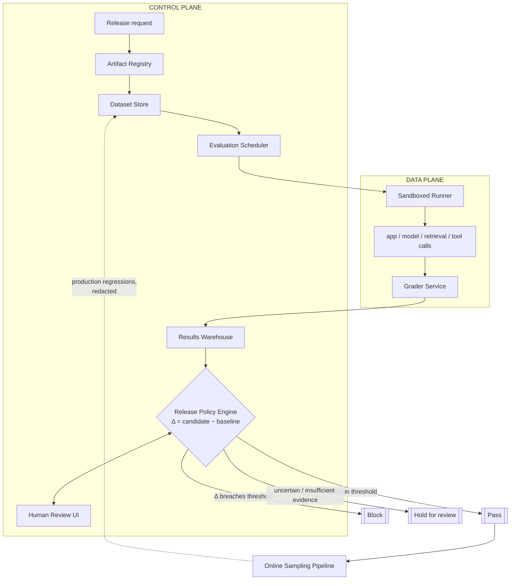

# Evaluation and Release Gating for Thirty AI Applications

*A gate strict enough to stop a bad release is slow enough that teams route around it.*

◷ 34 min

An evaluation platform is not a dashboard of scores. It is a controlled decision about whether one change is safe to ship. This page consolidates group G13 of `CASE_STUDY_INDEX.xlsx` into one read for the day before. The anchor design comes first. The neighbouring prompts, the incident and the cost pivot then come as deltas on the same gate.

| Case in the group | What it contributes here |
|---|---|
| #20 LLM Evaluation and Release-Gating Platform (anchor, book ch 9) | Sections 1 to 8 and 11 to 13: framing, requirements, sizing, architecture, decision logic, graders, failure handling, rollout, delivery |
| #91 Incident: model regression missed by a weak evaluation suite (sales copilot) | Section 9: the incident walked through end to end |
| #52 OpenAI Q8, The Model Got Worse After an Upgrade | Section 10: the gate applied retroactively |
| #55 OpenAI Q11, Build an Evaluation Strategy for an AI Application | Section 10: the gate built from nothing |
| #120 Costs are fine but the eval bill tripled | Section 14 |
| Self-drill on #20, Drill Add-ons tab | Section 14 |

Sections and tables marked *(own construction)* were built for this page from the sources' arguments. They are not in the sources verbatim.

---

## 1. Restate the Ask as a Release Decision

The customer opens with one sentence. "We need one platform that lets 30 AI applications decide whether prompt, model, retrieval, or tool changes are safe to release." The first job is to restate it without smuggling in a design.

A dashboard answers "what are the scores?" Nobody is obliged to act on that. The platform exists to answer "can this change ship?", and that question has an owner, a threshold and a record. So the goal is not the platform. The goal is making quality, safety, latency and cost regressions visible before and after deployment.

| Restatement | Why it is weak or strong |
|---|---|
| Weak: "Build an evaluation dashboard with test runs, scorecards, and approvals." | Feature-first. It never pins a baseline, never says what blocks a release, never names who may override |
| Strong: "Build a release-gating system that helps teams compare a candidate AI change against the current baseline, detect quality, safety, latency, and cost regressions, and record the evidence behind a release decision." | Keeps the outcome in view. A dashboard becomes one possible interface to a controlled decision process |

Four stakeholders hire the platform, and each asks a different question. Failing to separate them produces a system that is technically impressive but operationally unusable.

| Stakeholder | The question they hire the platform to answer |
|---|---|
| AI application engineer | "Did my change worsen behavior?" |
| Domain evaluator | "What should I score and why?" |
| Safety lead | "Is this release safe enough for the risk profile?" |
| Release manager | "Can I approve this with evidence?" |

Ask the questions that change the design most. The six-question tree is worth reciting in order.

| # | Question | What the answer decides |
|---|---|---|
| 1 | Which application types are in scope, and which are safety- or revenue-critical? | Whether a failed check blocks or warns; whether human review is mandatory |
| 2 | Are we gating only pre-release changes, or also monitoring live releases? | Offline suites only, or shadow traffic, canaries and sampled production too |
| 3 | What labels exist today, who reviews hard cases, and how often do they disagree? | Deterministic scoring, model graders, or human routing; disagreement kept as a signal |
| 4 | How frequently do teams release, and what confidence level is required to ship? | Fast smoke gates versus slow, rich review |
| 5 | What parts of a trace are sensitive, and what must be redacted or isolated? | Redaction, tenant isolation, retention, who may inspect failures |
| 6 | What regression threshold blocks a release versus only opening a review? | Whether the gate is credible at all |

Two more come from the answer key: what counts as a release, and who may override a failed gate and how that is recorded. An audited override forces immutable records and role-based controls. Shared evaluation data forces tenancy boundaries.

When the interviewer stays vague, protect the riskiest assumption. Assume the gate should block uncertain, high-impact changes and escalate them to a human. False passes are more dangerous than false blocks for high-impact applications.

> *"I'd frame this as a controlled decision process rather than a dashboard: compare a candidate against a pinned baseline, detect quality, safety, latency and cost regressions, and record the evidence behind the decision."*

## 2. State Requirements as Testable Constraints

A requirement that cannot fail a test is a preference. "Fast gate" is a preference. "p95 run duration under 20 minutes in the release window" is a constraint, and only the constraint shapes the architecture.

The functional requirements are what make this a gate rather than a dashboard. Split them with MoSCoW so the first release is the smallest trustworthy path *(the split is own construction; the items are the sources')*.

The must-haves are six. A release owner submits a candidate change, and the platform compares it to a pinned baseline and returns pass, block or hold with evidence. Datasets, prompts, models, tools and graders are versioned, because versioning is the only way to reproduce a decision later. Both deterministic and probabilistic evaluations run, since some checks must be stable and others depend on rubric judgement. Every candidate is compared against a pinned production baseline, never reported as an absolute score. Release policies are enforced per application, which is what turns analysis into action. Human review is supported, and reviewer disagreement is recorded as a first-class signal rather than discarded as noise.

The should-haves follow once the gate is trusted. Privacy-safe production failures are sampled back into future suites so the test set evolves with the product. Online sampling watches live or shadow traffic after rollout. Latency and cost gates sit beside quality and safety.

The first version deliberately excludes six things. Automated fine-tuning or prompt optimisation. A full legal or compliance sign-off workflow. Open-ended notebook experimentation, which weakens reproducibility. Every metric for every application on day one. Cross-tenant sharing of datasets or graders. Custom visualisation of every trace field.

| Constraint | Stated so it can be tested |
|---|---|
| Latency | The gate finishes inside the release window. p95 run duration beyond about 20 minutes turns a gate into a blocker |
| Availability | Peak matters more than average. Thirty teams releasing in the same business hour can overwhelm a daily-average design |
| Reproducibility | Same dataset, prompt version, model version, tool config and grader version recreate the same evaluation context |
| Lineage | Every result traces back to its inputs and version history |
| Statistical honesty | No overstating tiny differences, no cherry-picked runs, no treating noisy scores as precise |
| Security | The sandboxed runner is hostile-adjacent: timeouts, egress limits, secrets scoping, per-run concurrency caps |
| Isolation | One application's traces, labels and evaluations never leak into another tenant's workspace |
| Reliability | Fail closed on release decisions when evidence is missing. Never approve on an incomplete or unvalidated run |
| Cost | At roughly 3,000,000 test-case executions a day, tier the suites. If every release costs a fortune, teams route around the gate |

Every requirement then needs an owner in the architecture. If a requirement has no component owner, the design is incomplete.

| Requirement | Component responsibility |
|---|---|
| Version datasets, prompts, models, tools, graders | Registry and immutable version store |
| Run deterministic and probabilistic evaluations | Evaluation runner and scoring service |
| Compare candidates with production baselines | Baseline comparator and diff engine |
| Support human review and disagreement | Review queue, adjudication workflow, audit log |
| Enforce release policies | Policy engine and release gate |
| Sample privacy-safe production failures into future tests | Trace ingestion, redaction, curation pipeline |
| Reproducible runs | Run manifests, locked versions, execution logs |
| Grader and dataset lineage | Provenance graph and metadata store |
| Statistically honest comparisons | Reporting layer with uncertainty-aware summaries |
| Tenant and data isolation | Authz boundaries, workspace partitioning, encryption controls |

## 3. Size the Gate Against the Release Window

The whiteboard version is a queue, a pool of workers, a results database and a dashboard. It works at average load and fails when the release train tightens. Sizing is what turns it into a design.

The headline workload is not "30 apps". It is 30 applications × 20 candidate releases a day = 600 candidate evaluations a day. With 5,000 test cases each, that is 3,000,000 test-case executions a day. Each case needs 2–3 model or grader calls at minimum and 3–5 more realistically. So the platform makes roughly 6,000,000–15,000,000 model or evaluator calls a day.

| Window | Calls/sec needed | Approx. workers at 2.5 calls/sec each | Practical implication |
|---|---|---|---|
| 24-hour batch | 69–174 | 28–70 | Shared elastic pool is sufficient if backlog is allowed |
| 6-hour release gate | 278–694 | 112–278 | Requires aggressive parallelism, admission control, and prioritization |

The worker figure assumes one call every 400 ms, about 2.5 calls a second per worker at full utilisation. Real deployments add headroom for retries, tail latency and bursts.

Average load answers "can we survive the day?" Peak load answers "can we survive the release window?" Those are different questions. A modest daily average still overwhelms the system if many applications submit in the same hour. So the pool is shared and elastic, with per-tenant quotas and admission control, so one application cannot starve the rest.

| Scenario | Candidate evaluations/day | Test-case executions/day | Design pressure |
|---|---|---|---|
| Current | 600 | 3,000,000 | Queue depth, worker pool, storage writes |
| 10x growth | 6,000 | 30,000,000 | Throughput, cost, sharding, retention |

At current scale the limit is evaluator concurrency. At 10x, storage, retention and human-review routing dominate.

Cache immutable inputs, never the behaviour being measured. Test definitions, baseline outputs, corpus snapshots, rubric and prompt templates and precomputed embeddings are safe to cache when versioned. A cached stochastic judgement would hide exactly the variance the gate is meant to measure.

> *"I cache immutable inputs and expensive shared fixtures, not the stochastic judgment itself."*

## 4. Draw the Architecture End to End

The organising rule is a split. The control plane decides what to evaluate, and the data plane executes it. A slow or failing runner therefore cannot make policy nondeterministic. Candidate selection, enforcement and escalation stay deterministic however noisy the execution is.

The planes and lanes as one picture *(own construction from the sources' component map)*:

```
 ╔════════════════════════ CONTROL PLANE (decides what to evaluate) ════════════════════════╗
 ║                                                                                          ║
 ║  Release request ──► Artifact Registry ──► Dataset Store ──► Evaluation Scheduler         ║
 ║  (candidate +        (immutable prompt,    (suites, labels,   (fan-out, per-tenant        ║
 ║   baseline ref)       model, retrieval,     rubrics, case      quotas, admission control, ║
 ║                       tools, seed, hash)    sensitivity)       backpressure)              ║
 ║                                                                     │                     ║
 ║  Human Review UI ◄──► Release Policy Engine ◄── Results Warehouse   │                     ║
 ║  (adjudication,       (Δ vs thresholds;         (validated runs     │                     ║
 ║   overrides =          pass / block / hold;      only; audit)       │                     ║
 ║   policy input)        fails closed)                 ▲              │                     ║
 ╚══════════════════════════════════════════════════════╪══════════════╪═════════════════════╝
                                                        │              ▼
 ╔════════════════════ DATA PLANE (executes; untrusted boundary) ═══════════════════════════╗
 ║                                                                                          ║
 ║  Sandboxed Runner ──► app / model / retrieval / tool calls ──► Grader Service ───────────╫──► warehouse
 ║  (timeouts, egress limits,                                     (task success, safety,     ║
 ║   secrets scoping, concurrency caps)                            latency, cost; escalates) ║
 ╚══════════════════════════════════════════════════════════════════════════════════════════╝
                                                        ▲
 Online Sampling Pipeline (live / shadow traffic, redacted) ── new failure cases ──► Dataset Store
```

The same flow with the decision branches, from the answer key and the tutorial:



Read the components in the order a release travels through them. The first four columns are the tutorial's; the failure column is own construction, drawn from the tutorial's failure-policy table.

| Component | Primary responsibility | State ownership | Fails how |
|---|---|---|---|
| Artifact Registry | Store immutable candidate definitions and baseline references | System of record for candidate config | Closed: an unresolvable artifact means no run |
| Dataset Store | Store suites, labels, rubrics, and scenario metadata | System of record for eval inputs | Closed: a missing suite means no run |
| Evaluation Scheduler | Select suites, fan out work, enforce queueing and concurrency | Job state / run orchestration state | Degrades: sheds noncritical work, lowers concurrency |
| Sandboxed Runner | Execute prompts, tool calls, and model calls under isolation | Ephemeral run state | Retries idempotently with the same run ID |
| Grader Service | Score task success, safety, latency, and cost | Derived scoring state | Closed for release decisions on timeout; retry for analysis runs |
| Human Review UI | Resolve ambiguous or disputed cases | Review decisions and annotations | Holds the release; nothing auto-approves |
| Results Warehouse | Persist run-level and aggregate outcomes | System of record for validated results | Closed: evidence store down means block and escalate |
| Release Policy Engine | Decide pass, block, or hold for review | Policy decision state | Closed: reads only completed, validated records |
| Online Sampling Pipeline | Sample live or shadow traffic post-release | Monitoring / sampling state | Degrades: dashboards lag, the gate keeps running |

Point at three boundaries while the diagram is up. The registry and dataset store are strongly consistent, so a run always points at fixed inputs. The warehouse can be eventually consistent for analytics, but the final gate reads only completed, validated records. And the runner is the trust boundary: prompts, retrieved documents and uploaded cases are adversarial until proven otherwise.

The happy path runs in ten steps. A release engineer submits an immutable candidate to the registry. The registry pins the exact prompt, model, retrieval, tool, seed and baseline identifiers. The scheduler selects the application's suite, partitions work by tenant and enforces concurrency limits. The runner executes cases in isolation with controlled seeds. The grader scores correctness, safety, latency and cost. The warehouse stores run-level and aggregate results. The policy engine compares candidate metrics and confidence intervals with the pinned baseline. Ambiguous cases route to human review. The decision is issued as pass, block or hold, with reasons attached to the release record.

Each step answers a different customer question. The registry answers "what exactly changed?" The suite answers "what did we test?" The runner answers "under what conditions?" The grader answers "how did it perform?" The policy engine answers "can we ship?"

The MVP is the smallest trustworthy path from registration to decision: registry, dataset store, async scheduler, sandboxed runner, grader, warehouse, and a policy engine that can pass or block. Richer human workflow, adaptive suite selection, online sampling, multi-region execution and score calibration come later.

## 5. Pin Every Input and Compare Against a Baseline

A score means nothing without the thing it is compared against. The platform does not produce one "good" number. It says whether a candidate is better, worse or indistinguishable from a pinned baseline.

The comparison is **Δ = Metric_candidate − Metric_baseline**. The metric can be quality, safety violation rate, task success, refusal accuracy, latency or cost, depending on the gate. A shift is useful only when the baseline is fixed, versioned and comparable. A two-tenths-of-a-point gain on a noisy rubric may not justify release. Weigh variance, confidence bands and operational risk, not just the sign of the delta.

Say the derivation on the whiteboard in one breath. For each test case, compare candidate output to a pinned baseline output or rubric score. Compute Δ for the metric that matters to the application. Aggregate by application, by release and across the fleet. If the distribution of Δ crosses the allowed regression threshold, the gate fails or routes to human review.

Four records carry the whole design. Their lifecycles are what make a decision reconstructable a year later.

| Record | Purpose | Lifecycle |
|---|---|---|
| `EvalArtifact(id, type, version, hash)` | Names a model, prompt bundle, retrieval config, tool manifest, or policy snapshot | Never mutated in place; a new version gets a new ID |
| `EvalCase(id, input_ref, expected, rubric, sensitivity)` | One case: input reference, expected behaviour, scoring rubric, sensitivity class | Updated by creating a new version; retired when obsolete |
| `EvalRun(id, candidate, baseline, status)` | One comparison of a candidate against a baseline under a policy snapshot | Status moves monotonically through submitted, queued, running, completed, failed, blocked |
| `EvalResult(run_id, case_id, scores, trace_ref)` | One case-level outcome with multidimensional scores and a trace pointer | Written once; changed only by an explicit superseding correction |

Ownership is split on purpose. The evaluation program owns `EvalCase`, the control plane owns `EvalRun`, and the execution path writes `EvalResult` for reviewers and auditors to read. That split keeps the gate from silently rewriting evidence after the fact. The decision record and the redacted score summary also outlive the raw trace. A shorter trace-retention policy therefore never destroys auditability.

The API surface stays at four endpoints: `POST /v1/eval-runs`, `GET /v1/eval-runs/{id}`, `POST /v1/reviews` and `POST /v1/release-decisions`. Three ideas do most of the reliability work at that boundary. An idempotency key on every retryable write returns the original `run_123` on a retry instead of creating `run_124`. Explicit contract versions keep a run created under policy `v7` from being read under `v8` semantics. An ETag on reviews and decisions means two actors finalising the same run cannot both win; the second gets a `409 Conflict` and must re-read. An override is always a new superseding record, never an invisible overwrite.

## 6. Decide on Four Dimensions and Fail Closed

One opaque score hides the trade the customer cares about. A candidate can raise quality while lowering safety, doubling latency or blowing the budget. The gate therefore checks each dimension separately and allows a release only when all of them pass.

The smallest code path that proves the design is the decision function. It validates typed input at the boundary, injects the statistical comparison as a seam, and returns every check with the verdict.

```python
def release_decision(candidate: Mapping[str, Any], baseline: Mapping[str, Any], policy: Mapping[str, Any], comparator: Comparator) -> Decision:
    candidate_metrics = _parse_candidate(candidate)
    _ = _parse_candidate(baseline)
    policy_obj = _parse_policy(policy)
    delta = comparator.compare(candidate, baseline, bootstrap_samples=2000)
    checks = {
        "quality": delta.quality_lower_bound >= -policy_obj.max_quality_drop,
        "safety": candidate_metrics.safety_rate >= policy_obj.min_safety_rate,
        "latency": candidate_metrics.p95_latency_ms <= policy_obj.max_p95_ms,
        "cost": candidate_metrics.cost_per_case <= policy_obj.max_cost,
    }
    return Decision(allow=all(checks.values()), checks=checks, delta=delta)
```

Quality is judged on the lower bound of a bootstrapped delta, not the point estimate. That single choice is what "statistically honest" means in code. A malformed metric, such as `"safety_rate": "high"`, raises `ValidationError` before any policy logic runs. The tutorial's test policy uses `max_quality_drop` 0.01, `min_safety_rate` 0.95, `max_p95_ms` 250 and `max_cost` 0.20 under `policy-7`.

One invariant deserves its own test. A quality gain cannot hide a safety regression.

```python
baseline = Score(quality=0.90, safety_rate=0.999)

def test_quality_win_cannot_hide_safety_regression():
    candidate = scores(quality=0.95, safety_rate=0.97)
    assert not release_decision(candidate, baseline, policy(min_safety_rate=0.995)).allow
```

A more persuasive release cannot ship if it falls below the safety floor. That is the production judgement the round is testing.

Missing evidence and thin evidence are different outcomes. Missing evidence, such as a grader timeout or a dead evidence store, blocks. Thin evidence, a sample too small to decide, holds as "insufficient evidence" rather than approving. Neither ever turns into a pass by default.

## 7. Calibrate the Grader Before Letting It Gate

A model grader is part of the release logic, so it needs evaluation like any other component. An uncalibrated grader can make a risky release look safe while still producing a clean audit trail.

The named failure is a grader that rewards verbosity over correctness. Long, confident, wrong answers receive high marks. The runner completes normally, so nothing looks broken. The fix is a drill in four moves.

| Move | Action |
|---|---|
| Detect | Score distributions shift toward long responses with low factual alignment; compare against a baseline grader or a smaller rule-based check |
| Contain | Pause the grader version for that tenant or application and require human approval for release decisions |
| Recover | Re-run the affected cases with a pinned prior grader version and a manually sampled audit set |
| Prevent | Version the grader, store rubric hashes, and require a calibration suite that includes concise-correct and verbose-wrong examples |

Validate a grader against human judgements on a representative sample, not the easy cases. Measure agreement on the cases that drive release decisions, then inspect the disagreements. Some reveal rubric gaps; others expose ambiguity in the task itself. Re-score a held-out set with humans periodically, because a grader drifts after rubric changes or model upgrades even when the platform is stable.

Trust is earned in levels. Early on the grader is advisory: it blocks only low-risk deploys or requires human approval on uncertain cases. As agreement stabilises, high-confidence checks move to automatic gating. The design does not pretend the grader is perfect. It builds a path to trust.

| Trade-off | Use this for breadth | Use this for the decision |
|---|---|---|
| Generic metrics vs task-specific rubrics | Generic metrics for platform-level trend visibility | Task-specific rubrics for release decisions |
| Model graders vs human review | Model graders on every change | Humans for calibration, dispute resolution and periodic audits |
| Large suites vs iteration speed | Fast smoke suite on every candidate | Broader regression suite pre-release; deep audits for high-risk changes |
| Fixed thresholds vs statistical tests | Statistical comparison for noisy quality metrics | Fixed thresholds for critical safety invariants |

All four pairs share one shape: one tool for breadth, another for the decision that matters. Reuse that shape live when a specific answer does not come.

## 8. Gate on Slices, Not on the Aggregate

A high average can hide a failing slice. A change may improve mean quality while hurting the rare, high-risk cases the business actually fears. So the release gate reads per-slice results, and a critical slice must pass on its own.

The golden set is small enough to maintain carefully and broad enough to reflect real release risk. It holds representative happy paths, known hard cases, policy-sensitive cases, and examples that previously caused incidents or near misses. It also holds the edge cases where the old system failed quietly: malformed tool inputs, ambiguous queries, retrieval misses, and verbose answers that looked strong but were wrong. A golden set of obvious examples creates false confidence.

Nondeterministic outputs are compared as distributions, not single strings. Run repeated trials where needed, seed what can be seeded, and compare aggregated rubric scores or pass rates. For many dimensions the unit is outcome equivalence rather than text match. Did the answer satisfy the task, respect policy and avoid harm? Stratify by scenario type so a regression in a small slice stays visible.

Online feedback is a discovery channel, not a scorecard. Thumbs-down, abandonment, escalation, correction and repeated retries are candidates for new cases. They enter the golden set only after redaction and trustworthy labelling. The tutorial's line: "Online feedback is a discovery channel for new failure modes; offline evaluation is where I make those failure modes measurable and releasable."

The suite itself goes stale. The benchmark stops distinguishing candidates, or incidents cluster where it never looks. Mark it non-authoritative for gating, refresh it with new workflows, and re-baseline thresholds. A candidate can also overfit the benchmark: large offline gains with flat real-world behaviour. Hidden holdout cases, adversarial variants and never exposing the gate suite to the candidate's prompt, retrieval index or logs are the defence.

## 9. Walk Through the Regression the Suite Missed

Incident #91 is section 8 failing in production. It proves an aggregate pass rate can hide a critical slice.

A sales copilot drafts account-specific outreach emails from CRM notes, product documentation and approved messaging. The model route was upgraded to improve fluency and personalisation. After the upgrade, emails sounded polished but included unsupported claims. Reps saw drafts claiming "SOC 2 Type II renewal completed in June 2026" and "average 34% support cost reduction." The SOC 2 claim was not yet approved for external use. The ROI claim came only from an internal pilot.

The workflow was CRM account context → approved claims retriever → prompt template → LLM gateway → policy evaluator → offline eval suite → online quality monitor. The release gate checked grammar, tone and general groundedness on 120 examples. Only 6 of them were about regulated claims.

The telemetry tells the whole story in three lines.

| Signal | Value | What it means |
|---|---|---|
| Online unsupported-claim rate | 8.7% against a 1.2% baseline, sample size 430 | Production regressed badly |
| External claim policy failures | 37, severity high | The failures are the dangerous kind |
| Release gate, `eval_v14` | 120 cases, 96.7% pass, `release_gate=pass` | The aggregate looked healthy |
| Regulated-claim slice | 6 cases, 83.3% pass | The critical slice was tiny and already failing |
| Missing cases | `security_cert_pending`, `roi_internal_only`, `customer_logo_permission` | The suite never tested the actual risk |
| Claim verifier | `policy_action=should_block actual_action=warn_only` | The runtime backstop was switched off |

Two changes landed together on 2026-07-08 at 09:00. The router moved drafting from `llm_standard_v2` to `llm_premium_v3` after an offline eval showed better fluency. The policy evaluator also moved from block mode to warn-only during the experiment, to reduce false positives.

The root cause is an evaluation failure, not a model outage. The suite over-measured writing quality and under-measured unsupported business claims. The upgrade increased persuasive extrapolation, and warn-only mode let the risky drafts through.

Debug it by comparing offline pass rates with online failure modes. Inspect failing drafts, retrieve the claims used, verify the claims' approval metadata, and segment failures by model route and policy mode. Then name the gate flaw aloud: a high aggregate pass rate can hide failure on a small but critical slice.

| Horizon | Fix |
|---|---|
| Immediate | Roll back to `llm_standard_v2`; restore policy-evaluator block mode for external claims; add review banners to drafts generated during the experiment |
| Long term | A claim-level eval suite with labelled approval status; slice-based release gates; zero critical failures required for regulated claims; unsupported-claim rate monitored online; negative examples where the model must refuse internal-only claims |

The risk is not stylistic. Unsupported sales claims create legal exposure, customer trust damage and compliance issues. A careless or malicious rep could prompt the assistant to exaggerate ROI or security status and send the draft externally.

Map it back onto the anchor *(own construction)*. The anchor's gate would have caught this in three places. A per-application threshold on the regulated-claim slice fails at 83.3%. The coverage metric flags a critical slice with 6 cases as below minimum sample, so the gate holds. And a policy change from block to warn-only is itself a versioned artifact, so it goes through the gate instead of around it.

> *Weak: "The model is too creative. I would make the prompt stricter and ask sales reps to review the output."*
>
> *Strong: "The failure is an eval and launch-gate problem. The suite passed at 96.7%, but it had only six regulated-claim cases and the online unsupported-claim rate jumped to 8.7%. I would roll back the model route, restore blocking for external claims, add claim-level evals for security, ROI, and customer-logo claims, and require critical slices to pass independently before release."*

## 10. Answer the Two Neighbouring Prompts With the Same Gate

Both question-bank prompts are the anchor seen from a different moment. #52 is the gate applied after the fact. #55 is the gate built from nothing.

**#52, the model got worse after an upgrade.** A customer says quality declined after switching to a newer model. Treat it as the release decision that never happened, and run it retroactively. The source's diagnostic plan has eleven steps. Collect before-and-after production examples. Replay a fixed evaluation set. Segment by task, language, customer and input size. Compare structured-output compliance. Check prompt compatibility and retrieval changes. Compare latency and token usage. Run human evaluation, and calibrate any LLM-as-judge first. Roll back or pin the model version. A/B test future upgrades.

Map those steps onto the anchor *(own construction)*. Pinning the version is the artifact registry. Replaying a fixed set against the old model is Δ against a pinned baseline. Segmenting is slice-based gating. Calibrating the judge is section 7. A/B testing future upgrades is the online sampling pipeline. The answer ends with the permanent fix: model upgrades become candidates that pass through the gate.

The follow-up is "the offline benchmark improved, but the customer still says quality declined." The source gives seven explanations, and each maps to a gate weakness.

| Explanation | The gate weakness it points at *(own construction)* |
|---|---|
| The benchmark does not represent production traffic | Stale or unrepresentative golden set |
| A specific customer segment regressed | Aggregate gate, no slices |
| Retrieval quality changed | Retrieval config not pinned as an artifact |
| The user experience became slower | No latency gate |
| Structured output became less reliable | No deterministic schema check |
| The model improved average quality but worsened important edge cases | Mean-based decision on a tail-risk product |
| Users are judging task completion rather than answer quality | Model quality measured instead of application quality |

**#55, build an evaluation strategy.** A customer wants to deploy an assistant but has no reliable way to measure quality. The source lists fourteen items to cover: a representative production dataset, golden examples, task-specific rubrics, ground-truth labels, automated graders, human evaluation, and LLM-as-judge calibration. Then safety and refusal tests, regression tests, online metrics, user feedback, slice-based analysis, statistical confidence, and continuous evaluation in CI/CD.

The source's key distinction is one sentence. "Model quality is not the same as application quality." Evaluate the complete workflow: retrieval, tools, business rules, user interaction, operational performance and business outcomes. That sentence is also the anchor's four-dimension gate in miniature.

The follow-up is "what if there is no labelled data?" Sample production traffic. Use expert labelling. Apply weak supervision. Use synthetic examples carefully. Measure grader agreement. Send the difficult cases to human review. The anchor's rollout says the same thing in order: one application, humans label a sample, calibrate the grader, and keep the gate advisory until agreement holds.

## 11. Fail Closed on Evidence, Degrade on Dashboards

Every external dependency and every irreversible action needs an explicit failure policy. Otherwise the default becomes "guess", and a guessing gate approves things.

| Condition | Recommended behavior | Why |
|---|---|---|
| Grader service times out | Fail closed for release decisions; queue a retry for analysis runs | Do not approve on missing evidence |
| Metrics backend is delayed | Degrade dashboards, not gate decisions, if the decision record is already durable | Preserve the control plane |
| Evaluation case write conflicts | Retry idempotently with the same run identifier | Prevent duplicate or partial runs |
| Dependency outage persists | Open a dead-letter path and require human review | Avoid silent backlog buildup |
| Evidence store is unavailable | Block release and escalate | Audit evidence is part of the gate |

Time out grader and retrieval calls. Retry only operations that are safe to repeat. Put repeated failures behind a circuit breaker so the platform stops hammering a broken dependency. Escalate any unresolved release decision to a human rather than guessing.

Four controls deserve their own threat model. Separate evaluator data by application and tenant, including reviewer access. Redact or synthesise sensitive cases at ingestion, because online samples carry PII, secrets and proprietary prompts. Version model-based graders like code, or the platform can change verdicts without changing the application under test. Prevent test-set leakage into prompts, retrieval, hidden notes or cached artifacts, since leakage manufactures false confidence.

Inputs are adversarial until proven otherwise. A candidate prompt can carry an injection, a retrieved document can be poisoned, and an uploaded case can hide instructions that steer the grader. Sanitise before evaluation, isolate from the grader context, log the artifact hash and tenant scope, and keep a copy of suspicious evidence. Contain at the smallest scope: one tenant, one application, one region, one dependency chain.

| Failure | Detect | Contain | Prevent |
|---|---|---|---|
| Online sample contains PII | Boundary scanners or human review flag sensitive text before persistence | Quarantine, redact or synthesise, block propagation | Ingress filtering, tenant-scoped retention, least-privilege raw-trace access |
| Small sample produces false confidence | The result set is too narrow to support a decision, even if scores look good | Keep the gate in "insufficient evidence", not "approved" | Minimum sample sizes per workflow; no tiny run unlocks production |

Before launch the team must be able to show who changed the policy and which grader version was used. It must also show which tenant and application were evaluated, which cases were redacted or synthesised, which external dependencies were called, and what happened on each retry.

## 12. Roll Out One Application and Earn Trust

A gate nobody trusts gets bypassed, so adoption is part of the design. The rollout proves trust on one application before generalising.

| Phase | Owner | Exit criterion |
|---|---|---|
| 1. Prove it on one critical application | The application team plus one platform engineer | The app submits runs, compares against a baseline, and gets a recommendation humans understand. Every metric is a learning signal, not yet a hard gate |
| 2. Calibrate automated graders against humans | Evaluation lead or applied scientist | Stable, explainable agreement on the cases that drive release decisions; the disagreement set is understood |
| 3. Add latency and cost gates | Platform engineering with product and finance input | The candidate stays within agreed performance and cost envelopes, or the exception is approved with a rationale |
| 4. Expand with a shared schema and app-specific rubrics | Platform team; app teams own their rubric configuration | Coverage, escape rate and flaky-case rate hold as teams join |

The answer key's calendar: week 0–1 names scope, evidence, override authority and thresholds. Week 1–2 proves one application. Week 2–3 calibrates graders, including concise-correct and verbose-wrong examples. Week 3–4 holds the gate advisory. Week 5 adds latency and cost gates. Week 6–8 expands with a shared schema. After the pilot, widen only while the metrics hold, and retire any suite that stops discriminating.

The shared schema becomes core product: run metadata and model, prompt, dataset and rubric versions, plus outcome labels, trace references and the release decision. Rubrics stay configuration, because a support bot and a coding assistant do not need identical criteria. Adapters handle per-app formats; the shared service owns orchestration, scoring and audit.

| Metric | Calculation | Owner | Illustrative alert threshold |
|---|---|---|---|
| Evaluation coverage | executed cases / planned cases for a release | platform ops | below 95% for critical apps, or below the agreed minimum sample |
| Release regression escape rate | harmful changes that passed the gate / total harmful changes discovered | release manager with incident review board | rolling 30-day rate above 5%; same class escapes twice in a month; any severe escape in a critical app |
| Human-grader agreement | match rate between automated grader and sampled human labels | evaluation lead | below 85% for a stable rubric, or below the app-specific floor |
| Run duration | final scoring event minus candidate submission | platform engineering | p95 above 20 minutes, or median up more than 20% week over week |
| Cost per run | compute + storage + tool calls + human review per run | platform owner with finance visibility | above $25 for the critical app, or a trend that breaks the release budget |
| Flaky case rate | cases whose result changes across repeated runs without input change / repeated cases | QA or evaluation infra | above 2% overall, or above 5% in a release-affecting dimension |
| Production failure capture rate | regressions caught before or right after deploy / total known regressions | incident review board | below 80% over a quarter, or down more than 10 points |

A concrete launch review reads like this. Coverage 97%. One severe regression escaped in the last 20 releases. Agreement 89%, acceptable only if the disagreement set is explainable. p95 run time 14 minutes against the 20-minute window. Cost $18 per release evaluation. Flaky rate 1.5%, concentrated in one ambiguous rubric dimension. Four of 5 known regression classes caught before release, 1 by canary, with a postmortem required on the missed class.

Rollback triggers are as explicit as go/no-go gates. They are a bad canary signal, a spike in flaky cases, a post-release incident in an unchecked failure class, and a failed dependency that prevents trustworthy scoring.

## 13. Deliver It in Fifty Minutes

Spend time in proportion to risk, not diagram size. The evaluation-design block is the depth budget, and interviewers probe it hardest.

| Minutes | Phase |
|---|---|
| 0–5 | Discovery and assumptions: users, what counts as a release, failure modes, approval owner (section 1) |
| 5–10 | Scope and success criteria; platform-wide versus app-level metrics (sections 1 and 2) |
| 10–18 | Architecture: control and data planes, the ten-step path (sections 3 and 4) |
| 18–28 | Evaluation design, the depth budget: rubrics, graders, suite size, nondeterminism (sections 5 to 8) |
| 28–35 | Security, reliability and failure modes (section 11) |
| 35–42 | Rollout and adoption (section 12) |
| 42–47 | Follow-ups: grader validation, golden set, nondeterminism, online-to-offline |
| 47–50 | Executive summary: the outcome, the riskiest trade-off, the first production gate |

Open with the business result and the hidden constraint. The applications are not homogeneous: some are high-volume support assistants, some low-volume workflows, some narrow safety cases. So do not force one universal metric. Build a shared evaluation spine with app-specific rubrics and gates on top.

The two-minute spoken answer, from the answer key:

> *I would not start with the model. The ask is one platform so 30 applications can decide whether a change is safe to release, but the platform is not the goal — making quality, safety, latency, and cost regressions visible before and after deployment is. So I would restate it as a release-gating system that compares a candidate against the current baseline and records the evidence behind the decision, then separate the four stakeholders. An engineer asking "did my change worsen behavior," an evaluator asking "what should I score," a safety lead asking "is this safe enough," and a release manager asking "can I approve this with evidence" are different jobs. Architecturally, the control plane decides what to evaluate and the data plane executes it inside a sandbox I treat as hostile-adjacent. An artifact registry pins the candidate so it cannot drift mid-run, a dataset store owns suites and rubrics, a scheduler fans out work with per-tenant quotas, a grader scores across all four dimensions, and a policy engine reads only completed validated runs to compute the delta against thresholds. Missing evidence fails closed, and a sample too small to support a decision holds rather than approves. The named failure is a grader that rewards verbosity over correctness, so graders are versioned, rubric hashes stored, and a calibration suite includes concise-correct and verbose-wrong cases. I would prove it on one critical application, calibrate against human labels, add latency and cost gates, then expand. The gate is only useful if teams trust it enough not to route around it.*

The lines that carry the round *(own construction from the sources' arguments)*:

1. *"A dashboard reports scores. A gate makes a decision, with an owner, a threshold and a record."*
2. *"Thirty apps, twenty releases, five thousand cases: three million executions a day."*
3. *"Δ against a pinned baseline, never an absolute score."*
4. *"Missing evidence blocks. Thin evidence holds. Nothing passes by default."*
5. *"Quality cannot buy its way past the safety floor."*
6. *"The grader is part of the release logic, so it is versioned and calibrated like code."*
7. *"An aggregate pass rate can hide a failing slice. Critical slices pass on their own."*
8. *"Model quality is not the same as application quality."*

The follow-ups arrive in a predictable order.

| Follow-up | Answer |
|---|---|
| How do you know the grader is reliable enough to gate releases? | Advisory first; calibrate against human labels on the decision-relevant cases; promote high-confidence checks to hard gates only as agreement holds |
| What belongs in the golden set? | Happy paths, known hard cases, policy-sensitive cases, past incidents and near misses, and quiet failures such as verbose-but-wrong answers |
| How do you compare nondeterministic outputs? | Distributions over repeated seeded trials, outcome equivalence rather than text match, stratified by scenario |
| How does online feedback enter offline evaluation? | As a discovery channel: redact, label, then add to the golden or shadow set |
| Why not run the full suite on every commit? | Tiered evaluation: smoke on every change, broader regression pre-release, deep audits for high-risk changes |
| Why not one universal rubric? | Generic metrics for trends, task-specific rubrics for the decision |
| How do you know the gate isn't blocking good releases? | Track the override rate and the reason for every override. Treat a rising rate of justified overrides as a threshold or rubric defect *(own construction)* |
| What about regulation? | Registry, lineage and audit trail are most of a compliance story; add an explicit control mapping, such as SOC 2-style controls, and reconcile deletion rights with trace retention *(tutorial's own gap note)* |
| What about fairness? | Stratify the golden set by user segment and add a per-segment Δ as a fifth dimension of the same fail-closed decision *(tutorial's own gap note)* |

Repair the five weak-answer traps on the spot. "We'll track accuracy and latency" is too generic; name task-specific rubrics and release decisions. "The model grader decides everything" is too automated; add human calibration and audits. "Full suite on every commit" is too big too soon; tier it. "Pass or fail" is too binary; add thresholds, confidence bands and escalation paths. "We only care about pre-release quality" is too narrow; add online feedback and post-release drift detection.

## 14. Cut the Eval Bill Without Blinding the Gate

The pivot after a good design is #120: "costs are fine but the eval bill tripled." The answer starts from one fact. LLM-as-judge is inference too. Evaluation is the eighth cost driver, the one that runs off the request path where no interactive user ever sees it.

The source answer is four moves. Use a stratified sample instead of the full set. Use a cheaper judge with a periodic strong-judge audit. Run deltas only on changed prompts or models. Cache judge calls on unchanged pairs.

The self-drill card turns the same idea into the full answer shape.

| | |
|---|---|
| Dominant driver | Batch and evaluation pipeline spend: LLM-as-judge over the full suite on every change |
| Cheapest lever first | Sample the suite for smoke tests; cheap judge first, strong judge only on failures and disagreements; cache judged pairs by prompt version; full suite only at the release gate |
| Metric that proves it | Eval cost per release; judge agreement rate; time to gate; regressions caught per dollar |
| Do not | Run the full strong-judge suite on every commit |
| 60-second line | A gate nobody can afford gets bypassed. Tier the judges, sample on every change, run the full suite only where a release decision is made. |

The risk named alongside the fix is real. Weak eval coverage misses quality regressions, and incident #91 is what that looks like. So cut cost by sampling the easy majority, never by thinning the critical slices. The regulated-claim slice runs in full on every release; the smoke tier samples the rest *(own construction)*.

Two levers connect the cost answer back to the design. The anchor's gap note calls human review almost certainly the most expensive unit cost. Better grader agreement therefore lowers cost per run by shrinking the human-review tail. And the judge cache is safe only on unchanged pairs. It is keyed on prompt version, model version and case, and never replaces a judgement the gate is meant to re-measure.

Every strong cost answer runs through four verbs in order. Measure eval spend per release and per tier first. Route cases to a cheap judge and escalate only disagreements. Bound the full suite to the release gate. Cache safely, keyed on every version that could change the verdict.

---

## Key Takeaways

- The ask is a controlled release decision for four stakeholders with four different questions, not a dashboard of scores.
- Requirements are stated so a test can fail them, with every one owned by a component and six things fenced out of the first version.
- Thirty apps, twenty releases and five thousand cases make three million executions a day, and the peak release window, not the daily average, sizes the pool.
- The control plane decides and the data plane executes, so a noisy runner can never make the policy nondeterministic.
- Every input is pinned and every result is a delta against a pinned baseline, with records that are immutable, monotonic and write-once.
- The decision checks quality, safety, latency and cost separately, judges quality on a lower bound, and never lets quality hide a safety drop.
- A grader is release logic: versioned, calibrated against humans, advisory until agreement holds.
- Critical slices pass on their own, because an aggregate pass rate can hide the failure the business fears.
- Incident #91 passed at 96.7% with six regulated-claim cases while production ran 8.7% unsupported claims.
- A post-upgrade regression is the gate run retroactively, and an evaluation strategy is the gate built from nothing.
- Missing evidence blocks, thin evidence holds, and dashboards degrade while the gate keeps its record.
- Trust is earned on one application first, then graders, then latency and cost gates, then a shared schema.
- The fifty minutes go mostly to evaluation design, closed by the two-minute answer.
- The eval bill falls by tiering judges and sampling the easy majority, never by thinning the critical slices.

## Check Yourself

1. **Why is a dashboard the weak answer?** It reports scores nobody must act on. It never pins a baseline, defines what blocks a release, or says who may override.
2. **Redo the sizing aloud.** 30 × 20 = 600 evaluations a day; × 5,000 = 3,000,000 executions; × 2–5 calls = 6–15 million calls; 69–174 calls/sec over 24 hours or 278–694 in a 6-hour window; 28–70 or 112–278 workers at 2.5 calls/sec.
3. **Why separate the control plane from the data plane?** So selection, enforcement and escalation stay deterministic when runners are slow, failing or fed adversarial input.
4. **What is the difference between missing and insufficient evidence?** Missing evidence, such as a grader timeout or a down evidence store, blocks. Insufficient evidence, a sample too small to decide, holds rather than approves.
5. **Why is quality judged on the lower bound of the delta?** A small gain on a noisy rubric may be noise; the lower bound of a bootstrapped delta keeps the gate statistically honest.
6. **How is the verbosity-rewarding grader detected and prevented?** Detect a score shift toward long, low-alignment answers against a baseline grader. Prevent it by versioning the grader, storing rubric hashes and calibrating on concise-correct and verbose-wrong cases.
7. **In incident #91, what three facts show the gate failed rather than the model?** A 96.7% pass on 120 cases with only 6 regulated-claim cases, an 83.3% pass on that slice, and warn-only policy mode. Production ran 8.7% unsupported claims against a 1.2% baseline.
8. **The offline benchmark improved but the customer says quality fell. Name three explanations.** Unrepresentative benchmark, a regressed customer segment, and worse edge cases hidden by a better average. Also possible: retrieval changed, the UX slowed, or structured output got less reliable.
9. **What if there is no labelled data?** Sample production traffic, use expert labelling and weak supervision, use synthetic examples carefully, measure grader agreement, and send hard cases to humans.
10. **What is the sixty-second answer to "the eval bill tripled"?** A gate nobody can afford gets bypassed. Tier the judges, sample on every change, run the full suite only where a release decision is made, and cache judge calls on unchanged pairs.

## References

All paths are relative to `06_Interview_Prep/`.

| Section | Source |
|---|---|
| 1 to 8, 11 to 13 | `FDE/FDE_System_Design_Interview_20_Scenarios/Version_2/chapter-9-llm-evaluation-and-release-gating-platform-tutorial_v2.md` (the anchor, #20, cram form) |
| Same | `FDE/FDE_System_Design_Interview_20_Scenarios/Version_1/chapter-9-llm-evaluation-and-release-gating-platform-tutorial.md` (long form; the V2 is regenerated from it with no new material) |
| 1, 2, 4, 12, 13 | `FDE/FDE_System_Design_Interview_20_Scenarios/Version_3/09_llm_evaluation_and_release_gating_platform.md` and `answer_keys/09_llm_evaluation_and_release_gating_platform_answer_key.md` |
| 9 | `FDE/Complete GEN AI FDE Interview System — Core + GenAI/05_PRODUCTION_DEBUGGING_OBSERVABILITY_AND_OPTIMIZATION/04_PRODUCTION_INCIDENT_LOGS/07_eval_regression.md` (#91) |
| 10 | `OpenAI_Applied/Sample_Questions/OpenAI Applied_Engineer_Problem_Decomposition_Questions.md`, question 8 (#52) and question 11 (#55) |
| 14 | `Study_Guides/Cost_Latency_Optimization/ADDITIONS_BEYOND_PLAYBOOK.md`, section E (#120); `Study_Guides/Cost_Latency_Optimization/CORE_8_DRIVERS_MEMORIZE.md`, driver 8; `CASE_STUDY_INDEX.xlsx`, Drill Add-ons tab, self-drill row for #20 |
| 13 (regulation and fairness rows), 14 (human-review cost) | The V2 tutorial's "My Perspective on the Gaps", which the tutorial itself marks as not from the original chapter |
| 4 (ASCII diagram, failure column), 9 (mapping onto the anchor), 10 (mapping tables), and every item marked own construction | Built for this page from the sources' arguments; not source material |
