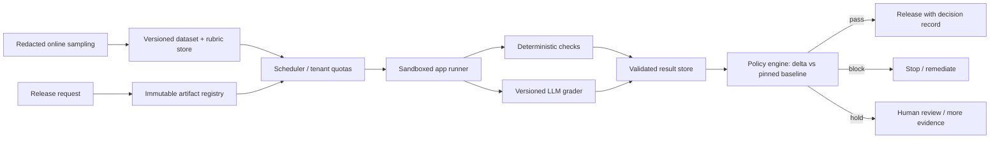

# G13 — Evaluation and Release Gating: Main Interview Guide

> **Source:** [G13_Evaluation_And_Release_Gating.md](G13_Evaluation_And_Release_Gating.md). The [Deep Dive](G13_Evaluation_And_Release_Gating_Deep_Dive.md) expands the gate, graders and incident; the [Cheat Sheet](G13_Evaluation_And_Release_Gating_Cheat_Sheet.md) is for rehearsal.

## The case in one sentence

Build a shared platform for 30 AI applications that makes a controlled **pass, block or hold** release decision against a pinned production baseline, with evidence for quality, safety, latency and cost. A dashboard alone does not own that decision.

## Questions to ask the interviewer

| Ask | Design consequence |
|---|---|
| Which applications are critical, and what counts as a release? | Sets suite tiers and per-app policies. |
| Who owns labels, rubrics, review and override authority? | Determines trusted evidence and decision rights. |
| What is the release window and acceptable evaluation spend? | Sizes workers and suite schedule. |
| Which traces contain PII, secrets or proprietary prompts? | Defines redaction, retention and tenant access. |
| Which regressions must block automatically versus hold for review? | Shapes thresholds and confidence bands. |
| How are post-release failures fed back into tests? | Keeps the golden set current. |

## Requirements and scale

**Functional:** pin candidate prompt/model/retrieval/tool/policy artifacts; select versioned suites and rubrics; run deterministic and model-based checks; compare candidate with pinned baseline; gate critical slices and four outcome dimensions; route uncertain/disputed cases to humans; record decisions, owners and overrides; sample production failures into a reviewed test pipeline.

**Non-functional:** p95 release evaluation within roughly 20 minutes, reproducibility, tenant isolation, sandboxed runners, trustworthy grader calibration, bounded cost and fail-closed behavior when evidence is missing. Do not assume one universal rubric across applications. The first version does not automate tuning or broadly share tenant datasets.

At 30 apps × 20 candidates/day × 5,000 cases, the full naive volume is **3 million case executions/day**. At 2–5 model/evaluator calls each, that is **6–15 million calls/day**. A six-hour release window raises the required rate to roughly 278–694 calls/s, versus 69–174/s spread across a day. At 2.5 calls/s/worker, that is about 112–278 workers before headroom in the six-hour window. Tier suites and use a shared elastic pool with tenant quotas.

## Architecture

The LLM grader provides one calibrated score, while deterministic checks, policy code and human authority control the release. Candidate applications and evaluation inputs run in a sandbox; the decision plane reads only validated completed results.

### Step-by-step architecture

1. A release request pins the full candidate artifact bundle and the current production baseline, including model, prompt, retrieval, tool and policy versions.
2. The scheduler chooses versioned suites and app-specific rubrics, applies tenant quotas, and sends cases to sandboxed runners with timeouts and limited egress/secrets.
3. Runners execute the whole application workflow; deterministic checks score schemas, policy rules and measurable outcomes, while a versioned LLM grader evaluates rubric dimensions that require judgment.
4. Validated results are written immutably with run, case, grader and rubric hashes; incomplete runs cannot masquerade as complete evidence.
5. The policy engine computes candidate-minus-baseline deltas for quality, safety, p95 latency and cost, checks critical slices independently, and issues pass, block or hold.
6. Humans review disputed or statistically thin cases and record overrides with reasons. Production signals are redacted and labelled before joining future suites.

## Gate logic and the failure to remember

**Quality** uses task-specific outcomes and a confidence-aware lower bound on candidate delta. **Safety** has an independent floor: better average quality cannot compensate for a safety regression. **Latency** and **cost** have agreed envelopes. Missing evidence blocks; thin evidence holds. A critical slice must pass on its own. For nondeterministic outputs, use repeated trials and outcome equivalence rather than exact text match.

The source's sales-copilot incident shows why: the release suite passed **96.7% of 120 cases**, but only **six** covered regulated claims, with an **83.3%** pass on that slice. Production unsupported claims reached **8.7% versus 1.2% baseline** after a model route change and a policy evaluator changed from block to warn-only. Roll back the route, restore blocking, review affected drafts, and add claim-level cases for security status, ROI and customer-logo permission. Version the policy mode so it cannot bypass the gate.

## Grader trust, cost and rollout

An LLM grader can reward verbosity over correctness. Version its model and rubric, calibrate it against humans using concise-correct and verbose-wrong examples, inspect disagreements, and keep it advisory until it earns trust. Use hidden holdouts, incident cases and critical-slice minimum coverage to prevent benchmark overfit. Online feedback discovers new failure modes; redaction and labelling make them usable offline.

To control cost, run smoke samples on ordinary changes, broader regression at release, and deep audits for high-risk changes. Route easy cases to a cheaper judge, escalate disagreements to a strong judge/human, and cache only unchanged artifact–case–grader pairs. Do not sample away critical slices. Measure cost per release, decision time, grader agreement, escape rate, flaky-case rate and override rate.

Roll out on one critical app with an advisory recommendation; calibrate graders against human labels; add latency and cost gates; then expand through a shared schema with app-specific rubrics. A grader timeout or unavailable evidence store blocks release. A delayed dashboard can degrade if the durable decision record remains intact. Roll back on a bad canary, unchecked severe incident or untrustworthy scoring.

## Two-minute interview answer

“I would build a release decision system, not just an evaluation dashboard. I pin the candidate and production baseline, run versioned cases in an isolated worker pool, score deterministic checks and calibrated LLM rubrics, and store immutable evidence. A policy engine compares quality, safety, latency and cost separately, with critical slices passing independently. Missing results block, thin samples hold, and humans handle disputes and overrides. I would start advisory on one critical app, validate the grader against humans, then harden the gate and expand. Post-release incidents become labelled regression cases, and the gate's own cost and escape rate are measured.”
