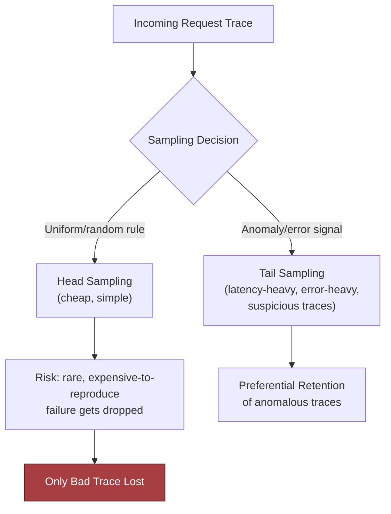
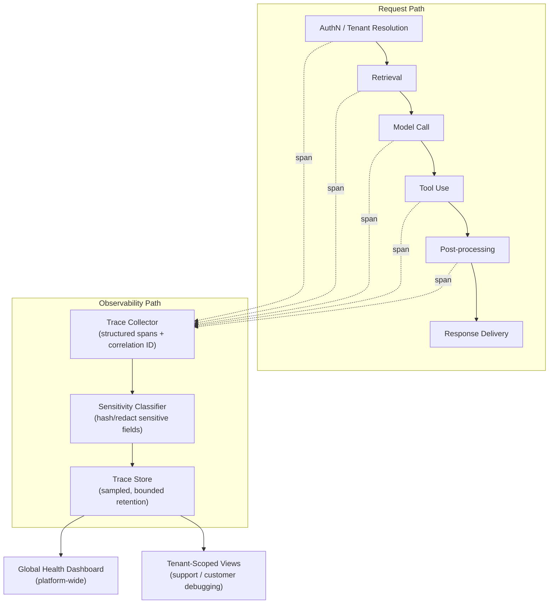
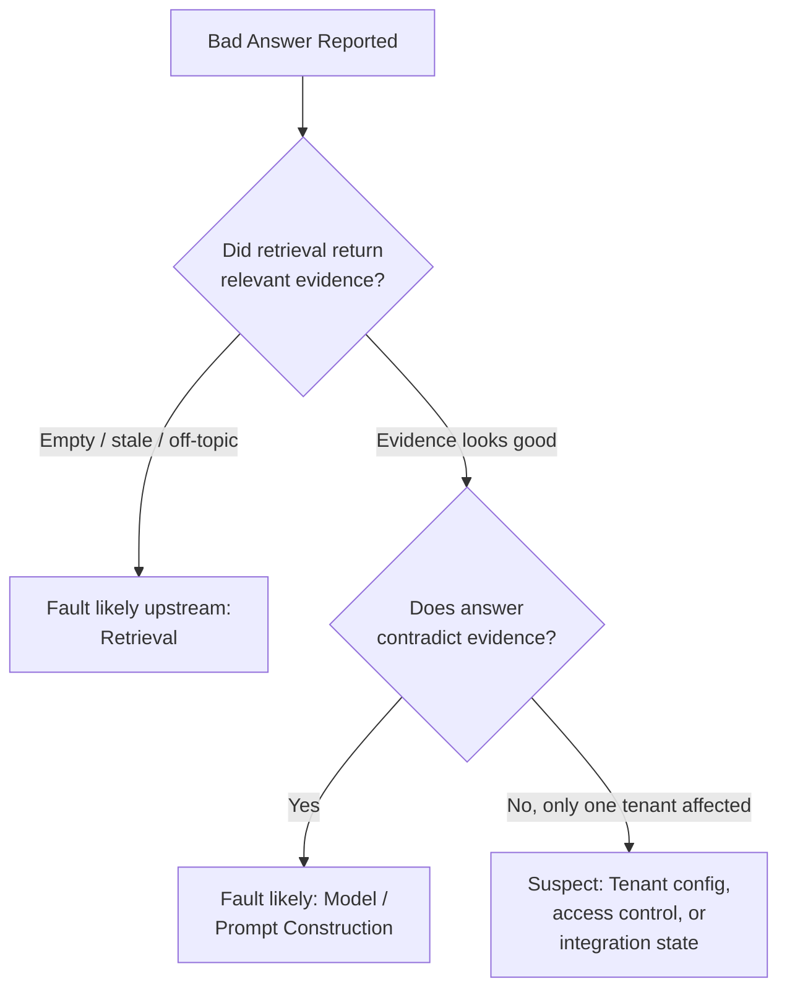

# Observability and Production Diagnosis for a Customer-Facing AI Application

*Capture enough to explain every failure without turning the telemetry into a second copy of the customer's data.*

◷ 34 min

"The AI is slow and sometimes wrong, and nobody knows why" is three problems wearing one sentence. This page consolidates group G14 of `CASE_STUDY_INDEX.xlsx` into one read for the day before. The anchor design comes first. Two incident walk-throughs follow, then the neighbouring prompts, then a card for every cost and latency pivot the group contains.

| Case in the group | What it contributes here |
|---|---|
| #24 Observability for a Customer-Facing AI Application (anchor) | Sections 1 to 9, 13 and 14: discovery, the no-capture list, requirements, sizing, architecture, redaction, sampling, failure policy, triage, rollout, delivery |
| #87 Incident: latency spike after a reranker and model-routing change | Section 10 |
| #88 Incident: cost spike from a prompt-template and cache-key regression | Section 11 |
| #53 OpenAI Q9 Latency Regression in an LLM Application | Section 12, and card 15.3 |
| #54 OpenAI Q10 RAG System with Poor Answer Quality | Sections 9 and 12 |
| #74 Reported OpenAI prompt: diagnose high latency in an LLM inference pipeline | Section 12 |
| #44 Playbook drill: LLM costs exploded after launch | Card 15.1 |
| #104, #105, #109, #110, #113, #114, #115 §15 scenarios 1, 2, 6, 7, 10, 11, 12 | Cards 15.2 to 15.8 |
| #119 Rate limits throttling at peak, #121 Users abandon mid-stream | Cards 15.9 and 15.10 |

Sections and tables marked *(own construction)* were built for this page from the sources' arguments and are not in the sources verbatim. The sizing numbers in section 4 come from the V2 tutorial's "My Perspective on the Gaps" note, which is supplementary and not chapter content.

---

## 1. Split "Slow and Sometimes Wrong" Into Three Problems

The customer is not asking for logging. The customer is asking to connect a user-visible failure to a technical cause, fast, safely, and without drowning operators in noise. A vague complaint cannot be instrumented, so the first job is to make it measurable.

Good discovery separates three problems the complaint compresses. Latency asks whether the request is slow, and where in the pipeline. Correctness asks whether the answer is wrong, and whether the fault is upstream in retrieval or downstream in the model or a tool. Diagnosability asks whether support and engineering can explain a failure without exposing sensitive content.

Each stakeholder wants a different signal. Support wants to triage a complaint without waiting on engineering. Engineering wants to know whether the fault is retrieval, the model or a tool integration. Security wants assurance that telemetry does not become a new exposure surface. The executive sponsor wants proof that quality improves release over release, not just green dashboards.

| Question | Why it changes the design |
|---|---|
| What counts as slow: which percentile, on which path, for which workflow? | Sets the SLO the whole trace model is built to explain |
| What counts as wrong: incorrect, empty, hallucinated, or a surfaced tool failure? | Decides which outcome tags every request carries |
| Which users and tenants are most affected? | Decides where instrumentation starts |
| What may be captured by default, and what is contractually off limits? | Writes the no-capture list before anything else |
| Who must diagnose a failure: support alone, or engineering every time? | Decides whether a trace-linked support workflow is a requirement |
| What telemetry overhead is acceptable? | Makes instrumentation a budgeted constraint |
| What retention window applies, and who may read traces under which role? | Sets the store's retention and the access gateway |
| What must the sponsor see to believe quality is improving? | Decides the top panel of the dashboard |

Open the round with one sentence: connect user-visible failures to technical causes without violating privacy or drowning operators in telemetry. Then ask the first two questions, state assumptions aloud, and invite redirection.

## 2. Decide What Not to Collect First

The unusual first design decision is the no-capture list. Full capture maximises forensic power, but it raises privacy exposure, access-control burden and storage cost at once. Data never collected cannot leak, cannot explode a metrics backend, and costs nothing to store.

| Must be observable by default | Must not be captured by default |
|---|---|
| Request identity: a stable request ID and tenant context | Full prompts |
| Retrieval evidence: what was retrieved, and whether it was relevant | Raw customer documents |
| Model invocation metadata: model version, prompt template version, generation settings | Secrets |
| Tool call outcomes: status, latency, error class | High-cardinality free-form labels: arbitrary user text, unbounded metadata keys |
| Timing at each hop of the pipeline | |
| User-visible outcome tags: success, partial answer, escalation | |

The balanced verdict is not "never capture." Capture enough structure to diagnose most incidents. Redact by default and record hashes or stable references. Keep a narrow, audited break-glass path for approved deep debugging, with time-bounded retention.

The interviewer usually injects this as a hidden constraint mid-round: the customer will not allow raw prompts to be broadly retained. A design that started from "capture everything" has to restart. A design that started from the no-capture list only has to name its break-glass path.

## 3. State Requirements as Testable Constraints

A requirement that cannot fail a test is a preference. "Observable" is a preference. "Support moves from a complaint to the request family without seeing raw content" is a constraint, and it shapes the architecture.

The functional requirements are six. Support the core workflow: a support agent moves from a user complaint to the exact request family and explains the failure without seeing raw sensitive content. Attach a stable correlation ID to every request and propagate trace context across services, integrations and queue boundaries. Capture per-hop timing across authentication, tenant resolution, retrieval, model call, tool use, post-processing and delivery. Record retrieval evidence, model version, prompt template version, generation settings and tool outcomes as structured attributes. Keep an aggregate global dashboard for platform health separate from tenant-scoped views for customer debugging. Tag every request with a user-visible outcome, so complaints map to telemetry.

| Constraint | Stated so it can be tested |
|---|---|
| Latency | Instrumentation must not become the outage; telemetry overhead is a budgeted constraint, measured with and without export |
| Availability | Telemetry export failure degrades diagnostics but never blocks the user request |
| Security | Full prompts, raw documents and secrets are never captured by default; sensitive fields are classified and hashed before storage; redaction pass rate is zero raw prompts in any sink |
| Compliance | Audit logs (who accessed what) stay separate from debugging traces (what failed where) |
| Reliability | No single global sampling rule governs all error paths |
| Cost | Volume scales with request rate, trace rate, retention window and sampling rate, so the first decision is what not to collect |
| Diagnosability | Trace coverage high enough that complaints map to traces; mean time to diagnose falling after the support workflow lands |

Every requirement then needs an owner in the architecture *(own construction)*.

| Requirement | Primary component(s) |
|---|---|
| Complaint to request family, unaided | Support and access gateway, tenant-scoped views, outcome tags |
| Correlation across services and queues | Trace collector, queue serialization contract |
| Per-hop timing | Spans emitted at every hop into the collector |
| Structured evidence without raw content | Sensitivity classifier, salted hash |
| Global versus tenant views | Two consumers of one store, with a permission boundary |
| Overhead within budget | Sampling policy, attribute caps, bounded retention |
| Audit separate from debug | Audit and redaction pipeline with its own write path |

## 4. Size the Telemetry by Collection Policy

The chapter frames estimation around collection policy, not raw QPS. Telemetry volume, storage and query load all scale with sampling rate, cardinality bounds and retention window. Observability data is not free, and instrumentation that is not budgeted becomes the outage.

The chapter itself gives no numbers. The V2 gap note supplies a worked version, and it is worth saying aloud because it lands on a surprising conclusion.

| Step | Figure (V2 gap note, supplementary) |
|---|---|
| Peak traffic | 500 requests/second |
| Spans per request | ~6: auth, retrieval, model, tool, post-processing, plus the collector envelope |
| Raw span rate | ~3,000 spans/second before sampling |
| Tail-biased retention | 100% for error and latency-outlier traces, roughly 2-5% of volume |
| Head sampling for the rest | 5% |
| Effect | Raw trace volume cut by roughly 90%, failure population preserved |
| Stored size | ~200 bytes/span after redaction, 30-day retention, a few hundred GB |

The conclusion is that storage is not the constraint. Classifier CPU and redaction-policy correctness are. Every span passes through the classifier before storage, so the classifier sits on the observability path's critical line.

Sampling is a control, not a compromise. Head sampling decides at the start of a request, which is simple and cheap but blind to how the request ends. Tail sampling decides after the request completes, so it can keep slow and failed traces, but it needs more infrastructure and careful policy. The interview-safe position is preferential retention for latency-heavy, error-heavy and anomalous traces.



## 5. Draw the Architecture End to End

The design is tracing-first: structured spans, selective redaction, and a stable correlation ID on every request from the edge inward. Two paths run side by side. The request path serves the user. The observability path explains the request path, and it must never be able to break it.

The same system drawn with its trust boundaries *(own construction)*:

```
 REQUEST PATH (serves the user; never waits on telemetry)
 ┌──────────┐  ┌──────────┐  ┌───────────┐  ┌───────┐  ┌──────┐  ┌──────────┐  ┌──────────┐
 │ AuthN +  │─▶│ Tenant   │─▶│ Retrieval │─▶│ Model │─▶│ Tool │─▶│ Post-    │─▶│ Response │
 │ corr. ID │  │ resolve  │  │           │  │ call  │  │ use  │  │ process  │  │ + outcome│
 └────┬─────┘  └────┬─────┘  └─────┬─────┘  └───┬───┘  └──┬───┘  └────┬─────┘  └────┬─────┘
      │ span        │ span         │ span       │ span    │ span      │ span        │ outcome tag
      ▼             ▼              ▼            ▼         ▼           ▼             ▼
 ═════════════════ async, bounded buffer; export failure degrades, never blocks ═══════════════
      │
 OBSERVABILITY PATH
 ┌────────────────────┐   ┌──────────────────────────┐   ┌────────────────────┐
 │ Trace collector    │──▶│ Sensitivity classifier   │──▶│ Sampling policy    │
 │ correlation ID,    │   │ classify, salted HMAC,   │   │ tail-biased, error │
 │ structured spans   │   │ cap cardinality          │   │ overrides, exemplar│
 └────────────────────┘   └──────────────────────────┘   └─────────┬──────────┘
          ── TRUST BOUNDARY: nothing raw crosses this line ──       │
                                                        ┌──────────▼──────────┐
                                                        │ Trace store         │
                                                        │ retention-bounded   │
                                                        └───┬─────────────┬───┘
                                   ┌────────────────────────┘             └──────────────┐
                        ┌──────────▼──────────┐                              ┌───────────▼───────────┐
                        │ Global dashboard    │                              │ Support + access      │
                        │ aggregates only,    │                              │ gateway → tenant-     │
                        │ cross-tenant        │                              │ scoped views          │
                        └─────────────────────┘                              └───────────────────────┘
 AUDIT PATH (separate write path, durable, fail closed): who accessed which trace, when, why
```

The source's diagram, kept verbatim:



The source's component table, with a column added for how each part fails *(the last column is own construction)*.

| Component | Primary responsibility | Notes | Fails how |
|---|---|---|---|
| Trace collector | Attach correlation ID, propagate context, capture spans per hop | Structured, not raw text by default | Context lost at a queue; orphan spans |
| Sensitivity classifier | Classify and hash sensitive fields before they reach telemetry | Runs before storage, not after | A missed pattern writes PII into every downstream sink |
| Trace store | Durable, retention-bounded storage of exported traces | Retention window is a cost and privacy control | Unbounded retention turns it into a data lake of customer content |
| Global dashboard | Platform-wide health, release regressions | Cross-tenant, aggregate only | A tenant label on a global chart explodes cardinality |
| Tenant-scoped views | Customer-specific debugging, support triage | Access scoped by role and tenant | One misconfigured view spans every tenant |
| Support and access gateway | Role-based, tenant-scoped access to evidence | Enforces least privilege | "Can read all traces" becomes the default |
| Audit and redaction pipeline | Enforces retention and redaction on export | Defense in depth: code, collector, review | Combined with debug traces, it inherits their sampling and short retention |

Four questions organise the walk-through. How does each request get a correlation ID? How does trace context flow across services and customer integrations? How does a support operator jump from an alert to the request family without seeing raw content? How are global and tenant visibility separated? Answer each one against the diagram.

## 6. Classify and Hash Before Storage

A classifier that runs after storage protects nothing, because the raw value has already been written. So classification happens before a value can reach a trace. A salted hash then preserves correlation without retaining content.

The data model is small. `Request` carries tenant ID, prompt and an optional user ID. `ExportedTrace` carries only a bounded, structured attribute dictionary: correlation ID, tenant ID, prompt classification, query hash, spans and result status. It never carries raw prompt text by default.

The hash is HMAC-SHA256 with a salt, so the same prompt always maps to the same fingerprint. That fingerprint deduplicates and correlates requests across the store. Without the salt it cannot be reversed by brute-forcing common prompts, and a missing salt raises an error rather than silently hashing unsalted.

Three tests turn the design into executable contracts:

| Test | What it proves |
|---|---|
| Idempotent trace ingestion: post the same trace twice | The second post returns "deduplicated", so a retry never double-counts |
| Privacy invariant: a request containing `person@example.com` | The address never appears in the exported JSON; the query hash is present; the classification is "sensitive" |
| Failure injection: the retriever raises a timeout after acceptance | The failure is still observable; the trace summary is written in a `finally` block with an `outcome="partial_failure"` field |

The last test protects the chapter's central failure drill directly. Sampling and redaction must never make a failure invisible.

Telemetry attributes are schema-validated at ingestion. Unknown high-cardinality fields are rejected or collapsed into a bounded "other" bucket. Queue serialization contracts carry trace context, idempotency key and tenant scope explicitly, or traces break silently at async handoffs.

## 7. Sample Toward the Failures

The chapter's signature phrase is "sampling drops the only bad trace." Uniform sampling keeps a fixed fraction of everything. When failures are rare, a fixed fraction of a rare thing is often zero. Expect the interviewer to inject this mid-round and have the answer ready cold.

Walk it as a four-step drill.

| Step | Sampling drops the only bad trace |
|---|---|
| Detection | Compare complaint intake, request errors and anomaly signals against sampled trace volume. Complaints rising while traces for that workflow fall is a blind spot, not a healthy system |
| Containment | Switch the affected tenant, route or error class to higher-fidelity sampling temporarily; preserve the raw event envelope in a protected quarantine store if policy allows |
| Recovery | Reconstruct from neighbouring evidence: API gateway logs, model gateway errors, dependency spans, support tickets. Mark the missing trace explicitly in the incident record |
| Prevention | Never let one global sampling rule govern all error paths. Use error-class overrides, low-rate always-on exemplars and per-tenant incident escalation hooks |

The first move under this injection is to contain impact, preserve evidence and make the failure legible. Defending the sampler or arguing probability is the weak move.

## 8. Name the Failure Policy for Every Layer

Every dependency needs an explicit answer to one question: what happens when it is gone? Five terms carry that answer consistently. Fail open continues with reduced visibility. Fail closed refuses the action when integrity, privacy or authorization would be compromised. Degrade serves a reduced but safe experience. Queue buffers with explicit bounds and retention. Human intervention escalates when risk or ambiguity is too high for automation.

| Failure | Policy |
|---|---|
| Auth token missing | Fail closed; do not infer identity; ask the caller to re-authenticate |
| Telemetry export unavailable | Degrade; continue serving, buffer a bounded summary, alert |
| Retriever timeout | Retry once with jitter; if still failing, degrade to a reduced-answer path or ask for refinement |
| Model gateway rate limit | Queue briefly if the SLA allows; otherwise fail gracefully with a specific retry message |
| Audit sink unavailable | Usually fail closed for the audited action, or require a human; silent loss of audit evidence is unacceptable |
| Support lookup outside tenant scope | Fail closed; no cross-tenant fallback |
| Repeated downstream timeouts | Trip a circuit breaker; serve a safe degraded response or queue if the workflow permits |
| Evidence buffer full | Dead-letter the overflow into a restricted quarantine queue with an incident marker, then alert a human |

The reason each row differs is the useful thing to say aloud. A user-facing answer can sometimes degrade; an audit trail usually cannot. A retriever timeout can be retried; a permission check cannot be guessed.

Name the blast radius along four axes: tenant, region, workflow and dependency. A raw-prompt leak is usually tenant-scoped but workflow-wide. A queue-boundary trace break can hit one integration path across many tenants. A model outage may be regional. A misconfigured support tool can span every tenant.

Four more named failures get the same drill.

| Failure | Detection | Containment | Recovery | Prevention |
|---|---|---|---|---|
| Tenant ID has a high-cardinality bug | Cardinality budgets and exporter rejections; a spike in unique tenant labels is itself an incident | Strip or normalize untrusted attributes at ingestion; collapse unknowns into "other" | Fix the mapper; backfill only the minimal aggregates for the review | Schema-validate attributes; reject unknown high-cardinality fields before export |
| Logs store a raw prompt | Scanners and red-team tests search logs, traces and support transcripts for PII and secret formats | Revoke sink access, rotate exposed credentials, quarantine the log set | Delete or redact per retention policy and contract; notify owners | Enforce redaction in code, in the collector and in review |
| Trace context breaks at a queue | A trace starts, then vanishes after async handoff; orphan spans; a spike in "unknown root" events | Propagate a minimal correlation envelope through the queue | Stitch spans by correlation ID and timestamp; mark the join as reconstructed | Queue contracts carry trace context, idempotency key and tenant scope, and are tested |
| Quality metric improves while adoption falls | Pair technical metrics with completion rate, retries, abandonment, support contacts | Treat it as a product problem, not a hotfix | Product review, metric reset, possibly roll back the latest change | Track task completion and business outcome, not usage volume alone |

The abuse case deserves one sentence of its own. A developer adds a raw prompt field to a debug span to speed triage. It works once, then becomes the easiest way to move PII into every downstream system. The fix is a redaction policy, an exporter guardrail, and a test that fails whenever exported telemetry contains raw sensitive strings.

Inject sampler loss, queue-boundary breakage, redaction regressions and dependency timeouts in staging. Chaos practice proves the failure policy works before production forces the discovery.

## 9. Triage From the Complaint Down

A dashboard built from component metrics shows rates without telling anyone whether the user's experience improved. So build it from one incident story, top down. The complaint is "the AI is slow and sometimes wrong."

The top panel shows the user outcome: latency percentile, failure rate, incident volume. The middle panel shows likely causes: retrieval success, tool success, model error class, token cost. The bottom panel shows support mechanics: trace coverage, redaction rate, queue age for incidents, mean time to diagnose.

The correctness question has a precise answer. Compare the retrieved evidence with the final answer. If retrieval is empty, stale or off-topic, the fault is upstream. If retrieval looked good but the answer contradicts it, suspect the model or prompt construction. If the bad answer appears for only one tenant, suspect tenant configuration, access control or integration state before blaming the shared model.



The diagnostic signals that make this possible are the ones section 2 kept. Request and tenant correlation IDs. Retrieval query fingerprints and document identifiers, not raw text. Model version, prompt template version and generation settings. Tool call status, latency and error class. Outcome tags.

Alert on customer harm or likely impending harm, not on telemetry volume. Good triggers are sustained latency above the SLO and elevated error rates. So are repeated empty retrievals, a spike in fallback responses, and critical tool failures. A sudden rise in "wrong answer" feedback for one tenant or cohort belongs on the list too.

## 10. Walk Through the Latency Spike (#87)

A slow pipeline is rarely one slow component. Incident #87 is the proof: no single span explains it, and every small change looked safe alone.

**Setting.** A B2B SaaS support copilot runs inside a live support console. Agents expect answers in under 5 seconds because the customer is waiting in chat. The path is Support Console → RAG API → query rewrite → hybrid retriever → cross-encoder reranker → context compressor → LLM gateway → model provider → response evaluator → UI stream. The target is a 7-second p95 with a 12-second hard timeout.

**Symptom.** On 2026-07-08, during peak European hours, agents saw the spinner for 18–35 seconds. Some answers arrived after the human agent had already replied. Handle time rose 21%. It was not an outage: success rate stayed acceptable, but p95 and p99 broke the SLO.

**Telemetry.**

| Signal | Value |
|---|---|
| p50 / p95 / p99 (eu-central-1, 5-minute window) | 5310 ms / 22180 ms / 34890 ms |
| Timeout rate | 12.8% against a 1.1% baseline, over 1842 requests |
| Retrieval p95 | 4200 ms |
| Reranker | 3100 ms; `cross_encoder_large_v4`; 80 candidates in, 12 out; batch size 1; GPU queue depth 29; light-reranker fallback off |
| LLM gateway queue | 2800 ms; primary provider degraded; 1 retry, retry-after 750 ms |
| Provider latency | 9360 ms, routed to us-east-1 from eu-central-1 |
| Context compression | 740 ms |
| Tokens | 18500 in, 610 out |
| First token / total | 14120 ms / 23840 ms against a 12000 ms timeout budget |

**What changed.** Two changes landed within 24 hours. The reranker moved from `cross_encoder_small_v2` to `cross_encoder_large_v4`. The router moved standard answers from a faster mid-tier model to a larger one after a quality experiment. The canary ran only in low-traffic hours and never tested peak GPU queue depth.

**Root cause.** Compounded latency. A larger candidate set, a slower reranker, a bigger context, gateway queueing and cross-region routing stacked up. The pipeline broke its budget because several "small" changes landed together.

**Debugging path.** Decompose the trace into spans and compare each stage's p95 with its baseline. Check candidate count, context tokens, queue time, provider latency and regional routing. Compare canary with control and peak with off-peak. Check whether timeouts land before or after the first token. A 14-second first token means streaming cannot rescue the experience.

**Fix.** Now: roll back the model route, cap reranker candidates at 30, and enable the light reranker when GPU queue depth exceeds 10. Also reduce max context tokens and route EU traffic to an EU-capable endpoint. Later: add a latency budget per stage and load-test gates for reranker queue depth. Enforce context caps per workflow and add circuit breakers for provider degradation. Quality experiments must pass latency and cost SLOs, not only answer quality.

**Abuse angle.** Latency becomes a safety risk when users abandon the assistant or bypass review. Broad queries that trigger large candidate sets and expensive reranking are a cheap denial-of-wallet or denial-of-service vector.

> *"I would start with span-level latency decomposition. The trace shows retrieval at 4.2s, reranker at 3.1s, LLM queue at 2.8s, and provider latency at 9.3s, with 18.5k input tokens. That means this is a pipeline-budget failure, not just one slow API. I would roll back the model route, cap reranker candidates, enforce context compression, add queue-depth fallback, and make future quality experiments pass p95 latency and timeout-rate gates."*

The weak answer is "increase the timeout and maybe use a faster model." It never reads a span.

## 11. Walk Through the Cost Spike (#88)

Production GenAI systems fail economically as well as technically. Incident #88 produced no quality complaint at all. The only symptom was a budget alert.

**Setting.** An executive dashboard copilot summarises revenue, pipeline, customer-risk notes and operational metrics. The path is UI → metrics API → CRM-note retrieval → prompt assembler → semantic cache → LLM gateway → cost attribution. The cache key should include tenant, dashboard type, date range, normalized query and data snapshot ID. The router picks a mid-tier or larger model by context size and sensitivity.

**Symptom.** On 2026-07-08 the daily budget alert fired at 14:20. The CFO asked why the assistant had consumed almost four days of budget before lunch.

**Telemetry.**

| Signal | Value |
|---|---|
| Spend | $240 daily budget; $912 actual; $1680 projected by end of day |
| Deltas | Cost +380%; requests +7%; input tokens +351% |
| Prompt template | `exec_summary_v6`; average context 4200 → 19000 tokens |
| Context contents | `all_notes_90d` instead of `top_20_notes_30d`; 500 table rows instead of a cap of 80; compression disabled |
| Cache | Hit rate 4% against a 67% baseline; key v5 = `[tenant_id, query_text]`; missing date range, snapshot ID, role scope |
| Routing | GPT-4-class because `context_tokens>12000`; 21384 tokens in, 1288 out; $2.74 per request against $0.31 before |

**What changed.** The `exec_summary_v6` upgrade added "more supporting context" after executives asked for richer explanations. The same release changed cache-key normalization and dropped the date-range and snapshot fields. It also disabled compression while debugging a formatting issue.

**Root cause.** Three effects multiplied. The template expanded context. The larger context crossed the routing threshold into the expensive model. The cache-key regression collapsed the hit rate, so the system paid full price for every large prompt.

**Debugging path.** Start with cost per workflow, not global provider spend. Compare request count, input and output tokens, model route, cache hit rate and prompt version before and after the deploy. Sample traces to see what was assembled. Check whether the added context improved answers enough to justify its cost.

**The hidden correctness bug.** The key also lost `role_scope`. One user's executive summary could be served to another role whenever the query text matched. A cost incident turned out to be a permission incident too.

**Fix.** Now: roll back `exec_summary_v6`, restore compression, cap CRM notes and table rows, and force the mid-tier model for routine summaries. Invalidate every cache entry written under `cache_key_version=v5`. Later: add cost regression tests to CI and enforce per-workflow token budgets. Require cost and latency approval for template upgrades, track hit rate by version, and route with budget awareness and graceful degradation.

> *"The telemetry shows usage grew only 7%, but input tokens grew 351%, cache hit rate dropped to 4%, and requests started routing to a GPT-4-class model. I would roll back the prompt template, restore compression, cap context, fix the cache key, and add CI gates for token and cost regression. I would also audit cache safety because missing `role_scope` can create data exposure."*

The weak answer is "ask users to make shorter queries or switch to a cheaper model." It blames usage that grew only 7%.

## 12. Answer the Neighbouring Prompts With the Same Traces

Three prompts in the group look different and use the same instrument. Each one is answered by reading the anchor's traces at a different depth.

**#53, latency regression.** "An enterprise customer reports that responses have become slow." First clarify which latency: time to first token, time between tokens, total completion time, or user-perceived latency. Then decompose across ten stages: client and network, authentication, middleware, retrieval, prompt construction, model prefill, token generation, tool calls, post-processing and streaming. Check input and output token counts and retrieval p95 and p99. Then check retry rates, rate-limit throttling and traffic patterns. Finish with model version, prompt changes, cache hit rates and regional routing. Incident #87 is this prompt with real numbers.

The follow-up is "it only happens at peak traffic." Peak-only latency points at queueing, not a slower model. Separate queue wait from service time. Latency curves knee sharply past roughly 70–80% utilization. A rising p99 with a flat p50 usually means queueing. Add admission control and shed non-interactive work to batch *(the utilization figures come from the additions file, section D)*.

**#54, RAG with poor answer quality.** Separate seven failure classes: retrieval, context assembly, reasoning or synthesis, prompt or instruction, output format, evaluation, and user experience. Measure each separately. Use recall@k, precision@k and MRR or nDCG for retrieval. Use citation correctness and context sufficiency for assembly. Use answer faithfulness, answer relevance and abstention quality for generation. Use end-to-end task success for the whole. The section 9 flowchart is the first cut; these metrics are the second.

The follow-up is "would you fine-tune the model?" Classify the problem first. A knowledge problem is usually retrieval or data access. A behavior problem is prompting, fine-tuning or structured output. A freshness problem is indexing and the data pipeline. A permission problem is access-control-aware retrieval. Fine-tuning fixes only the second.

**#74, diagnose high latency in an LLM inference pipeline.** This is the layer below the application. Walk the full stack: tokenization, network, batch size, KV cache, post-processing. Two facts carry the answer *(from the additions file, section B)*. Prefill processes the whole prompt in parallel and sets time to first token, so it scales with input tokens. Decode generates one token at a time and sets tokens per second, so it scales with output tokens. A frozen UI points at prompt size, retrieval and queueing. An answer that starts fast then drags points at output length.

Batch size trades throughput for per-request latency, because a larger batch waits longer to fill. The KV cache holds attention state for tokens already processed. Its memory caps how many sequences fit on a GPU at once, and a full cache forces queueing. Post-processing is usually small, but a synchronous evaluator or logger on the hot path is not. The same stack walk anchors G20 on inference serving, so prepare it once.

## 13. Roll Out in Four Phases With Named Owners

Observability fails socially before it fails technically. If no one owns a signal, no one owns the decision. So the rollout has names, gates and exit criteria, not only components.

| Phase | Owner | Exit criterion |
|---|---|---|
| 1. Define user-facing SLOs first | Product and engineering, with the customer signing off | Agreed latency targets, acceptable failures, support boundary, definition of a customer-visible incident. No agreement, no wider release |
| 2. Instrument one critical path | The primary service team, with platform support | One representative request traced end to end through auth, retrieval, model, tool and response assembly |
| 3. Add the trace-linked support workflow | Support engineering or customer success, with on-call defined | A support agent moves from a complaint to a trace without asking the user for raw prompts |
| 4. Add quality and cost signals with sampling | The observability platform owner, with model and product owners setting thresholds | Enough signal to detect regressions, sampling only what is needed |

The answer key gives a weekly version. SLOs come in weeks 0-1 and measurable "slow" and "wrong" in weeks 1-2. One path follows in weeks 2-3 and redaction scanning in weeks 3-4. The support workflow lands in week 5, then quality and cost signals in weeks 6-8.

| Metric | Calculation | Owner | Alert when |
|---|---|---|---|
| Availability SLO | Successful requests / total, excluding agreed out-of-scope failures | Application engineering with platform | The burn rate threatens the SLO |
| Latency SLO | Latency at the agreed percentile, usually p95 or p99 | Application engineering | Sustained breach, or a breach after a release or canary |
| Retrieval and tool success | Successes / attempts, by dependency and tenant | The owning service team | Below baseline, or a sudden shift in failure class |
| Token cost | Tokens per successful request, or cost per tenant per day | Product operations or finance partner | Consumption rises faster than traffic, or exceeds budget |
| Quality-event rate | Visible failures, escalations, reviewed bad outputs / sessions | Product and ML engineering | A meaningful rise after any release or config change |
| Trace coverage | Traced requests / expected requests on the critical path | Observability platform | Below the minimum needed for the top failure path |
| Telemetry overhead | Added latency, compute, storage, network versus baseline | Platform and SRE | Overhead materially raises latency or cost |
| Mean time to diagnose | First report or alert to a credible root-cause hypothesis | On-call engineering and support operations | Stops improving, or exceeds the response target |

The go/no-go gate is explicit. If trace coverage falls below the minimum or overhead moves latency, the release pauses. Rollback triggers are concrete: loss of trace propagation, a spike in quality-event rate, or an unsustainable cost slope.

Decide what is product, adapter, service or configuration. Per-customer sampling rates, retention windows and alert thresholds are configuration. Ticketing and alerting integrations are adapters. Collection, redaction, correlation propagation and the access gateway are a shared service. The request lifecycle, outcome tags and the minimal schema are core product. That split keeps customer edge cases out of the core.

Launch readiness needs a canary on one tenant or slice and a fast rollback switch. Keep old and new trace schemas interoperable during migration. Train support on what a healthy trace looks like, and publish an ops guide with metric definitions, access rules and rollback steps. Have three artifacts ready before launch: an evidence policy, a response runbook and an access review.

| Risk | Owner | Mitigation | Trigger |
|---|---|---|---|
| Sampling drops the only bad trace | Observability platform | Bias sampling toward error paths and reported incidents | Support cannot find evidence for an acknowledged failure |
| Telemetry becomes the bottleneck | Platform and SRE | Cap attributes, bound storage, monitor overhead | Latency or cost rises after instrumentation changes |
| Support sees too much or too little | Security and support engineering | Role-based access, redaction, audit logging | Sensitive content in support artifacts, or triage stalls |
| Quality signals are noisy | Product and ML engineering | Separate objective service metrics from subjective labels | Alerts fire on expected experimentation |
| Adoption mistaken for success | Product | Track task completion and business outcome | Usage rises while escalations and manual work stay flat |

## 14. Deliver It in Fifty Minutes

Spend time in proportion to risk, not diagram size. The pacing below is the chapter's own.

| Minutes | Move |
|---|---|
| 0–5 | Frame the outcome; ask what counts as slow and wrong, and who is most affected |
| 5–12 | Walk the critical path; show that "slow and sometimes wrong" is a set of failure modes |
| 12–18 | State the capture and no-capture lists: the first trade-off |
| 18–26 | Propose the tracing-first architecture and the two views |
| 26–32 | Size by collection policy; say why "what will we not collect?" comes first |
| 32–38 | Security and failure modes, each tied to a mitigation |
| 38–44 | Staged rollout, alert triggers, owners, the support workflow |
| 44–50 | Executive summary; name the riskiest assumption and the first rollout gate |

Four trade-offs must be defended. Full capture against privacy and cost: capture structure, keep a break-glass path. Head against tail sampling: prefer tail retention for slow and failed traces. Raw prompts against hashed metadata: store template ID, field presence, sanitized entity markers and fingerprints. Global dashboard against tenant views: build both, with a permission boundary.

Repair the common weak answers on the spot. "Log everything and sort it out later" becomes a tiered capture strategy with named privacy and cost consequences. "Use tracing" becomes what is traced, how context propagates, and which layer each span isolates. "Sample 10 percent" becomes a question about the failure distribution. "Put it on one dashboard" becomes global health plus tenant-scoped debugging. "If the answer is wrong, the model is wrong" becomes a walk through auth, retrieval, prompt construction, tools and integrations.

> *"My design goal is to connect user-visible failures to technical causes without collecting more sensitive data than we need. I would instrument the full request path with correlation IDs, structured spans, and bounded metadata across authentication, retrieval, model calls, and tools. I would store raw prompts and customer content only through a narrow, audited escalation path, because the default should be privacy-preserving and cost-aware. For debugging, I would rely on template IDs, document references, timing, error classes, and outcome labels so support can separate auth, retrieval, model, and integration problems. I'd use a global operational view plus tenant-scoped views for authorized support, and I'd prefer selective retention for slow or anomalous traces over blind random sampling so we do not lose the one bad trace. The riskiest trade-off is observability depth versus privacy and cost, and my first production rollout gate would be proving that the system can consistently identify the root cause of real customer incidents without exposing unnecessary content or overwhelming the team."*

Two gap answers are worth having ready *(V2 gap note, supplementary)*. On build versus buy: buy the span plumbing, build the redaction and classification boundary, because "what counts as sensitive for this tenant" is business logic no vendor can own. On regulation: hashed prompts make a deletion request mostly a matter of clearing quarantine and break-glass records. The retention window should follow the customer's data-processing agreement.

## 15. Answer Every Cost and Latency Pivot With a Card

Ten members of this group are the same system asked a cost or latency question. Each gets a card: the dominant driver, the cheapest lever, the metric that proves it, the move to refuse, and the line to say. The "Do not" field for the §15 scenarios is *(own construction)*; the playbook gives no weak answer for them. Every card shares the playbook's customer-communication sentence: *"Acknowledge impact, show measured cause, provide immediate mitigation, then explain long-term prevention and success metric."*

### 15.1 LLM costs exploded after launch (#44)

| | |
|---|---|
| Dominant driver | Unknown until attributed: usually retries, agent loops, batch or eval jobs, or an integration loop |
| Cheapest lever first | Spend circuit breaker first; attribute by tenant and feature; cap output; pause batch and eval; downgrade premium routing; tenant quotas; then root cause |
| Metric that proves it | Cost per minute; tokens per request; model distribution; retry count; agent steps; tenant usage |
| Do not | Kill the whole feature without diagnosis |
| 60-second line | Contain, attribute, then diagnose. Keep low-cost safe paths online while disabling runaway paths. The real lesson is that budget guardrails must exist before launch. |

### 15.2 LLM cost increased 5× after rollout (#104)

| | |
|---|---|
| Dominant driver | Request shape: longer prompts, new RAG context, agent loops, eval jobs, retries, output verbosity, a provider price-tier change |
| Cheapest lever first | Cap max output length, pause expensive batch and eval jobs, route simple tasks to a smaller model, cap agent steps |
| Metric that proves it | Cost and tokens per request; requests by feature; retry count; model distribution; output tokens; eval and batch spend |
| Do not | Swap the model before breaking spend down by tenant, feature, model and prompt version |
| 60-second line | The increase is likely from request shape, not just user count. I would isolate token growth, retries, agent steps, and batch jobs before changing the model. |

### 15.3 Latency jumped from 2 seconds to 20 seconds (#105)

| | |
|---|---|
| Dominant driver | A new reranker, larger context, a provider incident, cold starts, a tool timeout, or synchronous logging |
| Cheapest lever first | Roll back the prompt or reranker change, disable the optional tool, reduce top-k, activate the fallback provider |
| Metric that proves it | P95 and P99; first-token; retrieval, rerank, model and tool latency; timeout and retry rate |
| Do not | Guess, or raise the timeout |
| 60-second line | I would not guess. I would use traces to see whether the 18-second increase is retrieval, model, tool calls, or infrastructure. |

### 15.4 Executive demo is too slow (#109)

| | |
|---|---|
| Dominant driver | Unwarmed services, live external dependencies, an over-large prompt, no streaming, a poor network |
| Cheapest lever first | Warm services, pre-index documents, stream output, use a stable demo dataset, shorten the answer |
| Metric that proves it | First-token latency; retrieval and model latency; tool calls; cold-start count |
| Do not | Present demo numbers as production claims |
| 60-second line | For an executive demo, I would reduce live uncertainty while staying honest about production architecture and limitations. |

### 15.5 Customer complains the AI is too expensive (#110)

| | |
|---|---|
| Dominant driver | Premium-model overuse, verbose answers, no quotas, heavy batch jobs, low-value workflows |
| Cheapest lever first | Route simple tasks to a cheaper model, add quotas, trim prompts, cache safe repeated results |
| Metric that proves it | Cost by feature; active users; cost per outcome; model distribution; tokens per request |
| Do not | Defend the bill generically |
| 60-second line | I would not defend the bill generically. I would show cost by workflow and propose concrete reductions that preserve value. |

### 15.6 Prompt update increased token usage (#113)

| | |
|---|---|
| Dominant driver | Verbose instructions, duplicated rules, added few-shot examples, longer default output |
| Cheapest lever first | Roll back or trim the prompt; reduce examples; enforce an output max |
| Metric that proves it | Input and output tokens by prompt version; parse errors; retry count |
| Do not | Ship a prompt change without a cost-impact report |
| 60-second line | Prompt changes are production changes. I would version them and compare token usage and latency before rollout. |

### 15.7 Model provider latency became unstable (#114)

| | |
|---|---|
| Dominant driver | A provider incident, regional queueing, rate limiting, a network issue, with no deploy of ours |
| Cheapest lever first | Activate the fallback model or provider, reduce concurrency, degrade optional features |
| Metric that proves it | Provider latency by model and region; fallback rate; error codes; queue time |
| Do not | Wait blindly for the provider to recover |
| 60-second line | I would isolate provider latency from our own pipeline and use routing/fallback rules rather than waiting blindly. |

### 15.8 Cache hit rate dropped suddenly (#115)

| | |
|---|---|
| Dominant driver | A new prompt version invalidated the cache, a short TTL, changed normalization, document churn |
| Cheapest lever first | Roll back the key change, adjust TTL, normalize queries, pre-warm a safe cache |
| Metric that proves it | Hit rate by cache type; invalidations; TTL; key cardinality; traffic mix |
| Do not | Scale capacity before inspecting the key |
| 60-second line | A cache hit drop is usually a keying, versioning, traffic, or invalidation issue; I would inspect those before scaling. |

Two facts sharpen this card *(additions file, section A1)*. Prompt caching is a byte-exact prefix match, so one changed byte invalidates everything after it. A timestamp in the system prompt, unsorted JSON keys, a reordered tool list or a model swap each cause a silent miss. Incident #88 adds the other half: cache changes need a security review too, because a key missing `role_scope` serves one role's answer to another.

### 15.9 Rate limits are throttling us at peak (#119)

| | |
|---|---|
| Dominant driver | Provider 429s mixed with limits from the team's own gateway |
| Cheapest lever first | Separate the two sources; retry with jitter plus a fallback model or region; shed non-interactive traffic to batch |
| Metric that proves it | 429s by source; fallback rate; queue depth; goodput at peak |
| Do not | Retry into the same wall |
| 60-second line | Separate provider 429s from our own limits first. Short term, jitter, fall back and shed batch traffic. Long term, capacity commitments, tenant-aware quotas, and queue non-urgent work. |

### 15.10 Streaming works but users abandon mid-answer (#121)

| | |
|---|---|
| Dominant driver | Tokens generated after the user has left, plus in-flight tool calls nobody will read |
| Cheapest lever first | Cancel the stream and any in-flight tool calls on abandon |
| Metric that proves it | Abandonment against first-token time and answer length; tokens generated after abandon |
| Do not | Treat cancellation as a UX nicety only |
| 60-second line | Measure abandonment against first-token time and answer length, and cancel the stream and in-flight tool calls on abandon. Otherwise we pay for tokens nobody read. |

Every strong answer on this page runs through four verbs in order. Measure by attributing cost and latency per stage, tenant and prompt version first. Route by matching model and path to risk. Bound steps, tokens, top-k, timeouts and budgets. Cache safely, with tenant, permission scope and version in the key.

---

## Key Takeaways

- "Slow and sometimes wrong" is three problems, latency, correctness and diagnosability, and each is made measurable before any design.
- The first design decision is the no-capture list: full prompts, raw documents, secrets and unbounded labels stay out by default.
- Requirements are stated so a test can fail them, with the support workflow as the functional core and overhead as a budget.
- Telemetry cost is set by collection policy; the worked sizing shows storage is small and the classifier is the real constraint.
- The architecture is tracing-first, with the observability path unable to block the request path and nothing raw crossing the trust boundary.
- Classification and salted hashing happen before storage, and three tests pin idempotency, privacy and failure visibility.
- Sampling is tail-biased with error overrides and exemplars, because uniform sampling drops the only bad trace.
- Every layer has a named failure policy, and audit evidence fails closed where user answers can degrade.
- The dashboard is built top down from the complaint, and wrong answers are triaged by comparing evidence with output.
- Incident #87 was compounded latency from several small changes, found only by comparing each span with its baseline.
- Incident #88 was prompt growth, a routing threshold and a broken cache key multiplying, and it hid a permission leak.
- Prompts #53, #54 and #74 are the same traces read at different depths: the stage decomposition, the seven RAG failure classes, and the inference stack.
- Rollout runs in four phases with named owners, an eight-metric scorecard, explicit go/no-go gates and a risk register.
- The fifty minutes go to the no-capture list, the dropped-trace drill and the support test.
- Every cost and latency pivot is answered with a card built from measure, route, bound and cache safely.

## Check Yourself

1. **What are the three problems inside "slow and sometimes wrong"?** Latency (where in the pipeline), correctness (retrieval or generation), and diagnosability (can support explain it without exposing content or drowning in telemetry).
2. **Name the four things never captured by default.** Full prompts, raw customer documents, secrets, and high-cardinality free-form labels.
3. **Why must the sensitivity classifier run before storage?** Once a raw value is written, every system that reads the store has it; classification after storage protects nothing.
4. **Why a salted hash rather than a plain hash?** It keeps correlation and deduplication while resisting brute-force reversal of common prompts; a missing salt must raise an error.
5. **Walk the "sampling drops the only bad trace" drill.** Detect by comparing complaints with sampled trace volume; contain by raising fidelity for the affected slice; recover from neighbouring evidence and mark the gap; prevent with error-class overrides, exemplars and escalation hooks.
6. **When does a failure fail closed rather than degrade?** When integrity, privacy or authorization would be compromised: a missing auth token, an unavailable audit sink, a lookup outside tenant scope.
7. **How do you tell a retrieval fault from a model fault?** Compare retrieved evidence with the answer. Empty, stale or off-topic evidence points upstream; good evidence contradicted by the answer points at the model or prompt; a one-tenant failure points at configuration, access or integration state.
8. **In #87, which spans stacked up, and what was the process failure?** Retrieval 4200 ms, reranker 3100 ms, gateway queue 2800 ms and provider 9360 ms; the canary never tested peak GPU queue depth.
9. **In #88, why was the cost spike also a security incident?** The v5 cache key dropped `role_scope`, so one role's summary could be served to another.
10. **For #74, why do input and output tokens hurt in different places?** Prefill processes the prompt in parallel and sets time to first token; decode generates one token at a time and sets total time.
11. **What does the go/no-go gate check?** Trace coverage above the minimum for the top failure path, and telemetry overhead not moving latency.
12. **Give the four verbs and the line for #44.** Measure, route, bound, cache safely. Contain, attribute, then diagnose, keeping low-cost safe paths online; budget guardrails must exist before launch.

## References

All paths are relative to `06_Interview_Prep/`.

| Section | Source |
|---|---|
| 1–9, 13, 14 | `FDE/FDE_System_Design_Interview_20_Scenarios/Version_3/15_observability_customer_facing_ai_application.md` and `answer_keys/15_observability_customer_facing_ai_application_answer_key.md` (the anchor, #24) |
| 1–9, 13, 14 | `FDE/FDE_System_Design_Interview_20_Scenarios/Version_1/chapter-15-observability-customer-facing-ai-application-tutorial.md` |
| 4 (sampling diagram, sizing), 9 (triage diagram), 14 (gap answers) | `FDE/FDE_System_Design_Interview_20_Scenarios/Version_2/chapter-15-observability-customer-facing-ai-application-tutorial_v2.md`; sizing and gap answers from its supplementary "My Perspective on the Gaps" |
| 10 | `FDE/Complete GEN AI FDE Interview System — Core + GenAI/05_PRODUCTION_DEBUGGING_OBSERVABILITY_AND_OPTIMIZATION/04_PRODUCTION_INCIDENT_LOGS/03_latency_spike.md` (#87) |
| 11 | Same folder, `04_cost_spike.md` (#88) |
| 12 | `OpenAI_Applied/Sample_Questions/OpenAI Applied_Engineer_Problem_Decomposition_Questions.md`, questions 9 (#53) and 10 (#54); `OpenAI_Applied/Sample_Questions/openai_decomposition_interview_prep.html`, Tier 1 prompt 9 (#74) |
| 12 (prefill, decode, utilization), 15.8 (prefix match), 15.9, 15.10 | `Study_Guides/Cost_Latency_Optimization/ADDITIONS_BEYOND_PLAYBOOK.md`, sections A1, B1, D and E (#119, #121) |
| 15.1 | `CASE_STUDY_INDEX.xlsx`, Drill Add-ons tab, playbook row for #44; `Study_Guides/Cost_Latency_Optimization/CRAM_SHEET_S15_S16.md`, §16 case 7 |
| 15.2–15.8 | `Study_Guides/Cost_Latency_Optimization/CRAM_SHEET_S15_S16.md`, §15 scenarios 1, 2, 6, 7, 10, 11, 12 (#104, #105, #109, #110, #113, #114, #115) and §4's four verbs |
| 5 (ASCII diagram, "Fails how" column), 3 (owner table), 15 ("Do not" on §15 cards), and every item marked own construction | Built for this page from the sources' arguments; not source material |
| Related | G20 (LLM inference serving) shares #74's stack walk |
