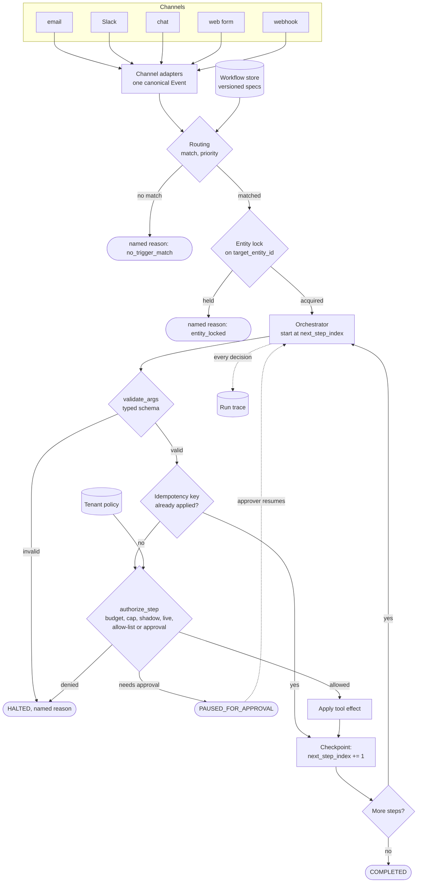

# Agent Platform for Non-Technical Users

*A business user must be able to switch on an automation that moves real money, without being able to read the code that decides whether it should.*

◷ 30 min

An agent platform is a safety and orchestration problem wearing an AI costume. The model can choose which value goes into an argument; everything that decides whether a destructive action runs is code. This page consolidates group G15 of `CASE_STUDY_INDEX.xlsx` into one read for the day before. The group has one whiteboard script and one handbook module that teaches the same built project in prose.

| Case in the group | What it contributes here |
|---|---|
| #8 Agent Platform for Non-Technical Users, 60-min whiteboard script (anchor) | Sections 1 to 12 and 14: the framing, the pipeline, determinism, durability, the guardrail, the two bugs, the close |
| #64 Cascade Robotics, Module 05 running case and code project | Section 13 for what the module adds; its figures run through sections 2, 5, 6, 10 and 11 |
| Self-drill on #8, Drill Add-ons tab | Section 15 |

Sections and tables marked *(own construction)* were built for this page from the sources' arguments and are not in the sources verbatim.

---

## 1. Frame the Round as Trust, Not Tool Selection

Say the framing sentence in the first two minutes, because a design that starts with an LLM choosing tools spends forty minutes on the wrong thing. The mechanics of "LLM picks a tool" were solved years ago. The hard part is handing a non-programmer a button that refunds real money.

> *"Anyone can wire an LLM to a tool call. The hard part is letting someone who has never seen a stack trace configure that safely — which means the system has to make the dangerous decisions itself, deterministically, and never delegate them to the model's judgement in the moment."*

The prompt, verbatim from the DevRev prep guide: *"Design an AI agent platform for non-technical users to configure workflow automations across multiple channels."* Four phrases carry it.

| Phrase in the prompt | What it really means |
|---|---|
| "AI agent" | Something that looks at an event and *takes an action* — reply, refund, escalate, tag — not just answers a question |
| "platform" | Not one workflow: many tenants, each defining many workflows |
| "for non-technical users to configure" | The person building the automation is not a programmer and should never need to read a stack trace |
| "across multiple channels" | The same automation fires from email, Slack, a chat widget, a web form or a raw webhook |

Five clarifying questions actually change the design. Ask them in this order.

| Question | What it decides |
|---|---|
| How non-technical is "non-technical"? | Whether natural-language authoring is a nice-to-have or the whole product |
| Which channels, and do we own each integration? | Slack and webhook are easy; email threading and web-form dedup hide the real work |
| Read-only, or can it act? | Write actions turn this into a guardrail problem instead of a UI problem |
| What is the blast radius of a bad workflow? | A wrong Slack reply is embarrassing; a wrong refund is money. Sets how aggressive the default guardrails are |
| Multi-tenant from day one? | Whether isolation is a retrofit or load-bearing from the start |

Then scope out loud:

> *"I'll design for a multi-tenant platform where non-technical users configure declarative workflows — never code — that can take real, destructive actions under a guardrail service. I'm explicitly not designing the visual builder UI or a natural-language-to-spec compiler — those are their own projects — I'll name what they need to produce and move on."*

## 2. Anchor Every Answer on One $500 Refund

One concrete tenant keeps every later claim testable. Cascade Robotics wants Tier-1 support triage across two channels: a Zendesk webhook for new tickets, and an `#support-escalations` Slack channel for urgent messages. A high-priority ticket gets a drafted reply. A billing complaint also gets an automatic refund up to $50; above that, a human must approve. A duplicate or retried step must never issue a second refund.

The user's request, in their own words: *"If a customer messages us anywhere asking for a refund and it's under $50, just refund them. Don't bother me for small stuff."* The platform must silently guarantee six things the user never has to name.

| Guarantee | Component |
|---|---|
| Email, Slack DM and widget messages become one internal shape before any decision | Channel adapters |
| Only refund messages fire the workflow, and exactly one workflow wins | Routing |
| The workflow went `draft → test → shadow → live` and someone with authority approved it | Staged rollout |
| "Under $50" is a spend-cap check at execution time, not a sentence in a prompt | Guardrails |
| A retried refund call refunds once | Idempotency |
| A restart mid-run resumes rather than restarting | Durable, checkpointed execution |

The demo question that drives the round: *"Why didn't Cascade Robotics' $500 refund fire automatically?"*

| Question | What actually happened |
|---|---|
| Wasn't the workflow autonomous? | Yes — but `issue_refund` was not allow-listed for autonomous use on this tenant, so it still needed a human |
| Wasn't there budget? | The tenant's spend cap is $50. A $500 refund is refused outright — `spend_cap_exceeded` — never silently clamped down to the cap |
| What if it retries and refunds twice? | It cannot — the idempotency key on that action exists after the first apply; a retry is a no-op |

> *"Notice the refund cap isn't a nice-to-have — it's the difference between 'the agent can act autonomously' and 'the agent can act autonomously up to the point where a mistake actually costs real money, and then it stops and asks.'"*

## 3. State Requirements as Testable Constraints

A requirement that cannot fail a test is a preference. The source project proves every safety claim with a deterministic test, including the negative cases, so state requirements the same way. The functional list splits into must-haves and later work *(the split is own construction; the items are the sources')*.

The must-haves are eight:

1. Normalise every channel into one canonical event.
2. Route each event to exactly one live workflow, or to none with a named reason.
3. Store workflows as versioned, declarative specs.
4. Validate typed tool arguments before execution.
5. Checkpoint execution so a crash resumes mid-run.
6. Make destructive side effects idempotent.
7. Run a per-step guardrail covering budget, spend cap, rollout stage and approval.
8. Promote through staged rollout under separation of duties.

The should-haves come after the safety core is trusted. They are a template library with `clone()`, natural-language authoring compiled to a reviewable spec, a plain-language run history, automatic retries around `resume()`, and gradual migration between live versions.

| Constraint | Stated so it can be tested |
|---|---|
| Safety | A destructive action never executes without an explicit human approval or an explicit per-tenant allow-list entry — even on a fully autonomous workflow |
| Money | A $500 refund against a $50 cap is refused outright, never silently clamped; the cap uses the real dollar amount |
| Idempotency | A retried or redelivered action never applies its side effect twice; external call count stays at 1 |
| Durability | A crash mid-run never re-runs a step that already completed |
| Runaway | A 30-step workflow halts at a 5-step cap instead of looping |
| Concurrency | A second run on an in-flight ticket is refused with `entity_locked` |
| Separation of duties | Nobody can promote their own workflow, and no stage can be skipped |
| Tenancy | Every event, workflow and policy carries `tenant_id`; guardrail caps are per tenant; routing matches only a tenant's own workflows |
| Auditability | Every guardrail decision, allowed or denied, is on the run's event log with a named rule and reason |
| Testability | 21 tests, deterministic, no LLM, well under a second |

Every must-have then needs an owner in the architecture *(own construction)*.

| Requirement | Primary component |
|---|---|
| One shape for every channel | Channel adapters |
| Exactly one workflow per event | Routing: priority plus entity lock |
| Declarative, versioned workflows | Workflow store |
| Typed arguments | Tool registry with `validate_args()` |
| Crash-safe execution | Orchestrator checkpoint, `next_step_index` |
| No double side effect | Idempotency store keyed `{run_id}:{step_name}` |
| Budget, cap, stage, approval | Guardrail engine, `authorize_step()` |
| Rollout discipline | `promote()` with role checks |
| Replayable record | Run trace |

## 4. Draw the Architecture End to End

Write the nouns before the boxes, because the nouns are the contract every box shares:

```
Event · Channel · WorkflowSpec (versioned) · Trigger · Step · Tool · Run · Guardrail · Principal
```

Then narrate one event before drawing. A ticket webhook arrives, and a channel adapter normalises it into a canonical event. Routing finds the highest-priority live workflow that triggers on it and checks that no other run is already active on that ticket. The orchestrator executes the workflow's steps one at a time and checkpoints after each. A non-destructive step, such as drafting a reply, just runs. A destructive one, such as issuing a refund, goes through the guardrail first. It checks whether the workflow is live enough to act, whether this tool is allow-listed for autonomous use, whether a human is needed and whether it fits the spend cap. If it passes, it executes with an idempotency key, so a retry can never double-refund. Every decision, allowed or denied, is logged.

The anchor's board, verbatim. Label the two independent decisions in routing.

```
  raw payload (any channel) --> ADAPTER --> canonical Event
                                                  |
                                                  v
                                    ┌─────────────────────────┐
                                    │  ROUTING                 │
                                    │  1. priority match        │  <- design-time: which SHOULD run
                                    │  2. entity lock check      │  <- run-time: can TWO ever run
                                    └─────────────────────────┘
                                                  |
                                                  v
                              ┌───────────────────────────────────┐
                              │  ORCHESTRATOR (durable, checkpointed) │
                              │   step -> validate args -> guardrail  │
                              │   -> execute (idempotent) -> checkpoint│
                              └───────────────────────────────────┘
                                                  |
                                    COMPLETED / PAUSED_FOR_APPROVAL / HALTED
```

The full platform adds the authoring plane and the stores *(own construction from the sources' components)*. The authoring plane changes what may run; the runtime plane decides whether a given step runs now.

```
 AUTHORING PLANE (slow, human)                     RUNTIME PLANE (every event)
 ┌──────────────────────────────┐                 ┌───────────────────────────────────────────┐
 │ builder / NL-to-spec (gap)   │                 │ email  slack  chat  web_form  webhook     │
 │        │                     │                 │   └──────┴──────┴──────┴────────┘         │
 │        v                     │                 │           CHANNEL ADAPTERS                │
 │ WorkflowSpec (DRAFT)         │                 │                  │ canonical Event        │
 │        │  promote()          │                 │                  v                        │
 │        │  approver/admin     │   all_live()    │ ROUTING: match -> priority -> entity lock │
 │        v  one stage at a time├────────────────>│                  │                        │
 │ WORKFLOW STORE (versioned)   │                 │                  v                        │
 └──────────────────────────────┘                 │ ORCHESTRATOR loop (from next_step_index)  │
                                                  │   resolve args -> validate_args()         │
 ┌──────────────────────────────┐                 │   -> idempotency check (replay = no-op)   │
 │ TENANT POLICY                │  caps,          │   -> authorize_step()  <──── policy       │
 │ spend_cap_usd, max_steps,    ├── allow-list ──>│   -> apply side effect -> CHECKPOINT      │
 │ allowed_destructive_tools    │                 │                  │                        │
 └──────────────────────────────┘                 │     tools: draft_reply  tag_ticket        │
                                                  │            issue_refund* close_ticket*    │
 ┌──────────────────────────────┐                 │            (* destructive)                │
 │ HUMAN APPROVER (role-checked)├── approval ────>│                  │                        │
 └──────────────────────────────┘                 └──────────────────┼────────────────────────┘
                                                                     v
                              STORES: lock store · idempotency store · run store + trace
```



| Component | Job | What goes wrong without it *(own construction)* |
|---|---|---|
| Channel adapters (`from_webhook`, `from_slack`, `from_email`) | Translate each payload once into `Event` | Every downstream component learns every channel, forever |
| Canonical `Event` | `channel`, `event_type`, `tenant_id`, `target_entity_id`, `payload`, `raw_ref` | No tenant scope, no lock key, no audit pointer |
| Routing (`matching_workflows`, `route`) | Highest-priority live workflow, or a named non-selection | Two workflows both claim the event, or a silent no-op |
| Entity lock (`acquire_lock`, `release_lock`) | One active run per target entity | A priority misconfiguration becomes a concurrent-mutation bug |
| Workflow store (`WorkflowStore`) | Every version kept; a run pins to its version | Editing a workflow changes runs already in flight |
| Tool registry (`REGISTRY`, `validate_args`) | Typed schema, required fields, `destructive` flag, `scopes` | A hallucinated or wrong-typed argument reaches a real system |
| Orchestrator (`run_workflow`, `resume`, `_continue`) | Walks the step list, checkpoints after each step | A crash re-runs completed steps |
| Idempotency store (`_apply_side_effect`) | First apply of a key wins; repeats are no-ops | A redelivered event refunds twice |
| Guardrail engine (`authorize_step`) | Five ordered deny rules, two allows | A destructive step runs without authority |
| Tenant policy (`GuardrailPolicy`) | Spend cap, max steps, autonomous allow-list | One tenant's risk appetite applies to another |
| Promotion (`promote`) | One stage at a time, approver or admin only | An author ships their own workflow straight to live |
| Run trace (`observability.py`) | Every decision with rule and reason | Nobody can say why a refund did or did not fire |

## 5. Translate Every Channel Once, at the Edge

Normalise at the first layer and nowhere else. If channel-specific logic leaks past the adapter, every later component must know every channel forever.

The canonical `Event` has six fields, and five carry the design. `channel` and `event_type` are what triggers match on. `tenant_id` scopes everything downstream. `target_entity_id` is what the entity lock keys on. `raw_ref` means normalisation is not destruction: the original is always recoverable for audit. Downstream of the three adapters, nothing knows which channel an event came from except by reading `event.channel`. Adding a sixth channel is one new adapter and zero changes anywhere else.

The Slack adapter shows why adapters are more than field mapping. It classifies `urgent_message` against plain `message` from the raw flag. That is how Cascade Robotics' `wf_slack_escalation` workflow triggers only on urgent messages.

## 6. Route Twice: Priority for Configuration, a Lock for Safety

Routing asks two independent questions, so it runs two independent checks. Priority answers a configuration question: which workflow is *supposed* to win. The entity lock answers a safety question: can two workflows ever mutate the same ticket at once.

Routing runs in three steps. First, match: return every workflow whose tenant, status and trigger fit, where a `Trigger` is `(channel, event_type, priority)`. A `DRAFT` workflow never matches a real event, and that single rule is what makes authoring safe. Second, prioritise: the highest `priority` wins. Third, lock: `acquire_lock(target_entity_id, run_id)` refuses if another run is active on the same entity. `route()` returns the selected workflow or a named reason, `no_trigger_match` or `entity_locked`. It never returns a silent no-op.

Cascade Robotics' fixture builds the conflict on purpose. `wf_ticket_triage` at priority 10 and `wf_legacy_ticket_tagger` at priority 1 share the trigger `webhook / ticket.created`. The triage workflow wins.

> *"Priority answers which workflow SHOULD run. A lock answers whether two ever CAN run at once — two different questions, two different checks."*

Build only priority, and a configuration mistake becomes a concurrent-mutation bug. Build only the lock, and there is no way to say which workflow should win. The lock holds even when two workflows are accidentally given the same priority.

## 7. Keep Control Flow in Data, and Let the Model Fill Only Typed Values

The signal the prompt tests is whether deterministic control flow is split from probabilistic reasoning. The model may decide *that* a refund is warranted. It never decides the shape of the call that moves money.

```
  Bad:   tool_call("issue a refund of about fifty dollars for this order")
  Good:  issue_refund(order_id: str, amount_usd: float)   <- typed, validated BEFORE execution
```

A `WorkflowSpec` is a declarative document: `workflow_id`, `version`, `status`, `triggers`, `steps`, `max_steps`, `max_cost_usd`. Each `Step` names a tool and an `args_template`, such as `{"amount_usd": "{payload.refund_amount}"}`, resolved from the event at execution. The orchestrator does not execute the spec as code; it walks it. Nobody, human or model, changes the list at runtime.

That is exactly the artefact a non-technical user can review. *"Refund anyone under $50"* becomes a form showing the trigger, the `amount < $50` condition and the `issue_refund` action. The user confirms it before anything runs. The user approves a form instead of trusting a black box.

Five determinism controls are all built and tested.

| Control | What it prevents | Where |
|---|---|---|
| Constrained tool schemas over free-text arguments | A hallucinated or wrong-typed argument reaching a real system | `validate_args()`, before execution |
| Idempotency keys on side-effecting calls | A retried step applying its side effect twice | Orchestrator (section 9) |
| Max-step and max-cost budgets, halt and escalate | A runaway run | `authorize_step()`, tighter of workflow and tenant (section 10) |
| Confirmation gates on destructive actions, per tenant and tool | An irreversible action without authority | Guardrail approval plus per-tenant allow-list (section 10) |
| Deterministic control flow split from probabilistic reasoning | The model improvising what happens next | The fixed, declarative step list |

The registry holds four tools: `draft_reply`, `issue_refund`, `close_ticket`, `tag_ticket`. Two are destructive and two are not. `destructive` is declared once at registration, so the guardrail asks "is this one of the tagged ones?" and never "does this call look risky?" A guardrail cannot reason about risk it is not told about explicitly. `scopes` lists what the tool may touch, which is the start of least privilege for connector credentials.

The non-technical half of the problem has five constraints, and the sources are honest about which exist.

| Constraint | In plain language | Built? |
|---|---|---|
| Templates, not a blank canvas | Clone "Auto-refund small orders" and change the numbers | ❌ `clone()` over pre-built specs is the low-effort fix |
| Plain English compiles to a reviewable spec | The sentence becomes a form you confirm | 🟡 The spec is the form; the compiler is not built |
| A test mode where nothing happens | Shadow mode fakes every write | ✅ `SHADOW` blocks every destructive step unconditionally, even for an admin |
| Run history in human words | "Refunded 12, escalated 2, denied 1 for exceeding the cap" | ❌ The trace is structured; a sentence per step is low effort |
| Staged rollout, like a driving test with levels | One stage at a time, and the author cannot grade their own test | ✅ `promote()` |

Versioning follows from the same idea. `WorkflowStore` keeps every published version, and a `Run` pins to the version it started on. Editing a workflow mid-flight never changes runs already in progress.

## 8. Checkpoint Every Step and Run One Loop for Resume

A recovery path that is different code from the normal path gets tested only during incidents. So there is no recovery path. There is one loop that always starts wherever `next_step_index` says.

```
  Run 1: step 0 (draft) -> CHECKPOINT -> step 1 (refund, needs approval) -> PAUSED

  [process restarts / human takes an hour to approve]

  resume(): reads next_step_index=1, re-enters at step 1 - step 0 NEVER re-runs.
  Approval granted -> step 1 executes -> idempotency_key = "run_id:refund" recorded.

  If step 1 is somehow attempted again (a redelivered event, a retry):
  same idempotency_key already exists -> no-op. The refund never fires twice.
```

The checkpoint is not a separate mechanism; it is one integer on the `Run`. `resume()` and a fresh `run_workflow()` call the same `_continue()` loop, so the recovery path is exercised on every run. The demo proves it by actually crashing. `run_workflow(..., crash_after_step=0)` sets the state to `CRASHED` after the checkpoint is saved, and `resume()` continues from step 1. The external call count shows step 0 never ran again.

A run ends in exactly one of `COMPLETED`, `PAUSED_FOR_APPROVAL` or `HALTED_BUDGET`, plus `CRASHED` as a transient state that `resume()` clears. There is no fourth "it just stopped and nobody knows" path.

The verified happy path, from `scripts/run_workflow_demo.py`: `run_001` on `wf_ticket_triage` v1. Step 0, the draft, is applied at 0.02 USD. Step 1, the refund, is denied without approval and the run pauses. An approver resumes it, the refund applies, and the run completes.

> *"There's no separate crash-recovery code path. `resume()` and a fresh run call the exact same loop — it always starts at `next_step_index`, whether that's 0 or the middle of a long-running workflow. One loop, one set of bugs to find, not two."*

## 9. Key Idempotency on the Action, and Cover Every Side Effect

A run legitimately retries after a transient failure, so a run-level "already started" flag cannot stop one step from firing twice. The key goes on the action: `idempotency_key = f"{run_id}:{step_name}"`. `_apply_side_effect()` returns `True` only the first time a key is seen. Reruns of the loop are fine; reruns of an already-applied side effect are not. The verified result: before retry, 1 apply; after retry, still 1 apply.

Two real bugs from building the project are the strongest material in the round. Tell them as stories.

**Bug 1: the spend cap checked the wrong number.** A $500 refund on a workflow with a $5 spend cap passed authorisation. The cost function charged a flat, nominal fee per tool call, which is fine for drafting a reply. The refund used the same fee, so the cap was checking against $0.00 every time. It conflated the operational cost of running a step with the dollars that step spends on the customer's behalf. The fix: a financial tool's cost is the real amount in its own arguments, `args["amount_usd"]`.

**Bug 2: idempotency covered the side effect but not its cost.** After the first fix, an approved run whose refund step was retried started failing with `spend_cap_exceeded`. Nothing extra had happened in the real world. The idempotency guard correctly skipped the second refund, but the retry still went through `authorize_step()` and its cost was added to the run total again. The fix moves the idempotency check before authorisation. A replay of an applied key is a free, pre-authorised no-op that never touches the budget or the approval logic.

> **"Idempotency has to cover every side effect of a step, not just its most obvious one."** Cost accounting is a side effect too.

The anchor links bug 1 to a false-security-alarm bug in the RAG project. Both are safety checks that look like they measure something while quietly measuring the wrong quantity. Note one detail when quoting: the story uses a $5 cap, while the Cascade Robotics tenant policy uses $50. Both figures are the sources'; they are different scenarios.

## 10. Deny in a Fixed Order, and Let Deny Override

Every step of every run goes through one decision. `authorize_step()` returns `Decision(allowed, rule, reason)`, and deny overrides allow.

| # | Rule | Denies when |
|---|---|---|
| 1 | `step_budget_exceeded` | The run has used its step allowance, the tighter of the workflow's `max_steps` and the tenant's |
| 2 | `spend_cap_exceeded` | This step's real cost, the actual refund amount for a financial tool, would exceed the cap, again the tighter of workflow and tenant |
| 3 | `shadow_mode` | The workflow is in `SHADOW`; destructive steps never execute here, regardless of role or approval |
| 4 | `not_live` | The workflow has not been promoted to `LIVE` |
| 5 | `needs_human_approval` | Destructive, not allow-listed for autonomous use on this tenant, and no approver present |
| — | `autonomous_allowlisted` / `human_approved` | The two ways a destructive step is actually allowed to run |

Non-destructive steps pass after the two budget checks. Destructive steps must clear all five rules and then match one of the two allows. The whiteboard script draws the same logic as a seven-line ladder, with "non-destructive? just run it" as its third rung. The handbook's five-rule table is the cleaner version to draw.

The step budget and the spend cap count different things; they are not two severities of one check. The step budget counts how many steps a run has taken, so it catches a loop no matter how cheap each step is. The spend cap counts the dollars one step is about to spend, so it catches one expensive action on step one. Both halt and escalate. Neither retries, and neither clamps the amount down to fit.

> **"Autonomous status raises the ceiling on which actions can skip approval. It never removes the ceiling itself."**

The tenant policy is `GuardrailPolicy(spend_cap_usd, max_steps, allowed_destructive_tools_autonomous)`. A workflow can be tighter than its tenant's policy but never looser. The allow-list belongs to the tenant alone.

Build the negative control for anything claimed safe. `scripts/demo_guardrail_failure.py` shows seven denials. `wrong_role`: the author cannot promote their own workflow. `cannot_skip_stage`: draft cannot jump to autonomous. `type_mismatch` or missing arguments: rejected before execution. `not_live`: a draft workflow never fires a destructive step. `spend_cap_exceeded`: a 500 USD refund against a 50 USD cap is refused, not clamped. `step_budget_exceeded`: a 30-step workflow halts at the 5-step cap. `entity_locked`: a second run on an in-flight ticket is refused. A demo that shows things being stopped proves more than one that shows things working.

## 11. Make Autonomy Something a Workflow Earns Through Four Gates

A workflow moves `DRAFT → TESTING → SHADOW → LIVE → AUTONOMOUS`, one stage at a time. Only an approver or admin may promote it, never its author. Each stage removes exactly one kind of "we don't actually know yet".

| Stage | The one question it answers | What breaks if skipped |
|---|---|---|
| `DRAFT` | Is this even wired correctly? | The first idea is tested against real customer messages |
| `TESTING` | Does it behave correctly on realistic input, run against sample or historical data? | It is found wrong only once it is watching live traffic |
| `SHADOW` | Does it decide correctly on live traffic, with every write mocked? | Bad decisions surface only after a real refund |
| `LIVE` | Will a human still vouch for each individual action? | Straight from "looked fine in shadow" to acting alone |
| `AUTONOMOUS` | Has it earned the right to act without asking every time? | The destination, not a gate; the same guardrails still apply |

Fewer gates lose a distinct answer. Merge `TESTING` into `SHADOW` and cheap, repeatable replay disappears. Merge `SHADOW` into `LIVE` and debugging moves into production. More gates add stages someone must remember to promote through. The guardrail policy already scales risk within a stage.

`promote(store, workflow_id, to_status, signer)` denies two things. `wrong_role` stops an author promoting their own work; only an approver or admin can promote at all. `cannot_skip_stage` stops a jump from `DRAFT` to `LIVE`. The identity fixture includes `u_author_wrong_hat`, a negative control proving an author cannot approve their own work however the request is framed.

The same mechanism answers the two follow-ups the round always gets. How does a user try a workflow before it is live? Shadow mode. How is a bad one stopped mid-flight? The step and spend budget halts it, and the entity lock stops a second run compounding the damage.

## 12. Name the Gaps Before the Interviewer Does

The source project contains no LLM at all, on purpose, so every property can be proven with fast, reproducible tests. State that plainly, and never imply the demo proves an LLM planner is safe.

| Gap | Status | What to say |
|---|---|---|
| Planner | 🟡 Fixed step list | Swapping in an LLM or rule engine that picks the next tool is a moderate change. The architecture stays: a reasoning loop with deterministic guardrails around it |
| Authoring surface | 🟡 / ❌ | The spec is what a builder would serialise to. NL-to-spec needs a real LLM call, and its output enters at `DRAFT` behind the same `promote()` gate |
| Automatic retries | ❌ | `resume()` is correct, but nothing calls it automatically. A retry wrapper with backoff is low effort because idempotent resumption is done |
| Connector secrets | ❌ | A `Connector` model referencing a vault secret is moderate work; the vault itself is infrastructure |
| PII redaction | ❌ | Low effort. The RAG project's `redact_pii()` is reusable on step outputs before a human sees them for approval |
| Custom tools | 🟡 | Schema validation and scoping exist. Sandboxed execution and review-before-publish reuse `promote()`'s role-gated pattern |
| Gradual version migration | ❌ | A `traffic_split` on the spec, consulted by routing |

The scale answer is one sentence of mechanism and one of storage:

> *"Every lock and idempotency key in this demo lives in an in-process dict - correct in shape, wrong in storage. At real volume that becomes a distributed lock (Redis, or a unique-constraint row in a database) and a durable idempotency store shared across workers. The mechanism doesn't change - `acquire_lock`/`release_lock` stay the same two functions - only where they're backed changes."*

The failure table tells the interviewer what a workflow does, not what breaks.

| Fails | Behaviour |
|---|---|
| A step's arguments don't validate | Rejected before execution; run halts with a named reason |
| A destructive step needs approval that never comes | Run stays `PAUSED_FOR_APPROVAL` indefinitely; it does not silently expire into either action |
| A workflow runs away (misconfigured self-trigger) | Halts at the step budget |
| The process crashes mid-run | Resumes from the last checkpoint; the completed step never re-runs |
| An event is redelivered (at-least-once channel semantics) | The idempotency key makes the redelivery a no-op |

## 13. Read Cascade Robotics as the Anchor in Prose

Member #64 is the same built project taught as a seven-document course, Module 05, with a runnable lab. The design is identical, and nothing in the anchor is contradicted. It adds four things.

First, the three-layer map that organises the whole answer:

```
 LAYER 3   "Is this user allowed to configure/run this, and did we ask a human when we should have?"
              -> guardrails: approvals, spend caps, staged rollout (draft/test/shadow/live)

 LAYER 2   "If this runs twice by accident (retry, crash, redelivery), does it break something?"
              -> idempotency keys, checkpointed/resumable execution

 LAYER 1   "No matter which channel this came from, does it look the same to everything downstream?"
              -> a canonical event schema + one adapter per channel
```

A weak answer spends its time on Layer 1 and waves at an LLM doing reasoning. A strong answer spends most of it on Layers 2 and 3, because that is where real incidents happen: double refunds, a skipped human check, a re-run completed step.

Second, the case-study fixture, `project/data/case_study.json`. The tenant is `cascade_robotics`, with three workflows. `wf_ticket_triage` runs at priority 10 on `webhook / ticket.created`. `wf_legacy_ticket_tagger` runs at priority 1 on the same trigger, to demonstrate the conflict. `wf_slack_escalation` runs at priority 10 on `slack / urgent_message`.

Third, the cross-project shape. The RAG platform, this agent platform and the delivery framework all return `Decision(allowed, rule, reason)` from a named policy where deny overrides. The three functions are `authorize_step()` here, `sign_off()` in the delivery framework and `decide()` in enterprise RAG. Access control, delivery gates and workflow guardrails are the same kind of problem wearing three different hats. That line works well as a bridge when the interviewer has seen the G01 or G12 design.

Fourth, the coverage map's discipline: every claim is marked *built and runnable* or *known but not demonstrated*, with an effort label to close it. The punch list, by effort:

- **Low:** template library with `clone()`, a retry wrapper around `resume()`, PII redaction on step outputs, a plain-language run summary.
- **Moderate:** a `Connector` model with a vault abstraction, a real planner, sandboxed custom-tool review, canary migration between versions.
- **Large:** a visual builder, and a real secrets manager with a distributed lock store.

The module's one-breath restatement is worth memorising:

> *"We're building the safety and orchestration layer that sits between a non-technical user's plain-English intent and a real, destructive action — so that no matter which channel the trigger came from, the action only runs when it's actually supposed to, runs exactly once, and survives crashes and retries without ever surprising anyone."*

## 14. Deliver It in Sixty Minutes

Announce where the risk is, then spend the hour there. The channel adapters are comparatively boring.

> *"The hardest part of this system is making the dangerous decisions deterministic instead of delegated to the model. I want to spend my time on the guardrail engine and the orchestrator."*

| Minutes | Phase |
|---|---|
| 0–8 | Clarify and scope: five questions, the framing sentence, Cascade Robotics (sections 1, 2) |
| 8–12 | Entities and the happy path, narrated before drawing (section 4) |
| 12–20 | The architecture, with the two routing decisions labelled (sections 4, 6) |
| 20–40 | Deep dive: determinism, the guardrail, the two bugs, durability (sections 7 to 10) |
| 40–55 | Cross-cutting and failure: tenancy, security, observability, failure table, scale (sections 11, 12) |
| 55–60 | Close: three sentences, trade-offs, week one |

The three-sentence close:

> *"A multi-channel platform where every dangerous decision - which workflow runs, whether a destructive step executes, whether a retry can double-apply a side effect - is deterministic and enforced in code, never delegated to the model in the moment. Workflows are declarative and versioned, promoted through a staged rollout the same way a person earns more autonomy over time. Durability and idempotency mean a crash or a redelivered event is a non-event, not an incident."*

| Decision | Chose | Would revisit if |
|---|---|---|
| A fixed step-list planner over an LLM reasoning loop | Deterministic, testable, free | The task space is open-ended enough that a fixed plan cannot cover it; then a model picks the next tool inside the same guardrail |
| Priority plus entity lock over one ranking mechanism | Two independent checks | Conflicts became rare enough that the lock is not worth it — unlikely, since the lock makes a misconfigured priority merely wrong instead of dangerous |
| In-process locks and idempotency store | Simple, fast for a demo | Any real deployment on day one |

The forward-deployed close, which must not be skipped:

> *"If I were shipping this, week one isn't the full agent runtime. It's: one channel, one non-destructive workflow, the guardrail engine, and the staged rollout - prove that a non-technical user's workflow genuinely can't take an unapproved destructive action, before anyone argues about which LLM plans the steps."*

The lines that carry the round:

1. *"The model decides THAT something should happen. A typed, validated function signature decides HOW - that boundary is where determinism lives."*
2. *"Autonomous status raises the ceiling on what can skip approval. It never removes the ceiling."*
3. *"One execution loop, not two - resume and a fresh run share the exact same code path."*
4. *"An idempotency key is on the action, not the run - because a run can legitimately retry, but one specific side effect must never apply twice."*
5. *"Priority answers which workflow SHOULD run. A lock answers whether two ever CAN run at once."*
6. *"A halted run with a named reason beats a workflow that loops until someone notices."*

Questions to ask them: how much of their agent configuration is already declarative versus code? Does the guardrail decision live in the platform or in each connector? What is the story for a workflow that acts across two channels in one run? How does a workflow earn autonomous status?

With a laptop, run `python scripts/run_workflow_demo.py`, then `python scripts/demo_guardrail_failure.py`, then `pytest -q` for 21 deterministic tests. The durability demo is the most persuasive artefact. A run crashes mid-flight and resumes, and the completed step provably never re-runs.

## 15. Stop Runaway Automations Before the Invoice Does

The interviewer's cost pivot is "users built automations and the bill exploded." Non-technical users will build loops. The platform bounds them, because the users cannot.

| | |
|---|---|
| Dominant driver | Retries and loops in user-authored automations, with no budget owner per tenant |
| Cheapest lever first | Per-automation step and token caps; per-tenant budgets with a circuit breaker; idempotency keys on every action; deterministic events instead of free-text triggers |
| Metric that proves it | Cost per automation run; steps per run; runaway kills per day; cost per tenant |
| Do not | Trust users to write bounded workflows |
| 60-second line | Non-technical users will build loops. The platform bounds them: caps per run, a budget per tenant, idempotent actions, and a breaker that trips before the invoice does. |

Most of the levers are already in the design, which is the point to make aloud *(own construction)*. The step budget is the per-run cap, and `max_steps` is the tighter of workflow and tenant. The spend cap already meters real dollars before the action, not after. The idempotency key already stops a redelivered event paying twice for the same work. The per-tenant breaker and token metering are the additions. Meter model tokens per run into `total_cost_usd` alongside tool cost, and trip the tenant's breaker when the day's spend crosses its budget.

Bug 2 belongs in this answer too. Cost accounting is a side effect, so a replayed step must not be billed twice.

Every strong cost answer is generated by four verbs in order. Measure cost per run and per tenant first. Route deterministic events to deterministic handling, and use a model only where judgement is needed. Bound runs with step caps, spend caps and the breaker. Cache safely, never across tenants.

---

## Key Takeaways

- The hard part is trust, not tool selection, and the framing sentence goes on the board in the first two minutes.
- One $500 refund against a $50 cap, on an autonomous workflow without an allow-list entry, anchors every later claim.
- Requirements are stated as testable guarantees, and each has a named owner in the architecture.
- One diagram shows adapters, two-check routing, a checkpointed orchestrator and a guardrail on every step, with three named exits.
- Every channel is translated once at the edge into a six-field canonical event.
- Priority answers which workflow should run, and the entity lock answers whether two can run at once.
- The workflow is declarative data the orchestrator walks, and the model fills only typed, validated values.
- The checkpoint is `next_step_index`, and resume and a fresh run share one loop.
- The idempotency key is on the action, and the replay check runs before authorisation because cost is a side effect too.
- Five ordered deny rules decide every step, and autonomy raises the ceiling without removing it.
- Four rollout gates each answer one question, and only someone other than the author may promote.
- The no-LLM choice and the in-process stores are named gaps with sized fixes, not hidden ones.
- Cascade Robotics is the anchor in prose, adding the three-layer map, the fixture and the shared decision shape.
- The hour goes to determinism, the guardrail and durability, and the close is a week-one plan.
- The cost pivot is answered with caps per run, budgets per tenant, idempotent actions and a breaker.

## Check Yourself

1. **Why is "the hard part is trust" a stronger framing than "the hard part is tool selection"?** Tool calling is solved; the tested question is how a non-programmer can trust an automation to do only what they meant under model error, retries and crashes.
2. **Why did Cascade Robotics' $500 refund not fire on an autonomous workflow?** `issue_refund` was not on the tenant's autonomous allow-list, and $500 exceeded the $50 spend cap. It was refused, not clamped.
3. **Why does routing need both priority and an entity lock?** Priority is configuration, choosing which workflow should win. The lock is safety, stopping two runs mutating one entity, and it holds even when priority is misconfigured.
4. **What does the model decide, and what does it never decide?** It may decide that an action is warranted and which value fills an argument. It never decides the call's shape or the control flow, which are a typed schema and a fixed step list.
5. **Why must `resume()` and `run_workflow()` share one loop?** A separate recovery path is second code whose bugs surface only in incidents; one loop starting at `next_step_index` is exercised on every run.
6. **Why is the idempotency key on the action rather than the run?** A run legitimately retries; keying `{run_id}:{step_name}` deduplicates the specific side effect while letting the loop rerun.
7. **Explain bug 2 in one sentence.** A replayed refund skipped the side effect but was still charged against the spend cap, so the idempotency check moved before authorisation because cost accounting is a side effect too.
8. **Give an example that trips the step budget but not the spend cap, and one that does the reverse.** A 30-step chain of cheap steps halts at a 5-step cap; a single $500 refund trips a $50 cap on step one.
9. **What question does each rollout gate answer?** DRAFT: wired correctly? TESTING: correct on realistic data? SHADOW: correct decisions on live traffic, writes mocked? LIVE: will a human vouch for each action? Then AUTONOMOUS.
10. **What is the scale gap, and why does it not change the design?** Locks and idempotency keys live in in-process dicts; they move to a distributed lock and a durable shared store behind the same functions.
11. **How do non-technical users run up a bill, and what stops it?** They build loops and retries; per-run step and token caps, per-tenant budgets with a breaker, and idempotent actions bound it.

## References

All paths are relative to `06_Interview_Prep/`.

| Section | Source |
|---|---|
| 1, 2, 4, 6–12, 14 | `Handbook/09_AI_System_Design_Casebook/whiteboard_scripts/03_Agent_Platform_For_Non_Technical_Users.md` (the anchor, #8) |
| 1, 2, 13 | `Handbook/05_Agentic_Workflow_Platforms/01_The_Problem_In_Plain_English.md` (#64) |
| 4, 5, 6 | `Handbook/05_Agentic_Workflow_Platforms/02_Canonical_Events_And_Channels.md` |
| 7 | `Handbook/05_Agentic_Workflow_Platforms/03_Determinism_Over_Free_Text.md` |
| 8, 9 | `Handbook/05_Agentic_Workflow_Platforms/04_Durability_And_Idempotency.md` |
| 3, 10, 11 | `Handbook/05_Agentic_Workflow_Platforms/05_Approvals_Spend_Caps_Staged_Rollout.md` |
| 4 (component names) | `Handbook/05_Agentic_Workflow_Platforms/06_Module_Reference.md` |
| 12, 13 | `Handbook/05_Agentic_Workflow_Platforms/07_Coverage_Map.md` |
| 2, 6, 13 | `Handbook/05_Agentic_Workflow_Platforms/project/data/case_study.json`; `project/README.md` (verified results, 21 tests) |
| 15 | `CASE_STUDY_INDEX.xlsx`, Drill Add-ons tab, self-drill row for #8 |
| 3 (split and owner table), 4 (full-platform ASCII, Mermaid, failure column), 15 (mapping levers onto the design), and every item marked own construction | Built for this page from the sources' arguments; not source material |
