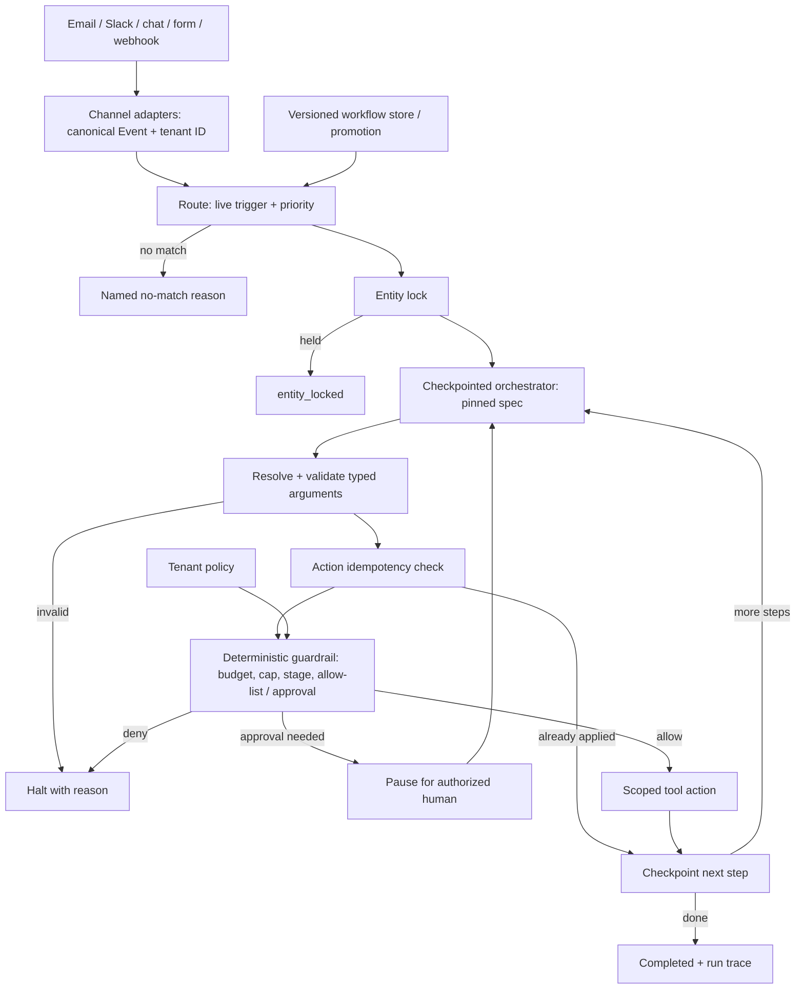

# G15 — Agent Platform for Non-Technical Users: Main Interview Guide

**No-code agent process** is: a support lead draws a workflow — reply, tag, refund — without writing Python. The hard part is a real refund happening **once**, and stopping if the box crashes.

**G15 covers one slice:** events in, versioned spec, guardrails, durable steps. A future LLM may draft a spec; the demo engine is deterministic.

End to end, as Cascade’s “small refunds without a human”:

1. **Email/Slack becomes a canonical event** with tenant id.
2. **One live workflow matches**, or we record why none did. Entity lock so two copies don’t double-pay.
3. **Each step checkpoints.** Arguments must match the schema.
4. **A $500 refund hits a $50 cap** — refuse, don’t clamp to $50.
5. **Approval pause or allow-list.** Then one idempotent write.
6. **Crash mid-way resumes from the checkpoint**, not from “guess we should refund again.”

That’s it: **event → one spec → guardrail → execute once → recover.** Authors cannot secretly approve their own live refunds.

> **Full source:** [G15_Agent_Platform_For_Non_Technical_Users.md](G15_Agent_Platform_For_Non_Technical_Users.md), especially §§1–12 for the anchor and §13 for Cascade Robotics. Use the [Deep Dive](G15_Agent_Platform_For_Non_Technical_Users_Deep_Dive.md) for guardrail and recovery mechanics and the [Cheat Sheet](G15_Agent_Platform_For_Non_Technical_Users_Cheat_Sheet.md) for rehearsal.

## The anchor and its related case

The anchor asks for a multi-tenant platform where non-technical users configure workflows across channels that may reply, tag, escalate or issue a refund. The hard part is ensuring a real action is authorized, executed once and recoverable after a crash.

| Case | Shared foundation | What changes |
|---|---|---|
| #8 Agent platform whiteboard anchor | Canonical events, declarative specs, deterministic guardrails and durable runs | Explain the platform design and negative cases in 60 minutes. |
| #64 Cascade Robotics handbook/project | Same workflow engine and safety controls | Shows the $500 refund against a $50 cap, conflicting workflows, a runnable demo and implementation gaps. |

## Questions to ask the interviewer

| Question to ask | What it's really asking | What you then decide |
| --- | --- | --- |
| How non-technical is the author: forms, templates or plain-English creation? | Do they pick a template, fill a form, or type “refund angry VIP emails”? | Authoring UI and the reviewable spec. |
| Which channels and who owns their integrations? | Is Slack ours, and if two copies of the same email arrive, who dedups? | Adapters, threading, and dedup. |
| Are actions read-only, reversible or destructive? | Tag a ticket, or refund $500? | Approval, spend caps, and audit. |
| What is the blast radius of a bad workflow? | If someone publishes a loop, can it refund every customer tonight? | Default budgets and rollout gates. |
| Is multi-tenancy required from day one? | Can Acme’s workflow accidentally run on Globex’s tickets? | Tenant ID on every event, spec, lock, and policy. |

## Requirements: Functional + Non-Functional

The easiest way to frame requirements in an interview is:

> **Functional = what the system does. Non-functional = how well it does it and what constraints it must satisfy.**

### Functional requirements — what the system must do

1. **Normalize channels** into a canonical event with tenant id.
2. **Choose one live workflow** or a named non-selection.
3. **Store versioned declarative workflows.**
4. **Validate typed tool arguments.**
5. **Checkpoint every step; deduplicate side effects.**
6. **Apply per-step guardrails.**
7. **Promote with role checks** through draft, testing, shadow, live, autonomous.

A **$500 refund** on a **$50 cap** is refused, never clamped. Autonomous status cannot bypass the cap. `issue_refund` needs allow-list or human approval. A retry cannot refund twice.

### Non-functional requirements — how well / under what constraints

| Requirement | Example target / constraint |
|---|---|
| **Security** | Tenant isolation; no unauthorized destructive action; author ≠ approver. |
| **Spend** | Actual-dollar caps; max steps and cost. |
| **Reliability** | Crash recovery; idempotency under redelivery; one active run per target entity. |
| **Audit** | Every allow/deny recorded. |
| **Demo note** | Source demo: 21 tests, no LLM — safety engine behavior, not a future LLM planner. |

### Interview shortcut

If asked **“What are the requirements?”**, say:

> **“Functionally, one event, one versioned workflow, typed args, checkpointed steps. Non-functionally, tenant isolation, real spend caps that refuse not clamp, recover after crash, execute once.”**

## Architecture

The runtime is a fixed, versioned step list in the demonstrated system. A future LLM may propose a typed value or a draft workflow spec, but code controls routing, argument schema, policy, approval, execution and resumption. An LLM is not present in the source's runnable demo.

### Step-by-step architecture

- Each channel adapter translates a payload once into an event carrying channel, type, tenant, target entity, payload and raw reference.
- Routing matches only that tenant's live workflow, chooses highest priority and returns a named reason if none matches; an entity lock prevents concurrent mutations of the same ticket.
- The orchestrator pins the workflow version and resumes at `next_step_index`, using the same loop for fresh and restarted runs.
- Before a step runs, it resolves values and validates the tool's typed schema. A model may supply proposed values, but cannot change the spec or tool signature in the demo.
- An action-level idempotency key is checked **before** authorization so a replayed side effect is a no-op and is not charged again.
- The guardrail checks the tighter workflow/tenant step and spend caps, shadow/live stage and destructive-tool allow-list or human approval. Deny wins; approval pauses safely.
- Only an allowed step calls the scoped tool. The orchestrator records the outcome, checkpoints, logs every decision and continues or finishes.

## Decisions an interviewer will probe

**Priority versus lock:** priority chooses which workflow *should* run; the lock prevents two from acting at once. They solve different problems. A draft workflow never matches a live event.

**Dollars versus compute cost:** a refund tool must check its real `amount_usd`, not the tiny operational fee for calling the tool. One source bug let $500 pass a $5 cap because it checked the wrong quantity. Another bug charged the cap again on replay even though the refund was deduplicated; moving the idempotency check before authorization fixed it.

**Ordered denial:** step budget → spend cap → shadow mode → not live → human approval if the destructive tool is not tenant-allow-listed. Workflow limits may tighten tenant policy but never loosen it. `AUTONOMOUS` raises which actions can skip approval; it never removes caps.

**Promotion:** `DRAFT → TESTING → SHADOW → LIVE → AUTONOMOUS`, one step at a time. An author cannot sign off their own workflow. Shadow mocks writes; live still needs human approval for actions that have not earned autonomous permission.

**Runaway cost:** measure cost per run and tenant, cap steps and model tokens, add tenant budgets and circuit breakers. Idempotency covers action effects *and* billing. Route deterministic events through rules and use a model only where judgment adds value.

## Rollout, scale and honest gaps

Start with one channel and one non-destructive workflow, then prove negative guardrail cases and staged promotion before enabling refunds. The demo's in-process locks and idempotency dicts are not shared across workers; production needs a distributed lock or database uniqueness and a durable shared idempotency store. The source also lacks a visual builder, natural-language-to-spec compiler, real LLM planner, automatic retry wrapper, secret vault integration, output PII redaction and gradual version migration. A compiled natural-language spec should land in `DRAFT` for review, never straight in `LIVE`.

## Two-minute interview answer

“I would separate what a non-technical user intends from what may safely execute. Each channel becomes one canonical, tenant-scoped event. Routing chooses the highest-priority live workflow, while an entity lock prevents concurrent actions. A versioned declarative spec drives one checkpointed execution loop. Arguments are typed and validated; action-level idempotency is checked before charging or authorization; then deterministic guardrails enforce step limits, the real dollar spend cap, rollout stage and human approval or a tenant allow-list. Only an allowed tool call runs, and every decision is logged. I would prove the $500 refund is refused under a $50 cap, a replay cannot refund twice, and a crash resumes from its checkpoint. The source demo does this without an LLM; a future planner would remain inside these same boundaries.”
