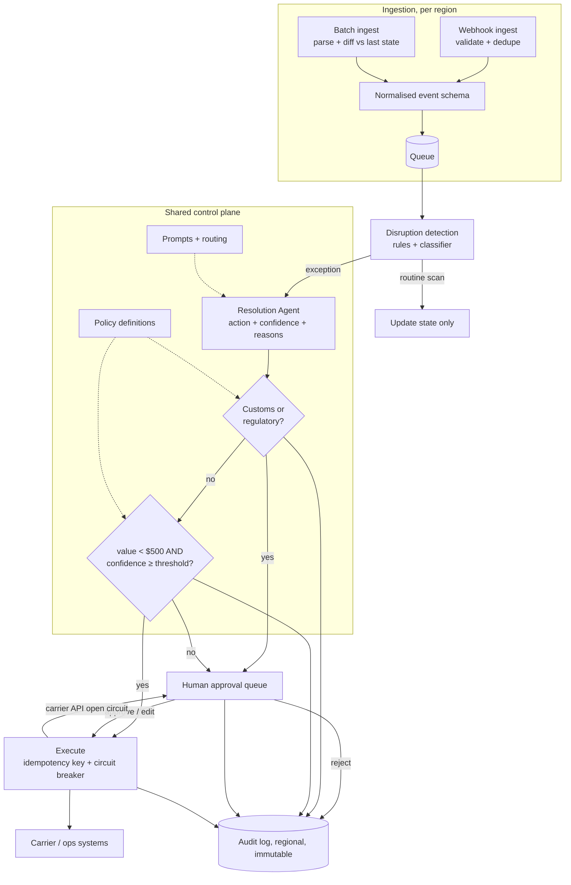

# Logistics Exception Handling and Shipment Rerouting Agent

*The agent has to act fast enough to unstick a shipment, and never act at all on the one class of case the customer will be held accountable for.*

◷ 24 min

This is a low-scale, high-stakes design, not a traffic problem. Only 150 people use it, and the engineering bar is correctness at one decision boundary. This page consolidates group G17 of `CASE_STUDY_INDEX.xlsx` into one read for the day before. It reuses the deny-first gate from G03 and the tenancy ladder from G07, and names them rather than repeating them.

| Case in the group | What it contributes here |
|---|---|
| #5 AI Logistics Exception-Handling Assistant, the FDE round (anchor) | Sections 1 to 9, 12 and 13: the four questions, the gate, both ingestion paths, regional planes, reliability, governance, trade-offs |
| #66 OpenAI FDE prompt: shipment rerouting over SAP, weather APIs and 500 warehouse managers | Section 10, the evaluation plan the prompt demands; section 11, the stakeholder and data-unification delta; follow-ups in section 13 |
| Self-drill on #5 (written for this page) | Section 14 |

Sections and tables marked *(own construction)* were built for this page from the sources' arguments and are not in the sources verbatim. The group has no playbook cost drill, so the whole of section 14 is own construction.

---

## 1. Ask the Four Questions That Decide the Design

This case is framed as an FDE round, and it runs in interview order. Clarifying questions come first, each answer is recorded, and each answer's implication is drawn out. In this format the questions *are* the design.

The prompt: the FDE is embedded with a mid-size logistics customer. They want an AI exception-handling assistant that watches their shipment pipeline and detects disruptions: customs holds, missed carrier scans, weather delays. It either auto-resolves them or drafts a resolution for a human ops agent to approve. It works across multiple carriers and a mix of real-time and batch feeds.

| Asked | Answer | Implication |
|---|---|---|
| **Data volume and freshness per carrier?** | Mixed. ~60% of carriers push real-time webhooks — scan events, status changes — ~200 events/s combined at peak. ~40%, mostly smaller regional carriers, provide batch file drops (CSV/EDI) every 2–6 hours, a few thousand records each | Ingestion needs **both** a streaming path and a scheduled batch path feeding the same pipeline — not a single uniform interface |
| **Who are the users, and what scale?** | Internal only — the customer's ops team. ~150 agents across three shifts, ~40 concurrent at peak during shift handoff, each handling 30–50 cases a day | **Low-DAU, high-stakes-per-interaction.** Scale pressure comes from event throughput, not concurrent users — a very different sizing profile from a consumer assistant |
| **What is the auto-resolve vs human-approval boundary?** | Value- and confidence-based: under $500 shipment value + high confidence → auto-resolve. **Customs/regulatory holds → always human, regardless of confidence.** Over $500, or below the confidence threshold → always human | **The core risk-boundary decision.** It defines a policy layer in front of every auto-resolution, with customs as a distinct always-gated path — not just a low-confidence case |
| **Regional or multi-tenant topology?** | One customer, one assistant experience, operating across US, EU and APAC with different carriers per region — and **EU data cannot leave the EU** | Rules out a single global deployment or data store. Regional data isolation behind one coherent experience |

Each answer moved a box. That adaptation is the signal the round scores. The example the source gives for auto-resolve is concrete: rebooking a missed scan on a known route.

The mock session in the source folder ran exactly these four questions. It ended on the architecture prompt below, which is the place to practise picking up from:

> *"Walk me through your high-level architecture. What are the major components, and how does an event — say, a missed carrier scan — flow through the system from ingestion to either auto-resolution or a human agent's queue?"*

Section 4 is the model answer to that prompt.

## 2. State Requirements as Testable Constraints

A requirement that cannot fail a test is a preference. "Reliable" is a preference. "Zero customs holds auto-resolved, ever" is a constraint, and it is the one that shapes the architecture.

The functional list is the source's. The priority split and the acceptance column are own construction.

| Priority | Functional requirement | Accepted when |
|---|---|---|
| Must | Ingest shipment events from carriers, real-time and batch | Both paths write the same normalised schema; a batch diff emits only changed shipments |
| Must | Detect disruptions: customs holds, missed scans, weather delays | Recall per exception type measured on a labelled replay set (section 10) |
| Must | Classify each exception by type, value and confidence | Every exception reaching the gate carries all three fields; a missing field routes to a human |
| Must | Auto-resolve low-risk, low-value, high-confidence cases | Only under $500, only above the threshold, never customs |
| Must | Draft a proposed resolution for everything else and route it to a human ops agent | The draft shows the action, the signals and the confidence |
| Must | Let an ops agent approve, edit or reject a drafted resolution | Each choice is logged with the agent's identity and the original draft |
| Must | Maintain a full audit trail of every decision, automated or human | Any resolution can be reconstructed from the audit log alone |
| Should | Extend to new carriers without redeploying the core pipeline | A new carrier is an adapter plus config, no pipeline release |

The non-functional list is the source's. The measurable targets in the right column are own construction.

| Quality | Source requirement | Testable form *(own construction)* |
|---|---|---|
| Residency | EU data never leaves the EU | A cross-region query from a US session is refused; replication config has no EU→non-EU path |
| Reliability | A missed exception is a real shipment sitting stuck | Detection recall per type tracked daily; zero dropped events on the queue |
| Latency | Low latency from disruption detection to draft resolution | Time-to-draft p95 tracked separately for real-time and batch carriers |
| Auditability | Every auto-resolution and every human decision traceable | 100% of gate verdicts and agent actions in the immutable log |
| Cost | Cost-efficient at a modest, bounded user scale (150 agents, not millions of consumers) | Cost per resolved exception, with the model called only on detected exceptions |
| Extensibility | New carriers without a redeploy of the core | Adapter contract test passes before a carrier goes live |

The constraint that dominates the rest is the customs rule. It is not a threshold to tune. It is an invariant the gate must hold for every input, including a model that is wrong and confident.

## 3. Size by Event Throughput, Not by Users

This system is not scale-constrained by users. It is constrained by event throughput and correctness. Forty concurrent agents are a single-server load. Two hundred events a second, bursting during a regional storm, is the real sizing problem.

The arithmetic below is own construction from the source's figures. Say it aloud, because it decides where the model sits.

| Quantity | Figure | Consequence |
|---|---|---|
| Real-time events at peak | ~200 events/s | The stream and detection must absorb bursts; a queue sits in front |
| Upper bound per day at the peak rate | 200 × 86,400 ≈ 17.3M events | Far too many to send to an LLM; detection must be cheap |
| Human-handled cases per day | 150 agents × 30–50 ≈ 4,500–7,500 | The model drafts thousands of cases a day, not millions |
| Concurrent approvers at peak | ~40, during shift handoff | The approval queue, not the model, is the human bottleneck |
| Batch drops | every 2–6 hours, a few thousand records each | Batch exceptions surface hours late by design |

The gap between the first two rows and the third is the design. Most events are routine scans. Detection is a rules-and-classifier layer on the stream, and the resolution model runs only on the small fraction that is actually an exception. Put the model on the event stream and cost and latency scale with every scan. Put it behind detection and they scale with disruptions.

## 4. Draw the Architecture End to End

Two ingestion paths, one exception pipeline, a policy gate before anything acts. That sentence is the whole design, and the diagram should say it before any box is explained.

The source's own diagram, kept verbatim:

```
Carriers (60% real-time, 40% batch)
        │
   ┌────┴────┐
Webhook   Batch File
Ingest    Ingest (EDI/CSV, scheduled)
   │         │
   └────┬────┘
        │
Event Normalization & Stream
        │
Disruption Detection Service
   (customs hold · missed scan · weather delay)
        │
Resolution Agent
 (drafts action + confidence score)
        │
   Policy Gate
 (value + confidence + always-human customs rule)
   │            │
Auto-Resolve   Human Approval Queue
   │            │  (ops agent: approve / edit / reject)
   └─────┬──────┘
         │
   Carrier / Ops Systems (execute the resolution)
         │
   Audit Log (every decision, automated or human)
```

The same system drawn with its planes and trust boundaries *(own construction)*. The control plane is shared and versioned identically everywhere. The data plane is one copy per region.

```
 ╔═══════════════════ SHARED CONTROL PLANE (versioned identically in every region) ═══════════════════╗
 ║  agent prompts + tools · model routing · POLICY DEFINITIONS (customs rule, $500, threshold) · UI     ║
 ║  carrier adapter registry · confidence threshold · eval gates · release versions                      ║
 ╚══════════════════════════════════════════════╤═════════════════════════════════════════════════════╝
                                                │ deploys the same logic into each region
 ┌──────────────────────────────── ONE REGIONAL DATA PLANE (US | EU | APAC) ─────────────────────────────┐
 │                                                                                                        │
 │  webhook carriers ─► [Webhook ingest: validate, dedupe] ─┐                                             │
 │                                                          ├─► [Normalise] ─► [Queue] ─► [Detection]     │
 │  batch carriers ──► [Batch ingest: parse, DIFF vs last] ─┘                   (rules + classifier)      │
 │                       state; tag "detected late"                                  │ exceptions only    │
 │                                                                                   ▼                    │
 │                                            [Resolution Agent: draft action + confidence + reasons]     │
 │                                                                                   │                    │
 │  ════════════════════════ TRUST BOUNDARY 1: nothing acts without the gate ═══════╪══════════════════  │
 │                                                                                   ▼                    │
 │                               [POLICY GATE]  1. customs/regulatory? → HUMAN, stop                      │
 │                                              2. value < $500 AND confidence ≥ threshold? → AUTO        │
 │                                              3. otherwise → HUMAN                                      │
 │                                    AUTO │                         │ HUMAN                              │
 │                                         ▼                         ▼                                    │
 │  ═══ TRUST BOUNDARY 2: least-privilege  [Execute]         [Approval queue] ◄── ops agents, this region │
 │      carrier scopes, idempotency key ══  │ circuit breaker    │ approve / edit / reject                │
 │                                          ▼                    ▼                                        │
 │                                  [Carrier / ops systems] ◄────┘                                        │
 │                                                                                                        │
 │  [Event store]   [Audit log: every verdict + action + confidence + reasoning, immutable]               │
 │  ═══ TRUST BOUNDARY 3: no replication out of the region; EU data never leaves the EU ═══               │
 └────────────────────────────────────────────────────────────────────────────────────────────────────────┘
```

The same flow in Mermaid *(own construction)*, with the gate's ordering visible:



Read the components in the order an event meets them. The component names and responsibilities are the source's. The failure column is own construction.

| # | Component | Responsibility | Fails how |
|---|---|---|---|
| 01 | Webhook ingest | Validates, deduplicates and pushes real-time carrier events onto the stream immediately | Closed on a bad payload; events buffer at the carrier's retry |
| 02 | Batch file ingest | Picks up EDI/CSV drops on schedule, parses, diffs against last known state per shipment | Degrades: a late drop is flagged, not silently skipped |
| 03 | Event normalisation and stream | One schema for both paths, queue-backed | Degrades to backlog; alert on depth |
| 04 | Disruption detection | Classifies events into customs hold, missed scan, weather delay | Degrades: an unclassifiable event routes to a human |
| 05 | Resolution Agent | Drafts an action with a confidence score and reasons; never executes | Degrades: no draft, case goes to the queue bare |
| 06 | Policy Gate | Customs first, then value and confidence; the auto-versus-human verdict | Closed: any missing field or error means human |
| 07 | Auto-resolve executor | Executes the resolution with an idempotency key behind a circuit breaker | Degrades to the human queue when the carrier API is flaky |
| 08 | Human approval queue | Ops agents approve, edit or reject drafted resolutions | Alerts on depth during shift handoff |
| 09 | Carrier / ops systems | The systems of record that actually move the shipment | Outside the design; guarded by least-privilege scopes |
| 10 | Audit log | Every gate verdict and every action, with confidence and reasoning | Closed: an action that cannot be logged does not run |
| 11 | Shared control plane | Logic, routing, policy definitions, UI, versioned identically per region | A bad release rolls back everywhere at once |
| 12 | Regional data plane | Event store, any vector store, audit log; never replicates across regions | Closed at the region boundary |

Point at three things while the diagram is up *(own construction)*. The gate is its own box, not a check inside the agent. Both ingestion paths converge after ingestion, not before. And the region boundary cuts through storage, not through logic.

## 5. Unify Streaming and Batch After Ingestion, Not Before

Forcing the 40% batch-only carriers onto a fake "real-time" interface buys nothing. It means polling a file drop every few seconds. The data does not get fresher, and only the infrastructure gets more complex. A poll cannot make a carrier report sooner than it reports.

Both paths converge *after* ingestion instead. Webhook ingest validates and deduplicates, then pushes onto the stream immediately. Detection must be genuinely low-latency on this path. Batch ingest picks up the carrier's drop on its schedule, every 2–6 hours. It parses the drop and **diffs it against the last known state per shipment**, so only changes enter the stream. Both paths write the same normalised event schema. Detection never needs to know which path an event came from.

A missed scan on a batch carrier is inherently detected late. **Surface that latency to agents rather than hide it.** It changes how urgently they should act. Tag every batch-sourced exception with its detection lag, and show it on the draft.

The same idea appears as channel adapters in G15. Here the channels are carrier feeds.

## 6. Put Customs First in the Policy Gate

The gate is drawn as a first-class component, not a side-check inside the Resolution Agent. It is the one piece the customer said must never be bypassed for customs. So it must be independently testable and auditable.

```
Resolution Agent output (action + confidence + shipment value + exception type)
            │
   Is exception type = customs/regulatory?
     │ Yes                    │ No
     ↓                        ↓
 Human Approval        value < $500 AND confidence ≥ threshold?
 Queue (always)          │ Yes                  │ No
                          ↓                      ↓
                     Auto-Resolve          Human Approval Queue
```

**The customs check runs first and short-circuits everything else.** A confidence score cannot outvote a rule it is never compared with. This mirrors the customer's own framing. Customs is a hard compliance boundary, not something that competes with a confidence score. Only after that check does the value-and-confidence rule apply.

State the ordering out loud. A candidate who checks confidence before the customs carve-out has built a system where a high-confidence model could, in principle, auto-resolve a customs hold. That is exactly what the customer ruled out. It is the same structure as deny-rules-first in the G03 tool gateway, and the same short-circuit logic.

Three details make the gate trustworthy *(own construction)*. Take the exception type from the detection service, not from the agent's own output. An agent that mislabels a customs hold as a weather delay must not be able to talk its way past the gate. Fail closed on any missing field: no value, no type or no confidence routes to a human. And keep the policy definitions in the control plane under version control, so a threshold change is a release with an audit entry, not a config edit.

## 7. Share the Logic, Isolate the Data by Region

EU data cannot leave the EU, so a single global deployment is out. The pattern has two halves. A **shared control plane** holds agent logic, model routing, policy definitions and the UI, deployed identically in each region. A **regional data plane** holds the event store, any vector store and the audit log, and never replicates across regions.

```
        Shared Control Plane (logic, policy, UI — versioned identically)
              │                    │                    │
         US Region             EU Region             APAC Region
     (US carrier data,     (EU carrier data,     (APAC carrier data,
      US audit log)         EU audit log —        APAC audit log)
                             never leaves EU)
```

An ops agent in any region sees the same UI and the same policy. Only storage is partitioned. Name the pattern — *shared logic, isolated data* — rather than just drawing three boxes. It is the tenancy ladder from G07, applied at the region level instead of the customer level.

Mirror residency at the application layer too. An EU agent's session cannot query US shipment data, and vice versa, by default. Storage isolation alone leaves the application free to join across regions.

The cost of the pattern is reporting. Cross-region analytics needs an aggregation layer that respects residency. The source's example is aggregated metrics only, with no raw EU data leaving.

## 8. Make Every Action Safe to Retry and Every Carrier Safe to Lose

Reliability here means two things. A missed exception is a shipment sitting stuck. A duplicated action is a double-booking or a double refund. The design guards against both.

Keep detection and resolution **stateless** behind a queue, with state in the event store and audit log. Put a **queue in front of detection**. A regional weather event that disrupts many shipments at once then smooths into backlog instead of overwhelming detection.

Give every auto-resolve action an **idempotency key**. A client that times out cannot tell a failed rebooking from a slow one, so it retries. The key lets the retry return the first result instead of booking twice. Legacy carrier APIs that cannot honour a key cost something real. Those carriers may be forced into human-only handling regardless of confidence.

Wrap carrier API calls in **circuit breakers**. A flaky carrier should degrade to "route to human", not pile up retries that delay every other exception behind it.

Track **time-to-detect separately** for real-time and batch carriers. An average hides that a meaningful share of exceptions are detected hours late by design, not by failure.

Put **SLAs on the approval queue**. With 40 concurrent agents, a queue that grows faster than agents clear it during shift handoff is a capacity problem. The AI cannot solve it. Alert on queue depth, not just event latency.

## 9. Audit Every Decision and Explain Every Draft

This customer's compliance posture depends on traceability. Every auto-resolved action and every human decision must be reconstructable.

Treat the **audit log as a first-class store**, not a side effect. It records every gate verdict, whether customs to human or value-and-confidence to auto or human. It records every ops agent action: approve, edit or reject. Each entry is immutable and carries the model's confidence and reasoning trace.

Hold **least-privilege carrier credentials**. The execution path holds only the scopes needed to rebook or reschedule, never broad account-level credentials.

Enforce **regional access control** at the application layer, as section 7 describes.

Require **explainability at the point of approval**. The draft shown to an ops agent must say *why* the model proposed it: which signals, which confidence. An agent approving a black box under time pressure is how a wrong suggestion becomes a wrong human decision too. Human review is a control only when the human can see what they are reviewing.

## 10. Evaluate It Before Anyone Asks

The #66 prompt ends "how do you build it, and **how do you evaluate it**?" The source bank names hand-waved evaluation as the second failure mode of the round. Most candidates fumble "how do you know your AI system is actually working well?" Tie every design choice back to how it would be evaluated, and raise the plan unprompted.

The plan below is own construction, built on the anchor's components. Each layer of the design gets one question and one instrument.

| What could go wrong | First evaluator |
|---|---|
| Did detection catch the disruption at all? | Recall per exception type on a labelled replay of historical shipments |
| Did it flag routine scans as disruptions? | Precision per type; false-alarm rate per agent shift |
| Would the gate ever auto-resolve a customs hold? | Invariant test: adversarial customs cases with forced high confidence; required result zero |
| Is the confidence score honest? | Calibration curve on the replay set; error rate of auto-resolved cases above the threshold |
| Are drafts good enough to approve? | Approve-unedited, approve-edited and reject rates per exception type |
| Did the resolution actually unstick the shipment? | Outcome join: delivered within the revised ETA, from SAP, days later |
| Does a retry ever double-book? | Fault-injection test: kill the executor mid-call, replay, count bookings |
| Can an EU record reach a US session? | Residency test from every region's session, on every release |
| Is batch lateness hidden? | Time-to-detect p50/p95 split by feed type |

Run it in three stages *(own construction)*. **Offline first.** Replay months of historical shipment and weather data through detection and the agent. Compare against what the ops team actually did. This builds the golden set and calibrates the threshold before anything touches a carrier.

**Shadow second.** The agent drafts for live exceptions, but humans act on everything. Compare its draft with the human decision per exception type. Auto-resolve is not switched on until the agreement rate on sub-$500 cases clears a target agreed with the ops lead.

**Staged auto-resolve third.** Enable it for one region and one well-integrated carrier first, on missed scans on known routes, the source's own example. Watch outcome and reversal rates. Then widen.

Rerouting has one evaluation trap worth naming. The route not taken is never observed, so "the reroute helped" cannot be read off a single shipment. Measure it against a matched holdout of comparable exceptions handled the old way, on delay hours and cost per exception.

Gate every release on the same suite. Detection recall must not drop, the customs invariant must hold at zero, and the residency test must pass. Fluency of the drafts is not on the list.

## 11. Map the Stakeholder Surface for the Rerouting Variant

The #66 prompt is the same system with three different nouns. It says: *"A logistics firm wants an AI agent to handle automated shipment rerouting. They have SAP data, real-time weather APIs, and 500 warehouse managers on different regional systems."* The source bank says it tests three things: multi-system data unification, stakeholder surface area, and whether evaluation is first-class. Section 10 covers the last. This section covers the first two.

Map the anchor onto the prompt before drawing anything new *(own construction)*.

| #66 noun | Where it lands in the anchor | What changes |
|---|---|---|
| SAP data | The system of record behind "carrier / ops systems" and the event store | SAP becomes an ingestion source *and* an execution target; changes arrive by change feed or batch extract, so the batch-diff path applies |
| Real-time weather APIs | A detection signal for "weather delay", on the streaming path | Weather is predictive, so detection can flag a shipment *before* a scan is missed; forecasts need a freshness stamp |
| 500 warehouse managers | The human approval surface, larger than the anchor's 150 agents | Still low-DAU; the approvers sit in different tools, so the draft must reach them where they work |
| Different regional systems | The regional data planes of section 7 | One adapter per regional system, behind one normalised schema |
| Automated rerouting | The auto-resolve action | A reroute is a side effect: idempotency key, least-privilege scope, gate before execution |

Narrate the source's six-step framework over it, because the round scores the narration.

1. **Clarify the mission.** Is the goal on-time delivery, cost, or fewer manual touches? Who is the primary user: the warehouse manager or a central ops desk?
2. **Name stakeholders and success metrics.** Warehouse managers approve reroutes. Central logistics owns the SAP integration. Regional IT owns each regional system. Customs and compliance own the always-human rule. Each group calls success by a different number, and the metrics must be agreed before the build.
3. **Map the inputs.** What data exists, what shape, who owns it, how fresh? SAP is authoritative but batchy. Weather is fresh but probabilistic. Regional systems differ in schema and in whether they accept writes at all.
4. **Decompose into workstreams and sequence them by risk.** Data ingestion and quality comes first, because a reroute on a wrong shipment state is the worst failure. The agent and gate come second. The manager-facing surface comes third.
5. **Ship a walking skeleton.** Build the thinnest path from one SAP extract and one weather feed to one region's managers, even with a mocked agent. It proves the integration story before the model matters.
6. **Adapt live.** Expect "you lost access to the weather feed". Re-derive without defending the old plan. Weather-driven detection falls back to scan-driven detection, and the draft says weather data was unavailable.

The data-unification probe from the same bank asks how to unify customer data split across SAP, Salesforce and Postgres for an agent. Give the anchor's answer. Normalise into one event schema per region at ingestion, and never let the agent query three systems of record live.

## 12. Weigh the Trade-offs Out Loud

Every decision in the design costs something, and naming the cost is what separates a design from a diagram.

| Decision | Advantage | Trade-off |
|---|---|---|
| Unified stream (webhook + batch) | One detection code path; simpler to add carriers | Batch exceptions detected late by design — must be surfaced |
| Policy Gate as a separate component | Independently testable; customs rule cannot be bypassed by a confidence-score bug | Extra hop in the critical path |
| Regional data planes, shared control plane | Compliant by construction; consistent UX and policy | Cross-region reporting needs an aggregation layer that respects residency |
| Queue-backed ingestion | Absorbs bursts | Latency under normal load; backlog needs monitoring |
| Idempotent auto-resolve | Safe to retry | Every carrier integration must support idempotency keys — legacy ones may not, forcing some carriers to human-only |

The summary line from the source carries the whole table. **The design centres on one non-negotiable: the Policy Gate. Everything else feeds it correctly and acts on its verdict safely.**

## 13. Deliver It in Sixty Minutes

Spend the hour on the four questions, the gate and the evaluation plan. The ingestion split and the regional planes are shorter. The queue technology is a sentence.

| Minutes | Phase |
|---|---|
| 0–8 | Clarify: the four questions and each one's implication (section 1) |
| 8–12 | Requirements and the throughput arithmetic (sections 2 and 3) |
| 12–22 | The diagram and the missed-scan walk from ingestion to verdict (section 4) |
| 22–35 | Deep dives: ingestion, the gate ordering, regional planes (sections 5 to 7) |
| 35–45 | Reliability and governance (sections 8 and 9) |
| 45–55 | Evaluation plan and staged rollout (section 10) |
| 55–60 | Close: trade-offs and the one non-negotiable (section 12) |

The two-minute spoken answer *(own construction from the source's summary)*:

> *This is a modest-scale, high-stakes system: 150 ops agents, not millions of users, so the pressure comes from event throughput and correctness. Carriers report two ways, about 60% by real-time webhook at around 200 events a second and 40% by batch drops every two to six hours, so I ingest both and converge them after ingestion into one normalised stream, diffing batch drops against last known state and surfacing their lateness instead of hiding it. Detection classifies customs holds, missed scans and weather delays, and only exceptions reach the Resolution Agent, which drafts an action with a confidence score and reasons but never executes anything. That decision belongs to the Policy Gate, a separate component: customs and regulatory holds go to a human first and always, and only then does the rule apply that under $500 and above the threshold auto-resolves. Auto-resolve actions carry idempotency keys and sit behind circuit breakers that fall back to a human. EU data cannot leave the EU, so I run a shared control plane with regional data planes. Every verdict and action goes to an immutable audit log, and every draft shows why. I would prove it offline on replayed history, then in shadow mode, then with staged auto-resolve, with a zero on customs auto-resolutions as a release gate.*

The lines that carry the round *(own construction from the source's arguments)*:

1. *"The questions are the design. Each answer moved a box."*
2. *"Scale comes from event throughput, not users."*
3. *"The agent proposes. The gate decides."*
4. *"Customs first. A confidence score cannot outvote a rule it is never compared with."*
5. *"Converge after ingestion, and surface batch lateness instead of averaging it away."*
6. *"Shared logic, isolated data."*
7. *"A flaky carrier degrades to a human, not a retry storm."*
8. *"Tie every choice to how I would evaluate it."*

The follow-ups arrive in a predictable order. Several are the source bank's Tier 2 probes.

| Follow-up | Answer |
|---|---|
| Why not embed the customs check in the Resolution Agent? | Then a confidence-score bug or a mislabelled type can bypass it. A separate gate is independently testable and auditable, and it takes the type from detection, not from the agent |
| Why not poll batch carriers every few seconds? | The data gets no fresher, only the infrastructure more complex. Converge after ingestion and surface the lateness |
| A storm disrupts thousands of shipments at once. What happens? | The queue absorbs the burst into backlog; detection scales out statelessly; queue-depth alerts fire; the approval queue is the human bottleneck, so prioritise by value and deadline |
| How do you handle tool failures, retries and idempotency? | Idempotency key on every side effect; retry budgets with backoff; circuit breaker to a human fallback |
| When do you route to a human? | Customs always; over $500; below the threshold; any missing field; any open circuit |
| How does auditing drive HITL decisions? | Edit and reject rates per type from the audit log decide where the threshold sits and which types stay human-only |
| How do you report across regions? | An aggregation layer that ships metrics, not raw EU records |
| A legacy carrier cannot accept idempotency keys. | That carrier goes human-only regardless of confidence. Say the cost plainly |
| How do you know it is working? | Section 10: recall per type, the customs invariant at zero, calibration, draft acceptance, outcome joins, a holdout for reroutes |
| Agentic or deterministic workflow? | Deterministic for the pipeline and the gate; the model only drafts. The agent is an execution graph with a budget, not an open loop |

Repair the common weak answers on the spot. "The model decides whether to auto-resolve" becomes the agent proposes and the gate decides. "Check confidence, and customs is just low confidence" becomes customs first, as a rule. "One global deployment with an EU flag" becomes regional data planes. "Average time-to-detect" becomes split by feed type. "We'll monitor it" becomes the evaluation plan with a release gate.

## 14. Answer the Cost Pivot in Ten Minutes

This group has no playbook drill, so the card below is own construction. It is grounded in the throughput arithmetic of section 3 and in the agent-steps and retries drivers of the cost playbook. The pivot to expect is "the bill is climbing, and drafts are taking too long during a storm."

| | |
|---|---|
| Dominant driver | Agent steps and carrier tool calls per exception, multiplied by retries against flaky carrier APIs during a disruption burst — plus any model call placed on routine scan events |
| Cheapest lever first | Keep the model off the event stream: rules and a small classifier for detection, the Resolution Agent only on detected exceptions. Cache shipment and route lookups within a case; cap agent steps and carrier calls per exception; retry budgets with circuit breakers; deterministic templates for the common missed-scan rebook; small model for routine drafts, strong model only for over-$500 and customs drafts a human will read |
| Metric that proves it | Model calls per detected exception; cost per resolved exception by type; carrier calls and retries per case; time-to-draft p95 split by feed type; approval-queue depth |
| Do not | Send every carrier event to the LLM, or retry a flaky carrier API until the storm passes |
| 60-second line | Most events are routine scans, so the model belongs behind detection, not on the stream. Cost should scale with disruptions, not with events. Bound each exception's steps and carrier calls, template the common rebook, cap retries with a breaker that falls back to a human, and spend the strong model only on drafts a human will actually read. |

The latency face of the same card matters during a storm. The batch path is slow by design, and no model choice changes that. Latency on the real-time path is detection plus drafting plus the queue. The queue is where a burst lands. So the latency answer is backlog prioritisation by value and deadline, plus stateless scale-out of detection, not a faster model.

Every strong cost answer is generated by four verbs in order. Measure, by tracing model calls, carrier calls and retries per exception first. Route, sending detection to rules, routine drafts to a small model, and high-stakes drafts to a strong one. Bound, with step caps, carrier-call budgets, retry budgets and breakers. Cache safely, with shipment state keyed on the event version so a stale lookup never drives a reroute.

---

## Key Takeaways

- The four clarifying answers are the design, and each one moved a box.
- Requirements are stated so a test can fail them, and the customs rule is an invariant, not a threshold.
- The system is sized by event throughput, so the model sits behind detection and scales with disruptions, not scans.
- One diagram shows two ingestion paths, one pipeline, and a gate before anything acts.
- Batch and streaming converge after ingestion, and batch lateness is surfaced rather than averaged away.
- The Policy Gate is its own component and checks customs first, before value and confidence.
- A shared control plane with regional data planes keeps EU data in the EU behind one experience.
- Idempotency keys, circuit breakers, split time-to-detect and queue SLAs make actions safe and failures visible.
- The audit log is a first-class store, and every draft explains itself at the point of approval.
- Evaluation is raised unprompted: replay offline, shadow, then staged auto-resolve, with the customs invariant as a release gate.
- The rerouting variant is the same system: SAP, weather and 500 managers map onto ingestion, detection and the approval surface.
- Every decision carries a named trade-off, and the Policy Gate is the one non-negotiable.
- The hour goes to the questions, the gate and the evaluation plan.
- The cost pivot is answered by keeping the model off the stream and bounding each exception's steps, calls and retries.

## Check Yourself

1. **For each of the four clarifying answers, which box did it move?** Mixed feeds moved ingestion to two paths; low DAU moved sizing to event throughput; the auto-versus-human rule created the Policy Gate with a customs path; EU residency created regional data planes.
2. **Why is the Policy Gate a separate component, and what is the ordering inside it?** A separate gate is independently testable and auditable and cannot be bypassed by a confidence-score bug. Customs runs first and short-circuits; only then does under $500 and above the threshold auto-resolve.
3. **Why does the gate take the exception type from detection, not from the agent?** An agent that mislabels a customs hold as a weather delay could otherwise route itself around the customs rule.
4. **Why not force batch carriers onto a real-time interface?** Polling a file drop does not make the carrier report sooner; it only adds infrastructure. Converge after ingestion and surface the lateness.
5. **What does the shared-control-plane, regional-data-plane pattern cost?** Cross-region reporting needs an aggregation layer that ships metrics, not raw EU records.
6. **Why track time-to-detect separately for batch carriers?** An average hides that a meaningful share of exceptions are detected hours late by design, not by failure.
7. **What happens when a carrier API turns flaky mid-storm?** The circuit breaker opens and those cases route to a human instead of piling up retries behind every other exception.
8. **What is the release-gating evaluation for this system?** Detection recall per type must not drop, customs auto-resolutions must stay at zero on adversarial cases, and the residency test must pass.
9. **Why does a reroute need a holdout to evaluate?** The route not taken is never observed, so benefit is measured against comparable exceptions handled the old way.
10. **How do SAP, weather APIs and 500 warehouse managers map onto the anchor?** SAP is the system of record and a batch-style source; weather is a streaming detection signal; the managers are the approval surface, reached in their own regional systems.
11. **What is the sixty-second cost answer?** Keep the model behind detection so cost scales with disruptions, bound steps, carrier calls and retries per exception, template the common rebook, and spend the strong model only on drafts a human reads.

## References

All paths are relative to `06_Interview_Prep/`.

| Section | Source |
|---|---|
| 1, 2, 4, 5, 6, 7, 8, 9, 12 | `Handbook/09_AI_System_Design_Casebook/05_Logistics_Exception_Handling.md` (the anchor, #5) |
| 1, 2, 4 to 9, 12 | `FDE/System_Design and Delivery/AI Logistics Exception-Handling Assistant Design.md` (older source of the anchor, with the same figures and fuller reliability and governance text) |
| 1 (the open architecture prompt) | `FDE/System_Design and Delivery/Mock - AI Exception-Handling Assistant.md` (the captured mock, stage 1 only) |
| 10, 11, 13 (Tier 2 follow-ups) | `OpenAI_Applied/Sample_Questions/openai_decomposition_interview_prep.html`: prompt 1 (#66), section 1 failure modes, section 3 Tier 2 probes, section 4 six-step framework |
| 14 | `Study_Guides/Cost_Latency_Optimization/CORE_8_DRIVERS_MEMORIZE.md`, drivers 5 (agent steps and tool calls) and 6 (retries) |
| 3, 10, 11 (the mapping), 14, and every item marked own construction | Built for this page from the sources' arguments; not source material |
| Cross-references | G03 (deny-first gate), G07 (tenancy ladder), G15 (channel adapters) in this folder |
