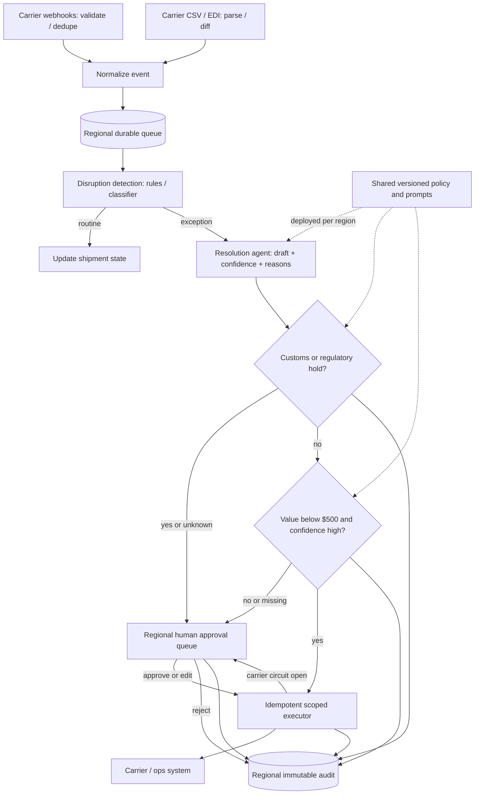

# G17 — Logistics Exception Handling: Main Interview Guide

> **Source:** [G17_Logistics_Exception_Handling.md](G17_Logistics_Exception_Handling.md), especially §§1–10. Use the [Deep Dive](G17_Logistics_Exception_Handling_Deep_Dive.md) for gate, reliability and evaluation detail and the [Cheat Sheet](G17_Logistics_Exception_Handling_Cheat_Sheet.md) for rehearsal.

## Anchor and related case

This is a modest-user, high-stakes exception system. It watches carrier feeds, detects customs holds, missed scans and weather delays, then either drafts for an ops agent or auto-resolves a narrowly allowed case. **Customs and regulatory holds always go to a human.**

| Case | Shared foundation | What changes |
|---|---|---|
| #5 Logistics exception assistant (anchor) | Two feed types, one detection path, resolution draft, independent policy gate | 150 ops agents; value/confidence boundary; EU residency. |
| #66 Shipment rerouting over SAP and weather | Same event normalization, gate, action and audit pattern | SAP becomes source and target, weather adds a predictive signal, 500 regional managers expand the approval surface. |

## Questions to ask the interviewer

| Ask | Design consequence |
|---|---|
| How fresh is each carrier feed and at what peak rate? | Webhook and batch ingestion need different adapters and latency promises. |
| Who acts on a draft, and how many cases arrive per shift? | Sizes the human queue and its SLA. |
| Which cases may auto-resolve, and which are always human? | Defines the policy gate before any carrier write. |
| What are the shipment-value and confidence rules? | Sets the narrow auto path and calibration work. |
| Which regions may store or access shipment data? | Determines regional data planes and application access. |

## Requirements and sizing

**Functional:** ingest webhook and CSV/EDI drops; normalize and deduplicate; detect disruptions; produce a proposed resolution with signals and confidence; enforce customs-first, value and confidence policy; auto-execute eligible actions idempotently; let agents approve/edit/reject all others; audit every verdict and action. New carriers should be adapters rather than core rewrites.

**Non-functional:** zero customs holds auto-resolved, EU data kept in EU, no silently lost exception or double action, separate freshness metrics for real-time versus batch, low time-to-draft, least-privilege carrier credentials, and cost per resolved exception. A missing exception type, shipment value or confidence routes to a human.

About 60% of carriers send webhooks at roughly **200 events/s combined peak**; 40% drop files every **2–6 hours**. There are about **150 agents**, around **40 concurrent** at handoff, handling **30–50 cases each per day**. A peak-rate-all-day upper bound is ~17.3M events/day, while human cases are roughly 4,500–7,500/day. Detect cheaply on all events; call the resolution model only for exceptions. The source explicitly treats the daily event figure as an upper-bound calculation, not measured daily volume.

## Architecture

The resolution **agent/model drafts** an action and confidence; a separate deterministic policy gate decides whether execution is permitted. Shared versioned logic is deployed into US, EU and APAC regional data planes. EU records and audit data do not replicate out of the EU.

### Step-by-step architecture

- Validate and deduplicate webhook events; parse scheduled files and emit only shipment-state differences. Both paths become one regional event schema, with batch detection lag visible.
- Queue normalized events to absorb storms, then use rules or a small classifier to find customs, missed-scan and weather exceptions. Routine scans only update state.
- Send exceptions to the resolution agent for an action draft, confidence and supporting signals. The agent cannot call carrier write APIs directly.
- The independent gate checks customs/regulatory status **first**, using detection's type rather than the agent's label. Any customs or unknown case goes to a human.
- For non-customs cases, only shipment value under $500 and confidence above the agreed threshold may auto-resolve; all others enter the regional approval queue.
- An approved or eligible action uses scoped carrier credentials, an idempotency key and a circuit breaker. A flaky or non-idempotent carrier falls back to human handling.
- Log every verdict, draft, approval/edit/rejection and execution in the regional audit store; keep EU data and access within the EU.

## Decisions, failures and evaluation

**Customs is an invariant, not a threshold.** A high-confidence model cannot override it. A missing field fails to the human queue, and an unavailable audit store blocks action. A legacy carrier that cannot honor an idempotency key may need human-only handling because a timeout can otherwise cause double booking. A circuit breaker moves carrier failures to human review rather than retrying into a storm.

**Two feed clocks:** polling a batch-only carrier every few seconds cannot make its 2–6-hour file arrive sooner. Keep separate time-to-detect p50/p95 for webhook and batch feeds. Show lateness on the draft. Queue depth and approval age are separate operational SLOs.

**Release evidence:** replay labeled historical exceptions for recall and precision per type; adversarial customs cases must produce **zero auto-resolutions**; calibrate confidence above the auto threshold; test duplicate execution, EU-to-US access denial and audit completeness. Start offline, then shadow with all human actions, then one region/one integrated carrier for known-route missed scans. For rerouting benefit, use a matched holdout: the route not taken is not directly observable.

**Cost and latency:** keep model calls behind detection; template common missed-scan rebooks; cap agent steps, carrier calls and retries; route difficult human-read drafts to a stronger model only when useful. Cost scales with exceptions, not routine scan volume. During a weather burst, prioritize backlog by value and deadline and scale stateless detection; the human approval queue may become the real bottleneck.

## Two-minute interview answer

“I would ask about feed freshness, the human boundary, shipment value rules and regional residency first. Webhook and batch carriers get different adapters but converge on one normalized, regional queue; batch changes are diffed and their lateness is surfaced. Cheap detection finds exceptions, and only then does a resolution agent draft an action with confidence and reasons. An independent gate checks customs first and always sends it to a human. For other cases, only under-$500, high-confidence actions may auto-resolve. Execution is idempotent, scoped and circuit-broken, with every verdict and action audited in-region. I would prove the customs invariant offline, shadow all actions, then enable one narrow auto-resolve cohort while watching outcome, delay and reversal rates.”
