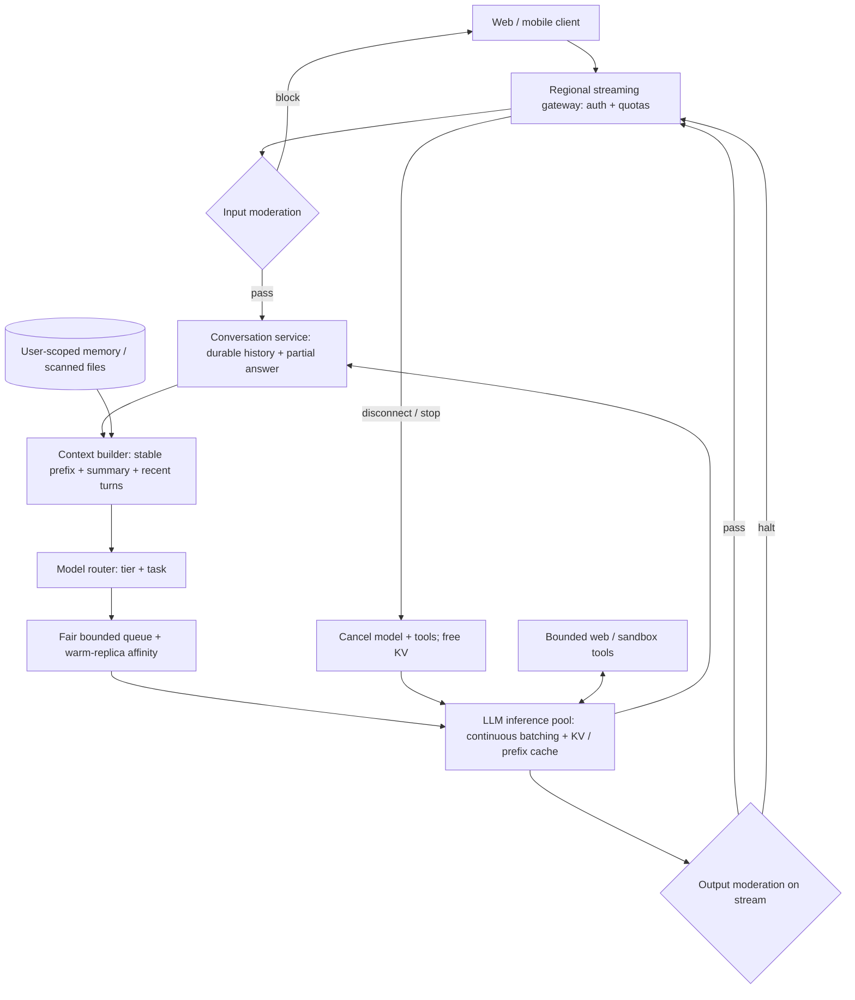

# G18 — Consumer-Scale Chat Service: Main Interview Guide

**Consumer chat** is ChatGPT-shaped: many people, many turns, stream tokens, remember the thread, don’t go bankrupt on GPUs. The **model is stateless**; the **product is not**.

**G18 covers one slice:** sessions, streaming, admission, moderation, cost. Not training the foundation model.

End to end, as free-tier user Sam:

1. **Sam hits send.** Admission and quotas — paid may skip the line.
2. **We load the conversation** (and deletion rules). Not the whole history dumped raw if it won’t fit.
3. **Moderation on the way in.**
4. **A GPU pool streams tokens.** Batching and fair queues keep neighbors alive.
5. **Moderation on the way out.** Tools (files, search, code) are sandboxed and step-capped if they exist.
6. **Turn is stored.** If inference dies, failover — don’t pretend the chat never happened.

That’s it: **admit → load state → infer stream → moderate → persist.** “We’ll train a new model in this round” stays out unless they ask.

> **Source:** [G18_Consumer_Scale_Chat_Service.md](G18_Consumer_Scale_Chat_Service.md), especially §§1–12. Use the [Deep Dive](G18_Consumer_Scale_Chat_Service_Deep_Dive.md) for sizing and trade-offs and the [Cheat Sheet](G18_Consumer_Scale_Chat_Service_Cheat_Sheet.md) for rehearsal. The source builds its design from one-line “Design ChatGPT/Claude” prompts; all scale figures are explicit whiteboard assumptions, not measured service facts.

## The anchor and variant

“Design ChatGPT” asks for a **stateful product around a stateless model**: conversations, streaming, admission, moderation and token cost at consumer scale. The “Design the Claude chat service” variant uses the same architecture, with more emphasis on batching, GPU capacity, queues and failover. There is no separate worked design for either prompt in the repository.

## Questions to ask the interviewer

| Ask | Design consequence |
|---|---|
| Consumer app, API or both? | Sets session UX versus API quota scope. |
| Users, turns/day and traffic peak? | Sizes streams, stores and inference pools. |
| Free/paid tiers and latency promises? | Defines routing, quotas and fair queues. |
| Conversation history and cross-chat memory? | Defines persistent stores, context and deletion. |
| Files, search and code tools? | Adds untrusted data, sandbox and step caps. |
| Serve existing models or train them? | Keeps the answer on serving and product state. |

## Requirements: Functional + Non-Functional

The easiest way to frame requirements in an interview is:

> **Functional = what the system does. Non-functional = how well it does it and what constraints it must satisfy.**

### Functional requirements — what the system must do

1. **Send and stream messages.**
2. **Persist, list, rename, delete conversations.**
3. **Carry within-conversation context.**
4. **Enforce user / tier limits.**
5. **Moderate input and output.**
6. **Stop on user cancel or disconnect.**

Files, search, sandboxed code, inspectable memory, and sharing are follow-on features.

### Non-functional requirements — how well / under what constraints

| Requirement | Example target / constraint |
|---|---|
| **Latency / availability** | Illustrative p95 first token <1 s; 99.9% send-and-stream. Constructed targets, not a product SLA. |
| **Security** | Zero cross-user reads; user-scoped deletion across history, memory, files, caches. |
| **Reliability** | Durable partial answers. |
| **Fairness** | Queues by tier. |
| **Cost** | Moderation error rate and cost per DAU. |
| **Scale (illustrative)** | 100M users × 10 msgs = 1B/day ≈ 11,600/s avg, 35,000/s at 3× peak. 400 out tokens ⇒ ~14M out tokens/s; 2,000 in ⇒ ~70M in tokens/s. 8 s streams ⇒ ~280k in flight; 100 streams/replica ⇒ ~2,800 replicas. Replace with measured GPU throughput. |

### Interview shortcut

If asked **“What are the requirements?”**, say:

> **“Functionally, stream a turn, store the thread, moderate both ways, cancel cleanly. Non-functionally, first token fast, no cross-user leak, fair queues, and the model stays stateless — the product holds state.”**

## Architecture

The LLM generates responses; code owns identity, quotas, context assembly, routing, moderation, tool scope, persistence and cancellation. The model is stateless between turns. The product stores history but sends only selected context to the model.

### Step-by-step architecture

- Route the client to a healthy region; the gateway authenticates, applies per-user and per-tier token budgets, and checks input moderation before GPU admission.
- The conversation service reads user-scoped durable history and persists the new message; it also saves partial output as tokens arrive for reconnects.
- The context builder sends a versioned stable prompt prefix, rolling summary, recent turns, relevant inspectable memory and user-filtered file chunks. Full history remains in storage, not in every prompt.
- A router selects a model allowed by tier and suitable for the task; a bounded fair queue protects tiers and prefers a warm replica only while it has capacity.
- The LLM pool generates with continuous batching and prefix/KV reuse. Optional search, file or code tools run with step limits; untrusted files never gain instruction authority.
- Output moderation checks streamed chunks before delivery; the gateway sends SSE tokens to the client and records the partial answer durably.
- Stop or disconnect propagates cancellation to model and tools, freeing GPU/KV capacity. Regional failover is possible but may be cold and slower.

## Key trade-offs and failure modes

**Store everything, send little.** A rolling summary prevents context growth from making every turn slower and costlier, but can lose a detail; recent turns and user-visible memory mitigate that. Keep a stable, byte-exact prompt prefix and deterministic tool order for cache reuse. A model cascade may start a cold cache on each model, so compare total cost per successful conversation before routing across models.

**Admission versus fairness:** a user token bucket decides whether a request enters; a weighted fair queue decides when an admitted request runs. Count tokens, not only messages. Under saturation, reject early with a retry signal rather than growing an unbounded queue. Separate your own quota 429 from provider/pool capacity events.

**Trust boundary:** user ID comes from the authenticated session, never a model tool argument. Files are scanned and parsed asynchronously, retrieval is user-filtered, and code tools use a credential-free sandbox. Moderate both input and streamed output; calibrate false positives and false negatives. Delete history, memory, files and caches consistently when requested.

**Regional failure:** each region has independent gateway/inference capacity and a home region for conversation history. Failover may lose warm KV state and some asynchronously replicated history, so the first recovered turn can be slower. Residency constraints may restrict destination regions. Use circuit breakers and spare capacity rather than assuming instant GPU startup.

## Evaluation and rollout

Measure p50/p95 time to first token by tier/region, queue wait, cache-read token share, regenerate and edit-resend rate, abandonment, output tokens after abandon, moderation errors, cost per daily active user and cross-user-read tests. Treat model and system-prompt changes as releases: canary, evaluate quality/safety/latency/cost, and watch cache hit rate. For the Anthropic wording, be ready to zoom into replica capacity, batching and failover from G20.

## Two-minute interview answer

“I would clarify the product and request shape first, then say the model is stateless but the product is not. A regional gateway authenticates, rate-limits and moderates before GPU admission. A conversation service stores every turn and partial answer, while a context builder sends only a stable prompt prefix, summary, recent turns and user-scoped memory. A tier/task router feeds a bounded fair queue and continuously batched LLM pools. Output is moderated as it streams; disconnect cancels generation and tools. I would size from messages per second to open streams and GPU capacity, but label those figures as assumptions. The hard trade-offs are history versus token cost, cache warmth versus model routing, and fairness versus latency under overload. I would prove the design with first-token latency, abandon rate, isolation tests and cost per daily active user.”
