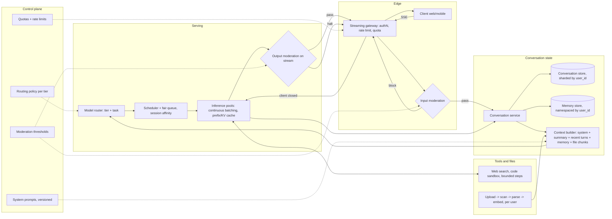

# Consumer-Scale Chat Service

*Every user expects the first token instantly and the whole history remembered, while every remembered token is paid for again on the next turn.*

◷ 24 min

"Design ChatGPT" is not a model question. It is a distributed-systems question about conversation state, token streaming, admission control and cost at hundreds of millions of users. This page consolidates group G19 of `CASE_STUDY_INDEX.xlsx` into one read for the day before.

| Case in the group | What it contributes here |
|---|---|
| #71 OpenAI reported prompt: "Design ChatGPT." (anchor) | Sections 1 to 12, 14 and 15: the full design |
| #78 Anthropic reported prompt: "Design the Claude chat service." | Section 13: the same design, with the emphasis an Anthropic panel is reported to probe |
| Self-drill on #71 *(own construction)* | Section 15 |
| G01, G07, G14 packs; Cost_Latency_Optimization; memory and production study guides | Sections 5 to 12, cited per section |

**No worked design for this prompt exists in the repo.** The two sources are one-line prompts in the reported-question bank. Everything below the prompt is *own construction*, assembled from the repo's material on memory, caching, tenancy, observability and cost. Sizing numbers are stated assumptions, not measurements. Treat each figure as a placeholder to be replaced by measured throughput.

---

## 1. Clarify the Product Before the Scale

Ask what "ChatGPT" means in this room before drawing anything. The question bank's first failure mode is jumping to architecture before clarifying scope. An OpenAI FDE candidate reported the interviewer stopping them to ask: *"What questions would you ask the customer before designing anything?"*

The prompt, from the reported-question bank: **"Design ChatGPT."** Nothing else is given. The framework on the same page says to clarify the mission first: *"Are we optimizing for response time, cost, accuracy, or equity of coverage? Who's the primary user?"* State assumptions explicitly if the interviewer does not confirm them.

| Question | Assumed answer *(own construction)* | What it decides |
|---|---|---|
| Consumer app, API, or both? | Consumer web and mobile chat | Sessions and UX matter; API quotas are out of scope |
| How many users? | 100M daily active users | Sizing, sharding and multi-region from day one |
| Free and paid tiers? | Yes, with different models and quotas | Routing and rate limits are per tier |
| Multi-turn memory? | Yes, within a conversation; optional across conversations | Conversation store plus a user-scoped memory store |
| File uploads and tools? | Files, web search, a code sandbox | Untrusted content enters the prompt; sandboxing |
| Do we train the model? | No, we serve given models | The design is serving, state and safety, not training |

The weak answer draws a load balancer in front of a model and stops. It forgets that the model is stateless and the product is not. The strong answer names the three hard problems in the first two minutes: conversation state that grows every turn, streaming at huge concurrency, and cost that scales with tokens rather than requests.

> *"The model is stateless and the product is not. The design is conversation state, streaming, admission control and cost, with the model as one expensive dependency behind them."*

## 2. State Requirements as Testable Constraints

A requirement that cannot fail a test is a preference. "Fast" is a preference. "Time to first token under one second at p95" is a constraint, and only the second shapes the architecture. The split below is *own construction*.

The must-haves are six. Send a message and receive a streamed answer. Keep and list conversation history per user, with rename and delete. Carry context across turns within a conversation. Enforce per-user and per-tier usage limits. Moderate input and output. Stop generation on request or when the client leaves.

The should-haves round out a competitive product: file uploads, web search, a code sandbox, cross-conversation memory the user can inspect and erase, regenerate and edit-and-resend, and sharing a conversation by link. Voice and image generation come later.

| Constraint | Stated so it can be tested *(own construction)* |
|---|---|
| Latency | Time to first token under 1 s p95 for the default model; steady streaming after that; no UI freeze before the first token |
| Availability | 99.9% for send-and-stream; a regional outage degrades to another region, not to an error page |
| Durability | A sent message and a completed answer are never lost; a partial answer survives a disconnect |
| Isolation | Zero cross-user reads of conversations, files or memory; `user_id` comes from auth, never from the model |
| Safety | Input and output moderation on every turn; measured false-positive and false-negative rates |
| Fairness | A burst from one user or tier cannot starve another tier's queue |
| Cost | Cost per daily active user tracked by tier; cache-read share of input tokens tracked as a first-class metric |
| Privacy | Content excluded from logs by default; deletion propagates to history, memory, files and caches |

Every must-have then needs an owner in the architecture *(own construction)*.

| Requirement | Primary component(s) |
|---|---|
| Streamed answers | Streaming gateway, inference pool |
| History and context across turns | Conversation service, conversation store, context builder |
| Usage limits | Rate limiter and quota service at the gateway |
| Moderation both ways | Input moderation before admission, output moderation on the stream |
| Stop on request or abandon | Streaming gateway cancellation, propagated to inference and tools |
| Isolation | Auth service, namespaced stores, retrieval filter on uploads |

## 3. Size It From Daily Users Down to GPUs

Say the arithmetic aloud, because it decides whether multi-region and caching are optional. They are not. Every number below is an assumption for the whiteboard *(own construction)*. The method is what gets scored.

| Step | Assumption | Result |
|---|---|---|
| Daily active users | 100M | — |
| Messages per user per day | 10 | 1B messages a day |
| Average rate | 1B ÷ 86,400 s | ≈ 11,600 messages/s |
| Peak | 3× average | ≈ 35,000 messages/s |
| Output per answer | 400 tokens | ≈ 14M output tokens/s at peak |
| Input per turn | 2,000 tokens (system prompt, summary, recent turns) | ≈ 70M input tokens/s at peak, most of it a repeated prefix |
| Decode speed per stream | 50 tokens/s | 8 s to stream one answer |
| Concurrent streams | Little's Law: 35,000/s × 8 s | ≈ 280,000 open streams |
| Streams per model replica | 100 concurrent, batched | ≈ 2,800 replicas at peak |
| Storage | ~2 KB text per message | ≈ 2 TB of conversation text a day |

Little's Law is `concurrency = throughput × latency`, from the cost study guide. It turns latency work into capacity work: halving the answer length halves the concurrent streams to provision. The input line explains why prefix caching matters more here than anywhere. Seventy million input tokens a second are mostly history the model already processed last turn.

Split the two latency phases before going further. Prefill processes the whole prompt in parallel and sets time to first token, so it scales with input tokens. Decode generates one token at a time and sets total time, so it scales with output tokens. A bloated history is a first-token problem. A verbose answer is a completion-time problem.

## 4. Draw the Architecture End to End

The organising rule is admit, assemble, stream, persist. Admission control decides whether a request may use a GPU at all. The context builder decides what the turn costs. The stream decides what the user feels. Persistence decides what survives.

The whole system, drawn with its planes *(own construction)*:

```
 ╔══════════════════════ CONTROL PLANE (changes are releases) ═══════════════════════╗
 ║ model catalogue + routing policy per tier · quotas and rate limits per tier       ║
 ║ system prompts (versioned, prefix-stable) · moderation thresholds · region map    ║
 ║ feature flags · eval gates (G13) · budgets and alerts                             ║
 ╚═══════════════════════════════════════╤═══════════════════════════════════════════╝
                                         │ configures every box below
 ╔══════════════════════ DATA PLANE, per region (calls are requests) ════════════════╗
 ║                                                                                   ║
 ║ client (web, mobile) ──SSE──> edge + GeoDNS ──> STREAMING GATEWAY                 ║
 ║                                                 authN · rate limit · quota        ║
 ║                                                 input moderation · cancel-on-close║
 ║                                                        │ admitted                 ║
 ║                                                        v                          ║
 ║                   CONVERSATION SERVICE ──> CONTEXT BUILDER                        ║
 ║                   (history, titles,        system prompt + summary + recent turns ║
 ║                    partial answers)        + user memory + retrieved file chunks  ║
 ║                        │                        │                                 ║
 ║            conversation store         MODEL ROUTER (tier + task)                  ║
 ║            (sharded by user_id)             │                                     ║
 ║            memory store                     v                                     ║
 ║            (namespaced by user_id)   SCHEDULER + FAIR QUEUE per tier              ║
 ║                                      session affinity -> warm KV cache            ║
 ║                                             │                                     ║
 ║                                             v                                     ║
 ║                          INFERENCE POOLS (small · default · premium)              ║
 ║                          continuous batching · prefix/KV cache                    ║
 ║                                             │ tokens                              ║
 ║                                             v                                     ║
 ║                          OUTPUT MODERATION on the stream ──> gateway ──> client   ║
 ║                                                                                   ║
 ║ TOOLS (bounded steps): web search · code sandbox · file retrieval                 ║
 ║ FILES: upload -> object store -> scan -> parse -> chunk + embed (per user)        ║
 ║                                                                                   ║
 ║ OBSERVABILITY: stage timings, tokens, cache reads, abandon, moderation — no text  ║
 ╚═══════════════════════════════════════════════════════════════════════════════════╝
      replicated across regions: conversation store (home region per user),
      control-plane config; inference pools are regional and independent
```

The same flow for viewers that render Mermaid *(own construction)*:



Read the components in request order. The failure column is *own construction*.

| # | Component | Responsibility | Fails how |
|---|---|---|---|
| 01 | Client | Renders the stream, resumes on reconnect | Degrades: shows the persisted partial answer |
| 02 | Edge + GeoDNS | Sends the user to the nearest healthy region | Fails over to the next region |
| 03 | Streaming gateway | Holds the SSE connection, auth, rate limit, quota, cancellation | Closed on auth; sheds free-tier traffic first under load |
| 04 | Input moderation | Blocks severe harm and abuse before a GPU is used | Closed for severe categories; logs and allows on a timeout for low-risk tiers |
| 05 | Conversation service | Owns messages, titles and partial answers | Closed for writes; history reads degrade to a cache |
| 06 | Conversation store | Durable history, sharded by `user_id` | Replicated; home-region failover |
| 07 | Memory store | Cross-conversation facts, inspectable and erasable | Degrades: answer without memory, say nothing false |
| 08 | Context builder | Assembles the prompt in prefix-stable order | Degrades: fewer turns, same order |
| 09 | Model router | Chooses the model by tier and task | Degrades to the default model |
| 10 | Scheduler + fair queue | Admits work per tier, keeps a conversation on a warm replica | Sheds lowest tier first; never drops an admitted stream silently |
| 11 | Inference pools | Continuous batching, prefix/KV cache | Fails over region or model; circuit breaker on a sick pool |
| 12 | Output moderation | Checks the stream in chunks, can halt it | Closed: halts the stream and says why |
| 13 | Tools | Search, sandbox, file retrieval under step caps | Degrades: answer without the tool, say so |
| 14 | File pipeline | Scan, parse, embed per user | Degrades: file unavailable, never cross-user |
| 15 | Observability | Stage timings, tokens, cache reads, abandonment | Degrades: request still served, gap logged |

Point at three boundaries while the diagram is up *(own construction)*. The admission boundary sits at the gateway, so nothing reaches a GPU without passing auth, quota and input moderation. The isolation boundary sits at every store, because each one is namespaced by a `user_id` that comes from auth. The cost boundary sits at the context builder, because it decides how many tokens each turn re-sends.

## 5. Store the Conversation, Send Only What the Turn Needs

Store everything and send little. The memory study guide draws the line: trimming bounds what reaches the model, not what is stored. A model cannot be billed for history the context builder never sent.

The conversation service writes every message durably, keyed by `(user_id, conversation_id)`. It also persists the partial answer as tokens stream. A disconnected user then reconnects to the text generated so far rather than to nothing. The store is sharded by `user_id`, so one user's history lives on one shard and a list-conversations call touches one partition.

The context builder assembles each turn in a fixed order: system prompt, rolling summary, recent turns, memory facts, retrieved file chunks, then the new message. A sliding window alone loses anything that scrolls out. Summarisation keeps a condensed record once the buffer crosses a threshold, at the cost of one extra model call per compression. The memory guide's worked answer folds the buffer at about 15 turns so cost stays flat on long chats. The failure to volunteer is losing a detail the summariser judged unimportant.

Cross-conversation memory is a different store with a different key. A checkpoint key answers "which conversation"; a user namespace answers "which person". Semantic memory holds stable facts under a stable key that overwrites in place. Episodic memory appends one record per completed task and is pruned. The isolation rule from the memory guide is non-negotiable: read `user_id` from the server-side session on every request, never from a tool argument the model could set. Make memory visible and erasable in the product, because a user who cannot see a remembered fact cannot correct it.

## 6. Stream Every Answer and Cancel the Ones Nobody Reads

Stream every answer, and treat the closed connection as a cost signal. Streaming buys perceived latency, not real latency. The production study guide says it directly: total generation time is unchanged, but the first token arrives in milliseconds.

Use Server-Sent Events for the chat stream. The traffic is one-way from server to client after the request, SSE runs over plain HTTP through every proxy, and reconnect is built in. Keep WebSockets for the paths that genuinely need both directions at once, such as voice. Each stream carries a message ID, so a reconnect resumes from the persisted partial answer instead of regenerating it *(own construction)*.

A user who leaves mid-answer is still costing GPU time. The cost additions name this scenario: *"cancel the stream + any in-flight tool calls on abandon — otherwise you pay for tokens nobody read."* The gateway detects the closed connection and sends a cancel to the inference request. That frees the batch slot and its KV cache and stops any tool call in flight. The Stop button uses the same path. Measure abandonment against first-token time and answer length, because a rising abandon rate is often a first-token problem in disguise. G14's card 15.10 carries the same lesson.

## 7. Route by Tier and Task, and Count What a Cascade Costs

Route on two axes: the user's tier and the turn's difficulty. The tier sets which models a user may reach and at what quota. The task sets which of those models a turn actually needs. A greeting does not need the premium model; a long proof might.

The cost additions quantify the lever. Output is roughly five times the price of input across current tiers. A router that moves 80% of traffic from Opus 5 to Haiku 4.5 is a ~5× unit-cost cut on that slice. That single sentence is what "model routing" is worth, and it belongs in the answer.

Then name the trade-off most candidates miss. Prompt caches are scoped to a model, so a cheap-to-medium-to-premium cascade means separate cold prefixes. On a chat product whose input is mostly repeated history, a cascade can forfeit more in cache than it saves in price. The additions give the rule: measure one strong model at lower effort before building the cascade. Route at the start of a conversation where possible, and keep a conversation on one model unless the user changes it *(own construction)*.

## 8. Limit Per User, Queue Fairly Per Tier

A rate limit and a fair queue answer different questions, and a consumer service needs both. G07 section 7 draws the line. A rate limit decides whether this request may proceed at all. A fair queue decides in what order admitted requests are served under load.

Put a token bucket per user at the gateway, sized by tier: messages per window and tokens per day. Count tokens, not only requests, because one long request can cost as much as fifty short ones. Behind admission, feed a weighted fair queue per tier into the shared inference pools. A free-tier surge then waits longer, and paid users keep their latency *(own construction, from G07's weighted-fair-queuing argument)*.

Separate the two kinds of 429 when load spikes. The additions say it plainly: *"Separate provider 429s from your own gateway limits."* A self-inflicted limit is a policy decision. A provider or pool limit is a capacity event. Short term, retry with jitter onto a fallback model or region and shed non-interactive traffic. Long term, buy capacity and queue non-urgent work rather than retrying into the same wall. Abuse is a rate-limit problem too: per-account and per-IP limits, anomaly detection on bursts, and stricter quotas on new or unverified accounts *(own construction)*.

## 9. Moderate Both Directions and Treat Every File as Untrusted

Moderate input before it reaches a GPU and output before it reaches a screen. The production guide's rule settles why both: the model can repeat something sensitive the user said two turns ago, so an input-only check never catches it. Input moderation buys half the cost; input plus output buys the multi-turn catch. A consumer chat product is multi-turn by definition.

Input moderation runs as a fast classifier at the gateway, before admission, so a blocked message never spends GPU time. Output moderation runs on the stream in chunks and can halt it mid-answer with an explanation. Moderation APIs flag a fixed taxonomy of severe harm only, so mild abuse passes. The guide names two independent layers, the model's trained refusals and the moderation classifier, and neither substitutes for an app-specific policy. Track false positives as closely as false negatives, because over-blocking is a product failure users notice first *(own construction)*.

Files and tools carry indirect prompt injection, which the question bank lists as a Tier 2 probe. An uploaded PDF or a fetched web page is data, and data must not gain the authority of instructions. Store uploads in object storage, scan them, parse asynchronously, then chunk and embed per user. Retrieval over them is filtered by `user_id` at query time, the same two-layer idea as G01 section 6. Tool steps are capped per turn. The code sandbox runs with no network and no credentials, and is destroyed after the session *(own construction)*.

## 10. Keep the Prefix Stable and the Conversation on a Warm Replica

Chat is the best case for prefix caching, because each turn is the previous turn plus a little. The cost additions give the mechanism: cache matching is byte-exact on the prefix, rendered in the order tools, then system, then messages. One changed byte invalidates everything after it.

Build the prompt so the stable parts come first and never move. Freeze the system prompt per version. Order the tool list deterministically. Put timestamps, request IDs and the user's new message after the last cache breakpoint. The additions list the silent invalidators behind a sudden cache-hit drop: a `datetime.now()` in the system prompt, unsorted JSON keys, a tool list whose order varies, a prompt-version bump, a model swap. Prove it with the cache-read token counter, not by guessing.

A cache is only warm on the machine that holds it. Route every turn of a conversation to the replica that served the previous one, so its KV cache still holds the history *(own construction)*. Session affinity trades some load-balancing freedom for a large cut in prefill work. When the replica is gone, the turn still succeeds, only slower and at full input price. Summarisation interacts with caching too: rewriting the summary changes the prefix, so fold history in large steps rather than every turn.

## 11. Serve From Many Regions and Fail Over Cold, Not Closed

Serve each user from the nearest healthy region, and let a regional failure cost latency, not availability. GeoDNS or anycast sends the client to a regional edge. Each region runs its own gateway, services and inference pools, so one region's failure does not queue behind another's *(own construction)*.

Give each user a home region for the conversation store and replicate it asynchronously to a second region. A failover then reads slightly stale history rather than none. Keep the control plane central for policy and regional for enforcement, the balance G07 section 8 argues for. Residency rules can pin some users' data to a region, which the region map in the control plane records.

Failover is cold by nature. The new region has no KV cache for the conversation and may have less capacity. Accept the slower first turn, shed the free tier before the paid tier, and use a circuit breaker on a sick pool so requests stop paying to rediscover a failure. The production guide gives the breaker's three states: closed, open after repeated failures, half-open for one probe. A model outage degrades to another model in the same tier; it never degrades to an error page if any healthy model remains.

## 12. Measure What Users Feel and Gate What Ships

Measure time to first token, not only total latency, because first-token time is what a chat user feels. G14's triage section decomposes a slow request by stage: queue wait, prefill, decode, moderation, tools. That trace is the first tool when latency moves. Record stage timings, token counts, cache reads, abandonment and moderation outcomes, and keep message text out of telemetry by default, per G14 section 2.

The question bank's second failure mode is hand-waving evaluation. Tie every design choice to a number *(own construction)*.

| Worry | Metric that answers it |
|---|---|
| Does it feel fast? | Time to first token p50/p95 by tier and region |
| Is it answering well? | Thumbs-down rate, regenerate rate, edit-and-resend rate |
| Is caching working? | Cache-read share of input tokens; hit rate by prompt version |
| Is moderation calibrated? | False-positive rate on a labelled sample; false negatives from red-team runs |
| Are users leaving mid-answer? | Abandonment against first-token time and answer length |
| Is it affordable? | Cost per daily active user by tier; tokens generated after abandon |
| Is it isolated? | Cross-user read tests at zero, run before every release |

Ship model and prompt changes through a release gate with a canary slice, as G13 designs it. A system prompt change is a release, because it also changes the cache prefix and the cost line.

## 13. Answer the Anthropic Wording the Same Way (#78)

"Design the Claude chat service" is the same prompt as "Design ChatGPT", and the design above answers it unchanged. The sheet records no content delta. The emphasis differs, and saying so shows the candidate read the room *(own construction)*.

The question bank frames the Anthropic questions directly: *"AI/ML framing, but they fundamentally test distributed-systems fundamentals: batching, queuing, load balancing."* The neighbouring Anthropic prompts are inference batching, GPU routing and a 100,000-requests-per-second token service. Those are group G21 in the sheet. For #78, then, spend more of the hour on sections 3, 8, 10 and 11: the Little's Law sizing, the fair queue, continuous batching with session affinity, and failover. Expect the follow-ups "how do you determine which GPU has capacity?" and "how do you handle failover?" from the batching prompt in the same bank.

The Tier 2 safety probe applies with extra weight here: circuit breakers, rate limiting and graceful degradation when the model is unavailable. Have section 11's degradation ladder ready as a spoken list.

## 14. Deliver It in Sixty Minutes

Spend the hour on state, streaming, admission and cost, because those are the parts a generic answer skips. The model choice is a sentence.

| Minutes | Phase |
|---|---|
| 0–7 | Clarify: the six questions and the stated assumptions (section 1) |
| 7–12 | Requirements and the sizing arithmetic aloud (sections 2 and 3) |
| 12–20 | The diagram and one message walked end to end (section 4) |
| 20–40 | Deep dive: conversation state, streaming and cancel, routing, limits (sections 5 to 8) |
| 40–50 | Safety, caching, regions (sections 9 to 11) |
| 50–60 | Metrics, the release gate, the cost pivot (sections 12 and 15) |

The two-minute spoken answer *(own construction)*:

> *I would start by saying the model is stateless and the product is not. At 100 million daily users and ten messages each, peak is around 35,000 messages a second, and with eight-second answers that is about 280,000 open streams — so admission, streaming and cost dominate. A streaming gateway holds each SSE connection and does auth, per-user token-bucket limits, tier quotas and input moderation before anything reaches a GPU. The conversation service stores every message durably, sharded by user, and persists partial answers so a reconnect resumes. A context builder sends only what the turn needs: a frozen system prompt, a rolling summary, recent turns and user memory, in a prefix-stable order so prompt caching works. A router picks the model by tier and task, and a fair queue per tier feeds inference pools that batch continuously and keep each conversation on a warm replica. Output moderation runs on the stream and can halt it. When the client leaves, the gateway cancels generation and tool calls, because tokens nobody reads still cost money. Each region is independent, with a home region for history and cold failover. I would prove it with time to first token, regenerate and abandon rates, moderation error rates and cost per daily active user.*

The lines that carry the round *(own construction)*:

1. *"The model is stateless and the product is not."*
2. *"Store everything, send little."*
3. *"Streaming buys perceived latency, not real latency."*
4. *"Cancel on abandon. Tokens nobody reads still cost money."*
5. *"A rate limit decides whether; a fair queue decides in what order."*
6. *"Prefix caching is a byte-exact prefix match. Stable first, volatile last."*
7. *"A cascade forfeits the cache. Measure one model at lower effort first."*
8. *"Failover is cold, not closed."*

The follow-ups come from the question bank's Tier 2 probes and the neighbouring prompts.

| Follow-up | Answer |
|---|---|
| Stateless or stateful servers? | Stateless services with state in the conversation store; the only affinity is soft, for the KV cache |
| How do you handle a model outage? | Circuit breaker on the pool, fallback model in the same tier, shed free tier first, never an error page while a healthy model remains |
| How do you stop a runaway tool loop? | Step cap per turn, per-tool timeouts, cancel on abandon |
| How do you keep long-term memory from getting polluted? | Stable keys that overwrite, pruned episodic records, user-visible and erasable memory, `user_id` from auth only |
| Prompt injection through a file or web page? | Treat content as data, not instructions; user-scoped retrieval; sandbox with no credentials; output moderation |
| How do you version and roll back prompts? | Versioned system prompts behind the release gate with a canary slice; a prompt bump is also a cache and cost event |
| Which GPU has capacity? | The scheduler tracks per-replica queue depth and free KV memory, and prefers the replica already holding the conversation |
| How would you know it works? | The metric table in section 12, tied to each design choice |

## 15. Answer the Cost Pivot in Ten Minutes

The interviewer's pivot is "the bill is growing faster than users." This group has no playbook drill, so the card below is a self-drill *(own construction)*, grounded in the cost study guide's drivers.

| | |
|---|---|
| Dominant driver | Input tokens re-sent every turn as history grows, and output tokens at consumer volume, including tokens generated after the user has left |
| Cheapest lever first | Prefix-stable prompt with session affinity so history is a cache read; summarise history in large steps; short default answers with expansion on demand; route easy turns and the free tier to a small model; cancel on abandon |
| Metric that proves it | Cost per daily active user by tier; cache-read share of input tokens; output tokens per answer; tokens generated after abandon; time to first token p95 |
| Do not | Re-send the full history every turn, or build a three-model cascade that forfeits the prompt cache |
| 60-second line | Chat cost is history times turns plus answers nobody finished. Keep the prefix stable so history is a cache read, summarise in steps, keep answers short by default, route easy turns down, and cancel the moment the user leaves. |

Two drivers from the cost study guide explain almost every surprise here. Input tokens grow with the conversation: teams count the user's question and ignore the system prompt and hidden history, so the bill rises with flat traffic. Output tokens grow with verbosity: teams measure requests, not generated tokens. Streaming improves perceived latency but does not reduce total compute cost. Quote cost per successful conversation rather than per request, as the additions insist: a cheaper model that needs a regenerate is not cheaper.

Every strong cost answer follows four verbs in order. Measure tokens and stage timings first. Route model to tier and task. Bound history, answer length and tool steps. Cache safely, with a stable prefix and the user's scope in every key.

---

## Key Takeaways

- Clarify the product and state the assumptions before drawing, because "Design ChatGPT" gives nothing else.
- Requirements are testable: first token under a stated p95, zero cross-user reads, moderation error rates measured.
- The sizing walk from daily users to open streams to replicas shows why admission, streaming and caching are mandatory.
- One diagram shows admit, assemble, stream, persist, with boundaries at the gateway, the stores and the context builder.
- Store every message durably, and send the model only a summary, recent turns and user-scoped memory.
- Stream with SSE, persist partial answers, and cancel generation and tools when the client leaves.
- Route by tier and task, and count the prompt cache a cascade forfeits.
- A per-user token bucket decides admission; a weighted fair queue per tier decides order.
- Moderate input and output, and treat every file and fetched page as untrusted data.
- Keep the prefix byte-stable and each conversation on a warm replica, so history is a cache read.
- Serve per region with a home region for history; failover is cold, not closed.
- Measure time to first token, regenerate and abandon rates, and cost per daily active user, and gate every prompt change.
- The Anthropic wording is the same design, with more time on batching, queuing and failover.
- The hour goes to state, streaming, admission and cost.
- The cost pivot is a stable prefix, stepped summaries, short answers, routing down and cancel on abandon.

## Check Yourself

1. **Why is "the model is stateless and the product is not" the opening line?** It names where the design effort goes: conversation state, streaming and admission, with the model as one dependency.
2. **Walk the sizing from 100M daily users to open streams.** 1B messages a day, about 11,600/s average, about 35,000/s at a 3× peak; at 8 s per answer, Little's Law gives about 280,000 open streams.
3. **Why does time to first token depend on history length?** Prefill processes the whole prompt before the first token, and history is most of the prompt.
4. **What does the context builder send on turn 40 of a conversation?** The frozen system prompt, a rolling summary, the recent turns, relevant user memory and file chunks, then the new message, in that order.
5. **Why SSE rather than WebSockets for chat?** The stream is one-way after the request, SSE runs over plain HTTP through every proxy, and reconnect is built in.
6. **What happens when a user closes the tab mid-answer?** The gateway cancels the inference request and any tool call, freeing the batch slot and KV cache; the partial answer is already persisted.
7. **Why can a model cascade raise cost on a chat product?** Prompt caches are scoped to a model, so each model in the cascade starts cold on a prompt that is mostly repeated history.
8. **How do a rate limit and a fair queue differ?** The limit decides whether a request may proceed; the queue decides the order admitted requests are served under load.
9. **Why moderate output as well as input?** The model can repeat something sensitive from an earlier turn, which an input-only check never sees.
10. **Name three silent prefix-cache invalidators.** A timestamp in the system prompt, unsorted JSON keys, a tool list whose order varies (also a prompt-version bump or a model swap).
11. **What changes when the prompt is "Design the Claude chat service"?** Nothing in the design; more time goes to batching, queuing, GPU capacity and failover.
12. **What is the sixty-second cost answer?** Chat cost is history times turns plus answers nobody finished: stable prefix, stepped summaries, short answers, route down, cancel on abandon.

## References

All paths are relative to `06_Interview_Prep/`.

| Section | Source |
|---|---|
| 1, 13, 14 (Tier 2 follow-ups) | `OpenAI_Applied/Sample_Questions/openai_decomposition_interview_prep.html`: prompt 6 "Design ChatGPT." (#71), prompt 13 "Design the Claude chat service." (#78), sections 1, 3 and 4 |
| 3, 7, 8, 10, 15 | `Study_Guides/Cost_Latency_Optimization/ADDITIONS_BEYOND_PLAYBOOK.md`: A1 (prefix match), A2 (tiers and routing), B1 (prefill vs decode), B3 (Little's Law), B4 (cost per successful task), E (rate limits, abandon) |
| 15 | `Study_Guides/Cost_Latency_Optimization/CORE_8_DRIVERS_MEMORIZE.md`, drivers 1 and 2 |
| 5 | `Study_Guides/07_memory_and_state_INTERVIEW_TUTORIAL.md`, sections 1.4 to 1.8 and the section 6 mock design |
| 6, 9, 11 | `Study_Guides/12_production_and_operations_INTERVIEW_TUTORIAL.md`, sections 1.2 (streaming), 1.10 (circuit breaker), 1.17 (moderation) and the input-vs-output moderation trade-off |
| 6, 12 | `Case_Study_Groups/G14_Observability_And_Production_Diagnosis.md`, sections 2 and 9 and card 15.10 |
| 8, 11 | `Case_Study_Groups/G07_Secure_Multi_Tenant_AI_Platform.md`, sections 7 and 8 |
| 9 | `Case_Study_Groups/G01_Enterprise_Knowledge_Assistant/G01_Enterprise_Knowledge_Assistant.md`, section 6 |
| 12 | `Case_Study_Groups/G13_Evaluation_And_Release_Gating.md` (release gate) |
| Every table and section marked own construction, all sizing figures, the self-drill card | Built for this page from the sources' arguments; not source material |
