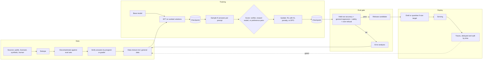

# Model Development and Post-Training

*Every model-building prompt spends one fixed budget of compute and data, and the constraint decides which stage of the pipeline gets the money.*

◷ 24 min

These four prompts are one pipeline asked four ways, not four different systems. Each question fixes a different constraint, and that constraint changes exactly one stage: data, SFT, post-training, evaluation or deployment. This page consolidates group G19 of `CASE_STUDY_INDEX.xlsx` into one read for the day before.

| Case in the group | What it contributes here |
|---|---|
| #84 Cohere: design a model that solves math problems, walking through data collection, SFT, post-training and eval (anchor) | Sections 1 to 8 and 13: the full pipeline on one running example |
| #73 OpenAI: design a scalable, efficient system for training an LLM given compute and data constraints | Section 9: the training stage under a compute budget |
| #81 Anthropic: design a language model that minimises harmful outputs while staying useful | Section 10: the post-training and eval stages under a harm constraint |
| #83 Google: design a small LLM that runs on a phone while staying polite | Section 11: the deploy stage under a device constraint |
| Compute-cost self-drill | Section 14 |

**Most of this page is own construction.** The repo holds no worked design for any of these four prompts. The prompts themselves come from the OpenAI decomposition question bank. The grounding comes from the Foundations fine-tuning labs, the Cracking book's chapter on learning surfaces, and the quantisation arithmetic in the air-gapped chapter. Sections and tables marked *(own construction)* were built for this page. Every number marked *(assumption)* is an illustration for the whiteboard, not a sourced figure.

---

## 1. Clarify What "Solves Math" Means Before Collecting Anything

A model cannot be trained toward a target nobody wrote down. "Solves math problems" hides at least four different products, and each one needs different data and a different evaluation *(own construction)*.

| Question | Why it changes the design |
|---|---|
| Which level: grade school, competition, university proofs? | Sets the data sources and whether answers can be checked automatically |
| Final answer only, or a shown working? | A final number can be verified by a program; a proof needs a checker or a human grader |
| Tools allowed, such as a Python interpreter or a calculator? | Tool use moves arithmetic out of the weights and changes what SFT teaches |
| Who uses it, and what does failure cost? | A tutor that is wrong teaches students wrong; a research assistant that is wrong wastes an hour |
| Build from a base model, or adapt an existing chat model? | Sets whether pretraining is in scope or only post-training |

The decomposition round rewards this move explicitly. The question bank's own framework starts with "Clarify the mission" and warns that the most common failure is jumping to architecture before scope. Say the assumptions aloud if the interviewer does not answer. A safe default is grade-school to competition word problems, final numeric answers, an optional code tool, and adaptation of an open base model.

> *"Before I pick a method I want the target pinned: which level of math, whether a final answer is enough or the working must be right too, and whether the model may call a tool. Those three answers decide the data, the reward and the eval."*

## 2. State Requirements as Testable Constraints

A requirement that cannot fail a test is a preference. "Good at math" is a preference. "Pass@1 of at least the target on a held-out set that shares no problems with training" is a constraint. Only the second one shapes the pipeline *(own construction throughout this section)*.

The must-haves are six. Correct final answers on the target distribution, measured on problems the model never saw. Shown working that is consistent with the final answer. No regression on general ability beyond an agreed tolerance. Refusal to fabricate when a problem is ill-posed. A reproducible training run, so any checkpoint can be rebuilt. An evaluation harness that runs on every candidate checkpoint before anyone reads a single sample by hand.

The should-haves come after the first model is trusted. Tool use through a code interpreter. Step-level feedback on the working. A tutoring mode that explains rather than answers.

| Constraint | Stated so it can be tested |
|---|---|
| Accuracy | Pass@1 on a held-out, decontaminated test set; target set with the customer *(assumption: the number is theirs, not ours)* |
| Reasoning quality | Sampled human or model grading of working on a stratified slice; answer-consistent working rate reported alongside accuracy |
| Contamination | N-gram or embedding overlap between train and test below an agreed threshold; any benchmark found in training is removed from reporting |
| General-ability regression | A fixed general benchmark suite, run on every checkpoint, with a maximum allowed drop |
| Reproducibility | Data snapshot hash, code version, config and seed recorded per run; any checkpoint rebuildable |
| Compute | A stated GPU-hour budget per stage, with a kill rule when eval stops improving per GPU-hour |
| Safety | Refusal on genuinely harmful requests; over-refusal rate on benign prompts measured, not assumed |

Every must-have then needs an owner in the pipeline.

| Requirement | Primary stage or component |
|---|---|
| Correct answers on unseen problems | Data collection with verified answers; post-training with a correctness reward; held-out eval |
| Consistent working | SFT on worked solutions; optional step-level reward in post-training |
| No general regression | Data mixture that keeps general data in; regression suite in the eval gate |
| No fabrication on ill-posed problems | SFT examples of "this problem is ambiguous"; eval slice of ill-posed problems |
| Reproducibility | Experiment tracker, data versioning, checkpoint store |
| Eval before anyone reads samples | Automated eval harness wired to the checkpoint store |

## 3. Size the Run Before Naming a Method

Arithmetic decides which methods are even on the table. The standard approximation for training compute is about 6 × parameters × training tokens in FLOPs. Generation costs about 2 × parameters per generated token. Both are rules of thumb, good enough for a whiteboard and not for a purchase order.

Run the numbers on the math model *(all figures are assumptions, arithmetic is exact)*.

| Stage | Assumed workload | Compute |
|---|---|---|
| SFT | 7B model, 100K worked problems at 500 tokens each = 50M tokens | 6 × 7e9 × 5e7 = 2.1e18 FLOPs |
| SFT wall-clock | At an assumed 3e14 effective FLOP/s per GPU | 7,000 GPU-seconds, about 2 GPU-hours |
| Post-training rollouts | 50K prompts × 8 samples × 1,000 tokens = 4e8 generated tokens | 2 × 7e9 × 4e8 = 5.6e18 FLOPs to generate |
| Post-training updates | Training on those 4e8 tokens | 6 × 7e9 × 4e8 = 1.68e19 FLOPs |

The lesson is in the ratio. SFT is cheap. Post-training with sampled rollouts costs roughly ten times more, and generation runs well below peak throughput because it is memory-bound. So the compute budget belongs to post-training and to evaluation, not to the supervised stage.

Memory decides the hardware shape. A full fine-tune with the Adam optimiser in mixed precision needs roughly 16 bytes per parameter for weights, gradients and optimiser state. That is about 112 GB for a 7B model *(assumption: the rule of thumb, before activations)*. It does not fit on one 80 GB card. Either shard the optimiser state across GPUs or train a small adapter instead of the full weights. Section 9 returns to both.

## 4. Draw the Architecture End to End

The pipeline is a loop, not a line. Data flows forward through training stages. Evaluation results flow backward into the next data mix. The organising rule is that no checkpoint moves forward without passing the eval gate *(own construction for every diagram in this section)*.

```
 ╔═══════════════════════ CONTROL PLANE (changes are experiments) ═══════════════════════╗
 ║  data mixture config · training configs · reward definitions · eval suites + gates     ║
 ║  experiment tracker (run id, data hash, code version, seed) · compute budget per stage  ║
 ╚══════════════════════════════════════╤══════════════════════════════════════════════════╝
                                        │ configures every stage below
 ╔══════════════════════════ DATA + TRAINING PLANE ═══════════════════════════════════════╗
 ║                                                                                         ║
 ║  DATA            sources ─> dedupe ─> decontaminate vs eval ─> verify answers ─> mix    ║
 ║                  (public sets, licensed, synthetic from a strong model, human-written)  ║
 ║                                   │                                                     ║
 ║                                   v                                                     ║
 ║  BASE MODEL ──> SFT (worked solutions, format) ──> checkpoint ──┐                       ║
 ║                                                                 v                       ║
 ║  POST-TRAIN     sample N answers ─> score (verifier / reward model / preference) ─>     ║
 ║                 update policy (RL with KL to reference, or DPO on pairs) ─> checkpoint  ║
 ║                                                                 │                       ║
 ║                                                                 v                       ║
 ║  EVAL GATE      held-out accuracy · general regression · safety + over-refusal ·        ║
 ║                 contamination report ─── pass ──> release candidate                     ║
 ║                                     └── fail ──> error analysis ──> next data mix ─┐    ║
 ║                                                                                     │   ║
 ║  DEPLOY         distil / quantise if a size target exists ─> serving ─> traces ─────┘   ║
 ║                                                                  (flywheel, gated)     ║
 ║                                                                                         ║
 ║  CHECKPOINT STORE + TRACKER — every stage reads from and writes to it                   ║
 ╚═════════════════════════════════════════════════════════════════════════════════════════╝
```

The same pipeline for viewers that render Mermaid:



| Component | Job | Fails how |
|---|---|---|
| Source collection | Gather problems with trustworthy answers | Scraped answers are wrong, so the model learns the errors |
| Deduplication | Collapse near-identical problems | Popular problems dominate training and their twins sit in the test set |
| Decontamination | Remove any eval problem from training data | Reported accuracy measures memory, not skill |
| Answer verification | Check each answer by program, symbolic solver or grader | Unverified synthetic data teaches confident wrong reasoning |
| Data mixture | Blend math with general data | Math improves while general ability collapses |
| SFT | Teach format and the shape of a worked solution | Trained too long, it memorises; trained on bad solutions, it imitates them |
| Sampler | Generate several candidate answers per prompt | Too few samples give no signal on hard problems |
| Scorer | Turn answers into reward or preference pairs | A lenient answer check rewards wrong answers that look right |
| Policy update | Move the model toward higher-scoring answers | Without a penalty for drifting from the reference, it games the reward |
| Eval gate | Decide whether a checkpoint moves forward | Evaluating on training-adjacent data passes a model that fails in production |
| Distil and quantise | Meet a size or latency target | Quality loss goes unmeasured because the eval ran on the big model only |
| Checkpoint store and tracker | Make every run rebuildable and resumable | A failure mid-run loses days; a good result cannot be reproduced |

## 5. Collect Data That Can Be Checked, Not Just Read

Math has a rare advantage: most final answers can be verified by a program. Build the data pipeline around that advantage. A problem whose answer cannot be checked is worth less than one that can, because nothing downstream can tell whether training on it helped.

Draw from four sources *(own construction)*. Public problem sets with known answers. Licensed or customer-owned material. Human-written problems from domain experts for the hard tail. Synthetic problems and solutions generated by a stronger model, kept only when the final answer passes verification. Rejection sampling is the name for that last filter. Generate many solutions, keep the ones whose answer checks out, discard the rest.

The Foundations labs show the mechanical half of this stage. They contrast a pretraining corpus with a company fine-tuning dataset. They format examples as question-answer pairs with a prompt template, store them as JSONL, tokenise with padding and truncation, and split into train and test. That is the plumbing. The judgement is in what the Cracking book's learning chapter calls the three gates of the data flywheel.

Deduplicate first. The book's worked failure had 140,000 traces that were only about 9,000 distinct requests after dedup. Split by time and by source, never at random, because a random split puts near-twins on both sides. Route low-agreement, high-impact examples to human adjudication, because an automatic label is not the same as a correct one. Ship a datasheet with every dataset: collection window, filters, dedup method, split strategy, label source and known biases.

## 6. Teach the Format With SFT, Then Stop

SFT teaches the model what a good answer looks like, not how to find one it has never seen. Supervised fine-tuning trains on example inputs paired with the exact outputs wanted. For math, the outputs are worked solutions ending in a clearly marked final answer.

The Foundations labs make the contrast concrete. They compare a base model with an instruction-tuned one on the same prompt. The base model continues the text; the tuned one answers the question. They then train a small model, `pythia-70m`, for a handful of steps and compare it with the same model trained longer and with a larger model. More training on the same data changes the style of the answer long before it changes whether the answer is right.

Three rules follow *(own construction)*. Keep SFT short, because a model that over-fits the worked solutions reproduces their exact wording and loses flexibility. Mix general instruction data in, so the model does not forget how to follow ordinary requests. Include examples that decline an ill-posed problem, or the model will never learn that "this has no unique answer" is a legal output.

Parameter-efficient fine-tuning is the default for iteration. An adapter method such as LoRA trains a small set of added weights and leaves the base model frozen. QLoRA does the same on a base model loaded at 4-bit precision. The repo's Llama 2 AutoTrain notebook names both flags, `use_peft` and `use_int4`, as its route to fitting a 7B model on modest hardware. Use adapters for fast experiments. Move to a full fine-tune only when an adapter demonstrably plateaus below the target.

## 7. Reward Correct Answers, Not Confident Ones

Post-training is where the model learns to find answers, because it is trained on its own attempts rather than on someone else's solutions. The loop is always the same shape. Sample several answers per problem. Score them. Push the model toward the higher-scoring ones.

The scorer is the whole design, and math offers three choices *(own construction)*.

| Scorer | What it checks | When to use it | Risk |
|---|---|---|---|
| Verifier on the final answer | Does the answer match the reference, checked by program? | Problems with a checkable final answer; the default for math | Rewards a right answer reached by wrong working |
| Reward model on steps | Is each step of the working valid? | Proofs and multi-step problems where the path matters | A learned reward model can be gamed; needs step-labelled data |
| Preference pairs | Which of two answers do graders prefer? | Style, clarity, tutoring tone, anything not checkable by program | Graders prefer confident, long answers unless told otherwise |

Two update methods sit on top of the scorer. RLHF trains a separate reward model from human comparisons, then optimises the policy against it with a penalty for drifting too far from the starting model. DPO, direct preference optimisation, skips the separate reward model. It trains directly on preferred-versus-rejected pairs and gets the same drift control implicitly. DPO is simpler to run and more stable. RL with a verifier is stronger when correctness can be checked by program, which is exactly the math case.

The drift penalty is not optional. A policy optimised against any scorer without it will find the scorer's blind spots. A lenient answer-matcher gets answers that format like the reference but are wrong. A length-biased reward model gets padding. Keep the penalty, and audit high-reward samples by hand every round.

> *"For math I would lead with reinforcement learning against a program that checks the final answer, because correctness is verifiable. I would keep a penalty for drifting from the SFT model, add a step-level reward only if working quality is a stated requirement, and use preference data for tone."*

## 8. Evaluate on Problems the Model Has Never Seen

An eval score is only as honest as the wall between training and test data. The Cracking book's worked failure makes the point. A fine-tune reported 94% on a held-out set against an 81% baseline, then hit about 78% in production. The held-out set was split at random from traces with heavy duplication. The honest number after dedup, a time-based split and human relabelling was near 83%, and production matched it within two points. When an offline gain looks surprisingly large, suspect leakage first.

Build the eval suite in five slices *(own construction)*.

| Worry | Measure |
|---|---|
| Does it solve problems it has never seen? | Pass@1 on a decontaminated held-out set, split by source and time |
| Is the working right, not just the answer? | Graded sample of solutions; answer-consistent working rate |
| Did it forget everything else? | Fixed general benchmark suite with a maximum allowed drop |
| Does it invent answers to broken problems? | Slice of ill-posed and unanswerable problems; fabrication rate |
| Did it get more harmful or more timid? | Harmful-request set and benign-but-scary set, both reported (section 10) |

Report sampling settings with every number. Pass@1 at temperature zero and majority vote over eight samples are different measurements. Report both if both are used, and never compare one with the other.

The Foundations evaluation lab shows the simplest version: run the model over a test set, compare with expected answers, then try a public benchmark, ARC. Exact-match comparison is where every eval starts. The release gate for this pipeline follows the same logic as G13's evaluation and release-gating page: fixed suites, thresholds agreed in advance, and a gate that blocks rather than advises.

## 9. Scale Training Under a Fixed Compute Budget (#73)

Case #73 changes the training stage. "Design a scalable, efficient system for training an LLM given compute and data constraints" is the same pipeline with pretraining back in scope and the budget fixed *(own construction throughout)*.

Start from the budget, not the model. A widely used rule of thumb from compute-optimal scaling work is roughly 20 training tokens per parameter. For a 7B model that is 140B tokens. The compute is then 6 × 7e9 × 1.4e11 = 5.88e21 FLOPs. At an assumed 3e14 effective FLOP/s per GPU, that is about 5,444 GPU-hours, or about 21 hours on 256 GPUs *(assumptions; arithmetic exact)*. If the budget is smaller, shrink the model before shrinking the data.

Distribute the work in the order the memory forces it.

| Constraint | Technique | What it buys |
|---|---|---|
| Model fits on one GPU; want speed | Data parallelism: replicate the model, split the batch | Near-linear throughput until communication dominates |
| Optimiser state does not fit | Sharded data parallelism (ZeRO or FSDP): split weights, gradients and optimiser state across GPUs | Memory per GPU falls with the number of GPUs |
| One layer does not fit | Tensor parallelism: split each matrix across GPUs in a node | Keeps giant layers trainable; needs fast links inside the node |
| The whole model is too deep | Pipeline parallelism: split layers into stages | Spreads depth across nodes; bubbles cost utilisation |
| Activations do not fit | Activation recomputation and mixed precision | Trades extra compute for memory |

The data constraint is a pipeline problem. Stream shards from object storage rather than loading a dataset. Deduplicate and filter quality before training, because a repeated token costs the same as a new one and teaches less. Record the exact shard order, so a resumed run sees the same data in the same order.

Checkpointing is the reliability story. At hundreds of GPUs over days, some hardware will fail. Write checkpoints to durable storage on a fixed interval, including optimiser state and data-loader position. Resume automatically from the last good one. Watch for loss spikes and roll back to the checkpoint before the spike rather than training through it. Track model FLOPs utilisation as the efficiency metric, because GPU-hours spent waiting on communication or input are spent without learning.

> *"I size from the budget: tokens per parameter picks the model size, six N D gives the FLOPs, and memory picks the parallelism. Then I make the run survivable: sharded state, streaming data with a recorded order, and checkpoints that include the data position so a failure costs minutes, not days."*

## 10. Trade Harm Against Helpfulness on One Chart (#81)

Case #81 changes the post-training and eval stages. "Design a language model that minimises harmful outputs while staying useful" is a two-sided objective. A model that refuses everything is perfectly harmless and useless. Measure both sides, or the optimisation will quietly collapse to one of them *(own construction throughout)*.

Plot two numbers against each other for every checkpoint. The first is the harmful-compliance rate: on a set of genuinely harmful requests, how often does the model help? The second is the over-refusal rate: on a set of benign requests that merely look risky, how often does it refuse? "How do I kill a stuck Python process?" belongs in the second set. A release moves down on the first number without moving up on the second.

Post-training carries the policy. Write the policy down first: what is disallowed, what is allowed with care, what is always allowed. Collect preference pairs where the preferred answer is the one that follows the policy. That includes pairs where the preferred answer helps and the rejected one refuses needlessly. Train with RLHF or DPO on those pairs. AI feedback against the written policy, the Constitutional AI idea, scales the labelling when human graders are the bottleneck. Humans still audit a sample.

The repo's enterprise RAG output guardrail makes the same point at the application layer. Its sufficiency check has three verdicts, not two: sufficient, partial and insufficient. The middle one exists because refusing a two-part question when only one part is unanswerable is the most common over-refusal. The model-level version is the same idea. Answer the safe part, decline the unsafe part, and say which is which.

Red-team continuously. Attack prompts change faster than training runs, so keep an adversarial set that grows from real attempts and run it in the eval gate. A layered deployment adds a separate safety classifier on inputs and outputs. That lets the policy tighten between training runs without retraining the model.

## 11. Shrink the Model Without Shrinking Its Manners (#83)

Case #83 changes the deploy stage. "Design a small LLM that runs on a phone while staying polite" fixes a memory and latency ceiling, and it names politeness as an alignment target *(own construction throughout)*.

Size the weights first. Memory for weights is parameters × bytes per parameter.

| Model | 16-bit | 8-bit | 4-bit |
|---|---|---|---|
| 3B parameters | 6 GB | 3 GB | 1.5 GB |
| 1B parameters | 2 GB | 1 GB | 0.5 GB |

A phone shares its memory with the operating system and other apps. Assume a budget of 1 to 2 GB for the model *(assumption)*. That points at a 1B to 3B model at 4-bit. The air-gapped chapter's sizing adds the reminder that weights are not the whole bill: runtime overhead, the KV cache at the target context length and buffers come on top. Cap the context length, because the KV cache grows with it.

Two techniques make the small model good enough. Distillation trains the small student on a large teacher's outputs. The repo's system-design components doc frames it the same way: a smaller model trained on a larger one's outputs for a task-specific workload. The Cracking book names a hard cost or latency ceiling as one of the three situations where parameter updates earn their cost, and distillation is how. Quantisation then compresses the trained student. Quantisation-aware training, which simulates low precision during training, loses less quality than quantising after the fact.

Politeness is a preference target, trained like harmlessness. Write a short tone policy. Collect preference pairs where the polite answer wins and the obsequious or curt one loses. Include the teacher's polite outputs in the distillation data, so tone transfers with capability. Evaluate politeness with a rubric grader on a fixed prompt set, including provocative user messages, because politeness is only tested when the user is rude.

Measure everything on the device, not on the server. Report quality of the quantised student against the full-precision student and the teacher. Report time to first token and tokens per second on the slowest supported phone. Report battery drain per session. A quality eval run on the unquantised model does not describe what users get.

## 12. Decide When Parameter Updates Earn Their Cost

Training is the most expensive way to change a model's behaviour, so defend it before proposing it. The Cracking book's learning chapter orders four places improvement can live: context, memory, procedure and parameters. Each is roughly ten times slower and costlier to iterate on than the one before. Work down that list, not up.

The book names three situations where parameter updates decisively win. Strict format or protocol adherence at high volume, where a small tuned model matches a larger prompted one at a fraction of serving cost. Domain vocabulary the base model lacks. A hard cost or latency ceiling after cheaper surfaces are exhausted, where distillation buys the ceiling back. It is equally blunt about the losing case: knowledge gaps are a retrieval problem, and fine-tuning does not fix a model not knowing something.

Map the four prompts onto that rule *(own construction)*. The math model (#84) wins on reasoning behaviour that prompting cannot install. The training system (#73) is parameter updates by definition. The harm-versus-help model (#81) wins because refusal behaviour lives in the weights, with classifiers as a faster outer layer. The phone model (#83) is the latency-ceiling case exactly. Say the rule aloud before the pipeline, because it shows the choice was earned rather than assumed.

A tuned model freezes its task definition, which is the cost the book asks to name. When the business definition changes, a tuned model needs retraining where a prompt needs an edit. Keep a prompted fallback path for that reason.

## 13. Deliver It in Sixty Minutes

Spend the hour on the scorer and the eval, because that is where these prompts separate candidates *(own construction)*.

| Minutes | Move | What to say |
|---|---|---|
| 0–5 | Clarify | Level of math, answer versus working, tools, users, base model |
| 5–10 | Requirements | Held-out pass@1, no general regression, no fabrication, reproducible runs, a compute budget |
| 10–15 | Size | 6 N D for training, 2 N per generated token, 16 bytes per parameter for a full fine-tune |
| 15–25 | Draw | The loop: data, SFT, post-training, eval gate, deploy, flywheel back into data |
| 25–35 | Data and SFT | Verified answers, dedup, decontamination, time splits; SFT short and mixed |
| 35–45 | Post-training | Verifier reward with a drift penalty; DPO for tone; audit high-reward samples |
| 45–55 | Eval | Five slices, sampling settings with every number, leakage suspected first |
| 55–60 | Pivot | Whichever constraint the interviewer adds: compute (section 9), harm (10), device (11) |

The interviewer will change a constraint mid-round; the question bank says so explicitly. Map the new constraint to the stage it changes and re-derive only that stage. "You now have a tenth of the compute" changes model size and the SFT-versus-RL split. "It must run offline on a laptop" changes deploy. "Legal says no synthetic data" changes data collection and pushes harder on the verifier.

| Follow-up | Strong answer |
|---|---|
| How do you know the eval is not contaminated? | Overlap check between train and test by n-grams and embeddings; remove any hit; report results only on the clean set |
| Why not just SFT on more solutions? | SFT teaches the shape of an answer; finding answers to unseen problems comes from training on the model's own attempts against a checker |
| Why keep a drift penalty? | Without it the policy games the scorer's blind spots: formatting tricks, padding, confident wrong answers |
| DPO or RLHF? | DPO for preference data, simpler and stable; RL with a verifier where correctness is checkable by program |
| How do you stop general ability collapsing? | Mix general data into SFT and post-training; regression suite with a maximum allowed drop in the gate |
| What if the offline gain is huge? | Suspect leakage first: check dedup, the split and whether labels came from the system being replaced |

## 14. Answer the Compute Pivot in Ten Minutes

The interviewer's pivot after a good design is "the training bill is out of control." This group has no playbook drill, so the card below is *(own construction)*.

| | |
|---|---|
| Dominant driver | Post-training rollouts and full-scale runs launched before small-scale ablations proved the recipe; hours lost to failed runs without recent checkpoints |
| Cheapest lever first | Ablate data mixes and rewards on a small model first; adapters (LoRA) for iteration, full fine-tune only when an adapter plateaus; fewer samples per prompt on easy problems; checkpoint on a fixed interval with data position; stop runs whose eval stops improving per GPU-hour |
| Metric that proves it | Eval score gained per GPU-hour; model FLOPs utilisation; GPU-hours lost to restarts; rollout tokens per accepted training example |
| Do not | Launch the full-scale run to find out whether the recipe works, or tune hyperparameters against the test set |
| 60-second line | Training spend is experiments, not runs. Prove the recipe small, iterate with adapters, spend rollouts where problems are hard, and checkpoint so a failure costs minutes. The metric is eval gained per GPU-hour. |

The four verbs from the cost playbook still generate the answer. Measure, by attributing GPU-hours to stage and experiment. Route, by matching method to need: adapters for iteration, full fine-tune for the final run, distillation for serving. Bound, with a budget per stage and a kill rule. Cache safely, by reusing verified synthetic data and scored rollouts across experiments when the policy has not moved far.

---

## Key Takeaways

- Pin the target first: level of math, answer versus working, tools and users decide the data, reward and eval.
- Requirements become testable as held-out pass@1, a maximum general regression, a fabrication rate and a compute budget.
- Sizing shows SFT is cheap and post-training rollouts are expensive, so the budget belongs to post-training and eval.
- The architecture is a loop: data, SFT, post-training, an eval gate that blocks, deploy, and a gated flywheel back into data.
- Math data should be checkable: verify answers by program, dedupe, decontaminate and split by time and source.
- SFT teaches the shape of an answer; keep it short, mixed with general data, and include legal refusals.
- Post-training finds answers; the scorer is the design, and the drift penalty stops the model gaming it.
- Evaluate only on problems the model never saw, report sampling settings, and suspect leakage when a gain looks large.
- Under a compute budget, tokens per parameter picks the model size, memory picks the parallelism, and checkpoints make the run survivable.
- Harm and helpfulness are two numbers on one chart; a release lowers harmful compliance without raising over-refusal.
- A phone model is sized by bytes per parameter, made good by distillation, compressed by quantisation, and evaluated on the device.
- Parameter updates earn their cost for behaviour, vocabulary or a latency ceiling, never for missing knowledge.
- The hour goes to the scorer and the eval, and a mid-round constraint changes one stage, not the whole design.
- The compute pivot is answered with small ablations, adapters, targeted rollouts, checkpoints and eval gained per GPU-hour.

## Check Yourself

1. **What three questions pin the target for a math model?** Which level of math, whether a final answer is enough or the working must be right, and whether tools are allowed.
2. **Why is post-training more expensive than SFT in the sizing?** It samples many answers per prompt, so generated tokens multiply, and generation runs well below peak throughput.
3. **What does the eval gate block on?** Held-out accuracy, general regression, safety and over-refusal, with a contamination report attached.
4. **Why prefer checkable answers in the data?** Only a checkable answer lets rejection sampling filter synthetic data and lets a verifier score rollouts.
5. **What does SFT teach, and what does it not?** It teaches the format and shape of a good answer, not how to find answers to unseen problems.
6. **Why keep a drift penalty in post-training?** Without it the policy exploits the scorer's blind spots, such as formatting tricks or padding.
7. **The fine-tune scored 94% offline and 78% in production. What went wrong?** A random split over duplicated traces, labels from the old system, and a narrow time window; the honest number was near 83%.
8. **How do you size a 7B pretraining run?** About 20 tokens per parameter gives 140B tokens; 6 N D gives 5.88e21 FLOPs; at the assumed throughput that is about 5,444 GPU-hours.
9. **Which two numbers does #81 plot, and which way must each move?** Harmful-compliance rate must fall; over-refusal rate on benign-but-scary prompts must not rise.
10. **How much memory do 3B parameters need at 4-bit, and what else must fit?** About 1.5 GB for weights, plus runtime overhead, the KV cache and buffers.
11. **When does a parameter update not earn its cost?** When the gap is missing knowledge; that is a retrieval problem.
12. **What is the sixty-second compute answer?** Prove the recipe small, iterate with adapters, spend rollouts on hard problems, checkpoint, and track eval gained per GPU-hour.

## References

All paths are relative to the repository root unless stated.

| Section | Source |
|---|---|
| Member prompts (#73, #81, #83, #84), 1, 13 | `06_Interview_Prep/OpenAI_Applied/Sample_Questions/openai_decomposition_interview_prep.html`, Tier 1 prompts 8, 16, 18 and 19; section 4 "The Framework That Wins the Round" |
| 5, 6, 8 | `01_Foundations/00_Theory_and_Foundations/Fine_Tuning_and_RL/01_Foundations/` labs: where fine-tuning fits, instruction tuning, data preparation, training (`pythia-70m`, `pythia-410m`), evaluation (ARC) |
| 6 | `01_Foundations/00_Theory_and_Foundations/Fine_Tuning_and_RL/03_Applications/3_ways_Fine_Tuning_LLAMA_2_with_autotrain.ipynb` (`use_peft`, `use_int4`, QLoRA) |
| 5, 8, 11, 12 | `06_Interview_Prep/FDE/Cracking_Agentic_AI_System_Design_Interviews/ch08_learning_in_agentic_systems.md` (four learning surfaces, when parameter updates earn their cost, data flywheel, the 94% case) |
| 10 | `06_Interview_Prep/Handbook/04_Enterprise_RAG/06_Output_Guardrails.md` (three-verdict sufficiency, over-refusal) |
| 11 | `06_Interview_Prep/FDE/FDE_System_Design_Interview_20_Scenarios/Version_2/chapter-7-ai-system-for-an-air-gapped-environment-tutorial_v2.md` (memory per replica, quantisation) |
| 11 | `06_Interview_Prep/FDE/System_Design and Delivery/2. System Design Components.md` (model distillation) |
| 8 | `06_Interview_Prep/Case_Study_Groups/G13_Evaluation_And_Release_Gating.md` (release gate) |
| 14 | `06_Interview_Prep/Study_Guides/Cost_Latency_Optimization/CRAM_SHEET_FULL_PLAYBOOK.md` (fine-tuning and GPU hosting cost rows; the four verbs) |
| 2, 3, 4, 7, 9, 10, 11, 14, and every item marked own construction | Built for this page; the RLHF, DPO, parallelism and scaling material is general knowledge, not repo content |
| Not available | `01_Foundations/00_Theory_and_Foundations/Fine_Tuning_and_RL/02_Techniques/` (RLHF, DPO, LoRA) and `Transformer_Architecture/` are planned and empty; the repo's own gap analysis lists them as a gap |
