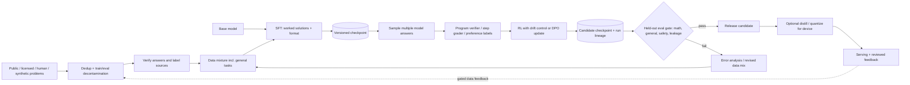

# G19 — Model Development and Post-Training: Main Interview Guide

> **Source:** [G19_Model_Development_And_Post_Training.md](G19_Model_Development_And_Post_Training.md), especially §§1–12. Use the [Deep Dive](G19_Model_Development_And_Post_Training_Deep_Dive.md) for methods and arithmetic and the [Cheat Sheet](G19_Model_Development_And_Post_Training_Cheat_Sheet.md) for rehearsal. The source constructs the design from reported prompts; its run sizes and throughput are illustrations, not measured training results.

## The anchor and its variants

The anchor is “design a model that solves math problems,” walking from data through supervised fine-tuning (SFT), post-training and evaluation. Three neighboring prompts change one constraint in that pipeline.

| Case | Shared foundation | What changes |
|---|---|---|
| #84 Math model (anchor) | Verified data → SFT → scored rollouts → eval gate | Correct answers and, if required, valid working. |
| #73 Compute-constrained LLM training | Same data/run/checkpoint discipline | Model size, parallelism and GPU-hour allocation. |
| #81 Harmless but useful model | Same post-training and gate | Balance harmful compliance against over-refusal. |
| #83 Polite phone model | Same trained candidate and eval loop | Distill/quantize to device memory and test on the phone. |

## Questions to ask the interviewer

| Ask | Design consequence |
|---|---|
| Which math level and task distribution? | Determines datasets and what counts as generalization. |
| Final answer only or correct working/proofs too? | Chooses final-answer verifier versus step-level review. |
| Calculator/code tools allowed? | Moves arithmetic outside weights and changes SFT examples. |
| Who uses it and what does a wrong answer cost? | Sets abstention and human-check requirements. |
| Adapt an existing base model or pretrain? | Changes budget by orders of magnitude. |
| What GPU-hour, latency and device limits apply? | Chooses model size, adapters and deployment path. |

## Requirements: Functional + Non-Functional

The easiest way to frame requirements in an interview is:

> **Functional = what the system does. Non-functional = how well it does it and what constraints it must satisfy.**

### Functional requirements — what the system must do

1. **Collect answer-checkable examples.**
2. **Deduplicate and decontaminate** against evaluation.
3. **SFT** on worked solutions and honest “ill-posed” cases.
4. **Sample model attempts.**
5. **Score** correctness / working / style with the right verifier or preference method.
6. **Update and checkpoint.**
7. **Gate release** on held-out accuracy, general ability, safety, and contamination.

### Non-functional requirements — how well / under what constraints

| Requirement | Example target / constraint |
|---|---|
| **Reproducibility** | Data / config / seed / checkpoint lineage. |
| **Budget** | Fixed compute with stop rules. |
| **Integrity** | No hidden benchmark leakage; no unmeasured general-skill regression. |
| **Safety** | No safety “win” from blanket refusal. |
| **On-device variant** | Fit memory; meet latency/battery on the real phone. |
| **FLOPs (illustrative)** | 7B × 50M SFT tokens ≈ 2.1×10¹⁸ FLOPs (`6ND`). 50K prompts × 8 rollouts × 1K ≈ 400M gen tokens ≈ 5.6×10¹⁸ gen + 1.68×10¹⁹ update. Sampled post-training and eval dominate. ~2 GPU-hour SFT is an assumed-throughput sketch, not a guarantee. |

### Interview shortcut

If asked **“What are the requirements?”**, say:

> **“Functionally, clean data, SFT, sample, score, checkpoint, then a held-out gate. Non-functionally, reproducible lineage, no eval leak, and the model does not approve its own release.”**

## Architecture

The model is the **object being trained**, not an agent that approves its own release. Programs, calibrated graders and humans provide labels; deterministic experiment tracking and release policy decide which checkpoint advances. Evaluation failure loops back to data/error analysis.

### Step-by-step architecture

- Collect problems with trustworthy answer labels, deduplicate near twins, remove evaluation overlap and record collection/label provenance.
- Verify final answers where programs or symbolic checks can do so; send ambiguous or high-impact labels to humans. Mix general tasks to resist math-only forgetting.
- Start from a base model and use SFT to teach the worked-solution format, marked final answers and appropriate uncertainty; save a reproducible checkpoint.
- Sample several answers from that checkpoint and score with a final-answer verifier, step grader or preference labels according to the target; audit high-reward examples for reward hacking.
- Update the policy with a drift control or use DPO on preference pairs; log data hash, code, config, seed and optimizer/checkpoint state.
- Compare every candidate with a decontaminated held-out set plus general-skill and safety/over-refusal suites. A failed gate sends evidence back to error analysis and the data mix.
- Deploy only a passing candidate. If a device ceiling applies, distill and quantize, then rerun quality, latency, memory and battery evaluation on the actual device. Reviewed production feedback enters a gated data flywheel.

## Choices to defend

**SFT versus post-training:** SFT teaches the shape of a response. For checkable math, scored model attempts teach selection of correct answers. A final-answer verifier can reward correct numbers reached by bad working, so use step labels if reasoning validity matters. Preference pairs are better suited to tone and helpfulness. Keep a drift penalty and inspect high-reward samples, or the model learns the scorer’s blind spots.

**Evaluation integrity:** split by source and time, inspect n-gram/embedding overlap, and report pass@1 with its sampling settings. A large offline gain can be leakage. Gate general ability, fabrication on ill-posed problems, harmful compliance and over-refusal, not only math accuracy. Do not tune repeatedly on the final test set.

**Compute budget:** size by `~6ND` training FLOPs, memory and effective throughput. Use LoRA/QLoRA for quick iteration; full fine-tuning only after a demonstrated adapter ceiling. For larger runs, use sharded state, parallelism appropriate to layer size, streamed data with recorded order and checkpoints including optimizer and loader position. Track evaluation gain per GPU-hour and kill stagnant runs.

**Phone variant:** illustrative 3B weights need about **1.5GB at 4-bit** before KV cache and runtime overhead; a 1–2GB budget may require a smaller model, shorter context or both. Distill for task behavior, quantize, train politeness preferences and measure the quantized student on the slowest supported phone.

## Two-minute interview answer

“I would pin the target before picking a method: level of math, final answer versus valid working, tool access and budget. I collect checkable examples, deduplicate and decontaminate them, then use short SFT to teach the response format. I sample the model’s own answers and use a program verifier for final-answer correctness, adding step review only if the reasoning must itself be valid. Post-training includes drift control and audits of high-reward samples. Each checkpoint passes a held-out, source/time-separated gate for math, general ability, ill-posed cases and safety before release. I budget GPU hours around rollouts and evaluation, checkpoint the full run state, and treat compute, harm or device constraints as changes to specific stages rather than redesigning the entire pipeline.”
