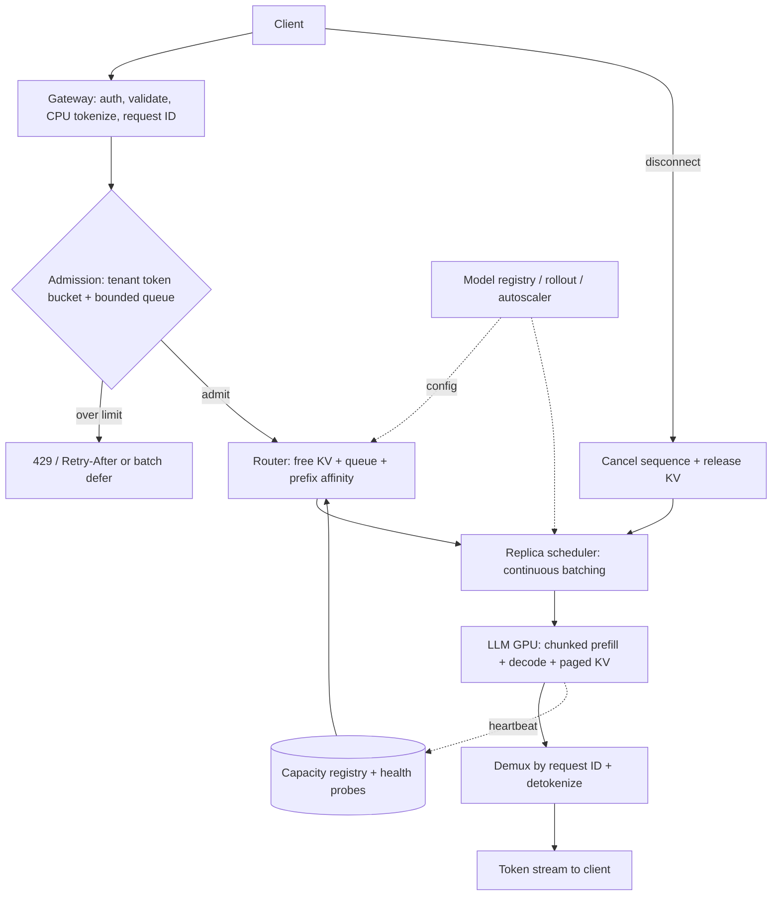

# G20 — LLM Inference Serving: Main Interview Guide

> **Source:** [G20_LLM_Inference_Serving.md](G20_LLM_Inference_Serving.md), especially §§1–11 for the anchor and §§12–15 for variants. Use the [Deep Dive](G20_LLM_Inference_Serving_Deep_Dive.md) for scheduling, KV and failover mechanics and the [Cheat Sheet](G20_LLM_Inference_Serving_Cheat_Sheet.md) for rehearsal. The source states that its serving design and all capacity figures are constructed examples, not measurements of an actual engine.

## Anchor and related prompts

The anchor asks for end-to-end batching of LLM requests, including **which GPU has capacity** and **what happens when one fails**. A GPU is a stateful server with a KV-memory budget. Prefill drives time to first token; decode drives per-token speed and completion time.

| Case | Shared foundation | What changes |
|---|---|---|
| #76 Batching system (anchor) | Admission → capacity-aware routing → local scheduler → streamed result | Balanced interactive service with failover. |
| #75 One GPU, up to 100 synchronous inputs | Same request IDs and batching | Size-or-time flush, futures and one bounded queue. |
| #77 100,000 requests/s | Same token-work method | Independent cells, global backpressure and large reserved headroom. |
| #79 Review a junior design | Same invariants | Rank flaws such as static generative batches, unbounded FIFO and round-robin routing. |
| #74 High inference latency | Same spans | Diagnose tokenization, network, queue, prefill, KV, decode and post-processing. |

## Questions to ask the interviewer

| Ask | Design consequence |
|---|---|
| Input and output tokens at p50/p95? | Prices prefill, decode and KV memory. |
| Interactive or offline, streamed or whole response? | Sets TTFT/TPOT SLOs and batch policy. |
| One model or many, variable output lengths? | Determines pool isolation and continuous batching. |
| Peak/burst shape, tenants and priorities? | Sets admission, fairness and headroom. |
| What should a caller see after mid-stream failure? | Chooses continuation versus explicit partial error. |

## Requirements and illustrative sizing

**Functional:** validate/tokenize requests; apply per-tenant token budgets; route to a healthy GPU with free KV capacity; continuously batch variable-length generation; demultiplex responses by request ID; stream/cancel; handle replica/zone failure; reject overload early. Add model-version canary/drain and detailed queue-versus-service metrics.

**Non-functional:** proposed source example of p95 TTFT ≤500ms and TPOT ≤50ms at 1,000 rps, 99.9% explicit completion/failure, no lost or misdelivered request, tenant fairness, bounded queue and goodput within SLO. The source targets ≤70% measured replica capacity for headroom; actual thresholds need load tests.

With assumed **1,000 input / 250 output tokens**, one replica processing **20K input tokens/s prefill** and **2.5K output tokens/s aggregate decode**, one request costs `1000/20000 + 250/2500 = 0.15 replica-seconds`. At **1,000 rps** and **70% utilization**, the compute estimate is about **214 replicas**. About seven seconds/request implies ~7,000 in flight; at 64 sequences/replica, slot count needs ~110 replicas, so compute is the tighter estimate. These rates are assumptions; load-test the chosen model and hardware.

## Architecture

The LLM performs prefill and token-by-token decode. Code owns request identity, quotas, admission, placement, scheduling policy, health, retry budget and response routing. Replica-local memory checks have final authority over whether a sequence fits.

### Step-by-step architecture

- The gateway authenticates, assigns a request ID, validates limits and tokenizes on CPU so estimated token work is known before GPU use.
- Admission charges tenant tokens, places accepted requests in a bounded priority queue and returns a clear retry/defer signal when the SLO cannot be met.
- The router samples healthy replicas using free KV blocks, queue length and shared-prefix warmth; the replica performs the final capacity check to avoid stale-registry herding.
- A replica scheduler continuously adds waiting sequences and removes finished ones at decode steps; chunked prefill protects ongoing token streams from a long incoming prompt.
- The GPU model runs prefill and decode while paged KV blocks are allocated on demand. Tokens are matched to callers by request ID, detokenized and streamed.
- Health probes evict sick replicas. Unstreamed requests may retry under a budget; after partial output, the product either resumes by re-prefilling with caveats or returns an explicit partial error.
- A client disconnect or stop request cancels model/tool work and frees KV. Rollouts drain replicas and canary new versions rather than dropping active requests.

## Choices and failure modes

**Continuous versus static batching:** static generative batches wait for the longest output; short requests waste slots. Iteration-level batching lets each sequence leave as soon as it finishes. A size-or-time flush suits one-GPU fixed-shape synchronous work; variable-length generation still benefits from continuous batching.

**KV memory is capacity:** the source's illustrative 32-layer, eight-KV-head, 128-dimension fp16 model uses about **128KiB of KV per token**. A 1,250-token sequence uses ~160MB; an 8,000-token sequence uses ~1GB. Paged allocation reduces reservation waste and fragmentation. The router must use free KV, not round-robin or only running-request count. Prefix affinity saves prefill only while the preferred replica has headroom.

**Failover:** liveness alone misses a hung GPU. Add readiness and a one-token deep probe. A failed replica loses its KV. Before any token streamed, retry elsewhere. After streaming, rebuilding state from prompt plus emitted text is exact only under greedy decoding; sampling can diverge, so an explicit partial error may be the honest product choice. Cap retries and retain spare zone capacity to avoid a retry storm while replacement GPUs warm.

**Cost:** measure goodput per GPU-hour, batch occupancy, KV use, queue wait and cost per million output tokens. Cap output and cancel abandoned streams before buying more GPUs. Move non-interactive work to a batch tier and use prefix caching only on identical prefixes.

## Variants and evaluation

For #75, a single GPU batcher flushes at 100 requests **or** a short wait; each synchronous caller has a request-ID future and timeout, and the queue is bounded. For #77, price the workload before saying 100K rps: the source's assumed chat shape implies ~21,400 replicas at 70%, while short completions imply ~2,570. Use independent cells and global backpressure so one hot tenant or deploy does not damage the fleet. For #79, lead a review with the three highest risks and their fixes.

Track p50/p95 TTFT, TPOT, queue wait, service time, prefill/decode throughput, prefix hit rate, KV occupancy/preemptions, cancellation delay, explicit failures and **goodput** (requests finished within SLO). Load-test actual prompt/output distributions, zone failure, stale capacity heartbeats, long-prefill interference and overload before claiming the illustrative replica count works.

## Two-minute interview answer

“I would ask for input and output token distributions and the first-token and per-token targets before sizing. I tokenize at the gateway, admit by per-tenant token budget and bounded queue, then route by free KV capacity rather than round-robin. Each GPU schedules continuously, admitting and finishing sequences at decode steps, with chunked prefill and paged KV to protect latency and memory. Tokens are demultiplexed by request ID and streamed; disconnect cancels the sequence. A capacity registry plus readiness and one-token probes evicts sick GPUs. Unstreamed work retries under a budget; streamed work has an explicit continuation or partial-error policy. The source’s 214-replica example is arithmetic on assumed throughput, so I would validate it with goodput, TTFT, TPOT and KV use on the actual model.”
