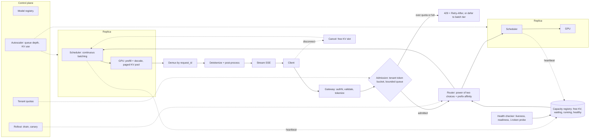

# LLM Inference Serving: Batching, Routing and Failover

*A bigger batch buys throughput, and every request inside it pays for that throughput in latency.*

◷ 26 min

These prompts look like AI questions and are graded as distributed-systems questions: queues, batches, load balancing, health and backpressure. Treat the GPU as an expensive, stateful server with a memory budget, and the rest follows. This page consolidates group G21 of `CASE_STUDY_INDEX.xlsx` into one read for the day before.

| Case in the group | What it contributes here |
|---|---|
| #76 Anthropic: end-to-end batching system for LLM queries, with "which GPU has capacity?" and "how do you handle failover?" (anchor) | Sections 1 to 11, 16 and 17: the whole design |
| #75 Anthropic: one GPU, up to 100 inputs per batch, synchronous callers | Section 12: the anchor shrunk to one box |
| #77 Anthropic: token-generation service at 100,000 requests per second | Section 13: the anchor scaled out, with admission control |
| #79 Anthropic: review a junior developer's batching design | Section 14: the anchor used as a critique rubric |
| #74 OpenAI favourite: diagnose high latency in an LLM inference pipeline | Section 15: the stack walk, shared with G14 |
| Self-drill for G21 *(own construction)* | Section 17 |

**Read this first.** The repo has no worked design for this group and no notes on continuous batching, paged attention or any serving engine. The design on this page is therefore *own construction*. It is built from general serving practice. It is grounded where the repo does speak: the air-gapped chapter's replica memory and sizing formula, and the cost playbook additions on prefill, decode, Little's Law and goodput. Every number below is a stated assumption, never a benchmark. In the room, say "I would replace these with a load test of the actual model."

---

## 1. Ask What Kind of Request Before Sizing Anything

The request shape sets the design, and "100,000 requests per second" means nothing until the tokens per request are known. A 20-token completion and a 2,000-token essay differ in GPU work by two orders of magnitude.

Ask five questions first, and state an assumption for each one the interviewer declines *(own construction)*.

| Question | Why it matters | Anchor assumption |
|---|---|---|
| How many input and output tokens per request, at p50 and p95? | Input drives prefill; output drives decode. They cost GPU time differently | 1,000 in, 250 out on average |
| Interactive or offline? Streamed or whole? | Interactive needs a first-token target; offline can batch hard | Interactive, streamed |
| What latency matters: first token, per token, or total? | Three different SLOs with three different fixes | First token and per-token both |
| One model or many? Fixed or variable output length? | Variable length rules out static batching | One model, variable output |
| Peak rate, burst shape, tenants and priorities? | Sets headroom, fairness and shedding policy | 1,000 rps peak, bursty, several tenants |

The weak answer draws a load balancer, a queue and a pool of GPUs, then stops. It never says what a batch is or why a GPU fills up. The strong answer names the two phases of inference in the first two minutes *(from the additions file, section B1)*. Prefill processes the whole prompt in parallel and sets time to first token. Decode generates one token at a time and sets tokens per second. Every later decision is a way of scheduling those two phases on scarce memory.

> *"A GPU is a stateful server with a memory budget. Prefill sets first-token time, decode sets streaming speed, and the KV cache decides how many requests fit at once. I'll design the scheduler around those three facts."*

## 2. State Requirements as Testable Constraints

A requirement that cannot fail a test is a preference. "Fast" is a preference. "First token under 500 ms at p95 at 1,000 rps" is a constraint. The split and the numbers are *own construction*; the nouns come from the prompts.

The must-haves come straight from #76's wording. Accept generation requests with a prompt, a token limit, sampling parameters and a stream flag. Batch them onto GPUs. Route each batch or sequence to a GPU with capacity. Deliver the response to the right caller, streamed or whole. Detect a failed GPU and move its work elsewhere. Reject or queue excess load rather than collapse under it.

The should-haves make it operable. Per-tenant quotas and priorities. Cancellation when a caller disconnects. Prefix reuse for repeated system prompts. Rolling model upgrades without dropping traffic. Metrics that separate queue wait from service time.

| Constraint | Stated so it can be tested |
|---|---|
| First-token latency (TTFT) | p95 ≤ 500 ms at peak for interactive traffic |
| Per-token latency (TPOT) | p95 ≤ 50 ms between streamed tokens |
| Throughput | 1,000 rps sustained at peak with the anchor request shape |
| Utilization target | ≤ 70% of measured replica capacity, because latency knees past roughly 70–80% *(additions file, section D)* |
| Availability | 99.9% of requests complete or fail explicitly; none vanish |
| Failover | Loss of one GPU loses no un-streamed request; loss of one zone keeps service at reduced headroom |
| Fairness | No tenant above its quota can raise another tenant's p95 |
| Goodput | Requests per second that finish inside the SLO, reported next to raw throughput *(additions file, section D)* |

Every must-have then needs an owner in the architecture *(own construction)*.

| Requirement | Primary component(s) |
|---|---|
| Accept and validate requests | API gateway, tokenizer service |
| Batch onto GPUs | Per-replica scheduler with continuous batching |
| Route to a GPU with capacity | Router plus capacity registry |
| Deliver to the right caller | Response demultiplexer keyed by request ID, streaming layer |
| Survive GPU failure | Health checker, router eviction, retry with a budget |
| Reject excess load | Admission controller, bounded queues |
| Fairness | Per-tenant token buckets at admission |

## 3. Size by Tokens per Second, Then Check With Little's Law

GPU count is the answer, never the method. The method converts requests into token work, then token work into replicas. The air-gapped chapter gives the formula verbatim:

```
Replicas = ⌈ (QPS × Tokens_request) / (TokensPerSecond_replica × UtilizationTarget) ⌉
```

That chapter also warns that a candidate who talks GPU count without throughput misses the bottleneck. One who talks memory without throughput misses the placement constraint. Both checks follow.

**Step one: token work per request.** Prefill and decode run at very different rates, so price each request in replica-seconds. Every rate below is an assumption for an illustrative 8B-class model on one 80 GB GPU *(own construction)*.

| Assumption | Value |
|---|---|
| Prefill rate per replica | 20,000 input tokens/s |
| Decode rate per replica | 2,500 output tokens/s aggregate, at ~64 concurrent sequences |
| Anchor request | 1,000 input, 250 output tokens |
| Peak arrival | 1,000 rps |
| Utilization target | 70% |

One request costs 1,000 ÷ 20,000 + 250 ÷ 2,500 = 0.05 + 0.10 = **0.15 replica-seconds**. At 1,000 rps that is 150 replicas of pure work. Divided by 0.70, provision **about 214 replicas**. Decode is two-thirds of the bill, so output tokens are the lever that matters most.

**Step two: concurrency by Little's Law.** Work in flight equals arrival rate times time in system *(additions file, section B3)*. Each sequence streams at about 2,500 ÷ 64 ≈ 39 tokens/s, or roughly 26 ms a token. A request therefore lives about 0.5 s to first token plus 250 × 26 ms ≈ 6.4 s, so ~7 s in total. At 1,000 rps that is **~7,000 sequences in flight**. At 64 slots a replica, that needs ~110 replicas' worth of slots.

**Step three: take the larger number.** Compute says 214 and slots say 110, so compute binds. Provision about 214, then add N+1 per zone for failover. Say both checks aloud. A reviewer trusts the number that survived two independent methods.

**Step four: check memory.** The KV cache stores each sequence's attention keys and values. It grows with every token *(section 7 does the arithmetic)*. The air-gapped chapter's replica budget, kept verbatim, shows the shape. Quantized weights 12 GB, runtime overhead 2 GB, KV cache and activations 6 GB, batch buffers and fragmentation slack 2 GB. That totals roughly 22 GB, too tight for a 24 GB card. The same chapter's rule applies here: if the replica count exceeds the pool, challenge the request profile rather than ask for more hardware.

## 4. Draw the Architecture End to End

The organising rule is admit, then route, then batch per GPU. Admission and routing are global and stateless. Batching is local, because only the replica knows its own memory.

The whole system *(own construction)*, with the control plane above and the request path below:

```
 ╔══════════════════════ CONTROL PLANE (changes are deployments) ═══════════════════════╗
 ║  model registry + versions · autoscaler (queue depth, KV use) · tenant quotas         ║
 ║  routing policy · health policy · SLO targets · rollout controller (drain, canary)    ║
 ╚═══════════════════════════════════════╤═══════════════════════════════════════════════╝
                                         │ configures every box below
 ╔══════════════════════ DATA PLANE (per request) ═══════════════════════════════════════╗
 ║                                                                                       ║
 ║ client ─> GATEWAY ─> ADMISSION ────────────> ROUTER ────────────────> REPLICA k      ║
 ║           authN      token bucket per         reads capacity           ┌───────────┐ ║
 ║           validate   tenant, weighted by      registry: free KV,       │ SCHEDULER │ ║
 ║           TOKENIZE   estimated tokens;        queue, running seqs;     │ continuous│ ║
 ║           (CPU)      bounded queue;           power-of-two choice      │ batching  │ ║
 ║                      429 + Retry-After        + prefix affinity        │ ┌───────┐ │ ║
 ║                        │ reject                    │                   │ │  GPU  │ │ ║
 ║                        v                           │                   │ │prefill│ │ ║
 ║                   shed or defer                    │                   │ │decode │ │ ║
 ║                   to batch tier                    │                   │ │KV pool│ │ ║
 ║                                                    │                   │ └───────┘ │ ║
 ║                                                    │                   └─────┬─────┘ ║
 ║  CAPACITY REGISTRY <── heartbeat every ~1 s ───────┼─────────────────────────┤       ║
 ║  (free KV blocks, waiting, running, healthy)       │                         │ tokens║
 ║                                                    │                         v       ║
 ║  HEALTH CHECKER ── liveness · readiness · 1-token probe ──> evict / drain    │       ║
 ║                                                                              │       ║
 ║ client <── STREAM (SSE) <── DETOKENIZE + post-process <── DEMUX by request_id┘       ║
 ║            cancel on disconnect ──────────────────────────> free KV slot now          ║
 ║                                                                                       ║
 ║  OBSERVABILITY: TTFT · TPOT · queue wait vs service time · goodput · KV use · errors  ║
 ╚═══════════════════════════════════════════════════════════════════════════════════════╝
```

The same flow for viewers that render Mermaid *(own construction)*:



Read the components in request order *(own construction)*.

| # | Component | Responsibility | Fails how |
|---|---|---|---|
| 01 | Gateway | Authenticates, validates, assigns `request_id`, tokenizes | Closed: bad request rejected before any GPU work |
| 02 | Tokenizer | Converts text to token IDs on CPU, counts tokens for admission | Degrades: add CPU replicas; never on the GPU hot path |
| 03 | Admission controller | Per-tenant token buckets weighted by estimated tokens; bounded queue | Closed: 429 with Retry-After, never an unbounded wait |
| 04 | Router | Picks a replica by free capacity, with prefix affinity | Degrades: falls back to least-loaded if affinity target is hot |
| 05 | Capacity registry | Holds each replica's free KV blocks, queue and running count | Degrades: stale data tolerated by random-two choice plus replica-side check |
| 06 | Replica scheduler | Continuous batching: admits and evicts sequences every decode step | Degrades: preempts lowest priority when KV is full |
| 07 | GPU worker | Runs prefill and decode on a paged KV pool | Fails: evicted by health checker, work rerouted |
| 08 | Health checker | Liveness, readiness, and a one-token synthetic probe | Closed: an unready replica gets no traffic |
| 09 | Demultiplexer | Returns each sequence's tokens to its caller by `request_id` | Closed: an unmatched ID is dropped and logged, never misdelivered |
| 10 | Detokenizer and post-processor | Incremental text, stop sequences, safety or schema checks | Degrades: skip optional checks, never skip required ones |
| 11 | Streaming layer | Server-sent events or websocket, flushes per token | Degrades: fall back to whole response |
| 12 | Autoscaler | Scales on queue depth and KV use, not on CPU | Degrades: headroom absorbs the minutes a GPU takes to load |
| 13 | Rollout controller | Drains a replica before upgrade; canaries a new model version | Closed: a failing canary stops the rollout |

Point at three boundaries while the diagram is up. Admission is the only place load is refused, so no queue downstream grows without limit. The router decides where but never how, because only the replica sees its memory. And the request ID is the thread through everything, so a response can never reach the wrong caller.

## 5. Tokenize at the Edge, Not on the GPU

Tokenization is CPU work, and CPU work on the GPU's request thread steals time from the most expensive machine in the building. Move it to the gateway.

Tokenizing early buys three things. The admission controller can charge a tenant by real tokens, not by request count. The router can estimate KV memory before it picks a replica. And a malformed or oversized prompt fails before it reaches a queue. Cap input length at the gateway and return a clear error, because one 100,000-token prompt can monopolise a replica's prefill.

Detokenization runs at the other end, incrementally. Some tokens are partial characters, so the streaming layer must buffer until a complete character exists. Stop sequences are checked on text, not tokens, for the same reason.

## 6. Batch Continuously, Not Statically

A GPU is efficient only when it multiplies many rows at once, so batching is the whole point. The question is when a batch forms and when it ends. Three answers exist *(own construction; general serving practice)*.

| Strategy | How a batch forms | How it ends | Right for |
|---|---|---|---|
| Static | Wait for N requests | When the longest sequence finishes | Fixed-shape offline work only |
| Dynamic | Flush at N requests **or** a max wait, such as 10 ms | When the batch's forward pass finishes | Fixed-shape models: embeddings, classifiers, rerankers |
| Continuous (iteration-level) | New sequences join at every decode step | Each sequence leaves the moment it finishes | Generative LLMs with variable output length |

Static batching fails generative traffic for one reason. A batch finishes when its longest member finishes. A 10-token answer batched with a 1,000-token answer waits for the long one, and its slot sits idle for 990 steps. Continuous batching fixes this by scheduling at the level of a single decode step. Every iteration, the scheduler removes finished sequences and admits waiting ones into the freed slots.

Prefill complicates the picture. A long prompt's prefill can stall every decoding sequence in the batch for tens of milliseconds, which shows up as a per-token latency spike. Split long prefills into chunks and interleave them with decode steps. This trades a little first-token time for the new request against smooth streaming for everyone else. Say that trade aloud; it is the same throughput-versus-latency tension the tagline names.

Batch size is a knob, not a constant. Larger batches raise throughput and raise per-token latency. Tune it against the TPOT SLO, and let the scheduler cap concurrency when per-token latency drifts up.

## 7. Budget the KV Cache Before It Budgets You

The KV cache, not compute, usually caps how many sequences fit on a GPU. Every generated token adds keys and values for every layer, and they stay resident until the sequence ends.

The arithmetic, for the illustrative model *(own construction; the architecture numbers are assumptions)*:

| Input | Assumed value |
|---|---|
| Layers | 32 |
| KV heads (grouped-query attention) | 8 |
| Head dimension | 128 |
| Bytes per value (fp16) | 2 |

Per token: 2 (keys and values) × 32 × 8 × 128 × 2 bytes = **128 KiB**. The anchor sequence of 1,250 tokens needs about 160 MB. Sixty-four of them need about 10 GB, which fits beside 16 GB of fp16 weights on an 80 GB card. Now raise the context to 8,000 tokens. One sequence needs about 1 GB, and a ~50 GB KV pool holds only ~50 sequences. **Context length divides concurrency.** This is why the router must know free KV, not just request counts.

Reserving each sequence's maximum length up front wastes most of that memory, because most sequences stop early. Paged attention allocates KV in small fixed-size blocks, such as 16 tokens, on demand. Blocks need not be contiguous, so fragmentation mostly disappears. Blocks can also be shared. Requests with an identical system prompt point at the same prefix blocks, which is prefix caching at the serving layer.

When the pool fills anyway, the scheduler must choose a victim. Preempt the lowest-priority or youngest sequence. Either recompute its KV later or swap it to CPU memory. Never let an allocation failure crash the replica, because that turns one long prompt into an outage for 64 callers.

## 8. Route by Free Capacity, Not by Turn

Round-robin assumes every request costs the same, and here none do. The follow-up "how do you determine which GPU has capacity?" is answered by a capacity registry *(own construction)*.

Each replica publishes its state on a heartbeat of about one second, and piggybacks it on every response. The state is free KV blocks, sequences running, sequences waiting, and health. The router scores a replica by the free KV left after reserving the new request's estimated tokens. Queue length breaks ties.

Registry data is always slightly stale. If every router picks the single best replica, they all pick the same one and herd onto it. Sample two replicas at random and send to the better of the two. This "power of two choices" spreads load almost as well as perfect knowledge and tolerates stale data. The replica makes the final check. If it cannot fit the request, it rejects quickly and the router tries the next choice.

Prefix affinity layers on top. Hash the prompt's shared prefix, such as the system prompt, to a preferred replica, so its cached prefix blocks get reused. Override affinity when the preferred replica is hot. A cache hit is not worth a queue.

## 9. Fail Over Without Losing the Request Twice

A GPU fails in ways a process check cannot see. The process stays alive while the device throws memory errors or hangs mid-kernel. Health checks therefore need three layers *(own construction)*.

| Check | Question it answers | Action on failure |
|---|---|---|
| Liveness | Is the process running? | Restart the process |
| Readiness | Is the model loaded and the scheduler accepting? | Remove from the registry; send no traffic |
| Deep probe | Can it generate one token inside, say, 200 ms? | Drain and evict; alert on repeated failure |

A failed replica takes its KV cache with it, so in-flight sequences cannot continue elsewhere. The recovery depends on what the caller has already seen. If no token has streamed, retry the request from scratch on another replica. The caller sees only extra latency. If tokens have streamed, re-prefill the prompt plus the emitted tokens on a new replica and continue. Only greedy decoding makes that continuation exact; with sampling, the text may diverge. The honest alternative is an explicit error with the partial output, and the product decides which.

Retries need a budget. When a zone degrades, naive retries multiply load exactly when capacity drops, which is a retry storm. Cap retries at a fixed share of traffic, such as 10%, with jittered backoff. Key them by `request_id` so a duplicate is detected, not re-run. Keep N+1 headroom per zone, and fail over between zones at the router. A new GPU takes minutes to load weights, so headroom, not autoscaling, absorbs a sudden loss *(the cold-start driver, CORE_8 drivers file)*.

## 10. Admit Less Work Before the Queue Admits Too Much

An unbounded queue converts overload into latency for everyone, then into timeouts for everyone. Refuse work early and explicitly instead.

Admission control sits at the gateway. Each tenant holds a token bucket charged by estimated tokens, not by request count, so one tenant's long prompts cannot starve another's short ones. The queue behind it is bounded, and a full queue returns 429 with a Retry-After header. The bound follows from Little's Law: a queue deeper than the SLO allows will only ever serve requests that have already failed their SLO.

Backpressure flows upstream. Replicas signal saturation through the registry. The router stops sending, admission tightens, and the gateway rejects. Shed by priority. Interactive traffic stays and offline traffic moves to a batch tier, which the provider-limits scenario in G14 answers the same way *(additions file, section E)*. The same rule appears in G10 at batch scale: admission control belongs before the quota breach, not after.

## 11. Stream Every Token and Cancel on Disconnect

Streaming changes perceived latency, not total latency. A user reading the first sentence after 500 ms experiences a fast system, even if the answer takes seven seconds to finish.

Stream over server-sent events or a websocket, and flush per token. Watch for proxies that buffer responses; one buffering hop turns streaming back into a seven-second wait. Report TTFT and TPOT as separate SLOs, because they break for different reasons *(additions file, section D)*.

Cancellation is a cost control, not only a courtesy. When a caller disconnects, the sequence keeps decoding unless someone stops it, burning GPU time on tokens nobody reads *(additions file, section E)*. Propagate the disconnect to the scheduler, which evicts the sequence and frees its KV blocks at the next step.

## 12. Shrink It to One GPU for the Synchronous Variant (#75)

#75 is the anchor with the distribution removed: one GPU, up to 100 inputs per batch, callers who block and wait. The whole design becomes intake, a batcher, the GPU and a way back to the right caller.

The mechanism *(own construction)*. The HTTP handler assigns a `request_id`, parks a future for it, and enqueues the request. A batcher thread flushes when it holds 100 requests **or** when the oldest has waited, say, 20 ms. The GPU worker runs the batch. The demultiplexer resolves each future by `request_id`, and the handler returns. A timeout on the future turns a stuck batch into an error rather than a hung connection.

Say the arithmetic. Assume a full batch of 100 takes 200 ms. Maximum throughput is then 500 requests per second. At 400 rps the GPU runs at 80% and queues start to form in bursts. Latency is wait time plus queue time plus 200 ms. Synchronous callers each hold a connection, so by Little's Law 400 rps at ~0.3 s holds about 120 open connections. That is trivial until overload, when it grows without limit. Bound the queue at two batches, 200 requests, and return 503 with Retry-After beyond that.

One follow-up changes the answer. If the model generates variable-length output, a static batch of 100 finishes at its longest member. Move to continuous batching from section 6, even on one GPU.

## 13. Scale It to 100,000 Requests per Second (#77)

#77 is the anchor at a scale where the request shape decides everything. Price it before drawing anything, using section 3's replica-seconds *(own construction; same assumed rates)*.

| Request shape | Input / output tokens | Replica-seconds each | Replicas at 100,000 rps and 70% |
|---|---|---|---|
| Chat answer | 1,000 / 250 | 0.15 | ~21,400 |
| Short completion | 200 / 20 | 0.018 | ~2,570 |
| Scoring, one token out | 500 / 1 | 0.0254 | ~3,630 |

The spread is almost an order of magnitude. The air-gapped chapter's pointer applies directly: expect numbers that produce an absurd replica count, and challenge the request mix instead of defending the count.

The architecture adds four things at this scale.

**Cells.** Split the fleet into independent cells of a few hundred replicas, each with its own router and registry. A global load balancer spreads traffic across cells and regions. A bad deployment or a hot tenant then damages one cell, not the service.

**Admission by tokens.** At 100,000 rps, request counts lie. Charge every tenant's bucket by estimated tokens, and shed the lowest priority first.

**Backpressure across layers.** Cells report saturation upward. The global balancer shifts traffic before a cell's queue deepens.

**Headroom over autoscaling.** GPUs take minutes to start, so autoscaling follows the daily curve while reserved headroom absorbs bursts. Prefix caching and short output caps are the cheapest capacity at this size, because they cut replica-seconds per request directly.

## 14. Review the Junior Design Against the Anchor (#79)

#79 is not a design question. It hands over a design and asks what to change, so the anchor becomes the rubric. Open with what works. Clarify the requirements the design assumed. Then name the top three risks by severity, not every flaw found.

The checklist *(own construction)*:

| Look for | Why it breaks | Change it to |
|---|---|---|
| Static batches for generative output | Short answers wait for the longest in the batch | Continuous batching |
| Flush only when the batch is full | At low traffic, a request waits forever for company | Size-or-timeout flush |
| One global FIFO queue, unbounded | Overload becomes timeouts for everyone; no fairness | Bounded per-tenant admission, 429 early |
| Round-robin routing | Ignores memory; long prompts pile onto one GPU | Route by free KV, power of two choices |
| Sizing by GPU count | No link between traffic and capacity | Token work per request, Little's Law cross-check |
| Health check is a TCP ping | A hung GPU stays in rotation | Readiness plus a one-token probe |
| Unlimited retries | Retry storm when a zone degrades | Retry budget, jitter, `request_id` dedupe |
| No request ID through the pipeline | Responses can reach the wrong caller | Demux by `request_id` end to end |
| No cancellation | Abandoned requests burn GPU time | Propagate disconnect, free KV |
| Tokenizing on the GPU thread | CPU work stalls the most expensive resource | Tokenize at the gateway |
| One latency metric | Queue wait masquerades as a slow model | Separate TTFT, TPOT, queue wait and service time |

Deliver it as a conversation, not a verdict. A review that ranks three fixes and explains the failure each prevents shows seniority. Eleven findings read aloud shows only that the list was memorised.

## 15. Walk the Latency Stack When It Gets Slow (#74)

#74 asks for the full stack: tokenization, network, batch size, KV cache, post-processing. G14 section 12 answers it from the application's traces. This section answers it from inside the serving layer. First ask which latency is slow: first token, per token, or total *(from question 9 of the decomposition questions file)*.

| Layer | Symptom | Likely cause | Check |
|---|---|---|---|
| Tokenization | Slow before the request reaches a queue | Long inputs tokenized on a starved CPU pool | Gateway span time; CPU saturation |
| Network | Slow for one region or client | Cross-region hop, TLS setup, a buffering proxy | Client-to-gateway span; TTFT by region |
| Queue wait | TTFT slow only at peak; p99 up, p50 flat | Utilization past the knee | Queue wait against service time |
| Batch size | TPOT slow while throughput looks healthy | Batches too large for the per-token SLO | TPOT against running sequences |
| Prefill | TTFT slow on long prompts | Prompt growth, prefills stalling decode | TTFT by input tokens; chunked prefill on or off |
| KV cache | Latency spikes, preemptions | Pool full; low prefix-cache hit rate | KV use, preemption count, prefix hit rate |
| Decode | Starts fast, then drags | Output length grew | Output tokens per request |
| Post-processing | Gap after the last token | Safety filter, schema validation, detokenization | Span after final token |

The rule from the additions file carries the diagnosis. A frozen screen points at the prompt, the queue or prefill. An answer that starts fast then drags points at output length. The peak-only follow-up gets the answer from G14. Separate queue wait from service time, then add admission control and shed non-interactive traffic.

## 16. Deliver It in Forty-Five Minutes

The hour belongs to batching, routing and failover, because those are the words in the prompt. Spend it in this order *(own construction)*.

| Minutes | What to say |
|---|---|
| 0–5 | Request shape questions; prefill versus decode; state the assumptions |
| 5–10 | Requirements with numbers; TTFT, TPOT, goodput |
| 10–15 | Sizing: replica-seconds, 214 replicas, Little's Law cross-check |
| 15–25 | The diagram: admit, route, batch per replica |
| 25–32 | Continuous batching and the KV budget |
| 32–38 | "Which GPU has capacity?" and failover |
| 38–43 | Admission, backpressure, streaming, cancellation |
| 43–45 | The cost pivot and what would prove the design wrong |

The two-minute summary to rehearse:

> *"I'd treat each GPU as a stateful server with a memory budget. Requests are tokenized at the gateway and admitted against per-tenant token buckets, with a bounded queue that returns 429 early. A router picks a replica from a capacity registry of free KV blocks. It uses power-of-two choices so stale data doesn't cause herding, and prefix affinity so shared prompts reuse cache. Each replica runs continuous batching on a paged KV pool, with chunked prefill so long prompts don't stall streams. A three-layer health check evicts bad GPUs. Un-streamed requests retry under a budget, and streamed ones re-prefill or fail explicitly. At a thousand requests a second with this shape, that's about 214 replicas plus N+1 per zone. The metric that would prove me wrong is goodput, not throughput."*

## 17. Answer the Cost Pivot in Ten Minutes

The pivot after a good design is "the GPU bill is too high." There is no playbook drill for this group, so the card is *own construction*. It is built from the output-token and cold-start drivers and the additions file.

| | |
|---|---|
| Dominant driver | GPU time wasted in half-empty batches, long outputs, and KV memory that caps concurrency |
| Cheapest lever first | Continuous batching to raise occupancy; cap `max_tokens`; prefix caching for shared prompts; quantize to fit more sequences per GPU; move non-interactive traffic to an off-peak batch tier |
| Metric that proves it | Goodput per GPU-hour; cost per million output tokens; batch occupancy; KV utilization; queue wait p95 |
| Do not | Buy more GPUs before measuring batch occupancy and KV use |
| 60-second line | A GPU is paid for by the hour, so idle slots are the bill. Fill batches continuously, cap output, reuse prefixes, quantize to fit more sequences, and push anything non-interactive to a cheaper tier. Prove it with goodput per GPU-hour. |

Decode was two-thirds of the anchor's replica-seconds in section 3, so output length is the first number to cut. Cancellation on disconnect is the second, because it recovers tokens nobody reads. Every strong cost answer follows four verbs in order. Measure, with occupancy and goodput. Route, sending offline work to the batch tier. Bound, with output caps and admission. Cache safely, sharing prefix blocks only for identical prefixes.

---

## Key Takeaways

- Request shape comes first, because prefill and decode price input and output tokens differently.
- Requirements name TTFT, TPOT, goodput and a utilization ceiling, each with a number a test can fail.
- Sizing converts requests to replica-seconds, then cross-checks concurrency with Little's Law, and the larger answer wins.
- The architecture admits globally, routes by capacity, and batches locally where memory is visible.
- Tokenization runs on CPU at the gateway so admission and routing can use real token counts.
- Continuous batching lets each sequence leave when it finishes, and chunked prefill protects streaming.
- KV memory divides concurrency by context length, and paged blocks remove fragmentation and share prefixes.
- The router picks by free KV with power-of-two choices, and the replica makes the final check.
- Failover needs a deep health probe, a retry budget, and a rule for requests that have already streamed.
- Admission refuses work early by tokens per tenant, and backpressure flows upward to the gateway.
- Streaming fixes perceived latency, and cancellation on disconnect saves real GPU time.
- The single-GPU variant is size-or-timeout batching, futures keyed by request ID, and a bounded queue.
- At 100,000 rps the request mix swings the fleet by an order of magnitude, so price it before drawing it.
- A design review ranks three fixes by severity, using the anchor as the rubric.
- Latency diagnosis first asks which latency, then walks tokenization, network, queue, batch, prefill, KV, decode and post-processing.
- The forty-five minutes go to batching, routing and failover, closed by the two-minute summary.
- The cost pivot is answered with occupancy, output caps, prefix reuse and a batch tier, proven by goodput per GPU-hour.

## Check Yourself

1. **Why does input length hurt first-token time while output length hurts total time?** Prefill processes the whole prompt in parallel and sets time to first token; decode generates one token at a time and sets streaming speed and total time.
2. **Size the anchor aloud.** 1,000 ÷ 20,000 + 250 ÷ 2,500 = 0.15 replica-seconds; × 1,000 rps = 150; ÷ 0.7 ≈ 214 replicas. Little's Law gives ~7,000 in flight, ~110 replicas of slots, so compute binds.
3. **Why does static batching fail generative traffic?** A batch ends when its longest sequence ends, so short answers wait and their slots sit idle.
4. **How does context length change concurrency?** At 128 KiB a token, an 8,000-token sequence needs about 1 GB of KV, so a ~50 GB pool holds about 50 sequences.
5. **How is "which GPU has capacity?" answered?** Replicas heartbeat free KV, running and waiting counts to a registry. The router samples two, picks the better one, and the replica rejects quickly if the request does not fit.
6. **A GPU dies mid-generation. What happens to its requests?** Un-streamed ones retry from scratch elsewhere. Streamed ones re-prefill prompt plus emitted tokens, exact only under greedy decoding, or fail explicitly with the partial output.
7. **Why charge admission by tokens rather than requests?** One tenant's long prompts cost many times another's short ones, so request counts let a heavy tenant starve light ones.
8. **In #75, why bound the queue at two batches?** A deeper queue only serves requests that have already missed the SLO, and synchronous callers hold a connection each while they wait.
9. **What is the first question for #77?** What each request is. A chat answer and a one-token score differ by almost an order of magnitude in fleet size.
10. **Name three findings to lead a #79 review with.** Static batching for generative output, an unbounded global FIFO, and round-robin routing that ignores memory.
11. **Latency is fine at p50 and bad at p99 only at peak. Where to look?** Queueing: separate queue wait from service time, then tighten admission and shed non-interactive work.
12. **What is the cost card's 60-second line?** A GPU is paid for by the hour, so idle slots are the bill. Fill batches continuously, cap output, reuse prefixes, quantize, push non-interactive work to a cheaper tier, and prove it with goodput per GPU-hour.

## References

All paths are relative to `06_Interview_Prep/`.

| Section | Source |
|---|---|
| Member prompts | `OpenAI_Applied/Sample_Questions/openai_decomposition_interview_prep.html`, Tier 1 prompts 9 (#74), 10 (#75), 11 (#76), 12 (#77) and 14 (#79); the section C note that these test "batching, queuing, load balancing" |
| 3 (formula, memory budget, "challenge the request profile"), 13 | `FDE/FDE_System_Design_Interview_20_Scenarios/Version_2/chapter-7-ai-system-for-an-air-gapped-environment-tutorial_v2.md`, "Memory and Throughput per Replica" and "The Replica Sizing Formula" |
| 1, 3, 10, 11, 15, 17 | `Study_Guides/Cost_Latency_Optimization/ADDITIONS_BEYOND_PLAYBOOK.md`, sections B1 (prefill vs decode), B3 (Little's Law), D (goodput, TTFT vs TPOT, utilization knee) and E (rate limits, cancellation) |
| 9, 17 | `Study_Guides/Cost_Latency_Optimization/CORE_8_DRIVERS_MEMORIZE.md`, driver 2 and the latency-only add-ons (cold starts) |
| 15 | `OpenAI_Applied/Sample_Questions/OpenAI Applied_Engineer_Problem_Decomposition_Questions.md`, question 9 (latency decomposition and "which latency" split) |
| Cross-references | `Case_Study_Groups/G14_Observability_And_Production_Diagnosis.md` section 12 (#74 from the application's traces); `G10_High_Volume_Batch_Pipeline.md` (admission before the quota breach); `G11_Deep_Research_Agent.md` (Little's Law used for provisioning); `G07_Secure_Multi_Tenant_AI_Platform.md` (quotas and noisy neighbours) |
| 2 to 17 wherever marked *(own construction)*: every throughput, memory and latency figure; continuous batching, chunked prefill, paged KV, power-of-two routing, health layers, cells | Built for this page from general serving practice. The repo has no worked design and no serving-engine notes for these topics, so treat them as the candidate's own reasoning, not a sourced claim |
