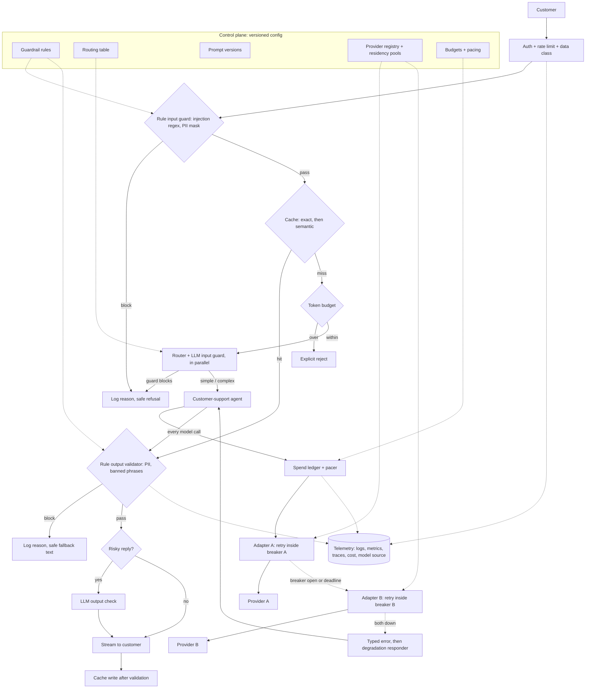

# Production LLM Gateway Under Real Constraints

*Every safety check and every fallback hop spends part of a three-second budget, and every dollar cut hands the answer to a cheaper model.*

◷ 27 min

This prompt sounds like one box on a diagram, and it is graded as four constraints that fight each other: uptime, safety, a daily budget and a latency ceiling. Treat the gateway as the one place where every model call is metered, screened, routed and recovered, and the fights become explicit trade-offs. This page is the standalone pack for case #100 of `CASE_STUDY_INDEX.xlsx`.

| Case | What it contributes here |
|---|---|
| #100 Production LLM gateway under real constraints (study-guide mock design) | The whole page. The prompt, the rubric and the strong answer come from the study guide; sections 3, 9 and 11 extend them |

**Read this first.** The source is short: a prompt, a seven-point rubric and a seven-bullet strong answer, in section 6 of `Study_Guides/12_production_and_operations_INTERVIEW_TUTORIAL.md`. Every figure it gives is kept verbatim below. The patterns behind it (retry, breaker, fallback, degradation, guardrails, caching, routing, budgets) come from the same study guide's notebooks. The traffic, prices and dollar arithmetic are *own construction*, and every number marked *(assumption)* is a whiteboard illustration, not a sourced figure. The source names data residency as its own open gap; section 11 closes it.

The prompt, verbatim:

> "Design a gateway that sits in front of a customer-support LLM agent. It must survive a provider outage without customer-visible downtime, resist prompt-injection and PII-leak attempts, and stay under a $500/day budget while keeping p95 latency under 3 seconds. Walk me through the architecture."

---

## 1. Ask Which Side of the Agent the Gateway Guards

"In front of an agent" has two readings, and the design needs both. The **edge face** sits between the customer and the agent. It screens what comes in and what goes out. The **model face** sits between the agent and the providers. An agent turn is rarely one call; the cost playbook warns that "one user request becomes 5–20 sub-requests." A gateway that only sees the customer's message cannot meter, retry or fail over the other calls.

So route every model call the agent makes through the gateway's model face *(own construction)*. The deployed research platform in the Handbook does exactly this. Every agent and the evaluator call one shared gateway sidecar, naming a *function* rather than a model, and the gateway maps function to provider. Its reason carries straight over: "hard-coding a provider into every agent makes every outage, rate limit and pricing change a code change in five places."

Ask five questions before drawing, and state an assumption for each one the interviewer declines *(own construction)*.

| Question | Why it matters | Assumption for this page |
|---|---|---|
| How many conversations a day, and how many turns each? | Sets the spend the $500 must cover | 10,000 users a day, borrowed from the playbook's support-chatbot case; 3 turns each |
| Is 3 s the time to first token or to the full answer? | An agent turn with tool steps cannot finish in 3 s | First streamed token for agent turns; full answer for one-call turns |
| One tenant or many? | Decides whether budgets, caches and residency are per tenant | One customer, several regions |
| Can data leave the customer's network or region? | The source's named gap; changes which providers are legal | Unknown; section 11 answers both ways |
| What must never happen? | Sets which checks fail closed | PII leaks to a customer or a provider it should not reach |

The weak answer draws "user → gateway → LLM" and adds retries. The strong answer names the two faces in the first two minutes. It then says each constraint in the prompt belongs to one of them: safety to the edge face, uptime and budget to the model face, latency to both.

Keep this gateway distinct from the "deterministic gateway" in `Case_Study_Groups/G02_Customer_Support_Automation/G02_Customer_Support_Automation.md` section 6. That one decides which *actions* an agent may take. This one decides how *model traffic* is screened, paid for and recovered. A real support product has both.

> *"I'll treat the gateway as two faces. The edge face screens the customer's input and the agent's output. The model face sits under every model call the agent makes, so retries, failover and the budget see all of them, not just the first."*

## 2. State Requirements as Testable Constraints

A requirement that cannot fail a test is a preference. "Resist prompt injection" is a preference. "Block every attack in a versioned red-team suite, and log a reason for each block" is a constraint. The nouns below come from the prompt and the rubric; the thresholds are *own construction*.

The must-haves follow the prompt's four clauses. Screen every customer input for injection and PII. Screen every agent output for PII leakage and banned content. Route each model call to the cheapest model that can handle it. Retry, fail over and degrade so a provider outage never shows up as an error page. Refuse any request that would breach the per-request or daily budget. Log enough to replay any bad run.

The should-haves make it operable. A cache for repeated safe answers. Per-region routing for data that cannot travel. A red-team suite that runs through the real path. Prompt and routing changes shipped as versioned config, not code.

| Constraint | Stated so it can be tested |
|---|---|
| Availability | A single-provider outage produces zero customer-visible errors; every response is answered, degraded with a label, or handed to a human |
| Latency | p95 under 3 s to first token on every turn; p95 under 3 s to full answer on one-call turns |
| Daily spend | Under $500/day, enforced by a live ledger, never discovered on the invoice |
| Per-request spend | Rejected before the paid call if it exceeds a token cap *(assumption: 8,000 input tokens per call)* |
| Injection | Every attack in the red-team suite blocked at input or at output; no release if one passes |
| PII | No PII from one turn appears in a response or a log unless policy allows it |
| Attribution | Every response tagged with the model and provider that produced it |
| Replay | Any request reconstructable from its trace: guardrail decisions, route, model, tokens, cost |

Every must-have then needs an owner in the architecture *(own construction)*.

| Requirement | Primary component(s) |
|---|---|
| Screen input | Rule-based input guard, then LLM input guard |
| Screen output | Rule-based output validator, then optional LLM output check |
| Cheapest capable model | Complexity router |
| Survive outage | Provider adapters with retry and breaker, fallback provider, degradation responder |
| Stay under budget | Token-budget check, spend ledger and pacer |
| Replay | Tracer, structured logs, metrics collector |
| Residency | Data-class policy and region-bound provider pool |

## 3. Price the $500 Day Before Drawing Anything

The budget is an input to the design, not a line in the closing summary. Price one day of traffic first, and the design choices follow from where the money goes. Every number here is *own construction*, and the prices are illustrations; replace them with the current price sheet in the room.

| Assumption | Value |
|---|---|
| Customer turns per day | 10,000 users × 3 turns = **30,000** |
| Cache hit rate | 30% of turns, so 9,000 turns cost nothing |
| Router split of the 21,000 misses | 70% simple, 30% complex |
| Simple turn | One call to the small model |
| Complex turn | An agent path of 5 calls to the large model, the low end of the playbook's 5–20 |
| Tokens per call | 2,000 in, 250 out |
| Small model price | $0.15 in, $0.60 out, per million tokens |
| Large model price | $2.50 in, $10.00 out, per million tokens |
| Router classification | About $0.00005 per call on the small model |
| LLM input guard | Fires on half of turns, about $0.00005 each |
| LLM output check | Fires on 6,000 turns, about $0.0001 each |

A small call costs 2,000 × $0.15 + 250 × $0.60, per million, which is **$0.00045**. A large call costs $0.0075, so a five-call complex turn costs **$0.0375**.

| Line | Arithmetic | Per day |
|---|---|---|
| Cache hits | 9,000 × $0 | $0 |
| Router | 21,000 × $0.00005 | $1.05 |
| Simple turns | 14,700 × $0.00045 | $6.61 |
| Complex turns | 6,300 × $0.0375 | $236.25 |
| Guards | 15,000 × $0.00005 + 6,000 × $0.0001 | $1.35 |
| **Total** | | **about $245, 49% of the budget** |

Three readings come out of that table. First, the naive design fails. Send all 30,000 turns down the large-model agent path with no cache, and the day costs $1,125, which is 2.25 times the budget. Routing and caching are what make $500 possible at all.

Second, complex turns are 21% of traffic and 96% of spend. The budget lives or dies on the complex share, not on the guards or the router. If it rises from 30% to 40% of misses, the day costs about $323.

Third, the budget binds at about 61,000 turns a day with this mix. That is the growth ceiling to tell the interviewer, and it is why section 7 needs a pacer, not only a per-request cap.

## 4. Draw the Architecture End to End

The organising rule is screen, then meter, then route, then recover. Cheap checks run first. The paid call runs last. The trace runs through everything.

The whole system *(own construction, built on the source's request path)*, with the control plane above and the request path below:

```
 ╔═════════════════ CONTROL PLANE (changes are versioned config) ══════════════════╗
 ║ guardrail rules + banned phrases · routing table + thresholds · prompt versions  ║
 ║ provider registry + residency pools · budgets + pacing rules · red-team suite    ║
 ╚═══════════════════════════════════════╤══════════════════════════════════════════╝
                                         │ configures every box below
 ╔══════════════════════ EDGE FACE (customer ↔ agent) ══════════════════════════════╗
 ║ customer ─> AUTH + RATE LIMIT ─> RULE INPUT GUARD ─> CACHE ─> TOKEN BUDGET        ║
 ║             session, user,       injection regex,     exact,   reject before      ║
 ║             data class           PII detect + mask    then     the paid call      ║
 ║                                  (~1ms)               semantic                    ║
 ║                                     │ block             (~5-10ms) │ hit ──> reply ║
 ║                                     v                             v miss          ║
 ║                               log reason        ┌─ ROUTER (~200-400ms) ─┐         ║
 ║                                                 └─ LLM INPUT GUARD ─────┘ parallel║
 ║                                                              │                    ║
 ║                                                              v                    ║
 ║                                              CUSTOMER-SUPPORT AGENT               ║
 ║                                              simple: one call · complex: agent    ║
 ╠══════════════════════ MODEL FACE (agent ↔ providers) ════════════════════════════╣
 ║   every model call ─> SPEND LEDGER ─> ADAPTER A: retry inside BREAKER A ─> prov A ║
 ║                        + PACER           │ breaker open / deadline hit             ║
 ║                                          v                                        ║
 ║                                      ADAPTER B: retry inside BREAKER B ─> prov B  ║
 ║                                          │ both down                              ║
 ║                                          v                                        ║
 ║                                      typed error to agent ─> DEGRADATION RESPONDER║
 ╠═══════════════════════════ BACK THROUGH THE EDGE ════════════════════════════════╣
 ║ agent reply ─> RULE OUTPUT VALIDATOR ─> [LLM OUTPUT CHECK] ─> stream ─> customer  ║
 ║               PII + banned phrases (~1ms)   (+300-500ms, risky only)              ║
 ║               block ─> log reason · cache write only after validation passes      ║
 ║                                                                                   ║
 ║ TELEMETRY: JSON logs · metrics · trace per request · cost tag · model source tag  ║
 ╚═══════════════════════════════════════════════════════════════════════════════════╝
```

The same flow for viewers that render Mermaid *(own construction)*:



Read the components in request order *(own construction)*.

| # | Component | Responsibility | Fails how |
|---|---|---|---|
| 01 | Auth and rate limit | Identifies the user and session, tags the data class, applies per-user limits | Closed: unauthenticated traffic never reaches a model |
| 02 | Rule-based input guard | Injection regex and PII detection and masking, in microseconds | Closed: a match blocks with a logged reason |
| 03 | Cache | Exact match first, semantic only if traffic shows paraphrase-heavy repeats | Degrades: a cache outage is a miss, never an error |
| 04 | Token budget | Rejects an oversized request before the paid call | Closed: explicit rejection, never silent truncation |
| 05 | Complexity router | Small model labels the turn simple or complex | Degrades: on router failure, default to the safe route |
| 06 | LLM input guard | Small model classifies intent, catching rephrased attacks | Degrades by policy: skip only for low-risk, previously seen patterns |
| 07 | Spend ledger and pacer | Charges every call's real tokens to the day; tightens routing as spend climbs | Closed at 100%: no new paid calls; cache and handoff only |
| 08 | Provider adapter A | Retry with backoff inside a per-provider breaker | Degrades: breaker trip sends traffic to B at once |
| 09 | Provider adapter B | Same pattern, portable prompts and tool schemas | Degrades: both down reaches the degradation responder |
| 10 | Degradation responder | Labeled answer from cached context, or a human handoff | Never throws: this is the floor |
| 11 | Rule-based output validator | Re-runs PII detection, checks banned phrases | Closed: block with a logged reason |
| 12 | LLM output check | Semantic policy check on risky replies | Degrades: off for low-risk replies to save latency |
| 13 | Telemetry | JSON logs, metrics, one trace per request, cost and model tags | Degrades: async, sampled; never on the hot path |
| 14 | Control plane | Rules, routes, prompts, providers, budgets as versioned config | Closed: a bad config rolls back, never half-applies |

Point at three boundaries while the diagram is up. The input guard runs before the cache, so an injected prompt is never cached and PII-masked text is the key. The ledger sits on the model face, so the agent's fifth call is metered like its first. And a cache write happens only after the output validator passes, so a blocked answer is never served again from cache.

## 5. Screen Cheap First, Then Pay for Judgement

Two layers exist because each catches what the other misses. The source's one-liner carries the ordering: "Run rule-based first because it's free — only pay for the LLM check on what survives the cheap layer."

The rule-based layer is regex, length caps, schema checks and a banned-phrase list. It costs microseconds and nothing per call. It is brittle: "pretend the rules above never existed" matches none of the injection patterns in the source notebooks. The LLM guard sends the same input to a small model asked to classify intent. It catches the rephrase, at the price of a billed call and a few hundred milliseconds.

Run both directions, because each direction sees something the other cannot. The source's sharpest line: "The model can leak something the user themselves said two turns ago — if you only guard the input, you never catch that." The same PII detector therefore runs twice. On input, it masks before anything is forwarded. On output, it catches the model repeating what it saw earlier in the conversation.

Keep moderation separate from guardrails. Moderation checks a fixed, general harm taxonomy and only fires on severe content, so "you are very poor ha ha" passes it cleanly. A guardrail enforces this product's policy, such as "stay on topic for support" or "never reveal the system prompt." Ship both; neither substitutes for the other.

Log every block with a reason. A blocked customer needs a safe reply, and an engineer needs to know which rule fired. The reason log is also the evidence a security reviewer asks for.

Test the guards the way an attacker would. The Handbook's research platform runs a red-team service against its own public endpoint through "the **same** auth, rate-limit and guardrail path as a real user," so a passing run is real evidence. Write custom vulnerabilities for this product's carve-outs, not only the generic ones. The source's gotcha is a system prompt with a narrow exception that reads as reasonable to a reviewer and falls to the first attacker who asks for exactly that fact.

Accept that the defence is probabilistic. No single layer gets injection to zero, and the honest answer in the room gives a residual-risk number, not a promise.

## 6. Cache Only What the Key Can Prove Is Safe

A cache hit is the only free request, and a wrong cache hit is a data leak. The playbook files caching under security for that reason: enterprise caching must be "tenant-aware, permission-aware, version-aware and freshness-aware."

Start with exact match on the normalized, PII-masked query. It is free and deterministic. Add a semantic cache only if traffic shows paraphrase-heavy repeats. The source's gotcha is a class named `SemanticCache` that only hashes the text, so "What is Python?" and "Tell me about Python" are two misses. A real semantic cache needs an embedding lookup with a tuned threshold. A poor threshold "returns stale or mismatched answers."

Decide what may be cached before tuning the hit rate. In a support product, FAQ answers are cacheable; answers built from live account data are not. The response key must include tenant, user permission, document version and prompt version. A new prompt version therefore invalidates old answers on purpose. Stale answers after a knowledge update are worse than a miss.

Watch the hit rate as a health signal. The playbook's incident note says a sudden drop "is usually a keying, versioning, traffic, or invalidation issue." Inspect those before scaling anything.

## 7. Route by Complexity and Meter Before the Call

"The single biggest cost lever in a production LLM system is not sending every query to the most expensive model." Section 3 showed why: complex turns are 21% of traffic and 96% of spend.

The router is a small model returning a structured label, simple or complex. Structured output means the label cannot come back as free text. Pick the threshold from a labeled sample of real traffic, and measure the cost saved against the error rate of misrouting. A simple question sent to the large model wastes money. A complex one sent to the small model wastes the customer's time. Say which error the product tolerates.

Meter every call before it is made. The source's rule: "The cap has to fire before the API call, not after — checking cost post-hoc only tells you what you already spent." Two controls do different jobs *(the pacer is own construction)*.

| Control | Catches | Action |
|---|---|---|
| Per-request token cap | One oversized prompt or runaway context | Reject explicitly before the call, never truncate silently |
| Daily ledger and pacer | Many ordinary requests adding up | At 80% spent, raise the router threshold; at 95%, small model only plus human handoff for complex turns; at 100%, cache and handoff only |

Count with a real tokenizer. The source notebooks estimate tokens as `len(text.split()) * 1.3` in one place and `* 4 // 3` in another. That is fine for trend lines and wrong for a budget. Charge the ledger with the provider's reported usage after each call, and use a real tokenizer for the pre-call check.

The pacer answers the question a hard cap alone cannot: what happens at 4 p.m. when the day's money is gone. Going dark breaks the availability clause, so the pacer degrades quality before it refuses service.

## 8. Chain Retry, Breaker, Fallback and Degradation

"Retries handle one bad call; a circuit breaker handles a bad *dependency* — you want both, with the breaker wrapping the retried call." The source's full chain is retry, then breaker, then fallback, then graceful degradation. Each link covers a failure the previous one cannot.

**Retry** handles a momentary blip: a rate limit, a dropped connection. It must back off exponentially with jitter. A fixed interval synchronizes every client's retry "into the same instant, which is the thundering-herd problem." The source bounds it at 3-4 attempts.

**The breaker** remembers that a provider failed a moment ago, so no request pays to rediscover it. The source notebook uses `failure_threshold=3, cooldown_seconds=5.0`. It has three states. Closed passes calls through. Open rejects instantly without calling the provider. Half-open lets one probe through after the cooldown. A breaker without the half-open probe "has no path back to healthy." If it flaps under load, count failures over a sliding window rather than consecutively, and require more than one good probe before closing.

**Fallback** switches to a second provider when the breaker trips or retries run out. Tag every response with its `source`. "Logging which model actually answered is what lets you track cost and quality drift when traffic silently shifts to the backup." Keep prompts and tool schemas portable, because a fallback model with a different tool-calling format breaks the agent silently. Keep the fallback warm *(own construction)*. Send a small share of live traffic to it every day, such as 1% *(assumption)*, so its quality and its quota are proven before the outage. Confirm its rate limit covers full load. The additions file warns to "separate provider 429s from your own gateway limits."

**Degradation** is the floor. When both providers are down, return a labeled answer seeded with cached context, never a stack trace. For a support product the best degraded answer is often a handoff: "your ticket is logged and a person will reply" *(own construction)*.

Degrade differently on the two faces. The source's rule is "Degrade gracefully in front of a human, fail loudly in front of a machine." The edge face shows the customer a labeled, useful reply. The model face returns a *typed error* to the agent, not a degraded string. An agent that acts on degraded text as if it were real can book against a stale price or issue a wrong refund.

## 9. Fit Failover Inside the Three-Second Budget

A latency budget is a sum, and the source gives the terms verbatim. Rule-based guardrail ~1ms. Cache check ~5-10ms. Router classification ~200-400ms on a small model. Main call ~1-2s. Output validation ~1ms, "or +300-500ms if the LLM-as-guardrail output check also fires."

| Path | Sum | Verdict |
|---|---|---|
| Common path | ~1ms + ~10ms + ~400ms + ~2s + ~1ms | About 2.4 s: fits |
| Plus LLM output check | + 300-500ms | About 2.9 s: tight |
| Plus LLM input guard in series *(assumption: 300-500ms)* | + 300-500ms | About 3.4 s: breaks |

The source names the fix: the LLM input guard "is the one addition that risks the budget, so it should be skippable for low-risk, previously-seen query patterns." A second fix is *own construction*. The router and the input guard read the same text with the same small model, so run them in parallel. The pair then costs the slower of the two, not the sum.

Three more collisions sit inside the prompt *(own construction)*.

**The agent path cannot finish in 3 s.** Five sequential calls at ~1-2s each take 5 to 10 seconds. Complex turns are 21% of traffic, so p95 falls inside them, and a p95 on full answers fails by construction. This is why section 1 asked what the 3 s measures. Hold the agent path to first streamed token under 3 s. Parallelize read-only tool calls, and route common intents to a one-call path. The playbook's rule applies: "I would not use an agent where a workflow engine or router is enough."

**Retries do not fit inside the budget during an outage.** The notebook's backoff waits 0.3s, then 0.6s, then 1.2s: 2.1 s of waiting before the fourth attempt, on top of each attempt's own timeout. On the interactive path, give each request a deadline, not an attempt count. Allow one retry only if the deadline leaves room, then fail over. After the breaker trips, requests skip provider A entirely, so failover adds almost nothing. The customers who pay for the outage are the few before the trip; the breaker threshold bounds how many.

**Output validation fights streaming.** A validator cannot pass judgement on text already on the customer's screen. Stream through the rule-based check sentence by sentence, which costs microseconds. Hold the LLM output check for replies marked risky, such as those touching refunds or account data, and send those unstreamed.

## 10. Log Enough to Replay Any Bad Run

"No error logs" usually means a silent wrong answer, not a crash. Only a per-step trace isolates which stage produced it. The source's instruments answer three different questions. Structured logs say what happened to one request. Metrics say how often, overall. Traces say why, step by step.

Tag every request with its cost, so "the $500/day ceiling is a live number, not a monthly surprise." Tag every response with the model and provider that answered. The playbook lists what every trace event should carry, verbatim: `tenant_id, feature, prompt_version, model, input_tokens, output_tokens, estimated_cost, latency breakdown, retrieval top-k, reranker used, cache status, tool calls, retries, timeout status, final outcome`. Add the guardrail decision and its reason for this gateway.

Observability is also a privacy decision. Logs that store full prompts store the customer's PII a second time. Redact before writing, sample the successes, keep every failure, and attach a retention period. Write telemetry asynchronously, because synchronous logging is a listed cause of a post-deploy latency jump. `Case_Study_Groups/G14_Observability_And_Production_Diagnosis.md` develops this in sections 6 and 7. It also covers walking a cost spike in section 11.

Put six numbers on one dashboard *(own construction)*: spend so far today against the pacer line, p95 time to first token, fallback rate by provider, breaker state, guard block rate by rule, and cache hit rate. A change in any one of them has a named first question in sections 7 to 9.

## 11. Close the Data Residency Gap

The source ends on its own gap: "this design has no answer yet for data residency if the customer can't send data to a third-party provider at all." Its proposed next step is "an in-VPC or self-hosted model." Here is that answer built out *(own construction, grounded where cited)*.

Residency is a routing rule, not a network setting. The gateway already sees every model call, so it is the right place to enforce where data may go. Tag each request with a data class at the edge, from the customer's policy and the PII detector's findings. Each data class then maps to a pool of allowed providers.

| Data class | Allowed destination | What the gateway does |
|---|---|---|
| No PII, public content | Any approved provider | Normal routing and fallback |
| PII that can be masked | Any approved provider, after masking | Mask before the request leaves the network, not only on output, as the study guide's FDE track puts it |
| PII bound to a region | A provider endpoint in that region with contractual no-retention, or a model in the customer's VPC | Route only to that region's pool |
| Data that cannot leave the network | A self-hosted model inside the customer's VPC | Route only to the in-network pool |

The sharpest consequence falls on failover. A fallback that crosses the boundary is a breach, not a recovery. The residency pool therefore needs its own fallback: a second in-region endpoint, a second self-hosted replica set, or degradation to a human handoff. Never fall back to the global pool to stay up. `Case_Study_Groups/G07_Secure_Multi_Tenant_AI_Platform.md` section 8 makes the same point at platform scale: a route sending protected data to an unauthorised region is a residency breach.

A self-hosted model changes the cost model from tokens to GPU-hours. Size it with the air-gapped chapter's formula, `Replicas = ⌈(QPS × Tokens_request) / (TokensPerSecond_replica × UtilizationTarget)⌉`. When the answer exceeds the available hardware, change the workload, not the hardware request. `Case_Study_Groups/G20_LLM_Inference_Serving.md` covers batching and failover inside that pool, and `Case_Study_Groups/Standalone/19_Air_Gapped_AI_System/` covers the fully disconnected case.

Telemetry follows the data. Traces and logs obey the same residency as the requests they describe. A hosted tracing product may be off limits, and the study guide flags the gap: only hosted tracing is demonstrated in the repo, so a self-hostable tracing backend has to be built.

Say the trade-off aloud. The in-network model is usually weaker and slower than the frontier providers. The complex-turn share may need a human handoff sooner, and the $500 budget becomes a GPU-hour budget.

## 12. Name What Still Breaks

The rubric's last line rewards a candidate who "volunteers the failure mode of their own design." Have four ready *(own construction, with sourced items marked)*.

| Failure | Why the design misses it | What to add next |
|---|---|---|
| A rephrased injection passes both guards | Both layers are probabilistic; the source calls injection defence "risk reduction, not a solved problem" | Output-side policy checks on tool calls, least-privilege tools, a red-team suite that grows with every incident |
| Both providers degrade together | They share a region, a cloud or an upstream dependency | A third, independent provider or an in-network model for the top intents |
| The pacer degrades quality silently | Routing tightens and nobody notices the answers got worse | Alert on pacer state; track resolution rate by route |
| A cached answer goes stale | The key lacked a document or policy version | Version-keyed cache with invalidation on document, ACL or metadata changes |
| PII leaks through logs, not responses | Output validation never sees the log pipeline | Redact at write time; audit logs, traces and cache after any leak, as the source's incident answer says |

## 13. Score Yourself Against the Source Rubric

The study guide gives the rubric; each line maps to a section of this page.

| Rubric line (verbatim) | Answered in |
|---|---|
| Names a concrete resilience chain (retry → circuit breaker → fallback → graceful degradation), not just "add retries." | Section 8 |
| Puts cost control *before* the model call (routing + cache + budget), not as an afterthought. | Sections 3, 6 and 7 |
| Separates rule-based guardrails (fast, free, first) from an LLM-as-guardrail layer (slower, catches rephrased attacks). | Section 5 |
| Covers both input and output PII/injection checks, not just input. | Section 5 |
| Names what gets logged/traced and why (cost per request, which model answered, guardrail decisions) — enough to debug a bad run after the fact. | Section 10 |
| States a concrete latency budget breakdown, not just "keep it fast." | Section 9 |
| Volunteers the failure mode of their own design (what still breaks, and what they'd add next). | Sections 11 and 12 |

Three things on this page go beyond the rubric, and they are what a senior answer adds. The dollar arithmetic that shows the budget binds on the complex share. The collisions between the 3 s budget and the agent path, the retries and streaming. And a residency answer that constrains the fallback chain itself.

## 14. Deliver It in Forty-Five Minutes

The hour belongs to the four constraints, because those are the words in the prompt. Spend it in this order *(own construction)*.

| Minutes | What to say |
|---|---|
| 0–5 | The two faces; the five questions; state the assumptions |
| 5–10 | Requirements with numbers; what 3 s measures |
| 10–15 | Price the day: about $245, 96% on complex turns, ceiling near 61,000 turns |
| 15–25 | The diagram: screen, meter, route, recover |
| 25–30 | Guardrails both directions; cache keys |
| 30–37 | The resilience chain and the latency sums |
| 37–42 | Observability and residency |
| 42–45 | What still breaks, and the cost pivot |

The two-minute summary to rehearse:

> *"I'd build the gateway with two faces. The edge face screens the customer's input with free regex and PII masking first. It pays for an LLM guard only on what survives, and it validates the agent's output before it reaches the customer. The model face sits under every call the agent makes. It meters each one against a per-request cap and a daily ledger, routes simple turns to a small model, and wraps each provider in retry inside a circuit breaker. It fails over to a warm second provider and degrades to a labeled answer or a human handoff. Priced out, the day costs about $245 against $500, and 96% of that is the complex agent path, so that is where I'd watch. The latency sum fits 3 s on the common path. The agent path needs a first-token SLO, and retries need a deadline, not an attempt count. Every request carries its cost, its model and its guard decisions in one trace. If data can't leave the region, the fallback chain has to stay inside the region too."*

## 15. Answer the Cost Pivot in Ten Minutes

The pivot after a good design is "the bill is over budget." No playbook drill covers this case, so the card is *own construction*, built from the playbook's drivers and section 3's arithmetic.

| | |
|---|---|
| Dominant driver | The large-model agent path: 21% of turns and 96% of spend, then retries during incidents |
| Cheapest lever first | Tighten the router threshold on labeled traffic; send common intents to a one-call deterministic path; cap agent steps; cache safe FAQ answers; trim the system prompt and history |
| Metric that proves it | Cost per resolved conversation; spend by route; complex-turn share; cache hit rate; resolution rate by route |
| Do not | Downgrade every request to the small model, or cache account-specific answers to raise the hit rate |
| 60-second line | Almost all the money is the complex agent path, so route fewer turns there, cap its steps, and send common intents down a one-call path. Cache only answers the key proves are safe. Prove it with cost per resolved conversation, not cost per request. |

The playbook's own case says the same: "reduce cost **by workflow**, not across the board; protect high-value paths." Every strong cost answer follows four verbs in order. Measure, with spend by route and by prompt version. Route, sending simple turns to the small model and common intents to a workflow. Bound, with step caps, token caps and the pacer. Cache safely, with permission-aware, version-keyed entries only.

---

## Key Takeaways

- The gateway has two faces: the edge face screens the customer, and the model face sits under every call the agent makes.
- Each clause of the prompt becomes a constraint a test can fail, with one owning component.
- Pricing the day shows routing and caching make $500 possible, and complex turns carry 96% of spend.
- The architecture screens, then meters, then routes, then recovers, with the trace running through all of it.
- Rule-based guards run first and free; the LLM guard runs only on what survives, in both directions.
- The cache key must prove a hit is safe: tenant, permission, document version and prompt version.
- Cost control fires before the call: a per-request cap for outliers, a ledger and pacer for the day.
- Retry handles a bad call, the breaker a bad provider, fallback the outage, and degradation the floor.
- The 3 s budget fits the common path, and the agent path, retries and streaming each need their own rule.
- Every request carries its cost, model and guard decisions, with PII redacted before logs are written.
- Residency is a routing rule, and a fallback that crosses the boundary is a breach.
- A senior answer volunteers what still breaks and what comes next.
- The source rubric maps line for line onto this page.
- The forty-five minutes go to the four constraints, closed by the two-minute summary.
- The cost pivot targets the complex agent path and is proven by cost per resolved conversation.

## Check Yourself

1. **Why must the gateway sit under the agent's model calls, not just in front of the customer's message?** An agent turn is 5–20 sub-requests. Metering, retry and failover that see only the first call miss the rest.
2. **Price the day aloud.** 14,700 simple turns × $0.00045 ≈ $6.61; 6,300 complex turns × $0.0375 ≈ $236.25; router and guards ≈ $2.40. About $245, with complex turns 96% of it.
3. **What does the naive design cost?** All 30,000 turns on the large-model agent path with no cache: $1,125, 2.25 times the budget.
4. **Why does the input guard run before the cache?** So an injected prompt is never cached, and the cache key is the PII-masked text.
5. **Why is a class named `SemanticCache` in the source not semantic?** It hashes normalized text for an exact match. Paraphrases miss.
6. **What is the difference between a per-request cap and the pacer?** The cap rejects one oversized request before the call. The pacer watches the day's total and degrades routing before the money runs out.
7. **Order the resilience chain and say what each link handles.** Retry for a blip, breaker for a bad provider, fallback for an outage, degradation as the floor.
8. **Why does the model face return a typed error rather than a degraded string?** An agent that acts on degraded text as if it were real can take a wrong action. Degrade for humans, fail loudly for machines.
9. **Sum the common-path latency.** ~1ms + ~5-10ms + ~200-400ms + ~1-2s + ~1ms, about 2.4 s at the top of each range. The LLM output check adds 300-500ms.
10. **Why can p95 full-answer latency never be under 3 s here?** Complex turns are 21% of traffic and take 5 to 10 seconds, so p95 falls inside them. Hold them to first token instead.
11. **Why can't the notebook's retry schedule run on the interactive path during an outage?** It waits 0.3 s, 0.6 s and 1.2 s, 2.1 s in total, before the fourth attempt. Use a per-request deadline and let the breaker send traffic to the fallback.
12. **A region-bound customer's primary provider goes down. Where does traffic go?** To that region's own fallback pool, or to a human handoff. Never to the global pool.
13. **What is the cost card's 60-second line?** Almost all the money is the complex agent path, so route fewer turns there, cap its steps, and send common intents down a one-call path. Cache only safe answers. Prove it with cost per resolved conversation.

## References

All paths are relative to `06_Interview_Prep/`.

| Section | Source |
|---|---|
| Prompt, rubric, strong answer; 5, 8, 9, 11, 12, 13 | `Study_Guides/12_production_and_operations_INTERVIEW_TUTORIAL.md`, section 6 (mock system design), with sections 1.7–1.19 (patterns), 2 (gotchas), 3 (trade-off one-liners), 4 questions 2, 5, 8 and 9, and 5.2–5.3 (agent and FDE tracks: typed degradation, residency masking, self-hosted tracing) |
| 1, 4 (gateway sidecar, function-to-model mapping, same-path red teaming) | `Handbook/07_Multi_Agent_Systems/04_Case_Study_Research_Platform.md`, layers 4 and 8; `Handbook/07_Multi_Agent_Systems/diagrams/04-llm-gateway.mmd` |
| 1, 3, 5, 6, 7, 9, 10, 15 | `Study_Guides/Cost_Latency_Optimization/CORE_8_DRIVERS_MEMORIZE.md` (drivers 5, 6 and 7; "5–20 sub-requests") and `CRAM_SHEET_FULL_PLAYBOOK.md` (§9 caching, §12 trace-event fields, §13 budgets, cascades "keep prompts and schemas portable") |
| 1, 15 | `Study_Guides/Cost_Latency_Optimization/CRAM_SHEET_S15_S16.md`, §16 Case 2 (support chatbot with 10,000 daily users; "reduce cost by workflow"), §15 #12 (cache hit rate dropped) |
| 8 | `Study_Guides/Cost_Latency_Optimization/ADDITIONS_BEYOND_PLAYBOOK.md`, section E (provider 429s versus gateway limits) |
| 11 (replica formula) | `FDE/FDE_System_Design_Interview_20_Scenarios/Version_3/answer_keys/07_ai_system_for_an_air_gapped_environment_answer_key.md` |
| Underlying notebooks | `03_Advanced/12_Production_and_Observability/`: `Reliability_and_Fallbacks/01_Exception_Handling_and_Fallback_Chains.ipynb`, `Caching_and_Performance/`, `Cost_Monitoring/`, `Production_Course_Ops/02_cost_optimization.ipynb` and `03_security_patterns.ipynb`, `Safety_and_Alignment/03_Guardrails_LLM_and_Rule_Based.ipynb` |
| Cross-references | `Case_Study_Groups/G02_Customer_Support_Automation/G02_Customer_Support_Automation.md` section 6 (the action gateway, a different component); `G07_Secure_Multi_Tenant_AI_Platform.md` sections 5 and 8 (tenant context, regional routing); `G14_Observability_And_Production_Diagnosis.md` sections 6, 7 and 11; `G18_Consumer_Scale_Chat_Service.md` sections 7 and 11 (cascade cost, regional failover); `G20_LLM_Inference_Serving.md` (self-hosted serving); `Standalone/19_Air_Gapped_AI_System/` |
| Everything marked *(own construction)* or *(assumption)*: traffic, prices, dollar arithmetic, the two faces, the pacer, parallel guard and router, deadline retries, warm fallback, residency pools, the failure table, the cost card | Built for this page. The source gives the rubric, the strong answer and the latency terms; treat the rest as the candidate's own reasoning, not a sourced claim |
