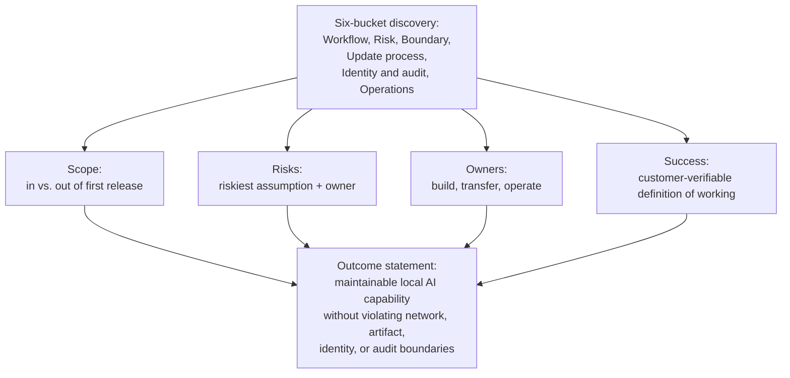
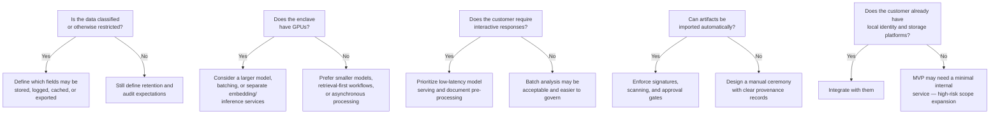
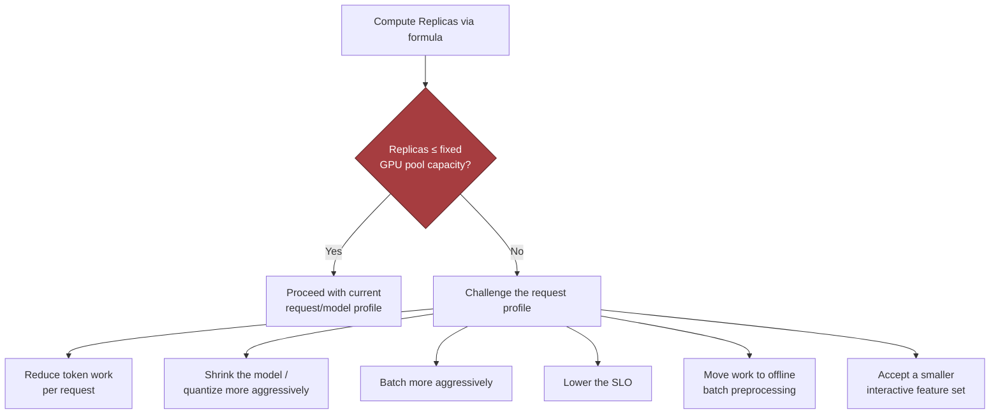
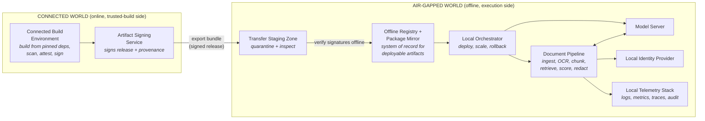
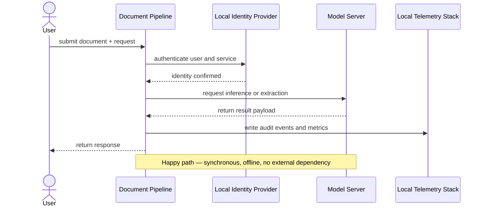
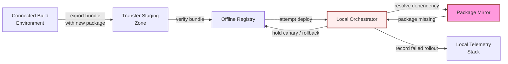
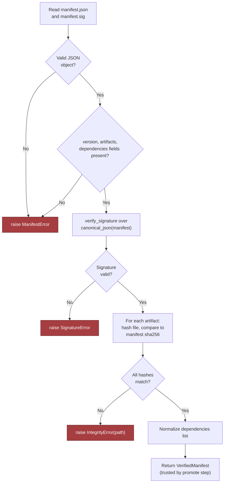
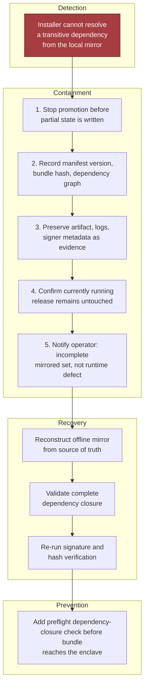
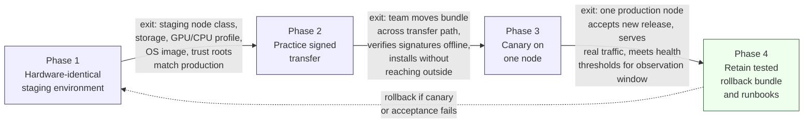
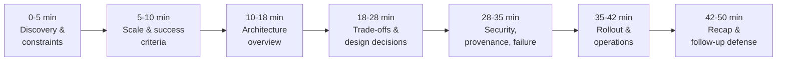

# Chapter 7: Design an AI System for an Air-Gapped Environment

*Source: THE FORWARD DEPLOYED ENGINEER SYSTEM DESIGN INTERVIEW*
*Tutorial format: Interview-ready v2 (bullet-only cram format) — regenerated from the original tutorial's verified content, no new source material added.*

## Table of Contents
- [1. The Customer Problem and Discovery](#1-the-customer-problem-and-discovery)
  - [The Core Tension and Outcome Statement](#the-core-tension-and-outcome-statement)
  - [Stakeholder Map](#stakeholder-map)
  - [Six-Bucket Discovery Framework](#six-bucket-discovery-framework)
  - [Scope, Risks, Owners, Success](#scope-risks-owners-success)
  - [Choosing a Business-Outcome Metric](#choosing-a-business-outcome-metric)
- [2. Clarifying Questions, Requirements, and Constraints](#2-clarifying-questions-requirements-and-constraints)
  - [Six Architecture-Changing Questions](#six-architecture-changing-questions)
  - [From Discovery to Requirements](#from-discovery-to-requirements)
  - [Constraints vs. Preferences](#constraints-vs-preferences)
  - [A Compact Interview Question Tree](#a-compact-interview-question-tree)
  - [MVP Prioritization: Must, Should, Could](#mvp-prioritization-must-should-could)
  - [What the MVP Will Not Support](#what-the-mvp-will-not-support)
  - [Requirement-to-Component Traceability](#requirement-to-component-traceability)
  - [The One Assumption to Protect First](#the-one-assumption-to-protect-first)
  - [Why This Is a Strong FDE Signal](#why-this-is-a-strong-fde-signal)
- [3. Scale Estimates, SLOs, and Capacity](#3-scale-estimates-slos-and-capacity)
  - [Anchor the Load Envelope to Customer Reality](#anchor-the-load-envelope-to-customer-reality)
  - [Storage Sketch](#storage-sketch)
  - [Memory and Throughput per Replica](#memory-and-throughput-per-replica)
  - [The Replica Sizing Formula](#the-replica-sizing-formula)
  - [Worked Example: 1,000 Users, 20 QPS](#worked-example-1000-users-20-qps)
  - [Sensitivity Analysis: Baseline vs. 10x Growth](#sensitivity-analysis-baseline-vs-10x-growth)
  - [What Changes First at 10x Growth](#what-changes-first-at-10x-growth)
  - [SLIs Tied to the Workflow](#slis-tied-to-the-workflow)
- [4. Architecture and End-to-End Flow](#4-architecture-and-end-to-end-flow)
  - [Two Worlds Separated by a Controlled Update Path](#two-worlds-separated-by-a-controlled-update-path)
  - [Nine Components in Dependency Order](#nine-components-in-dependency-order)
  - [Top-Down Architecture Diagram](#top-down-architecture-diagram)
  - [System of Record vs. Cache vs. Queue](#system-of-record-vs-cache-vs-queue)
  - [End-to-End Happy Path](#end-to-end-happy-path)
  - [Sequence Diagram of the Happy Path](#sequence-diagram-of-the-happy-path)
  - [Dependency-Failure Drill: Fail Closed](#dependency-failure-drill-fail-closed)
  - [Backpressure and Flow Control](#backpressure-and-flow-control)
  - [Component Responsibility Table](#component-responsibility-table)
  - [MVP vs. Later Evolution](#mvp-vs-later-evolution)
  - [Control Plane vs. Data Plane](#control-plane-vs-data-plane)
- [5. Data Model, APIs, and Working Code](#5-data-model-apis-and-working-code)
  - [Three Governable Records](#three-governable-records)
  - [API Contracts](#api-contracts)
  - [Release Verification: The Highest-Risk Code Path](#release-verification-the-highest-risk-code-path)
  - [Verify-Bundle Flow](#verify-bundle-flow)
  - [What the Snippet Omits on Purpose](#what-the-snippet-omits-on-purpose)
  - [Failure Behavior to State Explicitly](#failure-behavior-to-state-explicitly)
  - [Contract and Failure-Injection Tests](#contract-and-failure-injection-tests)
  - [Why This Is a Strong FDE Answer](#why-this-is-a-strong-fde-answer)
- [6. Security, Reliability, and Failure Handling](#6-security-reliability-and-failure-handling)
  - [Lead With the Failure, Not the Model](#lead-with-the-failure-not-the-model)
  - [Threat-Model the Offline Control Plane](#threat-model-the-offline-control-plane)
  - [Failure Policy: Fail Open, Fail Closed, Degrade, Queue](#failure-policy-fail-open-fail-closed-degrade-queue)
  - [Five-Condition Decision Table](#five-condition-decision-table)
  - [Blast Radius](#blast-radius)
  - [Critical Incident Drill: Missing Transitive Package](#critical-incident-drill-missing-transitive-package)
  - [Other Failure Paths](#other-failure-paths)
  - [Code: Proving One Security Invariant](#code-proving-one-security-invariant)
  - [Evidence, Runbooks, and Operational Readiness](#evidence-runbooks-and-operational-readiness)
  - [Why This Matters for the Job](#why-this-matters-for-the-job)
- [7. Delivery Plan, Observability, and Business Impact](#7-delivery-plan-observability-and-business-impact)
  - [From Prototype to Trusted Production](#from-prototype-to-trusted-production)
  - [Four Phases That Move Risk Out of the Dark](#four-phases-that-move-risk-out-of-the-dark)
  - [Technical Health Metrics](#technical-health-metrics)
  - [User and Business Metrics](#user-and-business-metrics)
  - [A Dashboard That Tells One Story](#a-dashboard-that-tells-one-story)
  - [Ownership, Gates, and Rollback Triggers](#ownership-gates-and-rollback-triggers)
  - [Standardization Strategy](#standardization-strategy)
  - [Risk Register](#risk-register)
  - [The Delivery Story the Interviewer Wants to Hear](#the-delivery-story-the-interviewer-wants-to-hear)
- [8. Interview Walkthrough, Trade-Offs, and Practice](#8-interview-walkthrough-trade-offs-and-practice)
  - [Minute Zero: Open With the Customer Outcome](#minute-zero-open-with-the-customer-outcome)
  - [A 50-Minute Pacing Plan](#a-50-minute-pacing-plan)
  - [Trade-Off: Model Size vs. Hardware Fit](#trade-off-model-size-vs-hardware-fit)
  - [Trade-Off: Containers vs. Virtual Appliances](#trade-off-containers-vs-virtual-appliances)
  - [Trade-Off: Update Frequency vs. Accreditation Cost](#trade-off-update-frequency-vs-accreditation-cost)
  - [Trade-Off: Central Cluster vs. Workstation Deployment](#trade-off-central-cluster-vs-workstation-deployment)
  - [Four Hard Follow-Up Questions](#four-hard-follow-up-questions)
  - [Common Weak Answers and Repairs](#common-weak-answers-and-repairs)
  - [Self-Scoring Rubric](#self-scoring-rubric)
  - [The Final 90-Second Summary](#the-final-90-second-summary)
  - [Practice Assignments](#practice-assignments)
- [Coverage Notes](#coverage-notes)
  - [My Perspective on the Gaps](#my-perspective-on-the-gaps)

## 1. The Customer Problem and Discovery

### The Core Tension and Outcome Statement
- The customer wants AI capability delivered *inside* a network that cannot talk to the outside world; every design decision must be argued against that constraint, not around it.
- The customer wants a maintainable local AI capability that never violates the network, artifact, identity, or audit boundaries of an air-gapped enclave.
- The outcome restatement that anchors the rest of the design: **provide maintainable local AI capability without violating network, artifact, identity, or audit boundaries.**
  - Every later architecture decision gets tested against that sentence.
- **What to carry forward:** the boundary is not a limitation layered on top of an otherwise-normal AI system — it *is* the system design.
  - Every subsequent section (requirements, architecture, data model, security, delivery) treats the boundary as the organizing constraint, not an afterthought.

> 🎯 **Interview Pointer:** Memorize the outcome sentence verbatim — "maintainable local AI capability without violating network, artifact, identity, or audit boundaries" — and reuse it as the closing line of your 90-second summaries in later sections; interviewers notice when a candidate ties every section back to one stated goal.

### Stakeholder Map
- Stakeholders disagree on different axes: what they care about vs. what they fear — map both before designing anything.

| Stakeholder | What they care about | What they fear |
|---|---|---|
| Security/compliance officer | Provable boundary integrity, auditable updates | A "temporary" workaround that becomes permanent |
| Operations/IT admin | Supportability without vendor hand-holding | A system nobody on-site can fix at 2 a.m. |
| End users (analysts) | Fast, accurate answers on their documents | A tool that is slower or less trustworthy than manual work |
| Program sponsor | Delivering measurable value on schedule | The program stalling in accreditation review |
| External vendor/build team | A clean handoff process | Being blamed for issues after the network boundary is crossed |

### Six-Bucket Discovery Framework
- Organize discovery into six buckets rather than asking scattered questions:
  - **Workflow** — what job the user is actually trying to do.
  - **Risk** — what happens if the system is wrong, slow, or compromised.
  - **Boundary** — what exactly is inside vs. outside the enclave.
  - **Update process** — how new capability legally and safely enters the network.
  - **Identity and audit** — who is allowed to act, and how that's proven after the fact.
  - **Operations** — who keeps the system running day to day.

### Scope, Risks, Owners, Success
- Four practical questions structure the outcome of discovery:
  - **Scope:** What is explicitly in vs. out of the first release?
  - **Risks:** What is the single riskiest assumption, and who owns mitigating it?
  - **Owners:** Which team is accountable for each moving part (build, transfer, operate)?
  - **Success:** What does "working" look like to the customer, in terms they can independently verify?



### Choosing a Business-Outcome Metric
- A good business-outcome metric is one the customer can verify without violating the boundary itself.
- Example: analyst turnaround time on a case — observable locally — rather than a vendor-reported number that requires trusting an external system.

## 2. Clarifying Questions, Requirements, and Constraints

### Six Architecture-Changing Questions
- Six questions matter more than any others in this scenario:
  1. What classification level is the data, and what handling rules apply?
  2. What hardware is available locally?
  3. What quality target does the customer need, and what latency is acceptable for a human workflow?
  4. How are software artifacts imported, approved, scanned, signed, and rolled into the enclave?
  5. What identity system exists locally, and what storage or directory services can the application rely on?
  6. What are the logging, retention, backup, and disaster recovery limits inside the network?
- Why each question matters:
  - Classification/handling rules determine whether the system may store document text, retain prompts, cache intermediate outputs, or generate audit records containing sensitive content.
  - Hardware determines whether you can run a single smaller model, a larger model with batching, or only a retrieval-heavy workflow with a lightweight model.
  - Quality/latency targets decide whether the solution is a human-assist tool, a batch analyst, or a near-interactive copilot.
  - The import process shapes how quickly the customer can patch vulnerabilities or update the model.
  - Identity and storage define whether you can integrate with local SSO, file shares, object storage, or directory-backed authorization.
  - Logging and recovery limits determine whether you can observe failures without exposing classified data, and whether the organization can survive a node or site outage without violating policy.

### From Discovery to Requirements
- Once the interviewer has answered half the questions, a strong candidate stops fishing for perfection, states reasonable assumptions explicitly, and converts them into requirements — separating functional from nonfunctional requirements and from constraints.
- **Functional requirements** (what the system must do):
  - Offline model and service packaging so the full runtime can be deployed without internet access.
  - Signed, versioned artifacts so every model, container, and dependency can be traced to an approved release.
  - A local registry and dependency mirror so installs and redeploys do not reach outside the enclave.
  - Local identity integration so access control follows the customer's approved accounts and groups.
  - Offline observability, backups, and restore procedures so operations continue without external telemetry.
  - An auditable update and rollback ceremony so every promotion into production can be reviewed and reversed.
- **Nonfunctional requirements** (how well the system must behave):
  - No runtime internet dependency.
  - Reproducible installs from approved artifacts.
  - A verifiable supply chain for code, model files, and packaged dependencies.
  - Supportable under long update intervals — the system remains operable even when patches and model refreshes are infrequent.

### Constraints vs. Preferences
- Constraints are the walls around the design, not nice-to-haves: e.g., all compute must remain on-premises, logs retained only locally, updates enter only through a manual approval path.
- Preferences are softer choices, such as preferring one storage engine over another.
- A strong interview answer distinguishes the two so the team does not optimize a convenience and accidentally violate a boundary.

### A Compact Interview Question Tree
- A simple decision tree demonstrates how to think under ambiguity — narrowing the design around the hardest unknowns first, and signaling that you are protecting delivery, not just collecting facts.



### MVP Prioritization: Must, Should, Could
- Must-have capabilities for the MVP:
  - Offline model and service packaging.
  - Signed versioned artifacts.
  - Local registry and dependency mirror.
  - Local identity integration.
  - Offline observability and backups.
  - An auditable update and rollback ceremony.
- That list is intentionally short — it's the minimum that makes the system operationally credible in a controlled network.
- Could-have items: richer analytics dashboards, multiple model choices, automatic canary release flows, or cross-site replication — attractive but can distract from the core problem in an air-gapped environment.

### What the MVP Will Not Support
- No live internet model calls.
- No unmanaged package installation or ad hoc dependency fetching.
- No self-updating agents that bypass the approved import process.
- No promise of unlimited model size or arbitrary plugin execution.
- No assumption that logs can be shipped to a cloud observability stack.
- "Backup" is not a vague aspiration — it relies only on the storage and restore paths the customer already permits.
- These exclusions protect the design from scope creep and make the candidate look more trustworthy.

### Requirement-to-Component Traceability
- A simple requirement-to-component mapping keeps the design honest — if a requirement has no component, you have written a wish list, not a system.

| Requirement | Component or mechanism |
|---|---|
| Offline model and service packaging | Build pipeline that produces a single deployable bundle for model, service, and runtime assets |
| Signed versioned artifacts | Signing process, artifact registry, release manifest, and promotion record |
| Local registry and dependency mirror | On-prem registry for containers and package mirrors for language dependencies |
| Local identity integration | Directory or SSO bridge with role mapping and authorization checks |
| Offline observability and backups | Local logs, metrics store, backup jobs, and restore validation |
| Auditable update and rollback ceremony | Change approval workflow, release ledger, and rollback runbook |
| No runtime internet dependency | Network policy, egress denial, and dependency allowlist |
| Reproducible installs | Pinned versions, locked manifests, and deterministic build inputs |
| Verifiable supply chain | Provenance records, signatures, scanning, and approval evidence |
| Supportable under long update intervals | Conservative dependency choices, compatibility checks, and documented restore paths |

### The One Assumption to Protect First
- If you can only protect one assumption, protect the network boundary first: the system must remain fully functional with no runtime internet access.
- That assumption influences artifact packaging, dependency management, model deployment, observability, and rollback.
- If the customer later relaxes it, you can simplify; if you assume the opposite and are wrong, the entire architecture collapses.

> 🎯 **Interview Pointer:** When an interviewer says "assume whatever you need," anchor on the no-runtime-internet-access assumption before anything else — it's the one assumption interviewers most often test that you protected correctly.

### Why This Is a Strong FDE Signal
- A hiring team wants someone who can discover the constraints that matter, prioritize requirements under ambiguity, and keep the solution shippable — customer empathy, engineering judgment, and delivery discipline.
- It shows you can protect the highest-risk constraint instead of overfitting to the easiest feature.
- **What to say in the interview:** clarify classification/handling rules, compute, latency/quality targets, artifact approval workflow, local identity/storage, and logging/recovery limits; convert answers into must-have capabilities (offline packaging, signed versioned artifacts, local registry/mirror, local identity integration, offline observability/backups, auditable update-and-rollback); state nonfunctional requirements explicitly (no runtime internet dependency, reproducible installs, verifiable supply chain, supportability under long update intervals); declare MVP exclusions.

## 3. Scale Estimates, SLOs, and Capacity

### Anchor the Load Envelope to Customer Reality
- A common first-pass mistake: sketching an on-prem document-analysis service, assuming a few dozen active users, and concluding one model replica plus a queue is enough — plausible at average load, but fails the moment the customer asks for a deadline, a peak day, or a backlog catch-up window.
- In an air-gapped environment, elasticity is limited or nonexistent, so the capacity plan has to be correct up front.
- Anchor to the customer's operating reality: 1,000 users, 20 QPS at peak, 50 million pages in the corpus, and a fixed GPU pool.
  - These numbers shape the architecture: batch vs. online interactive extraction vs. a split design with asynchronous indexing and a smaller interactive layer.
  - They determine whether the failure mode is "slow response" or "missed mission deadline."
- State average load, peak load, growth, and headroom separately:
  - Average load → day-to-day behavior.
  - Peak load → protects against queued bursts.
  - Growth → whether the design survives a year of adoption.
  - Headroom → keeps you from operating at the edge of collapse when a large document arrives.

### Storage Sketch
- Model weights and runtime packages: one primary release plus two rollback versions.
- Vector or search indexes for 50 million pages, plus metadata and sharding overhead.
- Logs, audit trails, and operational metrics retained under the customer's local policy.
- Temporary staging for signed updates, validation artifacts, and canary rollout packages.
- Exact sizes depend on model choice, chunking strategy, embedding dimension, retention policy, and compression — false precision isn't needed, but storage is never "just the model."
- Rollback copies matter because in an air-gapped environment a bad deployment can remain bad for a long time if reversion is slow or blocked by the approval process.

### Memory and Throughput per Replica
- Estimate both memory per replica and throughput per replica.
  - Memory must cover model weights, KV cache or equivalent state, framework overhead, and batch buffers.
  - Throughput is usually tokens per second per replica under the chosen model, quantization, and batch size.
  - A candidate who only talks GPU count without throughput misses the bottleneck; one who only talks memory without throughput misses the placement constraint.
- Concrete interview-scale memory estimate:
  - Quantized model weights: 12 GB.
  - Serving stack runtime/framework overhead: 2 GB.
  - KV cache and transient activations at target context length: 6 GB.
  - Batch buffers plus fragmentation slack: 2 GB.
  - Total: roughly 22 GB of GPU memory per replica.
  - On a 24 GB card, that leaves too little safety margin for noisy batches or longer-than-expected contexts — the design would likely move to a 32 GB GPU, a smaller model, tighter context limits, or more aggressive quantization.
  - This is a decision tool, not a precise promise: it tells you whether the current hardware class can host the workload at all.

### The Replica Sizing Formula
- The key sizing equation:

$$
Replicas = \left\lceil \frac{QPS \times Tokens_{request}}{TokensPerSecond_{replica} \times UtilizationTarget} \right\rceil
$$

- *QPS* = request arrival rate; *Tokens_request* = average token work per request; *TokensPerSecond_replica* = sustained throughput of one replica; *UtilizationTarget* = fraction of peak capacity you're willing to burn before latency degrades too much.
- The numerator converts request rate into token demand; the denominator converts one replica into usable service capacity after reserving headroom.
- If the result exceeds the fixed GPU pool, the response is not "hope harder" — reduce token work per request, shrink the model, batch more aggressively, lower the SLO, move work to offline preprocessing, or accept a smaller interactive feature set.



### Worked Example: 1,000 Users, 20 QPS
- 1,000 users generate a 20 QPS peak during a surge window; average request requires 2,000 tokens of model work (retrieval augmentation + output generation); one replica sustains 120 tokens/sec at the desired batch shape; 70% utilization target:

$$
Replicas = \left\lceil \frac{20 \times 2000}{120 \times 0.70} \right\rceil = \left\lceil \frac{40000}{84} \right\rceil = 477
$$

- That number is intentionally uncomfortable — it signals the assumption set is probably wrong for an air-gapped government deployment with a fixed GPU pool.
- The response is to challenge the request profile, not defend the number:
  - Maybe 20 QPS is not all LLM inference — most requests may be retrieval or metadata lookup.
  - Maybe average model work per request is lower after chunking, caching, or form-based extraction.
  - Maybe the customer's workflow is actually batch-first, where a queue and a nightly SLA fit better.
- That is the point of the estimate: it pressures the design into realism.

> 🎯 **Interview Pointer:** Expect the interviewer to hand you numbers that produce an absurd replica count on purpose — the test is whether you defend the number or challenge the request-mix assumption. Say the formula, get the uncomfortable answer, then pivot to "what changes in the workload shape" rather than asking for more hardware.

### Sensitivity Analysis: Baseline vs. 10x Growth
- A strong interview answer shows ranges, not fake exactness — sensitivity is more useful than a single heroic number because it exposes the design lever that matters most.

| Scenario | QPS | Avg tokens/request | Effective token demand | Replica implication | Design pressure |
|---|---|---|---|---|---|
| Baseline illustrative case | 20 | 2,000 | 40,000 tokens/sec demand before headroom | 477 replicas by the toy formula, which signals the request mix is unrealistic for the fixed GPU pool | Pushes you toward batch/offline processing, narrower per-request work, or a much smaller model fraction |
| 10x growth case | 200 | 2,000 | 400,000 tokens/sec demand before headroom | Roughly 4,770 replicas under the same toy assumptions | Confirms the same architecture would fail hard; you would need workload partitioning, precomputation, or a different serving strategy |

- The exact numbers matter less than the direction: a 10x load increase is not a linear "buy more of the same" problem in an air-gapped environment, because the fixed GPU pool, storage, and operational process do not scale elastically.

### What Changes First at 10x Growth
- More users? Identity, audit, and queueing load expand before raw inference does.
- More pages? Index size, storage bandwidth, and rebuild time may dominate.
- Longer documents? Token count and context length become the bottleneck.
- More stringent SLOs? Headroom must rise and the fixed GPU pool gets tight.
- Communicate uncertainty cleanly: *"These are illustrative estimates. I would size the initial deployment against the 20 QPS peak, then add a growth factor and a rollback margin. If the customer's real request mix is more batch-heavy, the interactive pool shrinks; if the average request is longer, we need either more replicas or a narrower per-request contract."*
- Token demand per request usually has the most leverage over component selection and partitioning:
  - Light requests → a single general-purpose inference tier plus retrieval may be enough.
  - Heavy requests → design often splits into a cheap preprocessor, a retrieval/rules layer, and a smaller number of expensive inference workers.
  - In an air-gapped environment, every extra replica consumes scarce offline capacity and every extra dependency increases update and audit burden.

### SLIs Tied to the Workflow
- Define SLIs in terms the customer can feel:
  - **Availability:** the fraction of working hours when the system accepts jobs and returns results.
  - **Latency:** time from document submission to first useful result, and separately time to complete a batch.
  - **Freshness:** time from approved content arrival to searchability or model use.
  - **Quality:** extraction accuracy, retrieval relevance, or analyst acceptance rate.
  - **Security:** adherence to network, identity, signing, and audit boundaries.
  - **Cost:** GPU hours, storage footprint, support burden, and rollback cost.
- Set objectives that match the workflow: interactive analyst review → interactive latency budget is the critical SLO; nightly ingestion run → freshness and completion time matter more than per-request latency.
- A latency budget decomposes an end-to-end target into controllable pieces: upload, preprocessing, retrieval, inference, validation, response rendering.
  - If inference consumes most of the budget, you probably need a smaller model, shorter context, or precomputed retrieval.
- **What to say in the interview:** size the system from peak request rate, average token work, and fixed GPU throughput; translate into replica count, storage footprint, and headroom; separate average load from peak load; define SLOs around customer workflow; use sensitivity ranges to see which assumption most changes the design; change the workload shape before asking for infinite hardware.

## 4. Architecture and End-to-End Flow

### Two Worlds Separated by a Controlled Update Path
- A good air-gapped design is easiest to defend by tracing one user request, then a second pass where something critical is missing.
- Scenario: a user uploads a packet inside the classified/restricted network, asks for classification, extraction, or redaction, and expects a result that is useful, auditable, and generated without internet dependency.
- The hidden constraint that changes the design: software, models, and metadata can only enter through a controlled update path — so the architecture must separate the online build world from the offline execution world very deliberately.

### Nine Components in Dependency Order
- Introduce components in dependency order, not slide order:
  1. **Connected build environment** — where source, pinned dependencies, and model artifacts are assembled before export.
  2. **Artifact signing service** — produces verifiable attestations and signatures for the bundle crossing the boundary.
  3. **Transfer staging zone** — quarantine/inspection area for the bundle before admission to the offline side.
  4. **Offline registry and package mirror** — the local source of truth for approved container images, libraries, and model packages.
  5. **Local orchestrator** — schedules services, enforces deployment policy, manages canary rollout.
  6. **Model server** — serves the local model or inference runtime used by the document pipeline.
  7. **Document pipeline** — ingestion, OCR/parsing, chunking, retrieval, scoring, redaction, result assembly.
  8. **Local identity provider** — authenticates users and services inside the boundary.
  9. **Local telemetry stack** — collects logs, metrics, traces, and audit events without exporting them externally.
- The trust boundary runs between the connected build environment and everything else.
- Internal boundaries also matter: between orchestrator and workloads, between identity and services, between document pipeline and telemetry store — air-gapped does not mean untrusted code disappears; the threat model shifts from internet exposure to controlled admission, least privilege, and strong auditability.

### Top-Down Architecture Diagram
- Every box exists because it satisfies a requirement, not because it completes the diagram:
  - Connected build environment → reproducible inputs.
  - Signing service → proves what crossed the boundary.
  - Transfer zone → offline side never ingests unvetted material directly.
  - Registry and mirror → keeps deployments deterministic.
  - Orchestrator → manages the runtime.
  - Model server and document pipeline → perform the work.
  - Identity and telemetry stacks → authenticated access and auditable operations.



### System of Record vs. Cache vs. Queue
- This distinction is where strong interview answers separate themselves from decorative architecture:
  - **System of record:** the offline registry for approved images/packages, the identity provider for users/service identities, the audit log for what was deployed and when.
  - **Cache:** local model weights in memory, retrieval indexes or hot document fragments, any response cache used to avoid repeated expensive computation.
  - **Queue:** document ingestion jobs, scan/attest/export tasks, asynchronous enrichment or post-processing jobs.
  - **External dependency:** none for end-user traffic — the only "outside" dependency is the controlled build pipeline feeding the offline bundle.
- A common mistake: letting a cache behave like a source of truth. In an air-gapped environment this is more dangerous because a stale cache can survive a long time without an internet check to correct it.
  - If the registry says an image is approved, the runtime should not silently prefer a cached older copy.
  - If the identity provider revokes a service credential, the local control plane must honor that revocation consistently.

> 🎯 **Interview Pointer:** This system-of-record/cache/queue split is a favorite interviewer probe — be ready to name, for any component you draw, which bucket it's in and what happens if it goes stale.

### End-to-End Happy Path
- The happy path narrated as a chain of explicit state changes:
  1. **Build from pinned dependencies.** Source code, model package versions, and system packages locked to known revisions in the connected build environment.
  2. **Scan, attest, sign, and export bundle.** Scanned for policy violations, attested for provenance, signed, packaged for export.
  3. **Inspect in the transfer zone.** Checked for integrity, policy conformance, chain-of-custody before crossing inward.
  4. **Verify signatures offline.** Confirms the bundle came from an authorized signer and was not altered in transit.
  5. **Import to local registry.** Approved images, libraries, and model files become available to the offline runtime through the local mirror.
  6. **Deploy canary.** Orchestrator brings up a limited slice of the document pipeline and model server against a safe test set.
  7. **Run acceptance tests.** Checks authentication, document ingestion, output quality, latency, logging, and rollback readiness.
  8. **Promote or rollback.** If canary passes, traffic expands; if not, deployment is reverted and the failed bundle is quarantined for review.
- Build/scan/attest/export/inspect are asynchronous administrative steps. Deployment, request processing, and user-facing inference are synchronous during live operation.
- Say this plainly in the interview: the offline runtime must respond synchronously to document requests, but the supply chain and update pipeline should be asynchronous so they do not block the user workflow.

### Sequence Diagram of the Happy Path



### Dependency-Failure Drill: Fail Closed
- The required fail-closed drill: a missing transitive package.



- If the package mirror does not contain a dependency, the offline system should fail closed rather than improvise by reaching outside the boundary.
- Policy: unresolved dependencies block promotion; the bundle stays in staging/mirror quarantine until the dependency issue is repaired and re-approved.

### Backpressure and Flow Control
- Backpressure is the difference between a stable offline service and a system that melts under a burst of document uploads.
  - **At ingestion:** limit concurrent uploads, validate file size/type early, place oversized jobs in a queue instead of letting them consume parser resources immediately.
  - **At the pipeline:** partition document work by a stable key such as document ID, tenant, or case ID so related state lands together and retries are deterministic.
  - **At the model server:** bound concurrency, cap batch size, reject or defer work when GPU/CPU saturation crosses a safe threshold.
  - **At the orchestrator:** set rollout limits so only a small fraction of traffic reaches the canary until acceptance tests pass.
- The partitioning key matters because it preserves locality and avoids cross-document state corruption — e.g., partitioning by document ID keeps retries and partial failures easier to reason about than spraying requests randomly across workers, which matters when document-specific context, redaction decisions, or audit trails must stay aligned.

### Component Responsibility Table

| Component | Primary responsibility | State ownership | Notes |
|---|---|---|---|
| Connected build environment | Compile, package, and pin offline-ready artifacts | Source tree and build metadata | Outside runtime trust boundary |
| Artifact signing service | Sign and attest artifacts | Signing keys and provenance records | Keys should be tightly controlled |
| Transfer staging zone | Inspect bundles before admission | Quarantine manifests | Not a runtime serving tier |
| Offline registry / package mirror | Serve approved images and packages | Approved artifact catalog | System of record for deployable bits |
| Local orchestrator | Deploy, scale, and roll back services | Desired state and rollout state | Enforces policy locally |
| Model server | Run inference | Model runtime state, cached weights | Keep API stable and minimal |
| Document pipeline | Ingest, analyze, redact, and assemble outputs | Document processing state | Often the main request path |
| Local identity provider | Authenticate users and services | Identities, groups, tokens | System of record for access |
| Local telemetry stack | Store logs, metrics, traces, audit events | Observability data | Must be retained per policy |

### MVP vs. Later Evolution
- MVP should be small and opinionated: one offline registry, one orchestrator, one identity provider, one telemetry stack, one model server, and one document pipeline with a clear canary process.
- The transfer zone, signing, and verification path are not optional — they are part of the first release because they make offline updates defensible.
- Later evolution: smarter scheduling, multi-model routing, more advanced retrieval, background reindexing, richer policy engines — follow-on capabilities, not prerequisites.
- Interview signal: first make the air-gapped path reliable and auditable; then optimize throughput and operator convenience.
- **Failure overlay to describe out loud:** bundle arrives, but a transitive package is missing from the offline mirror; orchestrator cannot complete promotion so the canary stays isolated; telemetry stack records the failed rollout; registry keeps the bundle quarantined; operator fixes the package in the connected build environment before trying again.

### Control Plane vs. Data Plane
- The diagram is useful only when you can narrate data, identity, state, and failure through it.
- **Control plane:** deployment, signing, verification, identity, policy.
- **Data plane:** live document requests and inference.
- Know where synchronous vs. asynchronous workflows belong, and which system owns each durable state transition.
- The job-market signal: this decomposition shows you can communicate one architecture to both customer and engineering stakeholders.
  - Customer hears: *"We can keep the system inside our boundary and still support controlled updates."*
  - Engineering hears: *"We know where state lives, where failure is contained, and how to promote safely."*
- **90-second interview summary:** separate the connected build world from the offline runtime with a signing and staging path; run the live system on a local registry, orchestrator, model server, document pipeline, identity provider, and telemetry stack; request path is synchronous, update path is asynchronous and tightly controlled; system of record for deployable artifacts is the offline registry, audit trail lives in local telemetry and identity; riskiest trade-off is update friction versus security; first production gate is a canary that verifies signature provenance, dependency completeness, authentication, and rollback before any broad promotion.

## 5. Data Model, APIs, and Working Code

### Three Governable Records
- `ReleaseManifest(version, artifact_hashes, signatures, dependencies)` — the deployable contract for a bundle.
  - Primary key: `version` — must be referable, repeatable, promotable by a stable identifier.
  - Lifecycle: drafted in connected build environment → signed → transferred into offline boundary → validated → staged → promoted or rejected.
  - Retention: preserve the manifest, signature material, and enough dependency metadata to reconstruct why a release was accepted or refused — driven by audit needs and local policy, not a universal standard.
- `ModelDeployment(model_id, version, hardware, status)` — the operational view of what is actually running.
  - Preferred primary key: `deployment_id`, with a unique constraint across `(model_id, version, hardware)` if the same model family can exist in multiple release states on different targets.
  - If no separate deployment identifier exists, `(model_id, version, hardware)` becomes the natural composite key — choose one explicitly.
  - Lifecycle states: `staged`, `validated`, `active`, `draining`, `retired`.
  - Retention: preserve deployment history long enough to answer, *"What was running when this document was analyzed?"*
- `OfflineAuditEvent(actor, action, artifact_hash, time)` — the system's memory of who did what, to which artifact, and when.
  - Primary key: often an event ID; business key is the `(actor, action, artifact_hash, time)` tuple.
  - Lifecycle: append-only — audit rows should not be edited in place.
  - Retention: aligned to customer audit policy — deleting too aggressively destroys trust, keeping too much can violate local retention rules.
- **Ownership boundaries:** the build team owns signed release material until handoff into offline validation; the offline runtime owns its deployment state; security/operations owns the audit trail. Not cosmetic — this is how you keep a government network from becoming one giant mutable blob.

### API Contracts
- **`POST /v1/documents/analyze`** — user-facing data-plane call.
  - Request: authenticated document payload plus optional metadata (idempotency key, analysis profile).
  - Response: analysis result object with typed fields, model version reference, request identifier.
  - Authentication local to the boundary (offline identity provider or a network-minted service token) — never hand-wave with "just use OAuth."
  - Idempotency: same idempotency key + same request body arriving twice → return the same result or a stable "already processed" response.
  - Errors distinguish malformed input, unauthorized access, unavailable model capacity, and policy rejection.
- **`GET /v1/models/status`** — operational read path.
  - Returns current model deployment state, active version, hardware target readiness.
  - Safe to call repeatedly, does not mutate state; still requires authentication because status can leak operational details.
  - Error semantics distinguish "unknown model," "not deployed," "temporarily unavailable."
- **`POST /v1/admin/releases/validate`** — control-plane gate.
  - Accepts a bundle reference or uploaded bundle; verifies manifest signature, checks artifact hashes, confirms declared dependencies are present; returns a structured pass/fail result or validation report.
  - Idempotent with respect to the same release identifier — validating the same bundle twice should not create a second logical validation record unless content changed.
- **`POST /v1/admin/releases/{id}/promote`** — state transition from validated to active.
  - Guarded by authorization, policy checks, and optimistic concurrency.
  - Fails if the release is not in a promotable state, if the target deployment changed since the client last read it, or if the current active release differs from what the client assumed.
  - Accepts versioned request/response shapes so a future manifest/validation-output change doesn't break older tooling overnight.
- Contract versioning applies to the bundle format, manifest schema, and audit event schema too, not just public APIs — if the offline environment cannot be updated arbitrarily, every breaking change is a migration event, not a casual refactor.

### Release Verification: The Highest-Risk Code Path
- This is the highest-risk component: release verification. If the system cannot validate a release bundle offline, everything else is theater.

```python
from __future__ import annotations

import hashlib
import hmac
import json
from dataclasses import dataclass
from typing import Any, Mapping


class IntegrityError(Exception):
    pass


class ManifestError(Exception):
    pass


class SignatureError(Exception):
    pass


class ValidationError(Exception):
    pass


@dataclass(frozen=True)
class VerifiedManifest:
    version: str
    artifacts: tuple[dict[str, str], ...]
    dependencies: tuple[str, ...]


def canonical_json(obj: Any) -> bytes:
    return json.dumps(obj, sort_keys=True, separators=(",", ":")).encode("utf-8")


def sha256_hex(data: bytes) -> str:
    return hashlib.sha256(data).hexdigest()


def verify_signature(trusted_public_key: bytes, payload: bytes, signature: bytes) -> None:
    # Interview sketch: replace with a real signature primitive such as Ed25519 verification.
    expected = hmac.new(trusted_public_key, payload, hashlib.sha256).digest()
    if not hmac.compare_digest(expected, signature):
        raise SignatureError("manifest signature verification failed")


def _require_str(mapping: Mapping[str, Any], key: str) -> str:
    value = mapping.get(key)
    if not isinstance(value, str) or not value.strip():
        raise ManifestError(f"missing or invalid string field: {key}")
    return value


def _require_list(mapping: Mapping[str, Any], key: str) -> list[Any]:
    value = mapping.get(key)
    if not isinstance(value, list):
        raise ManifestError(f"missing or invalid list field: {key}")
    return value


def verify_bundle(bundle, trusted_public_key: bytes) -> VerifiedManifest:
    manifest_raw = bundle.read_bytes("manifest.json")
    signature = bundle.read_bytes("manifest.sig")

    try:
        manifest = json.loads(manifest_raw)
    except json.JSONDecodeError as exc:
        raise ManifestError("manifest.json is not valid JSON") from exc

    if not isinstance(manifest, dict):
        raise ManifestError("manifest root must be an object")

    version = _require_str(manifest, "version")
    artifacts = _require_list(manifest, "artifacts")
    dependencies = _require_list(manifest, "dependencies")

    verify_signature(trusted_public_key, canonical_json(manifest), signature)

    normalized_artifacts: list[dict[str, str]] = []
    for idx, item in enumerate(artifacts):
        if not isinstance(item, dict):
            raise ManifestError(f"artifacts[{idx}] must be an object")
        path = _require_str(item, "path")
        expected_hash = _require_str(item, "sha256")
        if len(expected_hash) != 64 or any(c not in "0123456789abcdef" for c in expected_hash.lower()):
            raise ManifestError(f"artifacts[{idx}].sha256 is not a valid hex digest")
        actual_hash = sha256_hex(bundle.read_bytes(path))
        if not hmac.compare_digest(actual_hash, expected_hash):
            raise IntegrityError(path)
        normalized_artifacts.append({"path": path, "sha256": expected_hash})

    normalized_deps: list[str] = []
    for idx, dep in enumerate(dependencies):
        if not isinstance(dep, str) or not dep.strip():
            raise ManifestError(f"dependencies[{idx}] must be a non-empty string")
        normalized_deps.append(dep)

    return VerifiedManifest(
        version=version,
        artifacts=tuple(normalized_artifacts),
        dependencies=tuple(normalized_deps),
    )
```

- Walk it line by line:
  - `canonical_json` serializes the manifest deterministically before signature verification, so the same logical manifest doesn't hash differently.
  - `sha256_hex` gives a stable digest for artifact comparison.
  - `verify_signature` is intentionally labeled a sketch — real code would use a real asymmetric primitive, not an HMAC stand-in.
  - Three exception classes let the caller distinguish signature failure, malformed manifest, and content integrity failure — the operator response differs for each.
  - `VerifiedManifest` is immutable so a successful validation result cannot be accidentally mutated later.
  - `_require_str`/`_require_list` are typed boundary validation: reject malformed input early, before any state changes.
  - Inside `verify_bundle`: reads manifest and signature, parses JSON safely, validates required fields, verifies signature over canonicalized content, checks every artifact hash with `hmac.compare_digest` to avoid timing leaks, returns a normalized typed result a later promote step can trust.

### Verify-Bundle Flow



### What the Snippet Omits on Purpose
- No concurrency, retries, or observability — those are production concerns around the core path.
- **Concurrency:** the control plane should use optimistic concurrency on promotion. A release object carries a version/revision token; the promote call includes it; the server rejects the write if someone else already advanced the deployment state — avoids two operators promoting incompatible releases at once.
- **Retries:** only safe read and validation operations should be retried automatically. Promotion should be retried only if idempotent by design and guarded by a write token. Document analysis requests should accept an idempotency key so a client retry doesn't create duplicate work or duplicate audit rows.
- **Observability:** wrap with logs, counters, structured audit events. A validation pass should emit who validated what, what hash was checked, and why a bundle failed if it failed — in an air-gapped environment this is the only practical way to reconstruct incidents without an external vendor console.

### Failure Behavior to State Explicitly
- A duplicate request tests whether the design understands idempotency: if an operator submits the same validated bundle twice (e.g., first response timed out) and the idempotency key/bundle hash are the same, the second call should return the same validation outcome rather than advancing state twice.
- If a promote request is repeated after a transient issue inside the boundary, the server should either return the already-promoted state or reject the repeat with a clear, stable error saying the version is no longer pending promotion.
- The critical failure drill is the missing transitive package: if a manifest declares a dependency not available in the offline artifact store, validation should fail before installation, not during runtime — that's why `dependencies` lives in the manifest, not tribal knowledge.

### Contract and Failure-Injection Tests
- Tests don't need to be exhaustive — they need to show the candidate understands how the deployment gate behaves on success and on failure.

```python
class BundleStub:
    def __init__(self, files):
        self.files = files

    def read_bytes(self, path):
        return self.files[path]


def test_verify_bundle_accepts_known_good_bundle():
    manifest = {
        "version": "2024.10.1",
        "artifacts": [{"path": "model.bin", "sha256": ""}],
        "dependencies": ["tokenizer.json"],
    }
    files = {
        "model.bin": b"weights-bytes",
        "tokenizer.json": b"vocab-bytes",
    }
    manifest["artifacts"][0]["sha256"] = sha256_hex(files["model.bin"])
    manifest_bytes = canonical_json(manifest)
    key = b"trusted-key"
    sig = hmac.new(key, manifest_bytes, hashlib.sha256).digest()
    bundle = BundleStub({
        "manifest.json": manifest_bytes,
        "manifest.sig": sig,
        **files,
    })

    verified = verify_bundle(bundle, key)

    assert verified.version == "2024.10.1"
    assert verified.artifacts[0]["path"] == "model.bin"
    assert verified.dependencies == ("tokenizer.json",)


def test_verify_bundle_rejects_corrupted_artifact_hash():
    manifest = {
        "version": "2024.10.1",
        "artifacts": [{"path": "model.bin", "sha256": "0" * 64}],
        "dependencies": ["tokenizer.json"],
    }
    manifest_bytes = canonical_json(manifest)
    key = b"trusted-key"
    sig = hmac.new(key, manifest_bytes, hashlib.sha256).digest()
    bundle = BundleStub({
        "manifest.json": manifest_bytes,
        "manifest.sig": sig,
        "model.bin": b"tampered-weights",
        "tokenizer.json": b"vocab-bytes",
    })

    try:
        verify_bundle(bundle, key)
        raise AssertionError("expected IntegrityError")
    except IntegrityError as exc:
        assert str(exc) == "model.bin"
```

- Test 1 (contract test): a valid manifest, valid signature, matching artifact hashes should produce a normalized `VerifiedManifest` with the intended version and dependency list.
- Test 2 (failure-injection test): simulates corruption via a wrong hash and tampered artifact bytes, then asserts the verifier raises `IntegrityError` on the exact failing path.
- A third useful test in a real repo would corrupt `manifest.sig` and assert `SignatureError` (signature failure and artifact failure are operationally distinct) — but one contract test plus one failure-injection test is enough for a whiteboard-friendly sketch.

### Why This Is a Strong FDE Answer
- An FDE is not just drawing architecture — they translate architecture into production-grade implementation details a customer can trust.
- The takeaway: a design answer becomes credible when its state transitions, API contracts, and failure-safe code are concrete.
- **90-second implementation summary:** make the deployable unit a signed release manifest with explicit artifact hashes and dependency declarations; store deployment state separately from audit state; expose versioned endpoints for analysis, status, validation, and promotion; every write boundary gets idempotency and optimistic concurrency; release verification is the highest-risk component, so implement and test it first with typed manifest validation, signature verification, artifact hash checks, and structured failure modes — that gives the customer maintainable local AI capability without violating network, artifact, identity, or audit boundaries.

## 6. Security, Reliability, and Failure Handling

### Lead With the Failure, Not the Model
- Security and operations open the review by injecting the failure that matters most: the update package arrives, but a transitive package is missing from the offline mirror.
- Reaching for "just retry" already misses the core issue — in a disconnected environment, retries do not manufacture missing artifacts.
- The right answer: stop the promotion, preserve the manifest, preserve the evidence, and contain the impact to the smallest possible slice of the system.

### Threat-Model the Offline Control Plane
- The design problem is broader than inference — you're protecting a local AI capability that depends on package repositories, model artifacts, signing keys, update workflows, index files, and privileged admin actions.
- **Control 1 — pin and attest every dependency** before anything reaches the air-gapped network: the release manifest enumerates exact versions and hashes, the installer verifies signatures against offline trust roots, and deployment rejects anything not already known-good.
- **Control 2 — avoid telemetry egress assumptions.** In connected products, teams often lean on crash reporting, remote metrics, and cloud diagnostics as harmless defaults; here those assumptions are wrong. Every observability path must be local-first and explicitly approved. Metrics go to an internal collector; support artifacts export through a controlled operator workflow. Never let a library quietly "phone home" and call it monitoring.
- **Control 3 — treat privileged administration as a high-risk interface.** Keep admin commands separate from normal user workflow, require role-based approvals locally, and make sensitive actions deliberate: key rotation, index rebuilds, trust-root updates, rollback promotion should all be explicit operations with audit records.

> 🎯 **Interview Pointer:** The "avoid telemetry egress assumptions" control is an easy trap — interviewers listen for whether you casually mention "ship logs to our SaaS dashboard" out of habit. Explicitly say every observability path is local-first and approved.

### Failure Policy: Fail Open, Fail Closed, Degrade, Queue
- An FDE answer gets stronger when it states plainly what fails open, what fails closed, what degrades, what queues, and what demands a human:
  - Authentication and signature verification fail closed.
  - Document ingestion may queue if the downstream classifier is down, but only within a bounded local buffer.
  - Search over stale indexes can degrade with a visible freshness warning.
  - Model serving should degrade to a smaller approved model if memory is insufficient, but only if that fallback is pre-verified.
  - Trust-root updates and bundle promotion require human approval.
- That is the difference between a system that is merely unavailable and a system that is unsafe.

### Five-Condition Decision Table

| Condition | Policy | User-visible behavior | Recovery path |
|---|---|---|---|
| Missing transitive package | Fail closed | Block promotion, keep current release running | Restore mirrored artifact, re-run verification |
| Artifact corrupted during transfer | Fail closed | Reject bundle before install | Re-copy from source, verify hash and signature |
| Model exceeds GPU memory | Degrade or queue | Use smaller approved model or wait for capacity | Adjust routing or retrain packaging policy |
| Local certificate expires | Fail closed for admin actions, degrade for read-only flows if allowed by policy | Admin operations blocked; limited reads may continue | Rotate cert from offline trust anchor |
| Update breaks stored-index compatibility | Queue or rollback | Pause promotion, keep old index active | Rebuild index offline, or roll back both model and index |

### Blast Radius
- Blast radius must be stated by tenant, region (enclave/site), workflow, and dependency.
- In an air-gapped government network, "region" may mean a physical enclave or site rather than a cloud geography.
- A bad index rebuild should not take down document search for the entire enclave if tenants/workspaces can be isolated.
- A failed model rollout should not invalidate the audit service.
- A certificate problem in the admin plane should not break read-only document lookup if policy allows read continuation.
- Each dependency deserves its own containment boundary.

### Critical Incident Drill: Missing Transitive Package
- This is the required drill because it exposes whether the candidate understands offline reality: the bundle is signed, but operations finds the installer cannot resolve a transitive dependency from the local mirror.
- The instinctive failure — letting the install continue "just this once" — is exactly the wrong move.
- **Containment (immediate):**
  1. Stop the promotion before any partial state is written.
  2. Record the exact manifest version, bundle hash, and dependency graph that failed.
  3. Preserve the artifact, logs, and signer metadata as evidence.
  4. Confirm the currently running release remains untouched.
  5. Notify the operator that the issue is an incomplete mirrored set, not a runtime defect.
- **Recovery:** reconstruct the offline mirror from the source of truth, validate the complete dependency closure, re-run signature and hash verification.
- **Prevention:** add a preflight that checks dependency closure before the bundle reaches the enclave — if the release process cannot prove completeness, it should never reach the installer.



### Other Failure Paths
- **Artifact corruption during transfer:** verify cryptographic hashes and signatures after every transfer hop, not just at the source; a bundle that passes source verification but fails at the enclave boundary must be treated as hostile or damaged; preserve the bad artifact separately for investigation, don't overwrite it.
- **Model exceeds GPU memory:** a capacity/packaging problem, not a runtime surprise; route to a smaller approved model, queue until a compatible worker is available, or reject with a clear operational error — never crash the node and hope the scheduler recovers. Detect memory pressure before admission when possible; maintain an explicit compatibility map between model size, quantization format, and hardware profiles.
- **Local certificate expiring:** an availability/administration issue that can become a security issue if the system bypasses checks to stay alive. Use a short-lived operational certificate with monitored expiry, local renewal from an offline trust anchor, and an escalation path if rotation is overdue. Read-only workflows may degrade under policy; privileged actions should stop.
- **Update breaks stored-index compatibility:** version the index format alongside the model and reader code, promoting the new trio together only after the new reader can interpret the old index or rebuild it deterministically. If the new release cannot read the existing index, pause promotion and keep the old path serving. Human intervention is appropriate if the compatibility matrix is unclear or a rebuild would exceed the recovery objective.

### Code: Proving One Security Invariant
- The interview code should demonstrate a security invariant, not a toy success path: a tampered bundle is rejected before deployment.

```python
from __future__ import annotations

from dataclasses import dataclass
from pathlib import Path
import hashlib
import hmac
import json
import tempfile
from typing import Mapping


class IntegrityError(RuntimeError):
    pass


@dataclass(frozen=True)
class TrustedKey:
    name: str
    secret_key: bytes


@dataclass(frozen=True)
class Bundle:
    root: Path

    def replace(self, relative_path: str, content: bytes) -> None:
        target = self.root / relative_path
        if not target.is_file():
            raise FileNotFoundError(relative_path)
        target.write_bytes(content)


@dataclass(frozen=True)
class AuditEvent:
    action: str
    detail: str


def _sha256_file(path: Path) -> str:
    digest = hashlib.sha256()
    with path.open("rb") as f:
        for chunk in iter(lambda: f.read(1024 * 1024), b""):
            digest.update(chunk)
    return digest.hexdigest()


def _load_manifest(bundle: Bundle) -> Mapping[str, object]:
    manifest_path = bundle.root / "manifest.json"
    if not manifest_path.is_file():
        raise IntegrityError("missing manifest")
    try:
        manifest = json.loads(manifest_path.read_text(encoding="utf-8"))
    except json.JSONDecodeError as exc:
        raise IntegrityError("invalid manifest") from exc
    if not isinstance(manifest, dict):
        raise IntegrityError("invalid manifest")
    return manifest


def _audit(log: list[AuditEvent], action: str, detail: str) -> None:
    log.append(AuditEvent(action=action, detail=detail))


def verify_bundle(bundle: Bundle, trusted_key: TrustedKey, audit_log: list[AuditEvent] | None = None) -> None:
    audit_log = audit_log if audit_log is not None else []
    manifest = _load_manifest(bundle)

    if manifest.get("signer") != trusted_key.name:
        _audit(audit_log, "verify_bundle", "untrusted signer")
        raise IntegrityError("untrusted signer")

    signature = manifest.get("signature")
    if not isinstance(signature, str) or not signature:
        _audit(audit_log, "verify_bundle", "missing signature")
        raise IntegrityError("missing signature")

    expected = manifest.get("artifacts")
    if not isinstance(expected, dict):
        _audit(audit_log, "verify_bundle", "invalid artifact list")
        raise IntegrityError("invalid artifact list")

    # Validate the closure of the bundle before any promotion occurs.
    for relative_path, expected_hash in expected.items():
        if not isinstance(relative_path, str) or not isinstance(expected_hash, str):
            _audit(audit_log, "verify_bundle", "invalid artifact entry")
            raise IntegrityError("invalid artifact entry")
        artifact_path = bundle.root / relative_path
        if not artifact_path.is_file():
            _audit(audit_log, "verify_bundle", f"missing artifact: {relative_path}")
            raise IntegrityError(f"missing artifact: {relative_path}")
        actual_hash = _sha256_file(artifact_path)
        if not hmac.compare_digest(actual_hash, expected_hash):
            _audit(audit_log, "verify_bundle", f"hash mismatch: {relative_path}")
            raise IntegrityError(f"hash mismatch: {relative_path}")

    # Offline trust-root check: the manifest is authenticated with a pinned local key.
    material = json.dumps(
        {"signer": manifest["signer"], "artifacts": manifest["artifacts"]},
        sort_keys=True,
        separators=(",", ":"),
    ).encode("utf-8")
    expected_sig = hmac.new(trusted_key.secret_key, material, hashlib.sha256).hexdigest()
    if not hmac.compare_digest(signature, expected_sig):
        _audit(audit_log, "verify_bundle", "signature verification failed")
        raise IntegrityError("signature verification failed")

    _audit(audit_log, "verify_bundle", "bundle accepted")


def _write_bundle(root: Path, signer: str, secret_key: bytes, model_bytes: bytes) -> Bundle:
    root.mkdir(parents=True, exist_ok=True)
    (root / "model.bin").write_bytes(model_bytes)
    artifact_hash = hashlib.sha256(model_bytes).hexdigest()
    manifest_body = {"signer": signer, "artifacts": {"model.bin": artifact_hash}}
    material = json.dumps(manifest_body, sort_keys=True, separators=(",", ":")).encode("utf-8")
    signature = hmac.new(secret_key, material, hashlib.sha256).hexdigest()
    manifest = {**manifest_body, "signature": signature}
    (root / "manifest.json").write_text(json.dumps(manifest), encoding="utf-8")
    return Bundle(root=root)


def test_tampered_model_is_rejected():
    with tempfile.TemporaryDirectory() as tmpdir:
        bundle_root = Path(tmpdir) / "bundle"
        trusted_key = TrustedKey(name="offline-root-1", secret_key=b"local-trust-root-secret")
        bundle = _write_bundle(
            bundle_root,
            signer=trusted_key.name,
            secret_key=trusted_key.secret_key,
            model_bytes=b"approved-model-bytes",
        )

        bundle.replace("model.bin", b"tampered")
        audit_log: list[AuditEvent] = []

        try:
            verify_bundle(bundle, trusted_key, audit_log=audit_log)
        except IntegrityError:
            assert any(event.action == "verify_bundle" for event in audit_log)
            assert (bundle_root / "model.bin").read_bytes() == b"tampered"
            return
        raise AssertionError("tampered bundle should be rejected")
```

- This is intentionally an interview-sized sketch. In production, keep the same control flow but replace the teaching scaffold with a hardened release verifier, validate the manifest schema explicitly, record structured audit events to local storage, and test negative cases for missing files, malformed manifests, signer mismatch, and dependency-closure failure.
- The point of the test is not merely that the code runs — it proves the system refuses to install a bundle whose integrity cannot be established.

### Evidence, Runbooks, and Operational Readiness
- Before launch, the team should have runbooks for verification failure, rollback, trust-root rotation, certificate renewal, index rebuild, and node replacement.
- Each runbook should say who can execute it, what evidence is preserved, what systems are paused, and what success looks like.
- Audit evidence should include the signed manifest, hash list, trust-root fingerprint, operator identity, approval record, installation logs, and any rollback decision.
- If the customer later asks why a release was blocked, the answer should be reconstructible from the evidence alone.
- Without this discipline, every incident becomes a forensic guessing game; with it, operations can prove a release was rejected for a legitimate integrity reason, not because the installer was flaky.

### Why This Matters for the Job
- A strong FDE does not stop at a happy-path architecture — they show they can survive malicious input, partial failure, retries that do not help, stale state, dependency outages, and political pressure to "just make it work."
- They know when to queue, when to degrade, when to fail closed, and when to involve a human; they can articulate blast radius, preserve evidence, and write a test that proves a safety invariant.
- **90-second interview summary:** treat the offline release pipeline as a high-trust control plane; every dependency is pinned and attested; signatures verified against offline trust roots; telemetry never assumes egress; privileged administration is separated from normal use; the riskiest failure is an incomplete or corrupted bundle, so the system must fail closed, preserve evidence, and keep the currently running release intact; runtime issues get clear failure policies (some queue, some degrade to approved fallbacks, some require human intervention); first production gate — if the bundle cannot prove integrity, completeness, and compatibility offline, it does not enter the enclave.

> 🎯 **Interview Pointer:** If asked "what's your first production gate," this chapter's answer is consistently the same sentence across sections — memorize it: the bundle must prove integrity, completeness, and compatibility offline before it enters the enclave.

## 7. Delivery Plan, Observability, and Business Impact

### From Prototype to Trusted Production
- The prototype working is not the milestone — the milestone is the customer asking, with a straight face, when it can be trusted in production.
- That question shifts the interview answer from architecture-only to delivery discipline: phased rollout, measurable gates, explicit owners, and a support model that survives the first incident.
- In an air-gapped environment, delivery is part of the system design: if software cannot be moved, verified, installed, observed, and rolled back without improvisation, it's a promising demo, not a deployable solution.
- The FDE answer: turn the prototype into an operational path that is safe enough for the enclave, boring enough for operators, and useful enough for users.

### Four Phases That Move Risk Out of the Dark



1. **Build a hardware-identical staging environment.**
   - **Owner:** infrastructure/platform engineering, with security review from the enclave team.
   - **Exit criteria:** staging node class, storage layout, GPU/CPU profile, OS image, and trust roots match production closely enough that install and runtime behavior are representative.
   - **Why it matters:** convenient staging hides the failures that matter later — package incompatibility, driver mismatch, disk layout issues, upgrade friction.
2. **Practice signed transfer.**
   - **Owner:** release engineering, with security and operations jointly observing the drill.
   - **Exit criteria:** the team can move a release bundle across the controlled transfer path, verify signatures offline, and install it without reaching outside the boundary.
   - **Why it matters:** the transfer process is often where the real system breaks — "someone will hand-carry it" is not enough unless the handoff is documented, repeatable, and auditable.
3. **Canary on one node.**
   - **Owner:** operations, with the product owner and incident responder on call.
   - **Exit criteria:** one production node accepts the new release, serves real traffic, and meets agreed health thresholds for a defined observation window.
   - **Why it matters:** the canary isolates risk — in a closed network you cannot rely on cloud-scale rollback shortcuts, so the first live node is proof that bundle, model, dependencies, and configuration all behave together.
4. **Retain the tested rollback bundle and runbooks.**
   - **Owner:** operations for execution, release engineering for artifact retention, technical lead for approval.
   - **Exit criteria:** the previous known-good bundle, its signatures, rollback steps, operator checklist, and escalation path are stored, tested, and immediately usable.
   - **Why it matters:** rollback is a prepared artifact, not a concept — if a release is bad, the team needs a trusted way back that doesn't require rebuilding confidence under pressure.
- Each phase has an owner, a gate, and a way to stop before the problem spreads — that's the difference between staged rollout and wishful deployment.

### Technical Health Metrics
- **Offline install success rate**
  - *Calculation:* successful offline installs / attempted offline installs over the same release window.
  - *Source:* release logs, installer logs, node boot records.
  - *Owner:* release engineering.
  - *Alert threshold:* rate drops below baseline or fails on more than one staging/production node in a release cycle → stop expansion, investigate bundle integrity, dependency drift, environment mismatch.
- **Signature verification failures**
  - *Calculation:* count of bundle/artifact/manifest signature checks that fail during transfer or installation.
  - *Source:* transfer logs and install-time verification logs.
  - *Owner:* security engineering or release engineering, depending on local operating model.
  - *Alert threshold:* any unexpected failure is a go/no-go blocker until root cause is understood.
- **Model throughput and latency**
  - *Calculation:* documents/pages processed per unit time, plus request latency at the chosen percentile for user-facing paths.
  - *Source:* service telemetry and local performance counters.
  - *Owner:* platform or ML operations.
  - *Alert threshold:* latency crosses the user-acceptable band or throughput falls below demand forecast → consider batching changes, model quantization, hardware saturation, or queue limits.
- **Capacity saturation**
  - *Calculation:* fraction of CPU, GPU, memory, disk I/O, queue depth, or token budget consumed relative to safe operating headroom.
  - *Source:* host metrics and service queues.
  - *Owner:* infrastructure or SRE.
  - *Alert threshold:* sustained operation near ceiling capacity → trigger scaling action, load shedding, or workflow throttling before the system becomes unstable.
- **Mean time to repair**
  - *Calculation:* average elapsed time from incident declaration to service restoration.
  - *Source:* incident timeline records.
  - *Owner:* incident management and the primary on-call team.
  - *Alert threshold:* repair time trending upward release over release → team likely lacks documentation, automation, or spare capacity.
- **Release age**
  - *Calculation:* elapsed time since the currently running approved bundle was signed off and deployed.
  - *Source:* release registry and deployment records.
  - *Owner:* release manager.
  - *Alert threshold:* release age too old → drift from latest security fixes/operational learnings; changing too quickly → not enough soak time.

### User and Business Metrics
- Not the same as technical health — a system can be healthy and still not be adopted.
- **Adoption metrics:** active users, documents submitted, repeat use, percentage of workflows completed without manual workarounds.
- **Business outcome metrics:** time saved per case, reduction in manual review burden, increased throughput for analysts, fewer missed deadlines or rework cycles.
- **Outcome owner:** usually the business sponsor or operations manager, with product and FDE support.
- Connect the layers explicitly: if throughput improves but analysts don't trust the output, the product has not succeeded; if users adopt it but the process still needs manual correction, the workflow benefit is smaller than the demo suggests.

### A Dashboard That Tells One Story
- Not a wall of green indicators — it should show how user value flows through the stack.
- **Top row: user outcome.**
  - Documents processed per shift.
  - Average turnaround time for a case.
  - Share of cases completed with no manual fallback.
- **Middle row: service behavior.**
  - Offline install success rate by release.
  - Signature verification failures by transfer event.
  - Model latency and throughput by node.
  - Queue depth and saturation indicators.
- **Bottom row: operational control.**
  - Current release age.
  - Rollback bundle availability.
  - Open incidents and mean time to repair.
  - Last successful signed transfer.
- This structure answers the one question that matters in a closed network: is the user problem improving because the system is healthy, or is the system merely surviving while the workflow remains painful?

> 🎯 **Interview Pointer:** Interviewers often ask "how would you dashboard this?" — the strongest answer is the three-row layout (user outcome / service behavior / operational control), not a flat metrics list. It signals you think in terms of causal layers, not a wall of green.

### Ownership, Gates, and Rollback Triggers
- **Product or business owner:** defines the case-review workflow and success criteria.
- **Release engineering:** packages artifacts, signs bundles, manages release records.
- **Security:** approves trust-root handling, transfer process, and audit evidence.
- **Operations or SRE:** watches health metrics, runs the canary, executes rollback.
- **ML or platform engineering:** owns model performance, runtime efficiency, and compatibility.
- **Help desk or support lead:** triages user issues, training gaps, and documentation defects.
- **Go/no-go gates:**
  - The bundle verifies offline.
  - The bundle is complete and compatible with the target node class.
  - The staging run reproduces expected behavior on hardware identical enough to production.
  - The canary node stays inside latency, throughput, and saturation thresholds.
  - The rollback bundle has been tested, not merely archived.
- **Rollback triggers:** repeated signature failures, unexplained install failure, canary latency regression, rising error rate, or any evidence the release is compromising enclave integrity. "We'll debug it live" is not a strategy in an air-gapped setting — it's an admission the rollback path was never real.

### Standardization Strategy
- Clarifies what should be standardized across customers vs. remain local:
  - **Configuration:** document types, retention rules, approval thresholds, queue limits, model choice among approved offline options, workflow routing rules.
  - **Adapter:** importers for the customer's document sources, export connectors for case systems, translation layers mapping local formats into the analysis pipeline.
  - **Shared service:** signature verification, bundle validation, audit logging, model serving primitives, the release registry — good candidates for reuse across enclaves.
  - **Core product:** the document analysis engine, health-check framework, offline package manager, and rollback discipline — leverage points that improve every deployment.
- Shows product thinking, not just implementation thinking — the FDE is not asked to handcraft one-off integrations forever; they turn repeated local pain into reusable product capability without breaking the customer's boundaries.

### Risk Register
- **Risk:** missing transitive package in the offline bundle.
  - *Owner:* release engineering.
  - *Mitigation:* dependency lockfiles, preflight bundle validation, staging install rehearsal.
  - *Trigger:* install failure or unresolved import at boot.
- **Risk:** signature mismatch during transfer.
  - *Owner:* security engineering.
  - *Mitigation:* offline trust root validation, signed manifest checks, dual-control transfer steps.
  - *Trigger:* any unexpected verification failure.
- **Risk:** model latency exceeds user tolerance on one node.
  - *Owner:* platform or ML operations.
  - *Mitigation:* smaller model variant, batching adjustment, or hardware reassignment.
  - *Trigger:* canary latency regression or queue growth.
- **Risk:** operators cannot support the workflow without tribal knowledge.
  - *Owner:* support lead and technical lead.
  - *Mitigation:* training, runbooks, alert explanations, incident drills.
  - *Trigger:* repeated questions, stalled escalations, or inconsistent human handling.

### The Delivery Story the Interviewer Wants to Hear
- The prototype works, but the customer asks when it can be trusted in production; the answer is not "after more model tuning."
- It is: move from prototype to staged rollout through a hardware-identical staging environment, a practiced signed transfer, a one-node canary, and a tested rollback bundle with runbooks.
- Measure offline install success rate, signature verification failures, throughput, latency, saturation, mean time to repair, and release age.
- Keep technical health, model quality, adoption, and business outcome separate so you can see whether the product is actually improving the workflow.
- Assign owners and gates so a bad release stops before it becomes an incident.
- Measurable customer impact statement: the system is successful only when analysts adopt it, document handling gets faster and more consistent, and the operating team can keep it running inside the enclave without violating network, artifact, identity, or audit boundaries.

## 8. Interview Walkthrough, Trade-Offs, and Practice

### Minute Zero: Open With the Customer Outcome
- Start by naming the value in the customer's language: *"We need maintainable local AI capability inside an air-gapped government network, with controlled software updates, no internet dependency, and an audit trail we can defend."*
- This shows you heard the operational constraint and prevents drift into a generic chatbot architecture.
- Ask the interviewer to confirm the highest-risk boundary before drawing anything:
  - What is the air-gap really protecting?
  - Is the restriction absolute, or are there governed transfer points for media, packages, and logs?
  - Is the deployment a single secure enclave, multiple disconnected sites, or a staged network with different trust zones?
  - Do they expect one shared service for analysts, or isolated workstations for especially sensitive teams?
- Spend time in proportion to risk, not diagram size. Highest-risk topics: software ingress, provenance, identity, rollback. Lowest-risk: decorative model choice debates or overfitted UI features.
- Say it explicitly: *"I'll focus first on how software enters the enclave and how we prove it is safe, then I'll sketch the serving path and operations."*

### A 50-Minute Pacing Plan



- **0–5 minutes: discovery and constraints**
  - Restate the customer outcome in one sentence.
  - Clarify the air-gap boundary, update process, and audit expectations.
  - Ask who uses the system, what document types matter, and what "good" means (search, extraction, classification, summarization, or all).
  - Confirm whether deployment must run centrally, on analyst workstations, or both.
  - Identify the riskiest assumption and say you'll return to it.
- **5–10 minutes: scale and success criteria**
  - Estimate daily document volume, average size, peak concurrent analysts, freshness needs.
  - Define latency targets qualitatively if not given: interactive queries should feel responsive, batch jobs can be slower.
  - Name operational measures: offline install success, signature verification, release age, incident recovery time, user adoption.
  - State that all capacity numbers are illustrative until the customer confirms actual workload.
- **10–18 minutes: architecture overview**
  - Draw the trust boundaries: external build environment, transfer gate, enclave package repository, model registry, inference service, document pipeline, audit store, admin plane.
  - Separate data plane from control plane.
  - Documents flow inward; results/logs flow to approved destinations; nothing assumes cloud telemetry.
  - Identity, artifact, and audit boundaries stay intact.
- **18–28 minutes: trade-offs and system design decisions**
  - Larger model quality vs. hardware fit.
  - Containers vs. virtual appliances.
  - Update frequency vs. accreditation cost.
  - Central cluster vs. workstation deployment.
  - Tie each trade-off to customer value and operational cost, not just preference.
- **28–35 minutes: security, provenance, and failure handling**
  - Explain signed artifacts, pinned dependencies, repeatable builds.
  - Describe how patches enter the network through a controlled import gate and are verified before promotion.
  - Walk through debugging without cloud telemetry: local logs, structured event traces, health endpoints, reproducible replay.
  - Address the failure drill: what if the model weights change but the index does not?
- **35–42 minutes: rollout and operations**
  - Propose staging, canary, rollback, and training.
  - Identify owners for platform, security, support, and analysts.
  - Show how release age and approval gates reduce risk while still allowing progress.
  - Explain how the product becomes reusable across similar enclaves.
- **42–50 minutes: recap and follow-up defense**
  - Summarize the architecture in ninety seconds.
  - Call out the biggest trade-off.
  - Name the first production gate.
  - Invite further questions, answering by returning to boundaries, provenance, or rollback.

### Trade-Off: Model Size vs. Hardware Fit
- Usually the first tension the interviewer wants to see reasoned through.
- A larger model may improve extraction/summarization quality but can exceed local GPU memory, increase latency, complicate patching, and force the customer to buy or reassign hardware.
- A smaller model may fit the enclave cleanly and be easier to support, but can underperform on noisy documents, specialized terminology, or long-context reasoning.
- The right answer is not "always biggest" or "always smallest" — optimize for the mission:
  - Document triage/structured extraction → a smaller, well-tuned model that runs reliably may deliver more value than a brittle, expensive-to-maintain larger model.
  - Subtle legal/technical interpretation → larger inference hardware may be justified, but only if the enclave can sustain it and the operating team can patch it safely.
- Interview line: *"I would select the smallest model that meets the quality threshold on the customer's real documents, because every increment in model size competes with enclave hardware, latency, and accreditation effort."*

### Trade-Off: Containers vs. Virtual Appliances
- Containers give portability, repeatable deployment, and clearer separation of concerns — attractive when the enclave supports an existing platform team and components need independent refresh.
- Virtual appliances can be easier for some security teams to review — package the stack into a more fixed boundary, reducing moving parts exposed to operators.
- The trade-off is operational complexity vs. governance simplicity:
  - Containers often win when the customer values component reuse, controlled patching, efficient scaling.
  - Virtual appliances may win when the customer values a tighter, more easily inspected deployment unit and a slower, more deliberate change process.
- Tie it to the organization, not a technical purity debate: hardened virtualization standard already in place → virtual appliance may reduce friction; secure container platform already in place → containers may improve maintainability and reuse.

### Trade-Off: Update Frequency vs. Accreditation Cost
- More frequent updates reduce vulnerability exposure, improve model quality, and shorten feedback loops — but each update carries nontrivial cost: packaging, signing, transfer, verification, staging, testing, approvals, possibly re-accreditation.
- The answer is not "ship weekly because agile" — design a release train that matches the customer's governance capacity:
  - Decouple urgent security fixes from feature releases.
  - Prebuild trusted update bundles.
  - Use a promotion ladder from dev to staging to enclave.
  - Reduce frequency of high-friction changes by making each change smaller, more predictable, more auditable.
- Strong phrasing: *"I would favor fewer, higher-confidence releases, because in an air-gapped setting the cost of change is partly technical and partly governance-related."*

### Trade-Off: Central Cluster vs. Workstation Deployment
- A central cluster simplifies management, observability, and shared model access — often best when many analysts need the same service and the enclave allows a managed platform.
- Workstation deployment is useful when the network is highly segmented, the workload is low volume, or the customer wants the capability to function even if central infrastructure is constrained.
- Deciding factors: number of users, concurrency, isolation requirements, how much central administration the customer can support.
  - Workstation model → reduces dependency on shared infrastructure but increases patch distribution complexity, support burden, and consistency risk.
  - Central service → improves reuse and control but creates a single operational asset that must be protected and monitored carefully.
- Default to a central service when the enclave can support it (easier to govern/update); workstation deployments are a valid fallback for isolated teams or disconnected sub-enclaves.

> 🎯 **Interview Pointer:** All four trade-offs share the same rhetorical shape — state both sides, name the deciding factor tied to the customer's actual constraints, then give a default with an explicit escape hatch. Reuse that pattern live even for trade-offs not listed here.

### Four Hard Follow-Up Questions
- **"How do patches enter the network?"**
  - Controlled import process, not casual file copying: patches built outside the enclave, signed, scanned, packaged as immutable release artifacts.
  - Enter through a designated transfer mechanism approved by the customer, land in a quarantine/staging repository inside the air gap.
  - Enclave verifies signature, checks dependency manifests, runs regression tests before promotion.
  - If pressed: distinguish emergency security updates (still need provenance/validation, but may use a faster approval path with preapproved criteria) from planned releases — nothing crosses the boundary without a traceable owner, checksum/signature, and promotion record.
- **"How do you debug without cloud telemetry?"**
  - Debug locally, intentionally, with enough instrumentation to avoid guesswork: structured logs, trace correlation IDs, health checks, audit events, local metrics stored inside the enclave.
  - Keep replayable test fixtures for representative documents so failures can be reproduced offline.
  - Support workflow: when an analyst reports a failure, preserve the request context, model version, document hash, index revision, and relevant service logs — reproduce the problem without sending data outside the network. If full payload retention is forbidden, store the minimum safe subset or a redacted reproduction bundle per policy.
  - Principle: you replace external observability with disciplined internal observability and strong release metadata.
- **"What if model weights change but the index does not?"**
  - Exposes whether you understand coupled artifacts. Model and retrieval index should be versioned as a compatible pair.
  - If weight changes affect embeddings, tokenization, or ranking behavior, the index may need rebuilding or revalidation.
  - Treat model package, tokenizer, prompts, embedding pipeline, and index schema as a compatibility surface.
  - Pure runtime improvement with the same interface → may keep the index. Representation changes → rebuild or stage a parallel index and compare outputs before switching traffic.
  - Shows you understand the hidden contract between retrieval and generation, and that you think in safe upgrade paths, not just "update the model."
- **"How do you prove build provenance?"**
  - Provenance is a chain-of-custody problem: show where the artifact came from, what source produced it, what dependencies were included, who approved promotion into the enclave.
  - In practice: signed source commits or tagged releases, pinned dependency manifests, reproducible build steps, artifact hashes, a record of verification at each transfer point.
  - If pressed for specifics: a build system that emits attestations, plus policy checks that validate those attestations before installation.
  - Don't oversell as absolute proof — it's strong evidence and a defensible control, not magic. The point is reducing ambiguity when auditors or operators ask, "What exactly is running here?"

### Common Weak Answers and Repairs
- **"I'd just run the same cloud stack locally."** → Repair: explain which cloud dependencies break the air-gap boundary and how you replace them with enclave-local services.
- **"We should use the biggest model available."** → Repair: tie model choice to hardware fit, latency, and maintenance burden.
- **"Security can handle the rest."** → Repair: show ownership of artifact flow, identity, logs, and rollback.
- **"We'll patch monthly."** → Repair: discuss release trains, emergency fixes, and the approval cost of each update.
- **"We can always inspect logs later."** → Repair: specify what must be captured up front to enable offline debugging.
- **"The index is separate from the model."** → Repair: acknowledge compatibility between embedding behavior, retrieval quality, and index freshness.
- If you want to sound senior, avoid defending a generic answer — instead say: *"That would work in many environments, but in an air-gapped enclave the real constraint is not just technical feasibility; it is safe change management."*

### Self-Scoring Rubric
- **Discovery:** Did you identify the real customer outcome, the boundary conditions, and the riskiest unknowns?
- **Estimation:** Did you give a reasonable sense of scale and capacity, while labeling numbers as illustrative when necessary?
- **Architecture:** Did you separate data plane, control plane, trust boundaries, and update flow?
- **Depth:** Did you go deep on the highest-risk areas instead of narrating every box equally?
- **Security:** Did you address provenance, identity, transfer controls, logging, and rollback without pretending controls eliminate all risk?
- **Delivery:** Did you explain how the system gets from prototype to staged rollout to production support?
- **Communication:** Did you stay crisp, structured, and open to redirection?
- A strong answer is not one that draws the most boxes — it shows judgment: what matters, what can wait, what must be controlled, and how the customer benefits.

### The Final 90-Second Summary
- *"I'd deliver document analysis inside the air gap as a centrally managed enclave service, with a controlled import path for signed releases, versioned model-and-index bundles, and local observability for offline support. I'd choose the smallest model that meets the customer's document quality needs on approved hardware, because hardware fit, update cost, and accreditation friction matter as much as accuracy. I'd prefer containers if the customer already operates a secure platform, but I'd be ready to use a virtual appliance if governance simplicity is the priority. The riskiest trade-off is update frequency versus review burden, so I'd use a staged release train, signed artifacts, and rollback-ready bundles. The first production gate is a successful canary in the enclave with verified provenance, stable latency, and a tested support runbook."*
- This works because it ties the architecture to the customer outcome — **maintainable local AI capability without violating network, artifact, identity, or audit boundaries** — and shows you can defend the design under pressure instead of merely describing it.

### Practice Assignments
- **Solo exercise:** Write your own 90-second answer for this scenario without looking at the page. Then rewrite it once with a stricter rule: every sentence must either clarify a boundary, justify a trade-off, or state a production risk.
- **Pair mock:** Have one person play a skeptical security reviewer and ask only follow-up questions about patches, provenance, and logging. The candidate may not use the words "secure," "robust," or "scalable" unless they immediately define the mechanism behind them.
- **Implementation exercise:** Sketch the release lifecycle for one enclave update: source commit, build, signing, staging, import, validation, promotion, and rollback. Mark where the model artifact, the index, and the audit log each change, and identify the exact step where you would stop the rollout if the weights changed but retrieval quality regressed.
- **What to remember under interview pressure:** if you get lost, return to four anchors — the customer outcome, the trust boundary, the release path, and the rollback path. An FDE answer is strongest when it is structured, quantitative enough to be credible, safe without being theatrical, customer-aware, and explicit about trade-offs.

## Coverage Notes

One self-review pass was run against the fixed 20-item/4-phase decomposition rubric.

**Phase 1 — Problem Framing & Discovery**
- **Item 1 (Feature → business-outcome reframing):** Fully covered — Section 1 outcome restatement and business-outcome bullets.
- **Item 2 (Stakeholder/persona mapping):** Fully covered — Section 1 stakeholder table.
- **Item 3 (Clarifying questions that change the architecture):** Fully covered — Section 2's six discovery questions and decision tree.
- **Item 4 (Requirements split + prioritization):** Fully covered — Section 2 functional/nonfunctional lists and must/should/could.
- **Item 5 (Explicit non-goals/scope fence):** Fully covered — Section 2 "What the MVP will not support."

**Phase 2 — Estimation & Architecture**
- **Item 6 (Back-of-envelope scale & capacity math):** Fully covered — Section 3 replica formula and worked example.
- **Item 7 (Unit economics/cost-driver breakdown):** Absent — Section 3's Cost SLI and rollout cost discussion address cost control/drivers qualitatively, but no unit-economics view (e.g., cost per document or per analyst-hour) is built; no fabricated numbers added.
- **Item 8 (End-to-end architecture & data flow):** Fully covered — Section 4 component list, diagrams, happy-path sequence.
- **Item 9 (Data model & API contracts):** Fully covered — Section 5's three records and four API contracts.
- **Item 10 (Build-vs-buy/vendor & model-selection trade-offs):** Partial — Section 8 addresses model-size trade-offs but frames the system as built in-house end to end; no weighing of an off-the-shelf/vendor air-gapped platform against a custom build.

**Phase 3 — Trade-offs, Security & Reliability**
- **Item 11 (Named trade-off pairs with balanced verdict):** Fully covered — Section 8's four core trade-offs.
- **Item 12 (Threat model/security controls):** Fully covered — Section 6 "Threat-model the offline control plane."
- **Item 13 (Failure-mode & reliability drills):** Fully covered — Section 6 decision table and missing-transitive-package drill.
- **Item 14 (Testing strategy):** Fully covered — Section 5 and Section 6 contract tests and failure-injection tests.

**Phase 4 — Delivery, Governance & Communication**
- **Item 15 (Layered evaluation metrics & observability):** Fully covered — Section 7 technical health / user / business metric layers.
- **Item 16 (Phased rollout, risk register, rollback gates):** Fully covered — Section 7's four-phase rollout and risk register.
- **Item 17 (Regulatory/governance depth):** Absent — internal governance language (accreditation, approval gates, audit trails) is used extensively, but no specific regulatory framework (e.g., FedRAMP, ITAR, NIST 800-53) is named; left Absent rather than invented since the source deliberately stays framework-agnostic.
- **Item 18 (Responsible-AI/risk framing beyond the obvious failure mode):** Fully covered — present via a correctness/governance/integrity lens (signed provenance, fail-closed policy, audit evidence) rather than bias/fairness framing; not double-counted against item 12.
- **Item 19 (Change-management/adoption narrative):** Fully covered — Section 7's ownership/gates section and ownership-ladder framing.
- **Item 20 (Structured communication plan + self-scoring rubric):** Fully covered — Section 8's 50-minute pacing plan and 7-item rubric.

No further review passes were run — the single pass found no additional closeable gaps that the source material actually supports.

### My Perspective on the Gaps

*The following is supplementary perspective, not sourced from the original chapter — my own view on how to address these gaps live, grounded in this chapter's own architecture.*

**Item 7 — Unit economics/cost-driver breakdown.**
- I would build the unit-economics view directly from the replica formula already in Section 3, rather than inventing new numbers: cost per document = (GPU-hours consumed by the model server + storage/index amortization + telemetry/audit storage) / documents processed in the window.
- The fixed-GPU-pool constraint actually makes this easier to reason about than in a cloud system — since replicas can't elastically scale, the "cost driver" question collapses to "what fraction of the fixed pool does this workload consume," which ties straight back to the 477-replica worked example: I'd frame it as "cost per analyst-hour saved" versus "GPU-hours burned," and use the sensitivity table's baseline-vs-10x comparison as the cost-scaling argument instead of a dollar figure I can't defend.
- In a live interview I'd say the honest thing: I don't have the customer's GPU procurement cost or analyst fully-loaded cost, so I'd sketch the formula shape (cost = fixed hardware amortization + operational/audit overhead, divided by throughput) and ask the interviewer for one real number to anchor it, rather than fabricate a cost-per-document figure.

**Item 10 — Build-vs-buy/vendor and model-selection trade-offs.**
- Given this chapter's own component list (Section 4's nine components), I'd explicitly split buy-vs-build by component rather than treating the whole system as one build decision: the offline registry/package mirror, local identity provider integration, and telemetry stack are exactly the kind of commodity infrastructure I'd buy or adopt from an existing accredited vendor product where one exists on the approved products list, because building a bespoke air-gapped package mirror burns months re-solving a problem the customer's own accreditation program has likely already blessed a vendor for.
- Conversely, I'd build in-house exactly the pieces that are unique to this program's mission: the document pipeline's redaction/extraction logic, the release-manifest schema, and the verify_bundle integrity gate from Section 5 — because no vendor can be accountable for domain-specific redaction correctness or for a manifest schema tailored to this customer's audit policy.
- General heuristic to say out loud: buy anything that is a solved, security-commoditized problem where vendors already carry FedRAMP/DoD-style accreditation (identity brokers, package mirrors, base OS images); build only the boundary logic and mission-specific pipeline that is unique to the customer's workflow and that the chapter's own MVP list (Section 2) already marks as must-have.

**Item 17 — Regulatory/governance depth.**
- I would name a plausible governance framework out loud even though the source stays framework-agnostic, because in a real interview silence here reads as inexperience: for a US government air-gapped enclave I'd reference NIST 800-53 control families (SC for system/communications protection, AU for audit, CM for configuration management) as the natural mapping for the chapter's own controls — the signed release manifest maps to CM-3/CM-14 (configuration change control and signed components), the offline audit event log maps to AU-2/AU-12, and the fail-closed dependency policy maps to SC-7 boundary protection.
- I'd also mention that if the workload touches export-controlled technical data, ITAR/EAR handling rules could shape which analysts can even see certain documents — which would feed back into Section 1's stakeholder table as a new constraint from the compliance officer.
- The way I'd frame it live: "I don't know which specific framework governs this enclave, but the controls I've already described — signed provenance, append-only audit, fail-closed promotion — map cleanly onto NIST 800-53's CM and AU families, so the architecture doesn't have to change once we learn the exact framework, only the evidence formatting does."
