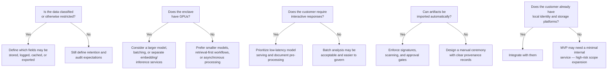
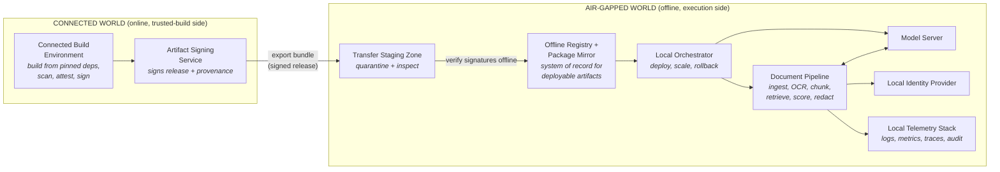
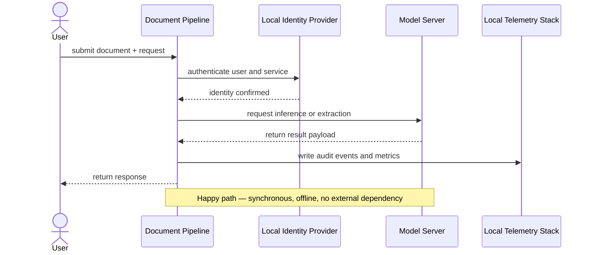
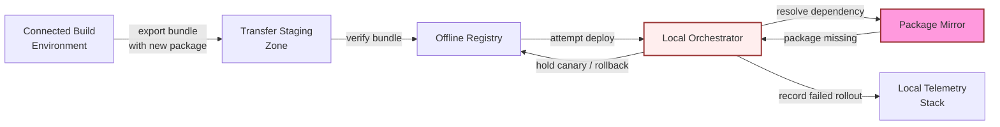
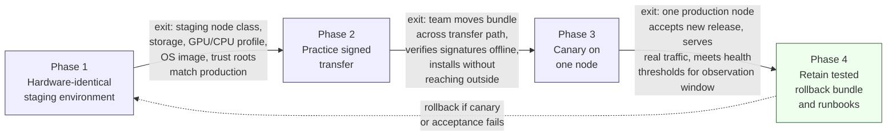

# Chapter 7: Design an AI System for an Air-Gapped Environment

*Source: THE FORWARD DEPLOYED ENGINEER SYSTEM DESIGN INTERVIEW*

## 1. The Customer Problem and Discovery

**Key Points**
- The customer wants a maintainable local AI capability that never violates the network, artifact, identity, or audit boundaries of an air-gapped enclave.
- Stakeholders disagree on different axes: what they care about vs. what they fear — map both before designing anything.
- A six-bucket discovery framework (Workflow, Risk, Boundary, Update process, Identity and audit, Operations) turns a vague ask into a scoped problem.
- Convert discovery into four concrete questions: Scope, Risks, Owners, Success.
- A good business-outcome metric is one the customer can verify without violating the boundary itself.
- Carry forward: the boundary is the design, not a constraint bolted onto it.

The prompt opens with a shared-framing quote that captures the tension of the whole chapter: the customer wants AI capability delivered *inside* a network that cannot talk to the outside world, and every design decision has to be argued against that constraint rather than around it.

A useful first move is a stakeholder table that separates what each party cares about from what they fear:

| Stakeholder | What they care about | What they fear |
|---|---|---|
| Security/compliance officer | Provable boundary integrity, auditable updates | A "temporary" workaround that becomes permanent |
| Operations/IT admin | Supportability without vendor hand-holding | A system nobody on-site can fix at 2 a.m. |
| End users (analysts) | Fast, accurate answers on their documents | A tool that is slower or less trustworthy than manual work |
| Program sponsor | Delivering measurable value on schedule | The program stalling in accreditation review |
| External vendor/build team | A clean handoff process | Being blamed for issues after the network boundary is crossed |

The outcome restatement that should anchor the rest of the design: **provide maintainable local AI capability without violating network, artifact, identity, or audit boundaries.** Every later architecture decision gets tested against that sentence.

**The six-bucket discovery framework.** Rather than asking scattered questions, organize discovery into:
- **Workflow** — what job the user is actually trying to do
- **Risk** — what happens if the system is wrong, slow, or compromised
- **Boundary** — what exactly is inside vs. outside the enclave
- **Update process** — how new capability legally and safely enters the network
- **Identity and audit** — who is allowed to act, and how that's proven after the fact
- **Operations** — who keeps the system running day to day

**Turn discovery into scope, risks, owners, and success criteria.** Four practical questions structure the outcome of discovery:
- **Scope:** What is explicitly in vs. out of the first release?
- **Risks:** What is the single riskiest assumption, and who owns mitigating it?
- **Owners:** Which team is accountable for each moving part (build, transfer, operate)?
- **Success:** What does "working" look like to the customer, in terms they can independently verify?

A good business-outcome metric should be something the customer can observe locally — for example, analyst turnaround time on a case — rather than a vendor-reported number that requires trusting an external system.

**What to carry forward:** the boundary is not a limitation layered on top of an otherwise-normal AI system. It *is* the system design. Every subsequent section (requirements, architecture, data model, security, delivery) treats the boundary as the organizing constraint, not an afterthought.

## 2. Clarifying Questions, Requirements, and Constraints

**Key Points**
- Six discovery questions change the architecture outright: classification level, local hardware, latency/quality target, artifact import process, identity system, and logging/retention limits.
- Convert answers into functional requirements (what the system must do) and nonfunctional requirements (how well it must behave), and separate both from hard constraints vs. soft preferences.
- A compact Yes/No decision tree shows how to reason live under ambiguity.
- Prioritize with must/should/could — the MVP list should be short and defensible.
- Explicitly state what the MVP will **not** support — exclusions build trust as much as inclusions.
- Trace every requirement to a specific component so nothing is a "wish list" item.
- Protect one assumption above all others: no runtime internet access, ever.

**Start by asking questions that change the architecture.** Six questions matter more than any others in this scenario:

1. What classification level is the data, and what handling rules apply?
2. What hardware is available locally?
3. What quality target does the customer need, and what latency is acceptable for a human workflow?
4. How are software artifacts imported, approved, scanned, signed, and rolled into the enclave?
5. What identity system exists locally, and what storage or directory services can the application rely on?
6. What are the logging, retention, backup, and disaster recovery limits inside the network?

Each question has a purpose. Classification and handling rules determine whether the system may store document text, retain prompts, cache intermediate outputs, or generate audit records containing sensitive content. Hardware determines whether you can run a single smaller model, a larger model with batching, or only a retrieval-heavy workflow with a lightweight model. Quality and latency targets decide whether the solution is acceptable as a human-assist tool, a batch analyst, or a near-interactive copilot. The import process shapes how quickly the customer can patch vulnerabilities or update the model. Identity and storage define whether you can integrate with local SSO, file shares, object storage, or directory-backed authorization. Logging and recovery limits determine whether you can observe failures without exposing classified data and whether the organization can survive a node or site outage without violating policy.

**Convert discovery into requirements, not just notes.** Once the interviewer has answered half the questions, a strong candidate stops fishing for perfection, chooses reasonable assumptions, states them explicitly, and turns them into requirements — separating functional requirements from nonfunctional requirements and from constraints.

**Functional requirements** (what the system must do):
- Offline model and service packaging so the full runtime can be deployed without internet access.
- Signed, versioned artifacts so every model, container, and dependency can be traced to an approved release.
- A local registry and dependency mirror so installs and redeploys do not reach outside the enclave.
- Local identity integration so access control follows the customer's approved accounts and groups.
- Offline observability, backups, and restore procedures so operations continue without external telemetry.
- An auditable update and rollback ceremony so every promotion into production can be reviewed and reversed.

**Nonfunctional requirements** (how well the system must behave):
- No runtime internet dependency.
- Reproducible installs from approved artifacts.
- A verifiable supply chain for code, model files, and packaged dependencies.
- Supportable under long update intervals, meaning the system remains operable even when patches and model refreshes are infrequent.

**Constraints vs. preferences.** Constraints are the walls around the design, not nice-to-haves. A constraint might be that all compute must remain on-premises, that logs must be retained only locally, or that updates may enter the enclave only through a manual approval path. Preferences are softer choices, such as preferring one storage engine over another. A strong interview answer makes that distinction clear so the team does not optimize a convenience and accidentally violate a boundary.

**A compact interview question tree.** A simple decision tree demonstrates how to think under ambiguity:



This tree is useful because it narrows the design around the hardest unknowns first, and it signals to the interviewer that you are protecting delivery, not just collecting facts.

**Prioritize the first release with must, should, and could.** For the MVP, treat the following as must-have capabilities:
- Offline model and service packaging.
- Signed versioned artifacts.
- Local registry and dependency mirror.
- Local identity integration.
- Offline observability and backups.
- An auditable update and rollback ceremony.

That list is intentionally short. It's also the minimum that makes the system operationally credible in a controlled network — everything else should be argued as a later-phase enhancement unless the interviewer explicitly says it's required. Could-have items are things like richer analytics dashboards, multiple model choices, automatic canary release flows, or cross-site replication. Those features may be attractive, but in an air-gapped environment they can distract from the core problem: making local AI capability usable, supportable, and defensible under tight policy controls.

**What the MVP will not support.** A good answer is explicit about exclusions. The MVP will not support live internet model calls, unmanaged package installation, ad hoc dependency fetching, or self-updating agents that bypass the approved import process. It will not promise unlimited model size or arbitrary plugin execution. It will not assume that logs can be shipped to a cloud observability stack. It will not treat "backup" as a vague aspiration; it will rely only on the storage and restore paths the customer already permits. These exclusions do not weaken the design — they protect it from scope creep, and a candidate who clearly says what is out of scope looks more trustworthy because they are proving they understand the boundary between a working system and a story that can never be approved.

**Trace requirements to components.** A simple requirement-to-component mapping keeps the design honest:

| Requirement | Component or mechanism |
|---|---|
| Offline model and service packaging | Build pipeline that produces a single deployable bundle for model, service, and runtime assets |
| Signed versioned artifacts | Signing process, artifact registry, release manifest, and promotion record |
| Local registry and dependency mirror | On-prem registry for containers and package mirrors for language dependencies |
| Local identity integration | Directory or SSO bridge with role mapping and authorization checks |
| Offline observability and backups | Local logs, metrics store, backup jobs, and restore validation |
| Auditable update and rollback ceremony | Change approval workflow, release ledger, and rollback runbook |
| No runtime internet dependency | Network policy, egress denial, and dependency allowlist |
| Reproducible installs | Pinned versions, locked manifests, and deterministic build inputs |
| Verifiable supply chain | Provenance records, signatures, scanning, and approval evidence |
| Supportable under long update intervals | Conservative dependency choices, compatibility checks, and documented restore paths |

This traceability is valuable because it keeps the design from drifting. If a requirement has no component, you have not designed a system yet; you have written a wish list.

**The assumption you protect first.** The interviewer may not answer every question. If you can only protect one assumption, protect the network boundary first: assume the system must remain fully functional with no runtime internet access, and build every other choice around that constraint. That assumption influences artifact packaging, dependency management, model deployment, observability, and rollback. If the customer later relaxes it, you can simplify. If you assume the opposite and you are wrong, the entire architecture collapses.

**Why this is a strong FDE signal.** A hiring team wants someone who can discover the constraints that matter, prioritize requirements under ambiguity, and keep the solution shippable. That combination shows customer empathy, engineering judgment, and delivery discipline — and it shows you can protect the highest-risk constraint instead of overfitting to the easiest feature.

**What to say in the interview.** A strong answer sounds like this: *I would first clarify classification and handling rules, available compute, latency and quality targets, artifact approval workflow, local identity and storage, and logging or recovery limits. Then I would convert those answers into must-have capabilities: offline packaging, signed versioned artifacts, a local registry and dependency mirror, local identity integration, offline observability and backups, and an auditable update-and-rollback process. I would state the nonfunctional requirements explicitly: no runtime internet dependency, reproducible installs, verifiable supply chain, and supportability under long update intervals. I would also declare the MVP exclusions so the scope stays manageable.* That response does not just answer the prompt — it demonstrates that you can move from discovery to design without losing the customer's actual constraint.

## 3. Scale Estimates, SLOs, and Capacity

**Key Points**
- Anchor every estimate to the customer's operating reality (users, QPS, corpus size, fixed GPU pool) rather than a generic diagram.
- The replica-sizing formula ties QPS and token demand directly to hardware headroom: `Replicas = ceil((QPS × Tokens_per_request) / (TokensPerSecond_per_replica × UtilizationTarget))`.
- A worked example (1,000 users, 20 QPS) turns abstract math into a concrete, defensible number.
- Sensitivity analysis (baseline vs. 10x growth) matters more than a single "heroic" number — it exposes which lever actually changes the architecture.
- Define SLIs around the customer's actual workflow (Availability, Latency, Freshness, Quality, Security, Cost), not generic uptime.
- The estimate should pressure the design into realism, not just decorate the interview with math.

**Start with the load envelope, not the diagram.** The first pass at this problem is often too optimistic: a candidate sketches an on-prem document-analysis service, assumes a few dozen active users, and concludes that one model replica plus a queue is enough. That answer is plausible at average load. It fails the moment the customer asks for a deadline, a peak day, or a backlog catch-up window. In an air-gapped environment, elasticity is limited or nonexistent, so the capacity plan has to be correct up front.

**Work the estimates from the customer outward.** Use the customer's operating reality as the anchor: 1,000 users, 20 QPS at peak, 50 million pages in the corpus, and a fixed GPU pool. Those numbers are not just sizing inputs; they shape the architecture. They tell you whether the system should favor batch processing, online interactive extraction, or a split design with asynchronous indexing and a smaller interactive layer. They also determine whether the failure mode is "slow response" or "missed mission deadline."

A good interview move is to state average load, peak load, growth, and headroom separately. Average load answers day-to-day behavior. Peak load protects the system from queued bursts. Growth tells you whether the design survives a year of adoption. Headroom is what keeps you from operating a machine at the edge of collapse every time a large document arrives.

**A simple storage sketch:**
- Model weights and runtime packages: one primary release plus two rollback versions.
- Vector or search indexes for 50 million pages, plus metadata and sharding overhead.
- Logs, audit trails, and operational metrics retained under the customer's local policy.
- Temporary staging for signed updates, validation artifacts, and canary rollout packages.

The exact sizes depend on model choice, chunking strategy, embedding dimension, retention policy, and compression. In an interview, you do not need false precision. You do need to show that storage is not "just the model." The rollback copies matter because in an air-gapped environment a bad deployment can remain bad for a long time if reversion is slow or blocked by the approval process.

For inference capacity, estimate both memory per replica and throughput per replica. Memory must cover model weights, KV cache or equivalent state, framework overhead, and batch buffers. Throughput is usually expressed as tokens per second per replica under the chosen model, quantization, and batch size. A candidate who only talks about GPU count without throughput is missing the bottleneck; a candidate who only talks about memory without throughput is missing the placement constraint.

A concrete interview-scale memory estimate helps make this real: if a quantized document-analysis model has 12 GB of weights, the serving stack uses 2 GB for runtime and framework overhead, the KV cache and transient activations reserve another 6 GB at the target context length, and batch buffers plus fragmentation require 2 GB of slack, then one replica needs roughly 22 GB of GPU memory. On a 24 GB card, that leaves too little safety margin for noisy batches or longer-than-expected contexts, so the design would likely move to either a 32 GB GPU, a smaller model, tighter context limits, or more aggressive quantization. That estimate is not a precise promise; it is a decision tool that tells you whether the current hardware class can host the workload at all.

**Derive the replica formula and explain what it tells you.** The key sizing equation is:

$$
Replicas = \left\lceil \frac{QPS \times Tokens_{request}}{TokensPerSecond_{replica} \times UtilizationTarget} \right\rceil
$$

Here, *QPS* is request arrival rate, *Tokens_request* is the average token work per request, *TokensPerSecond_replica* is the sustained throughput of one replica, and *UtilizationTarget* is the fraction of peak capacity you are willing to burn before latency degrades too much.

The interpretation matters more than the arithmetic. The numerator converts request rate into token demand. The denominator converts one replica into usable service capacity after reserving headroom. If your result says four replicas but the fixed GPU pool only supports three, the design decision is not "hope harder." It is one of these: reduce token work per request, shrink the model, batch more aggressively, lower the SLO, move some work to offline preprocessing, or accept a smaller interactive feature set.

**A practical example with 1,000 users and 20 QPS.** Suppose 1,000 users generate a 20 QPS peak during a surge window. If the average request requires 2,000 tokens of model work across retrieval augmentation and output generation, and one replica sustains 120 tokens/sec at the desired batch shape, then a 70% utilization target gives:

$$
Replicas = \left\lceil \frac{20 \times 2000}{120 \times 0.70} \right\rceil = \left\lceil \frac{40000}{84} \right\rceil = 477
$$

That number is intentionally uncomfortable. It tells you the assumption set is probably wrong for an air-gapped government deployment with a fixed GPU pool. The response should not be to defend the number; it should be to challenge the request profile. Maybe 20 QPS is not all LLM inference. Maybe most requests are retrieval or metadata lookup, with only a fraction hitting the model. Maybe the average model work per request is lower after chunking, caching, or form-based extraction. Maybe the customer's workflow is actually batch-first, where a queue and a nightly SLA fit the need better. That is the point of the estimate: it pressures the design into realism.

**Sensitivity is more useful than false certainty.** A strong interview answer shows ranges, not fake exactness. If the model throughput improves by 10x, if average tokens per request halves, or if only 10% of traffic requires full inference, the replica count changes dramatically. A sensitivity table is more useful than a single heroic number because it exposes the design lever that matters most. A compact way to present that is to compare baseline versus a 10x growth case:

| Scenario | QPS | Avg tokens/request | Effective token demand | Replica implication | Design pressure |
|---|---|---|---|---|---|
| Baseline illustrative case | 20 | 2,000 | 40,000 tokens/sec demand before headroom | 477 replicas by the toy formula, which signals the request mix is unrealistic for the fixed GPU pool | Pushes you toward batch/offline processing, narrower per-request work, or a much smaller model fraction |
| 10x growth case | 200 | 2,000 | 400,000 tokens/sec demand before headroom | Roughly 4,770 replicas under the same toy assumptions | Confirms the same architecture would fail hard; you would need workload partitioning, precomputation, or a different serving strategy |

The exact numbers are less important than the direction: a 10x load increase is not a linear "buy more of the same" problem in an air-gapped environment, because the fixed GPU pool, storage, and operational process do not scale elastically.

**For a 10x growth case, ask what changes first:**
- More users? Then identity, audit, and queueing load expand before raw inference does.
- More pages? Then index size, storage bandwidth, and rebuild time may dominate.
- Longer documents? Then token count and context length become the bottleneck.
- More stringent SLOs? Then headroom must rise and the fixed GPU pool gets tight.

This is also where you communicate uncertainty cleanly. Say: *"These are illustrative estimates. I would size the initial deployment against the 20 QPS peak, then add a growth factor and a rollback margin. If the customer's real request mix is more batch-heavy, the interactive pool shrinks; if the average request is longer, we need either more replicas or a narrower per-request contract."* That phrasing shows judgment without pretending you know the answer.

**The estimate that usually changes the architecture.** Of all the numbers, token demand per request usually has the most leverage over component selection and partitioning. If requests are light, a single general-purpose inference tier plus retrieval may be enough. If requests are heavy, the design often splits into a cheap preprocessor, a retrieval or rules layer, and a smaller number of expensive inference workers. In an air-gapped environment, this is especially important because every extra replica consumes scarce offline capacity and every extra dependency increases update and audit burden.

So when you are asked for scale estimates and SLOs, do not present them as bookkeeping. Present them as the reason the architecture is shaped one way instead of another. The estimate tells you whether to optimize for throughput, completion time, storage density, or operational simplicity — and in a fixed offline environment, those choices are the difference between a system that merely looks good on paper and one the customer can actually run.

**Tie SLOs to the workflow, not just the endpoint.** Define the service-level indicators in terms the customer can feel:
- **Availability:** the fraction of working hours when the system accepts jobs and returns results.
- **Latency:** time from document submission to first useful result, and separately time to complete a batch.
- **Freshness:** time from approved content arrival to searchability or model use.
- **Quality:** extraction accuracy, retrieval relevance, or analyst acceptance rate.
- **Security:** adherence to network, identity, signing, and audit boundaries.
- **Cost:** GPU hours, storage footprint, support burden, and rollback cost.

Then set objectives that match the workflow. If a user is an analyst who needs to review a single document, the interactive latency budget may be the critical SLO. If the business event is a nightly ingestion run, freshness and completion time matter more than per-request latency. A latency budget is the decomposition of an end-to-end target into pieces the system can actually control: upload, preprocessing, retrieval, inference, validation, and response rendering. If inference consumes most of the budget, you probably need a smaller model, shorter context, or precomputed retrieval.

**What to say in the interview.** A crisp answer sounds like this: *I would size the system from peak request rate, average token work, and fixed GPU throughput, then translate that into replica count, storage footprint, and headroom. I would separate average load from peak load, define SLOs around the customer workflow, and use sensitivity ranges to see which assumption most changes the design. If the math exceeds the fixed pool, I would change the workload shape before I would ask for infinite hardware.* That shows the interviewer you can do capacity planning as an engineering decision, not a math recital, and it proves you know how to defend an offline design with numbers that are honest, bounded, and operationally useful.

## 4. Architecture and End-to-End Flow

**Key Points**
- A good air-gapped design separates the online "connected build" world from the offline "execution" world through a controlled update path.
- Nine components, introduced in dependency order, cover the full lifecycle: build, sign, transfer, register, orchestrate, serve, ingest/analyze, authenticate, observe.
- The system-of-record vs. cache vs. queue distinction is a critical interview signal — never let a cache silently behave like a source of truth.
- The happy path is an 8-step sequence from pinned dependencies to promote-or-rollback.
- The dependency-failure branch (a missing transitive package) must fail closed — this is the chapter's central failure drill.
- A full component-responsibility table and an MVP-vs-later-evolution split show you can separate what's necessary now from what's a future enhancement.

**A good air-gapped design is easiest to defend when you start with one user request and then trace the same request through a second pass where something critical is missing.** In the government document-analysis scenario, a user uploads a packet inside the classified or restricted network, asks for classification, extraction, or redaction, and expects a result that is useful, auditable, and generated without any internet dependency. The hidden constraint that changes the design is not just "no internet." It is that software, models, and metadata can only enter through a controlled update path, so the architecture must separate the online build world from the offline execution world very deliberately.

**Component order and trust boundaries.** Introduce the components in dependency order, not in the order they appear on a slide:

1. **Connected build environment** — where source, pinned dependencies, and model artifacts are assembled before export.
2. **Artifact signing service** — produces verifiable attestations and signatures for the bundle that will cross the boundary.
3. **Transfer staging zone** — a quarantine and inspection area for the bundle before it is admitted to the offline side.
4. **Offline registry and package mirror** — the local source of truth for approved container images, libraries, and model packages.
5. **Local orchestrator** — schedules services, enforces deployment policy, and manages canary rollout.
6. **Model server** — serves the local model or inference runtime used by the document pipeline.
7. **Document pipeline** — ingestion, OCR or parsing, chunking, retrieval, scoring, redaction, and result assembly.
8. **Local identity provider** — authenticates users and services inside the boundary.
9. **Local telemetry stack** — collects logs, metrics, traces, and audit events without exporting them externally.

The trust boundary runs between the connected build environment and everything else. Inside the offline environment, there are still smaller boundaries: between the orchestrator and workloads, between identity and services, and between the document pipeline and the telemetry store. Those internal boundaries matter because air-gapped does not mean untrusted code disappears; it means the threat model shifts from internet exposure to controlled admission, least privilege, and strong auditability.

**Top-down architecture view.** The architecture is easiest to explain as a left-to-right chain with one major trust boundary and several internal runtime boundaries:



Every box exists because it satisfies a requirement, not because it makes the diagram look complete. The connected build environment exists to create reproducible inputs. The signing service exists to prove what crossed the boundary. The transfer zone exists because the offline side should never ingest unvetted material directly. The registry and mirror exist to keep deployments deterministic. The orchestrator exists to manage the runtime. The model server and document pipeline exist to perform the work. The identity and telemetry stacks exist because the customer needs authenticated access and auditable operations, not just inference.

**What is the system of record, what is a cache, what is a queue.** This distinction is where strong interview answers separate themselves from decorative architecture:
- **System of record:** the offline registry for approved images and packages, the identity provider for users and service identities, and the audit log for what was deployed and when.
- **Cache:** local model weights in memory, retrieval indexes or hot document fragments, and any response cache used to avoid repeated expensive computation.
- **Queue:** document ingestion jobs, scan/attest/export tasks, and asynchronous enrichment or post-processing jobs.
- **External dependency:** in this design, there should be no runtime external dependency for end-user traffic. The only "outside" dependency is the controlled build pipeline that feeds the offline bundle.

A common mistake is to let a cache behave like a source of truth. In an air-gapped environment, that error is more dangerous because a stale cache can survive a long time without an internet check to correct it. If the registry says an image is approved, the runtime should not silently prefer a cached older copy. If the identity provider revokes a service credential, the local control plane must honor that revocation consistently.

**End-to-end happy path.** The happy path should be narrated as a chain of explicit state changes:

1. **Build from pinned dependencies.** Source code, model package versions, and system packages are locked to known revisions in the connected build environment.
2. **Scan, attest, sign, and export bundle.** The build is scanned for policy violations, attested for provenance, signed, and packaged for export.
3. **Inspect in the transfer zone.** The bundle is checked for integrity, policy conformance, and chain-of-custody before crossing inward.
4. **Verify signatures offline.** The offline side confirms that the bundle came from an authorized signer and was not altered in transit.
5. **Import to local registry.** Approved images, libraries, and model files become available to the offline runtime through the local mirror.
6. **Deploy canary.** The orchestrator brings up a limited slice of the document pipeline and model server against a safe test set.
7. **Run acceptance tests.** The system checks authentication, document ingestion, output quality, latency, logging, and rollback readiness.
8. **Promote or rollback.** If the canary passes, traffic expands. If not, the deployment is reverted and the failed bundle is quarantined for review.

That sequence is intentionally not synchronous end to end. Build, scan, attest, export, and inspect are asynchronous administrative steps. Deployment, request processing, and user-facing inference are synchronous during live operation. In the interview, say this plainly: the offline runtime must respond synchronously to document requests, but the supply chain and update pipeline should be asynchronous so they do not block the user workflow.

**Sequence diagram of the same flow.**



**Dependency-failure branch (the required fail-closed drill).**



The failure path matters because the critical drill in this chapter is a missing transitive package. If the package mirror does not contain a dependency, the offline system should fail closed rather than improvise by reaching outside the boundary. That means the deployment controller needs a clear policy: unresolved dependencies block promotion, and the bundle stays in the staging or mirror quarantine until the dependency issue is repaired and re-approved.

**Where backpressure and flow control belong.** Backpressure is not a theoretical add-on here; it is the difference between a stable offline service and a system that melts under a burst of document uploads.
- **At ingestion:** limit concurrent uploads, validate file size and type early, and place oversized jobs in a queue instead of letting them consume parser resources immediately.
- **At the pipeline:** partition document work by a stable key such as document ID, tenant, or case ID so related state lands together and retries are deterministic.
- **At the model server:** bound concurrency, cap batch size, and reject or defer work when GPU or CPU saturation crosses a safe threshold.
- **At the orchestrator:** set rollout limits so only a small fraction of traffic reaches the canary until acceptance tests pass.

The partitioning key matters because it preserves locality and avoids cross-document state corruption. For example, if a request fan-out uses document ID as the partitioning key, retries and partial failures remain easier to reason about than if requests are sprayed across workers randomly. That is especially important when document-specific context, redaction decisions, or audit trails must stay aligned.

**Component responsibility table.**

| Component | Primary responsibility | State ownership | Notes |
|---|---|---|---|
| Connected build environment | Compile, package, and pin offline-ready artifacts | Source tree and build metadata | Outside runtime trust boundary |
| Artifact signing service | Sign and attest artifacts | Signing keys and provenance records | Keys should be tightly controlled |
| Transfer staging zone | Inspect bundles before admission | Quarantine manifests | Not a runtime serving tier |
| Offline registry / package mirror | Serve approved images and packages | Approved artifact catalog | System of record for deployable bits |
| Local orchestrator | Deploy, scale, and roll back services | Desired state and rollout state | Enforces policy locally |
| Model server | Run inference | Model runtime state, cached weights | Keep API stable and minimal |
| Document pipeline | Ingest, analyze, redact, and assemble outputs | Document processing state | Often the main request path |
| Local identity provider | Authenticate users and services | Identities, groups, tokens | System of record for access |
| Local telemetry stack | Store logs, metrics, traces, audit events | Observability data | Must be retained per policy |

**MVP versus later evolution.** For a first production rollout, the MVP should be small and opinionated: one offline registry, one orchestrator, one identity provider, one telemetry stack, one model server, and one document pipeline with a clear canary process. The transfer zone, signing, and verification path are not optional — they are part of the first release because they are what make offline updates defensible. Later evolution can add smarter scheduling, multi-model routing, more advanced retrieval, background reindexing, or richer policy engines. Those are follow-on capabilities, not prerequisites for the first safe deployment. In an interview, that distinction signals judgment: first make the air-gapped path reliable and auditable; then optimize throughput and operator convenience.

**Failure overlay to describe out loud.** On the architecture diagram, the failure overlay should be easy to narrate: the bundle arrives, but a transitive package is missing from the offline mirror. The orchestrator cannot complete promotion, so the canary stays isolated. The telemetry stack records the failed rollout, the registry keeps the bundle quarantined, and the operator fixes the package in the connected build environment before trying again. That story proves the design is not just secure on paper; it has a deliberate answer for incomplete supply chains.

**What the interviewer is really listening for.** The diagram is useful only when you can narrate data, identity, state, and failure through it. The strongest answer shows that you understand control plane versus data plane: the control plane handles deployment, signing, verification, identity, and policy; the data plane handles live document requests and inference. It also shows you know where the synchronous versus asynchronous workflows belong, and which system owns each durable state transition. The job-market signal is straightforward: this kind of decomposition demonstrates that you can communicate one architecture to both customer stakeholders and engineering stakeholders. The customer hears, *"We can keep the system inside our boundary and still support controlled updates."* Engineering hears, *"We know where state lives, where failure is contained, and how to promote safely."* That is the FDE test in miniature.

**90-second interview summary.** If you have to close this section quickly, say: *I would separate the connected build world from the offline runtime with a signing and staging path, then run the live system on a local registry, orchestrator, model server, document pipeline, identity provider, and telemetry stack. The request path is synchronous; the update path is asynchronous and tightly controlled. The system of record for deployable artifacts is the offline registry, while the audit trail lives in local telemetry and identity. The riskiest trade-off is update friction versus security, because every extra manual gate helps the boundary but slows delivery. My first production gate would be a canary that verifies signature provenance, dependency completeness, authentication, and rollback before any broad promotion.*

## 5. Data Model, APIs, and Working Code

**Key Points**
- Three governable records anchor the design: `ReleaseManifest` (the deployable contract), `ModelDeployment` (operational state), and `OfflineAuditEvent` (append-only audit trail).
- Ownership boundaries matter: the build team owns signed release material until handoff, the offline runtime owns deployment state, and security/ops owns the audit trail.
- API contracts (`/documents/analyze`, `/models/status`, `/admin/releases/validate`, `/admin/releases/{id}/promote`) must define idempotency, error taxonomy, and versioning — not just endpoints.
- The highest-risk implementation slice is offline bundle verification: a contract test and a failure-injection test prove the design refuses to install a bundle whose integrity cannot be established.
- What the whiteboard snippet deliberately omits (concurrency, retries, full observability) is as important to state out loud as what it includes.

**The three records that make the system governable.** First, define the records that the customer can reason about and that the system can audit.

`ReleaseManifest(version, artifact_hashes, signatures, dependencies)` is the deployable contract for a bundle. Its primary key is `version`, because a release must be referable, repeatable, and promotable by a stable identifier. The lifecycle is: drafted in the connected build environment, signed, transferred into the offline boundary, validated, staged, and then either promoted or rejected. Retention should preserve the manifest, its signature material, and enough dependency metadata to reconstruct why a release was accepted or refused. In practice, the retention policy is driven by audit needs and local policy, not by a universal standard.

`ModelDeployment(model_id, version, hardware, status)` is the operational view of what is actually running. The preferred primary key is `deployment_id` for the deployment record itself, with a unique constraint across `(model_id, version, hardware)` if the same model family can exist in multiple release states on different targets. If your implementation does not create a separate deployment identifier, then `(model_id, version, hardware)` becomes the natural composite key; the important part is to choose one explicitly rather than leave it vague. Lifecycle states usually look like `staged`, `validated`, `active`, `draining`, and `retired`. Retention should preserve the deployment history long enough to answer, *"What was running when this document was analyzed?"* — because that question matters for troubleshooting, traceability, and controlled rollback.

`OfflineAuditEvent(actor, action, artifact_hash, time)` is the system's memory of who did what, to which artifact, and when. Its primary key is often an event ID, but the business key is the `(actor, action, artifact_hash, time)` tuple. Lifecycle is append-only; audit rows should not be edited in place. Retention should be aligned to customer audit policy, because deleting history too aggressively destroys trust, while keeping too much data can violate local retention rules.

These records also make the data-ownership boundaries explicit. The build team owns the signed release material until it is handed into the offline validation process. The offline runtime owns its deployment state. The security or operations function owns the audit trail. That separation is not cosmetic; it is how you keep a government network from turning into one giant mutable blob.

**The contracts the interviewers want to hear.** Now define the API surface as contracts rather than endpoints.

**`POST /v1/documents/analyze`** is the user-facing data-plane call. Request: authenticated document payload plus optional request metadata, such as an idempotency key and an analysis profile. Response: an analysis result object with typed fields, a model version reference, and a request identifier. Authentication should be local to the boundary, for example via the offline identity provider or a service token minted within the network; do not hand-wave it as "just use OAuth" without explaining how identity is managed when the network has no internet path. Idempotency matters here because document submission may be retried by clients or queues. If the same idempotency key and same request body arrive twice, the service should either return the same result or a stable "already processed" response tied to the original request. Errors should distinguish malformed input, unauthorized access, unavailable model capacity, and policy rejection.

**`GET /v1/models/status`** is the operational read path. It returns the current model deployment state, active version, and hardware target readiness details. It should be safe to call repeatedly and should not mutate state. Authentication is still required because status can leak operational details. Error semantics should distinguish "unknown model," "not deployed," and "temporarily unavailable."

**`POST /v1/admin/releases/validate`** is the control-plane gate. It accepts a bundle reference or uploaded bundle, verifies the manifest signature, checks artifact hashes, confirms declared dependencies are present, and returns either a structured pass/fail result or a validation report. Because validation may be expensive, the endpoint should be idempotent with respect to the same release identifier — if the same bundle is validated twice, the second call should not create a second logical validation record unless the bundle content changed.

**`POST /v1/admin/releases/{id}/promote`** performs the state transition from validated to active. This should be guarded by authorization, policy checks, and optimistic concurrency. A promote request should fail if the release is not in a promotable state, if the target deployment has changed since the client last read it, or if the current active release differs from the one the client assumed. This is where schema and contract versioning matter: the API should accept versioned request and response shapes so that a future change to manifest structure or validation output does not break older tooling overnight.

A good interview answer explicitly says that contract versioning is not just for public APIs; it also applies to the bundle format, the manifest schema, and the audit event schema. If the offline environment cannot be updated arbitrarily, then every breaking change is a migration event, not a casual refactor.

**The smallest code path that proves the design can work safely.** This is the highest-risk component: release verification. If the system cannot validate a release bundle offline, everything else is theater. So the candidate zooms into that one seam and implements the smallest code path that proves the design can work safely.

```python
from __future__ import annotations

import hashlib
import hmac
import json
from dataclasses import dataclass
from typing import Any, Mapping


class IntegrityError(Exception):
    pass


class ManifestError(Exception):
    pass


class SignatureError(Exception):
    pass


class ValidationError(Exception):
    pass


@dataclass(frozen=True)
class VerifiedManifest:
    version: str
    artifacts: tuple[dict[str, str], ...]
    dependencies: tuple[str, ...]


def canonical_json(obj: Any) -> bytes:
    return json.dumps(obj, sort_keys=True, separators=(",", ":")).encode("utf-8")


def sha256_hex(data: bytes) -> str:
    return hashlib.sha256(data).hexdigest()


def verify_signature(trusted_public_key: bytes, payload: bytes, signature: bytes) -> None:
    # Interview sketch: replace with a real signature primitive such as Ed25519 verification.
    expected = hmac.new(trusted_public_key, payload, hashlib.sha256).digest()
    if not hmac.compare_digest(expected, signature):
        raise SignatureError("manifest signature verification failed")


def _require_str(mapping: Mapping[str, Any], key: str) -> str:
    value = mapping.get(key)
    if not isinstance(value, str) or not value.strip():
        raise ManifestError(f"missing or invalid string field: {key}")
    return value


def _require_list(mapping: Mapping[str, Any], key: str) -> list[Any]:
    value = mapping.get(key)
    if not isinstance(value, list):
        raise ManifestError(f"missing or invalid list field: {key}")
    return value


def verify_bundle(bundle, trusted_public_key: bytes) -> VerifiedManifest:
    manifest_raw = bundle.read_bytes("manifest.json")
    signature = bundle.read_bytes("manifest.sig")

    try:
        manifest = json.loads(manifest_raw)
    except json.JSONDecodeError as exc:
        raise ManifestError("manifest.json is not valid JSON") from exc

    if not isinstance(manifest, dict):
        raise ManifestError("manifest root must be an object")

    version = _require_str(manifest, "version")
    artifacts = _require_list(manifest, "artifacts")
    dependencies = _require_list(manifest, "dependencies")

    verify_signature(trusted_public_key, canonical_json(manifest), signature)

    normalized_artifacts: list[dict[str, str]] = []
    for idx, item in enumerate(artifacts):
        if not isinstance(item, dict):
            raise ManifestError(f"artifacts[{idx}] must be an object")
        path = _require_str(item, "path")
        expected_hash = _require_str(item, "sha256")
        if len(expected_hash) != 64 or any(c not in "0123456789abcdef" for c in expected_hash.lower()):
            raise ManifestError(f"artifacts[{idx}].sha256 is not a valid hex digest")
        actual_hash = sha256_hex(bundle.read_bytes(path))
        if not hmac.compare_digest(actual_hash, expected_hash):
            raise IntegrityError(path)
        normalized_artifacts.append({"path": path, "sha256": expected_hash})

    normalized_deps: list[str] = []
    for idx, dep in enumerate(dependencies):
        if not isinstance(dep, str) or not dep.strip():
            raise ManifestError(f"dependencies[{idx}] must be a non-empty string")
        normalized_deps.append(dep)

    return VerifiedManifest(
        version=version,
        artifacts=tuple(normalized_artifacts),
        dependencies=tuple(normalized_deps),
    )
```

Walk this line by line in the interview. `canonical_json` ensures the manifest is serialized deterministically before signature verification; otherwise the same logical manifest could hash differently. `sha256_hex` gives a stable digest for artifact comparison. `verify_signature` is intentionally labeled a sketch — in real code you would use a real asymmetric primitive, not an HMAC stand-in. The three exception classes let the caller distinguish signature failure, malformed manifest, and content integrity failure. That distinction matters because the operator response is different for each.

`VerifiedManifest` is immutable so a successful validation result cannot be accidentally mutated later. The helper functions `_require_str` and `_require_list` are typed boundary validation: they reject malformed input early, before any state changes. That is the habit interviewers want to see when the system sits behind a tightly controlled boundary.

Inside `verify_bundle`, the code reads the manifest and signature, parses JSON safely, validates required fields, verifies the signature over canonicalized content, and then checks every artifact hash with `hmac.compare_digest` to avoid timing leaks in comparisons. The function returns a normalized, typed result that a later promote step can trust.

**What the whiteboard snippet omits on purpose.** The snippet does not implement concurrency, retries, or observability, because those are the production concerns that sit around the core path. For concurrency, the control plane should use optimistic concurrency on promotion. A release object can carry a version or revision token; the promote call includes the token, and the server rejects the write if someone else has already advanced the deployment state. That avoids two operators promoting incompatible releases at once. For retry behavior, only safe read and validation operations should be retried automatically. Promotion should be retried only if the operation is idempotent by design and guarded by a write token. Document analysis requests should accept an idempotency key so a client retry does not create duplicate work or duplicate audit rows. For observability, the snippet should be wrapped with logs, counters, and structured audit events. A validation pass should emit who validated what, what hash was checked, and why a bundle failed if it failed. In an air-gapped environment, that observability is not a luxury; it is the only practical way to reconstruct incidents when there is no external vendor console to lean on.

**Failure behavior the candidate should explicitly mention.** A duplicate request is the easiest way to test whether the design understands idempotency. Suppose an operator submits the same validated bundle twice because the first response times out. If the idempotency key and bundle hash are the same, the second call should return the same validation outcome rather than advancing state twice. Likewise, if the promote request is repeated after a transient network or service issue inside the boundary, the server should either return the already-promoted state or reject the repeat with a clear, stable error that says the version is no longer pending promotion.

The critical failure drill is the missing transitive package. If a manifest declares a dependency that is not available in the offline artifact store, validation should fail before installation, not during runtime. That is why `dependencies` lives in the manifest, not in tribal knowledge. The customer does not want a deployment that only fails after it has already displaced the previous model.

**Tests that make the contract tangible.** A design answer is much stronger when the interviewers can see the contract encoded as tests. In this setting, the tests do not need to be exhaustive; they need to show that the candidate understands how the deployment gate behaves when it succeeds and when it fails.

```python
class BundleStub:
    def __init__(self, files):
        self.files = files

    def read_bytes(self, path):
        return self.files[path]


def test_verify_bundle_accepts_known_good_bundle():
    manifest = {
        "version": "2024.10.1",
        "artifacts": [{"path": "model.bin", "sha256": ""}],
        "dependencies": ["tokenizer.json"],
    }
    files = {
        "model.bin": b"weights-bytes",
        "tokenizer.json": b"vocab-bytes",
    }
    manifest["artifacts"][0]["sha256"] = sha256_hex(files["model.bin"])
    manifest_bytes = canonical_json(manifest)
    key = b"trusted-key"
    sig = hmac.new(key, manifest_bytes, hashlib.sha256).digest()
    bundle = BundleStub({
        "manifest.json": manifest_bytes,
        "manifest.sig": sig,
        **files,
    })

    verified = verify_bundle(bundle, key)

    assert verified.version == "2024.10.1"
    assert verified.artifacts[0]["path"] == "model.bin"
    assert verified.dependencies == ("tokenizer.json",)


def test_verify_bundle_rejects_corrupted_artifact_hash():
    manifest = {
        "version": "2024.10.1",
        "artifacts": [{"path": "model.bin", "sha256": "0" * 64}],
        "dependencies": ["tokenizer.json"],
    }
    manifest_bytes = canonical_json(manifest)
    key = b"trusted-key"
    sig = hmac.new(key, manifest_bytes, hashlib.sha256).digest()
    bundle = BundleStub({
        "manifest.json": manifest_bytes,
        "manifest.sig": sig,
        "model.bin": b"tampered-weights",
        "tokenizer.json": b"vocab-bytes",
    })

    try:
        verify_bundle(bundle, key)
        raise AssertionError("expected IntegrityError")
    except IntegrityError as exc:
        assert str(exc) == "model.bin"
```

The first test is a contract test. It shows the expected behavior for a known-good bundle: a valid manifest, a valid signature, and matching artifact hashes should produce a normalized `VerifiedManifest` with the intended version and dependency list. The second test is the failure-injection test. It simulates corruption by giving the manifest an intentionally wrong hash and tampered artifact bytes, then asserts that the verifier raises `IntegrityError` on the exact path that failed. If you want to extend the test suite in a real repository, a third useful test would corrupt `manifest.sig` and assert `SignatureError`, because signature failure and artifact failure are operationally distinct. But for a whiteboard-friendly interview sketch, one contract test and one failure-injection test are enough to prove the approach.

**Why this is a strong FDE answer.** This is where the job-market signal becomes obvious: an FDE is not just drawing architecture; they are translating architecture into production-grade implementation details that a customer can trust. You are showing that you can move from a conversation about boundaries and trust zones to concrete records, API semantics, typed validation, and failure-safe code. That is exactly the kind of end-to-end ownership interviewers look for. The takeaway is simple: a design answer becomes credible when its state transitions, API contracts, and failure-safe code are concrete. If you can name the records, define the endpoints, explain idempotency and versioning, verify the bundle before offline installation, and prove that behavior with one good-path test and one failure-injection test, you have moved from abstract system design to something a deployment team can actually run.

**90-second implementation summary.** If you need to summarize this part out loud, say: *I would make the deployable unit a signed release manifest with explicit artifact hashes and dependency declarations, store deployment state separately from audit state, and expose versioned endpoints for analysis, status, validation, and promotion. Every write boundary gets idempotency and optimistic concurrency. The release verification path is the highest-risk component, so I would implement and test that first, with typed manifest validation, signature verification, artifact hash checks, and structured failure modes. That gives the customer maintainable local AI capability without violating network, artifact, identity, or audit boundaries.*

## 6. Security, Reliability, and Failure Handling

**Key Points**
- The required incident drill is a missing transitive package during an update — the correct response is to stop, preserve the manifest and evidence, and contain impact, never "just retry."
- Threat-model the offline control plane itself, not just the model: pin and attest dependencies, avoid telemetry-egress assumptions, and treat privileged admin actions as a high-risk interface.
- A five-condition decision table (missing package, corrupted artifact, GPU memory exceeded, expired certificate, incompatible index update) makes fail-open vs. fail-closed policy explicit.
- Blast radius must be stated by tenant, region (or enclave/site), workflow, and dependency — a failure in one slice should never cascade to the whole system.
- The critical incident drill has five explicit containment steps, followed by recovery (rebuild the mirror from source of truth) and prevention (a preflight dependency-closure check).
- The code example proves one security invariant — a tampered bundle is rejected before deployment — not a toy success path.

**The first thing to do in the review is not talk about models at all.** Security and operations walk in and inject the failure that matters most in an air-gapped program: the update package arrives, but a transitive package is missing from the offline mirror. If the candidate reaches for "just retry," they have already missed the core issue. In a disconnected environment, retries do not manufacture missing artifacts. The right answer is to stop the promotion, preserve the manifest, preserve the evidence, and contain the impact to the smallest possible slice of the system.

**Threat model the offline control plane, not just the model.** The design problem is broader than inference. You are protecting a local AI capability that depends on package repositories, model artifacts, signing keys, update workflows, index files, and privileged admin actions. The highest-value security control is to pin and attest every dependency before anything reaches the air-gapped network. That means the release manifest should enumerate exact versions and hashes, the installer should verify signatures against offline trust roots, and the deployment process should reject anything that is not already known-good. This is less glamorous than prompt engineering, but it is the part that prevents the customer from turning an isolated network into a blind supply-chain target.

The second control is to avoid telemetry egress assumptions. In a connected product, teams often lean on crash reporting, remote metrics, and cloud-based diagnostics as if they were harmless defaults. Here, those assumptions are wrong. Every observability path must be local-first and explicitly approved. If the system needs metrics, they should go to an internal collector. If the system needs support artifacts, export them through a controlled operator workflow. Do not let a library quietly "phone home" and call that "monitoring."

The third control is privileged administration for local controls. Air-gapped systems often fail because the admin path is treated like a convenience layer instead of a high-risk interface. Keep administrative commands separate from the normal user workflow, require role-based approvals locally, and make sensitive actions deliberate: key rotation, index rebuilds, trust-root updates, and rollback promotion should all be explicit operations with audit records.

**Failure policy is part of the design, not an afterthought.** An FDE interview answer gets stronger when it says, in plain terms, what fails open, what fails closed, what degrades, what queues, and what demands a human. In this system:
- Authentication and signature verification fail closed.
- Document ingestion may queue if the downstream classifier is down, but only within a bounded local buffer.
- Search over stale indexes can degrade with a visible freshness warning.
- Model serving should degrade to a smaller approved model if memory is insufficient, but only if that fallback is pre-verified.
- Trust-root updates and bundle promotion require human approval.

That is the difference between a system that is merely unavailable and a system that is unsafe.

**A simple decision table makes the trade-off explicit:**

| Condition | Policy | User-visible behavior | Recovery path |
|---|---|---|---|
| Missing transitive package | Fail closed | Block promotion, keep current release running | Restore mirrored artifact, re-run verification |
| Artifact corrupted during transfer | Fail closed | Reject bundle before install | Re-copy from source, verify hash and signature |
| Model exceeds GPU memory | Degrade or queue | Use smaller approved model or wait for capacity | Adjust routing or retrain packaging policy |
| Local certificate expires | Fail closed for admin actions, degrade for read-only flows if allowed by policy | Admin operations blocked; limited reads may continue | Rotate cert from offline trust anchor |
| Update breaks stored-index compatibility | Queue or rollback | Pause promotion, keep old index active | Rebuild index offline, or roll back both model and index |

The blast radius must be stated by tenant, region, workflow, and dependency. In an air-gapped government network, "region" may mean a physical enclave or site rather than a cloud geography. A bad index rebuild should not take down document search for the entire enclave if the system can isolate tenants or workspaces. A failed model rollout should not invalidate the audit service. A certificate problem in the admin plane should not break read-only document lookup if policy allows read continuation. Each dependency deserves its own containment boundary.

**The critical incident drill: missing transitive package.** This is the required drill because it exposes whether the candidate understands offline reality. The security team says the bundle is signed, but operations finds that the installer cannot resolve a transitive dependency from the local mirror. The instinctive failure is to let the install continue "just this once." That is exactly the wrong move.

Containment should happen immediately:
1. Stop the promotion before any partial state is written.
2. Record the exact manifest version, bundle hash, and dependency graph that failed.
3. Preserve the artifact, logs, and signer metadata as evidence.
4. Confirm the currently running release remains untouched.
5. Notify the operator that the issue is an incomplete mirrored set, not a runtime defect.

Recovery means reconstructing the offline mirror from the source of truth, validating the complete dependency closure, and re-running signature and hash verification. Prevention means adding a preflight that checks dependency closure before the bundle reaches the enclave. If the release process cannot prove completeness, it should never reach the installer.

**Other failure paths you should be ready to explain.** Artifact corruption during transfer is the classic integrity failure. The control is straightforward but non-negotiable: verify cryptographic hashes and signatures after every transfer hop, not just at the source. A bundle that passes source verification but fails at the enclave boundary must be treated as hostile or damaged, not "probably fine." Preserve the bad artifact separately for investigation; do not overwrite it.

A model that exceeds available GPU memory is a capacity and packaging problem, not a magical runtime surprise. The system should either route the request to a smaller approved model, queue it until a compatible worker is available, or reject it with a clear operational error. What it should not do is crash the node and hope the scheduler recovers. Memory pressure should be detected before admission when possible, and the routing layer should maintain an explicit compatibility map between model size, quantization format, and available hardware profiles.

A local certificate expiring is an availability and administration issue, but it can become a security issue if the system starts bypassing checks to stay alive. The answer is a short-lived operational certificate with monitored expiry, local renewal from an offline trust anchor, and an escalation path if rotation is overdue. Read-only workflows may degrade under policy; privileged actions should stop. Don't pretend this is harmless because the network is isolated — expired credentials still matter inside a sealed environment.

An update that breaks compatibility with stored indexes is where blast radius and rollback discipline matter. The safest pattern is to version the index format alongside the model and the reader code, then promote the new trio together only after the new reader can interpret the old index or rebuild it deterministically. If the new release cannot read the existing index, the system should pause promotion and keep the old path serving. Human intervention is appropriate if the compatibility matrix is unclear or if a rebuild would take the system past its recovery objective.

**Use the code to prove one invariant, not to impress the interviewer.** The interview code should demonstrate a security invariant, not a toy success path. Here the important property is that a tampered bundle is rejected before deployment. That is the kind of test that proves the release pipeline is integrity-first.

```python
from __future__ import annotations

from dataclasses import dataclass
from pathlib import Path
import hashlib
import hmac
import json
import tempfile
from typing import Mapping


class IntegrityError(RuntimeError):
    pass


@dataclass(frozen=True)
class TrustedKey:
    name: str
    secret_key: bytes


@dataclass(frozen=True)
class Bundle:
    root: Path

    def replace(self, relative_path: str, content: bytes) -> None:
        target = self.root / relative_path
        if not target.is_file():
            raise FileNotFoundError(relative_path)
        target.write_bytes(content)


@dataclass(frozen=True)
class AuditEvent:
    action: str
    detail: str


def _sha256_file(path: Path) -> str:
    digest = hashlib.sha256()
    with path.open("rb") as f:
        for chunk in iter(lambda: f.read(1024 * 1024), b""):
            digest.update(chunk)
    return digest.hexdigest()


def _load_manifest(bundle: Bundle) -> Mapping[str, object]:
    manifest_path = bundle.root / "manifest.json"
    if not manifest_path.is_file():
        raise IntegrityError("missing manifest")
    try:
        manifest = json.loads(manifest_path.read_text(encoding="utf-8"))
    except json.JSONDecodeError as exc:
        raise IntegrityError("invalid manifest") from exc
    if not isinstance(manifest, dict):
        raise IntegrityError("invalid manifest")
    return manifest


def _audit(log: list[AuditEvent], action: str, detail: str) -> None:
    log.append(AuditEvent(action=action, detail=detail))


def verify_bundle(bundle: Bundle, trusted_key: TrustedKey, audit_log: list[AuditEvent] | None = None) -> None:
    audit_log = audit_log if audit_log is not None else []
    manifest = _load_manifest(bundle)

    if manifest.get("signer") != trusted_key.name:
        _audit(audit_log, "verify_bundle", "untrusted signer")
        raise IntegrityError("untrusted signer")

    signature = manifest.get("signature")
    if not isinstance(signature, str) or not signature:
        _audit(audit_log, "verify_bundle", "missing signature")
        raise IntegrityError("missing signature")

    expected = manifest.get("artifacts")
    if not isinstance(expected, dict):
        _audit(audit_log, "verify_bundle", "invalid artifact list")
        raise IntegrityError("invalid artifact list")

    # Validate the closure of the bundle before any promotion occurs.
    for relative_path, expected_hash in expected.items():
        if not isinstance(relative_path, str) or not isinstance(expected_hash, str):
            _audit(audit_log, "verify_bundle", "invalid artifact entry")
            raise IntegrityError("invalid artifact entry")
        artifact_path = bundle.root / relative_path
        if not artifact_path.is_file():
            _audit(audit_log, "verify_bundle", f"missing artifact: {relative_path}")
            raise IntegrityError(f"missing artifact: {relative_path}")
        actual_hash = _sha256_file(artifact_path)
        if not hmac.compare_digest(actual_hash, expected_hash):
            _audit(audit_log, "verify_bundle", f"hash mismatch: {relative_path}")
            raise IntegrityError(f"hash mismatch: {relative_path}")

    # Offline trust-root check: the manifest is authenticated with a pinned local key.
    material = json.dumps(
        {"signer": manifest["signer"], "artifacts": manifest["artifacts"]},
        sort_keys=True,
        separators=(",", ":"),
    ).encode("utf-8")
    expected_sig = hmac.new(trusted_key.secret_key, material, hashlib.sha256).hexdigest()
    if not hmac.compare_digest(signature, expected_sig):
        _audit(audit_log, "verify_bundle", "signature verification failed")
        raise IntegrityError("signature verification failed")

    _audit(audit_log, "verify_bundle", "bundle accepted")


def _write_bundle(root: Path, signer: str, secret_key: bytes, model_bytes: bytes) -> Bundle:
    root.mkdir(parents=True, exist_ok=True)
    (root / "model.bin").write_bytes(model_bytes)
    artifact_hash = hashlib.sha256(model_bytes).hexdigest()
    manifest_body = {"signer": signer, "artifacts": {"model.bin": artifact_hash}}
    material = json.dumps(manifest_body, sort_keys=True, separators=(",", ":")).encode("utf-8")
    signature = hmac.new(secret_key, material, hashlib.sha256).hexdigest()
    manifest = {**manifest_body, "signature": signature}
    (root / "manifest.json").write_text(json.dumps(manifest), encoding="utf-8")
    return Bundle(root=root)


def test_tampered_model_is_rejected():
    with tempfile.TemporaryDirectory() as tmpdir:
        bundle_root = Path(tmpdir) / "bundle"
        trusted_key = TrustedKey(name="offline-root-1", secret_key=b"local-trust-root-secret")
        bundle = _write_bundle(
            bundle_root,
            signer=trusted_key.name,
            secret_key=trusted_key.secret_key,
            model_bytes=b"approved-model-bytes",
        )

        bundle.replace("model.bin", b"tampered")
        audit_log: list[AuditEvent] = []

        try:
            verify_bundle(bundle, trusted_key, audit_log=audit_log)
        except IntegrityError:
            assert any(event.action == "verify_bundle" for event in audit_log)
            assert (bundle_root / "model.bin").read_bytes() == b"tampered"
            return
        raise AssertionError("tampered bundle should be rejected")
```

This is intentionally an interview-sized sketch. In production, you would keep the same control flow but replace the teaching scaffold with a hardened release verifier, validate the manifest schema explicitly, record structured audit events to local storage, and test the negative cases for missing files, malformed manifests, signer mismatch, and dependency-closure failure. The point of the test is not merely to prove the code runs; it is to prove the system refuses to install a bundle whose integrity cannot be established.

**What to say about evidence, runbooks, and operational readiness.** Before launch, the team should have runbooks for verification failure, rollback, trust-root rotation, certificate renewal, index rebuild, and node replacement. Each runbook should say who can execute it, what evidence is preserved, what systems are paused, and what success looks like. Audit evidence should include the signed manifest, hash list, trust-root fingerprint, operator identity, approval record, installation logs, and any rollback decision. If the customer later asks why a release was blocked, the answer should be reconstructible from the evidence alone.

That evidence discipline is what makes the system supportable. Without it, every incident becomes a forensic guessing game. With it, operations can prove the release was rejected for a legitimate integrity reason, not because the installer was flaky.

**Why this matters for the job.** This is where the job-market signal sharpens. A strong FDE does not stop at a happy-path architecture. They show they can survive malicious input, partial failure, retries that do not help, stale state, dependency outages, and the political pressure to "just make it work." They know when to queue, when to degrade, when to fail closed, and when to involve a human. They can articulate blast radius, preserve evidence, and write a test that proves a safety invariant. That combination is a strong interview signal that you can own rollout, support, and incident response for a real deployment, not just draw boxes.

**90-second interview summary.** If you need to close this section quickly, say: *I would treat the offline release pipeline as a high-trust control plane. Every dependency is pinned and attested, signatures are verified against offline trust roots, telemetry never assumes egress, and privileged administration is separated from normal use. The riskiest failure is an incomplete or corrupted bundle, so the system must fail closed, preserve evidence, and keep the currently running release intact. For runtime issues, I would define clear failure policies: some paths queue, some degrade to approved fallbacks, and some require human intervention. The first production gate is simple: if the bundle cannot prove integrity, completeness, and compatibility offline, it does not enter the enclave.* The takeaway is blunt: every external dependency and every irreversible action needs an explicit failure and recovery policy. In practice, that means the release is blocked until the evidence is complete, the incident is preserved, and the rollback path is known before the first promotion attempt. If you cannot explain that policy, you do not yet have a deployable system.

## 7. Delivery Plan, Observability, and Business Impact

**Key Points**
- The milestone is not a working prototype — it's the customer trusting the system in production, which requires phased rollout, measurable gates, explicit owners, and a support model.
- A four-phase rollout (hardware-identical staging, practice signed transfer, canary on one node, retain tested rollback) moves risk out of the dark one gate at a time.
- Metrics separate into four layers — technical health, model quality, adoption, and business outcome — so the customer can see which layer is failing and who should act.
- A dashboard should tell one story across layers (user outcome → service behavior → operational control), not a wall of green indicators.
- A risk register with owner, mitigation, and trigger per risk keeps the rollout plan honest.
- Standardization strategy (configuration vs. adapter vs. shared service vs. core product) shows product thinking, not just implementation thinking.

**From prototype to something the customer can trust.** The prototype working is not the milestone. The milestone is the customer asking, with a straight face, when it can be trusted in production. That question changes the interview answer from architecture-only to delivery discipline: phased rollout, measurable gates, explicit owners, and a support model that survives the first incident.

In an air-gapped environment, delivery is part of the system design. If the software cannot be moved, verified, installed, observed, and rolled back without improvisation, it is not a deployable solution; it is a promising demo. The FDE answer is to turn the prototype into an operational path that is safe enough for the enclave, boring enough for the operators, and useful enough for the users.

**Four phases that move risk out of the dark.** A practical rollout for the government-network document analysis system looks like this:



1. **Build a hardware-identical staging environment.**
   - **Owner:** infrastructure or platform engineering, with security review from the enclave team.
   - **Exit criteria:** the staging node class, storage layout, GPU or CPU profile, OS image, and trust roots match production closely enough that install and runtime behavior are representative.
   - **Why it matters:** if staging is too convenient, it hides the exact failures that matter later: package incompatibility, driver mismatch, disk layout issues, and upgrade friction.

2. **Practice signed transfer.**
   - **Owner:** release engineering, with security and operations jointly observing the drill.
   - **Exit criteria:** the team can move a release bundle across the controlled transfer path, verify signatures offline, and install it without reaching outside the boundary.
   - **Why it matters:** the transfer process is often where the real system breaks. A design that depends on "someone will hand-carry it" is not enough unless the handoff is documented, repeatable, and auditable.

3. **Canary on one node.**
   - **Owner:** operations, with the product owner and incident responder on call.
   - **Exit criteria:** one production node accepts the new release, serves real traffic, and meets the agreed health thresholds for a defined observation window.
   - **Why it matters:** the canary isolates risk. In a closed network, you cannot rely on cloud-scale rollback shortcuts, so the first live node is your proof that the bundle, model, dependencies, and configuration all behave together.

4. **Retain the tested rollback bundle and runbooks.**
   - **Owner:** operations for execution, release engineering for artifact retention, and the technical lead for approval.
   - **Exit criteria:** the previous known-good bundle, its signatures, the rollback steps, the operator checklist, and the escalation path are stored, tested, and immediately usable.
   - **Why it matters:** rollback is not a concept; it is a prepared artifact. If a release is bad, the team needs a trusted way back that does not require rebuilding confidence under pressure.

This is the difference between staged rollout and wishful deployment: each phase has an owner, a gate, and a way to stop before the problem spreads.

**What to measure, and who owns it.** A strong FDE does not collapse every signal into one "AI success" dashboard. They separate technical health, model quality, adoption, and business outcome so the customer can see which layer is failing and who should act.

**Technical health metrics:**
- **Offline install success rate**
  - *Calculation:* successful offline installs divided by attempted offline installs over the same release window.
  - *Source:* release logs, installer logs, and node boot records.
  - *Owner:* release engineering.
  - *Alert threshold:* if the rate drops below the agreed baseline or fails on more than one staging or production node in a release cycle, stop expansion and investigate bundle integrity, dependency drift, and environment mismatch.
- **Signature verification failures**
  - *Calculation:* count of bundle, artifact, or manifest signature checks that fail during transfer or installation.
  - *Source:* transfer logs and install-time verification logs.
  - *Owner:* security engineering or release engineering, depending on local operating model.
  - *Alert threshold:* any unexpected failure is a go/no-go blocker until root cause is understood.
- **Model throughput and latency**
  - *Calculation:* documents or pages processed per unit time, plus request latency at the chosen percentile for user-facing paths.
  - *Source:* service telemetry and local performance counters.
  - *Owner:* platform or ML operations.
  - *Alert threshold:* when latency crosses the user-acceptable band or throughput falls below the demand forecast, consider batching changes, model quantization, hardware saturation, or queue limits.
- **Capacity saturation**
  - *Calculation:* the fraction of CPU, GPU, memory, disk I/O, queue depth, or token budget consumed relative to safe operating headroom.
  - *Source:* host metrics and service queues.
  - *Owner:* infrastructure or SRE.
  - *Alert threshold:* sustained operation near ceiling capacity should trigger scaling action, load shedding, or workflow throttling before the system becomes unstable.
- **Mean time to repair**
  - *Calculation:* average elapsed time from incident declaration to service restoration.
  - *Source:* incident timeline records.
  - *Owner:* incident management and the primary on-call team.
  - *Alert threshold:* if repair time trends upward release over release, the team likely lacks documentation, automation, or spare capacity.
- **Release age**
  - *Calculation:* elapsed time since the currently running approved bundle was signed off and deployed.
  - *Source:* release registry and deployment records.
  - *Owner:* release manager.
  - *Alert threshold:* if release age grows too old, the system may drift from the latest security fixes or operational learnings; if it changes too quickly, the team may be shipping without enough soak time.

**User and business metrics.** These are not the same as technical health. A system can be healthy and still not be adopted.
- **Adoption metrics:** active users, documents submitted, repeat use, and the percentage of workflows completed without manual workarounds.
- **Business outcome metrics:** time saved per case, reduction in manual review burden, increased throughput for analysts, and fewer missed deadlines or rework cycles.
- **Outcome owner:** usually the business sponsor or operations manager, with product and FDE support.

The FDE interview answer should explicitly connect them: if throughput improves but analysts do not trust the output, the product has not succeeded. If users adopt it but the process still needs manual correction, the workflow benefit is smaller than the demo suggests.

**A dashboard that tells one story across layers.** The dashboard should not be a wall of green indicators. It should show how user value flows through the stack. A useful layout is:
- **Top row: user outcome.**
  - Documents processed per shift.
  - Average turnaround time for a case.
  - Share of cases completed with no manual fallback.
- **Middle row: service behavior.**
  - Offline install success rate by release.
  - Signature verification failures by transfer event.
  - Model latency and throughput by node.
  - Queue depth and saturation indicators.
- **Bottom row: operational control.**
  - Current release age.
  - Rollback bundle availability.
  - Open incidents and mean time to repair.
  - Last successful signed transfer.

That structure helps the operator answer the one question that matters in a closed network: is the user problem improving because the system is healthy, or is the system merely surviving while the workflow remains painful?

**Ownership, gates, and the first decision to stop.** For an FDE, operational ownership is not an afterthought. The interview should name it out loud:
- **Product or business owner:** defines the case-review workflow and success criteria.
- **Release engineering:** packages artifacts, signs bundles, and manages release records.
- **Security:** approves trust-root handling, transfer process, and audit evidence.
- **Operations or SRE:** watches health metrics, runs the canary, and executes rollback.
- **ML or platform engineering:** owns model performance, runtime efficiency, and compatibility.
- **Help desk or support lead:** triages user issues, training gaps, and documentation defects.

The go/no-go gates should be equally explicit:
- The bundle verifies offline.
- The bundle is complete and compatible with the target node class.
- The staging run reproduces expected behavior on hardware identical enough to production.
- The canary node stays inside latency, throughput, and saturation thresholds.
- The rollback bundle has been tested, not merely archived.

The rollback trigger should also be clear. Examples include repeated signature failures, unexplained install failure, canary latency regression, rising error rate, or any evidence that the release is compromising the integrity of the enclave. In an air-gapped setting, "we'll debug it live" is not a strategy; it is an admission that the rollback path was never real.

**What becomes configuration, adapter, shared service, or core product.** This is a useful FDE framing because it clarifies what should be standardized across customers and what should remain local.
- **Configuration:** document types, retention rules, approval thresholds, queue limits, model choice among approved offline options, and workflow routing rules.
- **Adapter:** importers for the customer's document sources, export connectors for case systems, and any translation layer that maps local formats into the analysis pipeline.
- **Shared service:** signature verification, bundle validation, audit logging, model serving primitives, and the release registry are good candidates for reuse across enclaves.
- **Core product:** the document analysis engine, health-check framework, offline package manager, and rollback discipline are leverage points that improve every deployment.

That separation matters in the job market because it shows product thinking, not just implementation thinking. The FDE is not asked to handcraft one-off integrations forever. They are asked to turn repeated local pain into reusable product capability without breaking the customer's boundaries.

**A risk register that keeps rollout honest.** A good rollout plan includes a risk register with owner, mitigation, and trigger. For example:
- **Risk:** missing transitive package in the offline bundle.
  - *Owner:* release engineering.
  - *Mitigation:* dependency lockfiles, preflight bundle validation, and staging install rehearsal.
  - *Trigger:* install failure or unresolved import at boot.
- **Risk:** signature mismatch during transfer.
  - *Owner:* security engineering.
  - *Mitigation:* offline trust root validation, signed manifest checks, and dual-control transfer steps.
  - *Trigger:* any unexpected verification failure.
- **Risk:** model latency exceeds user tolerance on one node.
  - *Owner:* platform or ML operations.
  - *Mitigation:* smaller model variant, batching adjustment, or hardware reassignment.
  - *Trigger:* canary latency regression or queue growth.
- **Risk:** operators cannot support the workflow without tribal knowledge.
  - *Owner:* support lead and technical lead.
  - *Mitigation:* training, runbooks, alert explanations, and incident drills.
  - *Trigger:* repeated questions, stalled escalations, or inconsistent human handling.

**The delivery story the interviewer wants to hear.** The prototype works, but the customer asks when it can be trusted in production. The right answer is not "after more model tuning." It is: we move from prototype to staged rollout through a hardware-identical staging environment, a practiced signed transfer, a one-node canary, and a tested rollback bundle with runbooks. We measure offline install success rate, signature verification failures, throughput, latency, saturation, mean time to repair, and release age. We keep technical health, model quality, adoption, and business outcome separate so we can see whether the product is actually improving the workflow. And we assign owners and gates so a bad release stops before it becomes an incident.

The measurable customer impact statement is simple: the system is successful only when analysts adopt it, document handling gets faster and more consistent, and the operating team can keep it running inside the enclave without violating network, artifact, identity, or audit boundaries.

## 8. Interview Walkthrough, Trade-Offs, and Practice

**Key Points**
- Minute zero should name the customer outcome in one sentence, then confirm the highest-risk boundary before drawing anything.
- A 50-minute pacing plan divides the interview into discovery (0-5), scale (5-10), architecture (10-18), trade-offs (18-28), security/failure (28-35), rollout (35-42), and recap (42-50).
- Four core trade-offs deserve deliberate handling: model size vs. hardware fit, containers vs. virtual appliances, update frequency vs. accreditation cost, and central cluster vs. workstation deployment.
- Four hard follow-up questions (patch entry, debugging without telemetry, model/index coupling, build provenance) have prepared, principle-based answers.
- Six common weak answers have specific repairs — know them so you can self-correct live.
- A seven-item self-scoring rubric (Discovery, Estimation, Architecture, Depth, Security, Delivery, Communication) lets you grade your own practice runs.

**Minute zero: open with the customer outcome, not the diagram.** A strong FDE answer starts by naming the value in the customer's language: *"We need maintainable local AI capability inside an air-gapped government network, with controlled software updates, no internet dependency, and an audit trail we can defend."* That framing does two things at once. It shows you heard the operational constraint, and it prevents the discussion from drifting into a generic chatbot architecture.

Then ask the interviewer to confirm the highest-risk boundary before you draw anything: What is the air-gap really protecting? Is the restriction absolute, or are there governed transfer points for media, packages, and logs? Is the deployment a single secure enclave, multiple disconnected sites, or a staged network with different trust zones? Do they expect one shared service for analysts, or isolated workstations for especially sensitive teams? Those questions matter more than diagram detail because they determine the control plane, the update path, and the support model.

The interview is won by showing you can prioritize. Spend time in proportion to risk, not diagram size. In this problem, the highest-risk topics are usually software ingress, provenance, identity, and rollback. The lowest-risk topics are decorative model choice debates or overfitted UI features. Say that explicitly. Invite redirection: *"I'll focus first on how software enters the enclave and how we prove it is safe, then I'll sketch the serving path and operations."* That tells the interviewer you know how to pace a 45–60 minute conversation.

**A 50-minute answer plan you can actually follow.** Below is a practical minute-by-minute structure you can adapt live.

**0–5 minutes: discovery and constraints**
- Restate the customer outcome in one sentence.
- Clarify the air-gap boundary, update process, and audit expectations.
- Ask who uses the system, what document types matter, and what "good" means: search, extraction, classification, summarization, or all of them.
- Confirm whether the deployment must run centrally, on analyst workstations, or both.
- Identify the riskiest assumption and say you will return to it.

**5–10 minutes: scale and success criteria**
- Estimate daily document volume, average size, peak concurrent analysts, and freshness needs.
- Define latency targets qualitatively if the interviewer does not provide numbers: interactive queries should feel responsive, batch jobs can be slower.
- Name operational measures: offline install success, signature verification, release age, incident recovery time, and user adoption.
- State that all capacity numbers are illustrative until the customer confirms actual workload.

**10–18 minutes: architecture overview**
- Draw the trust boundaries: external build environment, transfer gate, enclave package repository, model registry, inference service, document pipeline, audit store, and admin plane.
- Separate the data plane from the control plane.
- Explain that documents flow inward, results and logs flow to approved destinations, and nothing assumes cloud telemetry.
- Mention that the architecture must keep identity, artifact, and audit boundaries intact.

**18–28 minutes: trade-offs and system design decisions**
- Larger model quality versus hardware fit.
- Containers versus virtual appliances.
- Update frequency versus accreditation cost.
- Central cluster versus workstation deployment.
- Tie each trade-off to customer value and operational cost, not just preference.

**28–35 minutes: security, provenance, and failure handling**
- Explain signed artifacts, pinned dependencies, and repeatable builds.
- Describe how patches enter the network through a controlled import gate and are verified before promotion.
- Walk through how to debug without cloud telemetry using local logs, structured event traces, health endpoints, and reproducible replay.
- Address the failure drill: what if the model weights change but the index does not?

**35–42 minutes: rollout and operations**
- Propose staging, canary, rollback, and training.
- Identify owners for platform, security, support, and analysts.
- Show how release age and approval gates reduce risk while still allowing progress.
- Explain how the product becomes reusable across similar enclaves.

**42–50 minutes: recap and follow-up defense**
- Summarize the architecture in ninety seconds.
- Call out the biggest trade-off.
- Name the first production gate.
- Invite further questions and answer them by returning to boundaries, provenance, or rollback.

**How to handle the core trade-offs.**

**Larger model quality versus hardware fit.** This is usually the first tension the interviewer wants to see you reason through. A larger model may improve extraction or summarization quality, but it can also exceed local GPU memory, increase latency, complicate patching, and force the customer to buy or reassign hardware. A smaller model may fit the enclave cleanly and be easier to support, but it can underperform on noisy documents, specialized terminology, or long-context reasoning.

The right answer is not "always choose the biggest model" or "always choose the smallest." It is to optimize for the mission. If the customer's primary pain is document triage and structured extraction, a smaller, well-tuned model that runs reliably on approved hardware may deliver more value than a larger model that is brittle or expensive to maintain. If the workflow depends on subtle legal or technical interpretation, you may justify larger inference hardware, but only if the enclave can sustain it and the operating team can patch it safely.

A good interview line is: *"I would select the smallest model that meets the quality threshold on the customer's real documents, because every increment in model size competes with enclave hardware, latency, and accreditation effort."*

**Containers versus virtual appliances.** Containers give you portability, repeatable deployment, and clearer separation of concerns. They are attractive when the enclave supports an existing platform team and when you need to refresh components independently. Virtual appliances can be easier for some security teams to review, because they package the stack into a more fixed boundary and can reduce the number of moving parts exposed to operators.

The trade-off is operational complexity versus governance simplicity. Containers often win when the customer values component reuse, controlled patching, and efficient scaling. Virtual appliances may win when the customer values a tighter, more easily inspected deployment unit and a slower, more deliberate change process. Do not present this as a technical purity debate. Tie it to the organization. If the enclave already operates a hardened virtualization standard, a virtual appliance may reduce friction. If the customer already runs a secure container platform internally, containers may improve maintainability and reuse.

**Update frequency versus accreditation cost.** More frequent updates can reduce vulnerability exposure, improve model quality, and shorten feedback loops. But in an air-gapped environment, every update tends to carry a nontrivial cost: packaging, signing, transfer, verification, staging, testing, approvals, and possibly re-accreditation or re-authorization.

This is where FDE thinking matters. The answer is not "ship weekly because agile." It is to design a release train that matches the customer's governance capacity. Often that means decoupling urgent security fixes from feature releases, prebuilding trusted update bundles, and using a promotion ladder from dev to staging to enclave. You want to reduce the frequency of high-friction changes by making each change smaller, more predictable, and more auditable.

A strong phrasing is: *"I would favor fewer, higher-confidence releases, because in an air-gapped setting the cost of change is partly technical and partly governance-related."*

**Central cluster versus workstation deployment.** A central cluster simplifies management, observability, and shared model access. It is often the best choice when many analysts need the same service and the enclave allows a managed platform. Workstation deployment can be useful when the network is highly segmented, the workload is low volume, or the customer wants the capability to function even if central infrastructure is constrained.

The deciding factors are operational: how many users, what concurrency, what isolation requirements, and how much central administration the customer can support. A workstation model may reduce dependency on shared infrastructure but increases patch distribution complexity, support burden, and consistency risk. A central service improves reuse and control but creates a single operational asset that must be protected and monitored carefully.

In interview terms, say you would default to a central service when the enclave can support it, because it is easier to govern and update. Then add the escape hatch: workstation deployments are a valid fallback for isolated teams or disconnected sub-enclaves.

**Strong answers to the four follow-ups.**

**"How do patches enter the network?"** Answer with a controlled import process, not casual file copying. Say patches are built outside the enclave, signed, scanned, and packaged as immutable release artifacts. They enter through a designated transfer mechanism approved by the customer, then land in a quarantine or staging repository inside the air gap. There, the enclave verifies the signature, checks dependency manifests, and runs regression tests before promotion.

If the interviewer presses, add that the process should distinguish emergency security updates from planned releases. Emergency updates still need provenance and validation, but they may use a faster approval path with preapproved criteria. The key is that nothing crosses the boundary without a traceable owner, a checksum or signature, and a promotion record. This answer signals that you understand both operational security and release discipline.

**"How do you debug without cloud telemetry?"** Explain that you debug locally, intentionally, and with enough instrumentation to avoid guesswork. You rely on structured logs, trace correlation IDs, health checks, audit events, and local metrics stored inside the enclave. You also keep replayable test fixtures for representative documents so failures can be reproduced offline.

A polished answer includes the support workflow: when an analyst reports a failure, the system should preserve the request context, the model version, the document hash, the index revision, and the relevant service logs. That lets the operator reproduce the problem without sending data outside the network. If the customer forbids full payload retention, you store the minimum safe subset or a redacted reproduction bundle according to policy.

The interviewer is looking for the principle: **you replace external observability with disciplined internal observability and strong release metadata.**

**"What if model weights change but the index does not?"** This is a great question because it exposes whether you understand coupled artifacts. The safest answer is that the model and the retrieval index should be versioned as a compatible pair. If the weights change in a way that affects embeddings, tokenization, or ranking behavior, the system may need the index rebuilt or at least revalidated.

Say that the deployment process should treat the model package, tokenizer, prompts, embedding pipeline, and index schema as a compatibility surface. If a model update is a pure runtime improvement with the same interface, you may be able to keep the index. If the representation changes, you rebuild or stage a parallel index and compare outputs before switching traffic.

This answer shows you understand the hidden contract between retrieval and generation. It also demonstrates that you are thinking in terms of safe upgrade paths, not just "update the model."

**"How do you prove build provenance?"** Start with the principle that provenance is a chain of custody problem. You want to show where the artifact came from, what source produced it, what dependencies were included, and who approved promotion into the enclave. In practice, that means signed source commits or tagged releases, pinned dependency manifests, reproducible build steps, artifact hashes, and a record of verification at each transfer point.

If the interviewer asks for specifics, say the organization can use a build system that emits attestations, plus policy checks that validate those attestations before installation. The exact tooling will vary, but the principle is stable: build outputs must be traceable to source inputs, and the enclave must verify that lineage before trusting the artifact. Do not oversell this as absolute proof. It is strong evidence and a defensible control, not magic. The point is to reduce ambiguity when auditors or operators ask, "What exactly is running here?"

**Common weak answers and how to repair them.** Weak answers in this interview tend to fail in predictable ways.
- **"I'd just run the same cloud stack locally."** Repair it by explaining which cloud dependencies break the air-gap boundary and how you replace them with enclave-local services.
- **"We should use the biggest model available."** Repair it by tying model choice to hardware fit, latency, and maintenance burden.
- **"Security can handle the rest."** Repair it by showing ownership of artifact flow, identity, logs, and rollback.
- **"We'll patch monthly."** Repair it by discussing release trains, emergency fixes, and the approval cost of each update.
- **"We can always inspect logs later."** Repair it by specifying what must be captured up front to enable offline debugging.
- **"The index is separate from the model."** Repair it by acknowledging compatibility between embedding behavior, retrieval quality, and index freshness.

If you want to sound senior, avoid defending a generic answer. Instead, say: *"That would work in many environments, but in an air-gapped enclave the real constraint is not just technical feasibility; it is safe change management."*

**A scoring rubric you can use on yourself.** Use this rubric to evaluate your own practice answer or a mock interview.
- **Discovery:** Did you identify the real customer outcome, the boundary conditions, and the riskiest unknowns?
- **Estimation:** Did you give a reasonable sense of scale and capacity, while labeling numbers as illustrative when necessary?
- **Architecture:** Did you separate data plane, control plane, trust boundaries, and update flow?
- **Depth:** Did you go deep on the highest-risk areas instead of narrating every box equally?
- **Security:** Did you address provenance, identity, transfer controls, logging, and rollback without pretending controls eliminate all risk?
- **Delivery:** Did you explain how the system gets from prototype to staged rollout to production support?
- **Communication:** Did you stay crisp, structured, and open to redirection?

A strong answer is not one that draws the most boxes. It is one that shows judgment: what matters, what can wait, what must be controlled, and how the customer benefits.

**The final summary the interviewer wants to hear.** In the last ninety seconds, compress the whole design into a tight executive summary. For example:

*"I'd deliver document analysis inside the air gap as a centrally managed enclave service, with a controlled import path for signed releases, versioned model-and-index bundles, and local observability for offline support. I'd choose the smallest model that meets the customer's document quality needs on approved hardware, because hardware fit, update cost, and accreditation friction matter as much as accuracy. I'd prefer containers if the customer already operates a secure platform, but I'd be ready to use a virtual appliance if governance simplicity is the priority. The riskiest trade-off is update frequency versus review burden, so I'd use a staged release train, signed artifacts, and rollback-ready bundles. The first production gate is a successful canary in the enclave with verified provenance, stable latency, and a tested support runbook."*

That summary works because it ties the architecture to the customer outcome — **maintainable local AI capability without violating network, artifact, identity, or audit boundaries.** It also shows you can defend the design under pressure instead of merely describing it.

**Practice assignments**
- **Solo exercise:** Write your own 90-second answer for this scenario without looking at the page. Then rewrite it once with a stricter rule: every sentence must either clarify a boundary, justify a trade-off, or state a production risk.
- **Pair mock:** Have one person play a skeptical security reviewer and ask only follow-up questions about patches, provenance, and logging. The candidate may not use the words "secure," "robust," or "scalable" unless they immediately define the mechanism behind them.
- **Implementation exercise:** Sketch the release lifecycle for one enclave update: source commit, build, signing, staging, import, validation, promotion, and rollback. Mark where the model artifact, the index, and the audit log each change, and identify the exact step where you would stop the rollout if the weights changed but retrieval quality regressed.

**What to remember under interview pressure.** If you get lost, return to four anchors: the customer outcome, the trust boundary, the release path, and the rollback path. That keeps you from overexplaining the diagram and underexplaining the risk. An FDE answer is strongest when it is structured, quantitative enough to be credible, safe without being theatrical, customer-aware, and explicit about trade-offs.

## Coverage Notes

One self-review pass was run against the fixed 20-item/4-phase decomposition rubric.

**Fully covered (16/20):**
1. Feature → business-outcome reframing — Section 1 ("The Customer Problem and Discovery"), especially the outcome restatement and business-outcome bullet list.
2. Stakeholder/persona mapping — Section 1's stakeholder table.
3. Clarifying questions that would change the architecture — Section 2's six discovery questions and decision tree.
4. Requirements split (functional/nonfunctional) + prioritization — Section 2's functional/nonfunctional lists and must/should/could prioritization.
5. Explicit non-goals/scope fence — Section 2's "What the MVP will not support."
6. Back-of-envelope scale & capacity math — Section 3's replica formula and worked example.
8. End-to-end architecture & data flow — Section 4's component list, diagrams, and happy-path sequence.
9. Data model & API contracts — Section 5's three records and four API contracts.
11. Named trade-off pairs with a balanced verdict — Section 8's four core trade-offs (model size, containers vs. appliances, update frequency, central vs. workstation).
12. Threat model / security controls — Section 6's "Threat model the offline control plane."
13. Failure-mode & reliability drills — Section 6's decision table and missing-transitive-package drill.
14. Testing strategy — Section 5 and Section 6's contract tests and failure-injection tests.
15. Layered evaluation metrics & observability — Section 7's technical health / user / business metric layers.
16. Phased rollout, risk register, rollback gates — Section 7's four-phase rollout and risk register.
18. Responsible-AI or equivalent risk framing — present through a correctness/governance/integrity lens (signed provenance, fail-closed policy, audit evidence) rather than bias/fairness framing; not double-counted as a separate gap from item 12.
19. Change-management/adoption narrative — Section 7's ownership/gates section and ownership-ladder framing.
20. Structured communication plan + self-scoring rubric — Section 8's 50-minute pacing plan and 7-item rubric.

**Partial (1/20):**
10. Build-vs-buy / vendor & model-selection trade-offs — the chapter addresses model-size trade-offs (Section 8) but frames the system as built in-house end to end; it does not weigh an off-the-shelf/vendor air-gapped platform against a custom build, so this item is only partially supported by the source.

**Absent (2/20):**
7. Unit economics/cost-driver breakdown — the chapter's "Cost" SLI (Section 3) and rollout cost discussion address cost *control* and cost *drivers* qualitatively, but never build a unit-economics view (e.g., cost per document processed or cost per analyst-hour saved). No fabricated numbers have been added to force this — it is left Absent.
17. Regulatory/governance depth — the chapter uses internal governance language (accreditation, approval gates, audit trails) extensively but never names a specific regulatory framework (e.g., FedRAMP, ITAR, NIST 800-53) tied to the government/air-gapped context. This is left Absent rather than invented, since the source deliberately stays framework-agnostic.

No further review passes were run — the single pass found no additional closeable gaps that the source material actually supports.
