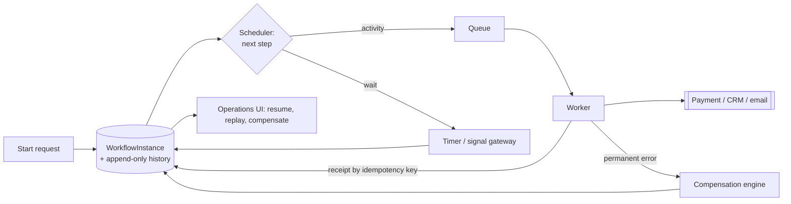

# Reliable Workflow Orchestration System - Answer Key

This answer key is designed for interview preparation. It shows what a strong GenAI FDE candidate should ask, design, evaluate, secure, and communicate before moving from demo to production.

## Strong discovery questions
- What event means the workflow succeeded — all technical steps completing, or the business effect applied exactly once?
- Which failures require rollback, and which require compensation, since those are different designs?
- Is the process fully automatic, human-in-the-loop, or mixed, and which steps may wait minutes, hours, or days?
- Can a workflow branch, re-enter, or be cancelled midstream once it has started?
- Who owns each internal system integration, and who receives the alert when a workflow stalls?
- Who is authorized to resume, re-run, or override a stuck case?
- Does the payment provider support idempotency keys, because that decides whether any retry is safe?
- What evidence must be retained for audit, and which actions need approval logs or signature trails?

## Strong functional requirements
- Support the core workflow: coordinate document approval, payment, email, and three internal systems so the business effect happens exactly once.
- Persist durable workflow state and an append-only history, so a crashed worker resumes rather than restarts.
- Express waiting as a first-class state with timers and signals, not an ad hoc sleep loop holding a worker.
- Define compensating actions per step, so partial failure resolves into a repairable state rather than a silent half-success.
- Version workflow definitions so running instances continue against the version they started with.
- Give operators a repair path to resume, replay, or compensate a specific instance under audit.

## Strong non-functional requirements
- Latency: budget per step, not per workflow; a process that legitimately waits seven days still needs bounded automatic steps.
- Availability: at 10 million active workflows and 100 million activities a day, roughly 1,200 activities per second, the queue and history store dominate.
- Security: authenticate and authorize at start and at every signal, since a resume or repair is as privileged as the original request.
- Compliance: an append-only history reconstructing who approved what, when, and under which definition version.
- Reliability: exactly once at the business-effect level, not at the message level — retries are safe only behind idempotency keys and receipts.
- Cost: separate workflow state from payloads, because storing large documents inline makes the history store the expensive component.

## Architecture explanation
- The control plane decides what should happen next: definition registry, workflow scheduler, timer service, signal gateway, compensation engine, and operations UI.
- The data plane is the queue-and-worker path that actually performs activities against payment, email, CRM, and the internal systems.
- Starting a workflow is synchronous — validate, authenticate, check permissions, write the first history event, return the workflow ID.
- Everything else is asynchronous: dispatching activities, waiting for approvals, timer wakeups, retries, and compensation.
- The orchestrator owns workflow state, step history, and retry intent; external systems own payment, CRM records, document approval, and email delivery.
- History is append-only and records intent before execution and completion after acknowledgment, which is what makes replay safe after a crash.
- The timer service wakes instances on a deadline and the signal gateway resumes them on human input, so a seven-day wait consumes no worker capacity.
- Optimistic concurrency on the instance row stops two workers advancing the same workflow from stale state.

## Data model / integration assumptions
- WorkflowInstance(id, definition_version, state, next_event); HistoryEvent(instance_id, sequence, type, payload_ref); ActivityReceipt(idempotency_key, external_ref, status); Timer(instance_id, fire_at).
- Assume HistoryEvent is append-only and never edited, because replaying it is how a crashed workflow rediscovers what already happened.
- Assume ActivityReceipt is the record of external side effects, so a repeated idempotency key returns the stored receipt rather than charging again.
- Assume every instance records its definition version, so a deployment mid-flight does not silently change the rules an in-progress workflow runs under.
- Assume payload_ref points at storage rather than inlining documents, keeping state small enough to replay cheaply.

## Red-team risks
- worker crash after payment succeeds, email sent but CRM failed, approval waiting days, definition changed mid-flight, external API hanging
- A worker crashing after the charge succeeded but before acknowledgment, where a naive retry double-charges a customer.
- Partial success across steps, where email reports success while the CRM update times out and the workflow pretends it all worked.
- Approvals waiting days, which must surface as a queue state with reminders and escalation rather than an alarm or a polling loop.
- Definition changes while instances run, so old instances must continue on their pinned version unless an explicit migration exists.
- An external API hanging indefinitely, which must be time-bounded and classified transient or permanent rather than retried forever.

## Rollout plan
- Week 0-1: pick one workflow rather than building a platform, and record the assumption ledger for payment idempotency and acceptable wait times.
- Week 1-2: make determinism and crash recovery the first gate — kill a worker mid-run and prove the instance resumes from history.
- Week 2-3: verify no duplicate external effects across crash, retry, and replay, using receipts and downstream reconciliation.
- Week 3-4: build operator visibility before broadening scope, so someone can see what is stuck, why, and how to recover it.
- Week 5: rehearse repair — resume, replay, and compensate a real stuck instance under audit.
- Week 6-8: version workflows instead of mutating them, publishing a compatible contract or an intentional, tested break.
- After pilot: onboard a second workflow only once stuck-workflow age, duplicate effects, and manual repair count stay inside tolerance.

## Evaluation plan
| Metric | What it proves | Strong threshold | Dataset / method |
|---|---|---|---|
| Duplicate effect count | Exactly once holds at the business-effect level | Zero repeated charges or emails | Idempotency logs and downstream reconciliation |
| Replay determinism pass rate | A crashed workflow resumes to the same decisions | Sampled histories replay identically | Replay test jobs against stored history |
| Stuck workflow age | Nothing silently sits in a non-terminal state | No instance beyond its expected wait | Durable state and queue inspection |
| Activity retry rate | Failures are transient rather than systemic | Stable; sustained spikes investigated | Worker and scheduler telemetry |
| Compensation rate | Partial failures resolve rather than accumulate | Stable and explainable per workflow type | Workflow history |
| Manual repair count | Operators are not the recovery mechanism | Within the agreed tolerance | Operator actions and ticket records |

## Weak answer
I would build an orchestrator that calls email, payment, and the internal APIs in sequence, with retries on failure. This is weak because it centers plumbing rather than the customer's result — no durable state, no exactly-once business effect, no compensation, and a retry after a successful charge simply charges again.

## Average answer
I would use a workflow engine with durable state, retry each step with backoff, and store an audit log of what happened. Approvals would pause the workflow until a signal arrives. This is better, but still incomplete because it does not separate retry from compensation, does not pin the definition version per instance, and does not say how an operator safely repairs an instance that is genuinely stuck.

## Strong answer
I would restate the outcome as executing long-running business processes exactly once at the business-effect level, with visible state and compensation when a step fails, because the system protects a business transaction stretched across time rather than messages in motion. That implies durable append-only history recording intent before execution and completion after acknowledgment, idempotency keys with receipts so retries are safe, waiting expressed as a first-class timer or signal state, and compensating actions defined per step. Every instance pins its definition version so a deployment cannot change the rules mid-flight. Operators get a repair path to resume, replay, or compensate under audit. I would prove crash recovery and no-double-charge before adding a second workflow.

## Interviewer scorecard
| Area | 1 - Weak | 3 - Average | 5 - Strong |
|---|---|---|---|
| Problem framing | "We need an orchestrator" | Names steps and retries | Exactly once at the business-effect level; four stakeholder jobs separated |
| Requirements | "It should finish" | Lists durable state and retries | Rollback versus compensation, first-class waiting, versioned definitions, repair authority |
| Architecture | Chain of API calls | Engine with durable state | Control/data plane split, timer and signal services, compensation engine, ops UI |
| Data/integration | Mentions an audit log | Names instances and events | Append-only history, receipts by idempotency key, pinned version, payload refs |
| Evaluation | "It completed" | Tracks failures | Duplicate effects, replay determinism, stuck age, compensation and repair rates |
| Safety/security | Not addressed | Auth at start | Authorization at every signal and repair; audit reconstructs approvals and controls |
| Rollout | Build the platform | Pilot one process | One workflow, crash-recovery gate, operator visibility, versioning over mutation |
| Communication | Describes the engine | Clear but generic | Leads with the double-charge case, states assumptions, closes with the first gate |

## Final 2-minute spoken answer
I would not start with the engine. The prompt is to coordinate document approval, payment, email, and three internal systems where any step may fail or wait for days, and the weak restatement is "we need an orchestrator that calls these APIs." That centers plumbing. The outcome-first restatement is executing long-running business processes exactly once at the business-effect level, with visible state and compensation when a step fails — and saying it that way immediately implies idempotency, durable state, retries, human approval pauses, auditability, and compensating actions. The hidden problem is that we are protecting a business transaction stretched across time, not messages in motion. Architecturally, the control plane holds the definition registry, scheduler, timer service, signal gateway, compensation engine, and operations UI; the data plane is the queue and workers that actually call payment, CRM, and email. Starting a workflow is synchronous — authenticate, authorize, write the first history event, return the ID — and everything after that is asynchronous. History is append-only and records intent before execution and completion after acknowledgment, which is exactly what saves us in the drill that matters: a worker crashes after the payment succeeded. We do not reissue the charge; we replay the history, observe the charge completed, and continue from the next unfinished step. Waiting seven days for an approval is a timer state, not a polling loop. Every instance pins its definition version so a deploy cannot change the rules mid-flight. I would start with one workflow, gate it on crash recovery and no duplicate effects, and give operators visibility before broadening scope.
