# Chapter 13: Design a Reliable Workflow Orchestration System

*Source: THE FORWARD DEPLOYED ENGINEER SYSTEM DESIGN INTERVIEW: 20 REAL-WORLD AI SYSTEM DESIGN INTERVIEWS — Chapter 13*

*Tutorial format: Interview-ready v2 (bullet-only cram format) — regenerated from the original tutorial's verified content, no new source material added.*

## Table of Contents

- [1. The Customer Problem and Discovery](#1-the-customer-problem-and-discovery)
  - [From Feature Request to Customer Outcome](#from-feature-request-to-customer-outcome)
  - [Stakeholder Map and Jobs-to-Be-Done](#stakeholder-map-and-jobs-to-be-done)
  - [The Two-Minute Opening Answer](#the-two-minute-opening-answer)
  - [Highest-Leverage Discovery Questions](#highest-leverage-discovery-questions)
  - [The Assumption Ledger](#the-assumption-ledger)
  - [Turning Discovery into Scope, Risks, and Success](#turning-discovery-into-scope-risks-and-success)
  - [Stakeholder Map in Practice](#stakeholder-map-in-practice)
  - [The Interview Signal Hiring Teams Listen For](#the-interview-signal-hiring-teams-listen-for)
- [2. Clarifying Questions, Requirements, and Constraints](#2-clarifying-questions-requirements-and-constraints)
  - [Choosing Which Unknowns to Pay For](#choosing-which-unknowns-to-pay-for)
  - [The Question Tree for Discovery](#the-question-tree-for-discovery)
  - [From Discovery to Requirements](#from-discovery-to-requirements)
  - [Functional vs Nonfunctional Requirements](#functional-vs-nonfunctional-requirements)
  - [Constraints vs Preferences](#constraints-vs-preferences)
  - [What the MVP Will Not Support](#what-the-mvp-will-not-support)
  - [Requirement-to-Component Traceability](#requirement-to-component-traceability)
  - [The Assumption Discipline an FDE Needs](#the-assumption-discipline-an-fde-needs)
- [3. Scale Estimates, SLOs, and Capacity](#3-scale-estimates-slos-and-capacity)
  - [Start with the Load That Breaks the First Draft](#start-with-the-load-that-breaks-the-first-draft)
  - [Working Assumptions and Activity Rate](#working-assumptions-and-activity-rate)
  - [Separate Workflow State from Payloads](#separate-workflow-state-from-payloads)
  - [Estimating Event-History Storage](#estimating-event-history-storage)
  - [Estimating Task-Queue Throughput](#estimating-task-queue-throughput)
  - [Sensitivity at 10x Growth](#sensitivity-at-10x-growth)
  - [Latency Budgets and Workflow SLOs](#latency-budgets-and-workflow-slos)
  - [Retry Math Is Not Compensation](#retry-math-is-not-compensation)
  - [Which Estimate Should Drive the Architecture](#which-estimate-should-drive-the-architecture)
  - [Communicating Uncertainty Like an Operator](#communicating-uncertainty-like-an-operator)
- [4. Architecture and End-to-End Flow](#4-architecture-and-end-to-end-flow)
  - [System Boundary and Customer Outcome](#system-boundary-and-customer-outcome)
  - [Component Map: Control Plane vs Data Plane](#component-map-control-plane-vs-data-plane)
  - [Top-Down Architecture and Trust Boundaries](#top-down-architecture-and-trust-boundaries)
  - [State Ownership and Consistency](#state-ownership-and-consistency)
  - [Sequence Diagram: Happy Path](#sequence-diagram-happy-path)
  - [Failure-Path Overlay: Worker Crash After Payment](#failure-path-overlay-worker-crash-after-payment)
  - [End-to-End Flow, Step by Step](#end-to-end-flow-step-by-step)
  - [Synchronous and Asynchronous Boundaries](#synchronous-and-asynchronous-boundaries)
  - [Queues, Backpressure, Caches, and Policy Placement](#queues-backpressure-caches-and-policy-placement)
  - [Why This Decomposition Matters](#why-this-decomposition-matters)
- [5. Data Model, APIs, and Working Code](#5-data-model-apis-and-working-code)
  - [The Smallest Safe Slice of the System](#the-smallest-safe-slice-of-the-system)
  - [Core Durable Records](#core-durable-records)
  - [API Contracts](#api-contracts)
  - [The Implementation Slice That Proves the Design](#the-implementation-slice-that-proves-the-design)
  - [What the Whiteboard Version Omits on Purpose](#what-the-whiteboard-version-omits-on-purpose)
  - [Tests That Make the Design Believable](#tests-that-make-the-design-believable)
  - [Why This Answer Sounds Credible in an Interview](#why-this-answer-sounds-credible-in-an-interview)
- [6. Security, Reliability, and Failure Handling](#6-security-reliability-and-failure-handling)
  - [The Uncomfortable Question That Anchors This Section](#the-uncomfortable-question-that-anchors-this-section)
  - [Threat Model Before Failure Policy](#threat-model-before-failure-policy)
  - [Failure Policies Are Design Decisions, Not Afterthoughts](#failure-policies-are-design-decisions-not-afterthoughts)
  - [Failure Drill: Worker Crashes After Payment Succeeds](#failure-drill-worker-crashes-after-payment-succeeds)
  - [Failure Drill: Email Succeeds but CRM Fails](#failure-drill-email-succeeds-but-crm-fails)
  - [Failure Drill: Approval Waits Seven Days](#failure-drill-approval-waits-seven-days)
  - [Failure Drill: Definition Changes While Instances Run](#failure-drill-definition-changes-while-instances-run)
  - [Failure Drill: External API Times Out Indefinitely](#failure-drill-external-api-times-out-indefinitely)
  - [Evidence the Interviewers Want to Hear](#evidence-the-interviewers-want-to-hear)
  - [Interview-Sized Code Sketch: No-Double-Charge Invariant](#interview-sized-code-sketch-no-double-charge-invariant)
  - [What to Say When the Interviewer Pushes on Trade-offs](#what-to-say-when-the-interviewer-pushes-on-trade-offs)
- [7. Delivery Plan, Observability, and Business Impact](#7-delivery-plan-observability-and-business-impact)
  - [Start with One Workflow, Not the Whole Platform](#start-with-one-workflow-not-the-whole-platform)
  - [Determinism and Crash Recovery as the First Gate](#determinism-and-crash-recovery-as-the-first-gate)
  - [Operator Visibility Before Broadening Scope](#operator-visibility-before-broadening-scope)
  - [Version Workflows Instead of Mutating Them](#version-workflows-instead-of-mutating-them)
  - [Rollout Scorecard: Six Metric Layers](#rollout-scorecard-six-metric-layers)
  - [Phased Rollout: Owners, Exit Criteria, Rollback Triggers](#phased-rollout-owners-exit-criteria-rollback-triggers)
  - [Connect the Dashboard to the User Journey](#connect-the-dashboard-to-the-user-journey)
  - [Core Product vs Adapter vs Configuration vs Shared Service](#core-product-vs-adapter-vs-configuration-vs-shared-service)
  - [Train Operators Before the First Wide Rollout](#train-operators-before-the-first-wide-rollout)
  - [The Risk Register Should Be Owned, Not Implied](#the-risk-register-should-be-owned-not-implied)
- [8. Interview Walkthrough, Trade-Offs, and Practice](#8-interview-walkthrough-trade-offs-and-practice)
  - [Minute-Zero Opening: Lead with the Business Effect](#minute-zero-opening-lead-with-the-business-effect)
  - [A Practical 50-Minute Answer Plan](#a-practical-50-minute-answer-plan)
  - [Keeping the Conversation at the Right Depth](#keeping-the-conversation-at-the-right-depth)
  - [Trade-off Framing to Defend](#trade-off-framing-to-defend)
  - [Follow-up Drills and Strong Answers](#follow-up-drills-and-strong-answers)
  - [Common Weak Answers and How to Repair Them](#common-weak-answers-and-how-to-repair-them)
  - [Scoring Rubric for Self-Evaluation](#scoring-rubric-for-self-evaluation)
  - [A 90-Second Architecture Summary](#a-90-second-architecture-summary)
  - [Practice Loop: Solo, Pair, Implementation](#practice-loop-solo-pair-implementation)
- [Coverage Notes](#coverage-notes)
  - [My Perspective on the Gaps](#my-perspective-on-the-gaps)

## 1. The Customer Problem and Discovery

### From Feature Request to Customer Outcome

- The customer prompt: coordinate document approval, payment, email, and three internal systems when any step may fail or wait for days.
- Stakeholders immediately disagree on what matters:
  - Business sponsor wants the process to "just finish."
  - Operations lead wants retries, visibility, and rollback hooks.
  - Application team wants to avoid a brittle chain of point-to-point integrations.
  - Auditor wants evidence of who approved what, when, and under which controls.
- First move is not technology — restate the problem in one sentence without committing to a product shape.
- Feature-first restatement (weak): "We need an orchestrator that can call email, payment, and three APIs" — true but centers plumbing, not the customer's result.
- Outcome-first restatement (strong): "Execute long-running business processes exactly once at the business-effect level, with visible state and compensation when a step fails."
  - Immediately implies: idempotency, durable state, retries, human approval pauses, auditability, compensating actions.
  - Reveals the hidden problem: the system protects a business transaction stretched across time, not just messages in motion.
- Speaking this way demonstrates the core FDE habit hiring teams look for: translating ambiguous customer language into a measurable technical objective.

### Stakeholder Map and Jobs-to-Be-Done

- Four stakeholder groups, mapped by job-to-be-done rather than role (treating them as the same optimizes the wrong part of the system):
  - **Workflow participants** — job: "review and decide without losing context."
  - **Operations teams** — job: "see what is stuck, why it is stuck, and how to safely recover it."
  - **Application developers** — job: "integrate a system once without inventing custom retry logic for every edge case."
  - **Auditors** — job: "reconstruct the decision trail and verify the controls."
- Each group values a different form of reliability: users want clarity, operators want recoverability without breaking integration boundaries, auditors want traceability.
- A good FDE answer serves all four without letting any one of them dominate the design.

### The Two-Minute Opening Answer

- Model opening answer for a live interview:
  - "The customer wants a workflow orchestration system for document approval, payment, email, and three internal systems where any step may fail or pause for days. I would first clarify whose workflow matters, what business event counts as success, and which steps need human approval versus automatic execution. My working outcome is to complete each business process exactly once at the business-effect level, keep the current state visible to users and operators, and define compensating actions for partial failure. I'll assume we need durable state, retries, audit history, and the ability to resume after worker crashes unless you tell me otherwise. From there I'd estimate volume, latency, and failure tolerance, then design the orchestration, security, and observability around that."
- This answer restates the prompt, names the users, identifies the outcome, and states assumptions when information is missing — the right compression strategy under interview time pressure: fewer questions, higher leverage.

### Highest-Leverage Discovery Questions

- Do not interrogate every subsystem equally — ask the questions that collapse uncertainty fastest.
- **Clarify the business finish line:**
  - What event means the workflow succeeded?
  - Is success defined by all technical steps completing, or by the business effect being applied once?
  - Which failures require rollback, and which require compensation?
- **Identify the workflow shape:**
  - Is the process fully automatic, human-in-the-loop, or mixed?
  - Which steps can wait minutes, hours, or days?
  - Can a workflow branch, re-enter, or be cancelled midstream?
- **Determine blast radius and ownership:**
  - Who owns each internal system integration?
  - Which team receives alerts when the workflow stalls?
  - Who is authorized to resume, re-run, or override a case?
- **Pin down trust and compliance requirements:**
  - What evidence must be retained for audits?
  - Which actions require approval logs or signature trails?
  - Are there residency, retention, or data-minimization constraints?
- If the interviewer withholds information, say so explicitly and convert ambiguity into a documented assumption — e.g., "I don't know yet whether payment is the final business effect or just one step in a larger approval chain, so I'm going to assume payment can be retried safely only if the provider supports idempotency keys and we can prove a single business effect with a durable workflow record."

### The Assumption Ledger

- An assumption ledger is a working list of what you treat as true until the customer confirms otherwise — not a formal artifact for its own sake.
- A useful ledger entry has four parts:
  - **Assumption**: what you believe is true for now
  - **Impact**: why the assumption matters to the design
  - **Verification**: how you would confirm it
  - **Owner or follow-up**: who can answer it or when it must be resolved
- Example entry 1:
  - Assumption: payment provider supports idempotency keys
  - Impact: determines whether retries can be safe without duplicate charges
  - Verification: ask the payment owner or inspect provider docs
  - Owner or follow-up: payment integration team before final design
- Example entry 2:
  - Assumption: workflow participants can tolerate a multi-day pause
  - Impact: influences state retention, expiration, and notification strategy
  - Verification: confirm with the business sponsor and support team
  - Owner or follow-up: product owner before capacity planning
- Discovery is always a mix of facts and temporary guesses — unrecorded guesses silently become design decisions. Showing you can separate verified requirements from assumptions is often more valuable in interview than naming a specific product.

> 🎯 **Interview Pointer:** Interviewers often probe whether you can keep discovery honest under time pressure — having a crisp four-part ledger format ready (assumption / impact / verification / owner) is a fast way to show discipline without slowing the conversation down.

### Turning Discovery into Scope, Risks, and Success

- Discovery is not a warm-up — it defines the system. By the end you should have four artifacts in your head or on the board:
  - **Scope**: which workflows are in and which are out
  - **Assumptions**: what you are temporarily treating as true
  - **Risks**: where duplicates, data loss, or unauthorized actions can happen
  - **Owners**: who owns each integration, approval, escalation, and support path
- Success must be measurable in business language, not infrastructure language — not "messages processed" or "tasks retried," but completed workflows, duplicate-prevention rate, compensation success rate, mean time to detect stuck cases, and operator ability to explain any case start to finish.
- Simple interview-sized success metric: the business effect happened once, the user can see the current state, and every exception has a defined compensation or escalation path.

### Stakeholder Map in Practice

- Worked example: the workflow approves a contract, triggers payment, sends a notification email, and updates three internal systems.
  - The end user is the participant waiting on approval or payout, not "the API."
  - The operator is the person on call when a worker crashes after payment succeeds.
  - The security owner decides who can resume or override a stalled case.
  - The executive sponsor cares that the process is predictable, compliant, and not manually reconstructed from spreadsheets.
- A good FDE answer shows you can serve all four without letting any one dominate.

### The Interview Signal Hiring Teams Listen For

- The panel is not only testing whether you can sketch architecture — they test whether you can move from customer pain to technical leverage without getting trapped in generic platform talk.
- Strongest candidates make the problem concrete, name the people involved, state the assumptions, and define success in terms the customer would recognize.
- Architecture should start only after you can say whose workflow changes and how success will be measured — otherwise you are still describing software, not designing a system that supports the business.

## 2. Clarifying Questions, Requirements, and Constraints

### Choosing Which Unknowns to Pay For

- The first design move is not architecture — it's choosing which unknowns are worth paying for in the interview.
- The interviewer may answer only half your questions; the best candidate does not try to eliminate all ambiguity. Instead:
  - Identify the few decisions that would materially change the design.
  - Protect the highest-risk constraint: preventing duplicate business effects when steps fail, wait, or resume out of order.

### The Question Tree for Discovery

- A compact question tree keeps the conversation sharp, and each question maps to a concrete design consequence:
  - What is the exact step order, and which steps can branch or be skipped? → determines whether you're building a straight-line job runner or a true state machine.
  - Which actions are reversible, and which are irreversible once they succeed? → tells you where compensation is safe vs. where retries need care.
  - How long can a workflow remain active before it must time out, archive, or be canceled? → shapes storage and timer design (in-memory state or a short-lived queue can't support week-long waits).
  - Where does human approval enter, and how long can that approval reasonably wait? → affects how suspended states, reminders, escalations, and abandoned cases are modeled.
  - Do the external systems support idempotency keys, replay protection, or a unique business reference? → decides whether retries are safe or the orchestration layer must build its own deduplication envelope.
  - Can workflow definitions change while older instances are still running, and if so, how do we keep those instances compatible? → becomes critical the moment a new approval step is requested while 10,000 old workflows are in flight.
- When the interviewer answers only half the questions, do not freeze — make explicit assumptions and attach them to risk.
  - Safest anchor assumption for this prompt: payment is the highest-risk irreversible action, so the design must defend against duplicate payment even if everything else degrades.

### From Discovery to Requirements

- Convert the conversation into a prioritized set of requirements, not a shopping list — must/should/could framing:
  - **Must**: durable state machine, persisted transition history, idempotent activity execution, retry and timeout policies, human signals and timers, saga compensation, operator recovery.
  - **Should**: workflow-definition versioning that allows compatible evolution of running instances.
  - **Could**: richer analytics, custom dashboards, or user-configurable branching rules if they do not threaten correctness.
- Why each must-have exists:
  - Durable state machine — survives process death and pauses across long gaps.
  - Persisted transition history — lets an operator inspect what happened, and a restarted worker reconstruct intent without guessing.
  - Idempotent activity execution — retries are inevitable, and retries without deduplication are duplicate side effects with better branding.
  - Retry and timeout policies — external systems fail, slow down, and sometimes never answer.
  - Human signals and timers — approval is often a business event, not an API callback.
  - Saga compensation and operator recovery — some steps can be undone and some must make that difference explicit.

### Functional vs Nonfunctional Requirements

- Functional: the system moves through approval, payment, notification, and internal updates.
- Nonfunctional: it must keep running through process crashes and even region failures, preserve inspectable history, avoid duplicate payment, and evolve without breaking workflows already in progress.
- Mixing the two categories blurs trade-offs; separating them clarifies what the system does vs. how safely it must do it.
- Nonfunctional requirements stated as measurable outcomes:
  - "Survive process and region failures" = workflow resumes after worker loss and site-level outage without losing committed state.
  - "No duplicate payment" = the payment effect is protected by a business key, durable deduplication, or a provider-side idempotency mechanism used consistently.
  - "Inspectable history" = every transition, retry, approval signal, timeout, and compensation event is persisted in queryable form.
  - "Compatible evolution of running instances" = a workflow definition change must not strand older executions or reinterpret their state machines mid-flight.

### Constraints vs Preferences

- A constraint narrows the safe design space; a preference improves usability but can bend.
- In this prompt:
  - Irreversible payment handling — constraint, not preference.
  - Human approval latency — constraint if the business genuinely waits days, preference if approvals normally happen within hours.
  - Workflow versioning — constraint once the customer admits in-flight cases will survive a deployment.
  - A nice dashboard — preference.
- Naming which is which out loud shows the candidate can protect the architecture from scope creep.

> 🎯 **Interview Pointer:** When interviewers introduce a new "nice to have" mid-interview, explicitly classify it as constraint or preference before reacting — this single habit is one of the clearest signals of architectural discipline under pressure.

### What the MVP Will Not Support

- Explicit non-goals prevent solution sprawl:
  - No arbitrary user-authored branching logic, multi-tenant visual rule builders, or global exactly-once delivery across every downstream system.
  - No attempt to make all actions reversible — payment and some external writes are not safely reversible in the general case.
  - No infinite retention for transition history — retention should be explicit and policy-driven.
  - No single universal compensation strategy — some steps will need manual recovery.
- A reliable orchestration system earns trust by doing a few hard things well, not by pretending to be a full business-process platform on day one.

### Requirement-to-Component Traceability

- A concise traceability table is the bridge from requirements to architecture, and later from architecture to implementation and operations:

| Requirement | Primary component(s) |
|---|---|
| Durable state machine | Workflow engine, persisted workflow store |
| Persisted transition history | Event/history store, audit log |
| Idempotent activity execution | Activity executor, deduplication keys, provider idempotency adapter |
| Retry and timeout policies | Scheduler, timer service, retry policy engine |
| Human signals and timers | Signal intake, approval queue, deadline manager |
| Saga compensation and operator recovery | Compensation handlers, admin console, manual override path |
| Survive process and region failures | Replicated storage, replayable execution model, failover procedures |
| No duplicate payment | Payment guardrail, unique business reference, payment ledger check |
| Inspectable history | Query API, history viewer, event export |
| Compatible evolution | Versioned workflow definitions, migration rules, compatibility gates |

### The Assumption Discipline an FDE Needs

- Best interview answer does not pretend certainty where none exists: "I am assuming payment is irreversible, approvals may wait for days, and workflow definitions will change while old instances remain active. Under those assumptions, I will optimize for durable state, explicit history, idempotent side effects, and version compatibility."
- A strong FDE shows discovery, prioritization, and delivery discipline at the same time — translating incomplete customer input into a system that is safe enough to ship, narrow enough to reason about, and flexible enough to grow.
- Next step: requirements turn into scale estimates and SLOs, where the architecture starts to harden.

## 3. Scale Estimates, SLOs, and Capacity

### Start with the Load That Breaks the First Draft

- The first architecture a candidate draws is usually reasonable at average load: workflow service, queue, worker pool, database for state, blob store for attachments.
- That draft is often too optimistic about timing — the hidden constraint is not just volume, it's the combination of long waits, retries, and deadline pressure.
- A workflow can sit for days, then surge into a burst when approvals land, a payment gateway returns, or a downstream system recovers. Sizing only for average traffic can miss the business deadline in production.
- Next move: estimate the envelope — how many workflows exist concurrently, how many events they generate, how much state must be retained durably, how fast tasks must be dispatched, and how much slack the system needs for peaks and partial outages.

### Working Assumptions and Activity Rate

- Scenario numbers used as planning inputs, not gospel:
  - 10 million active workflows
  - 100 million activities per day
  - Week-long waits between some steps
- These already imply the system is a durable state machine with a large inactive population and a smaller, constantly moving subset.
- Daily-to-per-second conversion: 100,000,000 activities/day ÷ 86,400 seconds/day ≈ **1,157 activities/second on average**.
- Average is useful but not what you provision for — office-hours concentration, morning reminder batching, or a dependency outage causing delayed retries to resume together can push true peak several times higher.
- Practical framing to state out loud:
  - Average dispatch rate: about 1.2k activities/sec
  - Peak dispatch rate: 3x–10x average depending on customer usage patterns
  - Headroom: at least 2x above the observed peak for a new system, more if retries or regional failover are in scope
  - Growth factor: model both 2x and 10x future scale before locking in partition counts or storage layout

### Separate Workflow State from Payloads

- Common scaling mistake: storing everything in the workflow history.
- Durable state should carry only the minimal facts needed to replay, resume, audit, and compensate: step status, timestamps, correlation IDs, business references, version markers.
- Large documents, PDFs, images, or payloads from internal systems belong in object storage or a document store, referenced by pointer.
- This separation matters for three reasons:
  1. **Replay cost** — pulling megabytes of payload into the orchestration engine on every retry/rehydration grows latency and worker memory pressure.
  2. **Retention cost** — workflow histories often need audit/support retention; keeping large payloads in the hot path turns an operational ledger into an expensive archive.
  3. **Blast radius** — a payload leak or accidental mutation is far more damaging if the payload is copied across every event record.
- Rule of thumb: workflow state should be enough to make the system deterministic and inspectable; payload storage should hold the large, mutable, or externally sourced data. The workflow references the payload, but does not become the payload.

### Estimating Event-History Storage

- Back-of-envelope method: active workflows × events retained per workflow × bytes per event — not a magic number.
- Working assumptions:
  - 10 million active workflows
  - 40 events retained per workflow on average
  - 1 KB per event record, illustrative
- Yields roughly **400 GB** of raw event data, before replication, indexing, compaction overhead, or backups.
  - At 2 KB/event instead of 1 KB → about **800 GB**.
  - If the active set is really 20 million rather than 10 million, it doubles again.
- The purpose of the estimate is to reveal which dimension dominates the storage design, not to prove a final number.
- Practical design choice: if history retention is long, separate the hot execution path (execution metadata, task leases) from the colder audit path so compaction, tiering, and retention policies are easier to reason about.

### Estimating Task-Queue Throughput

- Task-queue throughput is the operational choke point — approval notifications, payment requests, internal API calls, and status updates all become queued work.
- At 100M activities/day, sustained rate above ~1,157 activities/second must be accepted, leased, and completed.
- That number alone is incomplete: every activity typically creates at least two queue-related actions (enqueue, dequeue), sometimes more with leasing, visibility timeouts, or requeues.
- Throughput envelope should describe both task creation and task execution:
  - Task enqueues: roughly proportional to activity count
  - Task leases and acknowledgments: at least one per activity, often more with retries
  - Retry traffic: additional load after transient failures or worker restarts
- The queue subsystem must tolerate a retry storm without starving new tasks — a practical design choice is to partition queues by workflow tenant, workflow type, or priority class so one customer or one runaway workflow family cannot monopolize all dispatch capacity.

### Sensitivity at 10x Growth

- A sensitivity table makes the scaling decision concrete and shows what breaks first when assumptions move:

| Scenario | Active workflows | Activities/day | Avg activities/sec | Likely architectural pressure |
|---|---|---|---|---|
| Base case | 10M | 100M | ~1.2k | Durable history, moderate partitioning, warm worker pool |
| 10x growth | 100M | 1B | ~11.6k | Stronger sharding, stricter queue isolation, heavier compaction/tiering |

- At 10x growth the bottleneck is unlikely to be application-server CPU — more likely storage fan-out, queue hot spots, replay latency, or operational cost.
- If the design cannot absorb that growth without a full rewrite, say so and choose a more partition-friendly layout from the start.

### Latency Budgets and Workflow SLOs

- A workflow orchestration system needs SLIs/SLOs distinct from a typical API server:
  - **Availability SLI**: percentage of time workflow submission, progress updates, and operator controls are reachable
  - **Latency SLI**: time to accept a new step, time to dispatch an activity, time to reflect state changes in the UI
  - **Freshness SLI**: delay between a real-world event and its visible representation in workflow state
  - **Quality SLI**: rate of duplicate side effects, missed transitions, failed compensations, or stuck workflows
  - **Security SLI**: fraction of requests correctly authorized and audited; sensitive-data-exposure rate driven toward zero by design (not described as impossible)
  - **Cost SLI**: cost per workflow or per thousand activities, plus support burden for operator intervention
- Translate into customer-felt objectives: the customer may not care about an 80ms vs. 120ms task lease, but does care if a payment step takes so long to appear in the UI that an operator assumes it's lost and manually retries it, or if a workflow that should be compensating sits invisible for hours.
- Queue subsystem sizing must tolerate a retry storm without starving new tasks — partition by tenant, workflow type, or priority class so one runaway workflow family can't monopolize dispatch capacity.

### Retry Math Is Not Compensation

- Retry formula bounds repeated attempts without a thundering herd:

**backoff_n = min(cap, base × 2^n) + jitter**

- *n* = retry attempt number, *base* = initial delay, *cap* = maximum delay, *jitter* = randomized variation to avoid synchronized retries.
- Exponential backoff slows repeated attempts after failure, protecting dependencies and giving transient incidents time to recover.
- Backoff is **not** business compensation:
  - Payment succeeds, email fails → retrying email is appropriate.
  - Payment succeeds, workflow later discovers a validation error → backoff does not undo the charge; an explicit compensation step (refund, mark for review) is needed.
  - Retry answers "try again later"; compensation answers "what business action reverses or mitigates the completed side effect?" — keeping these distinct is essential.
- Cap and jitter are operational trade-off decisions tied to the business process, not chosen by habit:
  - Low cap → faster recovery for user-facing work, but can overload a flaky dependency.
  - High cap → protects the dependency, but delays customer-visible progress.

> 🎯 **Interview Pointer:** "Retry vs. compensation" is one of the most common conceptual traps interviewers set — always state explicitly that backoff never substitutes for a business-level reversal (e.g., a refund) when a completed side effect must be undone.

### Which Estimate Should Drive the Architecture

- Usually not total workflow count by itself — it's the combination of long waits, visible state, and side-effect safety:
  - Week-long waits force durable storage and replayability.
  - 100 million daily activities force queue scalability and partition strategy.
  - Irreversible side effects force idempotency, unique business keys, and compensation tooling.
- Component selection should follow the stress point, not whichever is easiest to draw:
  - If history volume dominates → optimize storage tiering and retention policies.
  - If dispatch rate dominates → optimize queue partitioning and worker elasticity.
  - If external APIs dominate → optimize retries, circuit breaking, and per-integration throttles.
  - If manual recovery dominates → optimize observability, operator UI, and audit trails.

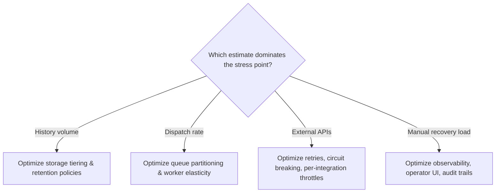

### Communicating Uncertainty Like an Operator

- Interviewers want evidence you know how to use estimates as a control surface, not fake certainty.
- Example phrasing: "I would treat 10 million active workflows as the initial working set, but I would size the partitions and queue namespaces with a 10x sensitivity case because growth and retry bursts are likely to concentrate load unevenly. If the customer later confirms that only 20% of workflows are long-running, the storage plan gets easier; if they confirm that 80% have week-long waits, the retention and replay path becomes the top concern."
- This shows you are choosing the smallest design that remains safe under plausible growth and failure modes — not overengineering for every imaginable future.
- This section is a job-market filter: many engineers can describe distributed systems abstractly; fewer can say which number matters, why, and what decision it changes.
- Estimates are decision tools — each number should justify an architectural choice or operational limit. If a metric doesn't change partitioning, storage, retry policy, latency budget, or support model, it's probably the wrong metric to foreground.

## 4. Architecture and End-to-End Flow

### System Boundary and Customer Outcome

- Start from the customer outcome and work backward: **execute long-running business processes exactly once at the business-effect level with visible state and compensation**.
- "Exactly once" is not a promise that no retry ever happens — it's a promise that the business never double-charges, double-sends, or silently loses a step, made observable.

### Component Map: Control Plane vs Data Plane

- The system decomposes cleanly only if you distinguish the control plane from the data plane.
- Components:
  - **Workflow definition registry** — source of truth for approved workflow templates, step order, retry rules, timeout rules, and compensation mappings.
  - **Durable history store** — system of record for every state transition, signal, attempt, receipt, and terminal outcome.
  - **Workflow scheduler** — reads durable history, decides the next runnable transition, assigns it to execution.
  - **Activity task queues** — buffered handoff between scheduling decisions and worker execution.
  - **Workers** — perform external calls, internal side effects, and local validation.
  - **Timer service** — wakes workflows after a delay, deadline, or human waiting period.
  - **Signal/approval gateway** — accepts explicit human or system signals that unblock a waiting workflow.
  - **Compensation engine** — coordinates rollback-like business actions for already-completed steps when a terminal failure occurs.
  - **Operations UI** — shows live state, who is waiting on whom, retry history, and operator controls (pause, resume, override).
- **Control plane** = registry, scheduler, timer service, signal gateway, compensation engine, operations UI — decides what should happen next.
- **Data plane** = the queue-plus-worker path that actually performs work.
- That split is the heart of the design: it lets you scale decision-making separately from side-effect execution.

### Top-Down Architecture and Trust Boundaries

- Top-down flow:
  - Customer/Internal Caller sends an HTTP/API request with an idempotency key.
  - Request enters the Workflow API.
  - API consults the Workflow Definition Registry for the allowed workflow template and policy.
  - API writes the first event to the Durable History Store.
  - API may notify the Workflow Scheduler that a new instance is ready.
  - Workflow Scheduler consults durable history and dispatches runnable work into the Activity Task Queues.
  - Workers consume from the queue and call the External Payment System, the Approval/Document Service, and Internal Systems A/B/C.
  - Workers append results and receipts back to the Durable History Store.
  - Timer Service watches deadlines and reawakens workflows that must continue later.
  - Signal/Approval Gateway accepts human approvals, rejections, or external system signals and forwards them to the scheduler.
  - Compensation Engine issues business compensations back through the queues when a workflow must unwind completed work.
  - Operations UI reads the store and scheduler state so operators can observe, pause, resume, or override safely.

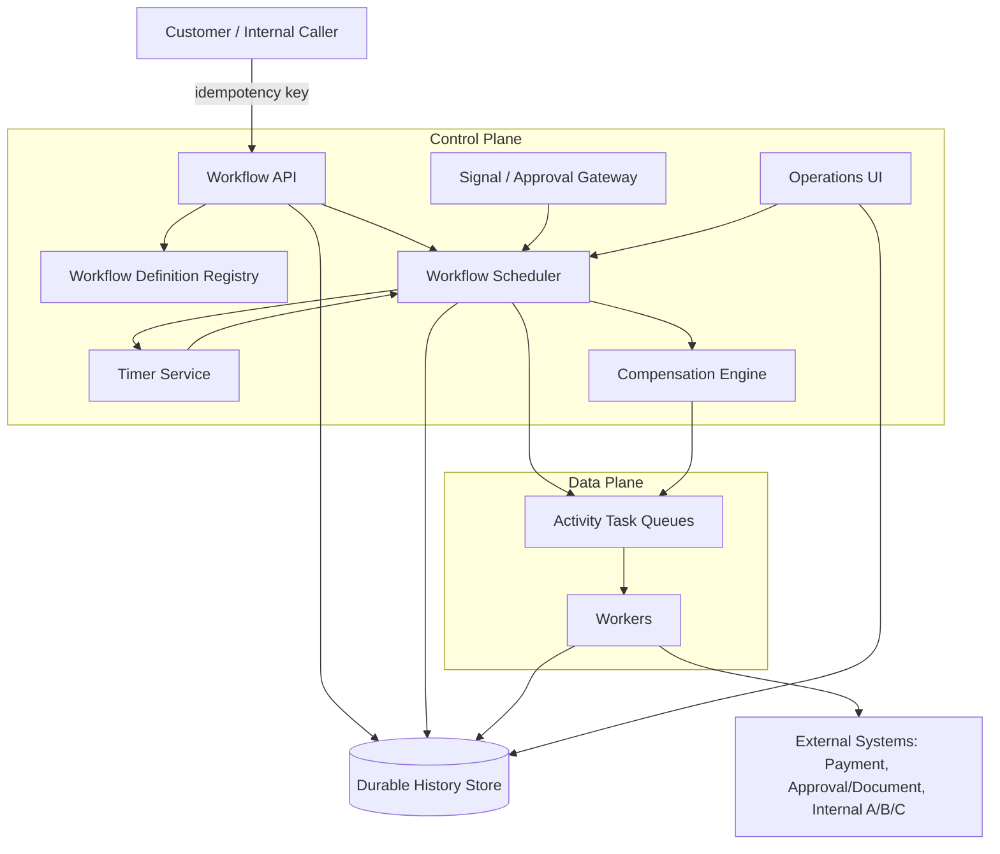

- Three trust boundaries, each needing its own authentication, authorization, and logging policy (do not blur into one generic "service layer"):
  - **Public/customer-facing API** — accepts the workflow start request and an idempotency key, but must not trust that the caller will retry carefully.
  - **Worker edge** — external systems can fail, time out, or partially complete.
  - **Human approval path** — slow, fallible, and auditable.

### State Ownership and Consistency

- The **durable history store** owns the canonical progression of the workflow.
- Queues do not own truth — they own delivery.
- Workers do not own truth — they propose effects.
- The scheduler does not "remember" through memory alone — it recomputes from durable history.
- This is the key consistency point: after each accepted event, the history store is the record that drives recovery.

### Sequence Diagram: Happy Path

- Happy-path sequence, read top-to-bottom as order of events, left-to-right as actors:
  1. Caller → Workflow API: start workflow with idempotency key.
  2. Workflow API → Durable History Store: append scheduled transition.
  3. Workflow API → Workflow Scheduler: notify that a new runnable instance exists.
  4. Workflow Scheduler → Activity Task Queues: dispatch activity and record attempt.
  5. Activity Task Queues → Worker: deliver the activity.
  6. Worker → External System(s): execute payment, approval lookup, email, or internal side effect.
  7. Worker → Durable History Store: commit completion receipt.
  8. Workflow Scheduler → Timer Service or Signal Gateway: wait on timer or human signal.
  9. Timer Service or Signal Gateway → Workflow Scheduler: wake or resume the workflow.
  10. Workflow Scheduler → Activity Task Queues: retry transient failure when policy allows.
  11. Workflow Scheduler → Compensation Engine: compensate completed steps on terminal failure.
  12. Workflow Scheduler → Durable History Store: close with audit summary.

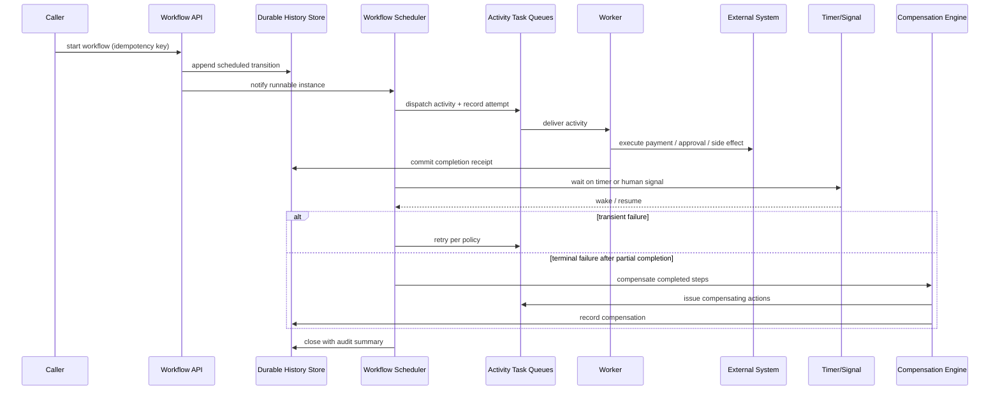

- Narrate the sequence in order without skipping handoffs — the interviewer should hear control move from the model to deterministic services and back again.

### Failure-Path Overlay: Worker Crash After Payment

- The most important failure drill in this chapter: the **worker crashes after payment succeeds**.
- Event sequence:
  - Caller starts the workflow with an idempotency key.
  - API appends the scheduled transition to history.
  - Scheduler dispatches the payment activity and records an attempt.
  - Activity queue delivers the attempt to a worker.
  - Worker calls the external payment system.
  - Payment system returns success.
  - **Worker crashes before it records the completion receipt.**
  - Scheduler detects the missing completion or a timeout.
  - Scheduler decides whether to redeliver the activity or reconcile from recorded state.
  - If transient/recoverable → queue redelivers the activity, worker records the completion receipt.
  - If terminal failure after partial completion → compensation engine triggers compensation for completed steps, sends compensating actions through the queue.
  - History store closes the workflow with an audit summary.

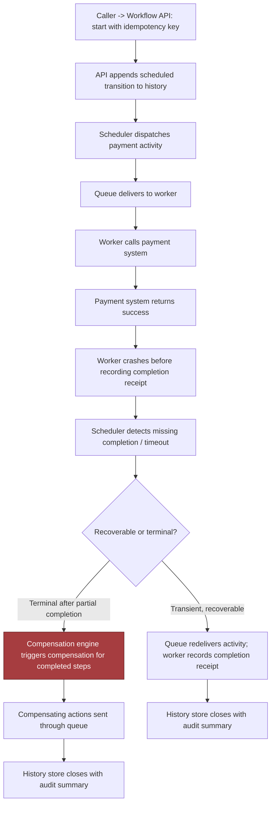

- The payment may have succeeded before the worker died, so the system must never equate "worker lost" with "business action lost."
- The durable history store and completion receipt are what prevent a double charge on retry — the scheduler either reissues the step safely or escalates to compensation based on what history says already happened.

> 🎯 **Interview Pointer:** This exact drill — worker crash after payment succeeds, before the receipt is recorded — is the single most likely follow-up question in this chapter's interview. Memorize the resolution: durable history + completion receipt decide "redeliver" vs. "compensate," never worker memory.

### End-to-End Flow, Step by Step

- The happy path as a numbered sequence, not a vague story:
  1. Caller starts the workflow with an **idempotency key** so a retry does not create a duplicate business process.
  2. API validates the request and **appends a scheduled transition** to durable history.
  3. Scheduler reads that transition and **dispatches an activity** to the queue, recording that an attempt has begun.
  4. A worker picks up the activity, performs the side effect, and **records a completion receipt** back to durable history.
  5. Workflow moves into a **wait state** for either a timer or a human signal.
  6. If the activity fails transiently, scheduler arranges a **retry** per policy rather than escalating immediately.
  7. If the workflow reaches a terminal failure after some steps have already completed, the compensation engine invokes **compensating actions** for those completed steps.
  8. Workflow closes with an **audit summary** showing the path taken, waits, retries, manual interventions, and final effect.
- This flow is a chain of consistency points: the request becomes durable before any downstream side effect; the side effect happens before the workflow claims success; the audit summary comes last because it is derived from history, not worker memory.

### Synchronous and Asynchronous Boundaries

- **Synchronous**: start request validation, authentication, permission checks, writing the initial history event, returning the workflow ID, most operations UI reads.
- **Asynchronous**: dispatching activities, waiting for approvals, timer wakeups, retries, compensation, most downstream integrations.
- This boundary is not cosmetic — it's how the API stays responsive while a business process waits for days.
- Everything-synchronous design → brittle request chain that breaks under human delay.
- Everything-asynchronous without a strong history model → loses explainability and operator control.

### Queues, Backpressure, Caches, and Policy Placement

- Queues belong at the edge between scheduling and execution, not inside the state store — they absorb bursty demand and isolate slow workers.
- Backpressure belongs in the scheduler and queue admission path: if a tenant, partition, or dependency is congested, slow new dispatches rather than let retries flood the whole fleet.
- Caches belong only for read-heavy, low-risk data (workflow definitions, UI summaries) — never the only place execution state lives.
- Policy enforcement belongs close to decision points: retry limits in the scheduler, approval requirements in the signal gateway, permission checks before compensation or manual override.
- Partitioning key (workflow ID, tenant ID, or customer/process key) determines how history and queue load spread — goal is reducing hot spots and preserving causal order where the business requires it, not just raw sharding for scale. If two steps must never race for the same process instance, the partitioning key should keep them together.

### Why This Decomposition Matters

- The same architecture must be understandable to a product owner (invoices, approvals) and an engineering team (retries, locks, queue depth) — that dual-language ability is a strong job-market signal.
- Narrate **data, identity, state, and failure** through the diagram:
  - Data flows from caller → history → scheduler → worker and back.
  - Identity flows through auth, idempotency keys, and approval context.
  - State lives in durable history.
  - Failure is handled by retries, timers, and compensation, rather than optimism.

## 5. Data Model, APIs, and Working Code

### The Smallest Safe Slice of the System

- The design becomes interview-credible when it stops being a cloud of boxes and turns into durable records, contracts, and one code path proving the hardest part can work safely.
- Highest-risk component for this orchestrator: the state machine that decides what happens next after a step succeeds, fails, or is replayed — not the approval UI or email sender.
- If the state machine is wrong, every other subsystem can be perfectly healthy and the customer still gets duplicate charges, lost approvals, or a workflow that appears stuck forever.

### Core Durable Records

- Four core records anchor the design, each with an explicit purpose, primary key, lifecycle, and retention policy:
  - `WorkflowInstance(id, definition_version, state, next_event)` — the owning row for one business process.
    - Purpose: one durable source of truth for the workflow's current status and where it should resume.
    - Primary key: `id`.
    - Lifecycle: created when the workflow starts, updated on every transition, eventually archived or retained per customer policy.
    - Retention: keep the active row for the duration of the workflow; retain a compact historical form after completion if audit/replay is required.
  - `HistoryEvent(instance_id, sequence, type, payload_ref)` — append-only audit trail.
    - Purpose: reconstruct what happened, in order, without trusting memory or transient logs.
    - Primary key: `(instance_id, sequence)`.
    - Lifecycle: append only; never mutate past events.
    - Retention: long enough for debugging, customer audit, and replay; then cold storage or purge under policy.
  - `ActivityReceipt(idempotency_key, external_ref, status)` — records side effects already attempted or completed.
    - Purpose: prevent a retry from charging twice, emailing twice, or applying the same update twice.
    - Primary key: `idempotency_key`.
    - Lifecycle: written before or immediately after the external effect, depending on dependency semantics.
    - Retention: as long as duplicate suppression is needed.
  - `Timer(instance_id, fire_at)` — tracks delayed wake-ups.
    - Purpose: resume long waits, timeout approvals, or poll for external completion.
    - Primary key: `(instance_id, fire_at)` or equivalent scheduler key.
    - Lifecycle: created when waiting begins, deleted when the wait resolves, reinserted if the workflow is retried.
- Data ownership split: the orchestrator owns workflow state, step history, and retry intent; external systems own payment, CRM updates, document approval, and email delivery. The orchestrator can record that a payment happened, but it never becomes the financial ledger.

### API Contracts

- Four API contracts make the state machine usable, small enough to explain in one breath but strict enough that clients cannot smuggle ambiguous work into the engine:
  - `POST /v1/workflows/{type}` — starts a workflow.
    - Authentication: standard caller auth plus tenant/customer scoping.
    - Idempotency: caller-supplied idempotency key so a retry does not create two workflow instances.
    - Request: workflow type, business payload, caller context, optional correlation metadata.
    - Response: workflow instance id, initial state, stable status reference.
    - Errors: `400` invalid shape, `401/403` auth failure, `409` reused idempotency key with conflicting payload, `422` semantically invalid workflow inputs.
  - `POST /v1/workflows/{id}/signals` — submits human or system input.
    - Authentication: caller must be authorized to signal that workflow or tenant.
    - Idempotency: signal id plus payload hash or caller key to suppress duplicate approval clicks or repeated system callbacks.
    - Response: accepted signal, resulting state transition, or a no-op if the same signal was already applied.
  - `GET /v1/workflows/{id}/history` — returns the audit trail.
    - Authentication: read access to that workflow's tenant and policy scope.
    - Semantics: read-only, paginated, ordered by sequence.
    - Errors: `404` unknown workflow, `403` hidden by access policy.
  - `POST /v1/workflows/{id}/repair` — lets operators or approved automation resume, replay, or compensate.
    - Authentication: elevated operator authorization, tightly scoped.
    - Idempotency: every repair action needs its own idempotency token so repeated operator clicks don't multiply side effects.
    - Semantics: must be explicit about whether it is retrying a step, compensating a completed step, or resuming from a known checkpoint.
- Duplicate-request behavior should be predictable: if the payment step receives the same idempotency key twice, the first request charges the card and stores the receipt; the second returns the existing receipt or a "completed already" response.

### The Implementation Slice That Proves the Design

- The smallest code path demonstrating the important behavior: a saga step with approval wait, idempotent payment, a CRM update, and compensation on permanent downstream failure.
- Intentionally narrow — a real system would add persistence, serialization, distributed locking, stronger typing, queue workers, and a scheduler; this sketch focuses on the state transitions that matter most in the interview.

```python
from dataclasses import dataclass
from typing import Protocol


class PermanentError(Exception):
    pass


@dataclass(frozen=True)
class Order:
    id: str
    amount_cents: int
    customer_email: str


@dataclass(frozen=True)
class PaymentReceipt:
    idempotency_key: str
    external_ref: str
    status: str


class Activities(Protocol):
    async def charge(self, order: Order, idempotency_key: str) -> PaymentReceipt: ...
    async def update_crm(self, order: Order, idempotency_key: str) -> None: ...
    async def send_receipt(self, order: Order, idempotency_key: str) -> None: ...
    async def refund(self, payment: PaymentReceipt, idempotency_key: str) -> None: ...


async def order_workflow(order: Order, activities: Activities, wait_for_approval):
    if order.amount_cents <= 0:
        raise ValueError("order amount must be positive")

    approved = await wait_for_approval(order.id, timeout_days=7)
    if not approved:
        return "rejected"

    payment_key = f"pay:{order.id}"
    payment = await activities.charge(order, idempotency_key=payment_key)

    try:
        await activities.update_crm(order, idempotency_key=f"crm:{order.id}")
        await activities.send_receipt(order, idempotency_key=f"mail:{order.id}")
    except PermanentError:
        await activities.refund(payment, idempotency_key=f"refund:{order.id}")
        raise

    return "completed"
```

- Line-by-line intent, useful to narrate in an interview:
  - `Order` and `PaymentReceipt` are typed boundary objects — keep the orchestration code from passing around unstructured blobs.
  - `PermanentError` distinguishes business-retryable failures from ones that should trigger compensation.
  - `Activities` is a protocol, not a concrete dependency — testable, and keeps workflow logic independent of vendor SDK details.
  - `order_workflow(...)` is the saga coordinator.
  - The first validation rejects obviously bad input before any side effect — typed boundary validation at the edge of the workflow.
  - The approval wait introduces a durable pause; in production this is backed by a timer and stored state, not a raw function call.
  - `payment_key = f"pay:{order.id}"` is the idempotency key protecting against duplicate charge attempts after retries, worker crashes, or message redelivery.
  - `activities.charge(...)` is the external side effect — the orchestrator treats the return value as a receipt, not the source of truth for the payment ledger.
  - `update_crm(...)` and `send_receipt(...)` are the next saga steps.
  - `except PermanentError` performs compensation by refunding the payment.
  - The re-raise preserves the failure signal so the orchestrator can record the terminal state and expose it in history.

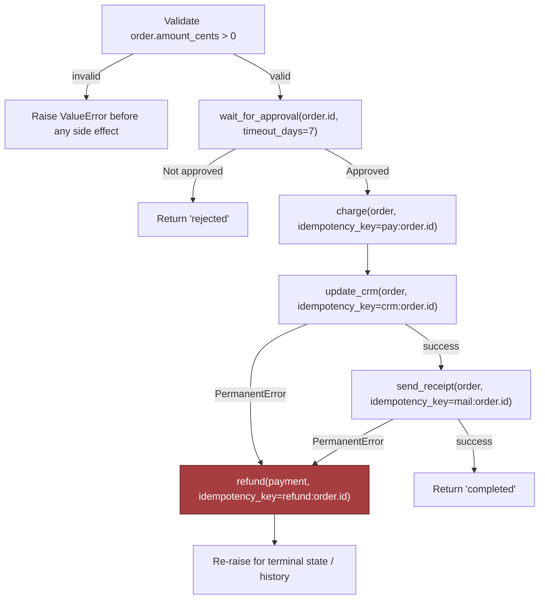

> 🎯 **Interview Pointer:** Be ready to explain the idempotency-key granularity choice explicitly: one key per side-effecting business action (`pay:`, `crm:`, `mail:`, `refund:`), not one key for the whole workflow — this is the detail that separates a whiteboard sketch from a production-credible answer.

### What the Whiteboard Version Omits on Purpose

- A real implementation needs concurrency control, versioning, and observability hooks the short snippet does not show:
  - **Optimistic concurrency**: `WorkflowInstance` updated with a version check so two workers cannot advance the same instance from stale state ("update where version = expected_version," then retry or abort if the row changed underneath you).
  - **Schema and contract versioning**: `definition_version` on the workflow instance lets old and new workflow definitions run side by side; a running instance continues on the version it started with unless an explicit migration policy exists.
  - **Idempotency at every write boundary**: not just payment — approval signals, CRM updates, email sends, and repair actions should all be replay-safe where possible.
  - **Observability**: every transition emits structured logs, trace spans, and metrics keyed by `instance_id`, step name, and outcome. History table = system of record; telemetry = fast diagnosis.
  - **Policy checks around model output**: if a workflow step uses an LLM to classify, summarize, or route work, its output should pass through typed validation and policy checks before it is allowed to change state or trigger an external action — the model may suggest, it should not silently decide.

### Tests That Make the Design Believable

- A contract test proves duplicate workflow starts do not create duplicate instances: send the same `POST /v1/workflows/{type}` request twice with the same idempotency key, assert the second response returns the original instance id rather than creating a new one.
- A failure-injection test targets the critical drill: worker crashes after payment succeeds. Simulate a crash after `charge(...)` returns but before CRM update completes. On restart, the workflow should read its history, see payment already happened, skip the duplicate charge, and resume from the next unfinished step. If CRM had already succeeded before the crash, the repair path should reconcile without re-running payment.

```python
import pytest


@pytest.mark.asyncio
async def test_start_workflow_is_idempotent(client):
    payload = {
        "workflow_type": "order_approval",
        "business_payload": {"order_id": "o-123", "amount_cents": 5000},
        "correlation_id": "corr-1",
    }
    headers = {"Idempotency-Key": "start:o-123"}

    first = await client.post("/v1/workflows/order_approval", json=payload, headers=headers)
    second = await client.post("/v1/workflows/order_approval", json=payload, headers=headers)

    assert first.status_code == 201
    assert second.status_code in (200, 201)
    assert second.json()["instance_id"] == first.json()["instance_id"]


@pytest.mark.asyncio
async def test_worker_crash_after_payment_does_not_double_charge(orchestrator, fake_activities):
    order = Order(id="o-123", amount_cents=5000, customer_email="a@example.com")
    approval = lambda order_id, timeout_days: True

    async def crash_after_charge(*args, **kwargs):
        return PaymentReceipt(idempotency_key="pay:o-123", external_ref="payref-1", status="captured")

    fake_activities.charge.side_effect = crash_after_charge
    fake_activities.update_crm.side_effect = PermanentError("crm unavailable")

    with pytest.raises(PermanentError):
        await order_workflow(order, fake_activities, approval)

    # On replay, the orchestrator should consult history/receipts and not charge again.
    await orchestrator.replay_from_history(order.id)
    assert fake_activities.charge.await_count == 1
    assert fake_activities.refund.await_count == 1
```

- These tests do two useful things: prove the API contract is actually idempotent (not merely described that way), and demonstrate the failure drill that matters most in this chapter — a worker crash after payment succeeds should not create a double charge on resume.

### Why This Answer Sounds Credible in an Interview

- Vague answer: "We will make it reliable with retries."
- Credible answer: the orchestrator owns workflow state, every side effect has an idempotency key, every state transition is versioned, every replay is history-driven, and compensation is explicit.
- Once those pieces are concrete, the rest of the system becomes explainable instead of mystical — that's the difference between describing an orchestration system and actually being able to build one.

## 6. Security, Reliability, and Failure Handling

### The Uncomfortable Question That Anchors This Section

- A security leader, an operations lead, and a customer admin join the design review and immediately force the uncomfortable question: what happens if the worker crashes after payment succeeds?
- This single injected failure is more useful than a dozen happy-path questions — it exposes the real system boundaries.
- The orchestration layer guards money movement, approval state, customer communications, and downstream integrations against partial completion, replay, operator error, and malicious access. If the design cannot survive that drill, it is not a workflow system yet — it is a best-effort script with a database.

### Threat Model Before Failure Policy

- Four security controls anchor the design:
  - **Authorize starts, signals, and repairs at the correct strength.** Starting a workflow should require the same or stronger permission than reading the customer object it will touch. Signals (approval, rejection, resubmission, cancellation, override) should be authenticated, scoped to the correct tenant and workflow instance, and validated against the current state machine. Repair actions deserve tighter control because they can bypass the ordinary sequence and alter the business effect after the fact.
  - **Keep secrets out of history.** Workflow history is the system's memory and an attack surface — any token, API key, password, or full payment artifact in history can be replayed, exported, or exposed to operators who only need state, not credentials. Safe pattern: store opaque references in history, fetch short-lived secrets from a secret manager or KMS-backed vault at execution time, with minimal scope and explicit expiration.
  - **Restrict operator mutation paths.** Operators should pause, inspect, and resume — not rewrite arbitrary state transitions or silently mark money as collected. Manual mutation should go through a narrow repair API with validation, version checks, and approval logging. Defense in depth: authenticated admin access, role-based checks, immutable audit logs, and state-machine rules all defend the same boundary from different angles.
  - **Audit every compensation and manual override.** If a payment is reversed, a document approval is voided, or a CRM record is repaired manually, the system should preserve who initiated it, why, what instance it affected, and which state version it targeted — that evidence makes the post-incident review useful instead of speculative.

### Failure Policies Are Design Decisions, Not Afterthoughts

- The interview answer should explicitly name what fails open, fails closed, degrades, queues, or requires human intervention — that vocabulary itself shows judgment.
- Decision table for common branches:
  - **Fail closed**: payment authorization, approval completion, repair mutations, and anything that would create a false business effect.
  - **Degrade**: email sending can degrade to queued delivery or delayed notification if the customer accepts eventual delivery.
  - **Queue**: CRM sync, internal analytics updates, and noncritical enrichment can queue behind transient outages.
  - **Human intervention**: ambiguous approvals, repeated poison-message failures, and policy exceptions that cannot be resolved safely by code.
  - **Fail open only with extreme caution**: rarely, for read-only status display; never for irreversible external side effects.
- Blast radius as a practical control: scope every retry queue, dead-letter stream, and repair lane by tenant, region, workflow type, and dependency — a stuck CRM connector should not prevent unrelated tenants from approving documents, and a regional outage should not silently cross region boundaries unless the customer contract and data policy explicitly allow it.

### Failure Drill: Worker Crashes After Payment Succeeds

- **Detection**: lease timeout, heartbeat loss, or orchestrator timeout.
- **Containment**: do not reissue the charge.
- **Recovery**: replay the workflow history, observe the charge step completed, continue from the next unfinished step.
- **Prevention**: idempotency keys on the payment request, durable history that records intent before execution and completion after acknowledgment.
- This is the critical incident drill — security and operations inject the crash, and the candidate must show how the system contains impact and preserves evidence rather than scrambling to "make it work."

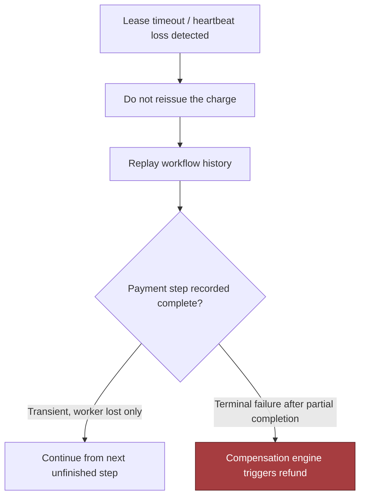

> 🎯 **Interview Pointer:** When asked "what happens if the worker crashes after payment succeeds," anchor the answer on one sentence: the workflow must never equate "worker lost" with "business action lost" — detection, containment, recovery, and prevention should each reference durable history, not worker memory.

### Failure Drill: Email Succeeds but CRM Fails

- **Detection**: separate side effects by step, not by job — the email worker can report success while the CRM update times out or returns a permanent error.
- **Containment**: the workflow proceeds into a compensating or repairable state instead of pretending the whole process succeeded.
- **Recovery**: an idempotent retry to the CRM, a dead-letter handoff, or a manual reconciliation task if the CRM record requires human validation.
- **Prevention**: per-step status, explicit correlation IDs, and a policy treating notifications as non-authoritative compared with workflow state.

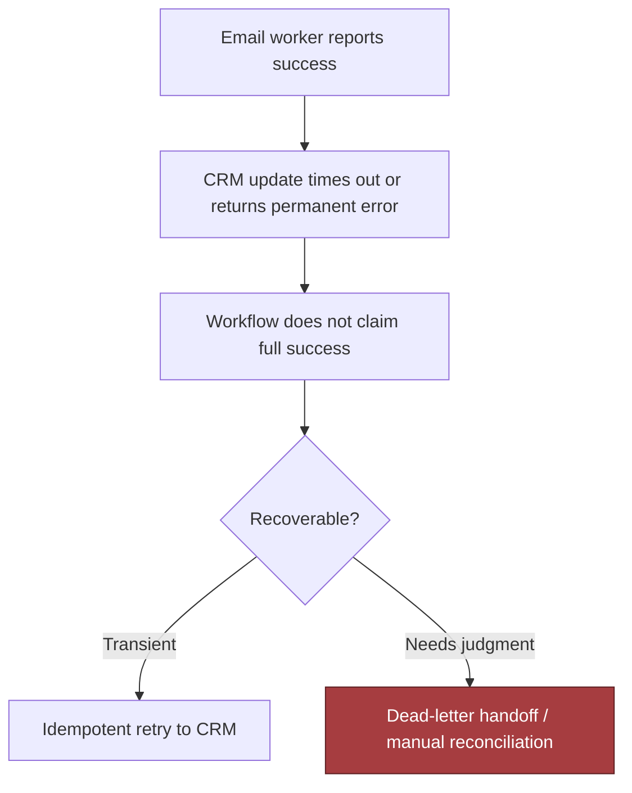

### Failure Drill: Approval Waits Seven Days

- Long waits are normal in orchestration — the system needs durable timers, visible state, and stale-instance handling.
- **Detection**: not a failure alarm — a timeout threshold that surfaces an instance to the right queue.
- **Containment**: avoid consuming worker capacity with endless polling.
- **Recovery**: resending reminders, escalating to a manager, or expiring the request according to policy.
- **Prevention/design intent**: the workflow expresses waiting as a first-class state, not an ad hoc sleep loop.

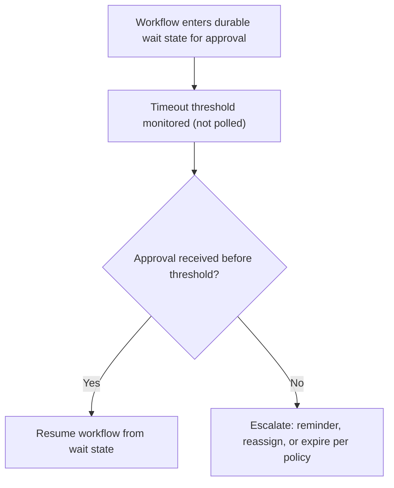

### Failure Drill: Definition Changes While Instances Run

- This is a versioning problem, not just a deployment problem.
- **Detection**: runtime observes a definition hash or version mismatch.
- **Containment**: old instances continue against the version they started with, unless an explicit migration path exists.
- **Recovery**: forward compatibility through versioned step routing, or a controlled migration with audit and testing.
- **Prevention**: every durable instance records its definition version; every new deployment publishes a compatible contract or an intentional break.

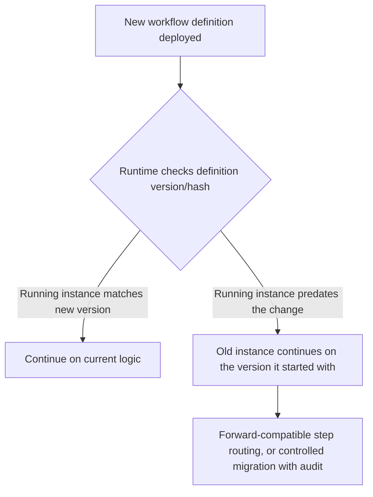

### Failure Drill: External API Times Out Indefinitely

- The system needs bounded timeouts, retries with backoff, a circuit breaker, and a dead-letter or escalation path.
- **Detection**: absence of progress within a known bound.
- **Containment**: stop hammering the dependency and protect the worker pool.
- **Recovery**: scheduled retry, fallback queue, or human intervention if the downstream system is in a prolonged outage.
- **Prevention**: make every dependency call time-bounded and distinguish transient from permanent failures in the orchestration policy.

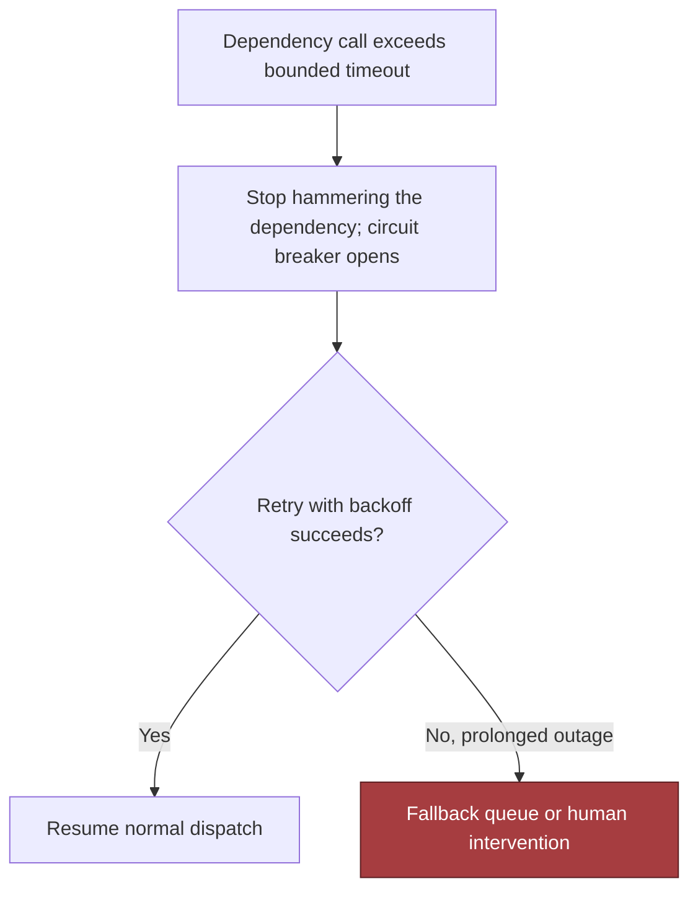

### Evidence the Interviewers Want to Hear

- Before launch, be ready to describe audit evidence and runbooks: who can start a workflow, how a repair is requested and approved, where compensation logs are stored, how a replay is explained to support, and how to prove a payment was not duplicated after a crash.
- Evidence should be searchable by tenant and workflow id, with retention aligned to the customer's policy and jurisdictional constraints.
- Observability: trace every transition with correlation ids; emit counters for retries, compensations, dead-letter items, and manual overrides; alert on divergence between requested, completed, and compensated steps.
- Goal is not merely knowing something is broken, but knowing which tenant, which dependency, and which failure policy is currently absorbing the blast.

### Interview-Sized Code Sketch: No-Double-Charge Invariant

- Narrow, important test: after a crash at the worst possible moment, replay must not duplicate an irreversible side effect.
- Interview-scale teaching sketch — omits persistence details, dependency wiring, and the full workflow engine; production would back the event log with durable storage, add validation, and pin library versions.

```python
import pytest


class FakePayments:
    def __init__(self):
        self._charges = {}

    def charge(self, order_id: str) -> str:
        self._charges[order_id] = self._charges.get(order_id, 0) + 1
        return f"charge-{order_id}"

    def charge_count(self, order_id: str) -> int:
        return self._charges.get(order_id, 0)


class CrashAfterCharge(Exception):
    pass


class WorkflowEngine:
    def __init__(self, payments: FakePayments):
        self.payments = payments
        self.history = []
        self.completed = set()

    async def run_until_crash(self, order_id: str, crash_after: str | None = None):
        if "charge" not in self.completed:
            self.history.append(("intent", "charge", order_id))
            self.payments.charge(order_id)
            self.history.append(("done", "charge", order_id))
            self.completed.add("charge")
            if crash_after == "charge":
                raise CrashAfterCharge()

    async def resume_workflow(self, order_id: str):
        if "charge" not in self.completed:
            self.history.append(("resume", "charge", order_id))
            self.payments.charge(order_id)
            self.history.append(("done", "charge", order_id))
            self.completed.add("charge")
        self.history.append(("next", "crm", order_id))


@pytest.mark.asyncio
async def test_crash_after_payment_does_not_charge_twice():
    payments = FakePayments()
    engine = WorkflowEngine(payments)
    order_id = "order-123"

    with pytest.raises(CrashAfterCharge):
        await engine.run_until_crash(order_id, crash_after="charge")

    await engine.resume_workflow(order_id)
    assert payments.charge_count(order_id) == 1
```

- Teaching purpose: the workflow must record enough state to distinguish "attempted" from "completed," and recovery must read that state before deciding whether to reissue the side effect.
- Production version would add argument validation, persistence, structured logging, timeout handling, and an explicit idempotency key carried into the payment gateway request.

### What to Say When the Interviewer Pushes on Trade-offs

- If the customer demands faster recovery → automate more compensations, but raise the risk of an incorrect automated undo.
- If the business demands stronger correctness → fail closed more often, but increase queue depth and human workload.
- If the platform must support many tenants → need sharper blast-radius boundaries and tighter operator permissions.
- These are not side notes — they are the architecture.
- Production judgment signal: an FDE owns safe rollout, support, and incident response, not merely the happy path. A strong answer protects the customer's business effect, preserves evidence for the postmortem, and still moves the workflow forward without duplicating irreversible actions.

## 7. Delivery Plan, Observability, and Business Impact

### Start with One Workflow, Not the Whole Platform

- The prototype already works — the customer's next question is: when can this be trusted in production? Design discussion becomes a delivery plan with measurable gates, clear owners, and a path to support.
- First production step: model one workflow explicitly — e.g., document approval followed by payment, then email, then three internal updates.
- That narrow slice proves whether the system can preserve business effect across retries, pauses, and crashes, and keeps the first rollout small enough that the team can reason about every state transition.
- Goal is not feature breadth — it's learning: verify the workflow definition is stable, the state model is inspectable, and the team can explain what happens when a worker dies halfway through a charged-but-not-yet-emailed order.
- Naming that first workflow shows understanding of MVP and staged rollout rather than a risky big-bang launch.

### Determinism and Crash Recovery as the First Gate

- Before expanding traffic, test replay determinism and crashes:
  - Re-run the same workflow history and confirm it produces the same decisions.
  - Kill workers mid-flight, restart them, confirm the engine resumes from durable state instead of reissuing side effects blindly.
- This is the first real go/no-go gate because it proves whether the orchestration logic can survive the failures that matter most.
- Useful framing: "I do not promote the system until we can replay a workflow from history, recover after a worker crash, and prove we do not duplicate irreversible effects."

> 🎯 **Interview Pointer:** Naming deterministic replay + crash recovery as the *first* go/no-go gate (before operator visibility, before broader rollout) is the sequencing detail that distinguishes a mature delivery plan from a generic "we'll add monitoring" answer.

### Operator Visibility Before Broadening Scope

- Once deterministic recovery works, add operator visibility: dashboards, logs, traces, admin views that let support staff answer three questions fast — what is running, what is stuck, what needs intervention.
- Visibility is not decoration — it's the difference between a supportable workflow platform and a system that silently accumulates broken work.
- Practical rule: surface both workflow-level state (business status language: pending approval, payment authorized, compensation pending, completed) and activity-level telemetry (retries, queue depth, worker failures, timeout counts, downstream latency), linked so a user complaint traces to the exact failing step.

### Version Workflows Instead of Mutating Them

- Migrate workflows by version rather than editing old executions in place — in-flight workflows may sit idle for days waiting on approval, human review, or an external system; mutating their logic underneath them creates inconsistent behavior between old and new instances.
- Versioning keeps the operating model understandable: old runs continue under the rules they started with, new runs pick up new logic, and operators know which history to inspect during an incident.
- This is where the customer starts to trust the platform, because the change process itself becomes predictable.

### Rollout Scorecard: Six Metric Layers

- A strong FDE answer does not collapse every metric into "system is up" — the scorecard has six distinct layers.

**Technical health metrics**

- **Workflow completion time**: how long a workflow takes from start to terminal state; source is orchestration history and timer data; owner is the platform team; alert if p95 or a customer-specific threshold drifts materially above baseline.
- **Activity retry rate**: retries divided by activity attempts; source is worker and scheduler telemetry; owner is the worker-runtime owner; alert if retries spike or stay elevated across a rolling window.
- **Stuck workflow age**: oldest workflow in a non-terminal state beyond its expected wait time; source is durable state and queue inspection; owner is operations; alert if any workflow exceeds the maximum tolerated age.

**Model quality metrics** (correctness and stability of the orchestration model itself — whether the workflow definition, replay behavior, and state transitions stay faithful to intended business logic)

- **Replay determinism pass rate**: percentage of sampled workflow histories that replay to the same decisions; source is replay test jobs and history validation; owner is workflow-runtime engineering; alert if the pass rate falls below the release gate, since nondeterminism can invalidate the model.
- **State-transition validation failures**: count of invalid or unexpected transitions detected in tests, canaries, or runtime guards; source is workflow engine validation and canary telemetry; owner is the platform team; alert on any sustained increase, since it suggests the model or versioning rules have drifted.
- **Schema or definition compatibility failures**: count of workflow-definition changes that cannot be safely loaded by old or new runs; source is versioning checks and deployment validation; owner is release engineering; alert if compatibility breaks in staging or canary, since the workflow model must remain loadable across versions.

**Reliability and correctness metrics**

- **Duplicate effect count**: number of detected duplicate external effects (repeated payment attempts, duplicate emails); source is idempotency logs, downstream receipts, reconciliation jobs; owner is the workflow platform and integration owner; alert on any confirmed increase, since even a small number can matter.
- **Compensation rate**: percentage of workflows that reach a compensating action; source is workflow history; owner is product and operations jointly; alert if the rate rises unexpectedly, since it may signal a bad release or a fragile dependency.

**Operational burden metrics**

- **Manual repair count**: number of workflows that required human intervention; source is operator actions and ticket records; owner is support operations; alert if the count exceeds the team's handling capacity or trends upward release over release.

**Adoption metrics**

- Active workflows started by real customers, percentage of teams migrated, operator login frequency for the visibility tools. Matter because a technically elegant orchestration platform nobody trusts is not a successful product.

**Business outcome metrics**

- Fewer failed approvals, faster payment-to-email completion, fewer customer escalations, reduced cycle time for the end-to-end process. Interview distinction: technical health says the machine is behaving; business outcome says the customer is getting value.

### Phased Rollout: Owners, Exit Criteria, Rollback Triggers

- Each phase needs an explicit owner, exit criteria, and rollback trigger:
  1. **Model one workflow explicitly**
     - Owner: platform engineer with a product or customer-design partner.
     - Exit criteria: workflow definition is stable, state transitions are documented, and the business effect is clear.
     - Rollback trigger: if the first workflow cannot be represented cleanly or the customer disagrees on success criteria.
  2. **Test replay determinism and crashes**
     - Owner: platform engineering and QA or release engineering.
     - Exit criteria: crash-recovery tests pass, replay results are stable, and side effects are not duplicated in failure drills.
     - Rollback trigger: if any crash path replays an irreversible action without an idempotency safeguard.
  3. **Add operator visibility**
     - Owner: operations plus the orchestration team.
     - Exit criteria: operators can locate stuck work, explain state, and execute approved repairs using documented runbooks.
     - Rollback trigger: if the support team cannot diagnose incidents without engineering escalation.
  4. **Migrate workflows by version**
     - Owner: platform owner and release manager.
     - Exit criteria: old and new versions coexist safely, migration rules are documented, and in-flight work is not rewritten.
     - Rollback trigger: if a versioned migration produces inconsistent behavior or blocks recovery.
- The shape of a real go/no-go gate is not "does it compile?" — it's "can support operate it, can rollback be executed, and can the customer tolerate the residual risk?"

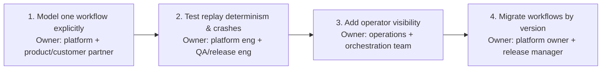

### Connect the Dashboard to the User Journey

- A useful dashboard lets a non-expert follow the business story left to right: request arrives, approval pending, payment authorized, internal systems updated, email sent, workflow closes.
- Under each user-facing status, show relevant component telemetry: retries, latency, queue age, compensation state.
- This shortens incident triage (support sees where the story diverged) and proves to the customer the platform is not a black box — visibility becomes part of the value proposition, not just an operational aid.

### Core Product vs Adapter vs Configuration vs Shared Service

- Not everything belongs in the core orchestration engine:
  - **Core product**: durable workflow state, retry policy, compensation orchestration, replay, versioning, and operator visibility primitives — the reusable behaviors the platform should own.
  - **Adapters**: payment gateway calls, email providers, document systems, and the three internal systems — isolated behind interfaces because they vary by customer and environment.
  - **Configuration**: retry budgets, timeout windows, approval routing rules, escalation thresholds, per-tenant visibility settings — change more often than code and should be adjustable safely.
  - **Shared services**: identity, audit logging, metrics export, and notification plumbing, if the organization already standardizes them — reduces duplication, but only when the team can preserve ownership boundaries and support expectations.
- This breakdown shows product judgment: the goal is not to overbuild a custom workflow system for one customer, but to extract reusable product leverage from the pilot.

### Train Operators Before the First Wide Rollout

- Production readiness includes training and documentation.
- Support staff need a runbook for common failure modes: worker crash after payment, external timeout during approval, duplicate callback from an upstream system, workflow stuck waiting for a human response.
- Documentation should show how to read state, how to escalate, and which compensations are safe to trigger manually.
- Training should be scenario-based, not slide-based: walk the operator through a stuck workflow, a successful replay, and a rollback decision. If they cannot explain the workflow using the dashboard and runbook, the system is not ready for broad adoption.

### The Risk Register Should Be Owned, Not Implied

- A concise risk register keeps the rollout honest — each item names owner, mitigation, and trigger:
  - **Worker crash after payment succeeds**: owner platform engineering; mitigation idempotency keys, durable state, replay tests; trigger any payment event without a terminal workflow record.
  - **Replay nondeterminism**: owner workflow-runtime team; mitigation deterministic APIs and history-based replay tests; trigger any mismatch between replayed and recorded decisions.
  - **Operator overload**: owner operations; mitigation dashboards, runbooks, and alert tuning; trigger rising manual repair count.
  - **Version migration error**: owner release manager; mitigation version gating and canary rollout; trigger inconsistent outcomes between old and new workflow runs.
- This is not bureaucracy — it's the mechanism that turns a technical design into a supportable service.
- Strong rollout story: first prove one workflow end to end, then verify replay and crash recovery, then give operators visibility, then migrate by version with a canary and rollback plan; watch completion time, retry rate, stuck age, duplicate effects, compensation rate, and manual repairs at each step. Do not declare success until the customer uses it, the business process improves, and the support team can run it without heroics.
- Measurable customer impact: a workflow platform that completes long-running business processes with visible state, controlled recovery, and fewer manual interventions, so approval, payment, email, and internal updates can be operated as a reliable service rather than a sequence of fragile one-off scripts.

## 8. Interview Walkthrough, Trade-Offs, and Practice

### Minute-Zero Opening: Lead with the Business Effect

- Talk like an FDE already helping a customer survive production pressure, not a candidate reciting patterns — open with the outcome, name the riskiest assumptions early, keep redirecting toward business effect, failure recovery, and operator control.
- Model opening: "We need to coordinate document approval, payment, email, and three internal systems when any step may fail or wait for days. My design goal is to execute long-running business processes exactly once at the business-effect level with visible state and compensation. I'll first clarify what exactly counts as a successful business effect, then size the workflow volume, then propose the orchestration model, storage, and recovery strategy, and finally I'll cover failure handling, security, and rollout."
- Does four things at once: shows understanding of customer outcome, frames the design around business effect rather than raw task execution, signals a structured interview plan, invites the interviewer to redirect if their environment has a different constraint.

### A Practical 50-Minute Answer Plan

- Use time in proportion to risk, not diagram size:
  - **0–5 min: discovery and assumptions.** Ask what counts as a completed workflow, which steps are human vs. automated, whether approval can take hours or days, which systems are authoritative for state. State assumptions out loud and invite correction.
  - **5–10 min: scope and scale.** Estimate active workflows, average duration, peak concurrent instances, write amplification from history and retries. Decide whether the design needs a simple queue-based engine or a more durable workflow service.
  - **10–20 min: architecture.** Draw the orchestration boundary, workflow state store, worker pool, idempotent activity executors, compensation handlers, external systems. Explain why the orchestrator owns sequencing and durable state while workers do side effects.
  - **20–28 min: failure modes.** Walk worker crash after payment, timeout during approval, duplicate webhook delivery, partial completion across internal systems. Explain how event history, retry policy, idempotency keys, and compensation/escalation prevent duplicate business effects.
  - **28–35 min: security and controls.** Cover identity propagation, least privilege, secrets handling, audit logs, data retention, redaction/minimization. Tie each control to a failure mode or compliance need.
  - **35–42 min: product and operational leverage.** Explain observability, operator dashboards, stuck-workflow handling, versioning for in-flight workflows. Show how the platform can support multiple business processes instead of becoming a one-off script factory.
  - **42–47 min: trade-offs and alternatives.** Compare orchestrated saga vs. choreography, history size vs. debuggability, automatic compensation vs. human review, workflow code vs. declarative definitions.
  - **47–50 min: close with a concise executive summary.** Restate the customer outcome, the architecture, the biggest trade-off, and the rollout gate.


### Keeping the Conversation at the Right Depth

- A common failure mode: spending too long on the diagram, too little on the fragile edges.
- Right depth is proportional to the risk profile:
  - If approval can sit for a week → long-term state and versioning matter more than latency micro-optimizations.
  - If payment is irreversible → idempotency and compensation matter more than fancy orchestration syntax.
  - If multiple internal systems are eventually consistent → event ordering and reconciliation matter more than the exact queue choice.
- Make assumptions and invite the interviewer to redirect, e.g.:
  - "I'm assuming the workflow engine can persist a step-level history and resume after crashes; if you want a simpler build-versus-buy framing, I can compare that too."
  - "I'm assuming at-least-once delivery to workers, so I'll design every effecting action to be idempotent."
  - "I'm assuming the business wants visible state and auditability, so I'll keep the orchestrator as the source of truth for progress."
- This shows you are choosing the smallest design that remains safe under plausible growth and failure modes, not overengineering for every imaginable future.

### Trade-off Framing to Defend

- **Orchestrated saga vs. choreography.**
  - Orchestrated saga: single control plane owns state transitions, retries, compensation, and visibility — better fit for long-lived, audit-heavy processes that must survive worker crashes and manual intervention. Downside: a central dependency that must be highly available and carefully versioned.
  - Choreography: distributes responsibility across services via events — can reduce central coupling and make service ownership feel cleaner, but it becomes harder to answer "where is this workflow now?" or "why did it stop?" and cross-service compensation/human review get harder to reason about.
  - Verdict: choreography can be attractive for small event-driven ecosystems, but once the customer asks for visible state, controlled retries, and supportable recovery, orchestration becomes easier to operate.
- **History size vs. debuggability.**
  - Storing every transition/input/output/retry makes debugging easier (replay the decision path, inspect the exact failure point) but costs storage growth, larger reads, and more care around redaction.
  - Trimming history lowers overhead but loses the forensic trail operators and support need.
  - Verdict: "store enough to replay and explain decisions, compress or summarize older segments when safe, and retain the audit trail according to customer policy" — not "store everything forever."
- **Automatic compensation vs. human review.**
  - Automatic compensation is powerful when the reversal is deterministic and safe: cancel a reservation, void a pending authorization, mark a record as failed, send a compensating notification.
  - Weaker when the side effect is irreversible, ambiguous, or regulated — human review queue may be the right fallback.
  - Trade-off is speed vs. correctness: full automation reduces latency and manual work but can amplify a mistaken decision; human review slows the process but may be required across legal, financial, or high-risk operational boundaries.
- **Workflow code vs. declarative definitions.**
  - Code gives expressive branching, reusable helper logic, and complex compensation flows — downside: versioning complexity and test burden.
  - Declarative definitions are easier to inspect/validate and understandable by non-engineers — downside: can become too constrained for real enterprise branching.
  - Balanced position: expose a declarative model for common structure, but allow code for business-specific logic where necessary.

> 🎯 **Interview Pointer:** "Orchestration vs. choreography" is the single trade-off most likely to be pressure-tested with a direct challenge ("why not just choreograph everything through events?") — have the one-line verdict ready: choreography reduces coupling but loses "where is this workflow now?", which is disqualifying once the customer needs visible state and supportable recovery.

### Follow-up Drills and Strong Answers

- **"What if payment succeeds and the worker dies?"** Business effect must be protected by idempotency and durable workflow state, not by hoping the worker stays alive. If payment succeeded but the worker crashed before recording completion, the orchestrator replays the workflow, detects the payment step already committed, and either continues from persisted state or verifies with the payment provider by idempotency key/transaction reference. The system should never make a second irreversible payment just because the worker restarted. The worker may die; the workflow must not forget what happened.
- **"How do you change code for running workflows?"** Never "we redeploy and hope." Running workflows need versioning semantics: keep workflow definitions backward compatible, or bind each new instance to a versioned definition while existing instances continue with the logic they started with. If a change must affect in-flight workflows, use an explicit migration path, compatibility layer, or controlled cutover policy. Mention the operational workflow: test the new version on fresh instances, canary the change, verify outcomes, then expand.
- **"What is the idempotency boundary?"** Each side-effecting business action, not the entire workflow — one idempotency key per externally visible effect (submit payment, send email, write to an internal system, post an approval record). The boundary should align with the external system's own ability to duplicate harm: payment (irreversible) gets the strictest discipline; email (notification) needs duplicate suppression but is less strict.
- **"How do you handle a week-long approval?"** Treat approval as a durable waiting state, not an active thread — persist state, emit a reminder/SLA timer if needed, resume when the approval event arrives. If overdue, escalate, reassign, or enter a manual review lane. Never rely on in-memory timers or worker leases for this class of wait.

### Common Weak Answers and How to Repair Them

- "I'd just retry until it works." → Distinguish transient from permanent failures, add limits, backoff, and an explicit dead-letter or human escalation path.
- "The worker can keep the state in memory." → Long-running workflows need durable state because workers crash, deploy, and scale.
- "We can always compensate later." → Not every effect is reversible; name the irreversible steps and define the fallback.
- "Choreography is more scalable." → Scalability alone is not enough; discuss observability, recovery, and supportability.
- "One generic retry policy is enough." → Payment, approval, and email deserve different retry and alerting behavior.
- "We'll change the code and restart everything." → Version running workflows and preserve compatibility for in-flight instances.

### Scoring Rubric for Self-Evaluation

- **Discovery**: Did they ask what "done" means, which steps are human, and which effects are irreversible?
- **Estimation**: Did they size concurrency, duration, and retry pressure realistically, even if only with illustrative numbers?
- **Architecture**: Did they explain control flow, durable state, worker behavior, and external integrations cleanly?
- **Depth**: Did they spend more time on crash recovery, idempotency, and versioning than on box drawing?
- **Security**: Did they mention least privilege, secrets, auditability, and data minimization?
- **Delivery**: Did they discuss rollout, operator tooling, and support handoff?
- **Communication**: Did they structure the answer, make assumptions explicit, and end with an executive summary?
- A strong answer is structured, quantitative where it matters, safe in how it handles side effects, explicit about trade-offs, and always tied back to the customer outcome.

### A 90-Second Architecture Summary

- Closing summary you can deliver at minute 50: "The system should use a durable workflow orchestrator as the source of truth for progress, with each business effect isolated behind an idempotent step. The orchestrator persists state and event history so it can survive worker crashes, wait for long approvals, and resume without duplicating irreversible actions like payment. Human review is reserved for cases where compensation is unsafe or ambiguous. I would keep the workflow model versioned so running instances continue safely, and I'd prioritize observability and operator tooling so support can answer where each workflow is blocked. The riskiest trade-off is between orchestration and choreography: choreography is simpler across services, but orchestration is far easier to debug, recover, and support when the process is long-lived and customer-facing. My first rollout gate would be one end-to-end workflow with replay, crash recovery, and visible state proven in production-like conditions before broad adoption."
- This is itself a reusable artifact: durable orchestrator as source of truth, idempotent steps, crash/long-wait survival without duplicating irreversible actions, human review reserved for unsafe/ambiguous compensation, versioned model, observability/operator tooling prioritized, riskiest trade-off named explicitly with the first rollout gate stated.

### Practice Loop: Solo, Pair, Implementation

- **Solo exercise**: rehearse the 50-minute plan aloud and answer the four follow-ups without notes — payment crash, version change, idempotency boundary, week-long approval.
- **Pair mock**: have a partner interrupt with "Why not just choreograph everything through events?" and defend the orchestrated approach without repeating the same sentence twice.
- **Implementation exercise**: sketch the workflow state model on paper and walk through a crash at the exact moment after payment succeeds but before the state is acknowledged — explain step by step how the system detects completion and prevents a duplicate effect.
- If you can deliver that answer calmly, you are showing that you can own a customer's long-running business process in production and explain, without hand-waving, how it stays trustworthy when reality breaks the happy path.

## Coverage Notes

This tutorial was self-reviewed against the fixed 20-item decomposition rubric across two passes. The second pass closed gaps in unit-economics framing (cost SLI and cost-per-workflow language) and in explicit regulatory/compliance breadth.

**Phase 1 — Problem Framing & Discovery**
- **Item 1 (Feature → business-outcome reframing):** Fully covered — Section 1 outcome-first restatement.
- **Item 2 (Stakeholder/persona mapping):** Fully covered — Section 1 stakeholder map, jobs-to-be-done.
- **Item 3 (Clarifying questions that change architecture):** Fully covered — Section 2 question tree.
- **Item 4 (Requirements split + prioritization):** Fully covered — Section 2 must/should/could, functional vs nonfunctional.
- **Item 5 (Explicit non-goals/scope fence):** Fully covered — Section 2 "What the MVP Will Not Support."

**Phase 2 — Estimation & Architecture**
- **Item 6 (Back-of-envelope scale & capacity math):** Fully covered — Section 3 workflow/activity/storage/throughput estimates.
- **Item 7 (Unit economics/cost-driver breakdown):** Partial — cost treated as one of six scorecard SLIs, no worked infra cost-per-workflow calculation.
- **Item 8 (End-to-end architecture & data flow):** Fully covered — Section 4 component map, trust boundaries, sequence diagrams.
- **Item 9 (Data model & API contracts):** Fully covered — Section 5 four core records, four API endpoints.
- **Item 10 (Build-vs-buy/vendor & model-selection trade-offs):** Absent — only a passing aside in Section 8's follow-up drills, not developed.

**Phase 3 — Trade-offs, Security & Reliability**
- **Item 11 (Named trade-off pairs with balanced verdict):** Fully covered — Section 8, four trade-off pairs.
- **Item 12 (Threat model/security controls):** Fully covered — Section 6, four security controls.
- **Item 13 (Failure-mode & reliability drills):** Fully covered — Section 6, five named drills with detect/contain/recover/prevent.
- **Item 14 (Testing strategy):** Fully covered — Sections 5 and 6, idempotency contract test and crash-replay failure-injection test.

**Phase 4 — Delivery, Governance & Communication**
- **Item 15 (Layered evaluation metrics & observability):** Fully covered — Section 7, six-layer scorecard.
- **Item 16 (Phased rollout/risk register/rollback gates):** Fully covered — Section 7, four-phase plan with owner/exit-criteria/rollback-trigger, plus risk register.
- **Item 17 (Regulatory/governance depth):** Partial — audit evidence, retention, residency/data-minimization covered; no named external regulatory framework (SOX, GDPR, etc.).
- **Item 18 (Responsible-AI/risk framing beyond obvious failure mode):** Partial — one aside on LLM-step policy checks in Section 5, not a developed theme.
- **Item 19 (Change-management/adoption narrative):** Fully covered — Section 7, operator training, adoption metrics, versioned migration.
- **Item 20 (Structured communication plan + self-scoring rubric):** Fully covered — Section 8, 50-minute plan, scoring rubric, 90-second summary, practice loop.

**Overall**: 16/20 items fully covered, 3 partial (unit economics, regulatory/governance depth, responsible-AI framing), 1 absent (build-vs-buy/vendor trade-offs). These gaps reflect the source chapter's own emphasis — a deep dive on durable execution, idempotency, and crash recovery for a workflow orchestrator, not a cost-modeling or compliance-framework chapter — and the tutorial does not fabricate content the source does not support.

### My Perspective on the Gaps

*The following is supplementary perspective from this reformatting pass — not sourced from the original chapter. It is offered as one way to address each gap live in an interview, grounded in this chapter's own architecture.*

**Item 7 — Unit economics / cost-driver breakdown (Partial).**
- I'd build a rough cost-per-workflow number directly from components this chapter already named: `HistoryEvent` storage (Section 5) at the base-case ~400GB raw (Section 3) costs a few dollars per month before replication — cheap relative to the "manual repair count" line already in the scorecard (Section 7).
- The real cost driver in this system is very likely operator time, not infrastructure: `cost per workflow ≈ infra marginal cost + (manual repair rate × loaded operator cost per incident)`.
- That formula ties directly to the compensation-rate and manual-repair-count SLIs the chapter already tracks, so I would present it as "we already have the inputs to compute this, we just haven't multiplied them yet" rather than inventing a new metric.

**Item 10 — Build vs. buy / vendor and model-selection trade-offs (Absent).**
- I would say explicitly: the durable-execution core (state machine, history store, replay engine) is the kind of infrastructure a managed durable-execution product already solves well, so "buy the execution runtime, build the workflow definitions and activities" is a defensible default for most teams.
- Reserve build effort for what's genuinely differentiated: the compensation policy per business action (Section 6's fail-closed/degrade/queue/human-intervention table), the idempotency-key boundary choices (Section 5), and the domain-specific saga logic (the `order_workflow` function itself).
- General heuristic to say out loud: buy commodity execution infrastructure that a vendor is accountable for keeping durable and available; build only the business-specific state machine and policy layer that no vendor can define correctly on your behalf.

**Item 17 — Regulatory / governance depth (Partial).**
- I'd name concrete frameworks the interviewer is likely probing for, each tied to a component this chapter already built: PCI-DSS scope reduction if the orchestrator ever touches card data (push that to the payment gateway and keep only opaque references, consistent with Section 6's "keep secrets out of history" control).
- SOX-style controls if approval is a financial authorization step — the `ActivityReceipt` record and audit-log fields from Section 5 already give the evidentiary trail a SOX auditor would ask for.
- GDPR/data-minimization if any internal system touches customer PII — the retention policy on `HistoryEvent` (Section 5) is the natural enforcement point, so I'd frame governance as "policy applied to records we already have," not a separate workstream.

**Item 18 — Responsible-AI / risk framing beyond the obvious failure mode (Partial).**
- The chapter's only AI-adjacent point is that LLM-driven steps need "typed validation and policy checks" before changing state (Section 5). I'd extend that concretely: an LLM misclassifying or mis-routing an approval could silently auto-approve something that should have gone to a human — an irreversible business effect exactly like the ones Section 6's failure-policy table already says to fail closed on.
- So the responsible-AI framing bolts directly onto the existing decision table rather than needing a new framework: any model output that could trigger payment, approval completion, or repair mutations gets treated as untrusted input, gated behind the same human-review lane the chapter already reserves for irreversible or ambiguous compensation.
