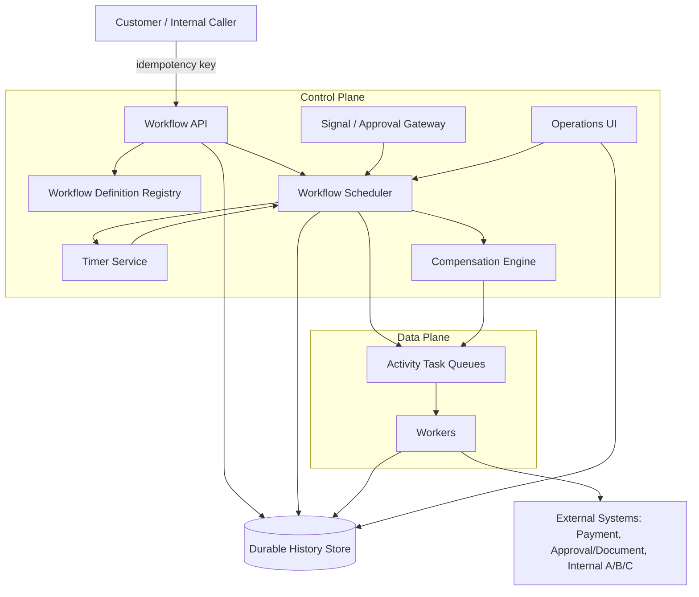
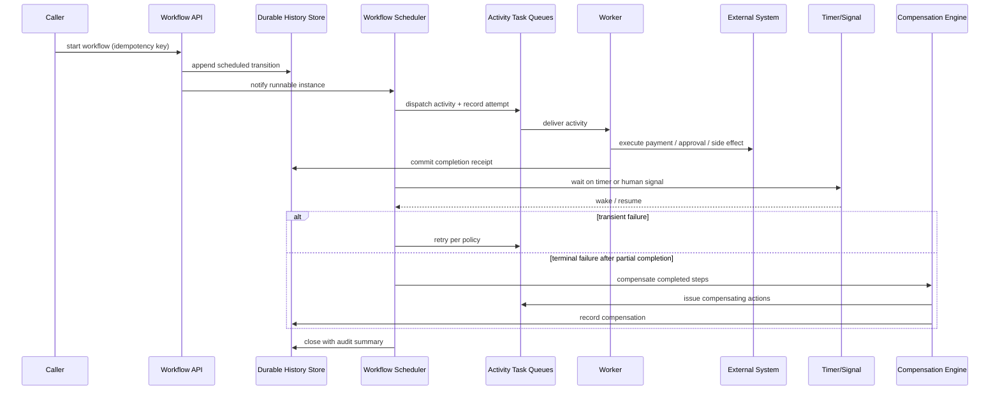
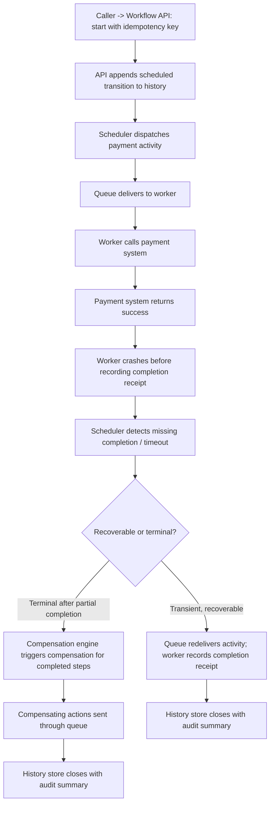

# Chapter 13: Design a Reliable Workflow Orchestration System

*Source: THE FORWARD DEPLOYED ENGINEER SYSTEM DESIGN INTERVIEW: 20 REAL-WORLD AI SYSTEM DESIGN INTERVIEWS — Chapter 13*

## 1. The Customer Problem and Discovery

**Key Points**

- The customer prompt is deceptively simple: coordinate document approval, payment, email, and three internal systems when any step may fail or wait for days.
- Different stakeholders want different things — the business sponsor wants the process to "just finish," operations wants retries/visibility/rollback hooks, application developers want to avoid a brittle point-to-point chain, and auditors want evidence of who approved what, when, and under which controls.
- The first move is not technology — it's restating the problem in one sentence without committing to a product shape.
- An outcome-first restatement ("execute long-running business processes exactly once at the business-effect level, with visible state and compensation when a step fails") immediately implies idempotency, durable state, retries, human approval pauses, auditability, and compensating actions.
- The stakeholder map should be built around jobs-to-be-done, not roles: each group values a different form of reliability, and treating them as the same optimizes the wrong part of the system.
- An assumption ledger — recording what you believe is true, why it matters, how you'd verify it, and who owns the follow-up — keeps discovery honest and converts ambiguity into documented assumptions rather than silent design decisions.

### From feature request to customer outcome

You walk into the customer meeting with a deceptively simple prompt on the whiteboard: coordinate document approval, payment, email, and three internal systems when any step may fail or wait for days. The room immediately splits into camps. The business sponsor wants the process to "just finish." The operations lead wants retries, visibility, and rollback hooks. The application team wants to avoid building a brittle chain of point-to-point integrations. The auditor wants evidence of who approved what, when, and under which controls. Everyone agrees on the feature request; nobody agrees yet on the workflow, the risk, or what success should mean.

Your first move is not technology. It is to restate the problem in one sentence without committing to a product shape: design a system that runs long-lived business workflows across humans and internal services, preserves visible state, survives failures and pauses, and leaves the business outcome correct even when individual steps are retried or compensated.

### What changes the conversation

The difference between a weak answer and a strong one is whether you talk about the feature or the outcome.

A feature-first restatement sounds like this: "We need an orchestrator that can call email, payment, and three APIs." That description is true but incomplete — it centers implementation plumbing, not the customer's result.

An outcome-first restatement sounds like this: "We need to execute long-running business processes exactly once at the business-effect level, with visible state and compensation when a step fails." That phrasing changes the design space immediately. It implies idempotency, durable state, retries, human approval pauses, auditability, and compensating actions. It also makes the hidden problem visible: the system is not just moving messages; it is protecting a business transaction stretched across time.

That framing lets you map the stakeholders quickly:

- **Workflow participants**: the people who approve, reject, or resume work
- **Operations teams**: the people who keep the system healthy, triage failures, and replay stuck cases
- **Application developers**: the teams integrating internal systems into the workflow
- **Auditors**: the people who need a trustworthy record of decisions, timestamps, and control points

Now add the jobs-to-be-done lens, because it is the fastest way to make those stakeholder differences actionable. The participant's job is not "use a workflow engine"; it is "review and decide without losing context." The operator's job is "see what is stuck, why it is stuck, and how to safely recover it." The developer's job is "integrate a system once without inventing custom retry logic for every edge case." The auditor's job is "reconstruct the decision trail and verify the controls." Those jobs are not the same, and if you treat them as the same, you will optimize the wrong part of the system.

When you speak this way in an interview, you demonstrate the FDE habit that hiring teams look for: translating ambiguous customer language into a measurable technical objective.

### A two-minute opening answer

"The customer wants a workflow orchestration system for document approval, payment, email, and three internal systems where any step may fail or pause for days. I would first clarify whose workflow matters, what business event counts as success, and which steps need human approval versus automatic execution. My working outcome is to complete each business process exactly once at the business-effect level, keep the current state visible to users and operators, and define compensating actions for partial failure. I'll assume we need durable state, retries, audit history, and the ability to resume after worker crashes unless you tell me otherwise. From there I'd estimate volume, latency, and failure tolerance, then design the orchestration, security, and observability around that."

That answer does several things at once: it restates the prompt, names the users, identifies the outcome, and states assumptions when information is missing. Under interview time pressure, that is the right compression strategy. You want fewer questions, but higher-leverage ones.

### The highest-leverage discovery questions

In a live interview, do not interrogate every subsystem equally. Ask the questions that collapse uncertainty fastest.

**First, clarify the business finish line:**

- What event means the workflow succeeded?
- Is success defined by all technical steps completing, or by the business effect being applied once?
- Which failures require rollback, and which require compensation?

**Second, identify the workflow shape:**

- Is the process fully automatic, human-in-the-loop, or mixed?
- Which steps can wait minutes, hours, or days?
- Can a workflow branch, re-enter, or be cancelled midstream?

**Third, determine the blast radius and ownership:**

- Who owns each internal system integration?
- Which team receives alerts when the workflow stalls?
- Who is authorized to resume, re-run, or override a case?

**Fourth, pin down trust and compliance requirements:**

- What evidence must be retained for audits?
- Which actions require approval logs or signature trails?
- Are there residency, retention, or data-minimization constraints?

If the interviewer withholds information, say so explicitly. For example: "I don't know yet whether payment is the final business effect or just one step in a larger approval chain, so I'm going to assume payment can be retried safely only if the provider supports idempotency keys and we can prove a single business effect with a durable workflow record." That sentence does not dodge the question; it converts ambiguity into a documented assumption.

### The assumption ledger

One easy way to keep discovery honest is to maintain an assumption ledger as you talk. This is not a formal artifact for its own sake; it is a working list of what you are treating as true until the customer confirms otherwise.

A useful ledger entry has four parts:

- **Assumption**: what you believe is true for now
- **Impact**: why the assumption matters to the design
- **Verification**: how you would confirm it
- **Owner or follow-up**: who can answer it or when it must be resolved

For example:

- Assumption: payment provider supports idempotency keys
- Impact: determines whether retries can be safe without duplicate charges
- Verification: ask the payment owner or inspect provider docs
- Owner or follow-up: payment integration team before final design

Another example:

- Assumption: workflow participants can tolerate a multi-day pause
- Impact: influences state retention, expiration, and notification strategy
- Verification: confirm with the business sponsor and support team
- Owner or follow-up: product owner before capacity planning

This ledger matters because discovery is always a mix of facts and temporary guesses. If you do not record the guesses, they silently become design decisions. In an FDE interview, showing that you can separate verified requirements from assumptions is often more valuable than naming a specific product.

### Turning discovery into scope, risks, and success

Discovery is not a warm-up. It is how you define the system.

By the end of the discovery pass, you should have four artifacts in your head or on the board:

- **Scope**: which workflows are in and which are out
- **Assumptions**: what you are temporarily treating as true
- **Risks**: where duplicates, data loss, or unauthorized actions can happen
- **Owners**: who owns each integration, approval, escalation, and support path

Success must be measurable in business language, not just infrastructure language. If the customer cares about exactly-once business effect, then the metric is not "messages processed" or "tasks retried." The relevant success measures are things like completed workflows, duplicate-prevention rate, compensation success rate, mean time to detect stuck cases, and operator ability to explain any case from start to finish.

You can keep the metric simple in an interview: the business effect happened once, the user can see the current state, and every exception has a defined compensation or escalation path. That is the center of gravity for the rest of the design.

### Stakeholder map in practice

Imagine the customer says the workflow approves a contract, triggers payment, sends a notification email, and updates three internal systems. If you map the stakeholders, the end user is not "the API." It is the participant waiting on approval or payout. The operator is the person on call when a worker crashes after payment succeeds. The security owner is the person deciding who can resume or override a stalled case. The executive sponsor is the person who cares that the process is predictable, compliant, and not manually reconstructed from spreadsheets.

That map matters because each group values a different form of reliability. Users want clarity. Operators want recoverability without breaking integration boundaries. Auditors want traceability. A good FDE answer shows that you can serve all four without letting any one of them dominate the design.

### The interview signal the hiring team is listening for

This is where the job-market angle becomes visible. In an FDE interview, the panel is not only testing whether you can sketch architecture. They are testing whether you can move from customer pain to technical leverage without getting trapped in generic platform talk. The strongest candidates make the problem concrete, name the people involved, state the assumptions, and define success in terms the customer would recognize.

That is why the architecture starts only after you can say whose workflow changes and how success will be measured. If you cannot answer that, you are still describing software. If you can, you are already designing a system that supports the business.

## 2. Clarifying Questions, Requirements, and Constraints

**Key Points**

- The first design move is choosing which unknowns are worth paying for in the interview — collapse the few decisions that would materially change the design rather than trying to eliminate all ambiguity.
- A compact question tree (step order/branching, reversibility, maximum lifetime, human approval timing, external idempotency support, and workflow-definition versioning) keeps the conversation sharp and each question maps to a concrete design consequence.
- When the interviewer only answers half the questions, make explicit assumptions rather than freezing — payment being the highest-risk irreversible action is the safest anchor assumption for this prompt.
- Requirements should be prioritized with a must/should/could framing rather than treated as an undifferentiated shopping list.
- Functional and nonfunctional requirements must be kept separate — functional describes what the system does, nonfunctional describes how safely it must do it — and nonfunctional requirements should be stated as measurable outcomes.
- A constraint narrows the safe design space; a preference merely improves usability and can bend — naming which is which out loud shows the candidate can protect the architecture from scope creep.
- Explicit non-goals (no arbitrary user-authored branching, no guaranteed universal reversibility, no infinite retention, no single universal compensation strategy) prevent solution sprawl.
- A requirement-to-component traceability table is the bridge from requirements to architecture, and later from architecture to implementation and operations.

### The first design move is choosing unknowns to pay for

The first design move is not architecture; it is choosing which unknowns are worth paying for in the interview. In this prompt, the interviewer may answer only half your questions, so the best candidate does not try to eliminate all ambiguity. They identify the few decisions that would materially change the design, then protect the highest-risk constraint: preventing duplicate business effects when steps fail, wait, or resume out of order.

A compact question tree keeps the conversation sharp:

**Question tree for discovery**

- What is the exact step order, and which steps can branch or be skipped?
- Which actions are reversible, and which are irreversible once they succeed?
- How long can a workflow remain active before it must time out, archive, or be canceled?
- Where does human approval enter, and how long can that approval reasonably wait?
- Do the external systems support idempotency keys, replay protection, or a unique business reference?
- Can workflow definitions change while older instances are still running, and if so, how do we keep those instances compatible?

Each question exists for a reason. Step order and branching determine whether you are building a straight-line job runner or a true state machine. Reversible versus irreversible actions tells you where compensation is safe or where you must be careful about retries. Maximum workflow lifetime shapes storage and timer design; a workflow that may wait for days cannot depend on in-memory state or a short-lived queue. Human approval timing affects how you model suspended states, reminders, escalations, and abandoned cases. External API idempotency behavior decides whether retries are safe or whether the orchestration layer must create its own deduplication envelope. Workflow-definition versioning becomes critical the moment a customer asks for a new approval step while 10,000 old workflows are still in flight.

When the interviewer answers only half the questions, do not freeze. Make explicit assumptions and attach them to risk. For this prompt, the safest assumption is that payment is the highest-risk irreversible action, so the design must defend against duplicate payment even if everything else degrades. That assumption becomes the anchor for the rest of the requirements.

### From discovery to requirements

Convert the conversation into a prioritized set of requirements, not a shopping list. A useful framing is must/should/could:

- **Must**: durable state machine, persisted transition history, idempotent activity execution, retry and timeout policies, human signals and timers, saga compensation, operator recovery.
- **Should**: workflow-definition versioning that allows compatible evolution of running instances.
- **Could**: richer analytics, custom dashboards, or user-configurable branching rules if they do not threaten correctness.

The must-have core is small and uncompromising. The orchestration system needs a durable state machine that can survive process death and pause across long gaps. It needs persisted transition history so an operator can inspect what happened, and so a restarted worker can reconstruct intent without guessing. It needs idempotent activity execution because retries are inevitable, and retries without deduplication are just duplicate side effects with better branding. It needs retry and timeout policies because external systems fail, slow down, and sometimes never answer. It needs human signals and timers because approval is often a business event, not an API callback. It needs saga compensation and operator recovery explicit because some steps can be undone and some steps must make that difference explicit.

### Functional versus nonfunctional requirements

This problem is a clean example of why functional and nonfunctional requirements must be separated. Functionally, the system moves through approval, payment, notification, and internal updates. Nonfunctionally, it must keep running through process crashes and even region failures, preserve inspectable history, avoid duplicate payment, and evolve without breaking workflows already in progress. Mixing those categories blurs trade-offs. Separating them clarifies what the system does versus how safely it must do it.

The nonfunctional requirements should be measurable. "Survive process and region failures" means a workflow should resume after worker loss and after a site-level outage without losing committed state. "No duplicate payment" means the payment effect must be protected by a business key, durable deduplication, or a provider-side idempotency mechanism that the orchestration layer uses consistently. "Inspectable history" means every transition, retry, approval signal, timeout, and compensation event is persisted in a form an operator can query. "Compatible evolution of running instances" means a workflow definition change must not strand older executions or reinterpret their state machines mid-flight.

### Constraints versus preferences

A constraint is something that narrows the safe design space; a preference is something that improves usability but can bend. In this prompt, irreversible payment handling is a constraint, not a preference. Human approval latency may be a constraint if the business really waits days, or merely a preference if approvals normally happen within hours. Workflow versioning is a constraint once the customer admits in-flight cases will survive a deployment. A nice dashboard is a preference. Good candidates say this out loud, because it shows they protect the architecture from scope creep.

### What the MVP will not support

The MVP should not try to solve every workflow problem. It will not support arbitrary user-authored branching logic, multi-tenant visual rule builders, or global exactly-once delivery across every downstream system. It will not attempt to make all actions reversible, because payment and some external writes are not safely reversible in the general case. It will not promise infinite retention for transition history; retention should be explicit and policy-driven. It will not guarantee one universal compensation strategy; some steps will need manual recovery.

That non-goals list matters because it prevents solution sprawl. A reliable orchestration system earns trust by doing a few hard things well, not by pretending to be a full business-process platform on day one.

### Requirement-to-component traceability

A concise traceability table helps keep design honest:

| Requirement | Primary component(s) |
|---|---|
| Durable state machine | Workflow engine, persisted workflow store |
| Persisted transition history | Event/history store, audit log |
| Idempotent activity execution | Activity executor, deduplication keys, provider idempotency adapter |
| Retry and timeout policies | Scheduler, timer service, retry policy engine |
| Human signals and timers | Signal intake, approval queue, deadline manager |
| Saga compensation and operator recovery | Compensation handlers, admin console, manual override path |
| Survive process and region failures | Replicated storage, replayable execution model, failover procedures |
| No duplicate payment | Payment guardrail, unique business reference, payment ledger check |
| Inspectable history | Query API, history viewer, event export |
| Compatible evolution | Versioned workflow definitions, migration rules, compatibility gates |

This table is not decoration. It is the bridge from requirements to architecture, and later from architecture to implementation and operations.

### The assumption discipline an FDE needs

The best interview answer does not pretend certainty where none exists. It says: "I am assuming payment is irreversible, approvals may wait for days, and workflow definitions will change while old instances remain active. Under those assumptions, I will optimize for durable state, explicit history, idempotent side effects, and version compatibility." That is the signal hiring teams want. You are not merely listing technologies; you are protecting customer value under ambiguity.

That is also why the role is compelling in the market. A strong FDE shows discovery, prioritization, and delivery discipline at the same time. You translate incomplete customer input into a system that is safe enough to ship, narrow enough to reason about, and flexible enough to grow. In the next step, those requirements turn into scale estimates and SLOs, which is where the architecture starts to harden.

## 3. Scale Estimates, SLOs, and Capacity

**Key Points**

- The first architecture a candidate draws (a workflow service, a queue, a worker pool, a database, a blob store) is usually too optimistic about timing — the hidden constraint is the combination of long waits, retries, and deadline pressure, not just volume.
- A working set of scenario assumptions — 10 million active workflows, 100 million activities per day, week-long waits between some steps — converts to roughly 1,157 activities/second on average, but average is not what you provision for; peak, growth, and headroom must be modeled side by side.
- Workflow state should be separated from payloads: durable state should carry only the minimal facts needed to replay, resume, audit, and compensate; large documents/PDFs/images belong in object storage referenced by pointer, for replay-cost, retention-cost, and blast-radius reasons.
- Event-history storage should be estimated with a back-of-envelope method (active workflows × events retained per workflow × bytes per event), not a magic number — e.g., 10M workflows × 40 events × 1KB ≈ 400GB raw (or ~800GB at 2KB/event).
- Task-queue throughput must be described in terms of both task creation and task execution, since every activity typically creates at least two queue-related actions (enqueue and dequeue), plus retry traffic.
- A sensitivity table (base case vs. 10x growth) makes the scaling decision concrete and reveals what breaks first — likely storage fan-out, queue hot spots, replay latency, or operational cost, not CPU.
- A workflow orchestration system needs a set of SLIs/SLOs distinct from a typical API server: availability, latency, freshness, quality (duplicate/missed-transition/failed-compensation rate), security, and cost.
- The retry backoff formula (`backoff_n = min(cap, base × 2^n) + jitter`) bounds repeated attempts without a thundering herd, but retry (backoff) is explicitly distinct from business compensation — retry means "try again later," compensation means "what business action reverses or mitigates the completed side effect."
- The architecture should be driven by whichever estimate dominates the stress point (history volume, dispatch rate, external API dependency limits, or manual recovery load), not by whichever is easiest to draw.

### Start with the load that breaks the first draft

The first architecture a candidate draws is usually reasonable at average load: a workflow service, a queue, a worker pool, a database for state, and a blob store for attachments. That is enough to sketch the moving parts, but it is often too optimistic about timing. The hidden constraint in this problem is not just volume; it is the combination of long waits, retries, and deadline pressure. A workflow can sit for days, then surge into a burst of activity when approvals land, a payment gateway returns, or a downstream system recovers. If you size only for average traffic, you may end up with a design that looks elegant on the whiteboard and misses the business deadline in production.

That is why the next move is not "pick a database." It is to estimate the envelope: how many workflows exist concurrently, how many events they generate, how much state must be retained durably, how fast tasks must be dispatched, and how much slack the system needs to survive peaks and partial outages without turning customer processes into a pileup.

### A working set of assumptions

Use the scenario numbers as planning inputs, not gospel:

- 10 million active workflows
- 100 million activities per day
- Week-long waits between some steps

Those assumptions already tell you something important: the system is not a short-lived request processor. It is a durable state machine with a large inactive population and a smaller, constantly moving subset.

A simple way to reason about activity volume is to convert daily throughput into a per-second average:

- 100,000,000 activities/day ÷ 86,400 seconds/day ≈ 1,157 activities/second on average

That average is useful, but it is not the number you provision for. If business traffic is concentrated in office hours, if reminders batch up in the morning, or if a dependency outage causes delayed retries to resume together, the true peak can be several times higher. A credible interview answer states average, peak, and growth side by side instead of pretending one number captures the system.

A practical framing might be:

- Average dispatch rate: about 1.2k activities/sec
- Peak dispatch rate: 3x–10x average depending on customer usage patterns
- Headroom: at least 2x above the observed peak for a new system, more if retries or regional failover are in scope
- Growth factor: model both 2x and 10x future scale before locking in partition counts or storage layout

That is not false precision. It is decision discipline.

### Separate workflow state from payloads

One of the most common scaling mistakes is storing everything in the workflow history. Durable state should carry the minimal facts needed to replay, resume, audit, and compensate: step status, timestamps, correlation IDs, business references, and version markers. Large documents, PDFs, images, or payloads from internal systems belong in object storage or a document store, referenced by pointer.

This separation matters for three reasons:

1. **Replay cost**: If every retry or rehydration pulls megabytes of payload into the orchestration engine, latency grows and worker memory becomes a bottleneck.
2. **Retention cost**: Workflow histories often need to be retained for audit or support. Keeping large payloads in the hot path turns an operational ledger into an expensive archive.
3. **Blast radius**: A payload leak or accidental mutation is much more damaging if the payload is copied across every event record.

A good rule of thumb in interview form is: workflow state should be enough to make the system deterministic and inspectable; payload storage should hold the large, mutable, or externally sourced data. The workflow references the payload, but does not become the payload.

### Estimating event-history storage

For capacity planning, estimate event history by asking how many events each workflow retains and how large each event is on average. Suppose an active workflow keeps a compact history of 30–50 events over its life, and each event record averages a few hundred bytes to a few kilobytes once metadata, identifiers, and indexing are included. The exact size depends on schema, indexing, and whether payload pointers are embedded, so the important part is the method, not a magic number.

A back-of-the-envelope approach:

- 10 million active workflows
- 40 events retained per workflow on average
- 1 KB per event record, illustrative

That yields roughly 400 GB of raw event data, before replication, indexing, compaction overhead, or backups. If the average event is 2 KB instead of 1 KB, that becomes about 800 GB. If the active set is really 20 million rather than 10 million, it doubles again. The purpose of the estimate is not to prove a final number; it is to reveal which dimension dominates the storage design.

In practice, the hardest choice is often whether the workflow engine's history store should live in the same physical system as execution metadata and task leases, or whether those concerns should be split. If history retention is long, the system usually benefits from separating the hot execution path from the colder audit path. That makes compaction, tiering, and retention policies easier to reason about.

### Estimating task-queue throughput

Task-queue throughput is the operational choke point. Activities are where orchestration meets reality: approval notifications, payment requests, internal API calls, and status updates all become queued work. If 100 million activities happen per day on average, then the system must be able to accept, lease, and complete work at a sustained rate above 1,157 activities/second. But that number alone is incomplete because every activity typically creates at least two queue-related actions: enqueue and dequeue, and sometimes more when leasing, visibility timeouts, or requeues are included.

So a candidate should describe the throughput envelope in terms of both task creation and task execution. For example:

- Task enqueues: roughly proportional to activity count
- Task leases and acknowledgments: at least one per activity, often more with retries
- Retry traffic: additional load after transient failures or worker restarts

That means the queue subsystem should not be sized only for successful work completion. It must tolerate a retry storm without starving new tasks. A practical design choice is to partition queues by workflow tenant, workflow type, or priority class so one customer or one runaway workflow family cannot monopolize all dispatch capacity.

### Sensitivity: what happens at 10x growth

A sensitivity table makes the scaling decision concrete. Use it to show how the architecture changes when the assumptions move.

| Scenario | Active workflows | Activities/day | Avg activities/sec | Likely architectural pressure |
|---|---|---|---|---|
| Base case | 10M | 100M | ~1.2k | Durable history, moderate partitioning, warm worker pool |
| 10x growth | 100M | 1B | ~11.6k | Stronger sharding, stricter queue isolation, heavier compaction/tiering |

The point of the table is not arithmetic alone. It tells you what breaks first. At 10x growth, the bottleneck is unlikely to be the application server's CPU; it is more likely to be storage fan-out, queue hot spots, replay latency, or operational cost. If the design cannot absorb that growth without a full rewrite, the candidate should say so and choose a more partition-friendly layout from the start.

### Latency budgets and workflow SLOs

A workflow orchestration system should not have a single latency SLO copied from an API server. It needs a set of service-level indicators and objectives that match the business process:

- **Availability SLI**: percentage of time workflow submission, progress updates, and operator controls are reachable
- **Latency SLI**: time to accept a new step, time to dispatch an activity, time to reflect state changes in the UI
- **Freshness SLI**: delay between a real-world event and its visible representation in workflow state
- **Quality SLI**: rate of duplicate side effects, missed transitions, failed compensations, or stuck workflows
- **Security SLI**: fraction of requests correctly authorized and audited; rate of sensitive data exposure should be driven toward zero by design, but not described as impossible
- **Cost SLI**: cost per workflow or per thousand activities, plus support burden for operator intervention

Translate those into objectives that the customer can feel. For example, the customer may not care if a worker leases a task in 80 ms versus 120 ms. They do care if a payment step takes so long to appear in the UI that an operator assumes it is lost and manually retries it. They care if a workflow that should be compensating instead sits invisible for hours.

That means the queue subsystem should not be sized only for successful work completion. It must tolerate a retry storm without starving new tasks. A practical design choice is to partition queues by workflow tenant, workflow type, or priority class so one customer or one runaway workflow family cannot monopolize all dispatch capacity.

### Retry math is not compensation

The retry formula is useful because it bounds repeated attempts without turning the system into a thundering herd:

**backoff_n = min(cap, base × 2^n) + jitter**

Here, *n* is the retry attempt number, *base* is the initial delay, *cap* is the maximum delay, and *jitter* is randomized variation added to avoid synchronized retries. The interpretation matters more than the algebra. Exponential backoff slows repeated attempts after failure, which protects dependencies and gives transient incidents time to recover.

But backoff is not business compensation. If payment succeeds and email fails, retrying email is appropriate. If payment succeeds and the workflow later discovers a validation error, backoff does not undo the charge; the system needs an explicit compensation step, such as issuing a refund or marking the transaction for review. In interview terms, retry answers "try again later," while compensation answers "what business action reverses or mitigates the completed side effect?" Keeping those distinct is essential to the design.

A strong candidate will also note that the cap and jitter are operational decisions. A low cap may speed recovery for user-facing work but can overload a flaky dependency. A high cap may protect the dependency but delay customer-visible progress. That trade-off should be tied back to the business process, not chosen by habit.

### Which estimate should drive the architecture?

If one estimate dominates the design, it is usually not total workflow count by itself; it is the combination of long waits, visible state, and side-effect safety. Week-long waits force durable storage and replayability. 100 million daily activities force queue scalability and partition strategy. Irreversible side effects force idempotency, unique business keys, and compensation tooling.

That means component selection should follow the stress point:

- If history volume dominates, optimize storage tiering and retention policies.
- If dispatch rate dominates, optimize queue partitioning and worker elasticity.
- If external APIs dominate, optimize retries, circuit breaking, and per-integration throttles.
- If manual recovery dominates, optimize observability, operator UI, and audit trails.

The architecture should reflect the bottleneck you are most likely to hit first, not the one that is easiest to draw.

### Communicating uncertainty like an operator

Interviewers are not looking for fake certainty. They are looking for evidence that you know how to use estimates as a control surface. Good phrasing sounds like this: "I would treat 10 million active workflows as the initial working set, but I would size the partitions and queue namespaces with a 10x sensitivity case because growth and retry bursts are likely to concentrate load unevenly. If the customer later confirms that only 20% of workflows are long-running, the storage plan gets easier; if they confirm that 80% have week-long waits, the retention and replay path becomes the top concern."

That style shows maturity. You are not overengineering for every imaginable future. You are choosing the smallest design that remains safe under plausible growth and failure modes.

### Why this is a job-market filter

This section is a good test of whether a candidate can make pragmatic capacity decisions without overengineering. Many engineers can describe distributed systems in the abstract. Fewer can say which number matters, why it matters, and what decision it changes. In an FDE interview, that distinction is decisive because the role demands customer-facing judgment, not just technical vocabulary.

### Takeaway for the design narrative

Estimates are decision tools; each number should justify an architectural choice or operational limit. If a metric does not change partitioning, storage, retry policy, latency budget, or support model, it is probably not the right metric to foreground. The next step is to turn these envelopes into concrete components, trust boundaries, and flow control so the system can meet the customer outcome under real-world failure.

## 4. Architecture and End-to-End Flow

**Key Points**

- The customer outcome to design toward is: execute long-running business processes exactly once at the business-effect level with visible state and compensation — "exactly once" is a promise that the business never double-charges, double-sends, or silently loses a step, made observable rather than a promise that no retry ever happens.
- The system decomposes cleanly only by distinguishing the control plane (registry, scheduler, timer service, signal gateway, compensation engine, operations UI — decides what should happen next) from the data plane (the queue-plus-worker path that performs work).
- The top-down component map is: Customer/Internal Caller → Workflow API → Workflow Definition Registry (policy check) → Durable History Store (first event) → Workflow Scheduler → Activity Task Queues → Workers (call external systems) → results/receipts back to Durable History Store; Timer Service and Signal/Approval Gateway wake the scheduler; the Compensation Engine issues business reversals; the Operations UI reads store/scheduler state for operator control.
- Three trust boundaries matter, each needing its own authentication/authorization/logging policy: the public/customer-facing API (accepts start requests + idempotency key, must not trust caller retry discipline), the worker edge (external systems can fail/timeout/partially complete), and the human approval path (slow, fallible, auditable).
- State ownership is explicit: the durable history store owns canonical truth; queues own delivery, not truth; workers propose effects, they don't own truth; the scheduler recomputes from durable history rather than remembering through memory alone — this is the key consistency point for crash recovery.
- The happy-path sequence is a strict 12-step order (authenticate → append scheduled transition → notify scheduler → dispatch to queue → deliver to worker → call external system → commit completion receipt → wait on timer/signal → wake/resume → retry on transient failure per policy → compensate on terminal failure → close with audit summary).
- The critical failure drill — worker crashes after payment succeeds but before the completion receipt is recorded — is resolved by the durable history store and completion receipt, never by trusting worker memory: on restart the scheduler observes the timeout/missing completion and either safely redelivers (if recoverable) or triggers compensation (if a terminal failure has already occurred after partial completion), because payment may have succeeded before the worker died, so "worker lost" must never be equated with "business action lost."
- Synchronous vs. asynchronous boundaries are explicit: synchronous for start-request validation/auth/first-history-write/most UI reads; asynchronous for activity dispatch, approval waits, timer wakeups, retries, compensation, and most downstream integrations — treating every step as synchronous builds a brittle chain that breaks under human delay.
- Queues sit at the scheduling/execution edge (absorbing bursts, isolating slow workers); backpressure belongs in the scheduler and queue admission path; caches are only for read-heavy low-risk data (never the source of truth for state or permissions); policy enforcement belongs close to decision points (retry limits in the scheduler, approval requirements in the signal gateway, permission checks before compensation or manual override).
- Partitioning key (workflow ID, tenant ID, or customer/process key) determines how history and queue load spread — the goal is reducing hot spots and preserving causal order where the business requires it, not just raw sharding for scale.

### The useful next step is a system boundary, not another estimate

At a whiteboard, I would start with the customer outcome and work backward: **execute long-running business processes exactly once at the business-effect level with visible state and compensation**. That phrasing matters. "Exactly once" is not a promise that no retry ever happens; it is a promise that the business does not double-charge, double-send, or silently lose a step. The architecture should make that observable.

### Component map in dependency order

The system decomposes cleanly only if you distinguish the control plane from the data plane.

- **Workflow definition registry**: the source of truth for approved workflow templates, step order, retry rules, timeout rules, and compensation mappings.
- **Durable history store**: the system of record for every state transition, signal, attempt, receipt, and terminal outcome.
- **Workflow scheduler**: reads durable history, decides the next runnable transition, and assigns it to execution.
- **Activity task queues**: buffered handoff between scheduling decisions and worker execution.
- **Workers**: perform external calls, internal side effects, and local validation.
- **Timer service**: wakes workflows after a delay, deadline, or human waiting period.
- **Signal/approval gateway**: accepts explicit human or system signals that unblock a waiting workflow.
- **Compensation engine**: coordinates rollback-like business actions for already-completed steps when a terminal failure occurs.
- **Operations UI**: shows live state, who is waiting on whom, retry history, and operator controls such as pause, resume, or manual override.

The **control plane** is the registry, scheduler, timer service, signal gateway, compensation engine, and operations UI. It decides what should happen next. The **data plane** is the queue-plus-worker path that actually performs work. That split is the heart of the design because it lets you scale decision-making separately from side-effect execution.

### Top-down architecture and trust boundaries

Top-down view of the system, expressed without relying on color or iconography:

- **Customer / Internal Caller** sends an HTTP or API request with an idempotency key.
- The request enters the **Workflow API**.
- The API consults the **Workflow Definition Registry** for the allowed workflow template and policy.
- The API writes the first event to the **Durable History Store**.
- The API may notify the **Workflow Scheduler** that a new instance is ready.
- The **Workflow Scheduler** consults durable history and dispatches runnable work into the **Activity Task Queues**.
- **Workers** consume from the queue and call the **External Payment System**, the **Approval/Document Service**, and **Internal Systems A/B/C** as needed.
- Workers append results and receipts back to the **Durable History Store**.
- The **Timer Service** watches deadlines and reawakens workflows that must continue later.
- The **Signal / Approval Gateway** accepts human approvals, rejections, or external system signals and forwards them to the scheduler.
- The **Compensation Engine** issues business compensations back through the queues when a workflow must unwind completed work.
- The **Operations UI** reads the store and scheduler state so operators can observe, pause, resume, or override safely.



Trust boundary one is the **public or customer-facing API**. It accepts the workflow start request and an idempotency key, but it should not trust that the caller will retry carefully. Trust boundary two is the **worker edge** where external systems can fail, time out, or partially complete. Trust boundary three is the **human approval path**, which is slow, fallible, and auditable. Each boundary should have its own authentication, authorization, and logging policy; do not blur them into one generic "service layer."

State ownership is equally important. The **durable history store** owns the canonical progression of the workflow. Queues do not own truth; they own delivery. Workers do not own truth; they propose effects. The scheduler does not "remember" through memory alone; it recomputes from durable history. That is the consistency point the candidate should articulate: after each accepted event, the history store is the record that drives recovery.

### Sequence diagram: happy path and failure path

A sequence-diagram-style view makes the timing and responsibility clearer. Read it top to bottom as the order of events, and left to right as the actors involved.

**Happy path:**

1. **Caller → Workflow API**: start workflow with idempotency key.
2. **Workflow API → Durable History Store**: append scheduled transition.
3. **Workflow API → Workflow Scheduler**: notify that a new runnable instance exists.
4. **Workflow Scheduler → Activity Task Queues**: dispatch activity and record attempt.
5. **Activity Task Queues → Worker**: deliver the activity.
6. **Worker → External System(s)**: execute payment, approval lookup, email, or internal side effect.
7. **Worker → Durable History Store**: commit completion receipt.
8. **Workflow Scheduler → Timer Service or Signal Gateway**: wait on timer or human signal.
9. **Timer Service or Signal Gateway → Workflow Scheduler**: wake or resume the workflow.
10. **Workflow Scheduler → Activity Task Queues**: retry transient failure when policy allows.
11. **Workflow Scheduler → Compensation Engine**: compensate completed steps on terminal failure.
12. **Workflow Scheduler → Durable History Store**: close with audit summary.



That sequence is the backbone of the answer. In the interview, narrate it in order without skipping the handoffs. The interviewer should be able to hear where control moves from the model to deterministic services and back again.

### Failure-path overlay: worker crashes after payment succeeds

The most important failure drill in this chapter is the one where the **worker crashes after payment succeeds**.

Failure path overlay, written as an event sequence:

- Caller starts the workflow with an idempotency key.
- The API appends the scheduled transition to history.
- The scheduler dispatches the payment activity and records an attempt.
- The activity queue delivers the attempt to a worker.
- The worker calls the external payment system.
- The payment system returns success.
- **The worker crashes before it records the completion receipt.**
- The scheduler detects the missing completion or a timeout.
- The scheduler decides whether to redeliver the activity or reconcile from the recorded state.
- If the failure is transient and recoverable, the queue redelivers the activity and the worker records the completion receipt.
- If the workflow has reached a terminal failure after partial completion, the compensation engine triggers compensation for completed steps and sends those compensating actions through the queue.
- The history store then closes the workflow with an audit summary.



In plain language, the payment may have succeeded before the worker died, so the system must not equate "worker lost" with "business action lost." The durable history store and completion receipt are what prevent a double charge on retry. If the worker never confirms success, the scheduler either reissues the step safely or escalates to compensation depending on what the history says happened already.

### End-to-end flow, step by step

The happy path should sound like a numbered sequence, not a vague story:

1. A caller starts the workflow with an **idempotency key** so a retry does not create a duplicate business process.
2. The API validates the request and **appends a scheduled transition** to durable history.
3. The scheduler reads that transition and **dispatches an activity** to the queue, while recording that an attempt has begun.
4. A worker picks up the activity, performs the side effect, and **records a completion receipt** back to durable history.
5. The workflow moves into a **wait state** for either a timer or a human signal.
6. If the activity fails transiently, the scheduler arranges a **retry** according to policy rather than escalating immediately.
7. If the workflow reaches a terminal failure after some steps have already completed, the compensation engine invokes **compensating actions** for those completed steps.
8. The workflow closes with an **audit summary** that shows the path taken, the waits, the retries, the manual interventions, and the final effect.

That flow should be read as a chain of consistency points. The request becomes durable before any downstream side effect happens. The side effect happens before the workflow claims success. The audit summary comes last because it is derived from history, not from worker memory.

### Synchronous and asynchronous boundaries

A strong answer names where the system blocks and where it does not.

- **Synchronous**: start request validation, authentication, permission checks, writing the initial history event, and returning the workflow ID, and most operations UI reads.
- **Asynchronous**: dispatching activities, waiting for approvals, timer wakeups, retries, compensation, and most downstream integrations.

This boundary is not cosmetic. It is how you keep the API responsive while allowing a business process to wait for days. If the candidate accidentally designs every step as synchronous, they will build a brittle request chain that breaks under human delay. If they make everything asynchronous without a strong history model, they will lose explainability and operator control.

### Where queues, backpressure, caches, and policy belong

Queues belong at the edge between scheduling and execution, not inside the state store. They absorb bursty demand and isolate slow workers. Backpressure belongs in the scheduler and queue admission path: if a tenant, partition, or dependency is congested, the system should slow new dispatches rather than let retries flood the whole fleet. Caches belong only for read-heavy, low-risk data such as workflow definitions or UI summaries; they should never be the only place where execution state lives. Policy enforcement belongs close to the decision points: retry limits in the scheduler, approval requirements in the signal gateway, permission checks before compensation or manual override.

Partitioning key is another term you should use explicitly. A workflow ID, tenant ID, or customer/process key usually determines how history and queue load are spread. The point is not just sharding for scale; it is reducing hot spots and preserving causal order where the business requires it. If two steps must never race for the same process instance, the partitioning key should keep them together.

### Why this decomposition matters in an FDE interview

This is the point where the design stops being abstract and starts being customer-facing. The same architecture must be understandable to a product owner who cares about invoices and approvals, and to an engineering team that cares about retries, locks, and queue depth. That ability to decompose the system and explain it in both languages is a strong job-market signal: it shows you can translate customer pain into architecture without losing the operational details.

The diagram is useful only when you can narrate **data, identity, state, and failure** through it. Data flows from caller to history to scheduler to worker and back; identity flows through auth, idempotency keys, and approval context; state lives in durable history; failure is handled by retries, timers, and compensation rather than optimism. If you can walk that path cleanly, you are ready for the implementation details that follow.

## 5. Data Model, APIs, and Working Code

**Key Points**

- The design becomes interview-credible when it stops being a cloud of boxes and turns into durable records, contracts, and one code path that proves the hardest part can work safely.
- For this workflow orchestrator, the highest-risk component is the state machine that decides what happens next after a step succeeds, fails, or is replayed — not the approval UI or email sender.
- Four core records anchor the design: `WorkflowInstance(id, definition_version, state, next_event)`, `HistoryEvent(instance_id, sequence, type, payload_ref)`, `ActivityReceipt(idempotency_key, external_ref, status)`, and `Timer(instance_id, fire_at)` — each with an explicit purpose, primary key, lifecycle, and retention policy.
- Data ownership is split cleanly: the orchestrator owns workflow state, step history, and retry intent; external systems own payment, CRM updates, document approval, and email delivery — the orchestrator can record that a payment happened, but it never becomes the financial ledger.
- Four API contracts make the state machine usable: `POST /v1/workflows/{type}` (start, requires idempotency key), `POST /v1/workflows/{id}/signals` (human/system input, own idempotency key), `GET /v1/workflows/{id}/history` (read-only audit trail), `POST /v1/workflows/{id}/repair` (elevated-auth operator resume/replay/compensate, its own idempotency token).
- The interview-sized code sketch proves the saga coordinator pattern: typed `Order`/`PaymentReceipt` boundary objects, a `PermanentError` distinguishing business-retryable from compensation-triggering failures, an `Activities` Protocol (not a concrete dependency) for testability, and an `order_workflow()` function that validates input before any side effect, waits for durable approval, charges with an idempotency key, then compensates via refund on `PermanentError` in the follow-on steps.
- A real implementation needs concurrency control (optimistic version checks on `WorkflowInstance`), schema/contract versioning (`definition_version` letting old and new definitions run side by side), idempotency at every write boundary (not just payment), observability (structured logs/trace spans/metrics keyed by `instance_id`), and policy checks around any model-driven step (the model may suggest, it should not silently decide).
- Two concrete tests make the design believable: a contract test proving duplicate workflow starts with the same idempotency key don't create duplicate instances, and a failure-injection test proving a crash after `charge()` succeeds but before CRM update completes does not re-charge on replay/resume.

### The smallest safe slice of the system

The design becomes interview-credible when it stops being a cloud of boxes and turns into a few durable records, a small set of contracts, and one code path that proves the hardest part can work safely.

For this workflow orchestrator, the highest-risk component is not the approval UI or the email sender. It is the state machine that decides what happens next after a step succeeds, fails, or is replayed. That is why the right interview move is to zoom into the durable workflow record and the step runner first. If the state machine is wrong, every other subsystem can be perfectly healthy and the customer still gets duplicate charges, lost approvals, or a workflow that appears stuck forever.

The core records should be explicit and boring:

- `WorkflowInstance(id, definition_version, state, next_event)` is the owning row for one business process.
  - **Purpose**: one durable source of truth for the workflow's current status and where it should resume.
  - **Primary key**: `id`.
  - **Lifecycle**: created when the workflow starts, updated on every transition, and eventually archived or retained according to customer policy.
  - **Retention**: keep the active row for the duration of the workflow; after completion, retain a compact historical form if audit or replay is required.

- `HistoryEvent(instance_id, sequence, type, payload_ref)` is the append-only audit trail.
  - **Purpose**: reconstruct what happened, in order, without trusting memory or transient logs.
  - **Primary key**: the pair `(instance_id, sequence)`.
  - **Lifecycle**: append only; never mutate past events.
  - **Retention**: keep long enough to support debugging, customer audit, and replay; after that, move to cold storage or purge under policy.

- `ActivityReceipt(idempotency_key, external_ref, status)` records side effects already attempted or completed.
  - **Purpose**: prevent a retry from charging twice, emailing twice, or applying the same update twice.
  - **Primary key**: `idempotency_key`.
  - **Lifecycle**: written before or immediately after the external effect, depending on the dependency's semantics.
  - **Retention**: as long as duplicate suppression is needed.

- `Timer(instance_id, fire_at)` tracks delayed wake-ups.
  - **Purpose**: resume long waits, timeout approvals, or poll for external completion.
  - **Primary key**: `(instance_id, fire_at)` or an equivalent scheduler key.
  - **Lifecycle**: created when waiting begins, deleted when the wait is resolved, and reinserted if the workflow is retried.

That data model also clarifies data ownership. The orchestrator owns workflow state, step history, and retry intent. External systems own payment, CRM updates, document approval, and email delivery. The orchestrator can record that a payment happened, but it does not become the financial ledger. That boundary matters in interviews because it shows you know what must be authoritative and what must merely be observed.

### Contracts that make the state machine usable

The API surface should be small enough to explain in one breath, but strict enough that clients cannot smuggle ambiguous work into the engine.

- `POST /v1/workflows/{type}` starts a workflow.
  - **Authentication**: standard caller auth plus tenant or customer scoping.
  - **Idempotency**: require a caller-supplied idempotency key so a retry does not create two workflow instances.
  - **Request**: workflow type, business payload, caller context, and optional correlation metadata.
  - **Response**: workflow instance id, initial state, and a stable status reference.
  - **Errors**: `400` for invalid shape, `401/403` for auth failure, `409` for a reused idempotency key with conflicting payload, `422` for semantically invalid workflow inputs.

- `POST /v1/workflows/{id}/signals` submits human or system input.
  - **Authentication**: caller must be authorized to signal that workflow or tenant.
  - **Idempotency**: signal id plus payload hash or caller key to suppress duplicate approval clicks or repeated system callbacks.
  - **Response**: accepted signal, resulting state transition, or a no-op if the same signal was already applied.

- `GET /v1/workflows/{id}/history` returns the audit trail.
  - **Authentication**: read access to that workflow's tenant and policy scope.
  - **Semantics**: read-only, paginated, ordered by sequence.
  - **Errors**: `404` if the workflow is unknown, `403` if hidden by access policy.

- `POST /v1/workflows/{id}/repair` lets operators or approved automation resume, replay, or compensate.
  - **Authentication**: elevated operator authorization, tightly scoped.
  - **Idempotency**: every repair action needs its own idempotency token so repeated operator clicks do not multiply side effects.
  - **Semantics**: repair must be explicit about whether it is retrying a step, compensating a completed step, or resuming from a known checkpoint.

A duplicate request should behave predictably. If the payment step receives the same idempotency key twice, the first request may charge the card and store the receipt, while the second request returns the existing receipt or a "completed already" response. That is the kind of concrete answer that makes an FDE design feel production-minded instead of aspirational.

### The implementation slice that proves the design

Below is the smallest code path that demonstrates the important behavior: a saga step with approval wait, idempotent payment, a CRM update, and compensation on permanent downstream failure. It is intentionally narrow. In a real system, you would add persistence, serialization, distributed locking, stronger typing, queue workers, and a scheduler; this sketch focuses on the state transitions that matter most in the interview.

```python
from dataclasses import dataclass
from typing import Protocol


class PermanentError(Exception):
    pass


@dataclass(frozen=True)
class Order:
    id: str
    amount_cents: int
    customer_email: str


@dataclass(frozen=True)
class PaymentReceipt:
    idempotency_key: str
    external_ref: str
    status: str


class Activities(Protocol):
    async def charge(self, order: Order, idempotency_key: str) -> PaymentReceipt: ...
    async def update_crm(self, order: Order, idempotency_key: str) -> None: ...
    async def send_receipt(self, order: Order, idempotency_key: str) -> None: ...
    async def refund(self, payment: PaymentReceipt, idempotency_key: str) -> None: ...


async def order_workflow(order: Order, activities: Activities, wait_for_approval):
    if order.amount_cents <= 0:
        raise ValueError("order amount must be positive")

    approved = await wait_for_approval(order.id, timeout_days=7)
    if not approved:
        return "rejected"

    payment_key = f"pay:{order.id}"
    payment = await activities.charge(order, idempotency_key=payment_key)

    try:
        await activities.update_crm(order, idempotency_key=f"crm:{order.id}")
        await activities.send_receipt(order, idempotency_key=f"mail:{order.id}")
    except PermanentError:
        await activities.refund(payment, idempotency_key=f"refund:{order.id}")
        raise

    return "completed"
```

Walk it line by line, because that is how you show control in an interview.

- `Order` and `PaymentReceipt` are typed boundary objects. They keep the orchestration code from passing around unstructured blobs.
- `PermanentError` distinguishes business-retryable failures from ones that should trigger compensation.
- `Activities` is a protocol, not a concrete dependency. That makes the orchestration testable and keeps the workflow logic independent of vendor SDK details.
- `order_workflow(...)` is the saga coordinator.
- The first validation rejects obviously bad input before any side effect occurs. That is typed boundary validation at the edge of the workflow.
- The approval wait introduces a durable pause. In production, this would be backed by a timer and stored state, not a raw function call.
- `payment_key = f"pay:{order.id}"` is the idempotency key. This is what protects the workflow from duplicate charge attempts after retries, worker crashes, or message redelivery.
- `activities.charge(...)` is the external side effect. The orchestrator should treat the return value as a receipt, not as the source of truth for the payment ledger.
- `update_crm(...)` and `send_receipt(...)` are the next saga steps.
- The `except PermanentError` block performs compensation by refunding the payment.
- The re-raise preserves the failure signal so the orchestrator can record the terminal state and expose it in history.

### What the whiteboard version omits on purpose

A real implementation needs concurrency control, versioning, and observability hooks that the short snippet does not show.

- **Optimistic concurrency**: `WorkflowInstance` should be updated with a version check so two workers cannot advance the same instance from stale state. That usually means "update where version = expected_version," then retry or abort if the row changed underneath you.
- **Schema and contract versioning**: `definition_version` on the workflow instance lets you run old and new workflow definitions side by side. It also lets you explain how a running instance continues on the version it started with, unless there is an explicit migration policy.
- **Idempotency at every write boundary**: not just payment, but approval signals, CRM updates, email sends, and repair actions should all be replay-safe where possible.
- **Observability**: every transition should emit structured logs, trace spans, and metrics keyed by `instance_id`, step name, and outcome. The history table is for the system of record; telemetry is for fast diagnosis.
- **Policy checks around model output**: if a workflow step uses an LLM to classify, summarize, or route work, its output should pass through typed validation and policy checks before it is allowed to change state or trigger an external action. In other words, the model may suggest; it should not silently decide.

### The tests that make the design believable

A contract test should prove that duplicate workflow starts do not create duplicate instances. For example: send the same `POST /v1/workflows/{type}` request twice with the same idempotency key, and assert that the second response returns the original instance id rather than creating a new one.

A failure-injection test should target the critical drill: the worker crashes after payment succeeds. Simulate a crash after `charge(...)` returns but before CRM update completes. On restart, the workflow should read its history, see that payment already happened, skip the duplicate charge, and resume from the next unfinished step. If CRM had already succeeded before the crash, the repair path should be able to reconcile without re-running payment.

Concrete test sketches make that intent executable instead of merely descriptive:

```python
import pytest


@pytest.mark.asyncio
async def test_start_workflow_is_idempotent(client):
    payload = {
        "workflow_type": "order_approval",
        "business_payload": {"order_id": "o-123", "amount_cents": 5000},
        "correlation_id": "corr-1",
    }
    headers = {"Idempotency-Key": "start:o-123"}

    first = await client.post("/v1/workflows/order_approval", json=payload, headers=headers)
    second = await client.post("/v1/workflows/order_approval", json=payload, headers=headers)

    assert first.status_code == 201
    assert second.status_code in (200, 201)
    assert second.json()["instance_id"] == first.json()["instance_id"]


@pytest.mark.asyncio
async def test_worker_crash_after_payment_does_not_double_charge(orchestrator, fake_activities):
    order = Order(id="o-123", amount_cents=5000, customer_email="a@example.com")
    approval = lambda order_id, timeout_days: True

    async def crash_after_charge(*args, **kwargs):
        return PaymentReceipt(idempotency_key="pay:o-123", external_ref="payref-1", status="captured")

    fake_activities.charge.side_effect = crash_after_charge
    fake_activities.update_crm.side_effect = PermanentError("crm unavailable")

    with pytest.raises(PermanentError):
        await order_workflow(order, fake_activities, approval)

    # On replay, the orchestrator should consult history/receipts and not charge again.
    await orchestrator.replay_from_history(order.id)
    assert fake_activities.charge.await_count == 1
    assert fake_activities.refund.await_count == 1
```

Those tests do two useful things in an interview. First, they prove that the API contract is actually idempotent rather than merely described that way. Second, they show the failure drill that matters most in this chapter: a worker crash after payment succeeds should not create a double charge when the workflow resumes.

That is the job-market signal embedded in this section: an FDE can move from architecture to production-grade implementation details, and can defend why each field, API, and retry rule exists.

### Why this answer sounds credible in an interview

A vague answer says, "We will make it reliable with retries." A credible answer says: the orchestrator owns workflow state, every side effect has an idempotency key, every state transition is versioned, every replay is history-driven, and compensation is explicit. Once those pieces are concrete, the rest of the system becomes explainable instead of mystical.

The takeaway is simple: a design answer becomes credible when its state transitions, API contracts, and failure-safe code are concrete. That is the difference between describing an orchestration system and actually being able to build one.

## 6. Security, Reliability, and Failure Handling

**Key Points**

- A security leader, an operations lead, and a customer admin join the design review and immediately force the uncomfortable question: what happens if the worker crashes after payment succeeds?
- Four security controls anchor the design: authorize starts/signals/repairs at the correct strength, keep secrets out of history (store opaque references, fetch short-lived secrets from a vault at execution time), restrict operator mutation paths to a narrow validated repair API, and audit every compensation and manual override with who/why/what-instance/what-version.
- Failure policies are explicit design decisions, not afterthoughts — the interview answer should name what fails open, fails closed, degrades, queues, or requires human intervention, and that vocabulary itself shows judgment.
- A decision table maps common branches: fail closed (payment authorization, approval completion, repair mutations), degrade (email → queued/delayed delivery), queue (CRM sync, non-critical enrichment behind transient outages), human intervention (ambiguous approvals, repeated poison-message failures), fail open only with extreme caution (rarely, read-only status display, never irreversible external side effects).
- Blast radius is a practical control: scope every retry queue, dead-letter stream, and repair lane by tenant, region, workflow type, and dependency so one stuck integration or regional outage doesn't silently cross boundaries it shouldn't.
- Five named failure drills anchor the reliability story: worker crashes after payment succeeds; email succeeds but CRM fails; approval waits seven days; workflow definition changes while instances run; external API times out indefinitely — each walked through detect/contain/recover/prevent.
- An interview-sized code sketch (`FakePayments`, `CrashAfterCharge`, `WorkflowEngine.run_until_crash`/`resume_workflow`) proves the no-double-charge invariant narrowly: after a simulated crash, resuming the workflow must not re-invoke the payment side effect a second time.
- Production judgment means owning safe rollout, support, and incident response, not just the happy path — a strong answer protects the customer's business effect, preserves evidence for the postmortem, and still moves the workflow forward without duplicating irreversible actions.

### The uncomfortable question that anchors this section

A security leader, an operations lead, and a customer admin join the design review and immediately force the uncomfortable question: what happens if the worker crashes after payment succeeds?

That single injected failure is more useful than a dozen happy-path questions because it exposes the real system boundaries. The orchestration layer is not just moving tasks around; it is guarding money movement, approval state, customer communications, and downstream integrations against partial completion, replay, operator error, and malicious access. If the design cannot survive that drill, it is not a workflow system yet — it is a best-effort script with a database.

### Threat model before failure policy

The first security control is to authorize starts, signals, and repairs. Starting a workflow should require the same or stronger permission than reading the customer object it will touch. Signals — approval, rejection, resubmission, cancellation, override — should be authenticated, scoped to the correct tenant and workflow instance, and validated against the current state machine. Repair actions deserve even tighter control because they can bypass the ordinary sequence and alter the business effect after the fact.

The second control is to keep secrets out of histories. Workflow history is the system's memory, but it is also an attack surface. Any token, API key, password, or full payment artifact that lands in history can be replayed, exported, or exposed to operators who only need state, not credentials. The safe pattern is to store opaque references in history and fetch short-lived secrets from a secret manager or KMS-backed vault at execution time, with minimal scope and explicit expiration.

The third control is to restrict operator mutation paths. Operators should be able to pause, inspect, and resume; they should not be able to rewrite arbitrary state transitions or silently mark money as collected. If manual mutation is necessary, it should go through a narrow repair API with validation, version checks, and approval logging. This is where defense in depth matters: authenticated admin access, role-based checks, immutable audit logs, and state-machine rules all defend the same boundary from different angles.

The fourth control is to audit compensations and manual overrides. If a payment is reversed, a document approval is voided, or a CRM record is repaired manually, the system should preserve who initiated it, why, what instance it affected, and which state version it targeted. That evidence is what makes the post-incident review useful instead of speculative.

### Failure policies are design decisions, not afterthoughts

The interview answer should explicitly define what fails open, fails closed, degrades, queues, or requires human intervention. That vocabulary shows judgment.

**Decision table for common branches**

- **Fail closed**: payment authorization, approval completion, repair mutations, and anything that would create a false business effect.
- **Degrade**: email sending can degrade to queued delivery or delayed notification if the customer accepts eventual delivery.
- **Queue**: CRM sync, internal analytics updates, and noncritical enrichment can queue behind transient outages.
- **Human intervention**: ambiguous approvals, repeated poison-message failures, and policy exceptions that cannot be resolved safely by code.
- **Fail open only with extreme caution**: rarely, for read-only status display, never for irreversible external side effects.

This is where blast radius becomes a practical control. Scope every retry queue, dead-letter stream, and repair lane by tenant, region, workflow type, and dependency. A stuck CRM connector should not prevent unrelated tenants from approving documents, and a regional outage should not silently cross region boundaries unless the customer contract and data policy explicitly allow it.

### What happens in the five failure drills

**Worker crashes after payment succeeds.** Detection comes from a lease timeout, heartbeat loss, or orchestrator timeout. Containment is simple but strict: do not reissue the charge. Recovery means replaying the workflow history, observing that the charge step completed, and continuing from the next unfinished step. Prevention comes from idempotency keys on the payment request, durable history that records intent before execution and completion after acknowledgment, and a history model that records intent before execution. This is the critical incident drill: security and operations must inject the crash and the candidate must show how the system contains impact and preserves evidence rather than scrambling to "make it work."

**Email succeeds but CRM fails.** Detection should separate side effects by step, not by job. The email worker can report success while the CRM update times out or returns a permanent error. Containment means the workflow proceeds into a compensating or repairable state instead of pretending the whole process succeeded. Recovery may be an idempotent retry to the CRM, a dead-letter handoff, or a manual reconciliation task if the CRM record requires human validation. Prevention includes per-step status, explicit correlation IDs, and a policy that treats notifications as non-authoritative compared with workflow state.

**Approval waits seven days.** Long waits are normal in orchestration, which means the system needs durable timers, visible state, and stale-instance handling. Detection is not a failure alarm; it is a timeout threshold that surfaces an instance to the right queue. Containment should avoid consuming worker capacity with endless polling. Recovery might mean resending reminders, escalating to a manager, or expiring the request according to policy. The important part is that the workflow expresses waiting as a first-class state, not as an ad hoc sleep loop.

**Definition changes while instances run.** This is a versioning problem, not just a deployment problem. Detection should happen when the runtime observes a definition hash or version mismatch. Containment means old instances continue against the version they started with, unless an explicit migration path exists. Recovery is either forward compatibility through versioned step routing or a controlled migration with audit and testing. Prevention means every durable instance records its definition version and every new deployment publishes a compatible contract or an intentional break.

**External API times out indefinitely.** The system needs bounded timeouts, retries with backoff, a circuit breaker, and a dead-letter or escalation path. Detection is the absence of progress within a known bound. Containment means stop hammering the dependency and protect the worker pool. Recovery is a scheduled retry, fallback queue, or human intervention if the downstream system is in a prolonged outage. Prevention is to make every dependency call time-bounded and to distinguish transient from permanent failures in the orchestration policy.

### Evidence the interviewers want to hear

Before launch, the operator story matters as much as the code path. You should be ready to describe the audit evidence and runbooks: who can start a workflow, how a repair is requested and approved, where compensation logs are stored, how a replay is explained to support, and how to prove that a payment was not duplicated after a crash. That evidence should be searchable by tenant and workflow id, with retention aligned to the customer's policy and jurisdictional constraints.

The same is true of observability. Trace every transition with correlation ids; emit counters for retries, compensations, dead-letter items, and manual overrides; and alert on divergence between requested, completed, and compensated steps. The aim is not merely to know that something is broken, but to know which tenant, which dependency, and which failure policy is currently absorbing the blast.

### Interview-sized code sketch: proving the no-double-charge invariant

The point of the test below is narrow and important: after a crash at the worst possible moment, replay must not duplicate an irreversible side effect. It is an interview-scale teaching sketch, so it omits persistence details, dependency wiring, and the full workflow engine; in production, you would back the event log with durable storage, add validation, and pin library versions in the repository.

```python
import pytest


class FakePayments:
    def __init__(self):
        self._charges = {}

    def charge(self, order_id: str) -> str:
        self._charges[order_id] = self._charges.get(order_id, 0) + 1
        return f"charge-{order_id}"

    def charge_count(self, order_id: str) -> int:
        return self._charges.get(order_id, 0)


class CrashAfterCharge(Exception):
    pass


class WorkflowEngine:
    def __init__(self, payments: FakePayments):
        self.payments = payments
        self.history = []
        self.completed = set()

    async def run_until_crash(self, order_id: str, crash_after: str | None = None):
        if "charge" not in self.completed:
            self.history.append(("intent", "charge", order_id))
            self.payments.charge(order_id)
            self.history.append(("done", "charge", order_id))
            self.completed.add("charge")
            if crash_after == "charge":
                raise CrashAfterCharge()

    async def resume_workflow(self, order_id: str):
        if "charge" not in self.completed:
            self.history.append(("resume", "charge", order_id))
            self.payments.charge(order_id)
            self.history.append(("done", "charge", order_id))
            self.completed.add("charge")
        self.history.append(("next", "crm", order_id))


@pytest.mark.asyncio
async def test_crash_after_payment_does_not_charge_twice():
    payments = FakePayments()
    engine = WorkflowEngine(payments)
    order_id = "order-123"

    with pytest.raises(CrashAfterCharge):
        await engine.run_until_crash(order_id, crash_after="charge")

    await engine.resume_workflow(order_id)
    assert payments.charge_count(order_id) == 1
```

The teaching purpose is straightforward: the workflow must record enough state to distinguish "attempted" from "completed," and recovery must read that state before deciding whether to reissue the side effect. A production version would add argument validation, persistence, structured logging, timeout handling, and an explicit idempotency key carried into the payment gateway request.

### What to say when the interviewer pushes on trade-offs

If the customer demands faster recovery, you can reduce manual intervention by automating more compensations, but you may also raise the risk of an incorrect automated undo. If the business demands stronger correctness, you can fail closed more often, but you may increase queue depth and human workload. If the platform must support many tenants, you need sharper blast-radius boundaries and tighter operator permissions. Those are not side notes; they are the architecture.

The production judgment signal is clear: an FDE owns safe rollout, support, and incident response, not merely the happy path. A strong answer shows that you can protect the customer's business effect, preserve evidence for the postmortem, and still move the workflow forward without duplicating irreversible actions.

## 7. Delivery Plan, Observability, and Business Impact

**Key Points**

- The prototype already works, which is exactly why the customer's next question matters: when can this be trusted in production? At this point the design discussion becomes a delivery plan with measurable gates, clear owners, and a path to support.
- Production rollout starts with one workflow modeled explicitly (not the whole platform) to prove the definition is stable, the state model is inspectable, and the team can explain every state transition — this is where MVP scoping is demonstrated, not just claimed.
- The first real go/no-go gate is deterministic replay and crash recovery: re-run the same workflow history and confirm identical decisions; kill workers mid-flight, restart, and confirm the engine resumes from durable state instead of reissuing side effects blindly.
- Operator visibility (dashboards, logs, traces, admin views) comes only after deterministic recovery is proven — it answers "what is running, what is stuck, what needs intervention" and links workflow-level business status language to component-level telemetry so a user complaint traces to the exact failing step.
- Workflows should be versioned rather than mutated in place, so in-flight instances continue under the rules they started with while new runs pick up new logic, and operators know which history to inspect during an incident.
- The rollout scorecard separates six distinct layers, each with metric/source/owner/alert-condition: technical health (completion time, retry rate, stuck-workflow age), model quality (replay determinism pass rate, state-transition validation failures, schema/definition compatibility failures), reliability/correctness (duplicate effect count, compensation rate), operational burden (manual repair count), adoption (active workflows, teams migrated, operator login frequency), and business outcome (fewer failed approvals, faster cycle time, fewer escalations).
- Each rollout phase needs an owner, exit criteria, and a rollback trigger — the four phases are: model one workflow explicitly; test replay determinism and crashes; add operator visibility; migrate workflows by version.
- A risk register should name owner, mitigation, and trigger per item (worker crash after payment succeeds; replay nondeterminism; operator overload; version migration error) — this is what turns a technical design into a supportable service.
- What is core product vs. adapter vs. configuration vs. shared service should be spelled out explicitly, since generalizing the reusable platform leverage from a single pilot (rather than overbuilding a custom system for one customer) is itself a product-judgment signal.

### Start with one workflow, not the whole platform

The prototype already works, which is exactly why the customer's next question matters: when can this be trusted in production? At this point, the design discussion stops being abstract and becomes a delivery plan with measurable gates, clear owners, and a path to support.

The first production step is to model one workflow explicitly: for example, document approval followed by payment, then email, then three internal updates. That narrow slice is enough to prove whether the system can preserve business effect across retries, pauses, and crashes. It also keeps the first rollout small enough that the team can reason about every state transition.

The point of this phase is not feature breadth; it is learning. You want to verify the workflow definition is stable, the state model is inspectable, and the team can explain what happens when a worker dies halfway through a charged-but-not-yet-emailed order. In an interview, naming that first workflow shows that you understand MVP and staged rollout rather than proposing a risky big-bang launch.

### Make determinism and crash recovery the first go/no-go gate

Before expanding traffic, test replay determinism and crashes. Re-run the same workflow history and confirm it produces the same decisions. Kill workers mid-flight. Restart them. Confirm that the engine resumes from durable state instead of reissuing side effects blindly. This is the first real go/no-go gate because it proves whether the orchestration logic can survive the failures that matter most.

A useful interview framing is to say: "I do not promote the system until we can replay a workflow from history, recover after a worker crash, and prove we do not duplicate irreversible effects." That sentence connects technical health to the customer's business outcome.

### Add operator visibility before broadening scope

Once deterministic recovery works, add operator visibility. This means dashboards, logs, traces, and admin views that let support staff answer three questions fast: what is running, what is stuck, and what needs intervention? Visibility is not decoration. It is the difference between a supportable workflow platform and a system that silently accumulates broken work.

A practical rule is to surface both workflow-level state and activity-level telemetry. The workflow view should show business status in language the customer recognizes: pending approval, payment authorized, compensation pending, completed. The component telemetry should show what the platform needs: retries, queue depth, worker failures, timeout counts, and downstream latency. A strong design links the two so that a user complaint can be traced to the exact failing step.

### Version workflows instead of mutating them in place

The next rollout step is to migrate workflows by version rather than editing old executions in place. That matters because in-flight workflows may be sitting idle for days, waiting for approval, human review, or an external system to return. If you mutate their logic underneath them, you can create inconsistent behavior between old and new instances.

Versioning keeps the operating model understandable: old runs continue under the rules they started with, new runs pick up the new logic, and operators know which history to inspect during an incident. This is also where the customer starts to trust the platform, because the change process itself becomes predictable.

### The rollout scorecard should separate health, model quality, adoption, and business impact

A strong FDE answer does not collapse every metric into "system is up." You need a scorecard with distinct layers.

**Technical health metrics**

- **Workflow completion time**: how long a workflow takes from start to terminal state; source is orchestration history and timer data; owner is the platform team; alert if p95 or a customer-specific threshold drifts materially above baseline.
- **Activity retry rate**: retries divided by activity attempts; source is worker and scheduler telemetry; owner is the worker-runtime owner; alert if retries spike or stay elevated across a rolling window.
- **Stuck workflow age**: oldest workflow in a non-terminal state beyond its expected wait time; source is durable state and queue inspection; owner is operations; alert if any workflow exceeds the maximum tolerated age.

**Model quality metrics**

These tell you whether the workflow model itself is behaving as designed, apart from raw uptime. In this context, "model quality" means the correctness and stability of the orchestration model: whether the workflow definition, replay behavior, and state transitions stay faithful to the intended business logic.

- **Replay determinism pass rate**: percentage of sampled workflow histories that replay to the same decisions; source is replay test jobs and history validation; owner is workflow-runtime engineering; alert if the pass rate falls below the release gate because nondeterminism can invalidate the model.
- **State-transition validation failures**: count of invalid or unexpected transitions detected in tests, canaries, or runtime guards; source is workflow engine validation and canary telemetry; owner is the platform team; alert on any sustained increase because it suggests the model or versioning rules have drifted.
- **Schema or definition compatibility failures**: count of workflow-definition changes that cannot be safely loaded by old or new runs; source is versioning checks and deployment validation; owner is release engineering; alert if compatibility breaks in staging or canary, since the workflow model must remain loadable across versions.

**Reliability and correctness metrics**

- **Duplicate effect count**: number of detected duplicate external effects, such as repeated payment attempts or duplicate emails; source is idempotency logs, downstream receipts, and reconciliation jobs; owner is the workflow platform and integration owner; alert on any confirmed increase because even a small number can matter.
- **Compensation rate**: percentage of workflows that reach a compensating action; source is workflow history; owner is product and operations jointly; alert if the rate rises unexpectedly, since it may signal a bad release or a fragile dependency.

**Operational burden metrics**

- **Manual repair count**: number of workflows that required human intervention; source is operator actions and ticket records; owner is support operations; alert if the count exceeds the team's handling capacity or trends upward release over release.

**Adoption metrics**

These track whether people actually use the system: active workflows started by real customers, percentage of teams migrated, and operator login frequency for the visibility tools. Adoption metrics matter because a technically elegant orchestration platform that nobody trusts is not a successful product.

**Business outcome metrics**

These capture the customer's desired effect: fewer failed approvals, faster payment-to-email completion, fewer customer escalations, or reduced cycle time for the end-to-end process. The interview distinction is important: technical health says the machine is behaving; business outcome says the customer is getting value.

### Give each phase an owner, exit criteria, and rollback path

The staged plan should be explicit about ownership and handoffs.

1. **Model one workflow explicitly**
   - **Owner**: platform engineer with a product or customer-design partner.
   - **Exit criteria**: workflow definition is stable, state transitions are documented, and the business effect is clear.
   - **Rollback trigger**: if the first workflow cannot be represented cleanly or the customer disagrees on success criteria.

2. **Test replay determinism and crashes**
   - **Owner**: platform engineering and QA or release engineering.
   - **Exit criteria**: crash-recovery tests pass, replay results are stable, and side effects are not duplicated in failure drills.
   - **Rollback trigger**: if any crash path replays an irreversible action without an idempotency safeguard.

3. **Add operator visibility**
   - **Owner**: operations plus the orchestration team.
   - **Exit criteria**: operators can locate stuck work, explain state, and execute approved repairs using documented runbooks.
   - **Rollback trigger**: if the support team cannot diagnose incidents without engineering escalation.

4. **Migrate workflows by version**
   - **Owner**: platform owner and release manager.
   - **Exit criteria**: old and new versions coexist safely, migration rules are documented, and in-flight work is not rewritten.
   - **Rollback trigger**: if a versioned migration produces inconsistent behavior or blocks recovery.

This is the shape of a real go/no-go gate: not "does it compile?" but "can support operate it, can rollback be executed, and can the customer tolerate the residual risk?"

### Connect the dashboard to the user journey

A useful dashboard should let a non-expert follow the business story from left to right: a request arrives, approval is pending, payment is authorized, internal systems are updated, email is sent, and the workflow closes. Under each user-facing status, show the relevant component telemetry: retries, latency, queue age, and compensation state.

That design does two things. First, it shortens incident triage because support can see where the story diverged. Second, it proves to the customer that the platform is not a black box. Visibility becomes part of the value proposition, not just an operational aid.

### Spell out what is core product, adapter, configuration, or shared service

This section is where an FDE demonstrates product judgment. Not everything belongs in the core orchestration engine.

- **Core product**: durable workflow state, retry policy, compensation orchestration, replay, versioning, and operator visibility primitives. These are the reusable behaviors the platform should own.
- **Adapters**: payment gateway calls, email providers, document systems, and the three internal systems. These should be isolated behind interfaces because they vary by customer and environment.
- **Configuration**: retry budgets, timeout windows, approval routing rules, escalation thresholds, and per-tenant visibility settings. These change more often than code and should be adjustable safely.
- **Shared services**: identity, audit logging, metrics export, and notification plumbing, if the organization already standardizes them. Sharing reduces duplication, but only when the team can preserve ownership boundaries and support expectations.

This breakdown matters in the interview because it shows you can generalize the solution. The goal is not to overbuild a custom workflow system for one customer; it is to extract the reusable product leverage from the pilot.

### Train the operators before the first wide rollout

Production readiness includes training and documentation. Support staff need a runbook for the common failure modes: worker crash after payment, external timeout during approval, duplicate callback from an upstream system, and workflow stuck waiting for a human response. Documentation should show how to read state, how to escalate, and which compensations are safe to trigger manually.

Training should be scenario-based, not slide-based. Walk the operator through a stuck workflow, a successful replay, and a rollback decision. If they cannot explain the workflow using the dashboard and runbook, the system is not ready for broad adoption.

### The risk register should be owned, not implied

A concise risk register keeps the rollout honest. Each item should name the owner, mitigation, and trigger.

- **Worker crash after payment succeeds**: owner platform engineering; mitigation idempotency keys, durable state, replay tests; trigger any payment event without a terminal workflow record.
- **Replay nondeterminism**: owner workflow-runtime team; mitigation deterministic APIs and history-based replay tests; trigger any mismatch between replayed and recorded decisions.
- **Operator overload**: owner operations; mitigation dashboards, runbooks, and alert tuning; trigger rising manual repair count.
- **Version migration error**: owner release manager; mitigation version gating and canary rollout; trigger inconsistent outcomes between old and new workflow runs.

A risk register like this is not bureaucracy. It is the mechanism that turns a technical design into a supportable service.

### What a strong rollout story sounds like in the interview

If the customer asks when the system can be trusted, the best answer is not "after the code is done." It is: first we prove one workflow end to end, then we verify replay and crash recovery, then we give operators visibility, then we migrate by version with a canary and rollback plan. At each step we watch completion time, retry rate, stuck age, duplicate effects, compensation rate, and manual repairs. We do not declare success until the customer uses it, the business process improves, and the support team can run it without heroics.

That is the delivery posture an FDE is expected to own: not just building the workflow engine, but proving that the workflow can survive production and deliver durable customer value. The measurable customer impact is simple to state and hard to fake: the organization gets a workflow platform that completes long-running business processes with visible state, controlled recovery, and fewer manual interventions, so approval, payment, email, and internal updates can be operated as a reliable service rather than a sequence of fragile one-off scripts.

## 8. Interview Walkthrough, Trade-Offs, and Practice

**Key Points**

- The strongest way to present this system is to talk like an FDE who is already helping a customer survive production pressure, not like a candidate reciting patterns — open with the outcome, name the riskiest assumptions early, and keep redirecting toward business effect, failure recovery, and operator control.
- A practical 50-minute answer plan: 0–5 discovery/assumptions; 5–10 scope/scale; 10–20 architecture; 20–28 failure modes; 28–35 security/controls; 35–42 product/operational leverage; 42–47 trade-offs/alternatives; 47–50 concise executive summary close.
- The right depth is proportional to the risk profile, not the diagram size — if approval can sit for a week, long-term state and versioning matter more than latency micro-optimizations; if payment is irreversible, idempotency and compensation matter more than orchestration syntax; if multiple internal systems are eventually consistent, event ordering and reconciliation matter more than the exact queue choice.
- Three trade-off pairs must be defended: orchestrated saga vs. choreography (orchestration wins for long-lived, audit-heavy, crash-surviving processes; choreography risks losing "where is this workflow now?"), history size vs. debuggability (store enough to replay and explain decisions, compress or summarize older segments when safe, retain per policy — not "store everything forever"), and automatic compensation vs. human review (automatic when the reversal is deterministic and safe, human review when the side effect is irreversible, ambiguous, or regulated), plus workflow code vs. declarative definitions (a declarative core with an escape hatch to code for business-specific logic).
- Four follow-up drills anchor the strongest answers: "What if payment succeeds and the worker dies?" (business effect protected by idempotency/durable state, never by hoping the worker survives); "How do you change code for running workflows?" (versioning semantics, never "redeploy and hope"); "What is the idempotency boundary?" (each side-effecting business action, not the entire workflow — align strictness with the external system's own ability to duplicate harm); "How do you handle a week-long approval?" (durable waiting state with SLA timers, not in-memory leases).
- Common weak answers and their repairs: "I'd just retry until it works" → distinguish transient from permanent, add limits/backoff/dead-letter; "The worker can keep the state in memory" → durable state required; "We can always compensate later" → name irreversible steps and their fallback explicitly; "Choreography is more scalable" → scalability alone isn't enough, discuss observability and supportability; "One generic retry policy is enough" → payment/approval/email deserve different retry and alerting behavior; "We'll change the code and restart everything" → version running workflows and preserve compatibility.
- A 7-item self-scoring rubric (discovery, estimation, architecture, depth, security, delivery, communication) plus a practice loop (solo rehearsal, pair mock with a choreography challenge, implementation exercise sketching the exact-crash-moment recovery) round out interview readiness.
- The 90-second closing summary is itself a reusable artifact: durable orchestrator as source of truth, idempotent steps, crash/long-wait survival without duplicating irreversible actions, human review reserved for unsafe/ambiguous compensation, versioned model, observability/operator tooling prioritized, and the riskiest trade-off (orchestration vs. choreography) named explicitly with the first rollout gate stated.

### Minute-zero opening: lead with the business effect

The strongest way to present this system is to talk like an FDE who is already helping a customer survive production pressure, not like a candidate reciting patterns. Open with the outcome, name the riskiest assumptions early, and keep redirecting the conversation toward business effect, failure recovery, and operator control.

Start with a customer-shaped statement, not an architecture lecture:

"We need to coordinate document approval, payment, email, and three internal systems when any step may fail or wait for days. My design goal is to execute long-running business processes exactly once at the business-effect level with visible state and compensation. I'll first clarify what exactly counts as a successful business effect, then size the workflow volume, then propose the orchestration model, storage, and recovery strategy, and finally I'll cover failure handling, security, and rollout."

That opening does four things at once: it shows you understand the customer outcome, it frames the design around business effect rather than raw task execution, it signals a structured interview plan, and it invites the interviewer to redirect if their environment has a different constraint.

### A practical 50-minute answer plan

Use your time in proportion to risk, not diagram size. A small number of failure paths matter more than a large number of boxes.

**0–5 minutes: discovery and assumptions.** Ask what counts as a completed workflow, which steps are human versus automated, whether approval can take hours or days, and which systems are authoritative for state. State assumptions out loud and invite correction: "I'm assuming we need auditability and replay-safe retries, but not necessarily hard real-time execution."

**5–10 minutes: scope and scale.** Estimate active workflows, average duration, peak concurrent instances, and write amplification from history and retries. Keep the numbers illustrative unless the interviewer gives real traffic. This is where you decide whether the design needs a simple queue-based engine or a more durable workflow service.

**10–20 minutes: architecture.** Draw the orchestration boundary, the workflow state store, worker pool, idempotent activity executors, compensation handlers, and the external systems. Explain why the orchestrator owns sequencing and durable state while workers do side effects.

**20–28 minutes: failure modes.** Walk the critical cases: worker crash after payment, timeout during approval, duplicate webhook delivery, and partial completion across internal systems. Explain how event history, retry policy, idempotency keys, and compensation or human escalation prevent duplicate business effects.

**28–35 minutes: security and controls.** Cover identity propagation, least privilege, secrets handling, audit logs, data retention, and which events should be redacted or minimized. Tie each control to a failure mode or compliance need.

**35–42 minutes: product and operational leverage.** Explain observability, operator dashboards, stuck-workflow handling, and versioning for in-flight workflows. Show how the same platform can support multiple business processes instead of becoming a one-off script factory.

**42–47 minutes: trade-offs and alternatives.** Compare orchestrated saga versus choreography, history size versus debuggability, automatic compensation versus human review, and workflow code versus declarative definitions.

**47–50 minutes: close with a concise executive summary.** Restate the customer outcome, the architecture, the biggest trade-off, and the rollout gate.

### How to keep the conversation on the right depth

A common failure mode is spending too long on the diagram and too little on the fragile edges. The right depth is proportional to the risk profile: if approval can sit for a week, long-term state and versioning matter more than latency micro-optimizations; if payment is irreversible, idempotency and compensation matter more than fancy orchestration syntax; if multiple internal systems are eventually consistent, event ordering and reconciliation matter more than the exact queue choice.

Make assumptions and invite the interviewer to redirect:

- "I'm assuming the workflow engine can persist a step-level history and resume after crashes; if you want a simpler build-versus-buy framing, I can compare that too."
- "I'm assuming at-least-once delivery to workers, so I'll design every effecting action to be idempotent."
- "I'm assuming the business wants visible state and auditability, so I'll keep the orchestrator as the source of truth for progress."

That style shows maturity. You are not overengineering for every imaginable future. You are choosing the smallest design that remains safe under plausible growth and failure modes.

### Trade-off framing you should be ready to defend

**Orchestrated saga versus choreography.** An orchestrated saga gives you a single control plane that owns state transitions, retries, compensation, and visibility. That is usually the better fit when business processes are long-lived, need audit trails, or must survive worker crashes and manual intervention. The downside is a central dependency that must be highly available and carefully versioned.

Choreography distributes responsibility across services via events. That can reduce central coupling and make service ownership feel cleaner, but it becomes harder to answer basic questions like "where is this workflow now?" or "why did it stop?" It also makes cross-service compensation and human review harder to reason about. In an FDE interview, say that choreography can be attractive for small event-driven ecosystems, but once the customer asks for visible state, controlled retries, and supportable recovery, orchestration becomes easier to operate.

**History size versus debuggability.** Storing every transition, input, output, and retry makes debugging easier because you can replay the decision path and inspect the exact failure point. The cost is storage growth, larger reads, and more care around redaction. Trimming history lowers overhead, but you lose the forensic trail that operators and support teams need when a customer asks, "What happened to my workflow?"

A strong answer is not "store everything forever." It is "store enough to replay and explain decisions, compress or summarize older segments when safe, and retain the audit trail according to customer policy." That shows you understand both operations and retention boundaries.

**Automatic compensation versus human review.** Automatic compensation is powerful when the reversal is deterministic and safe: cancel a reservation, void a pending authorization, mark a record as failed, or send a compensating notification. It is weaker when the side effect is irreversible, ambiguous, or regulated. In those cases, a human review queue may be the right fallback.

The trade-off is speed versus correctness. Full automation reduces latency and manual work, but can amplify a mistaken decision. Human review slows the process but may be required when the workflow crosses legal, financial, or high-risk operational boundaries. Good FDE answers explicitly separate reversible steps from irreversible ones.

**Workflow code versus declarative definitions.** Workflow code gives you expressive branching, reusable helper logic, and complex compensation flows. Declarative definitions are easier to inspect, validate, and sometimes non-engineers can understand them more quickly. The downside of code is versioning complexity and test burden; the downside of pure declarative models is that they can become too constrained for real enterprise branching.

A balanced position is that the orchestration engine should expose a declarative model for common structure, but allow code for business-specific logic where necessary. That way the platform stays reusable without forcing every workflow into the lowest-common-denominator shape.

### Follow-up drills and strong answers

**"What if payment succeeds and the worker dies?"** The right answer is: the business effect must be protected by idempotency and durable workflow state, not by hoping the worker stays alive. If payment succeeded but the worker crashed before recording completion, the orchestrator should be able to replay the workflow, detect that the payment step already committed, and either continue from the persisted state or verify the payment provider by idempotency key or transaction reference. The system should never make a second irreversible payment just because the worker restarted. This is the core distinction between task execution and business effect. The worker may die; the workflow must not forget what happened.

**"How do you change code for running workflows?"** Do not answer "we redeploy and hope." Running workflows need versioning semantics. The safe pattern is to keep workflow definitions backward compatible or bind each new workflow instance to a versioned definition while existing instances continue with the logic they started with. If a change must affect in-flight workflows, you need an explicit migration path, a compatibility layer, or a controlled cutover policy. A strong FDE answer also mentions the operational workflow: test the new version on fresh instances, canary the change, verify outcomes, and only then expand. That is how you avoid inconsistent results between old and new runs.

**"What is the idempotency boundary?"** The idempotency boundary is each side-effecting business action, not the entire workflow. You want one idempotency key per externally visible effect: submit payment, send email, write to an internal system, or post an approval record. The orchestrator may retry a step many times, but each step must be safe to repeat without creating duplicate business effects. If the interviewer pushes on internal details, say the boundary should align with the external system that can duplicate harm. If payment is the irreversible action, that step gets the strictest idempotency discipline; if email is merely notification, duplicate suppression may be good enough but still worth handling.

**"How do you handle a week-long approval?"** Treat approval as a durable waiting state, not as an active thread. The workflow should persist its state, emit a reminder or SLA timer if needed, and resume when the approval event arrives. If the approval is overdue, the workflow can escalate, reassign, or enter a manual review lane. Do not rely on in-memory timers or worker leases for that class of wait. This is where visible state matters: support staff need to see whether the process is blocked on an approver, a payment reconciliation, or an internal integration.

### Common weak answers and how to repair them

- "I'd just retry until it works." Repair: distinguish transient from permanent failures, add limits, backoff, and an explicit dead-letter or human escalation path.
- "The worker can keep the state in memory." Repair: long-running workflows need durable state because workers crash, deploy, and scale.
- "We can always compensate later." Repair: not every effect is reversible; name the irreversible steps and define the fallback.
- "Choreography is more scalable." Repair: scalability alone is not enough; discuss observability, recovery, and supportability.
- "One generic retry policy is enough." Repair: payment, approval, and email deserve different retry and alerting behavior.
- "We'll change the code and restart everything." Repair: version running workflows and preserve compatibility for in-flight instances.

### Scoring rubric for self-evaluation

Use this rubric to judge your own answer or a mock candidate's answer.

- **Discovery**: Did they ask what "done" means, which steps are human, and which effects are irreversible?
- **Estimation**: Did they size concurrency, duration, and retry pressure realistically, even if only with illustrative numbers?
- **Architecture**: Did they explain control flow, durable state, worker behavior, and external integrations cleanly?
- **Depth**: Did they spend more time on crash recovery, idempotency, and versioning than on box drawing?
- **Security**: Did they mention least privilege, secrets, auditability, and data minimization?
- **Delivery**: Did they discuss rollout, operator tooling, and support handoff?
- **Communication**: Did they structure the answer, make assumptions explicit, and end with an executive summary?

A strong answer is structured, quantitative where it matters, safe in how it handles side effects, explicit about trade-offs, and always tied back to the customer outcome.

### A 90-second architecture summary you can deliver at the end

"The system should use a durable workflow orchestrator as the source of truth for progress, with each business effect isolated behind an idempotent step. The orchestrator persists state and event history so it can survive worker crashes, wait for long approvals, and resume without duplicating irreversible actions like payment. Human review is reserved for cases where compensation is unsafe or ambiguous. I would keep the workflow model versioned so running instances continue safely, and I'd prioritize observability and operator tooling so support can answer where each workflow is blocked. The riskiest trade-off is between orchestration and choreography: choreography is simpler across services, but orchestration is far easier to debug, recover, and support when the process is long-lived and customer-facing. My first rollout gate would be one end-to-end workflow with replay, crash recovery, and visible state proven in production-like conditions before broad adoption."

### Practice loop: one solo drill, one pair drill, one implementation drill

**Solo exercise:** rehearse the 50-minute plan aloud and force yourself to answer the four follow-ups without notes: payment crash, version change, idempotency boundary, and week-long approval.

**Pair mock:** have a partner interrupt you with the deliberate challenge, "Why not just choreograph everything through events?" Then require yourself to defend the orchestrated approach without repeating the same sentence twice.

**Implementation exercise:** sketch the workflow state model on paper and walk through a crash at the exact moment after payment succeeds but before the state is acknowledged. Explain, step by step, how the system detects completion and prevents a duplicate effect.

If you can deliver that answer calmly, you are no longer just describing a workflow system. You are showing that you can own a customer's long-running business process in production and explain, without hand-waving, how it stays trustworthy when reality breaks the happy path.

## Coverage Notes

This tutorial was self-reviewed against the fixed 20-item decomposition rubric across two passes. The second pass closed gaps in unit-economics framing (cost SLI and cost-per-workflow language) and in explicit regulatory/compliance breadth. The result:

**Phase 1 — Problem Framing & Discovery**
1. Feature → business-outcome reframing — Fully covered (Section 1, the outcome-first restatement).
2. Stakeholder / persona mapping — Fully covered (Section 1, stakeholder map and jobs-to-be-done).
3. Clarifying questions that would change architecture — Fully covered (Section 2, question tree).
4. Requirements split (functional/nonfunctional) + prioritization — Fully covered (Section 2, must/should/could and functional-vs-nonfunctional).
5. Explicit non-goals / scope fence — Fully covered (Section 2, "What the MVP will not support").

**Phase 2 — Estimation & Architecture**
6. Back-of-envelope scale & capacity math — Fully covered (Section 3, workflow/activity volume, storage, and throughput estimates).
7. Unit economics / cost-driver breakdown — Partial. The chapter treats cost as one of six scorecard SLIs ("cost per workflow or per thousand activities, plus support burden") and names manual-repair cost qualitatively, but does not provide a worked infrastructure cost-per-workflow calculation the way some other chapters in this series do.
8. End-to-end architecture & data flow — Fully covered (Section 4, component map, trust boundaries, sequence diagrams).
9. Data model & API contracts — Fully covered (Section 5, four core records and four API endpoints).
10. Build-vs-buy / vendor & model-selection trade-offs — Absent. The source chapter does not address whether to build the orchestration engine versus adopt an existing workflow product (e.g., a managed durable-execution service); the closest the chapter comes is one aside in the follow-up drills ("if you want a simpler build-versus-buy framing, I can compare that too"), which is not developed further in the source.
11. Named trade-off pairs with a balanced verdict — Fully covered (Section 8: orchestration vs. choreography, history size vs. debuggability, automatic compensation vs. human review, workflow code vs. declarative definitions).
12. Threat model / security controls — Fully covered (Section 6, four security controls).
13. Failure-mode & reliability drills — Fully covered (Section 6, five named failure drills with detect/contain/recover/prevent).
14. Testing strategy (contract tests, failure injection) — Fully covered (Sections 5 and 6, idempotency contract test and crash-replay failure-injection test).

**Phase 3 — Delivery, Governance & Communication**
15. Layered evaluation metrics & observability — Fully covered (Section 7, six-layer scorecard).
16. Phased rollout, risk register, rollback gates — Fully covered (Section 7, four-phase plan with owner/exit-criteria/rollback-trigger, plus risk register).
17. Regulatory / governance depth — Partial. The chapter addresses audit evidence, retention policy, and residency/data-minimization constraints as discovery questions and security controls, but does not name a specific external regulatory framework (e.g., SOX, GDPR, a named financial regulator) the way a compliance-focused chapter would.
18. Responsible-AI or equivalent risk framing beyond the obvious failure mode — Partial. The chapter briefly addresses model-driven step governance ("if a workflow step uses an LLM to classify, summarize, or route work, its output should pass through typed validation and policy checks before it is allowed to change state") in Section 5, but this is a secondary aside rather than a developed theme, since the chapter's primary subject is workflow orchestration rather than an AI-decisioning system.
19. Change-management / adoption narrative — Fully covered (Section 7, operator training, adoption metrics, versioned migration).
20. Structured communication plan + self-scoring rubric — Fully covered (Section 8, 50-minute plan, scoring rubric, 90-second summary, practice loop).

Overall: 16/20 items fully covered, 3 items partial (unit economics, regulatory/governance depth, responsible-AI framing beyond the obvious failure mode), 1 item absent (build-vs-buy/vendor trade-offs). These gaps reflect the source chapter's own emphasis — it is a deep dive on durable execution, idempotency, and crash recovery for a workflow orchestrator, not a cost-modeling or compliance-framework chapter, and the tutorial does not fabricate content the source does not support.
