# Chapter 17: Design a Configurable Platform for Customer-Specific Workflows

*Source: THE FORWARD DEPLOYED ENGINEER SYSTEM DESIGN INTERVIEW, Chapter 17 (locations 15134–15992)*

*Tutorial format: Interview-ready v2 (bullet-only cram format) — regenerated from the original tutorial's verified content, no new source material added.*

## Table of Contents

- [1. The Customer Problem and Discovery](#1-the-customer-problem-and-discovery)
  - [Reframing the Request](#reframing-the-request)
  - [Stakeholder Map](#stakeholder-map)
  - [Discovery Question Tree](#discovery-question-tree)
  - [Assumption Ledger](#assumption-ledger)
  - [Weak vs. Strong Answers](#weak-vs-strong-answers)
- [2. Clarifying Questions, Requirements, and Constraints](#2-clarifying-questions-requirements-and-constraints)
  - [Requirement vs. Preference](#requirement-vs-preference)
  - [The Six-Question Interview Tree](#the-six-question-interview-tree)
  - [Must-Have Functional Requirements](#must-have-functional-requirements)
  - [Measurable Non-Functional Requirements](#measurable-non-functional-requirements)
  - [MVP Non-Goals / Scope Fence](#mvp-non-goals--scope-fence)
  - [Requirement-to-Component Traceability](#requirement-to-component-traceability)
  - [Handling Partial Answers](#handling-partial-answers)
  - [The Strong Candidate Move](#the-strong-candidate-move)
- [3. Scale Estimates, SLOs, and Capacity](#3-scale-estimates-slos-and-capacity)
  - [Load Shape, Not Marketing Shape](#load-shape-not-marketing-shape)
  - [The Four-Step Capacity Envelope](#the-four-step-capacity-envelope)
  - [SLOs Tied to Customer Pain](#slos-tied-to-customer-pain)
  - [Leverage and What Belongs in Core](#leverage-and-what-belongs-in-core)
  - [A Whiteboard Estimate That Changes Component Choice](#a-whiteboard-estimate-that-changes-component-choice)
  - [Sensitivity Table Across Growth Scenarios](#sensitivity-table-across-growth-scenarios)
  - [Average vs. Peak: Headroom as a Product Feature](#average-vs-peak-headroom-as-a-product-feature)
  - [Decision Rule to Carry Forward](#decision-rule-to-carry-forward)
- [4. Architecture and End-to-End Flow](#4-architecture-and-end-to-end-flow)
  - [Control Plane vs. Data Plane](#control-plane-vs-data-plane)
  - [Architecture Diagram and Trust Boundaries](#architecture-diagram-and-trust-boundaries)
  - [Core Components in Dependency Order](#core-components-in-dependency-order)
  - [Failure-Path Overlay: Infinite Approval Loop](#failure-path-overlay-infinite-approval-loop)
  - [Happy-Path Sequence: Author to Promotion](#happy-path-sequence-author-to-promotion)
  - [Systems of Record, Caches, Queues, and Backpressure](#systems-of-record-caches-queues-and-backpressure)
  - [MVP vs. Later Evolution](#mvp-vs-later-evolution)
  - [90-Second Interview Summary](#90-second-interview-summary)
- [5. Data Model, APIs, and Working Code](#5-data-model-apis-and-working-code)
  - [Four Core Records and Ownership](#four-core-records-and-ownership)
  - [Four API Contracts](#four-api-contracts)
  - [Idempotent Deployment Creation Walkthrough](#idempotent-deployment-creation-walkthrough)
  - [The Smallest Safe Code Path: Config Publication](#the-smallest-safe-code-path-config-publication)
  - [What the Whiteboard Version Omits on Purpose](#what-the-whiteboard-version-omits-on-purpose)
  - [Contract and Failure-Injection Tests](#contract-and-failure-injection-tests)
- [6. Security, Reliability, and Failure Handling](#6-security-reliability-and-failure-handling)
  - [The Red-Team Question](#the-red-team-question)
  - [Four Security Controls](#four-security-controls)
  - [Failure-Policy Decision Table](#failure-policy-decision-table)
  - [Blast-Radius Containment Levels](#blast-radius-containment-levels)
  - [Failure Drill: Infinite Approval Loop](#failure-drill-infinite-approval-loop)
  - [Other Named Failure Cases](#other-named-failure-cases)
  - [Six Operational Primitives](#six-operational-primitives)
  - [Evidence, Runbooks, and Launch Gates](#evidence-runbooks-and-launch-gates)
  - [Interview-Sized Production Sketch](#interview-sized-production-sketch)
- [7. Delivery Plan, Observability, and Business Impact](#7-delivery-plan-observability-and-business-impact)
  - [Rollout as a Series of Proofs](#rollout-as-a-series-of-proofs)
  - [The Four-Phase Rollout Plan](#the-four-phase-rollout-plan)
  - [The Six-Metric Scorecard](#the-six-metric-scorecard)
  - [Four Layers of Metrics](#four-layers-of-metrics)
  - [Dashboard in the Language of the User](#dashboard-in-the-language-of-the-user)
  - [Ownership Before Launch](#ownership-before-launch)
  - [Go/No-Go and Rollback Triggers](#gono-go-and-rollback-triggers)
  - [Config vs. Adapter vs. Shared Service vs. Core](#config-vs-adapter-vs-shared-service-vs-core)
  - [The Risk Register](#the-risk-register)
- [8. Interview Walkthrough, Trade-Offs, and Practice](#8-interview-walkthrough-trade-offs-and-practice)
  - [Minute-Zero Opening](#minute-zero-opening)
  - [The 50-Minute Pacing Plan](#the-50-minute-pacing-plan)
  - [Four Trade-Off Pairs](#four-trade-off-pairs)
  - [Expected Follow-Up Questions](#expected-follow-up-questions)
  - [Weak Answers and Their Repairs](#weak-answers-and-their-repairs)
  - [Scoring Rubric](#scoring-rubric)
  - [Interview Rehearsal Checklist](#interview-rehearsal-checklist)
  - [90-Second Architecture Summary](#90-second-architecture-summary)
  - [Practice Plan](#practice-plan)
- [Coverage Notes](#coverage-notes)
  - [My Perspective on the Gaps](#my-perspective-on-the-gaps)

## 1. The Customer Problem and Discovery

### Reframing the Request

- The customer meeting opens with agreement on the headline request ("one platform for similar workflows") but disagreement on almost everything underneath it: fields, approval paths, auditability, and release process all vary by stakeholder.
- The FDE's first job is not to sketch services — it is to turn ambiguity into a measurable outcome: build a configurable workflow platform that lets ten customers vary fields, approvals, branding, and integrations while keeping the shared product core stable, versioned, and supportable.
- Core reframe: separate the requested feature ("configuration") from the business result (serving customer-specific workflows without fragmenting the product into ten incompatible forks). This distinction is often the difference between sounding like an implementer and sounding like an FDE.
- The primary outcome should be testable:
  - "Safe" — changes do not bypass authorization or create unreviewed runtime behavior.
  - "Versioned" — each customer can know which workflow definition is active and what changed.
  - "Supportable" — support and release teams can diagnose issues, roll back a bad configuration, and reason about behavior across tenants.
- A practical business outcome metric: the rate at which a new customer variation can be introduced without a fork, a hotfix, or a support escalation — not a vanity count of configurable fields.
- Job-to-be-done framing: the customer isn't buying "a workflow engine" — they're hiring the platform to remove the need for custom forks while still letting each tenant express its business process. This pushes the architecture toward a stable core plus controlled extension points, not a codebase that mutates per account.

> 🎯 **Interview Pointer:** The single highest-leverage line to memorize is the outcome statement itself — "preserve a stable product core while allowing safe, versioned, supportable customization." Interviewers listen for this exact triad (safe / versioned / supportable) because it maps directly to the architecture decisions in later sections.

### Stakeholder Map

- The same request means different things to different stakeholders:
  - Customer administrators — care about who can change a workflow, what they can customize, and how quickly they can roll it out.
  - FDE teams — care about getting a real customer use case live without turning the platform into one-off custom code.
  - Core platform engineers — care about a durable model for workflow definitions, validation, permissions, and runtime execution.
  - Support and release teams — care about observability, rollback, incident response, and the ability to answer "what changed?"
- Missing any stakeholder group risks over-optimizing for flexibility or under-designing for operability (miss support → unoperable flexibility; miss platform engineers → an ungeneralizable customer-specific layer).
- Concrete stakeholder map, one line each:
  - End user — the customer employee who submits the workflow, approves it, or receives the final action.
  - Operator — the support or release team member who watches health, rolls back a bad config, and responds to incidents.
  - Security owner — accountable for permissions, auditability, and least privilege across tenants.
  - Executive sponsor — the business leader who wants one platform rollout instead of repeated forks and long customization projects.

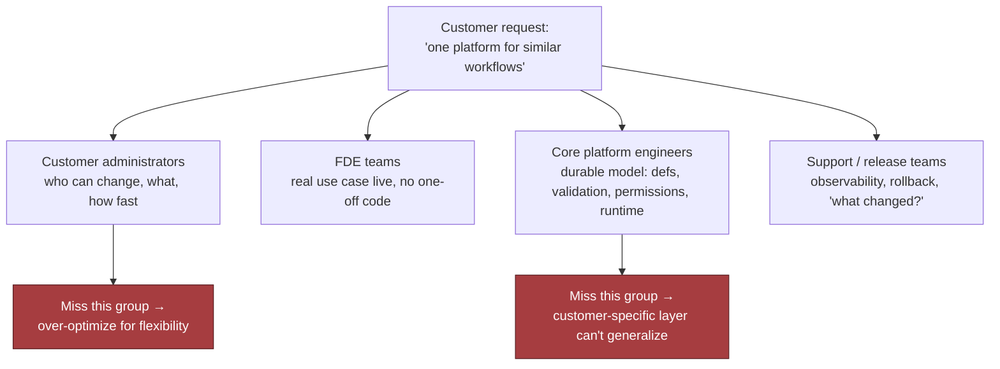

### Discovery Question Tree

- Under interview time pressure, the goal is not twenty generic questions — it is a small set that collapses uncertainty fastest.
- Workflow shape:
  - What stays common across customers, and what truly varies?
  - Are variations limited to fields, approval routing, branding, and integrations, or do they extend to logic and lifecycle states?
- Control and ownership:
  - Who is allowed to author and approve configuration changes?
  - Is configuration self-serve for customer admins, or does an FDE/platform team mediate every change?
- Risk and recovery:
  - What happens if a workflow is misconfigured?
  - Can the customer tolerate a broken approval path, or is a guaranteed fallback required?
- Success:
  - What does "done" mean for the first customer: one workflow live, multiple teams onboarded, or all variations migrated?
  - How will the customer judge success: lower manual handling, faster turnaround, fewer errors, or easier audits?
- These questions produce the artifacts the design needs: scope, assumptions, risks, owners, and success metrics.
- If the interviewer withholds information, state assumptions out loud — e.g., "I'll assume configuration is restricted to customer admins and approved by the vendor before it reaches production." That is disciplined boundary setting, not hedging.

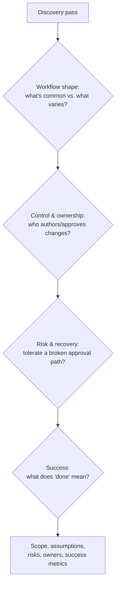

### Assumption Ledger

- A good discovery pass yields four concrete outputs:
  1. Scope — which parts are configurable and which remain fixed.
  2. Assumptions — what you are temporarily accepting because the prompt did not specify it.
  3. Risks — where a bad configuration, permission mistake, or integration failure could harm customers.
  4. Success criteria — what measurable change proves the platform is working.

### Weak vs. Strong Answers

- Weak, feature-first restatement: "We should build a flexible workflow system with forms, approvals, themes, and API hooks."
- Corrected, outcome-first restatement: "We need one shared workflow platform that lets each customer customize fields, approvals, branding, and integrations without forcing separate codebases, while keeping the core stable enough for versioning, support, and safe rollout." The second version exposes the real trade-off: flexibility versus fragmentation.
- A concise opening answer: "Here's how I'd frame it. We have one workflow product, but ten customers need different fields, approval chains, branding, and system integrations. My goal is to preserve a stable shared core while allowing safe, versioned, supportable customization, so we do not end up with ten forks. I'd start by identifying which stakeholders own configuration, which variations are truly required, what failure modes are unacceptable, and how success will be measured for the first rollout. Then I'd design the architecture around controlled extension points, validation, and rollback rather than bespoke code paths."
- Why it works: it names the business problem, names the stakeholders, and makes clear architecture comes only after the workflow owner, risk owner, and success metric are defined — translate customer language into a bounded technical problem, then choose the system design.

## 2. Clarifying Questions, Requirements, and Constraints

### Requirement vs. Preference

- The fastest way to lose control of a configurable-workflow design is to accept "we need flexibility" without asking flexibility for whom, under what governance, and with what upgrade promise.
- Separate requirement from preference and constraint from convenience — every customer asks for a slightly different surface area (fields, approvals, branding, integrations, sometimes rules); pinning down which differences recur is the first design fork.
- Failing to pin down recurring differences, who authors configuration, and where custom code stops leads to either underbuilding the platform or overbuilding a bespoke rules engine that cannot be safely supported.

### The Six-Question Interview Tree

- A concise interview question tree keeps you from wandering into feature brainstorming:
  1. **Which differences recur across customers?** Separates a shared product pattern from one-off exceptions (recurring approval-chain differences → platform capability; one seasonal override → exception path). Answer determines whether the core abstraction centers on workflow steps, policy rules, form schemas, or integration orchestration.
  2. **Who authors configuration?** An architecture question, not staffing: internal engineers tolerate more expressive power; customer admins/support need guardrails (validation, previews, narrower primitives, safer defaults). Changes UX, validation model, and authorization model.
  3. **What extension and integration needs are non-negotiable?** Outbound notifications, webhook callbacks, CRM sync, ticket creation, document generation, or auth hooks — determines the adapter interface, sync vs. async, and whether failures block a transition or degrade gracefully.
  4. **What upgrade guarantees do customers expect?** If configs must survive core releases: versioning, migration tooling, backward-compatible schema evolution, rollback paths are required. Otherwise there is no stable product core, just a perpetual services project.
  5. **Where is the custom-code security boundary?** Whether custom code runs inside the trusted core, in a sandbox, or only through approved integration points — determines tenancy isolation and supply-chain scrutiny. Safest default: keep the core declarative and arbitrary code outside the main trust boundary.
  6. **What is the time-to-configure target?** Hours → self-service, validated, low-friction tooling; a week → more manual review is tolerable. Changes whether you optimize for admin UX, template reuse, automated testing, or partner onboarding.
- These questions turn "support customization" into specific design pressures.

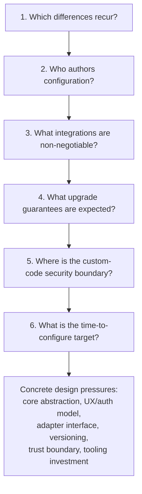

> 🎯 **Interview Pointer:** Question 5 (custom-code security boundary) is the one interviewers most often probe further — be ready to state immediately that the safest default is "declarative core, arbitrary code outside the trust boundary," and connect it forward to the sandbox component in Section 4 and the security controls in Section 6.

### Must-Have Functional Requirements

- A stable workflow engine that can execute the same core lifecycle for every customer.
- Declarative schemas, rules, and UI metadata so customers can change fields, labels, visibility, and validation without code forks.
- An adapter interface for integrations so external systems can be connected without rewriting the engine.
- Versioned configuration and validation so changes can be reviewed, tested, and rolled back.
- Controlled extension points for the few places where declarative configuration is not enough.
- Migration and rollback tooling so version changes do not strand customers on incompatible configs.
- The stable engine is the center of gravity: one release train, one operational model, one support surface. Declarative schemas/rules keep most variation out of code. The adapter interface prevents every integration from becoming a special case. Versioning/validation make customization supportable instead of fragile. Extension points must be narrow and explicit, not a blank check for arbitrary customer logic.

### Measurable Non-Functional Requirements

- One core release train — the platform ships as one product, not ten customer branches.
- Configuration isolation — one customer's settings, data, and test changes cannot bleed into another customer's runtime behavior.
- Backward-compatible upgrades — old configurations continue to work until a planned migration path is executed.
- Observable customer-specific behavior — when a workflow misbehaves, operators can see which config version, and which rule or adapter, was involved.
- These are constraints on system shape, not soft aspirations: no observability → cannot support it; no backward compatibility → configuration becomes a liability; weak isolation → customization becomes a multi-tenant incident factory.

### MVP Non-Goals / Scope Fence

- The MVP will not support:
  - Arbitrary customer-written code inside the workflow engine.
  - Unlimited branching of the UI for each customer's branding request.
  - A general-purpose rules language that can express every possible business process.
  - Deeply bespoke integration behavior that bypasses the adapter contract.
  - Automatic migration of every legacy configuration shape without operator review.
- These exclusions preserve the product core; the MVP proves ten customers can share one platform with safe variation, not that every conceivable workflow can be modeled on day one.

### Requirement-to-Component Traceability

- Mapping each requirement to a likely component boundary shows movement from requirements to system decomposition without hand-waving:

| Requirement | Likely component |
|---|---|
| Stable workflow engine | Workflow runtime / orchestrator |
| Declarative schemas, rules, UI metadata | Config model, schema registry, admin UI |
| Adapter interface for integrations | Integration gateway / connector layer |
| Versioned configuration and validation | Config service, validator, release pipeline |
| Controlled extension points | Sandbox or plugin boundary |
| Migration and rollback tooling | Deployment and ops tooling |
| One core release train | Shared platform build and release process |
| Configuration isolation | Tenant-aware data and authorization layer |
| Backward-compatible upgrades | Schema evolution and compatibility checks |
| Observable customer-specific behavior | Audit logs, metrics, tracing, config-version tags |

### Handling Partial Answers

- If the interviewer answers only some questions, do not freeze — choose reasonable assumptions and protect the highest-risk constraint.
- Example: if customers are similar but who-authors-configuration is unspecified, assume a mixed model — customer admins edit safe declarative fields, internal ops approve schema changes and extensions. This protects the most fragile boundary: safe customization vs. unsafe code.
- The job-market signal being tested: customer discovery under ambiguity, prioritization under incomplete information, and the discipline to preserve delivery by narrowing scope instead of widening it.

### The Strong Candidate Move

- Not "build everything flexible." Instead: identify recurring differences → determine who owns configuration → define integration/upgrade promise → set a clear custom-code boundary → commit to a stable workflow engine with declarative configuration, versioning, and strict validation.
- This sequence converts discovery into an implementable plan instead of a feature list — ask questions that change the design, then move forward with explicit assumptions instead of waiting for perfect information.

## 3. Scale Estimates, SLOs, and Capacity

### Load Shape, Not Marketing Shape

- The elegant first pass (one shared workflow engine, one config store, one validator, one deployment pipeline) is plausible at average load and breaks once you put a deadline on it.
- The right estimate is not "how many customers do we have?" but "how many config changes, validations, activations, and approval events do we have at once, and what happens near a deadline?"
- Illustrative assumption: 100 tenants, 50 workflow templates, 1,000 configuration versions per day — a mix of small edits, bulk template updates, and bursty release windows.
  - Average: ~42 versions/hour.
  - Peak (half of daily changes land in a 2-hour business window): ~250 versions/hour, before retries, validation failures, or approval re-submissions.
  - Design for materially more than the average — often several times more — with a growth factor and headroom target, to survive release-day spikes without turning configuration into an outage.

### The Four-Step Capacity Envelope

- Estimate in the order that changes architecture:
  1. **Version intake and validation throughput.** Schema checks, policy checks, dependency checks, simulation/dry-run — 2–10 seconds of CPU-bound work or a few network calls means synchronous user feedback must be separated from asynchronous deeper checks. Immediate SLO: "did the edit save and return a clear result quickly?" Deeper guarantee: "did validation complete and promote/reject the version before the deployment window closes?"
  2. **Deployment throughput.** Even if only a fraction of the 1,000 versions/day are promoted, deployments fan out across tenants, regions, or integrations — a single promoted template update might touch dozens of workflow instances or enqueue downstream sync jobs. Deployment capacity is driven by fan-out, not just the count of human edits.
  3. **Limits for expressive power.** Hard limits on rules, custom fields, and plugin execution shape runtime cost early — e.g., a moderate field count per form, a bounded number of rule clauses per transition, short plugin execution windows with memory/network restrictions. These limits prevent one customer's customization from consuming everyone else's shared service budget.
  4. **State growth and retention.** Configuration history grows more slowly than event history but still matters — the question isn't just "how many records?" but "what must be retained for audit, rollback, and support, and for how long?" Keep the version graph compact, store deltas where useful, make rollback metadata first-class.

### SLOs Tied to Customer Pain

- **Availability:** Can users load the workflow editor, validate changes, and activate a version when they need to?
- **Latency:** How long does the editor wait for save, validation preview, or approval routing results?
- **Freshness:** After a configuration is approved, how quickly does the new version become active in the runtime path?
- **Quality:** What fraction of deployments are rejected by validation, rolled back, or require manual intervention?
- **Security:** Are tenant boundaries, approval permissions, plugin permissions, and audit trails enforced at the right control points?
- **Cost:** What is the cost per validated version, per activated template, or per thousand workflow executions, and how does that change when customers add rules or plugins?
- Latency budget is partitioned, not one number: save feels interactive, validation preview tolerates a little more delay, full deployment can be slower as long as it is reliable and observable. Making every step synchronous "because it feels simpler" is the wrong design.

### Leverage and What Belongs in Core

- Leverage decides whether a capability belongs in shared product code, in configuration, or in an adapter around a customer-specific integration:

$$ Leverage=\frac{Customers\ served\ by\ shared\ capability}{Engineering\ effort} $$

- High leverage (e.g., an approval model used by 80 tenants) → deserves first-class core support.
- Low leverage (one customer's fragile edge-case approval chain) → belongs in configuration, an adapter, or a narrowly scoped extension — do not drag the whole platform into that shape.
- Support-cost matters too: a feature that seems reusable but creates expensive onboarding, debugging, or upgrade friction may have worse real leverage than a simpler, narrower design.

### A Whiteboard Estimate That Changes Component Choice

- Naively keeping validation inside the same API that saves configuration seems fine until peak load is estimated: worst-case request time grows with the slowest rule set or plugin call, producing a brittle control plane where one slow tenant ties up capacity everyone else needs.
- Once peak validation throughput and deployment fan-out are estimated, the architecture shifts:
  - Save → fast and durable.
  - Validation → queued, bounded, observable.
  - Deployment → idempotent, retryable, separated from authoring traffic.
- The rate and cost of validation/deployment — not the raw count of tenants — is the estimate that most strongly affects component selection and partitioning.

### Sensitivity Table Across Growth Scenarios

| Scenario | Daily config versions | Peak factor | Operational implication |
|---|---|---|---|
| Baseline | 1,000 | 3x | Single shared validator may be enough if work is mostly asynchronous |
| Moderate growth | 10,000 | 3x–5x | Queue separation, worker pools, stricter limits on plugin time |
| Aggressive growth | 10x baseline | 5x+ | Stronger tenant isolation, sharded queues, explicit per-tenant quotas |

- 10x growth does not just increase cost — it can force a different partitioning strategy. The same is true for custom fields/rules: highly branched forms with many calculated fields may need compile-time validation, partial evaluation, or cached execution plans; common plugin execution may need sandboxing or an adapter boundary instead of direct in-process execution.

> 🎯 **Interview Pointer:** Be ready to explain *why* 10x growth forces a partitioning change rather than just "more servers" — the answer is tenant noisy-neighbor risk crossing a threshold where a shared validator/queue can no longer contain one bad tenant's blast radius. This is the kind of qualitative reasoning interviewers reward over spreadsheet precision.

### Average vs. Peak: Headroom as a Product Feature

- Average load tells you whether the system is economically plausible. Peak load tells you whether customers trust it on their worst day.
- Headroom (the gap between average and peak) is not wasted capacity — it is what keeps a release window, approval rush, or large tenant onboarding from becoming the moment the platform betrays its promise.
- Unit economics question: not just "can we afford to run this?" but "can we afford to run this with the support burden it creates?" A design with low runtime cost but high operational toil may lose to a slightly more expensive design that is easier to support, roll back, and explain.

### Decision Rule to Carry Forward

- Treat every estimate as a design lever. If a number does not change a component boundary, a queue, a quota, a latency budget, or a support process, it is probably trivia. If it does, write it down and defend it.

## 4. Architecture and End-to-End Flow

### Control Plane vs. Data Plane

- The cleanest way to explain this system: walk one tenant request all the way through, then replay it when a dependency is unhealthy.
- Hidden constraint: one customer's custom approval logic may be dangerous if it can alter shared runtime behavior.
- The design splits into a **control plane** (authors, validates, versions, and promotes configuration) and a **data plane** (executes live workflow instances) — this separation keeps risky change management out of the hot path.
  - Control plane owns: config editing, schema checks, tenant contract tests, release promotion.
  - Data plane owns: workflow execution, UI rendering at runtime, connector calls, audit events.
- This split is the first place to point when an interviewer asks where the trust boundary sits.

### Architecture Diagram and Trust Boundaries

- Top-down flow: tenant-authored change requests → control plane (config editor → schema/rule validator + tenant test harness → configuration registry as system of record → feature flag service for gated exposure) → data plane (workflow runtime, UI renderer, integration adapter SDK, sandboxed approved extensions) → external systems (customer APIs, identity provider, notification services).

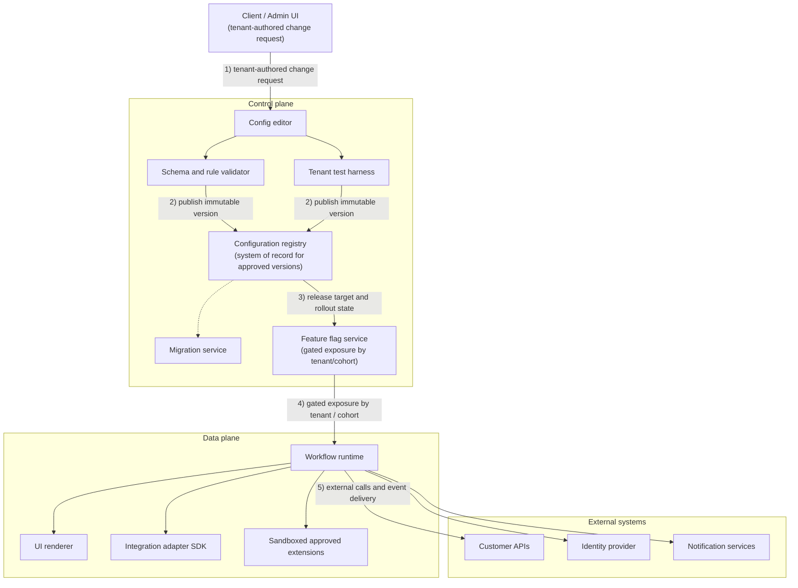

- Trust boundaries sit (a) between tenant-authored content and platform-owned execution, and (b) between platform execution and external dependencies.
  - Tenant-authored config is never treated like code with full platform trust.
  - Approved extensions are still untrusted enough to deserve isolation and quotas.
  - External systems are not under your control — every adapter call needs timeouts, retries, idempotency where applicable, and a backoff policy that does not amplify failures.

### Core Components in Dependency Order

- Components are introduced in the order they depend on one another, not in the order they are easiest to name.

| Component | Responsibility | State ownership | Typical boundary |
|---|---|---|---|
| Workflow runtime | Executes workflow instances, step transitions, timers, and retries | Runtime state, execution history | Data plane; synchronous for step decisions, asynchronous for long-running work |
| Configuration registry | Stores versioned configs, schemas, and release metadata | Immutable config versions | Control plane; system of record for published config |
| Schema and rule validator | Checks syntax, semantic constraints, permissions, and compatibility | Validation results only | Control plane; synchronous on save/publish |
| UI renderer | Generates tenant-specific forms, labels, and layouts from approved config | None beyond cache | Mostly data plane; synchronous render, cached descriptors |
| Integration adapter SDK | Standard interface for CRM, ERP, ticketing, and webhook adapters | Adapter definitions, credentials references | Data plane edge to external systems |
| Feature flag service | Gates rollout by tenant, cohort, or percentage | Flag state | Cross-cutting control plane to data plane |
| Sandbox for approved extensions | Runs narrowly scoped customer logic or plugins with hard limits | Ephemeral execution only | Isolated boundary; synchronous if small, otherwise async |
| Migration service | Rewrites older configs into new schema versions or migrates instances forward | Migration jobs, compatibility mappings | Control plane; usually asynchronous |
| Tenant test harness | Replays tenant-specific contract tests before release | Test fixtures, expected outcomes | Control plane; synchronous approval gate or async batch |

- Every box earns its place: the validator exists so the registry never becomes a junk drawer; the flag service exists because "publish" and "expose to every tenant" are not the same action; the sandbox exists because approved extensions are useful but arbitrary runtime execution is how customizability turns into incident response.

### Failure-Path Overlay: Infinite Approval Loop

- The same architecture, annotated for the infinite-approval-loop failure drill, makes the blast radius visible — the validator, test harness, and flags each reduce blast radius at a different stage, so if one layer misses the defect, later layers still prevent a tenant-wide incident.

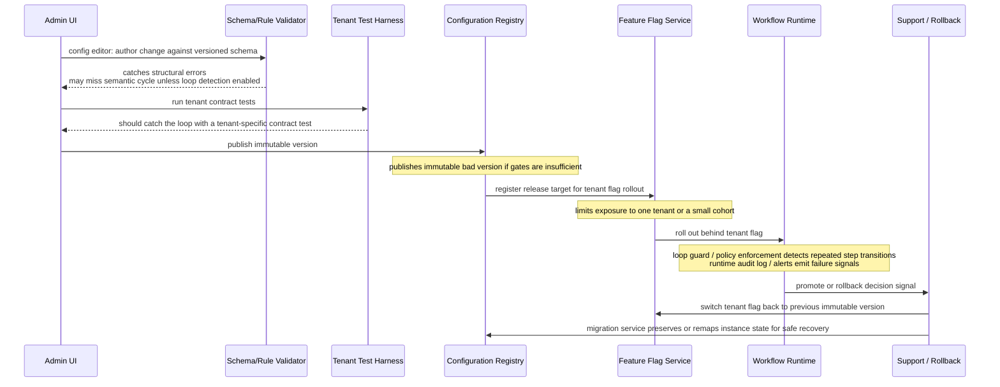

### Happy-Path Sequence: Author to Promotion

- Step-by-step live release path:
  1. **Author config against a versioned schema** — product manager, implementation engineer, or customer admin edits the workflow definition, field layout, approval graph, and adapter mappings.
  2. **Validate syntax and semantic constraints** — checks structure, allowed field types, approval graph sanity, reference integrity, permissions, compatibility with enabled features.
  3. **Run tenant contract tests** — replays representative scenarios: form submission, approval routing, edge-case inputs, integration stubs.
  4. **Publish an immutable version** — the registry stores the exact artifact, version tag, schema version, author, and release metadata; system of record for what was approved.
  5. **Roll out behind a tenant flag** — exposed to a single tenant, then a cohort, then broader traffic if stable.
  6. **Observe behavior** — validation failures, step latency, adapter error rates, approval-loop detection, user completion metrics.
  7. **Promote or rollback** — if the release meets the acceptance gate it becomes active; otherwise the flag moves back or the tenant is pinned to the prior immutable version.
- Key nuance: "publish" does not mean "activate everywhere" — that separation is what keeps a bad config from becoming a broad outage.
- Synchronous vs. asynchronous: validation and contract testing are synchronous gates (must block promotion); migration, bulk replay, and some integration recovery are better asynchronous (should not hold the user's request open). The runtime itself often mixes both — quick step decisions synchronously, external side effects asynchronously when a dependency is slow or unreliable.

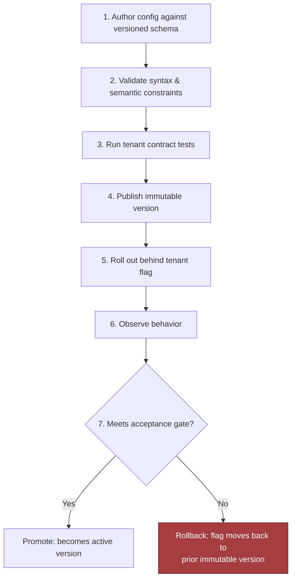

### Systems of Record, Caches, Queues, and Backpressure

- **System of record:** the configuration registry for published versions; usually the workflow audit store for execution history.
- **Caches:** compiled schema descriptors, rendered form layouts, adapter metadata, recent flag decisions.
- **Queues:** adapter jobs, retries, event delivery, migration tasks, test harness batches.
- **Backpressure and flow control:** the runtime should shed or delay noncritical work when adapter queues grow, rather than allowing retries to stampede external systems.
- Partitioning key: usually tenant ID, sometimes combined with workflow definition ID or environment — keeps noisy tenants from corrupting everyone else's latency profile, eases replay, and provides a natural quota-enforcement point. An unusually heavy approval storm should be contained within its partition.

### MVP vs. Later Evolution

- MVP: keep it brutally simple — versioned registry, validator, runtime, feature flags, tenant test harness, small adapter SDK, and only the smallest sandbox needed for approved extensions. Favor immutable config versions and clear rollback over a more exotic live-edit system.
- Later: cross-tenant config templates, richer migration automation, a broader plugin marketplace, deeper observability into tenant behavior — only after the core release path is stable and supportable.

### 90-Second Interview Summary

- "I would separate a control plane from a data plane. The control plane handles authoring, schema and rule validation, tenant contract tests, immutable versioning, and rollout through feature flags. The data plane runs the workflow runtime, UI rendering, and adapter calls. The configuration registry is the system of record for published versions, and the runtime reads only approved releases. Tenant ID is the main partitioning key, with queues and backpressure protecting external dependencies. The riskiest trade-off is how much customer logic to allow in approved extensions versus keeping everything in declarative config. For an MVP, I would keep extensions narrow, require versioned configs, and gate every release behind a tenant test harness and staged flag rollout. The first production rollout gate is a single tenant with a rollback path that can be executed immediately."

## 5. Data Model, APIs, and Working Code

### Four Core Records and Ownership

- The fastest way to make this design credible: stop speaking in abstractions and pin the hardest parts to concrete state, contracts, and a small amount of code — what is durable, what is mutable, what is versioned, what is deployed, and what happens when the same request arrives twice.
- **`WorkflowTemplate(id, engine_version, schema)`** — the reusable blueprint, owned by product/platform.
  - `id` is the primary key; `engine_version` tells the runtime which evaluator/renderer understands the template; `schema` describes allowed shape of fields, approvals, integrations.
  - Lifecycle: `draft` → `published`; only a new template version can change behavior — the published artifact is immutable.
  - Retention: keep published templates for the life of the product/contract window so old tenant configs can still resolve against the exact template they validated against; garbage-collect drafts after a safe inactivity period.
- **`TenantConfig(tenant_id, template_id, version, values)`** — the customer-specific overlay.
  - Primary key effectively `(tenant_id, version)`; `values` holds only tenant-specific parameters allowed by the template schema.
  - Lifecycle: `draft` → `validated` → `deployed` or `rolled_back`; a failed validation returns it to `draft`/`needs_fix` without changing its version.
  - Retention: keep all published and rolled-back versions for auditability/rollback; retain drafts only per platform policy until abandoned/replaced.
  - The tenant owns the business meaning of these values; the platform owns validation and persistence.
- **`AdapterDefinition(name, contract_version, permissions)`** — the integration contract for a downstream system (CRM, ticketing, storage, messaging).
  - Key is `name` + `contract_version`; `permissions` records required scopes/capabilities so the platform can reject a config asking for an adapter it cannot safely invoke.
  - Lifecycle: managed by platform/integrations team, published as versioned contracts, retired only after no active tenant config depends on them.
  - Retention: keep retired definitions long enough for historical deployments/troubleshooting, marked inactive so new configs cannot select them.
- **`ConfigDeployment(tenant_id, version, state)`** — the deployment ledger; source of truth for `draft` / `validated` / `deployed` / `rolled_back` / `failed`.
  - What ops/support inspect for "which version is live right now?"
  - Lifecycle: append-only state transitions, not in-place rewrites — a rollback is a new deployment event pointing back to a prior good version.
  - Retention: keep deployment history for the full support/audit window — it's the operational ledger for incident review, customer support, and change tracking.
- Ownership split prevents accidental coupling: template is product-owned, tenant config is customer-owned, adapter contract is integration-owned, deployment record is ops-owned. Blurring these produces forks disguised as flexibility.

> 🎯 **Interview Pointer:** When asked "what's the source of truth for what's live," name `ConfigDeployment`, not `TenantConfig` — the deployment ledger's append-only state transitions (not the config record itself) is what lets support answer "which version is live right now?" and what makes rollback a new event instead of an in-place mutation.

### Four API Contracts

- The interview-sized implementation shows one constrained declarative workflow contract and a write path that refuses unsafe input before it reaches the registry — the goal is to prove the platform can accept bounded configuration, validate it, and publish it immutably.
- `POST /v1/configurations/validate` — accepts a draft tenant config, returns validation errors and a normalized preview, never publishes state.
  - Auth: tenant-scoped bearer token/session bound to the caller's tenant; authz only allows validating configs for tenants the caller can administer.
  - Body: `template_id`, `version`, `values`, optionally `idempotency_key` (for replayable validation traces; endpoint can also be safely retried without write effects).
  - Responses: `200 OK` successful preview; `400 Bad Request` structural issues; `403 Forbidden` tenant mismatch/missing rights; `422 Unprocessable Entity` schema/policy violations.
- `POST /v1/tenants/{id}/deployments` — creates a deployment for a tenant, typically from a validated config version; returns deployment ID + state.
  - Auth: binds caller to tenant `{id}` or a delegated ops role; server rejects cross-tenant deployment attempts.
  - Create-style operation → requires an idempotency key; same key + identical body → same result; same key + changed body → `409 Conflict`.
  - Errors: `401 Unauthorized` missing/expired credentials; `403 Forbidden` missing tenant permission; `404 Not Found` referenced config version doesn't exist; `409 Conflict` stale optimistic-concurrency token or idempotency-key reuse with different payload; `422 Unprocessable Entity` passes syntax but fails policy.
- `POST /v1/adapters/{name}/test` — exercises an adapter mapping against a safe test payload/sandbox endpoint.
  - Auth: scoped to integration-maintainer or tenant-admin permissions.
  - Body: adapter name, test payload, mapping, optional sandbox selector; also accepts an idempotency key to avoid duplicate test executions/audit records.
  - Errors: `404 Not Found` unknown adapter; `403 Forbidden` lacks permission; `422 Unprocessable Entity` mapping cannot be applied; `502 Bad Gateway` (or similar) sandbox dependency fails.
- `POST /v1/deployments/{id}/rollback` — creates a new rollback state for the same tenant rather than mutating the old deployment in place.
  - Auth: tenant-scoped with elevated ops permission or an explicit approval path.
  - Body: names the target deployment or prior good version; includes an idempotency key (rollback is a write op that may be retried under failure).
  - Success returns the new deployment record, never overwrites the prior one.
  - Errors: `404 Not Found` deployment ID doesn't exist; `409 Conflict` current live state has moved on in a way that makes rollback unsafe; `422 Unprocessable Entity` target version no longer compatible with current template/adapter contract.
- All four endpoints: require tenant-aware authentication and authorization, reject cross-tenant writes, require an idempotency key on create-style operations, and return the same result for repeated requests with the same key and body. A changed body under a reused key is a conflict, never a silent update.

### Idempotent Deployment Creation Walkthrough

- Concrete example: an ops client sends `POST /v1/tenants/acme/deployments` with idempotency key `deploy-2024-11-18-001` and body `{configVersion: 17, templateId: "tpl-9"}`.
  - Server creates deployment `dep-555`, returns `201 Created` with `deployment_id=dep-555`, `state=deployed`, and the same idempotency key recorded in the write log.
  - Retry with the same key after a timeout → must not create `dep-556`; returns the exact same result for `dep-555`.
  - Retry with the same key but a changed body (`configVersion: 18`) → rejected as a conflict because the idempotency key no longer matches the payload.

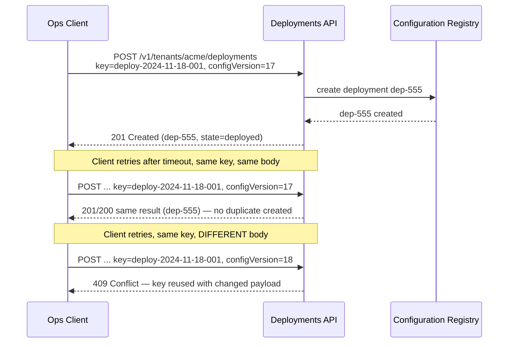

### The Smallest Safe Code Path: Config Publication

- The highest-risk component is config publication — where unsafe structure, invalid mappings, or broken versioning can create outages. The sketch below is narrow but shows the control points that matter in production.

```typescript
type JsonValue = string | number | boolean | null | JsonValue[] | { [key: string]: JsonValue };
type JsonLogic = { op: string; args?: JsonValue[] };

type WorkflowConfig = {
  version: 1;
  fields: Array<{ key: string; type: "text" | "number" | "date"; required: boolean }>;
  approvals: Array<{ when: JsonLogic; role: string; slaHours: number }>;
  integrations: Array<{ adapter: string; mapping: Record<string, string> }>;
};

type ValidationError = { path: string; code: string; message: string };

type PublishResult =
  | { ok: true; configId: string; version: number }
  | { ok: false; errors: ValidationError[] };

class ConfigValidationError extends Error {
  constructor(public errors: ValidationError[]) {
    super("Configuration validation failed");
  }
}

function isPlainObject(value: unknown): value is Record<string, unknown> {
  return typeof value === "object" && value !== null && !Array.isArray(value);
}

function validateWorkflowConfig(input: unknown): WorkflowConfig {
  const errors: ValidationError[] = [];

  if (!isPlainObject(input)) {
    throw new ConfigValidationError([{ path: "$", code: "invalid_type", message: "Expected an object" }]);
  }

  if (input.version !== 1) {
    errors.push({ path: "version", code: "unsupported_version", message: "Only version 1 is supported" });
  }

  if (!Array.isArray(input.fields) || input.fields.length === 0) {
    errors.push({ path: "fields", code: "required", message: "At least one field is required" });
  }

  if (!Array.isArray(input.approvals)) {
    errors.push({ path: "approvals", code: "invalid_type", message: "Approvals must be an array" });
  }

  if (!Array.isArray(input.integrations)) {
    errors.push({ path: "integrations", code: "invalid_type", message: "Integrations must be an array" });
  }

  if (errors.length > 0) {
    throw new ConfigValidationError(errors);
  }

  return input as WorkflowConfig;
}

function validatePolicy(config: WorkflowConfig): void {
  const seenRoles = new Set<string>();
  for (const approval of config.approvals) {
    if (!approval.role || approval.slaHours <= 0) {
      throw new ConfigValidationError([
        { path: "approvals", code: "invalid_approval", message: "Each approval must have a role and positive SLA" },
      ]);
    }
    if (seenRoles.has(approval.role)) {
      throw new ConfigValidationError([
        { path: "approvals", code: "duplicate_role", message: `Duplicate approval role: ${approval.role}` },
      ]);
    }
    seenRoles.add(approval.role);
  }
}

function validateAdapterMappings(config: WorkflowConfig, allowedAdapters: Set<string>): void {
  for (const integration of config.integrations) {
    if (!allowedAdapters.has(integration.adapter)) {
      throw new ConfigValidationError([
        { path: "integrations", code: "unknown_adapter", message: `Unknown adapter: ${integration.adapter}` },
      ]);
    }
    for (const [from, to] of Object.entries(integration.mapping)) {
      if (!from || !to) {
        throw new ConfigValidationError([
          { path: `integrations.${integration.adapter}.mapping`, code: "invalid_mapping", message: "Mappings must not contain empty keys" },
        ]);
      }
    }
  }
}

class Registry {
  private store = new Map<string, { version: number; config: WorkflowConfig; hash: string }>();

  putImmutable(configId: string, config: WorkflowConfig): { version: number } {
    const existing = this.store.get(configId);
    const nextVersion = existing ? existing.version + 1 : 1;
    const hash = JSON.stringify(config);
    this.store.set(configId, { version: nextVersion, config, hash });
    return { version: nextVersion };
  }
}

function publish(configId: string, raw: unknown, allowedAdapters: Set<string>, registry: Registry): PublishResult {
  try {
    const config = validateWorkflowConfig(raw);
    validatePolicy(config);
    validateAdapterMappings(config, allowedAdapters);
    const result = registry.putImmutable(configId, config);
    return { ok: true, configId, version: result.version };
  } catch (error) {
    if (error instanceof ConfigValidationError) {
      return { ok: false, errors: error.errors };
    }
    return {
      ok: false,
      errors: [{ path: "$", code: "internal_error", message: "Unexpected failure during publish" }],
    };
  }
}
```

- Teaching points, line by line:
  - `WorkflowConfig` constrains the shape to a versioned declarative contract.
  - `JsonValue`/`JsonLogic` make approval conditions explicit without opening the door to arbitrary code.
  - `ValidationError` gives the API a stable error vocabulary.
  - `validateWorkflowConfig` is typed boundary validation — rejects malformed payloads before business logic sees them.
  - `validatePolicy` separates structural correctness from authorization/workflow rules.
  - `validateAdapterMappings` checks the integration surface against an allowlist rather than trusting the config author.
  - `Registry.putImmutable` models versioned writes instead of overwrite semantics.
  - `publish` composes checks in the only order that makes sense: parse → validate → authorize-by-policy → persist.

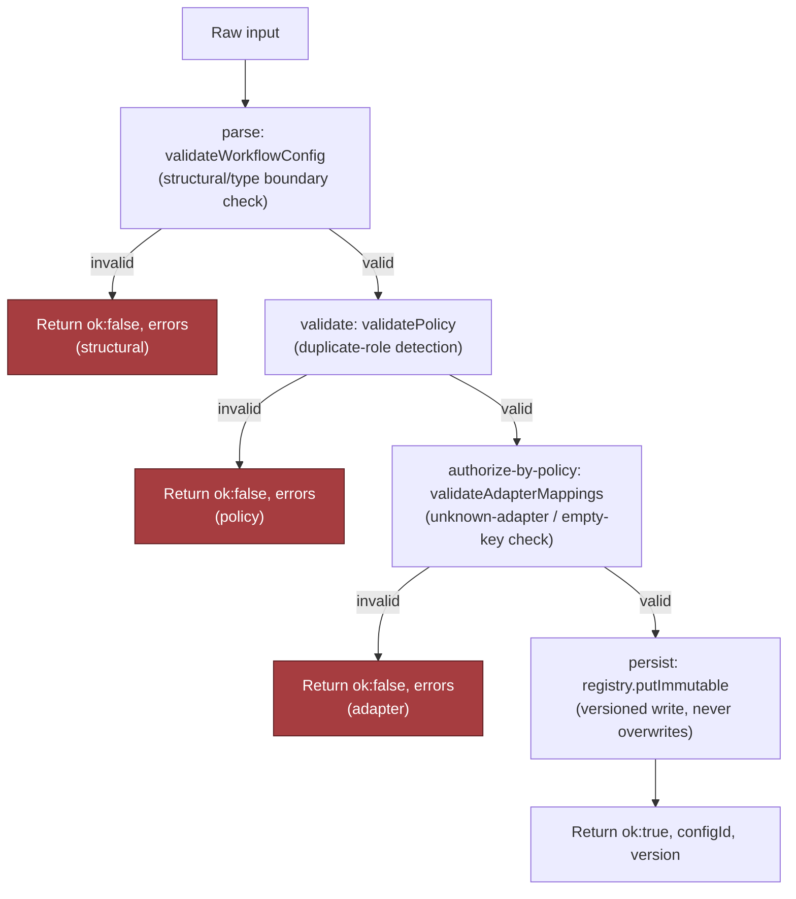

> 🎯 **Interview Pointer:** Memorize the four-stage composition order — parse → validate → authorize-by-policy → persist — as a reusable pattern. Interviewers often ask "why this order?" The answer: cheap structural checks fail fast before expensive policy/adapter checks run, and nothing is persisted until every prior stage has passed (fail closed).

### What the Whiteboard Version Omits on Purpose

- A real service would add:
  - **Optimistic concurrency** — the write boundary should carry an expected template/config version so two operators cannot race and overwrite each other's change unnoticed.
  - **Idempotency** — a retry after a timeout should not create a second deployment or version.
  - **Bounded, safe retries** — limited to safe failure classes; never replay a rejected validation/authorization failure as though it were transient.
  - **Observability** — tag every validation, deployment, adapter test, and rollback with tenant ID, config version, request ID, and idempotency key so support can trace exactly what happened without reading application logs line by line.

### Contract and Failure-Injection Tests

- A good interview answer includes both a contract test and a failure-injection test.

```typescript
import { describe, it, expect } from "vitest";

describe("publish", () => {
  it("rejects duplicate approval roles and returns a structured validation error", () => {
    const registry = new Registry();
    const result = publish(
      "cfg-1",
      {
        version: 1,
        fields: [{ key: "requester", type: "text", required: true }],
        approvals: [
          { when: { op: "always" }, role: "manager", slaHours: 24 },
          { when: { op: "always" }, role: "manager", slaHours: 24 },
        ],
        integrations: [],
      },
      new Set(["crm"]),
      registry,
    );

    expect(result.ok).toBe(false);
    if (!result.ok) {
      expect(result.errors[0].code).toBe("duplicate_role");
    }
  });

  it("survives an adapter allowlist miss without publishing state", () => {
    const registry = new Registry();
    const result = publish(
      "cfg-2",
      {
        version: 1,
        fields: [{ key: "requester", type: "text", required: true }],
        approvals: [{ when: { op: "always" }, role: "manager", slaHours: 24 }],
        integrations: [{ adapter: "unknown", mapping: { a: "b" } }],
      },
      new Set(["crm"]),
      registry,
    );

    expect(result.ok).toBe(false);
  });
});
```

- The first test is the contract test: proves the API rejects a structurally valid but policy-violating configuration.
- The second is the failure-injection test: simulates an unsafe adapter definition and verifies the publish path fails closed.
- In a real service, extend this with duplicate idempotency-key tests, deployment rollback tests, and a concurrency test showing stale versions are rejected.
- Job-market signal: an FDE who can move from customer workflow pain to a state model, to API semantics, to production-grade validation code is operating at the level hiring teams actually need — the difference between "I can sketch a system" and "I can ship a supportable platform."

## 6. Security, Reliability, and Failure Handling

### The Red-Team Question

- A security-and-ops review is where this design either becomes shippable or collapses into "works in the demo." Start by assuming the worst plausible version of the customer request: highly flexible workflow customization, but the platform must still preserve a stable core, keep secrets compartmentalized, and survive bad config without turning one customer's mistake into everyone's outage.
- The right red-team move: "What happens if a published config creates an infinite approval loop?" This tests whether the platform can contain impact, preserve evidence, and keep operating for other tenants — not just whether the logic is correct.
- Concrete answer: the config pipeline rejects obvious cycles before activation; if a cycle is discovered after publish (hidden state or a race), the engine halts that workflow version, marks the offending revision inactive, keeps the prior known-good version available, and records the publisher, timestamp, tenant, and rule graph snapshot for audit and replay. Goal: make loops boring, bounded, and attributable — not pretend they can't happen.

### Four Security Controls

- **Disallow arbitrary code by default.** Most customization should be declarative: fields, validation rules, routing, approvals, adapter bindings. Arbitrary code is the escape hatch, not the default path — if supported later, it should run through a heavily constrained sandbox or a separate approval-gated extension mechanism.
- **Scope adapters and secrets per tenant.** Isolate each integration so one tenant cannot read another's credentials, tokens, or request payloads. Least privilege applies twice: in the runtime that executes actions, and in the control plane that publishes configuration — a support engineer who can inspect a tenant's config should not automatically be able to invoke its external systems.
- **Validate rules for denial-of-service risk.** "Flexible validation" can become a resource-exhaustion bug — deeply nested conditions, unbounded regexes, giant lookup tables, recursive approval paths can create pathological CPU/memory usage. The publish path enforces shape limits, depth limits, size caps, and cycle detection before a config becomes active.
- **Audit configuration publishers and versions.** Every change needs a durable trail: who published it, what changed, which review/approval gate was crossed, which version superseded which. This is not compliance theater — it lets ops answer "which revision introduced the failure?" and security answer "was this an authorized change?"
- Tie each control to a failure mode in interview language: code execution, secret exposure, resource abuse, and change attribution.

### Failure-Policy Decision Table

| Event | Default behavior | Why |
|---|---|---|
| Validation cannot prove a workflow is safe to activate | **Fail closed** | Better to block a risky publish than activate an unsafe tenant revision |
| External adapter times out during execution | **Retry with limits, then queue or dead-letter** | Transient outages should not immediately fail customer work |
| Approval graph is cyclic or loops at runtime | **Fail closed for that workflow version** | A loop is deterministic harm; continuing only amplifies it |
| A downstream integration is unavailable but the task can wait | **Degrade or queue** | Preserve work without dropping it, if the SLA allows delay |
| A customer action is irreversible, such as an external side effect | **Require human intervention on uncertainty** | Never guess when the system cannot safely compensate |
| A suspicious custom-code request appears | **Deny by default** | The platform should not grant execution rights without an explicit trust boundary |

- This table is the backbone of the interview answer because it shows failure policy as an architectural choice, not a vibes-based reaction.

### Blast-Radius Containment Levels

- **Tenant blast radius:** one customer's bad config should not affect another customer's workflow state, secrets, or run queue.
- **Region blast radius:** if multi-region, a bad deployment or dependency issue should be contained to the smallest feasible region slice.
- **Workflow blast radius:** only the affected workflow definition/version should be frozen, not the whole tenant (unless the tenant's control plane is compromised).
- **Dependency blast radius:** if a single adapter fails, isolate that adapter and keep unrelated adapters healthy.
- Defense in depth: validation is one layer, runtime sandboxing another, rate limiting another, and observability is the last layer confirming the first three are still working.

### Failure Drill: Infinite Approval Loop

- Scenario: a tenant publishes a workflow where step A routes to manager approval, manager approval routes to compliance approval, and compliance approval routes back to manager approval under a condition that is always true.
- A strong candidate response has four parts:
  1. **Detection** — the publish pipeline statically detects the cycle if possible; if the loop emerges only at runtime, the engine recognizes repeated state transitions and a max-hop/max-revisit guard triggers.
  2. **Containment** — freeze the workflow version, halt only the affected execution group, prevent new starts on that revision.
  3. **Recovery** — resume from the last known-good version, or queue affected requests for operator review if the workflow already emitted side effects.
  4. **Prevention** — add stronger graph validation, test cases for cyclic approvals, and a publish-time policy that rejects configs whose approval graph cannot be topologically ordered.
- Evidence requirement: preserve the exact config revision, the transition trace, and the operator action history — a forensically useful answer, not just an error message.

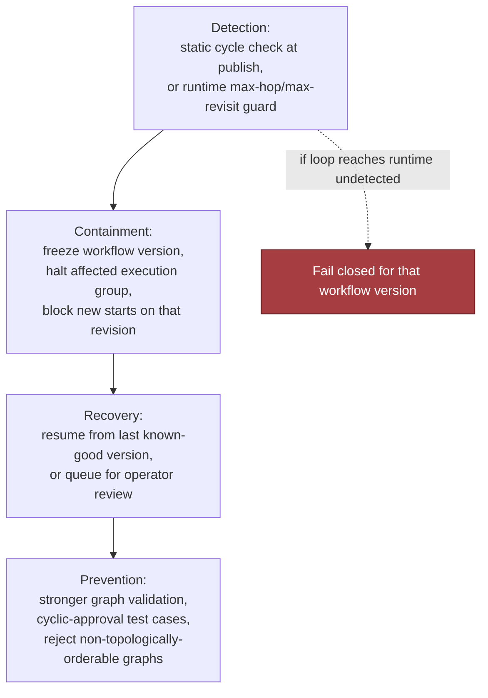

### Other Named Failure Cases

- **Adapter contract changes.** A downstream service changes an expected field or response shape. Mitigation: version adapters, pin schema expectations, add compatibility checks, route mismatches into a quarantine path rather than silent partial success.
- **Tenant upgrade breaks old field mapping.** A tenant moves from version 1 to version 2 but older integrations still reference the old mapping. Mitigation: support versioned field maps, validate migrations, keep the old mapping alive until all executions have drained.
- **Feature-flag combination is untested.** Two individually safe toggles can produce a bad emergent path. Mitigation: define a known-safe matrix for high-risk flags, prohibit unsupported combinations in production, treat unreviewed combinations as fail-closed for launch.
- **Custom code escapes sandbox.** If any customer-defined logic is allowed, sandbox breakout is a high-severity event. Mitigation: do not enable arbitrary code by default; if a sandbox exists, apply least privilege, resource caps, outbound network restrictions, and separate approval gates. A breakout should revoke the extension path and trigger incident response.

### Six Operational Primitives

- **Timeouts:** explicit per-adapter timeouts so one hung dependency does not stall the whole workflow.
- **Retries:** retry only transient, idempotent operations, with bounded attempts and backoff.
- **Idempotency:** every externally visible write needs an idempotency key or equivalent dedup strategy so retries do not duplicate side effects.
- **Circuit breakers:** open the breaker when a dependency is clearly unhealthy so traffic sheds fast instead of building a queue of doomed requests.
- **Dead-letter handling:** route repeated failures to a dead-letter queue or failure inbox when automation has exhausted safe retries.
- **Human escalation:** required when the action is irreversible, the config is ambiguous, or evidence suggests a policy breach rather than a transient outage.
- The system doesn't just "handle errors" — it chooses the least dangerous next state.

### Evidence, Runbooks, and Launch Gates

- Before launch, the team should have audit evidence and runbooks for: who can publish config, how versions are approved, how a bad workflow is disabled, how adapters are rotated, how secrets are revoked, and how to replay a tenant-specific incident without leaking other tenants' data.
- If the team cannot answer those questions on paper, they are not ready to answer them during an outage.

### Interview-Sized Production Sketch

- Intentionally small — not the whole platform, just the publish-path invariant that rejects unknown adapters before config activation. A real companion repository would need tested dependencies, richer schema validation, structured logging, and integration with an actual persistence layer.

```typescript
export type WorkflowConfig = {
  tenantId: string;
  version: number;
  fields: Array<{ key: string; type: string; required?: boolean }>;
  approvals: Array<{ when: Record<string, unknown>; role: string; slaHours?: number }>;
  integrations: Array<{ adapter: string; mapping: Record<string, string> }>;
};

export type AdapterRegistry = {
  has(adapterName: string): boolean;
};

export type PublishResult =
  | { ok: true; activatedVersion: number }
  | { ok: false; error: string };

const ALLOWED_FIELD_TYPES = new Set(["text", "number", "date", "boolean", "email"]);
const MAX_FIELDS = 50;
const MAX_APPROVALS = 10;
const MAX_INTEGRATIONS = 20;

function isPlainObject(value: unknown): value is Record<string, unknown> {
  return typeof value === "object" && value !== null && !Array.isArray(value);
}

function validateConfig(config: WorkflowConfig, registry: AdapterRegistry): string | null {
  if (!config.tenantId || typeof config.tenantId !== "string") return "invalid tenantId";
  if (!Number.isInteger(config.version) || config.version < 1) return "invalid version";
  if (!Array.isArray(config.fields) || config.fields.length > MAX_FIELDS) return "invalid fields";
  if (!Array.isArray(config.approvals) || config.approvals.length > MAX_APPROVALS) return "invalid approvals";
  if (!Array.isArray(config.integrations) || config.integrations.length > MAX_INTEGRATIONS) return "invalid integrations";

  const seenFields = new Set<string>();
  for (const field of config.fields) {
    if (!field || typeof field.key !== "string" || !field.key.trim()) return "invalid field key";
    if (seenFields.has(field.key)) return "duplicate field key";
    seenFields.add(field.key);
    if (!ALLOWED_FIELD_TYPES.has(field.type)) return `unsupported field type: ${field.type}`;
  }

  for (const approval of config.approvals) {
    if (!approval || typeof approval.role !== "string" || !approval.role.trim()) return "invalid approval role";
    if (!isPlainObject(approval.when)) return "invalid approval condition";
    if (approval.slaHours !== undefined && (!Number.isInteger(approval.slaHours) || approval.slaHours < 1 || approval.slaHours > 168)) {
      return "invalid approval slaHours";
    }
  }

  for (const integration of config.integrations) {
    if (!integration || typeof integration.adapter !== "string" || !integration.adapter.trim()) return "invalid adapter name";
    if (!registry.has(integration.adapter)) return `unknown adapter: ${integration.adapter}`;
    if (!isPlainObject(integration.mapping)) return "invalid adapter mapping";
  }

  return null;
}

export function publish(config: WorkflowConfig, registry: AdapterRegistry): PublishResult {
  const error = validateConfig(config, registry);
  if (error) {
    return { ok: false, error };
  }

  return { ok: true, activatedVersion: config.version };
}

export function configWithAdapter(adapterName: string): WorkflowConfig {
  return {
    tenantId: "tenant-acme",
    version: 1,
    fields: [{ key: "requester", type: "text", required: true }],
    approvals: [{ when: { op: "always" }, role: "manager", slaHours: 24 }],
    integrations: [{ adapter: adapterName, mapping: { a: "b" } }],
  };
}

// Example failure test.
describe("publish", () => {
  it("rejects an unknown adapter", () => {
    const registry: AdapterRegistry = { has: (adapterName: string) => adapterName === "crm" };

    expect(() => {
      const result = publish(configWithAdapter("arbitrary-shell"), registry);
      if (result.ok) throw new Error("expected publish to fail");
      throw new Error(result.error);
    }).toThrow(/unknown adapter/);
  });

  it("accepts a known adapter", () => {
    const registry: AdapterRegistry = { has: (adapterName: string) => adapterName === "crm" };
    const result = publish(configWithAdapter("crm"), registry);
    expect(result.ok).toBe(true);
  });
});
```

- The point of the test is not that the code is complete — the invariant is explicit: a tenant cannot activate a config with an adapter the platform does not recognize, and the publish path fails closed before runtime.

### What to Say in the Interview

- Make the judgment visible: arbitrary code is denied by default; tenant secrets and adapters are isolated; risky rules are validated before activation; all publishes are audited; every external dependency or irreversible action gets a named failure policy. Connect that to supportability: the platform can degrade, queue, or block with evidence instead of guessing.
- Job-market signal: teams hiring for this role want someone who can own safe rollout, support, and incident response, not just the happy path — someone who protects the product core while still making customer-specific workflows feel flexible.
- Takeaway: every external dependency and irreversible action needs an explicit failure and recovery policy, stated by tenant, region, workflow, and dependency, with a publish-time invariant that keeps unsafe config out of production.

## 7. Delivery Plan, Observability, and Business Impact

### Rollout as a Series of Proofs

- Once the prototype works, the real customer question changes from "can it?" to "can we trust it in production, with our data, our approvals, and our support team?" — this is where an FDE stops being a builder of a clever demo and becomes the person who converts architecture into staged delivery with measurable gates.
- Treat rollout as a series of proofs, not a single go-live event:
  - Extract one recurring workflow that already appears across several customers — pick the version with the least controversy (one approval path, one integration, one set of fields, one brand surface). Goal: prove the platform can represent a real customer need without a fork, not breadth.
  - Onboard one willing customer who can tolerate ambiguity and give fast feedback — named owner on your side, single production gate, rollback path known before the first publish. Run a canary release to a narrow slice of traffic or one low-risk tenant segment first. The first launch should be narrow enough that support can see every event, every config validation error, and every downstream integration call.
  - Expand configuration only after repeated evidence that the existing surface handles real demand, reduces duplication, and does not raise incident risk — the difference between shipping a platform and accumulating tenant-specific debt.

### The Four-Phase Rollout Plan

1. **Extract one recurring workflow.**
   - Owner: product engineer with FDE support.
   - Exit criteria: the workflow can be described in shared primitives, not a one-off fork.
   - Go/no-go gate: the team agrees the recurring pattern is stable enough to encode.
2. **Onboard a willing customer.**
   - Owner: FDE plus customer admin.
   - Exit criteria: the customer can configure the workflow, complete a pilot run, and report issues through the support channel.
   - Go/no-go gate: the customer accepts the support model and rollback procedure.
3. **Measure delivery time and defects.**
   - Owner: platform lead for telemetry; support lead for incident classification.
   - Exit criteria: baseline numbers for launch speed, defect rate, and validation failures before expanding scope.
   - Go/no-go gate: the platform shows configuration is reducing custom work rather than creating hidden rework.
4. **Expand configuration only after repeated evidence.**
   - Owner: product and platform jointly.
   - Exit criteria: a second and third customer can reuse the same mechanism with predictable effort.
   - Go/no-go gate: the new config type is approved only when it lowers forks or support burden without raising upgrade risk.

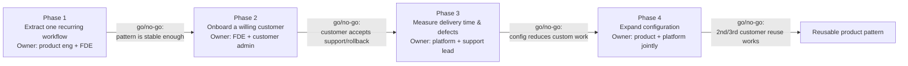

> 🎯 **Interview Pointer:** Each phase's go/no-go gate is the part interviewers probe — be ready to state all four gates from memory (pattern stability, customer acceptance of support/rollback, evidence that config reduces custom work, repeatable reuse by a 2nd/3rd customer) since this is the mechanism that keeps rollout from becoming "we shipped it because the demo worked."

### The Six-Metric Scorecard

- **Time to launch customer** — from approved request to first successful production workflow for a tenant. Source: release tracking/ticket timestamps. Owner: delivery lead. Alert: lead time drifts upward across multiple customers (brittle config, slow approvals, manual intervention).
- **Percentage handled by configuration** — share of customer-specific changes expressed through config instead of code. Source: release classification/change-request tagging. Owner: product/platform lead. Alert: percentage stalls (team silently reverting to forks).
- **Config validation failure rate** — failed publishes ÷ total publish attempts. Source: config service logs. Owner: platform engineering. Alert: failures rise (confusing UX, poor schema, unsafe requests).
- **Fork count** — number of customer-specific code branches, conditionals, or exceptions that cannot be removed. Source: architecture review/repo analysis. Owner: engineering manager. Alert: forks grow (each fork weakens the stable core).
- **Upgrade time** — effort to move one customer/tenant to a new platform version. Source: release records/migration tickets. Owner: release manager. Alert: upgrades require one-off scripts or extended freeze windows.
- **Tenant incident rate** — incidents per tenant over a rolling period, separated from platform-wide outages. Source: incident management system. Owner: support and SRE jointly. Alert: incidents cluster around a specific config type or adapter.

### Four Layers of Metrics

- **Technical health:** publish success rate, validation failures, rollback frequency, latency, incident rate.
- **Model/config quality:** whether workflow primitives actually match customer reality, often inferred from how often customers ask for exceptions.
- **Adoption:** how many customers are using the configured workflow, how often they return to it, how much of their process it covers.
- **Business outcome:** launch speed, reduced custom engineering, fewer support escalations, faster tenant expansion.
- This separation matters in interviews: a platform can be technically healthy and still fail commercially without adoption, or be adopted and still fail operationally if support cannot keep it stable.

### Dashboard in the Language of the User

- Start with the customer story, then drill into the machinery. Example: "Customer onboarding completed in under two days, with zero manual config edits, one validation retry, and no post-launch incident." Beneath that: schema validation failures, adapter errors, approval-loop blocks, publish latency, and rollout status by tenant.
- Answers "what do we watch after launch?" — not just CPU, logs, or queue depth, but the relationship between customer-facing success and internal failure modes.

### Ownership Before Launch

- **Product owner:** decides which recurring workflow becomes the first platformized path.
- **Platform owner:** maintains the shared core, config schema, and publish service.
- **FDE:** translates the customer workflow into supported configuration, validates assumptions, coordinates rollout.
- **Support lead:** owns customer communication, triage, and escalation during pilot.
- **SRE / operations lead:** owns monitoring, rollback execution, and release health.
- **Customer admin / champion:** validates the workflow in their environment and signs off on readiness.

### Go/No-Go and Rollback Triggers

- Go/no-go gate: the config is allowed to publish only if validation passes, dependency adapters are healthy, the rollback plan is rehearsed, and the customer champion confirms the workflow still matches the business process.
- Rollback trigger: repeated validation failures, unexpected integration errors, a growing incident rate in the first tenant cohort, or any sign that a new config pattern is producing unstable approval behavior.
- If the workflow is stateful, migration and rollback must be written down separately — moving state is not the same as reverting code.
- Launch package documentation: a short admin guide, a support runbook, a rollback checklist, and a change log stating exactly what is configurable, what is fixed, and what requires engineering review.

### Config vs. Adapter vs. Shared Service vs. Core

- **Configuration** for customer-specific fields, routing choices, branding, approver lists, threshold values.
- **Adapter** for integrations that differ by customer but share a common interface: CRM, ticketing, email, identity, document systems.
- **Shared service** for capabilities reused across tenants that need uniform policy: validation, audit logging, workflow execution, publish orchestration.
- **Core product** for primitives that define the stable business model and should not be renegotiated for every tenant.
- When tempted to add "just one exception," ask whether it changes the core product, belongs in an adapter, or should be modeled as config — protects the platform from drifting into unmaintainable per-customer branching.

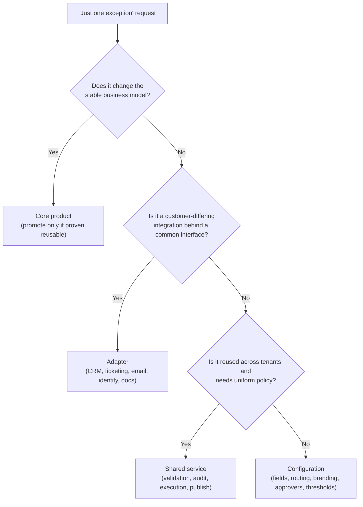

### The Risk Register

| Risk | Owner | Mitigation | Trigger |
|---|---|---|---|
| Infinite approval loop | Platform engineer | Cycle detection and publish-time validation | Repeated re-entry into the same approval state |
| Adapter mismatch | Integration engineer | Contract tests and explicit adapter versioning | Failed calls after publish or schema drift |
| Customer confusion during rollout | FDE | Training, playbooks, and guided setup | High support volume or repeated validation errors |
| Unsupported fork pressure | Product manager | Refusal criteria for bespoke code and a review board for exceptions | Requests that cannot be represented in configuration |

- This risk register is part of the operating model, not an appendix.
- Job-market signal: forward-deployed teams need someone who can carry the work from prototype to adoption, then turn customer feedback into a reusable product pattern. The platform is finished when customers adopt it, the workflow improves, and the operating team can support it without heroics — that is the point "customizable" becomes "supportable."

## 8. Interview Walkthrough, Trade-Offs, and Practice

### Minute-Zero Opening

- Answer from the customer's outcome, not the technology: "We need one platform that can serve ten customers with similar workflows but different fields, approvals, branding, and integrations, without creating ten forks. I'd start by clarifying which parts must remain product core, which parts can vary safely by configuration, and which extensions need hard isolation. My bias is to preserve a stable core and move variation into versioned, testable configuration unless a requirement is truly unique or risky to generalize."
- This opening states the outcome, shows architectural judgment, and invites correction. If the interviewer changes the premise (e.g., a regulated approval step or proprietary connector), adapt rather than defend the first instinct.

### The 50-Minute Pacing Plan

- Use time in proportion to risk, not diagram size — a polished answer spends the most time where failure would hurt the business, not the one with the most boxes.
- **Minutes 0–9 (Outcome & discovery):** anchor the outcome (min 0); name the primary customer outcome (min 1); ask which part changes most often (min 2); identify the hidden constraint (min 3); define what must remain stable (min 4); state non-negotiables — identity, workflow semantics, auditability, rollback, support boundaries (min 5); state assumptions on tenant count/frequency (min 6); state assumptions on config authorship/approval (min 7); state assumptions on failure tolerance/incident response (min 8); invite the interviewer to redirect (min 9).
- **Minutes 10–14 (Success & scale):** define success criteria in customer/operating-model terms (min 10); state SLO/supportability implications (min 11); frame "safe customization" (min 12); estimate system shape — tenants, workflows, connectors, admin edits (min 13); keep numeric estimates illustrative (min 14).
- **Minutes 15–24 (Architecture):** propose main architecture (min 15); config authoring and guardrails (min 16); validation and publish gates (min 17); immutable versioning and rollout (min 18); workflow execution layer (min 19); connectors and integration boundaries (min 20); audit logging and observability (min 21); tenant-scoped identity/authorization (min 22); how workflow state is read/updated (min 23); control flow vs. data flow (min 24).
- **Minutes 25–29 (Config lifecycle):** who edits config (min 25); how config is reviewed (min 26); how config is promoted (min 27); how rollback works (min 28); how support reproduces an issue from a pinned version (min 29).
- **Minutes 30–38 (Happy path, failure path, loop drill):** happy path config-change → publish (min 30); publish → execution (min 31); execution → audit record (min 32); failure path for invalid config (min 33); failure path for permission drift (min 34); failure path for connector failure (min 35); failure path for rollback after a bad publish (min 36); the infinite approval loop drill (min 37); how cycle detection/publish-time validation prevents the loop from reaching production (min 38).
- **Minutes 39–46 (Trade-offs & follow-ups):** configuration vs. code (min 39); generic engine vs. domain product (min 40); plugin flexibility vs. security (min 41); backward compatibility vs. simplification (min 42); what becomes core product (min 43); how configurations are versioned (min 44); when a one-off fork is acceptable (min 45); how extensions are sandboxed (min 46).
- **Minutes 47–49 (Close):** summarize delivery, rollout gating, observability, support playbooks (min 47); deliver the 90-second executive summary (min 48); state the first production rollout gate and pause for questions (min 49).

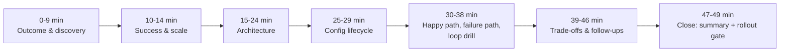

### Four Trade-Off Pairs

- **Configuration versus code.** Configuration wins when customers differ in fields, labels, approvals, routing, or connector selection — those changes remain visible, versioned, and supportable. Code wins when variation changes semantics, requires a new invariant, or would turn the configuration language into an unreadable programming system. Repair for weak answers: stop saying "everything should be configurable" — instead, "make common variations declarative; when logic becomes custom business behavior, graduate it to code with review and isolation."
- **Generic engine versus domain product.** A generic engine serves many tenants but risks becoming too abstract if it tries to model every business process. A domain product is narrower but easier to use/support. Strongest answer: define a stable core around workflow primitives the company can support repeatedly, then expose a constrained domain model around those primitives — optimize for the workflow family the company wants to own, not an endlessly extensible platform.
- **Plugin flexibility versus security.** Plugins reduce time-to-customer by letting teams integrate special systems without rebuilding the core, but enlarge the attack surface. Safe answer: sandbox extensions, restrict permissions, pin interfaces, treat plugins as governed artifacts with review, versioning, and observability. Broad data access or arbitrary execution is no longer a "simple plugin" — it's a trusted service boundary.
- **Backward compatibility versus simplification.** Backward compatibility protects existing tenants and avoids breaking active workflows; simplification keeps the platform understandable and maintainable. Good answer: both matter — propose an explicit deprecation policy (versioned schemas, migration windows, compatibility tests, a small number of supported generations). Repair for weak answers: avoid "we'll support everything forever" — that turns support into archaeology.

### Expected Follow-Up Questions

- **What becomes core product?** The stable execution model, identity/authorization primitives, workflow state transitions, audit logging, validation, and admin tooling. Customer-specific labels, field definitions, approval routing, and connector parameters belong in versioned configuration. Anything that alters execution semantics, requires bespoke storage behavior, or undermines safe rollback should be promoted only after it proves reusable across customers.
- **How do you version configurations?** Immutable published versions, human-readable diffs, schema validation at save time, compatibility checks at publish time. Store configuration as a declarative document with explicit tenant scope, version number, authorship, and rollout status. Never let production workflows depend on an unpinned draft. Versioning is also for audit, support, and reproduction of customer incidents — not just rollback.
- **When is a one-off fork acceptable?** Only when the requirement is genuinely non-reusable, business value justifies the support cost, and the divergence can be isolated so it doesn't infect the core — a narrow exception, not a habit. A fork is acceptable if the alternative would distort the core product into something less reliable or less secure for everyone else.
- **How do you sandbox extensions?** Limit execution context, network access, data access, and side effects. Enforce least privilege, explicit interfaces, resource controls, timeout boundaries, reviewable deployment artifacts. If the extension touches customer data, make the access model explicit and auditable. Sandboxing also includes interface design, dependency review, and deployment governance — not just runtime isolation.

### Weak Answers and Their Repairs

- **Weak:** "We'll make everything configurable." → **Repair:** distinguish declarative customization from business logic.
- **Weak:** "We'll build a flexible plugin system." → **Repair:** define trust boundaries, permissions, and review gates.
- **Weak:** "We can always add a fork later." → **Repair:** explain the support, testing, and upgrade burden of forks.
- **Weak:** "Backward compatibility is always good." → **Repair:** describe version retirement and compatibility budgets.
- **Weak:** "We'll figure out the details after launch." → **Repair:** tie rollout to validation, observability, and rollback.

### Scoring Rubric

| Criterion | 1 — Weak | 3 — Adequate | 5 — Excellent |
|---|---|---|---|
| Discovery | Jumps into design without clarifying variation or constraints. | Asks a few basic questions about customers and workflows. | Rapidly identifies the hidden constraint, distinguishes core from config, and states assumptions clearly. |
| Estimation | No scale framing or vague hand-waving. | Provides rough scale but does not connect it to design choices. | Uses illustrative scale to motivate architecture, SLOs, rollout, and operational risk. |
| Architecture | Presents boxes without data, control, or trust boundaries. | Describes the major components but misses one or two flows. | Explains end-to-end control flow, data flow, and how configuration is validated, versioned, and executed. |
| Depth | Either too shallow or dives into irrelevant internals. | Mixes high-level and detail reasonably. | Spends depth where failure matters most and stays concise elsewhere. |
| Security | Mentions security as an afterthought. | Names basic auth and sandboxing. | Treats extension boundaries, least privilege, audit, and rollback as first-class design constraints. |
| Delivery | Ignores rollout and support. | Mentions phased launch vaguely. | Explains staged rollout, observability, config gating, and recovery paths. |
| Communication | Hard to follow, no closing summary. | Mostly understandable but lacks crisp structure. | Outcome-first, assumption-aware, trade-off explicit, and concludes with a tight executive summary. |

### Interview Rehearsal Checklist

- Before a mock or real interview, be able to do all five without notes:
  1. State the customer outcome in one sentence.
  2. Name the hidden constraint and the riskiest assumption.
  3. Explain what belongs in core product versus configuration.
  4. Defend one trade-off under pressure.
  5. Close with a concise summary and first rollout gate.

### 90-Second Architecture Summary

- "We solve this by keeping a small, stable workflow core and moving tenant variation into versioned configuration for fields, approvals, branding, and connector settings. Each customer edits config through guarded admin tools; config is validated, stored immutably, and published only if it passes schema, policy, and cycle checks. The execution layer reads the published version, runs workflow state transitions, and emits audit events so support can reproduce any tenant's behavior. Extensions go through a controlled plugin boundary with least privilege and explicit contracts. The biggest trade-off is configuration versus code: I want as much reuse as possible, but I would not force custom business semantics into config if that would weaken security or make the system unmaintainable. My first production rollout gate would be a single tenant cohort with rollback, audit, and adapter contract tests proven in staging before broad rollout."

### Practice Plan

- **Solo exercise:** give yourself a blank page and speak the 50-minute plan out loud, then compress it into a 2-minute and a 90-second version.
- **Pair mock:** have a partner interrupt with the risky follow-up: "What becomes core product?" or "When is a one-off fork acceptable?" Practice answering without becoming defensive.
- **Implementation exercise:** design a versioned configuration validator that rejects cycles in approval routing and requires safe publish-time checks before a workflow can go live.
- **Equation guidance:** no new equation is introduced in this section — quantitative considerations are handled in prose, and deeper capacity math is deferred to Section 3 so the interview walkthrough stays focused on trade-offs, not derivations.
- Job-market advantage: this is the exact style of conversation forward-deployed teams use when moving from a customer problem to a safe productized solution.

## Coverage Notes

Self-review against the 20-item decomposition rubric (single pass — the source chapter's own structure already closes nearly every gap on first draft).

**Phase 1 — Problem Framing & Discovery**
- **Item 1 (Feature → business-outcome reframing):** Fully covered — Section 1 restates the prompt as a business outcome, not technology.
- **Item 2 (Stakeholder / persona mapping):** Fully covered — Section 1 names 8 stakeholder groups.
- **Item 3 (Clarifying questions that change the architecture):** Fully covered — Section 2's 6-question tree.
- **Item 4 (Requirements split + prioritization):** Fully covered — Section 2 must-have functional vs. measurable NFRs.
- **Item 5 (Explicit non-goals / scope fence):** Fully covered — Section 2's 5-item MVP exclusion list.

**Phase 2 — Estimation & Architecture**
- **Item 6 (Back-of-envelope scale & capacity math):** Fully covered — Section 3's worked estimate, 4-step envelope, sensitivity table.
- **Item 7 (Unit economics / cost-driver breakdown):** Partial — cost-per-validated-version appears as one SLO dimension; no dedicated cost-driver table.
- **Item 8 (End-to-end architecture & data flow):** Fully covered — Section 4 architecture diagram, component table, sequence diagram.
- **Item 9 (Data model & API contracts):** Fully covered — Section 5's four records and four API contracts with auth/idempotency/error codes.
- **Item 10 (Build-vs-buy / vendor & model-selection trade-offs):** Absent — chapter focuses on configuration-vs-code and core-vs-adapter, not vendor/BPM selection.

**Phase 3 — Trade-offs, Security & Reliability**
- **Item 11 (Named trade-off pairs with balanced verdict):** Fully covered — Section 8's four trade-off pairs.
- **Item 12 (Threat model / security controls):** Fully covered — Section 6's four security controls.
- **Item 13 (Failure-mode & reliability drills):** Fully covered — Section 6's 4-part loop drill, 4 additional failure cases, 6-row policy table.
- **Item 14 (Testing strategy):** Fully covered — Section 5 contract/failure-injection tests; Section 6 publish-path invariant test.

**Phase 4 — Delivery, Governance & Communication**
- **Item 15 (Layered evaluation metrics & observability):** Fully covered — Section 7's 6 named metrics, 4-layer framework.
- **Item 16 (Phased rollout, risk register, rollback gates):** Fully covered — Section 7's 4-phase rollout, 4-row risk register, rollback triggers.
- **Item 17 (Regulatory / governance depth):** Absent — no data residency or industry-specific audit-regime discussion beyond the general audit trail.
- **Item 18 (Responsible-AI / risk framing beyond the obvious failure mode):** Absent — not an AI-application chapter; risk framing is entirely configuration safety and tenant isolation.
- **Item 19 (Change-management / adoption narrative):** Fully covered — Section 7's rollout narrative, named ownership, fork-count/adoption metrics.
- **Item 20 (Structured communication plan + self-scoring rubric):** Fully covered — Section 8's minute-by-minute plan, 90-second summary, scoring rubric, rehearsal checklist, practice plan.

Given the strength of first-pass coverage (only items 7, 10, 17, and 18 fall short, each reflecting genuine absence or reduced emphasis in the source material rather than an omission from this draft), no second or third review pass was needed.

### My Perspective on the Gaps

*The following is supplementary perspective from this reformatting pass, not sourced from the original chapter.*

**Item 7 — Unit economics / cost-driver breakdown.**
- I would build the cost model directly off the four-step capacity envelope in Section 3: cost per validated version (CPU/network cost of schema + policy + dependency + dry-run checks), cost per deployment (driven by fan-out across tenant instances and downstream sync jobs, not raw edit count), cost per plugin-execution-second in the sandbox, and storage cost for the append-only `ConfigDeployment` ledger and version graph.
- The interesting driver to name out loud is that validation cost scales with tenant behavior, not platform design — a tenant with deeply branched forms or many rule clauses can push validation cost up without any change on the platform side, which is exactly why Section 3's expressive-power limits (max fields, max rule clauses, bounded plugin windows) are also a cost control, not just a safety control.
- I would present it as a per-tenant unit-cost line so a single noisy tenant's cost is visible rather than smeared into an aggregate platform number — that visibility is what lets you have the "should this tenant's customization live in config vs. an adapter" conversation with real numbers instead of leverage as an abstraction.

**Item 10 — Build vs. buy / vendor and model-selection trade-offs.**
- The most concrete build-vs-buy decision hiding in this chapter is the workflow/rules engine itself: build the declarative engine described in Section 4-5, or buy a BPM/workflow-orchestration platform (e.g., a commercial rules engine or workflow-as-a-service product) and wrap it with the same control-plane/data-plane split.
- My heuristic: buy when the capability is a solved, commodity problem where a vendor is accountable for its own security posture and competes on that — identity/SSO federation is the textbook example, and it applies here too if the platform needs enterprise IdP integration for customer admins. Build the workflow engine itself, because the differentiator in this chapter is exactly the constrained, tenant-safe configuration model (validation, versioning, sandboxing) — that's the part no vendor can be accountable for on your behalf, and it's also the part the interview is testing.
- The adapter SDK is a middle case: buy/reuse connector frameworks for common systems (CRM, ticketing) where possible, but keep the adapter contract and permission model in-house since that's the trust boundary the chapter's security section (Section 6) depends on.

**Item 17 — Regulatory / governance depth.**
- Given the tenant-isolation architecture already in Section 4 (control plane vs. data plane, tenant-ID partitioning, per-tenant adapter scoping), the natural extension is data residency: if customers span jurisdictions, the configuration registry and workflow audit store may need region-pinned storage, and the `TenantConfig`/`ConfigDeployment` records in Section 5 would need a region field so the deployment ledger can prove where a tenant's data and execution actually lived.
- I would also connect this to the audit control already named in Section 6 ("audit configuration publishers and versions") — that same durable trail is most of what a SOC 2 or industry-specific audit regime (e.g., SOX change-control, HIPAA if the workflow touches health data) would ask for, so the gap is smaller than it looks; it mainly needs an explicit retention-period-per-regulation statement layered on top of the existing retention discussion in Section 5.
- I'd raise this proactively in an interview by naming one regulatory driver relevant to the customer vertical implied by the prompt (e.g., financial-services approval workflows implying SOX-style segregation of duties) and mapping it onto the existing approval-role and audit-trail mechanics rather than introducing new infrastructure.

**Item 18 — Responsible-AI / risk framing beyond the obvious failure mode.**
- This chapter genuinely has no AI component in the described architecture — the "intelligence" is entirely deterministic validation, policy, and rule evaluation — so forcing a responsible-AI narrative would be artificial. The honest interview move is to say so explicitly rather than bolt on generic AI-safety language.
- Where this could legitimately arise: if a future evolution added an AI-assisted config authoring tool (e.g., "suggest an approval graph from a natural-language description"), the same fail-closed philosophy from Section 6 would extend directly — treat AI-suggested configuration as untrusted input that must pass the same schema/policy/cycle-detection gates as human-authored config, never as a bypass around them.
- I would flag this trade-off if the interviewer pushes on it: an AI-assisted authoring layer increases the risk surface at exactly the boundary (Section 4's config editor → validator path) the chapter already treats as adversarial, so it changes the *volume* of untrusted input hitting the validator, not the trust model itself.
