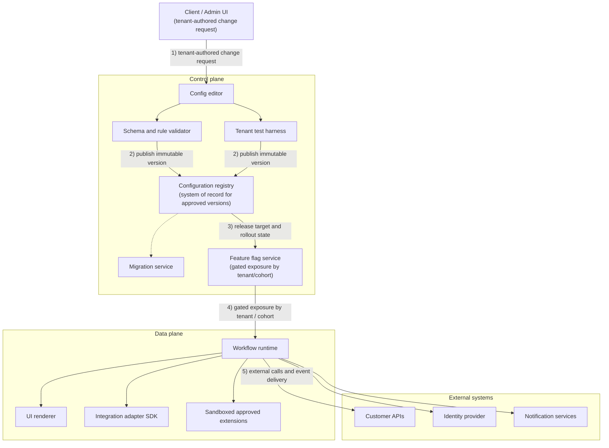
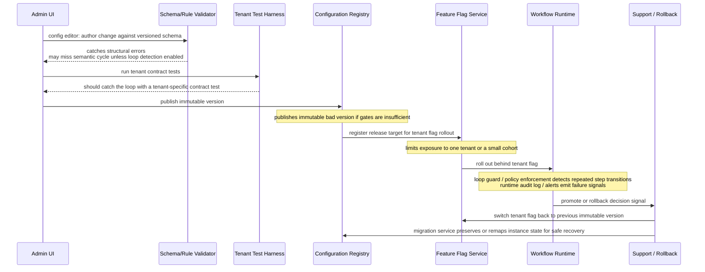

# Chapter 17: Design a Configurable Platform for Customer-Specific Workflows

*Source: THE FORWARD DEPLOYED ENGINEER SYSTEM DESIGN INTERVIEW, Chapter 17 (locations 15134–15992)*

## 1. The Customer Problem and Discovery

**Key Points**
- The customer meeting opens with agreement on the headline request ("one platform for similar workflows") but disagreement on almost everything that matters underneath it — fields, approval paths, auditability, and release process all vary by stakeholder.
- The FDE's first job is not to sketch services; it is to turn that ambiguity into a measurable outcome, restated as: build a configurable workflow platform that lets ten customers vary fields, approvals, branding, and integrations while keeping the shared product core stable, versioned, and supportable.
- The core reframing separates the requested feature ("configuration") from the business result (serving customer-specific workflows without fragmenting the product into ten incompatible forks) — that distinction is often the difference between sounding like an implementer and sounding like an FDE.
- A stakeholder map (end user, operator, security owner, executive sponsor, customer administrators, FDE teams, core platform engineers, support/release teams) constrains the design — missing any one group risks over-optimizing for flexibility or under-designing for operability.
- Discovery should ask fewer, higher-leverage questions rather than twenty generic ones — a small set that collapses uncertainty fastest, organized around workflow shape, control/ownership, risk/recovery, and success criteria.

The primary outcome should be expressed in testable terms: preserve a stable product core while allowing safe, versioned, supportable customization. "Safe" means changes do not bypass authorization or create unreviewed runtime behavior. "Versioned" means each customer can know which workflow definition is active and what changed. "Supportable" means support and release teams can diagnose issues, roll back a bad configuration, and reason about behavior across tenants.

**Map the people, not just the product.** The same request means different things to different stakeholders:
- Customer administrators care about who can change a workflow, what they can customize, and how quickly they can roll it out.
- FDE teams care about getting a real customer use case live without turning the platform into one-off custom code.
- Core platform engineers care about a durable model for workflow definitions, validation, permissions, and runtime execution.
- Support and release teams care about observability, rollback, incident response, and the ability to answer "what changed?"

A strong response identifies these groups early because each one constrains the design. If you miss the support team, you may over-optimize for flexibility and create a system nobody can operate. If you miss the core platform engineers, you may design a customer-specific layer that cannot be generalized. A concrete stakeholder map for this kind of problem can be stated in one line: end user (the customer employee who submits the workflow, approves it, or receives the final action); operator (the support or release team member who watches health, rolls back a bad config, and responds to incidents); security owner (the person accountable for permissions, auditability, and least privilege across tenants); executive sponsor (the business leader who wants one platform rollout instead of repeated forks and long customization projects).

**Ask fewer, higher-leverage discovery questions.** Under interview time pressure, the goal is not to ask twenty generic questions. It is to ask a small set that collapses uncertainty fastest.

*Start with workflow shape:*
- What stays common across customers, and what truly varies?
- Are variations limited to fields, approval routing, branding, and integrations, or do they extend to logic and lifecycle states?

*Then probe control and ownership:*
- Who is allowed to author and approve configuration changes?
- Is configuration self-serve for customer admins, or does an FDE or platform team mediate every change?

*Then probe risk and recovery:*
- What happens if a workflow is misconfigured?
- Can the customer tolerate a broken approval path, or do we need a guaranteed fallback?

*Then probe success:*
- What does "done" mean for the first customer: one workflow live, multiple teams onboarded, or all variations migrated?
- How will the customer judge success: lower manual handling, faster turnaround, fewer errors, or easier audits?

These questions do more than gather facts. They produce the artifacts the design needs: scope, assumptions, risks, owners, and success metrics. If the interviewer withholds information, state your assumptions out loud. For example: "I'll assume configuration is restricted to customer admins and approved by the vendor before it reaches production." That is not hedging; it is disciplined boundary setting.

**Turn discovery into an assumption ledger.** A good discovery pass yields four concrete outputs:
1. Scope: which parts are configurable and which remain fixed.
2. Assumptions: what you are temporarily accepting because the prompt did not specify it.
3. Risks: where a bad configuration, permission mistake, or integration failure could harm customers.
4. Success criteria: what measurable change proves the platform is working.

This is where jobs-to-be-done sharpens the design. The customer is not buying "a workflow engine." They are hiring the platform to remove the need for custom forks while still letting each tenant express its business process. That job-to-be-done pushes the architecture toward a stable core plus controlled extension points, instead of a codebase that mutates differently for each account.

A practical business outcome metric for this chapter is not a vanity count of configurable fields. It is the rate at which a new customer variation can be introduced without a fork, a hotfix, or a support escalation. Even if the interviewer never asks for a number, framing the outcome this way shows that you can connect product flexibility to operational durability.

**What a weak answer sounds like.** Weak, feature-first restatement: "We should build a flexible workflow system with forms, approvals, themes, and API hooks." Corrected, outcome-first restatement: "We need one shared workflow platform that lets each customer customize fields, approvals, branding, and integrations without forcing separate codebases, while keeping the core stable enough for versioning, support, and safe rollout." The second version is stronger because it exposes the trade-off the interviewer actually cares about: flexibility versus fragmentation.

**A concise opening answer you can use.** "Here's how I'd frame it. We have one workflow product, but ten customers need different fields, approval chains, branding, and system integrations. My goal is to preserve a stable shared core while allowing safe, versioned, supportable customization, so we do not end up with ten forks. I'd start by identifying which stakeholders own configuration, which variations are truly required, what failure modes are unacceptable, and how success will be measured for the first rollout. Then I'd design the architecture around controlled extension points, validation, and rollback rather than bespoke code paths." That opening does three things the interviewer wants to hear. It names the business problem, it names the stakeholders, and it makes clear that architecture comes only after the workflow owner, the risk owner, and the success metric are defined. That is the FDE move: translate customer language into a bounded technical problem, and only then choose the system design.

## 2. Clarifying Questions, Requirements, and Constraints

**Key Points**
- The fastest way to lose control of a configurable-workflow design is to accept the first generic answer ("we need flexibility") without asking flexibility for whom, under what governance, and with what upgrade promise.
- A strong FDE response separates requirement from preference and constraint from convenience — every customer asks for a slightly different surface area (fields, approvals, branding, integrations, and sometimes rules), and pinning down which differences recur is the first design fork.
- A six-question interview tree changes the design: which differences recur across customers, who authors configuration, what extension/integration needs are non-negotiable, what upgrade guarantees customers expect, where the custom-code security boundary sits, and what the time-to-configure target is.
- Requirements split into must-have functional capabilities (a stable engine, declarative schemas, an adapter interface, versioned configuration, controlled extension points, migration/rollback tooling) and measurable non-functional requirements (one release train, configuration isolation, backward-compatible upgrades, observable customer-specific behavior).
- Explicit non-goals prevent solution sprawl: the MVP does not support arbitrary customer-written code inside the engine, unlimited UI branching, a general-purpose rules language for every business process, deeply bespoke integration behavior bypassing the adapter contract, or automatic migration of every legacy config shape without operator review.

A strong FDE response starts by separating what is a requirement from what is a preference, and what is a constraint from what is merely convenient. In this problem, that distinction matters because every customer asks for a slightly different surface area: fields, approvals, branding, integrations, and perhaps some customer-specific rules. If you do not pin down which differences recur, who is allowed to author configuration, and where custom code stops, you will either underbuild the platform or overbuild a bespoke rules engine that cannot be safely supported.

**The clarifying questions that change the design.** A concise interview question tree keeps you from wandering into feature brainstorming.

1. **Which differences recur across customers?** This question separates a shared product pattern from one-off exceptions. If ten customers all need different approval chains, that is a platform capability. If one customer needs a seasonal override that nobody else uses, that is a likely exception path or unsupported edge case. The answer tells you whether the core abstraction should center on workflow steps, policy rules, form schemas, or integration orchestration.
2. **Who authors configuration?** This is not a staffing question; it is an architecture question. If configuration is written by internal engineers, you can tolerate more expressive power and sharper tools. If it is authored by customer admins or support teams, you need guardrails: validation, previews, narrower primitives, and safer defaults. This one question often changes the UX, the validation model, and the authorization model.
3. **What extension and integration needs are non-negotiable?** You want to know whether customers need outbound notifications, webhook callbacks, CRM sync, ticket creation, document generation, or authentication hooks. That answer determines the adapter interface and whether integrations are synchronous, asynchronous, or both. It also reveals whether failures should block a workflow transition or degrade gracefully.
4. **What upgrade guarantees do customers expect?** This is where product stability becomes a design constraint. If the customer expects configuration to survive core releases, you need versioning, migration tooling, backward-compatible schema evolution, and rollback paths. If the platform can break old configs on every release, you no longer have a stable product core; you have a perpetual services project.
5. **Where is the custom-code security boundary?** Some customers will ask for "just one small script" or "a custom validation hook." The important question is whether any custom code runs inside the trusted core, in a sandbox, or only through approved integration points. That boundary determines tenancy isolation, supply-chain scrutiny, and how aggressively you constrain execution. The safest answer is usually to make the core declarative and keep arbitrary code outside the main trust boundary.
6. **What is the time-to-configure target?** This sounds like a delivery question, but it is really a product and operations requirement. If new customer onboarding must happen in hours, the tooling must be self-service, validated, and low-friction. If a week is acceptable, you can tolerate more manual review. The target changes whether you optimize for admin UX, template reuse, automated testing, or partner onboarding.

Notice what these questions do: they turn "support customization" into specific design pressures.

**Prioritized requirements, not a feature grab bag.** For this kind of platform, the most defensible functional requirements usually land in a clear order.

*Must-have functional capabilities:*
- A stable workflow engine that can execute the same core lifecycle for every customer.
- Declarative schemas, rules, and UI metadata so customers can change fields, labels, visibility, and validation without code forks.
- An adapter interface for integrations so external systems can be connected without rewriting the engine.
- Versioned configuration and validation so changes can be reviewed, tested, and rolled back.
- Controlled extension points for the few places where declarative configuration is not enough.
- Migration and rollback tooling so version changes do not strand customers on incompatible configs.

The stable engine is the center of gravity. It gives you one release train, one operational model, and one support surface. Declarative schemas and rules keep most variation out of code. The adapter interface prevents every integration from becoming a special case. Versioning and validation are what make customization supportable instead of fragile. Extension points exist, but they should be narrow and explicit, not a blank check for arbitrary customer logic.

**Quality goals that must become measurable nonfunctional requirements:**
- One core release train: the platform ships as one product, not ten customer branches.
- Configuration isolation: one customer's settings, data, and test changes cannot bleed into another customer's runtime behavior.
- Backward-compatible upgrades: old configurations continue to work until a planned migration path is executed.
- Observable customer-specific behavior: when a workflow misbehaves, operators can see which config version, and which rule or adapter was involved.

These are not soft aspirations. They are constraints on the system shape. If you cannot observe customer-specific behavior, you cannot support it. If upgrades are not backward compatible, configuration becomes a liability. If isolation is weak, customization becomes a multi-tenant incident factory.

**The scope boundary: what the MVP will not do.** A good interview answer is explicit about non-goals, because non-goals prevent solution sprawl. For the MVP, I would not support:
- Arbitrary customer-written code inside the workflow engine.
- Unlimited branching of the UI for each customer's branding request.
- A general-purpose rules language that can express every possible business process.
- Deeply bespoke integration behavior that bypasses the adapter contract.
- Automatic migration of every legacy configuration shape without operator review.

Those exclusions are not a sign of weakness; they are the way you preserve the product core. The MVP should prove that ten customers can share one platform with safe variation, not that every conceivable workflow can be modeled on day one.

**A lightweight traceability table for the interview.** A useful way to organize the answer is to map each requirement to a component boundary.

| Requirement | Likely component |
|---|---|
| Stable workflow engine | Workflow runtime / orchestrator |
| Declarative schemas, rules, UI metadata | Config model, schema registry, admin UI |
| Adapter interface for integrations | Integration gateway / connector layer |
| Versioned configuration and validation | Config service, validator, release pipeline |
| Controlled extension points | Sandbox or plugin boundary |
| Migration and rollback tooling | Deployment and ops tooling |
| One core release train | Shared platform build and release process |
| Configuration isolation | Tenant-aware data and authorization layer |
| Backward-compatible upgrades | Schema evolution and compatibility checks |
| Observable customer-specific behavior | Audit logs, metrics, tracing, config-version tags |

This traceability is valuable in an interview because it shows you can move from requirements to system decomposition without hand-waving.

**How to answer when the interviewer gives you only half the facts.** In this scenario, the interviewer may answer only some of your questions. That is intentional. When the answer is partial, do not freeze; choose reasonable assumptions and protect the highest-risk constraint. For example: if the interviewer tells you the customers are similar but refuses to specify who authors configuration, assume a mixed model: customer admins can edit safe declarative fields, while internal ops approve schema changes and extensions. That assumption protects the most fragile part of the system — the boundary between safe customization and unsafe code. This is the job-market signal the interviewer is looking for: customer discovery under ambiguity, prioritization under incomplete information, and the discipline to preserve delivery by narrowing scope instead of widening it.

**A strong candidate move.** The best answer is not "build everything flexible." It is: identify recurring differences, determine who owns configuration, define the integration and upgrade promise, set a clear custom-code boundary, and then commit to a stable workflow engine with declarative configuration, versioning, and strict validation. That sequence shows you know how to convert discovery into an implementable plan instead of a feature list. That is the FDE move: ask questions that change the design, then move forward with explicit assumptions instead of waiting for perfect information.

## 3. Scale Estimates, SLOs, and Capacity

**Key Points**
- The first pass at this design usually sounds elegant — one shared workflow engine, one configuration store, one validator, one deployment pipeline — but that picture breaks once you put a deadline on it; the right estimate is not "how many customers do we have?" but "how many config changes, validations, activations, and approval events do we have at once, and what happens near a deadline?"
- Under an illustrative assumption of 100 tenants, 50 workflow templates, and 1,000 configuration versions per day, the platform must safely absorb a mix of small edits, bulk template updates, and bursty release windows — the peak (e.g., ~250 versions/hour in a 2-hour business window) matters more than the average (~42 versions/hour).
- Four capacity-shaping estimates matter most, in the order that changes architecture: version intake/validation throughput, deployment throughput, limits on expressive power (fields, custom rules, plugin execution), and state growth/retention.
- Six SLOs must map to customer pain, not just technical health: availability, latency, freshness, quality, security, and cost — each tied to a concrete question an operator or customer would ask.
- Leverage (customers served by a shared capability, divided by engineering effort) is the interview-friendly equation for deciding what belongs in core product versus configuration versus an adapter; a sensitivity table across baseline/moderate/aggressive growth scenarios shows how 10x growth can force a different partitioning strategy, not just more capacity.

**Start with the load shape, not the marketing shape.** The first pass at this design usually sounds elegant: one shared workflow engine, one configuration store, one validator, one deployment pipeline. At average load, that picture is plausible. It breaks when you put a deadline on it.

This is the revision point the interviewer is looking for. The platform is not just serving edits; it is validating, versioning, approving, deploying, and sometimes rejecting changes before a customer's business process stalls. So the right estimate is not "How many customers do we have?" but "How many config changes, validations, activations, and approval events do we have at once, and what happens near a deadline?"

Assume 100 tenants, 50 workflow templates, and 1,000 configuration versions per day. That does not mean every tenant ships ten versions per day; it means the platform must safely absorb a mix of small edits, bulk template updates, and bursty release windows. If 1,000 versions/day are spread unevenly, the average is easy: about 42 versions/hour. The peak matters more. If half of daily changes land in a 2-hour business window, the platform needs to handle roughly 250 versions/hour, before retries, validation failures, or approval re-submissions. Add a growth factor and a realistic headroom target, and you should design for materially more than the average — often several times more — so you can survive release-day spikes without turning configuration into an outage.

**Work through the envelope step by step.** The useful interview habit is to estimate in the order that changes architecture.

1. **Version intake and validation throughput.** Each configuration version may trigger schema checks, policy checks, dependency checks, and simulation or dry-run validation. If validation takes 2–10 seconds of CPU-bound work or a few network calls, then the system must separate synchronous user feedback from asynchronous deeper checks. The immediate SLO is usually "did the edit save and return a clear result quickly?"; the deeper guarantee is "did the platform complete validation and either promote or reject the version before the customer's deployment window closes?"
2. **Deployment throughput.** If 1,000 versions/day are submitted but only a fraction are promoted, deployment load is smaller than validation load. Still, deployments can fan out across tenants, regions, or integrations. A single promoted template update might touch dozens of workflow instances or enqueue downstream sync jobs. That means deployment capacity is driven by fan-out, not just the count of human edits.
3. **Limits for expressive power.** Put hard limits on rules, custom fields, and plugin execution early, because those limits shape runtime cost. For example, you may allow a moderate number of fields per form, a bounded number of rule clauses per transition, and short plugin execution windows with memory and network restrictions. Those limits are not arbitrary — they prevent one customer's customization from consuming the shared service budget of everyone else.
4. **State growth and retention.** Configuration history grows more slowly than event history, but it still matters. A platform with 100 tenants and 50 templates can accumulate a large number of versions if every update is preserved. The storage question is not only "how many records?" but "what must be retained for audit, rollback, and support, and for how long?" Keep the version graph compact, store deltas where useful, and make rollback metadata first-class.

**Tie the SLOs to the workflow itself.** Technical SLOs are only useful when they map to customer pain. For a configurable workflow platform, the meaningful indicators are:
- **Availability:** Can users load the workflow editor, validate changes, and activate a version when they need to?
- **Latency:** How long does the editor wait for save, validation preview, or approval routing results?
- **Freshness:** After a configuration is approved, how quickly does the new version become active in the runtime path?
- **Quality:** What fraction of deployments are rejected by validation, rolled back, or require manual intervention?
- **Security:** Are tenant boundaries, approval permissions, plugin permissions, and audit trails enforced at the right control points?
- **Cost:** What is the cost per validated version, per activated template, or per thousand workflow executions, and how does that change when customers add rules or plugins?

A common latency budget here is to reserve the user-facing edit path for quick feedback and push expensive checks into asynchronous processing. That means the latency budget is not one number; it is a partitioned budget. For example, save might need to feel interactive, validation preview can tolerate a little more delay, and full deployment can be slower as long as it is reliable and observable. The wrong design is to make every step synchronous because it feels simpler.

**Leverage tells you what belongs in core.** The core decision is whether a capability belongs in shared product code, in configuration, or in an adapter around a customer-specific integration. The interview-friendly equation is:

$$ Leverage=\frac{Customers\ served\ by\ shared\ capability}{Engineering\ effort} $$

Interpretation matters more than arithmetic. High leverage means a capability pays off across many tenants and should usually live in the core product or a reusable shared service. Low leverage means the feature mostly serves one customer or one integration path, so it belongs in configuration, an adapter, or a narrowly scoped extension. If one approval model is used by 80 tenants, that model deserves first-class support. If one customer's edge-case approval chain requires fragile behavior that no one else needs, do not drag the whole platform into that shape. The support-cost side of the equation matters too: a feature that seems reusable but creates expensive onboarding, debugging, or upgrade friction may have worse real leverage than a simpler, narrower design.

**A whiteboard estimate that changes the component choice.** Suppose you start by keeping validation inside the same API that saves configuration. That seems fine until you estimate peak load. If the API must both persist the change and run heavy validation, the worst-case request time grows with the slowest rule set or plugin call. The result is a brittle control plane: one slow tenant can tie up capacity that every other tenant needs.

Once you estimate peak validation throughput and the fan-out of deployment work, the architecture shifts. Save should be fast and durable. Validation should be queued, bounded, and observable. Deployment should be idempotent, retryable, and separated from authoring traffic. This is the estimate that most strongly affects component selection and partitioning: the rate and cost of validation/deployment, not the raw count of tenants.

**Show the sensitivity range, not fake precision.** Interviewers do not need a spreadsheet pretending to be exact. They need to see whether you understand how the design behaves when the assumptions move.

| Scenario | Daily config versions | Peak factor | Operational implication |
|---|---|---|---|
| Baseline | 1,000 | 3x | Single shared validator may be enough if work is mostly asynchronous |
| Moderate growth | 10,000 | 3x–5x | Queue separation, worker pools, stricter limits on plugin time |
| Aggressive growth | 10x baseline | 5x+ | Stronger tenant isolation, sharded queues, explicit per-tenant quotas |

This is the useful sensitivity table: 10x growth does not just increase cost; it can force a different partitioning strategy. The same is true for custom fields and rules. If customers move from small forms to highly branched forms with many calculated fields, the platform may need compile-time validation, partial evaluation, or cached execution plans. If plugin execution becomes common, you may need sandboxing or an adapter boundary instead of direct in-process execution.

**Average versus peak, and why headroom is a product feature.** Average load tells you whether the system is economically plausible. Peak load tells you whether customers trust it on their worst day. Headroom is the difference between the two, and it is not wasted capacity — it is what keeps a release window, an approval rush, or a large tenant onboarding event from becoming the moment the platform betrays its promise.

That is also where unit economics show up. The question is not only "Can we afford to run this?" but "Can we afford to run this with the support burden it creates?" A design with low runtime cost but high operational toil may lose to a slightly more expensive design that is easier to support, roll back, and explain. In an FDE interview, that trade-off is usually the right one to name explicitly.

**What a strong answer sounds like in practice.** A strong candidate will say, in effect: given 100 tenants, 50 templates, and 1,000 versions/day, the platform must be optimized for bursty validation and controlled deployment, not just average edit traffic. I would keep the authoring path fast, offload expensive checks, bound rules and plugin execution, and add headroom for peak business windows. I would put high-leverage behaviors in core, keep customer-specific oddities in config or adapters, and use SLOs that map to the customer workflow: save, validate, approve, activate, and audit. That is the pragmatic capacity decision the interviewer is testing for: not whether you can multiply by 10, but whether you can avoid overengineering while still protecting the shared platform.

**Decision rule to carry forward.** Treat every estimate as a design lever. If a number does not change a component boundary, a queue, a quota, a latency budget, or a support process, it is probably trivia. If it does, write it down and defend it. Estimates are decision tools; each number should justify an architectural choice or operational limit.

## 4. Architecture and End-to-End Flow

**Key Points**
- The cleanest way to explain this system is to walk one tenant request all the way through, then replay it when a dependency is unhealthy — the hidden constraint is that one customer's custom approval logic may be dangerous if it can alter shared runtime behavior.
- The architecture splits into a **control plane** (authors, validates, versions, and promotes configuration) and a **data plane** (executes live workflow instances) — that separation keeps risky change management out of the hot path and is the first place to point when an interviewer asks where the trust boundary sits.
- Nine core components are introduced in dependency order, each with responsibility, state ownership, and typical trust boundary: workflow runtime, configuration registry, schema/rule validator, UI renderer, integration adapter SDK, feature flag service, sandbox for approved extensions, migration service, and tenant test harness.
- The architecture diagram is deliberately top-down with explicit trust boundaries (client/admin UI → control plane → configuration registry → feature flag service → data plane → external systems), and a failure-path overlay shows how the same architecture contains an infinite-approval-loop incident at each layer.
- A 10-step sequence diagram (with named participants) narrates the happy path from authoring to promotion; a separate failure overlay narrates the same path when a loop-detection gap lets a bad config through, showing detection, containment, and recovery at each layer.

**Start with the request, not the boxes.** The cleanest way to explain this system is to walk one tenant request all the way through, then replay it when a dependency is unhealthy. The customer asks for something simple on the surface: the same workflow should serve ten customers, but each tenant wants different fields, approvals, branding, and integrations, without forcing ten separate forks. The hidden constraint is that one customer's custom approval logic may be dangerous if it can alter shared runtime behavior. So the architecture has to preserve a stable product core while allowing safe, versioned, supportable customization.

At a high level, the design splits into a **control plane** that authors, validates, versions, and promotes configuration, and a **data plane** that executes live workflow instances. That separation keeps risky change management out of the hot path. The control plane owns config editing, schema checks, tenant contract tests, and release promotion. The data plane owns workflow execution, UI rendering at runtime, connector calls, and audit events. If an interviewer asks where the trust boundary sits, this is the first place to point.



Trust boundaries sit between tenant-authored content and platform-owned execution, and again between platform execution and external dependencies. Tenant-authored config should never be treated like code with full platform trust. Approved extensions are still untrusted enough to deserve isolation and quotas. External systems are not under your control, so every adapter call needs timeouts, retries, idempotency where applicable, and a backoff policy that does not amplify failures.

**Core components in dependency order.** The components should be introduced in the order they depend on one another, not in the order they are easiest to name.

| Component | Responsibility | State ownership | Typical boundary |
|---|---|---|---|
| Workflow runtime | Executes workflow instances, step transitions, timers, and retries | Runtime state, execution history | Data plane; synchronous for step decisions, asynchronous for long-running work |
| Configuration registry | Stores versioned configs, schemas, and release metadata | Immutable config versions | Control plane; system of record for published config |
| Schema and rule validator | Checks syntax, semantic constraints, permissions, and compatibility | Validation results only | Control plane; synchronous on save/publish |
| UI renderer | Generates tenant-specific forms, labels, and layouts from approved config | None beyond cache | Mostly data plane; synchronous render, cached descriptors |
| Integration adapter SDK | Standard interface for CRM, ERP, ticketing, and webhook adapters | Adapter definitions, credentials references | Data plane edge to external systems |
| Feature flag service | Gates rollout by tenant, cohort, or percentage | Flag state | Cross-cutting control plane to data plane |
| Sandbox for approved extensions | Runs narrowly scoped customer logic or plugins with hard limits | Ephemeral execution only | Isolated boundary; synchronous if small, otherwise async |
| Migration service | Rewrites older configs into new schema versions or migrates instances forward | Migration jobs, compatibility mappings | Control plane; usually asynchronous |
| Tenant test harness | Replays tenant-specific contract tests before release | Test fixtures, expected outcomes | Control plane; synchronous approval gate or async batch |

Every box should earn its place. The validator exists because the registry must never become a junk drawer. The flag service exists because "publish" and "expose to every tenant" are not the same action. The sandbox exists because approved extensions are useful, but arbitrary execution in the runtime is how you turn customizability into incident response.

**Top-down architecture and trust boundaries.** A useful diagram in an interview is less about artistry and more about showing ownership, flow, and risk. The design above preserves that structure: tenant-authored change requests flow through the control plane (config editor → schema/rule validator and tenant test harness → configuration registry as the system of record for approved config versions → feature flag service for gated exposure by tenant/cohort), then into the data plane (workflow runtime, UI renderer, integration adapter SDK, sandboxed approved extensions), and finally out to external systems (customer APIs, identity provider, notification services) for external calls and event delivery.

**Failure-path overlay on the architecture.** The same architecture, annotated for the infinite-approval-loop failure drill, makes the blast radius visible.



This overlay is the interview-friendly way to show that failure containment is not an afterthought. The validator, test harness, and flags each reduce blast radius at a different stage. If one layer misses the defect, the later layers still prevent a tenant-wide incident.

**Sequence diagram: happy path.** A strong candidate can narrate the live release path step by step:
1. **Author config against a versioned schema.** A product manager, implementation engineer, or customer admin edits the workflow definition, field layout, approval graph, and adapter mappings.
2. **Validate syntax and semantic constraints.** The schema and rule validator checks structure, allowed field types, approval graph sanity, reference integrity, permissions, and compatibility with the tenant's enabled features.
3. **Run tenant contract tests.** The tenant test harness replays representative scenarios: form submission, approval routing, edge-case inputs, and integration stubs.
4. **Publish an immutable version.** The configuration registry stores the exact artifact, version tag, schema version, author, and release metadata. This is the system of record for what was approved.
5. **Roll out behind a tenant flag.** The feature flag service exposes the version to a single tenant, then a cohort, then broader traffic if the behavior is stable.
6. **Observe behavior.** The platform watches validation failures, step latency, adapter error rates, approval-loop detection, and user completion metrics.
7. **Promote or rollback.** If the release meets the acceptance gate, it becomes the active version. If not, the flag moves back, or the tenant is pinned to the prior immutable version.

The important nuance is that "publish" does not mean "activate everywhere." That separation is what keeps a bad config from becoming a broad outage.

**Sequence and failure overlay narration.** The same path, repeated with a failure, is where architecture becomes memorable. Imagine the customer config accidentally creates an infinite approval loop:
- The author saves the change.
- Validation catches structural mistakes, but the approval graph is still semantically legal unless the rule set explicitly detects cycles.
- The tenant test harness runs the happy path and a loop-detection test.
- If the loop is missed, rollout behind the tenant flag limits blast radius.
- The workflow runtime starts the instance, then sees repeated step transitions that never converge.
- A guardrail in the runtime or policy engine trips a loop threshold, marks the instance as blocked, and emits an alert.
- The support engineer rolls back to the previous immutable version while the migration service preserves state needed to resume safely once the fix is ready.

That failure path is the right place to discuss synchronous versus asynchronous boundaries. Validation and contract testing are synchronous gates because they must block promotion. Migration and bulk replay and some integration recovery actions are better asynchronous because they should not hold the user's request open. The workflow runtime itself often mixes both: quick step decisions synchronously, external side effects asynchronously when the dependency is slow or unreliable.

**Systems of record, caches, queues, and backpressure.** Marking the right storage and transport roles is part of the design, not an afterthought.
- **System of record:** the configuration registry for published versions, and usually the workflow audit store for execution history.
- **Caches:** compiled schema descriptors, rendered form layouts, adapter metadata, and recent flag decisions.
- **Queues:** adapter jobs, retries, event delivery, migration tasks, and test harness batches.
- **Backpressure and flow control:** the runtime should shed or delay noncritical work when adapter queues grow, rather than allowing retries to stampede external systems.

Partitioning also matters. A sensible partitioning key is usually tenant ID, sometimes combined with workflow definition ID or environment. That keeps noisy tenants from corrupting everyone else's latency profile, makes replay easier, and gives you a natural place to enforce quotas. If a customer has an unusually heavy approval storm, the partition should contain the blast radius.

**MVP versus later evolution.** For MVP, keep the architecture brutally simple: a versioned registry, validator, runtime, feature flags, tenant test harness, and a small adapter SDK. Add only the smallest sandbox needed for approved extensions. Favor immutable config versions and clear rollback over a more exotic live-edit system. Later evolution can add cross-tenant config templates, richer migration automation, a broader plugin marketplace, and deeper observability into tenant behavior. Those are valuable, but only after the core release path is stable and supportable.

**Why this is a strong FDE answer.** This architecture demonstrates system decomposition and the ability to communicate the same design to customer and engineering stakeholders. You can explain to a customer why their workflow will be customizable without becoming fragile, and explain to the platform team where the trust boundaries, rollout gates, and rollback levers live. The diagram is useful only when you can narrate data, identity, state, and failure through it: who authored the config, who owns the version, where execution state lives, what fails when an adapter is down, and how the platform recovers without guessing. The practical takeaway is simple: preserve a stable product core while allowing safe, versioned, supportable customization.

**90-second interview summary.** "I would separate a control plane from a data plane. The control plane handles authoring, schema and rule validation, tenant contract tests, immutable versioning, and rollout through feature flags. The data plane runs the workflow runtime, UI rendering, and adapter calls. The configuration registry is the system of record for published versions, and the runtime reads only approved releases. Tenant ID is the main partitioning key, with queues and backpressure protecting external dependencies. The riskiest trade-off is how much customer logic to allow in approved extensions versus keeping everything in declarative config. For an MVP, I would keep extensions narrow, require versioned configs, and gate every release behind a tenant test harness and staged flag rollout. The first production rollout gate is a single tenant with a rollback path that can be executed immediately."

## 5. Data Model, APIs, and Working Code

**Key Points**
- The fastest way to make this design interview credible is to stop speaking in abstractions and pin the hardest parts to concrete state, contracts, and a small amount of code: what is the durable record, what is mutable, what is versioned, what is deployed, and what happens when the same request arrives twice.
- A configurable workflow platform lives or dies by its data model — four records do most of the work: `WorkflowTemplate` (the reusable blueprint, immutable once published), `TenantConfig` (the customer-specific overlay, lifecycle draft→validated→deployed/rolled_back), `AdapterDefinition` (the integration contract, with a `permissions` field so the platform can reject unsafe adapter requests), and `ConfigDeployment` (the append-only deployment ledger that answers "which version is live right now?").
- That ownership split prevents accidental coupling: the template is product-owned, the tenant config is customer-owned, the adapter contract is integration-owned, and the deployment record is ops-owned.
- Four explicit API contracts are defined with authentication, authorization, idempotency-key requirements, and error codes: `POST /v1/configurations/validate`, `POST /v1/tenants/{id}/deployments`, `POST /v1/adapters/{name}/test`, and `POST /v1/deployments/{id}/rollback`.
- The smallest safe code path is a TypeScript sketch of config publication: a `WorkflowConfig` type, a `validateWorkflowConfig` boundary-validation function, `validatePolicy` (duplicate-approval-role detection), `validateAdapterMappings` (unknown-adapter and empty-key detection), a `Registry` class with `putImmutable` (versioned writes, never overwrites), and a `publish` function that composes parse → validate → authorize-by-policy → persist in that order — plus contract and failure-injection tests (vitest) proving idempotent deployment creation and closed-failure rejection of an unsafe adapter mapping.

The fastest way to make this design interview credible is to stop speaking in abstractions and pin the hardest parts to concrete state, contracts, and a small amount of code. When a customer says, "We need the same workflow shape, but our fields, approvals, and integrations are different," the architecture only matters if you can answer: what is the durable record, what is mutable, what is versioned, what is deployed, and what happens when the same request arrives twice.

**Core records and ownership.** A configurable workflow platform lives or dies by its data model. Four records do most of the work:

- **`WorkflowTemplate(id, engine_version, schema)`**: the reusable blueprint owned by the product or platform team. The primary key is `id`, and `engine_version` tells the runtime which evaluator or renderer understands the template. `schema` describes the allowed shape of fields, approvals, and integrations. Lifecycle-wise, templates move from `draft` to `published`, and only a new template version can change behavior; the published artifact is immutable. Retention-wise, published templates should be kept for the life of the product or for the customer contract window so old tenant configs can still resolve against the exact template they were validated with, while drafts can be garbage-collected after a safe inactivity period. This record should be immutable once published; if the template changes materially, create a new version instead of rewriting history.
- **`TenantConfig(tenant_id, template_id, version, values)`**: the customer-specific overlay. The primary key is effectively `(tenant_id, version)` because tenants can keep multiple versions in draft, test, or published state. `values` holds only the tenant-specific parameters allowed by the template schema. Lifecycle-wise, a tenant config moves from `draft` to `validated` to `deployed` or `rolled_back`; a failed validation returns it to `draft` or `needs_fix` without changing its version. Retention-wise, keep all published and rolled-back versions for auditability and rollback, and retain drafts only until the tenant abandons or replaces them according to platform policy. The tenant owns the business meaning of these values; the platform owns validation and persistence.
- **`AdapterDefinition(name, contract_version, permissions)`**: the integration contract for a downstream system, such as CRM, ticketing, storage, or messaging. The key is `name` and `contract_version`; `permissions` records what scopes or capabilities are required so the platform can reject a config that asks for an adapter it cannot safely invoke. Lifecycle-wise, adapter definitions are usually managed by the platform or integrations team, published as versioned contracts, and retired only after no active tenant config depends on them. Retention-wise, keep retired definitions long enough to support historical deployments and troubleshooting, but mark them inactive so new configs cannot select them.
- **`ConfigDeployment(tenant_id, version, state)`**: the deployment ledger. This is the source of truth for whether a config is `draft`, `validated`, `deployed`, `rolled_back`, or `failed`. The deployment record is what operations and support teams inspect when a tenant asks, "Which version is live right now?" Lifecycle-wise, deployments are append-only state transitions rather than in-place rewrites, so a rollback becomes a new deployment event pointing back to a prior good version. Retention-wise, keep deployment history for the full support and audit window because it is the operational ledger for incident review, customer support, and change tracking.

That ownership split matters because it prevents accidental coupling. The template is product-owned, the tenant config is customer-owned, the adapter contract is integration-owned, and the deployment record is ops-owned. If those responsibilities blur, you get forks disguised as flexibility.

**Contract first, then code.** The interview-sized implementation should show one constrained declarative workflow contract and a write path that refuses unsafe input before it reaches the registry. The purpose is not to build a full workflow engine. The purpose is to prove that the platform can accept a bounded configuration, validate it, and publish it immutably.

The external contract set should be explicit:

- `POST /v1/configurations/validate`: accepts a draft tenant config, returns validation errors, a normalized preview, and never publishes state. Authentication should require a tenant-scoped bearer token or session bound to the caller's tenant, and authorization should only allow validating configs for tenants the caller can administer. The request body should include `template_id`, `version`, `values`, and ideally an `idempotency_key` if the platform wants replayable validation traces, though the endpoint can also be safely retried without write effects. Response semantics should be `200 OK` for a successful validation preview, `400 Bad Request` for structural issues, `403 Forbidden` for tenant mismatch or missing rights, and `422 Unprocessable Entity` for schema or policy violations that make the draft invalid.
- `POST /v1/tenants/{id}/deployments`: creates a deployment for a tenant, typically from a validated config version, and returns a deployment ID plus state. Authentication must bind the caller to the tenant `{id}` or a delegated ops role, and the server should reject cross-tenant deployment attempts. This is a create-style operation and therefore must require an idempotency key; repeated requests with the same key and identical body should return the same deployment result, while the same key with a changed body should return `409 Conflict`. Expected errors include `401 Unauthorized` for missing or expired credentials, `403 Forbidden` for missing tenant permission, `404 Not Found` if the referenced config version does not exist, `409 Conflict` for stale optimistic concurrency tokens or idempotency-key reuse with a different payload, and `422 Unprocessable Entity` when the config passes syntax but fails policy.
- `POST /v1/adapters/{name}/test`: exercises an adapter mapping against a safe test payload or sandbox endpoint. Authentication should be scoped to integration-maintainer or tenant-admin permissions, depending on who is allowed to validate the mapping. It should accept an adapter name, test payload, mapping, and optionally a sandbox selector. This endpoint should also accept an idempotency key so a noisy client does not generate duplicate test executions or duplicate audit records. Errors should include `404 Not Found` if the adapter name is unknown, `403 Forbidden` if the caller lacks permission to test it, `422 Unprocessable Entity` if the mapping cannot be applied, and `502 Bad Gateway` or a similar integration error if the sandbox dependency fails.
- `POST /v1/deployments/{id}/rollback`: creates a new rollback state for the same tenant rather than mutating the old deployment in place. Authentication should be tenant-scoped with elevated ops permission or an explicit approval path. The rollback request should name the target deployment or prior good version and include an idempotency key because rollback is a write operation that may be retried under failure. Success should return the new deployment record, not overwrite the prior one. Typical errors are `404 Not Found` when the deployment ID does not exist, `409 Conflict` when the current live state has moved on in a way that makes the rollback unsafe, and `422 Unprocessable Entity` if the target version is no longer compatible with the current template or adapter contract.

These endpoints should require tenant-aware authentication and authorization. The platform should reject cross-tenant writes, require an idempotency key on create-style operations, and return the same result for repeated requests with the same key and same request body. If the body changes for a reused idempotency key, that should be a conflict, not a silent update.

**The smallest safe code path.** The candidate should zoom into the highest-risk component: config publication. That is where unsafe structure, invalid mappings, or broken versioning can create outages. The following sketch is intentionally narrow, but it shows the control points that matter in production.

```typescript
type JsonValue = string | number | boolean | null | JsonValue[] | { [key: string]: JsonValue };
type JsonLogic = { op: string; args?: JsonValue[] };

type WorkflowConfig = {
  version: 1;
  fields: Array<{ key: string; type: "text" | "number" | "date"; required: boolean }>;
  approvals: Array<{ when: JsonLogic; role: string; slaHours: number }>;
  integrations: Array<{ adapter: string; mapping: Record<string, string> }>;
};

type ValidationError = { path: string; code: string; message: string };

type PublishResult =
  | { ok: true; configId: string; version: number }
  | { ok: false; errors: ValidationError[] };

class ConfigValidationError extends Error {
  constructor(public errors: ValidationError[]) {
    super("Configuration validation failed");
  }
}

function isPlainObject(value: unknown): value is Record<string, unknown> {
  return typeof value === "object" && value !== null && !Array.isArray(value);
}

function validateWorkflowConfig(input: unknown): WorkflowConfig {
  const errors: ValidationError[] = [];

  if (!isPlainObject(input)) {
    throw new ConfigValidationError([{ path: "$", code: "invalid_type", message: "Expected an object" }]);
  }

  if (input.version !== 1) {
    errors.push({ path: "version", code: "unsupported_version", message: "Only version 1 is supported" });
  }

  if (!Array.isArray(input.fields) || input.fields.length === 0) {
    errors.push({ path: "fields", code: "required", message: "At least one field is required" });
  }

  if (!Array.isArray(input.approvals)) {
    errors.push({ path: "approvals", code: "invalid_type", message: "Approvals must be an array" });
  }

  if (!Array.isArray(input.integrations)) {
    errors.push({ path: "integrations", code: "invalid_type", message: "Integrations must be an array" });
  }

  if (errors.length > 0) {
    throw new ConfigValidationError(errors);
  }

  return input as WorkflowConfig;
}

function validatePolicy(config: WorkflowConfig): void {
  const seenRoles = new Set<string>();
  for (const approval of config.approvals) {
    if (!approval.role || approval.slaHours <= 0) {
      throw new ConfigValidationError([
        { path: "approvals", code: "invalid_approval", message: "Each approval must have a role and positive SLA" },
      ]);
    }
    if (seenRoles.has(approval.role)) {
      throw new ConfigValidationError([
        { path: "approvals", code: "duplicate_role", message: `Duplicate approval role: ${approval.role}` },
      ]);
    }
    seenRoles.add(approval.role);
  }
}

function validateAdapterMappings(config: WorkflowConfig, allowedAdapters: Set<string>): void {
  for (const integration of config.integrations) {
    if (!allowedAdapters.has(integration.adapter)) {
      throw new ConfigValidationError([
        { path: "integrations", code: "unknown_adapter", message: `Unknown adapter: ${integration.adapter}` },
      ]);
    }
    for (const [from, to] of Object.entries(integration.mapping)) {
      if (!from || !to) {
        throw new ConfigValidationError([
          { path: `integrations.${integration.adapter}.mapping`, code: "invalid_mapping", message: "Mappings must not contain empty keys" },
        ]);
      }
    }
  }
}

class Registry {
  private store = new Map<string, { version: number; config: WorkflowConfig; hash: string }>();

  putImmutable(configId: string, config: WorkflowConfig): { version: number } {
    const existing = this.store.get(configId);
    const nextVersion = existing ? existing.version + 1 : 1;
    const hash = JSON.stringify(config);
    this.store.set(configId, { version: nextVersion, config, hash });
    return { version: nextVersion };
  }
}

function publish(configId: string, raw: unknown, allowedAdapters: Set<string>, registry: Registry): PublishResult {
  try {
    const config = validateWorkflowConfig(raw);
    validatePolicy(config);
    validateAdapterMappings(config, allowedAdapters);
    const result = registry.putImmutable(configId, config);
    return { ok: true, configId, version: result.version };
  } catch (error) {
    if (error instanceof ConfigValidationError) {
      return { ok: false, errors: error.errors };
    }
    return {
      ok: false,
      errors: [{ path: "$", code: "internal_error", message: "Unexpected failure during publish" }],
    };
  }
}
```

Line by line, the important teaching points are visible. The `WorkflowConfig` type constrains the shape to a versioned declarative contract. The `JsonValue` and `JsonLogic` aliases make approval conditions explicit without opening the door to arbitrary code. `ValidationError` gives the API a stable error vocabulary. `validateWorkflowConfig` is typed boundary validation: it rejects malformed payloads before business logic sees them. `validatePolicy` separates structural correctness from authorization and workflow rules. `validateAdapterMappings` checks the integration surface against an allowlist rather than trusting the config author. `Registry.putImmutable` models versioned writes instead of overwrite semantics. `publish` composes the checks in the only order that makes sense: parse, validate, authorize-by-policy, then persist.

**What the whiteboard version omits on purpose.** A real service would add optimistic concurrency, retry behavior, and observability hooks. Optimistic concurrency means the write boundary should carry an expected template or config version so two operators cannot race and overwrite each other's change unnoticed. Idempotency means a retry after a timeout should not create a second deployment or version. Retries should be limited to safe failure classes and should never replay a rejected validation or authorization failure as though it were transient. Observability should tag every validation, deployment, adapter test, and rollback with tenant ID, config version, request ID, and idempotency key so support can trace exactly what happened without reading application logs line by line.

**A small but important duplicate-request example makes the behavior concrete.** Suppose an ops client sends `POST /v1/tenants/acme/deployments` with idempotency key `deploy-2024-11-18-001` and body `{configVersion: 17, templateId: "tpl-9"}`. The server creates deployment `dep-555` and returns `201 Created` with `deployment_id=dep-555`, `state=deployed`, and the same idempotency key recorded in the write log. If the same client retries the same request after a timeout, the platform must not create `dep-556`; it should return the exact same deployment result for `dep-555`, ideally with the same body or a `200 OK` / `201 Created` equivalent depending on the API convention. If the client reuses `deploy-2024-11-18-001` but changes the body to `{configVersion: 18, templateId: "tpl-9"}`, the platform should reject it as a conflict because the idempotency key no longer matches the payload.

**Failure-proofing with tests.** A good interview answer includes both a contract test and a failure-injection test.

```typescript
import { describe, it, expect } from "vitest";

describe("publish", () => {
  it("rejects duplicate approval roles and returns a structured validation error", () => {
    const registry = new Registry();
    const result = publish(
      "cfg-1",
      {
        version: 1,
        fields: [{ key: "requester", type: "text", required: true }],
        approvals: [
          { when: { op: "always" }, role: "manager", slaHours: 24 },
          { when: { op: "always" }, role: "manager", slaHours: 24 },
        ],
        integrations: [],
      },
      new Set(["crm"]),
      registry,
    );

    expect(result.ok).toBe(false);
    if (!result.ok) {
      expect(result.errors[0].code).toBe("duplicate_role");
    }
  });

  it("survives an adapter allowlist miss without publishing state", () => {
    const registry = new Registry();
    const result = publish(
      "cfg-2",
      {
        version: 1,
        fields: [{ key: "requester", type: "text", required: true }],
        approvals: [{ when: { op: "always" }, role: "manager", slaHours: 24 }],
        integrations: [{ adapter: "unknown", mapping: { a: "b" } }],
      },
      new Set(["crm"]),
      registry,
    );

    expect(result.ok).toBe(false);
  });
});
```

The first test is the contract test: it proves the API rejects a structurally valid but policy-violating configuration. The second is the failure-injection test: it simulates an unsafe adapter definition and verifies that the publish path fails closed. In a real service, you would extend this with duplicate idempotency-key tests, deployment rollback tests, and a concurrency test that shows stale versions are rejected.

The job-market signal here is strong: an FDE who can move from the customer's workflow pain to a state model, then to API semantics, then to production-grade validation code is operating at the level hiring teams actually need. That is the difference between "I can sketch a system" and "I can ship a supportable platform."

The final interview takeaway is simple: a design answer becomes credible when its state transitions, API contracts, and failure-safe code are concrete. If you can name the records, define the write boundaries, explain idempotency and versioning, and show the smallest safe implementation that rejects bad input before it reaches the registry, you are already speaking like someone who can preserve a stable product core while allowing safe, versioned, supportable customization.

## 6. Security, Reliability, and Failure Handling

**Key Points**
- A security-and-ops review is where this design either becomes shippable or collapses into "works in the demo" — start by assuming the worst plausible version of the customer request: a tenant wants highly flexible workflow customization, but the platform must still preserve a stable core, keep secrets compartmentalized, and survive bad config without turning one customer's mistake into everyone's outage.
- The right red-team move is to ask: "What happens if a published config creates an infinite approval loop?" — that tests whether the platform can contain impact, preserve evidence, and keep operating for other tenants, not just whether the logic is correct.
- Four security controls anchor the chapter: disallow arbitrary code by default (declarative-first, sandbox or gated extension mechanism for the exception), scope adapters and secrets per tenant (least privilege in both the runtime and the control plane), validate rules for denial-of-service risk (shape limits, depth limits, size caps, cycle detection before activation), and audit configuration publishers and versions (a durable trail of who/what/when for both compliance and incident response).
- A six-row failure-policy decision table anchors the operational semantics: fail closed for unsafe activation, retry-with-limits-then-queue-or-dead-letter for transient adapter timeouts, fail closed for a detected approval cycle, degrade or queue for unavailable downstream integrations, require human intervention for irreversible customer actions, and deny by default for suspicious custom-code requests.
- The four-part infinite-approval-loop drill (Detection → Containment → Recovery → Prevention) and the six operational primitives (timeouts, retries, idempotency, circuit breakers, dead-letter handling, human escalation) together demonstrate production judgment, not just correctness — an interview-sized production sketch shows the publish-path invariant that rejects unknown adapters before config activation.

A security-and-ops review is where this design either becomes shippable or collapses into "works in the demo." Start by assuming the worst plausible version of the customer request: a tenant wants highly flexible workflow customization, but the platform must still preserve a stable core, keep secrets compartmentalized, and survive bad config without turning one customer's mistake into everyone's outage.

**The failure the room should inject.** Imagine the security lead asks, "What happens if a published config creates an infinite approval loop?" That is the right red-team move because it tests more than correctness. It tests whether the platform can contain impact, preserve evidence, and keep operating for other tenants.

Your answer should be concrete: the config pipeline rejects obvious cycles before activation; if a cycle is discovered after publish because of hidden state or a race, the engine halts that workflow version, marks the offending revision inactive, keeps the prior known-good version available, and records the publisher, timestamp, tenant, and rule graph snapshot for audit and replay. The goal is not to pretend loops cannot happen. The goal is to make them boring, bounded, and attributable.

**Threat-model the controls, not just the feature.** The main security controls in this chapter are easy to say and easy to under-design:

- **Disallow arbitrary code by default.** Most customization should be declarative: fields, validation rules, routing, approvals, and adapter bindings. Arbitrary code is the escape hatch, not the default path. If the system later supports custom logic, it should do so through a heavily constrained sandbox or a separate approval-gated extension mechanism. That keeps the common case reviewable and the dangerous case visible.
- **Scope adapters and secrets per tenant.** Each integration must be isolated so one tenant cannot read another tenant's credentials, tokens, or request payloads. Least privilege matters twice here: once in the runtime that executes workflow actions, and again in the control plane that publishes configuration. A support engineer who can inspect a tenant's config should not automatically gain the ability to invoke its external systems.
- **Validate rules for denial-of-service risk.** "Flexible validation" can become a resource-exhaustion bug. Deeply nested conditions, unbounded regexes, giant lookup tables, and recursive approval paths can all create pathological CPU or memory usage. The publish path should enforce shape limits, depth limits, size caps, and cycle detection before a config becomes active.
- **Audit configuration publishers and versions.** Every change needs a durable trail: who published it, what changed, which review or approval gate was crossed, and which version superseded which. That audit trail is not just for compliance theater; it is what lets ops answer, "Which revision introduced the failure?" and lets security answer, "Was this an authorized change?"

The safest way to discuss these controls in interview language is to tie each one to a failure mode: code execution, secret exposure, resource abuse, and change attribution.

**How the failures behave in practice.** The right failure policy depends on whether the action is reversible, tenant-local, and externally visible. A useful decision table is below.

| Event | Default behavior | Why |
|---|---|---|
| Validation cannot prove a workflow is safe to activate | **Fail closed** | Better to block a risky publish than activate an unsafe tenant revision |
| External adapter times out during execution | **Retry with limits, then queue or dead-letter** | Transient outages should not immediately fail customer work |
| Approval graph is cyclic or loops at runtime | **Fail closed for that workflow version** | A loop is deterministic harm; continuing only amplifies it |
| A downstream integration is unavailable but the task can wait | **Degrade or queue** | Preserve work without dropping it, if the SLA allows delay |
| A customer action is irreversible, such as an external side effect | **Require human intervention on uncertainty** | Never guess when the system cannot safely compensate |
| A suspicious custom-code request appears | **Deny by default** | The platform should not grant execution rights without an explicit trust boundary |

That table is the backbone of the interview answer because it shows you understand failure policy as an architectural choice, not a vibes-based reaction.

**Containment by tenant, region, workflow, and dependency.** Blast radius is the language operations teams use to ask, "How bad can this get?" Your containment story should answer at four levels:

- **Tenant blast radius:** one customer's bad config should not affect another customer's workflow state, secrets, or run queue.
- **Region blast radius:** if the platform is multi-region, a bad deployment or dependency issue should be contained to the smallest feasible region slice.
- **Workflow blast radius:** only the affected workflow definition or version should be frozen, not the whole tenant, unless the tenant's control plane is compromised.
- **Dependency blast radius:** if a single adapter fails, isolate that adapter and keep unrelated adapters healthy.

This is where defense in depth matters. Validation is one layer, runtime sandboxing is another, rate limiting is another, and observability is the last layer that tells you whether the first three are still working.

**Failure drill: infinite approval loop.** In a realistic design review, security and operations may inject the infinite-loop failure as follows: "A tenant publishes a workflow where step A routes to manager approval, manager approval routes to compliance approval, and compliance approval routes back to manager approval under a condition that is always true." A strong candidate response has four parts:

1. **Detection** — The publish pipeline statically detects the cycle if possible. If the loop emerges only at runtime, the engine recognizes repeated state transitions and a max-hop or max-revisit guard triggers.
2. **Containment** — Freeze the workflow version, halt only the affected execution group, and prevent new starts on that revision.
3. **Recovery** — Resume from the last known-good version, or queue affected requests for operator review if the workflow has already emitted side effects.
4. **Prevention** — Add stronger graph validation, test cases for cyclic approvals, and a publish-time policy that rejects configs whose approval graph cannot be topologically ordered.

The evidence requirement matters here. Preserve the exact config revision, the transition trace, and the operator action history. If an auditor or customer later asks what happened, you need a forensically useful answer, not just an error message.

**Other failure cases you should name explicitly.** The prompt asks for several concrete cases, and they should not be hand-waved:

- **Adapter contract changes.** A downstream service changes an expected field or response shape. Mitigation: version adapters, pin schema expectations, add compatibility checks, and route mismatches into a quarantine path rather than silent partial success.
- **Tenant upgrade breaks old field mapping.** A tenant moves from version 1 to version 2 but older integrations still reference the old mapping. Mitigation: support versioned field maps, validate migrations, and keep the old mapping alive until all executions have drained.
- **Feature-flag combination is untested.** Two individually safe toggles can produce a bad emergent path. Mitigation: define a known-safe matrix for high-risk flags, prohibit unsupported combinations in production, and treat unreviewed combinations as fail-closed for launch.
- **Custom code escapes sandbox.** If any customer-defined logic is allowed, sandbox breakout is a high-severity event. Mitigation: do not enable arbitrary code by default; if a sandbox exists, apply least privilege, resource caps, outbound network restrictions, and separate approval gates. A breakout should revoke the extension path and trigger incident response.

**What the system should retry, queue, or escalate.** The interviewer is often listening for your judgment on operational semantics. Say it plainly:

- **Timeouts:** use explicit per-adapter timeouts so one hung dependency does not stall the whole workflow.
- **Retries:** retry only transient, idempotent operations, with bounded attempts and backoff.
- **Idempotency:** every externally visible write needs an idempotency key or equivalent deduplication strategy so retries do not duplicate side effects.
- **Circuit breakers:** open the breaker when a dependency is clearly unhealthy so traffic sheds fast instead of building a queue of doomed requests.
- **Dead-letter handling:** route repeated failures to a dead-letter queue or failure inbox when automation has exhausted safe retries.
- **Human escalation:** require it when the action is irreversible, the config is ambiguous, or the evidence suggests a policy breach rather than a transient outage.

That is how an FDE shows production judgment: the system does not just "handle errors," it chooses the least dangerous next state.

**Evidence, runbooks, and launch gates.** Before launch, the team should have audit evidence and runbooks for the exact failure modes above: who can publish config, how versions are approved, how a bad workflow is disabled, how adapters are rotated, how secrets are revoked, and how to replay a tenant-specific incident without leaking other tenants' data. If the team cannot answer those questions on paper, they are not ready to answer them during an outage.

**Interview-sized production sketch.** The code below is intentionally small. It is not the whole platform; it is the publish-path invariant that rejects unknown adapters before config activation. The teaching warning is important: this is an interview-scale sketch, and the companion repository would need tested dependencies, richer schema validation, structured logging, and integration with your actual persistence layer.

```typescript
export type WorkflowConfig = {
  tenantId: string;
  version: number;
  fields: Array<{ key: string; type: string; required?: boolean }>;
  approvals: Array<{ when: Record<string, unknown>; role: string; slaHours?: number }>;
  integrations: Array<{ adapter: string; mapping: Record<string, string> }>;
};

export type AdapterRegistry = {
  has(adapterName: string): boolean;
};

export type PublishResult =
  | { ok: true; activatedVersion: number }
  | { ok: false; error: string };

const ALLOWED_FIELD_TYPES = new Set(["text", "number", "date", "boolean", "email"]);
const MAX_FIELDS = 50;
const MAX_APPROVALS = 10;
const MAX_INTEGRATIONS = 20;

function isPlainObject(value: unknown): value is Record<string, unknown> {
  return typeof value === "object" && value !== null && !Array.isArray(value);
}

function validateConfig(config: WorkflowConfig, registry: AdapterRegistry): string | null {
  if (!config.tenantId || typeof config.tenantId !== "string") return "invalid tenantId";
  if (!Number.isInteger(config.version) || config.version < 1) return "invalid version";
  if (!Array.isArray(config.fields) || config.fields.length > MAX_FIELDS) return "invalid fields";
  if (!Array.isArray(config.approvals) || config.approvals.length > MAX_APPROVALS) return "invalid approvals";
  if (!Array.isArray(config.integrations) || config.integrations.length > MAX_INTEGRATIONS) return "invalid integrations";

  const seenFields = new Set<string>();
  for (const field of config.fields) {
    if (!field || typeof field.key !== "string" || !field.key.trim()) return "invalid field key";
    if (seenFields.has(field.key)) return "duplicate field key";
    seenFields.add(field.key);
    if (!ALLOWED_FIELD_TYPES.has(field.type)) return `unsupported field type: ${field.type}`;
  }

  for (const approval of config.approvals) {
    if (!approval || typeof approval.role !== "string" || !approval.role.trim()) return "invalid approval role";
    if (!isPlainObject(approval.when)) return "invalid approval condition";
    if (approval.slaHours !== undefined && (!Number.isInteger(approval.slaHours) || approval.slaHours < 1 || approval.slaHours > 168)) {
      return "invalid approval slaHours";
    }
  }

  for (const integration of config.integrations) {
    if (!integration || typeof integration.adapter !== "string" || !integration.adapter.trim()) return "invalid adapter name";
    if (!registry.has(integration.adapter)) return `unknown adapter: ${integration.adapter}`;
    if (!isPlainObject(integration.mapping)) return "invalid adapter mapping";
  }

  return null;
}

export function publish(config: WorkflowConfig, registry: AdapterRegistry): PublishResult {
  const error = validateConfig(config, registry);
  if (error) {
    return { ok: false, error };
  }

  return { ok: true, activatedVersion: config.version };
}

export function configWithAdapter(adapterName: string): WorkflowConfig {
  return {
    tenantId: "tenant-acme",
    version: 1,
    fields: [{ key: "requester", type: "text", required: true }],
    approvals: [{ when: { op: "always" }, role: "manager", slaHours: 24 }],
    integrations: [{ adapter: adapterName, mapping: { a: "b" } }],
  };
}

// Example failure test.
describe("publish", () => {
  it("rejects an unknown adapter", () => {
    const registry: AdapterRegistry = { has: (adapterName: string) => adapterName === "crm" };

    expect(() => {
      const result = publish(configWithAdapter("arbitrary-shell"), registry);
      if (result.ok) throw new Error("expected publish to fail");
      throw new Error(result.error);
    }).toThrow(/unknown adapter/);
  });

  it("accepts a known adapter", () => {
    const registry: AdapterRegistry = { has: (adapterName: string) => adapterName === "crm" };
    const result = publish(configWithAdapter("crm"), registry);
    expect(result.ok).toBe(true);
  });
});
```

The point of the test is not that the code is complete; the point is that the invariant is explicit. A tenant cannot activate a config with an adapter the platform does not recognize, and the publish path fails closed before runtime.

**What to say in the interview.** If you want the answer to sound like a real FDE, make the judgment visible: arbitrary code is denied by default; tenant secrets and adapters are isolated; risky rules are validated before activation; all publishes are audited; and any external dependency or irreversible action gets a named failure policy. Then connect that to supportability: the platform can degrade, queue, or block with evidence instead of guessing.

The job-market signal is straightforward. Teams hiring for this role want someone who can own safe rollout, support, and incident response, not just the happy path. They are listening for the candidate who can protect the product core while still making customer-specific workflows feel flexible.

The cleanest takeaway is this: every external dependency and every irreversible action needs an explicit failure and recovery policy. If you can state that policy by tenant, region, workflow, and dependency — and show the publish-time invariant that keeps unsafe config out of production — you are answering the question the way operators and customers both need it answered.

## 7. Delivery Plan, Observability, and Business Impact

**Key Points**
- The moment the prototype works, the real customer question changes from "can it?" to "can we trust it in production, with our data, our approvals, and our support team?" — that is where an FDE stops being a builder of a clever demo and becomes the person who can convert architecture into staged delivery with measurable gates.
- Rollout should be treated as a series of proofs, not a single go-live event: extract one recurring workflow, onboard one willing customer, measure delivery time and defects, then expand configuration only after repeated evidence — each phase has a named owner, exit criteria, and go/no-go gate.
- A strong scorecard connects user outcome to component telemetry across four layers: technical health, model/config quality, adoption, and business outcome — with six named metrics (time to launch customer, percentage handled by configuration, config validation failure rate, fork count, upgrade time, tenant incident rate), each with source, owner, and alert trigger.
- Six named roles must own the rollout explicitly (product owner, platform owner, FDE, support lead, SRE/operations lead, customer admin/champion) because observability and safe rollout fail socially before they fail technically.
- A four-row risk register (infinite approval loop, adapter mismatch, customer confusion during rollout, unsupported fork pressure) with owner/mitigation/trigger columns keeps the rollout honest, and the business-value framing is explicit: "customizable" only becomes "supportable" when forks are reduced and the operating team can sustain it.

The safest way to launch a configurable workflow platform is to treat rollout as a series of proofs, not a single go-live event. Start by extracting one recurring workflow that already appears across several customers. Pick the version with the least controversy: one approval path, one integration, one set of fields, one brand surface. The goal is not breadth; it is to prove that the platform can represent a real customer need without a fork.

Then onboard one willing customer who can tolerate ambiguity and give fast feedback. Give that customer a named owner on your side, a single production gate, and a rollback path that is known before the first publish. Before full launch, run a canary release to a narrow slice of that customer's traffic or one low-risk tenant segment so the team can observe real behavior before broader exposure. The first launch should be narrow enough that support can see every event, every config validation error, and every downstream integration call.

Only after that should you expand configuration. The rule is simple: add a new config surface only after repeated evidence that the existing surface handles real demand, reduces duplication, and does not raise incident risk. In interview language, this is the difference between shipping a platform and accumulating tenant-specific debt.

**Make the rollout phases operational, not aspirational.** A useful four-phase plan looks like this:

1. **Extract one recurring workflow.**
   - Owner: product engineer with FDE support.
   - Exit criteria: the workflow can be described in shared primitives, not a one-off fork.
   - Go/no-go gate: the team agrees the recurring pattern is stable enough to encode.
2. **Onboard a willing customer.**
   - Owner: FDE plus customer admin.
   - Exit criteria: the customer can configure the workflow, complete a pilot run, and report issues through the support channel.
   - Go/no-go gate: the customer accepts the support model and rollback procedure.
3. **Measure delivery time and defects.**
   - Owner: platform lead for telemetry; support lead for incident classification.
   - Exit criteria: you have baseline numbers for launch speed, defect rate, and validation failures before expanding scope.
   - Go/no-go gate: the platform shows that configuration is reducing custom work rather than creating hidden rework.
4. **Expand configuration only after repeated evidence.**
   - Owner: product and platform jointly.
   - Exit criteria: a second and third customer can reuse the same mechanism with predictable effort.
   - Go/no-go gate: the new config type is approved only when it lowers forks or support burden without raising upgrade risk.

That is the MVP and staged rollout pattern in practical form: start with one narrow win, then generalize only when the evidence says the abstraction is real.

**Track the metrics that matter to customers and operators.** A dashboard for this kind of platform should not be a wall of internal counters. It should connect user outcome to component telemetry so the team can see whether the platform is helping customers and whether the operating team can sustain it.

A strong scorecard includes the following metrics:

- **Time to launch customer**: from approved request to first successful production workflow for a tenant. Source: release tracking or ticket timestamps. Owner: delivery lead. Alert when the lead time drifts upward across multiple customers, because that usually signals brittle config, slow approvals, or manual intervention.
- **Percentage handled by configuration**: the share of customer-specific changes expressed through config instead of code. Source: release classification or change-request tagging. Owner: product/platform lead. Alert when this percentage stalls, because the team may be silently reverting to forks.
- **Config validation failure rate**: failed publishes divided by total publish attempts. Source: config service logs. Owner: platform engineering. Alert when failures rise, because that can indicate confusing UX, poor schema, or unsafe customer requests.
- **Fork count**: the number of customer-specific code branches, conditionals, or exceptions that cannot be removed. Source: architecture review and repo analysis. Owner: engineering manager. Alert when forks grow, because each fork weakens the stable core.
- **Upgrade time**: the effort to move one customer or tenant to a new platform version. Source: release records and migration tickets. Owner: release manager. Alert when upgrades require one-off scripts or extended freeze windows.
- **Tenant incident rate**: incidents per tenant over a rolling period, separated from platform-wide outages. Source: incident management system. Owner: support and SRE jointly. Alert when incidents cluster around a specific config type or adapter.

Those are the core operational metrics. But you should separate them into four layers:

- **Technical health**: publish success rate, validation failures, rollback frequency, latency, and incident rate.
- **Model/config quality**: whether the workflow primitives actually match customer reality, often inferred from how often customers ask for exceptions.
- **Adoption**: how many customers are using the configured workflow, how often they return to it, and how much of their process it covers.
- **Business outcome**: launch speed, reduced custom engineering, fewer support escalations, and faster tenant expansion.

That separation matters in interviews. A platform can be technically healthy and still fail commercially if customers do not adopt it. It can also be adopted and still fail operationally if support cannot keep it stable.

**Show the dashboard in the language of the user.** The most effective observability view starts with the customer story and drills into the machinery. For example: "Customer onboarding completed in under two days, with zero manual config edits, one validation retry, and no post-launch incident." Beneath that, the dashboard should expose the signals that explain the result: schema validation failures, adapter errors, approval-loop blocks, publish latency, and rollout status by tenant.

This makes it easy to answer the question every FDE eventually gets: "What do we watch after launch?" The answer is not just CPU, logs, or queue depth. It is the relationship between customer-facing success and internal failure modes.

**Define who owns what before launch.** A production rollout is not safe if ownership is fuzzy. The interview answer should name the people and the handoffs:

- **Product owner:** decides which recurring workflow becomes the first platformized path.
- **Platform owner:** maintains the shared core, config schema, and publish service.
- **FDE:** translates the customer workflow into supported configuration, validates assumptions, and coordinates rollout.
- **Support lead:** owns customer communication, triage, and escalation during pilot.
- **SRE or operations lead:** owns monitoring, rollback execution, and release health.
- **Customer admin or champion:** validates the workflow in their environment and signs off on readiness.

The go/no-go gate should be explicit: the config is allowed to publish only if validation passes, the dependency adapters are healthy, the rollback plan is rehearsed, and the customer champion confirms the workflow still matches the business process.

The rollback trigger should also be explicit: repeated validation failures, unexpected integration errors, a growing incident rate in the first tenant cohort, or any sign that a new config pattern is producing unstable approval behavior. If the workflow is stateful, migration and rollback must be written down separately, because moving state is not the same as reverting code. Documentation should be part of that launch package too: a short admin guide, a support runbook, a rollback checklist, and a change log that says exactly what is configurable, what is fixed, and what requires engineering review.

**What becomes configuration, adapter, shared service, or core.** This is where the platform either stays maintainable or turns into a pile of exceptions. A good rule is:

- **Configuration** for customer-specific fields, routing choices, branding, approver lists, and threshold values.
- **Adapter** for integrations that differ by customer but share a common interface: CRM, ticketing, email, identity, or document systems.
- **Shared service** for capabilities that are reused across tenants and need uniform policy: validation, audit logging, workflow execution, and publish orchestration.
- **Core product** for primitives that define the stable business model and should not be renegotiated for every tenant.

When the team is tempted to add "just one exception," ask whether it changes the core product, belongs in an adapter, or should be modeled as config. That question protects the platform from drifting into unmaintainable per-customer branching.

**The risk register should be boring and usable.** A practical risk register needs three columns: owner, mitigation, trigger. For example:

| Risk | Owner | Mitigation | Trigger |
|---|---|---|---|
| Infinite approval loop | Platform engineer | Cycle detection and publish-time validation | Repeated re-entry into the same approval state |
| Adapter mismatch | Integration engineer | Contract tests and explicit adapter versioning | Failed calls after publish or schema drift |
| Customer confusion during rollout | FDE | Training, playbooks, and guided setup | High support volume or repeated validation errors |
| Unsupported fork pressure | Product manager | Refusal criteria for bespoke code and a review board for exceptions | Requests that cannot be represented in configuration |

That risk register is part of your operating model, not an appendix.

The job-market signal here is exactly what forward-deployed teams care about: they need someone who can carry the work from prototype to adoption, then turn the customer's feedback into a reusable product pattern. That is the hidden test. The platform is not finished when it compiles; it is finished when customers adopt it, the workflow improves, and the operating team can support it without heroics.

The measurable customer impact statement should sound like this: within the first rollout cohort, the platform reduced launch time for a repeat workflow, reduced customer-specific forks, and gave support a clear path to validate, monitor, and roll back configuration without asking engineering to handcraft each tenant. That is the point where "customizable" becomes "supportable."

## 8. Interview Walkthrough, Trade-Offs, and Practice

**Key Points**
- At minute zero, answer from the customer's outcome, not from the technology: "We need one platform that can serve ten customers with similar workflows but different fields, approvals, branding, and integrations, without creating ten forks."
- A 50-minute answer plan uses time in proportion to risk, not diagram size — a detailed minute-by-minute pacing walks through customer outcome, hidden constraints, non-negotiables, success criteria, assumptions, architecture, config authoring, validation/publish gates, versioning/rollback, workflow execution, control-vs-data-flow, happy-path/failure-path narration, four named trade-off comparisons, core-product boundary, risk register, and a 90-second executive summary with a first rollout gate.
- Four trade-off pairs must be defended: configuration versus code, generic engine versus domain product, plugin flexibility versus security, and backward compatibility versus simplification — each resolved with "both matter, and here is the explicit policy," not a one-sided answer.
- Four common weak answers ("we'll make everything configurable," "we'll build a flexible plugin system," "we can always add a fork later," "backward compatibility is always good," "we'll figure out the details after launch") each have a specific, named repair.
- A 7-criterion (Discovery/Estimation/Architecture/Depth/Security/Delivery/Communication) 1-3-5 scoring rubric and a 5-item rehearsal checklist close the chapter, along with a deliverable 90-second architecture summary and a three-tier practice plan (solo, pair mock, implementation exercise).

At minute zero, answer from the customer's outcome, not from the technology. A strong opening sounds like this:

"We need one platform that can serve ten customers with similar workflows but different fields, approvals, branding, and integrations, without creating ten forks. I'd start by clarifying which parts must remain product core, which parts can vary safely by configuration, and which extensions need hard isolation. My bias is to preserve a stable core and move variation into versioned, testable configuration unless a requirement is truly unique or risky to generalize."

That opening does three things at once: it states the outcome, shows architectural judgment, and invites correction. If the interviewer changes the premise — for example, if one customer needs a regulated approval step or a proprietary connector — you should adapt rather than defend your first instinct.

**A 50-minute answer plan that matches interview reality.** Use time in proportion to risk, not diagram size. A polished answer is usually not the one with the most boxes; it is the one that spends the most time where failure would hurt the business.

- **Minute 0:** anchor the outcome in one sentence: serve similar workflows for ten customers without ten forks.
- **Minute 1:** name the primary customer outcome: preserve a stable product core while allowing safe, versioned, supportable customization.
- **Minute 2:** ask which part changes most often: fields, approvals, branding, integrations, data residency, or permissions.
- **Minute 3:** identify the hidden constraint that most likely changes the design.
- **Minute 4:** define what must remain stable across all customers.
- **Minute 5:** state the non-negotiables: identity, workflow semantics, auditability, rollback, and support boundaries.
- **Minute 6:** say what you are assuming about tenant count and workflow frequency.
- **Minute 7:** say what you are assuming about who authors configs and who approves changes.
- **Minute 8:** say what you are assuming about failure tolerance and incident response.
- **Minute 9:** invite the interviewer to redirect if any assumption is wrong.
- **Minute 10:** define success criteria in terms of customer outcome and operating model.
- **Minute 11:** state the SLO and supportability implications at a high level.
- **Minute 12:** briefly frame what "safe customization" means.
- **Minute 13:** estimate the shape of the system: tenants, workflows, connectors, and admin edits.
- **Minute 14:** keep numeric estimates illustrative unless the interviewer gives real scale.
- **Minute 15:** propose the main architecture at a high level.
- **Minute 16:** describe config authoring and guardrails.
- **Minute 17:** describe validation and publish gates.
- **Minute 18:** describe immutable versioning and rollout.
- **Minute 19:** describe the workflow execution layer.
- **Minute 20:** describe connectors and integration boundaries.
- **Minute 21:** describe audit logging and observability.
- **Minute 22:** explain tenant-scoped identity and authorization.
- **Minute 23:** explain how workflow state is read and updated.
- **Minute 24:** explain how control flow differs from data flow.
- **Minute 25:** walk through who edits config.
- **Minute 26:** walk through how config is reviewed.
- **Minute 27:** walk through how config is promoted.
- **Minute 28:** walk through how rollback works.
- **Minute 29:** walk through how support reproduces an issue from a pinned version.
- **Minute 30:** trace the happy path from config change to publish.
- **Minute 31:** trace the happy path from publish to execution.
- **Minute 32:** trace the happy path from execution to audit record.
- **Minute 33:** trace the failure path for invalid config.
- **Minute 34:** trace the failure path for permission drift.
- **Minute 35:** trace the failure path for connector failure.
- **Minute 36:** trace the failure path for rollback after a bad publish.
- **Minute 37:** address the critical infinite approval loop drill.
- **Minute 38:** explain how cycle detection or publish-time validation prevents that loop from reaching production.
- **Minute 39:** compare configuration versus code.
- **Minute 40:** compare generic engine versus domain product.
- **Minute 41:** compare plugin flexibility versus security.
- **Minute 42:** compare backward compatibility versus simplification.
- **Minute 43:** answer what becomes core product.
- **Minute 44:** answer how configurations are versioned.
- **Minute 45:** answer when a one-off fork is acceptable.
- **Minute 46:** answer how extensions are sandboxed.
- **Minute 47:** summarize delivery, rollout gating, observability, and support playbooks.
- **Minute 48:** deliver the 90-second executive summary.
- **Minute 49:** state the first production rollout gate and pause for interviewer questions.

**The trade-offs the interviewer is really testing.**

**Configuration versus code.** Configuration wins when customers differ in fields, labels, approvals, routing, or connector selection, because those changes remain visible, versioned, and supportable. Code wins when the variation changes semantics, requires a new invariant, or would turn the configuration language into an unreadable programming system. The repair for weak answers is to stop saying "everything should be configurable." A better answer is: "Make common variations declarative; when the logic becomes custom business behavior, graduate it to code with review and isolation."

**Generic engine versus domain product.** A generic workflow engine is attractive because it can serve many tenants, but it often becomes too abstract if it tries to model every possible business process. A domain product is narrower but easier to use and support. The strongest answer is not one side or the other; it is to define a stable core around the workflow primitives the company can support repeatedly, then expose a constrained domain model around those primitives. If the interviewer presses, say that you optimize for the workflow family the company wants to own, not for an endlessly extensible platform.

**Plugin flexibility versus security.** Plugins can reduce time-to-customer because they let teams integrate special systems without rebuilding the core. They also enlarge the attack surface. The safe answer is to sandbox extensions, restrict permissions, pin interfaces, and treat plugins as governed artifacts with review, versioning, and observability. If the extension needs broad data access or arbitrary execution, you are no longer talking about a simple plugin; you are talking about a trusted service boundary.

**Backward compatibility versus simplification.** Backward compatibility protects existing tenants and avoids breaking active workflows. Simplification keeps the platform understandable and maintainable. A good answer acknowledges that both matter and then proposes an explicit deprecation policy: versioned schemas, migration windows, compatibility tests, and a small number of supported generations. The repair for a weak answer is to avoid "we'll support everything forever." That turns support into archaeology.

**The follow-ups you should expect.**

**What becomes core product?** A strong answer is: the core product is the stable execution model, identity and authorization primitives, workflow state transitions, audit logging, validation, and admin tooling. Customer-specific labels, field definitions, approval routing, and connector parameters belong in versioned configuration. Anything that alters the semantics of execution, requires bespoke storage behavior, or undermines safe rollback should be promoted only after it proves reusable across customers.

**How do you version configurations?** Use immutable published versions, human-readable diffs, schema validation at save time, and compatibility checks at publish time. Store configuration as a declarative document with explicit tenant scope, version number, authorship, and rollout status. Never let production workflows depend on an unpinned draft. A good interview answer adds that versioning is not just for rollback; it is also for audit, support, and reproduction of customer incidents.

**When is a one-off fork acceptable?** Only when the customer requirement is genuinely non-reusable, the business value is high enough to justify the support cost, and you can isolate the divergence so it does not infect the core. That should be a narrow exception, not a habit. Say that a fork is acceptable if the alternative would distort the core product into something less reliable or less secure for everyone else.

**How do you sandbox extensions?** By limiting execution context, network access, data access, and side effects. Enforce least privilege, explicit interfaces, resource controls, timeout boundaries, and reviewable deployment artifacts. If the extension touches customer data, make the access model explicit and auditable. If the interviewer asks for more, mention that sandboxing is not only runtime isolation; it also includes interface design, dependency review, and deployment governance.

**Common weak answers and how to repair them.**

- **Weak:** "We'll make everything configurable."
  - **Repair:** distinguish declarative customization from business logic.
- **Weak:** "We'll build a flexible plugin system."
  - **Repair:** define trust boundaries, permissions, and review gates.
- **Weak:** "We can always add a fork later."
  - **Repair:** explain the support, testing, and upgrade burden of forks.
- **Weak:** "Backward compatibility is always good."
  - **Repair:** describe version retirement and compatibility budgets.
- **Weak:** "We'll figure out the details after launch."
  - **Repair:** tie rollout to validation, observability, and rollback.

**Scoring rubric for a strong interview answer.** Use this rubric to self-grade or to calibrate with a mock interviewer.

| Criterion | 1 — Weak | 3 — Adequate | 5 — Excellent |
|---|---|---|---|
| Discovery | Jumps into design without clarifying variation or constraints. | Asks a few basic questions about customers and workflows. | Rapidly identifies the hidden constraint, distinguishes core from config, and states assumptions clearly. |
| Estimation | No scale framing or vague hand-waving. | Provides rough scale but does not connect it to design choices. | Uses illustrative scale to motivate architecture, SLOs, rollout, and operational risk. |
| Architecture | Presents boxes without data, control, or trust boundaries. | Describes the major components but misses one or two flows. | Explains end-to-end control flow, data flow, and how configuration is validated, versioned, and executed. |
| Depth | Either too shallow or dives into irrelevant internals. | Mixes high-level and detail reasonably. | Spends depth where failure matters most and stays concise elsewhere. |
| Security | Mentions security as an afterthought. | Names basic auth and sandboxing. | Treats extension boundaries, least privilege, audit, and rollback as first-class design constraints. |
| Delivery | Ignores rollout and support. | Mentions phased launch vaguely. | Explains staged rollout, observability, config gating, and recovery paths. |
| Communication | Hard to follow, no closing summary. | Mostly understandable but lacks crisp structure. | Outcome-first, assumption-aware, trade-off explicit, and concludes with a tight executive summary. |

**Interview rehearsal checklist.** Before a mock or real interview, make sure you can do all five of these without notes:

1. State the customer outcome in one sentence.
2. Name the hidden constraint and the riskiest assumption.
3. Explain what belongs in core product versus configuration.
4. Defend one trade-off under pressure.
5. Close with a concise summary and first rollout gate.

**A 90-second architecture summary you can deliver at the end.** "We solve this by keeping a small, stable workflow core and moving tenant variation into versioned configuration for fields, approvals, branding, and connector settings. Each customer edits config through guarded admin tools; config is validated, stored immutably, and published only if it passes schema, policy, and cycle checks. The execution layer reads the published version, runs workflow state transitions, and emits audit events so support can reproduce any tenant's behavior. Extensions go through a controlled plugin boundary with least privilege and explicit contracts. The biggest trade-off is configuration versus code: I want as much reuse as possible, but I would not force custom business semantics into config if that would weaken security or make the system unmaintainable. My first production rollout gate would be a single tenant cohort with rollback, audit, and adapter contract tests proven in staging before broad rollout."

**How to practice this before the interview.**

- **Solo exercise:** give yourself a blank page and speak the 50-minute plan out loud, then compress it into a 2-minute and a 90-second version.
- **Pair mock:** have a partner interrupt with the risky follow-up: "What becomes core product?" or "When is a one-off fork acceptable?" Practice answering without becoming defensive.
- **Implementation exercise:** design a versioned configuration validator that rejects cycles in approval routing and requires safe publish-time checks before a workflow can go live.

**Equation guidance for this section.** No new equation is introduced here. Quantitative considerations are handled in prose, and any deeper capacity math should be deferred to the chapter's dedicated scale or capacity discussion so the interview walkthrough stays focused on trade-offs, not derivations.

The job-market advantage here is direct: this is the exact style of conversation forward-deployed teams use when they move from a customer problem to a safe productized solution. If you can frame the outcome, defend the trade-offs, and keep the system supportable, you are speaking the language of the role.

## Coverage Notes

Self-review against the 20-item decomposition rubric (single pass — the source chapter's own structure already closes nearly every gap on first draft):

**Phase 1 — Problem Framing & Discovery**
1. Feature → business-outcome reframing — Fully covered (Section 1: "restate the prompt in one sentence without choosing technology," feature vs. business-result distinction).
2. Stakeholder / persona mapping — Fully covered (Section 1: end user, operator, security owner, executive sponsor, customer admin, FDE teams, platform engineers, support/release teams).
3. Clarifying questions that would change the architecture — Fully covered (Section 2: 6-question tree organized by workflow shape, ownership, risk/recovery, success).
4. Requirements split (functional/non-functional) + prioritization — Fully covered (Section 2: must-have functional capabilities vs. measurable NFRs).
5. Explicit non-goals / scope fence — Fully covered (Section 2: 5-item MVP exclusion list).

**Phase 2 — Estimation & Architecture**
6. Back-of-envelope scale & capacity math — Fully covered (Section 3: 100 tenants/50 templates/1,000 versions-per-day worked estimate, 4-step envelope, sensitivity table).
7. Unit economics / cost-driver breakdown — Partial. The chapter discusses "cost per validated version" as one of six SLO dimensions and touches on support-cost-vs-leverage trade-offs, but does not provide a worked cost breakdown comparable to Chapter 13's or Chapter 15's dedicated cost-driver tables.
8. End-to-end architecture & data flow — Fully covered (Section 4, with new mermaid flowchart converted from the two ASCII diagrams, component table, sequence diagram).
9. Data model & API contracts — Fully covered (Section 5: four records with lifecycle/retention detail, four full API contracts with auth/idempotency/error codes).
10. Build-vs-buy / vendor & model-selection trade-offs — Absent. This chapter does not address vendor selection (e.g., build vs. buy a workflow engine, BPM vendor evaluation); it focuses on configuration-vs-code and core-vs-adapter boundaries instead.

**Phase 3 — Trade-offs, Security & Reliability**
11. Named trade-off pairs with a balanced verdict — Fully covered (Section 8: configuration vs. code, generic engine vs. domain product, plugin flexibility vs. security, backward compatibility vs. simplification).
12. Threat model / security controls — Fully covered (Section 6: disallow arbitrary code by default, scope adapters/secrets per tenant, validate for DoS risk, audit publishers/versions).
13. Failure-mode & reliability drills — Fully covered (Section 6: 4-part infinite-approval-loop drill, 4 additional named failure cases, 6-row failure-policy table).
14. Testing strategy — Fully covered (Section 5: contract test and failure-injection test with vitest; Section 6: publish-path invariant test).

**Phase 4 — Delivery, Governance & Communication**
15. Layered evaluation metrics & observability — Fully covered (Section 7: 6 named metrics with source/owner/alert-trigger, 4-layer metric framework).
16. Phased rollout, risk register, rollback gates — Fully covered (Section 7: 4-phase rollout with owner/exit-criteria/go-no-go, 4-row risk register, explicit rollback triggers).
17. Regulatory / governance depth — Absent. The source does not address regulatory compliance (e.g., data residency requirements, industry-specific audit regimes) for this chapter's configuration platform, beyond the general audit-trail control.
18. Responsible-AI or equivalent risk framing beyond the obvious failure mode — Absent. This chapter is not an AI-application chapter in the same sense as 15 or others; it does not address AI-specific risk framing (bias, model behavior) since the "AI" in the platform is not the primary subject — the chapter's risk framing is entirely about configuration safety and tenant isolation.
19. Change-management / adoption narrative — Fully covered (Section 7: MVP-to-staged-rollout narrative, ownership-by-name section, fork-count and adoption metrics).
20. Structured communication plan + self-scoring rubric for the interview — Fully covered (Section 8: minute-by-minute 0-49 pacing plan, 90-second summary, 7-criterion scoring rubric, 5-item rehearsal checklist, 3-tier practice plan).

Given the strength of first-pass coverage (only items 7, 10, 17, and 18 fall short, each reflecting genuine absence or reduced emphasis in the source material rather than an omission from this draft), no second or third review pass was needed.
