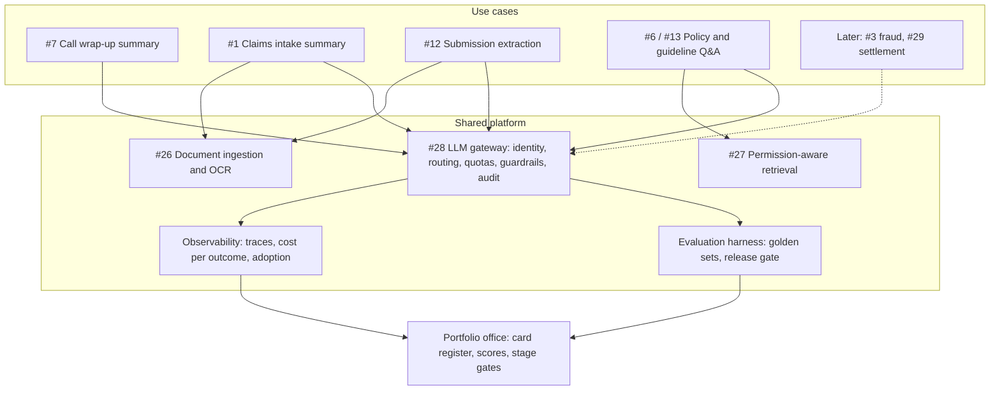

# Prioritize AI Use Cases for a Large Enterprise

*The use case that impresses the executive is rarely the one that survives contact with the data, the regulator and the users.*

◷ 24 min

This is a portfolio question, not a design question. Nothing gets drawn until the list has been cut. The answer is a repeatable way to turn thirty enthusiastic one-liners into a funded sequence with kill criteria, and the architecture only appears as the shared platform that makes later items cheaper. The page is the standalone pack for #60 in `CASE_STUDY_INDEX.xlsx`.

| Case | Where it comes from | What the source gives |
|---|---|---|
| #60 Prioritize AI Use Cases for a Large Enterprise | `OpenAI_Applied/Sample_Questions/OpenAI Applied_Engineer_Problem_Decomposition_Questions.md`, Question 16 | The prompt, ten prioritisation criteria, six selection properties, one follow-up and its answer, all quoted in section 1 |

The source is talking points, not a worked answer. Everything marked *(own construction)* was built for this page from the arguments in the repo's delivery, cost and decomposition material. The insurer, its thirty use cases and every number attached to them are assumptions, not data.

---

## 1. Refuse to Pick the Most Impressive Demo

The prompt, verbatim from Question 16:

> "An executive gives you a list of 30 potential AI use cases. How do you decide what to build first?"

The source's answer names ten criteria: business value, user pain, feasibility, data availability, integration complexity, risk, time to value, adoption likelihood, reusability and evaluation difficulty. It then states the one instruction that matters most: *"You should explicitly avoid selecting the most impressive demo."*

It closes with the property list of a good first pick, verbatim:

- A measurable outcome
- A realistic path to adoption
- Manageable risk
- Available data
- A practical integration path
- A credible evaluation strategy

The trap is real because demos and production reward different things. A demo hides traffic shape, tail latency, usage expansion and governance cost, in the words of the cost cram sheet. So the most impressive demo is often the use case whose production cost is least visible. Say that in the first two minutes, then make the method the answer:

> *"I won't pick a winner from the list. I'll gate out the ones that can't be measured or can't be allowed, score the rest on value and on what makes value real, then check the ranking against dependencies and portfolio balance. The first build is the one with a measurable outcome, available data and a credible eval — and it should also lay platform that makes the next three cheaper."*

## 2. Ask What "Prioritise" Decides

A ranking is only useful if it changes a decision. So the first question is which decision this one feeds. Each of the questions below changes the method, not just the answer *(own construction)*.

| QUESTION | WHAT CHANGES WITH THE ANSWER |
|---|---|
| Who is the sponsor, and who owns each use case's outcome? | Whether a use case with no business owner is scored at all; the source's rule is to refuse work with no measurable metric and no SME |
| What budget and horizon: one team for a quarter, or a programme for two years? | How many items fit in wave 1, and whether platform enablers can be funded ahead of their first user |
| Does "prioritise" mean pick one pilot, or fund a portfolio? | One pilot optimises for learning and credibility; a portfolio also optimises for reuse and balance |
| What is the risk appetite, and which regulator watches? | Where the risk gate sits; an insurer cannot let a model make an adverse decision on a customer unreviewed |
| What has already been tried, and why did it stall? | Whether the real blocker is data access, adoption or trust, which moves the weights |
| Build, buy or both? | Commodity use cases, such as a coding assistant, leave the build list entirely |

When the interviewer declines to answer, state the assumptions aloud. For this page: a mid-size property and casualty insurer, a two-year programme, one platform team of about eight engineers, and a sponsor who wants visible value inside two quarters.

## 3. Turn Thirty One-Liners Into Comparable Cards

Thirty ideas arrive as thirty sentences of different shapes. "Use AI for fraud" and "summarise call notes" cannot be compared until each becomes the same object. The card is that object. A use case that cannot fill it is not ready to be scored, which is itself a finding.

| CARD FIELD | WHAT IT FORCES INTO THE OPEN |
|---|---|
| User and workflow step | Who does what differently on Monday; "the business" is not a user |
| Outcome metric and today's baseline | The number that must move, and its value today; no baseline means no measurable outcome |
| Volume and frequency | How many times a year the step happens; value scales with this, enthusiasm does not |
| Decision type | Inform, recommend, draft for approval, or act; each step up raises the risk tier |
| Data sources, owner and access status | Whether the data exists, who can grant it, and whether anyone has asked |
| Integration points | Which systems it reads and writes; writes cost more than reads |
| Evaluation plan in one line | How correctness is judged, and by whom; "users will tell us" is not a plan |
| Risk and regulatory notes | Customer impact of a wrong answer, and the rule that applies |
| Platform dependencies | Ingestion, retrieval, gateway, eval harness; what it shares with other cards |
| Business owner and SME | The person who signs the outcome, and the expert who labels the test set |
| Kill criteria | The result that would stop it, written before the build |

The card template is *(own construction)*. Its fields are the source's ten criteria and six properties, plus the delivery framework's intake rules. Filling thirty cards is a week of interviews, not a month. The delivery framework's rule applies here too: a stage is not done because time passed, it is done because a checkable thing is true.

## 4. Apply Gates Before Scoring Anything

A weighted sum lets a high score on one dimension buy back a fatal score on another. So some properties are gates, checked first, and an item that fails one never reaches the scoring table. This is the same move as the delivery framework's intake refusal. *"A two-week clock against an unmeasurable goal is worse than no clock"*, and a score against an unmeasurable goal is worse than no score.

| GATE | FAILS WHEN | WHAT HAPPENS TO THE ITEM |
|---|---|---|
| Measurable outcome | No metric, or no baseline anyone can produce | Back to the sponsor to define one; not scored |
| Named owner and SME | Nobody will sign the outcome or label a test set | Not scored; three of the delivery framework's six gates need an SME |
| Permissible decision | The model would take an adverse action on a customer with no human review | Reshaped into decision support, or rejected |
| Right tool | A deterministic rule, an existing statistical model or a purchase would do it better | Routed to rules, the existing model team, or procurement |

The gates and their wording are *(own construction)*, built from Handbook Module 10's intake refusal and its "no SME is a contractual prerequisite" rule. The fourth gate is the one candidates forget. The cost cram sheet lists "low-value workflows" as a cause of runaway bills. Not every item on an AI list needs a language model.

## 5. Score Seven Dimensions With Stated Weights

The source's ten criteria collapse into seven scored dimensions without losing any. Adoption likelihood becomes a multiplier on value, because unused value is not value. Integration complexity folds into feasibility. User pain is evidence for value, not a separate score. Each dimension is scored 1 to 5, where 5 is always the good end, so risk is inverted *(own construction)*.

| DIMENSION | WEIGHT | WHAT A 5 LOOKS LIKE | WHAT A 1 LOOKS LIKE |
|---|---|---|---|
| Value, adoption-adjusted (V) | 25% | Over $3M a year, with users who asked for it | Under $100k a year, or nobody's workflow changes |
| Feasibility and integration (F) | 15% | Read-only, one system, a proven pattern | Writes into several core systems, novel technique |
| Data readiness (D) | 15% | Data exists, is accessible and is labelled | Data is missing, locked or unlabelled |
| Evaluability (E) | 10% | Ground truth exists, and correctness is cheap to check | No agreed answer; only experts can judge |
| Risk, inverted (R) | 15% | A wrong answer is caught by a human before it matters | A wrong answer reaches a customer or regulator |
| Time to value (T) | 10% | Measurable result inside one quarter | Over a year before anyone sees an effect |
| Platform reuse (P) | 10% | Builds a component four other cards need | A dead end that shares nothing |

The weights are a stated opinion, not a truth. Say them aloud so the interviewer can argue with them. Value gets the largest share because the sponsor funds outcomes. Data and risk tie for second because they are the two dimensions that most often stop a project that scored well. Evaluability earns its own line because the decomposition prep page names it as a winning habit: tie every design choice back to how it would be evaluated.

## 6. Estimate Value From Volume, Not From Enthusiasm

Executive value estimates are usually a revenue number with no mechanism behind it. Rebuild each one from four factors: how often the step happens, how much it saves each time, what that time or loss is worth, and what share of users will actually change behaviour. The formula is *(own construction)*.

> Annual value ≈ volume × saving per occurrence × unit cost × adoption rate

Here is one worked estimate, with every input an assumption. Contact-centre wrap-up notes (#7 on the insurer's list): 1.2M calls a year, 3 minutes of wrap-up saved per call, $0.75 per agent-minute fully loaded, and 70% adoption. That comes to about $1.9M a year. The sponsor's slide said "$5M in productivity". The gap is the adoption factor and the difference between minutes saved and minutes that turn into lower cost.

Three honesty rules keep this from becoming theatre. Separate hard savings, such as fewer contractor hours, from soft savings, such as minutes that go back into the same shift. Discount by adoption, using the pilot's measured rate once it exists. Subtract the run cost, because the cost cram sheet's executive question is "does the value justify the spend?", not "is there value?". Convert the result into the 1-to-5 band from section 5, and keep the dollar figure on the card, so the band can be challenged.

## 7. Stress-Test the Weighted Sum Where It Breaks

A single ranked column looks rigorous and hides five known failures. Name them before the interviewer does *(own construction)*.

**Compensation.** A 5 on value can buy back a 1 on risk. The gates in section 4 handle the fatal cases. A floor handles the rest: no item enters "do now" with any dimension below 3.

**Dependencies.** Platform components score badly on value by themselves, because nobody uses an ingestion service directly. Yet the top items cannot ship without them. Ranking enablers alongside use cases always starves them, so they get their own bucket and are funded with the use cases that need them.

**Double counting.** Feasibility, data readiness and time to value are correlated. An item that is hard to build is usually also slow. Summing all three quietly triples the weight of difficulty. Keep them, but check whether the ranking changes when one is dropped.

**False precision.** A 3.85 and a 3.75 are the same number given how the inputs were produced. Rerun the ranking under two or three plausible weightings. Treat only items that stay near the top under all of them as decided.

**Portfolio balance.** The top five by score are often five variants of the same pattern, such as five summarisation tools. That is efficient but teaches the organisation nothing new, and it concentrates risk in one platform component. Keep a deliberate slot for one strategic item whose job is learning.

## 8. Score the Worked Portfolio

The running example is a mid-size property and casualty insurer. All thirty use cases, every score and every bucket are *(own construction)* and assumptions. Scores use the section 5 weights, computed rather than estimated by eye.

| # | Use case | V | F | D | E | R | T | P | Score | Bucket |
|---|---|---|---|---|---|---|---|---|---|---|
| 7 | Contact-centre call summary and wrap-up notes | 4 | 4 | 4 | 4 | 4 | 5 | 4 | 4.10 | Now |
| 1 | Claims intake summary for adjusters | 4 | 4 | 4 | 4 | 4 | 4 | 4 | 4.00 | Now |
| 12 | Commercial submission intake extraction | 5 | 3 | 3 | 4 | 4 | 3 | 5 | 3.95 | Now |
| 28 | LLM gateway and evaluation harness | 2 | 4 | 5 | 5 | 5 | 3 | 5 | 3.90 | Enabler |
| 6 | Adjuster policy-wording Q&A with citations | 3 | 4 | 4 | 4 | 4 | 4 | 5 | 3.85 | Now |
| 13 | Underwriting-guideline Q&A | 3 | 4 | 4 | 4 | 4 | 4 | 5 | 3.85 | Now |
| 20 | HR policy assistant | 2 | 5 | 4 | 4 | 4 | 5 | 5 | 3.85 | Next |
| 9 | Inbound email triage and routing | 3 | 4 | 4 | 5 | 4 | 4 | 3 | 3.75 | Next |
| 15 | Broker email summarisation | 3 | 4 | 4 | 4 | 4 | 4 | 4 | 3.75 | Next |
| 2 | Claims document extraction (estimates, invoices) | 4 | 3 | 3 | 4 | 4 | 3 | 5 | 3.70 | Next |
| 21 | Coding assistant for internal developers | 3 | 5 | 5 | 3 | 3 | 5 | 1 | 3.60 | Buy |
| 26 | Document ingestion and OCR service | 2 | 4 | 3 | 5 | 5 | 3 | 5 | 3.60 | Enabler |
| 11 | Complaint classification for regulatory reporting | 3 | 4 | 3 | 4 | 4 | 4 | 3 | 3.50 | Next |
| 16 | Loss-run parsing | 4 | 3 | 2 | 4 | 4 | 3 | 4 | 3.45 | Next |
| 18 | Regulatory-change digest | 2 | 4 | 4 | 3 | 4 | 4 | 3 | 3.30 | Next |
| 19 | IT helpdesk agent with reset actions | 3 | 3 | 4 | 4 | 3 | 3 | 3 | 3.25 | Later |
| 22 | Marketing copy drafts | 2 | 5 | 5 | 2 | 3 | 5 | 1 | 3.25 | Buy |
| 8 | Customer-facing policy chatbot | 4 | 3 | 3 | 3 | 2 | 3 | 4 | 3.20 | Later |
| 25 | Actuarial model documentation drafts | 2 | 4 | 4 | 3 | 4 | 4 | 2 | 3.20 | Later |
| 27 | Permission-aware enterprise retrieval | 2 | 3 | 3 | 4 | 4 | 3 | 5 | 3.20 | Enabler |
| 10 | Live agent-assist during calls | 4 | 2 | 3 | 3 | 3 | 2 | 4 | 3.10 | Later |
| 5 | Subrogation opportunity detection | 4 | 3 | 2 | 3 | 3 | 2 | 3 | 3.00 | Later |
| 17 | Reinsurance treaty clause comparison | 3 | 3 | 3 | 3 | 3 | 3 | 3 | 3.00 | Later |
| 23 | Month-end variance commentary | 3 | 3 | 3 | 3 | 3 | 3 | 2 | 2.90 | Later |
| 3 | Fraud-referral triage assist for investigators | 5 | 2 | 2 | 2 | 2 | 2 | 3 | 2.85 | Later |
| 29 | Autonomous settlement of small auto claims | 5 | 2 | 3 | 2 | 1 | 1 | 3 | 2.75 | Later |
| 30 | Voice bot replacing the tier-1 phone line | 4 | 2 | 3 | 2 | 2 | 2 | 3 | 2.75 | Later |
| 4 | Auto-sent claim denial letters | 4 | 3 | 3 | 2 | 1 | 3 | 2 | 2.75 | No |
| 14 | LLM-set premiums | 5 | 1 | 2 | 1 | 1 | 1 | 1 | 2.15 | No |
| 24 | Auto-generated board pack | 2 | 3 | 2 | 2 | 2 | 2 | 1 | 2.05 | No |

The bucket rules, in order: a gate failure is "No"; a commodity capability is "Buy"; a shared component is "Enabler"; a score of 3.8 or more with no dimension below 3 is "Now"; a score of 3.3 or more is "Next"; the rest are "Later" unless they score under 2.6. The totals are five Now, seven Next, ten Later, three Enablers, two Buy and three No.

Read the table for what the sum hides, not only for its order.

**The floor did real work.** The HR policy assistant (#20) ties the Now items at 3.85 on a value of 2. Easy, fast and reusable, it is still not worth one of five wave-1 slots. The floor moved it to Next, where it is a cheap second tenant of the retrieval enabler.

**The gates did the rest.** Auto-sent denial letters (#4) fail the permissible-decision gate: an unreviewed adverse decision on a customer. The reshaped version is "draft the letter for the adjuster to approve", which folds into #1. LLM-set premiums (#14) fail the right-tool gate, because pricing belongs to the actuarial models that regulators already review.

**The highest-value items are all Later.** Fraud triage (#3), autonomous settlement (#29) and the voice bot (#30) score 4 or 5 on value. Each fails on data, risk or evaluability. That is Question 16's follow-up in table form, and section 12 answers it.

**The ranking survives reweighting where it matters.** Under a value-heavy, a risk-heavy and a speed-heavy weighting, #7, #1 and #6 stay in the top five every time. #12 drops out only when speed dominates, because extraction from submission packs takes a quarter to prove. #13 swaps with #2 under the value-heavy weighting. So say it as "#7, #1 and #6 are decided; #12 and #13 depend on whether the sponsor values speed or value more."

## 9. Fund the Platform the Top Items Share

The architecture in this case is the shared platform, not any one use case. It earns a diagram because it explains the sequencing: the enablers make every later card cheaper. The delivery framework's governing question applies to a portfolio too. For each new use case, how much is pulled from a library, and how much is built from scratch?

```
   WAVE 1 USE CASES           WAVE 2                      LATER
 ┌──────────────┐ ┌──────────────┐ ┌──────────────┐   ┌──────────────┐
 │ #7 call      │ │ #1 claims    │ │ #6/#13 policy│   │ #3 fraud     │
 │ wrap-up      │ │ intake       │ │ & guideline  │   │ triage       │
 │ summary      │ │ summary      │ │ Q&A          │   │ #29 settle   │
 └──────┬───────┘ └──────┬───────┘ └──────┬───────┘   └──────┬───────┘
        │                │                │                  │
 ═══════╪════════════════╪════════════════╪══════════════════╪═══════
        ▼                ▼                ▼                  ▼
 ┌──────────────────────────────────────────────────────────────────┐
 │  LLM GATEWAY (#28): identity · routing · quotas · cost per       │
 │  use case · guardrails · audit log                                │
 ├──────────────────────┬─────────────────────┬─────────────────────┤
 │ DOCUMENT INGESTION   │ PERMISSION-AWARE    │ EVALUATION HARNESS  │
 │ & OCR (#26)          │ RETRIEVAL (#27)     │ golden sets per use │
 │ claims, submissions, │ policy wording,     │ case, release gate, │
 │ loss runs            │ guidelines, HR docs │ online sampling     │
 ├──────────────────────┴─────────────────────┴─────────────────────┤
 │  OBSERVABILITY: traces · cost per successful outcome · adoption   │
 └──────────────────────────────────────────────────────────────────┘
        ▲                                   ▲
   claims system, policy admin,        portfolio office:
   contact-centre platform             card register, scores, gates
```



| COMPONENT | WHY IT IS FUNDED IN WAVE 1 | FIRST USE CASE THAT NEEDS IT | LATER CARDS IT MAKES CHEAPER |
|---|---|---|---|
| LLM gateway (#28) | Every use case calls a model; cost and audit per use case need one choke point | #7 | All of them |
| Evaluation harness | No item leaves pilot without a golden set and a release gate | #7 | All of them |
| Document ingestion and OCR (#26) | Claims and submissions arrive as scans and PDFs | #1, #12 | #2, #16, #5, #3 |
| Permission-aware retrieval (#27) | Policy wording and guidelines have different audiences | #6, #13 | #20, #8, #18, #17 |
| Observability | Cost per successful outcome and adoption are the portfolio's scoreboard | #7 | All of them |
| Portfolio office | Holds the card register, re-scores quarterly, records kill decisions | Wave 0 | The next thirty ideas |

The platform view is *(own construction)*. Its gateway pieces come from the repo's gateway material. [#100 Production LLM Gateway](../100_Production_LLM_Gateway/) designs that component in full. [G13 Evaluation and Release Gating](../../G13_Evaluation_And_Release_Gating.md) covers the harness.

## 10. Sequence the Portfolio in Waves

A ranked list is not a plan until it has dates and dependencies. Sequence by what each wave proves, and let each wave pay for the platform the next one needs *(own construction; durations are assumptions)*.

| WAVE | WHEN | WHAT SHIPS | WHAT IT PROVES |
|---|---|---|---|
| 0 | Weeks 1–4 | Thirty cards, gates applied, scores and buckets agreed with the sponsor; data-access requests filed for wave 1 | The organisation can say no, and write down why |
| 1 | Months 2–4 | #7 call wrap-up in shadow then limited production; gateway, eval harness and observability underneath it | One measurable win, and the platform's first tenant |
| 2 | Months 4–8 | #1 claims intake summary and #6 policy Q&A on ingestion and retrieval; #13 as a second retrieval tenant | Reuse: the second and third use cases cost a fraction of the first |
| 3 | Months 8–14 | #12 submission extraction; Next-bucket items that ride existing components (#9, #15, #2, #20) | The platform carries the portfolio, not individual heroics |
| 4 | Months 14–24 | One strategic Later item, most likely #29 as decision support built on #1 and #2 evidence | The organisation can take on a high-risk item with gates it already trusts |

Wave 1 is deliberately a low-risk, high-volume use case, not the biggest one. It has to earn credibility and build the gateway, and it must not create a headline if it fails. Handbook Module 10 describes the same move: narrow the first build to prove the approach, then expand.

## 11. Set Kill Criteria Before the Pilot Starts

A portfolio without kill criteria only ever grows. Stopping a pilot is then a political event instead of a scheduled outcome. Write the stop condition on the card before any code exists, so the decision was made when nobody was invested in it.

The stage gates reuse the delivery framework's shape: a named, checkable condition, signed by the right role, with no seniority override.

| STAGE | EXIT CONDITION | WHO SIGNS | KILL IF |
|---|---|---|---|
| Card | All fields filled; gates passed | Business owner | No measurable baseline after two attempts |
| Discovery (2 weeks) | Data access granted; golden set drafted with the SME | Customer SME | Data access still pending after escalation |
| Pilot in shadow | Eval baseline met on the golden set | Delivery lead | Below baseline after two iterations |
| Limited production | Adoption and outcome metric moving; rollback tested | Delivery lead | Adoption under the card's floor at week 4 |
| Scale | Outcome metric met; cost per successful outcome within plan | Executive sponsor | Value under run cost at the next quarterly re-score |

The gate names and roles adapt Handbook Module 10's six gates, including `data_access_granted`, `eval_baseline_met`, `rollback_tested` and `success_metrics_met`, from a single engagement to a portfolio *(own construction)*. The delivery framework's week-4 retention metric is the adoption kill signal. It is recorded as "none" until measured, never as a fake zero. Its accelerator reuse rate becomes the portfolio's platform health metric.

Re-score the whole register every quarter. Pilot data replaces estimates, so the portfolio corrects itself. A Later item whose data problem was solved by an enabler moves up without anyone lobbying for it. [G12 Scoping to Deployed Agent](../../G12_Scoping_To_Deployed_Agent.md) covers the gate mechanics in depth.

## 12. Say No to the Executive's Pet Project Without Losing the Executive

The executive who handed over the list usually has a favourite. Here it is autonomous settlement of small auto claims (#29). It is also the answer to Question 16's follow-up, quoted verbatim:

> "The highest-value use case is also the riskiest. What do you recommend?"

The source's answer, verbatim:

- Narrow the initial scope
- Introduce human approval
- Start with decision support rather than automation
- Limit the user population
- Use shadow mode
- Define explicit go/no-go gates
- Expand only after measured evidence

Turn that list into a path, not a refusal. "No" loses the sponsor; "not yet, and here is the route" keeps them. The route for #29 runs through items already in waves 1 and 2 *(own construction)*.

| STEP | WHAT RUNS | EVIDENCE THAT UNLOCKS THE NEXT STEP |
|---|---|---|
| 1 | #1 and #2 summarise and extract small auto claims for adjusters | Extraction accuracy on the golden set; adjuster adoption |
| 2 | A settlement recommendation shown beside the adjuster's own, in shadow | Agreement rate with adjusters, broken down by claim segment |
| 3 | Recommendation with one-click approval, claims under a low cap, one region | Override rate falling; no rise in complaints or leakage |
| 4 | Straight-through settlement for the narrowest segment, with sampled audit | The segment's error rate below the human baseline, signed off by claims leadership and compliance |

Say it to the executive in outcome language. The cost cram sheet's rule applies: acknowledge the business concern, show trade-offs as options, and commit to a measured follow-up.

> *"Autonomous settlement is where this ends up, and it's the most valuable thing on the list. The fastest safe route there starts with the two items that build its data and its evidence. In four months you'll see settlement recommendations running beside your adjusters. At that point the case for automation will be made by your own numbers."*

The move is to make the pet project the destination of the roadmap rather than its first stop. The executive keeps the goal; the programme keeps its credibility.

## 13. Anticipate the Failure Modes

Each row is a way prioritisation programmes fail in practice, with the signal that catches it *(own construction)*.

| FAILURE | WHAT IT LOOKS LIKE | EARLY SIGNAL | MITIGATION |
|---|---|---|---|
| Demo-driven pick | The first build is the most impressive one and stalls in security review | Wave-1 item has a risk score under 3 | Floor rule; wave 1 must be low risk |
| Thirty pilots at once | Every sponsor gets a pilot; none reaches production | Pilots outnumber engineers; no item past shadow at month 4 | Cap work in progress; fund waves, not requests |
| Enablers starved | Each use case builds its own ingestion and prompts | Reuse rate falling; cost per new use case flat | Enabler bucket funded with wave 1 |
| Score theatre | Scores tuned until the favourite wins | Weights changed after scoring | Weights agreed before cards are scored; sensitivity rerun |
| Zombie pilots | Pilots never killed, never scaled | Kill criteria missing from cards | Kill criteria mandatory at card stage; quarterly re-score |
| Value never measured | Launch declared a success with no baseline | Card baseline field empty | Measurable-outcome gate |
| Data surprise | Top item's data turns out to be unusable | Discovery overruns | Data readiness scored before ranking; [#62](../62_Build_When_Customer_Data_Is_Poor/) for the playbook |
| Portfolio monoculture | All wave-1 items are summarisation | No item exercises retrieval or extraction | One slot reserved per pattern |

## 14. Deliver It in Forty-Five Minutes

The source's reusable opening fits almost unchanged. Clarify the business outcome, the user, the current workflow, the constraints and how success is measured, and state assumptions where information is missing.

| MINUTES | WHAT TO DO | WHAT TO SAY OR DRAW |
|---|---|---|
| 0–5 | Clarify | Section 2's questions; state the insurer assumptions if unanswered |
| 5–10 | Frame | "Not the most impressive demo"; the card, the gates, then scores |
| 10–18 | Method | Gates, seven dimensions and weights, the value formula |
| 18–28 | Worked example | A slice of the table: the five Now items, one No, one gated reshape, one high-value Later |
| 28–34 | Where the sum breaks | Floor, enablers, sensitivity, balance |
| 34–40 | Plan | Platform sketch, waves, kill criteria |
| 40–45 | Follow-up | The pet-project path; close with the metrics that will prove the choice |

**The two-minute spoken answer** *(own construction)*:

> *"I wouldn't pick from the list directly — the most impressive demo is usually the one with the most hidden production cost. First, I'd turn each of the thirty ideas into the same card: user, workflow step, outcome metric with a baseline, volume, data and owner, how we'd evaluate it, risk, and kill criteria. Anything that can't fill the card isn't ready. Second, gates before scores: no measurable outcome, no owner, an unreviewed adverse decision on a customer, or a problem that rules or a purchase solve better — those leave the list. Third, score what's left on value adjusted for adoption, feasibility, data readiness, evaluability, risk, time to value and platform reuse, with weights I'd state and let you argue with. I'd estimate value from volume times saving times unit cost times adoption, not from the slide. Fourth, I'd distrust the sum: floor any dimension below three, fund shared enablers separately because they always lose on value alone, and rerun the ranking under different weights to see what's actually decided. For an insurer, that gives a first wave like call wrap-up summaries and claims intake summaries: high volume, low risk, clean eval — and they build the gateway, eval harness and ingestion that make the next ten items cheap. Every item gets kill criteria before the pilot, and the register is re-scored quarterly with real data."*

**Likely follow-ups** *(own construction, except the first, which is Question 16's)*:

| FOLLOW-UP | ANSWER IN ONE BREATH |
|---|---|
| "The highest-value use case is also the riskiest. What do you recommend?" | Make it the destination, not the first stop: decision support, human approval, narrow segment, shadow mode, explicit go/no-go gates, expansion on measured evidence (section 12) |
| "The CEO wants the chatbot first." | Put it through the same card and gates in front of the sponsor. If it fails on risk, show the route to it; if it passes, it ships with kill criteria like anything else |
| "How do you know the value estimates are right?" | They aren't; they are ranges. Rank on bands, keep the dollar figure visible, and replace estimates with pilot data at the quarterly re-score |
| "Two items tie. How do you break it?" | Platform reuse, then evaluability. The one that makes later items cheaper, or can be proven faster, goes first |
| "What if a business unit builds its own anyway?" | Offer the gateway and eval harness as the cheaper path. Shadow AI is a symptom of a slow front door, not a policy problem |
| "What if leadership changes the priorities mid-programme?" | The register absorbs it. Re-score with new weights in public, and show what moves and what it costs to switch |
| "How do you prioritise with no data at all?" | Score data readiness honestly, fund discovery for the top value items, and let wave 0 produce the data. [#62](../62_Build_When_Customer_Data_Is_Poor/) covers the playbook |

## 15. Answer the Cost Pivot in Ten Minutes

The pivot is "how much will the programme cost, and how do you stop the cost per use case staying flat?" There is no playbook drill for this case, so the card is a self-drill *(own construction)*.

| | |
|---|---|
| Dominant driver | Engineering and SME time per use case, then pilots that never close; model tokens are a minor line at this stage |
| Cheapest lever first | Shared enablers funded once; a cap on pilots in flight; kill criteria that release people on schedule |
| Metric that proves it | Cost per use case to production, falling wave on wave; accelerator reuse rate; cost per successful outcome per live use case |
| Do not | Fund thirty pilots in parallel, or let every team build its own ingestion, prompts and eval |
| 60-second line | The expensive thing in an AI portfolio is people rebuilding the same plumbing. Build it once under the first high-volume use case, cap what is in flight, and kill on schedule. Then the tenth use case costs a fraction of the first, and that ratio is the number to report. |

The four verbs from the cost playbook still apply, one level up. Measure cost per use case and per successful outcome. Route commodity capabilities to purchase and deterministic problems to rules. Bound work in progress with a pilot cap. Cache safely by reusing platform components rather than rebuilding them. The cost cram sheet's customer-complaint drill ends the same way: *"show cost by workflow and propose concrete reductions that preserve value."*

---

## Key Takeaways

- Refuse to pick the most impressive demo; lead with a method, because the demo hides production cost.
- Ask which decision the ranking feeds before building it: one pilot and a funded portfolio need different answers.
- Turn every idea into the same card; an idea that cannot fill the card is not ready to be scored.
- Apply gates for measurable outcome, owner, permissible decision and right tool before any score, so a high value cannot buy back a fatal flaw.
- Score seven dimensions with weights stated aloud, and treat evaluability as a dimension in its own right.
- Estimate value as volume × saving × unit cost × adoption, and keep the dollar figure visible next to the band.
- Stress-test the sum for compensation, dependencies, double counting, false precision and monoculture; only items that survive reweighting are decided.
- In the insurer example, #7, #1 and #6 stay in the top five under every weighting, while the highest-value items all land in Later.
- Fund the shared platform with wave 1, because enablers always lose when ranked on value alone.
- Sequence waves by what each one proves, starting with a high-volume, low-risk use case that builds the platform.
- Write kill criteria on the card before the pilot, and re-score the register quarterly with real data.
- Turn the executive's pet project into the roadmap's destination, reached through decision support, shadow mode and measured gates.
- Watch for demo-driven picks, too many pilots, starved enablers, score theatre and zombie pilots.
- Deliver the answer as clarify, frame, method, example, stress test, plan and follow-up inside forty-five minutes.
- Report cost per use case to production falling wave on wave; that ratio is the portfolio's real cost metric.

## Check Yourself

1. Why is "the most impressive demo" a trap, according to the cost cram sheet?
   *It hides traffic shape, tail latency, usage expansion and governance cost, so its production cost is the least visible.*
2. What two answers to "what does prioritise decide?" change the method?
   *Picking one pilot optimises for learning and credibility; funding a portfolio also optimises for reuse and balance.*
3. Name the four gates, and say why they come before scoring.
   *Measurable outcome, named owner and SME, permissible decision, right tool. Gates stop a high score on one dimension from buying back a fatal flaw.*
4. Why is adoption a multiplier on value rather than its own score?
   *Unused value is not value; a use case nobody adopts delivers nothing, however large its theoretical saving.*
5. Estimate the value of a use case with 1.2M calls a year, 3 minutes saved, $0.75 a minute and 70% adoption.
   *About $1.9M a year, before run cost.*
6. Why do platform enablers need their own bucket?
   *Nobody uses them directly, so they score low on value, yet the top items cannot ship without them.*
7. How can you tell a decided ranking from a fragile one?
   *Rerun it under two or three plausible weightings; only items that stay near the top under all of them are decided.*
8. Why did the HR policy assistant tie the Now items but land in Next?
   *Its value was 2, below the floor of 3 required for Now.*
9. Why is auto-sent denial letters a "No", and what is its reshaped version?
   *It is an unreviewed adverse decision on a customer; the reshape is a draft letter for the adjuster to approve.*
10. What should wave 1 prove, and why is it not the highest-value item?
    *One measurable win that builds the platform; a high-risk first item that fails costs the programme its credibility.*
11. When are kill criteria written, and why then?
    *On the card, before the build, so the decision is made before anyone is invested in the pilot.*
12. Give the four-step route from pet project to autonomous settlement.
    *Summaries and extraction for adjusters; a shadow recommendation; one-click approval under a cap in one region; straight-through for the narrowest segment with sampled audit.*
13. What is the portfolio's dominant cost driver, and what metric shows it is under control?
    *People time rebuilding plumbing and pilots that never close; cost per use case to production falling wave on wave.*

## References

All paths are relative to `06_Interview_Prep/`.

| Section | Source |
|---|---|
| 1, 12, 14 | `OpenAI_Applied/Sample_Questions/OpenAI Applied_Engineer_Problem_Decomposition_Questions.md`: Question 16 (#60) and its follow-up, verbatim; the reusable answer template; the biggest mistakes to avoid |
| 5 | `OpenAI_Applied/Sample_Questions/openai_decomposition_interview_prep.html`: section 4, the six-step framework and "tie every design choice back to how you'd evaluate it" |
| 1, 6, 12, 15 | `Study_Guides/Cost_Latency_Optimization/CRAM_SHEET_FULL_PLAYBOOK.md`: why demos die in production, the executive-concern table (ROI), the customer narrative |
| 4, 15 | `Study_Guides/Cost_Latency_Optimization/CRAM_SHEET_S15_S16.md`: drill 7, "Customer complains the AI is too expensive" |
| 3, 4, 11 | `Handbook/10_FDE_Delivery_Operating_Model/04_Gates_Risks_Metrics.md`: the six gates, deny rules, intake refusal, SME prerequisite, week-4 retention, accelerator reuse rate |
| 9, 10 | `AI_Engineer/Delivery Framework from Scoping to Delivery/docs/01-theory.md`: the governing question, "pulled from a library, or built from scratch" |
| 10 | `Handbook/10_FDE_Delivery_Operating_Model/05_Cross_Team_Collaboration.md`: two-phase delivery and narrowing the first build |
| 2, 3 | `Handbook/10_FDE_Delivery_Operating_Model/02_End_To_End_AI_Delivery_Six_Stages.md`: anchor on business value and quantified impact |

Related packs, for cross-reference rather than repetition: [G12 Scoping to Deployed Agent](../../G12_Scoping_To_Deployed_Agent.md) for gate mechanics; [G13 Evaluation and Release Gating](../../G13_Evaluation_And_Release_Gating.md) for the eval harness; [#61 Scale a Prototype to Production](../61_Scale_Prototype_To_Production/) for what happens after a Now item's pilot succeeds; [#62 Build When Customer Data Is Poor](../62_Build_When_Customer_Data_Is_Poor/) for items blocked on data readiness; [Decomposition Classics #67–#69](../Decomposition_Classics_67_68_69/) for decomposing a single chosen use case; [#100 Production LLM Gateway](../100_Production_LLM_Gateway/) for the gateway enabler.

Sections 2, 3 (the card), 4 (the gates table), 5 to 13, 14 (script, spoken answer and follow-ups apart from the first) and 15 are own construction. They were built for this page from the sources' arguments and are not source material. The repo has no worked portfolio-prioritisation case.
