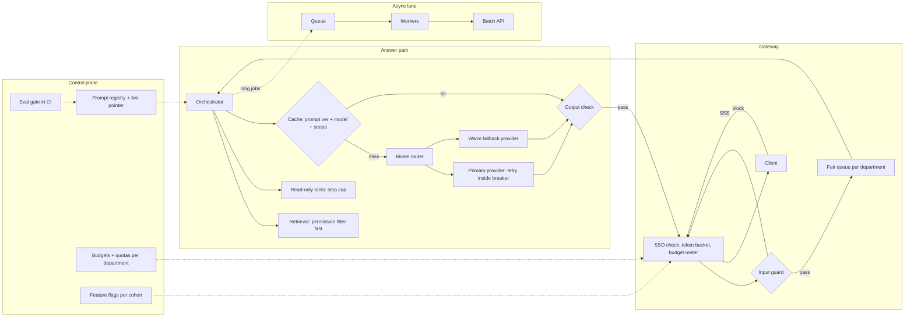

# Scale a Prototype to Production

*The prototype proved the answer is useful to a hundred forgiving users, and nothing about how it behaves for a hundred thousand who did not ask for it.*

◷ 26 min

Scaling a prototype a thousandfold is not a bigger deployment of the same system. It is a different system that happens to share a prompt. This page is the day-before pack for case #61 of `CASE_STUDY_INDEX.xlsx`, a standalone case with no group.

| Source | What it contributes here |
|---|---|
| #61 Question 17 in the OpenAI Applied decomposition question bank | The prompt, the seventeen items to cover, the adoption follow-up and its nine answers, reproduced verbatim in sections 1, 13 and 12 |
| Neighbour prompt E in the same bank, "AI Migration from Prototype to Production" | Section 2: the notebook variant of the same question |
| Cost & Latency cram sheets and additions | Sections 2, 4, 7 and 15: why demos die in production, Little's Law, prices, rate limits, batch discount |
| Production study guide (`12_production_and_operations`) | Sections 7 and 8: retries, breakers, fallback, degradation, budgets, the 99.9% answer |
| Handbook Module 08 doc 1 and Module 10 doc 4 | Sections 10 and 12: shadow, canary, pointer-flip rollback, override rate, week-4 retention |
| Handbook Module 06 doc 1 | Section 7: identity, fair queuing |
| G07, G13, G14, G18, G20 and Standalone #100 | Cross-linked by section instead of re-explained |

**The repo has talking points for this prompt, not a worked design.** Question 17 lists what to cover and one follow-up. Everything that turns that list into an architecture, a sizing walk and a rollout is *own construction*, built from the sources above. Every number is a stated assumption for the whiteboard, not a measurement.

---

## 1. Ask What "Successful" Meant Before Scaling It

The prompt, verbatim from the question bank:

> *"A prototype works for 100 users. The customer now wants to deploy it to 100,000 users."*

"Works" is the word to attack first. A prototype is usually judged on a demo and a few enthusiastic users. That evidence says the idea is valuable. It says nothing about cost, tail latency, abuse, or the users who never volunteered. The bank's own list of biggest mistakes includes *"Treating a prototype as a production system."*

Ask before sizing anything. The assumed answers are *own construction*, stated aloud so the interviewer can correct them.

| Question | Assumed answer | What it decides |
|---|---|---|
| What does the prototype do? | An internal assistant: answers from company documents and calls two read-only tools | RAG plus light tool use, not a free-form agent |
| Who are the 100,000? | Employees of one enterprise, across departments and three regions | SSO, departments as tenants, residency questions |
| How was "success" measured? | Thumbs-up rate and a manager's impression from 100 volunteers | No real eval set exists yet; build one |
| What must stay true at scale? | Answers cite sources; no user sees a document they cannot open | Permission-aware retrieval is a gate, not a feature |
| What latency is acceptable? | First token under 2 s at p95; full answer under 10 s | Streaming, queueing and routing budgets |
| Is there a budget? | Yes, but nobody has priced it yet | The sizing in section 4 is part of the answer |
| When, and how fast? | Company-wide within a quarter | A staged rollout by cohort, not a launch day |

The weak answer draws autoscaling and a load balancer. It treats the jump as a compute problem. The strong answer says three things in the first two minutes. The evidence of success does not transfer. The bill scales with request shape, not with users. And adoption is a deliverable, not a side effect.

> *"A hundred volunteers proved the idea is useful. A hundred thousand employees will test everything the volunteers forgave: cost, the slow tail, permissions, abuse and whether anyone changes how they work."*

## 2. Name What the Prototype Was Hiding

A prototype hides problems by construction, not by accident. The cost cram sheet names four things demos hide. They hide *traffic shape*: one user, a warm cache, clean data. They hide *tail latency*: p95 and p99, not the average. They hide *usage expansion*: longer questions and bigger uploads, so tokens grow faster than requests. And they hide *governance cost*: security review, audit logging, evaluation, human review and support.

The same sheet contrasts prototype and production on six axes, verbatim in the table's middle column.

| Axis | Prototype → production (cram sheet) | What that means for #61 *(own construction)* |
|---|---|---|
| Dataset | curated/static → large, messy, multi-tenant, churning | The eval set built from demo questions is biased toward what already worked |
| Security | mocked → OAuth/OIDC/SAML, RBAC/ABAC, permission filtering, audit | A shared API key and an unfiltered index become a data-exposure incident |
| Load | one user → concurrency, spikes, batch, retries | Provider rate limits appear at the Monday 9 a.m. spike |
| Observability | console logs → traces, token metrics, cost dashboards, alerts | Nobody can say why a bad answer happened |
| Latency | one happy path → tail latency, queueing, cold starts | The demo's 3 s answer becomes a 12 s p95 under queueing |
| Cost | small bill → budget ownership, allocation, anomaly detection, procurement | Nobody owns the invoice until it arrives |

Add three gaps the table does not name *(own construction)*. Prompts drift, because the builder still edits the live prompt by hand. Provider quotas are sized for a pilot account. And the support model is a chat message to the one engineer who built it. At a thousand times the users, that engineer becomes the outage.

The bank has a neighbouring prompt with the same shape: *"A team has a successful notebook-based AI prototype. How do you productionize it?"* Its discussion list is verbatim: reproducibility, CI/CD, evaluation gates, model and prompt versioning, secrets management, monitoring, cost controls, security, SLAs, rollback, ownership and support. Answer it with this page. The notebook variant adds one first step: turn the notebook into versioned, tested code before any of the rest applies.

## 3. State Requirements as Testable Constraints

A requirement that cannot fail a test is a wish. "Scalable" is a wish. "Sustains 20 requests a second at p95 first-token under 2 s" is a constraint. The split below is *own construction*.

The functional core does not change from the prototype. Answer questions from company documents with citations. Call the two read-only tools. Keep a short conversation history. What changes is everything around that core: identity, limits, fairness, failure handling, evaluation, rollout and support.

| Constraint | Stated so it can be tested *(own construction)* |
|---|---|
| Throughput | 20 requests/s sustained at peak, 40 requests/s burst for 10 minutes |
| Latency | First token under 2 s p95; full answer under 10 s p95; measured per stage |
| Availability | 99.9% for the assistant's own service; a provider outage degrades, never errors |
| Isolation | Zero answers citing a document the user cannot open, tested before every release |
| Fairness | One department's burst cannot raise another's p95 by more than 20% |
| Cost | Cost per daily active user tracked by department; monthly spend within the approved budget ±10% |
| Quality | No regression against the production-derived eval set on any intent slice |
| Operability | Every page has a runbook; rollback in under 5 minutes without a redeploy |
| Adoption | Week-4 retention and task success reported per department cohort |

Every new constraint needs an owner in the architecture *(own construction)*.

| Constraint | Primary component(s) |
|---|---|
| Throughput and latency | Gateway queue, model router, streaming, provider capacity |
| Availability | Retry, circuit breaker, fallback provider, graceful degradation |
| Isolation | SSO at the gateway, permission filter in retrieval, scoped cache keys |
| Fairness | Per-user token buckets, weighted fair queue per department |
| Cost | Budget meter before the call, routing, caching, batch path |
| Quality | Eval gate in CI, sampled online evaluation |
| Operability | Prompt registry with a live pointer, runbooks, on-call |

## 4. Size the Thousandfold Jump From Users Down to Tokens

Say the arithmetic aloud, because it turns "scale" into three numbers the customer must approve: requests per second, tokens per minute and dollars per month. Every figure below is an assumption *(own construction)*. The method is what gets scored.

| Step | Assumption | Result |
|---|---|---|
| Licensed users | 100,000 | — |
| Daily active share | 30% once adoption settles | 30,000 daily active users |
| Requests per active user | 8 a day | 240,000 requests a day |
| Business-hours concentration | 80% of traffic in 8 hours | ≈ 6.7 requests/s during working hours |
| Peak | 3× the working-hours average | ≈ 20 requests/s |
| Input per request | 6,000 tokens: 1,500 system and tools, 3,500 retrieved, 1,000 history | 1.44B input tokens a day |
| Output per request | 500 tokens | 120M output tokens a day |
| Concurrency | Little's Law: 20/s × 5 s average | ≈ 100 requests in flight at peak |
| Peak token rate | 20/s × 6,500 tokens | ≈ 130,000 tokens/s ≈ 7.8M tokens/minute |

Little's Law is `concurrency = throughput × latency`, from the cost additions. It turns latency work into capacity work. Halving average latency halves the in-flight slots to provision.

Now price it. The cost additions list current tiers: Claude Sonnet 5 at $2.00 input and $10.00 output per million tokens, and Claude Haiku 4.5 at $1.00 and $5.00. Prices change constantly, so state the mechanism and say "I'd check current pricing" for the digits.

| Scenario *(own construction)* | Daily cost | Monthly |
|---|---|---|
| Prototype: 100 users × 8 requests, one mid-tier model | ≈ $14 | ≈ $400 |
| Naive scale: 240,000 requests on one mid-tier model | $2,880 input + $1,200 output = $4,080 | ≈ $122,000 |
| + route 70% of requests to the small model | ≈ $2,650 | ≈ $80,000 |
| + cache the 1,500-token stable prefix (assumed read price ~10% of input) | ≈ $2,230 | ≈ $67,000 |
| + cap average output at 350 tokens | ≈ $2,000 | ≈ $60,000 |

Two points carry the table. First, the bill went up about 300 times, not 1,000 times, because only 30% of licensed users are active. Adoption is a cost variable. Second, the three cheapest levers roughly halve the naive bill without touching quality on the hard 30%. The cost additions warn that a real agent request can become 5–20 sub-requests. If the tools grow into an agent, multiply the call count before trusting any of this.

Then check the provider. 7.8M tokens a minute at peak must fit the account's tokens-per-minute and requests-per-minute limits, split by model after routing. Plan for twice the peak, because retries during an incident and the Monday spike stack on each other *(own construction)*. That headroom is a procurement conversation, and it starts weeks before launch.

## 5. Walk Each Tenfold Step and Name What Breaks

Scale in tenfold steps, because each step breaks something different. A plan that jumps from 100 to 100,000 finds all of them on the same morning. The table is *own construction*, built from the cost incidents and the production guide.

| Step | What breaks first | First signal | Fix before the next step |
|---|---|---|---|
| 100 → 1,000 | Shared API key and no per-user identity; the demo eval set; prompt edited live; support is one engineer's inbox | Complaints reach the builder directly; answers wrong on documents the demo never touched | SSO and per-user identity; versioned prompts; structured logs and traces; first eval set from real logs |
| 1,000 → 10,000 | Provider 429s at peak; the bill becomes visible; queueing inflates p95; retrieval exposes documents across departments | 429 rate; invoice; p95 rising while p50 stays flat; a permissions complaint | Gateway with rate limits, retry, breaker and fallback; permission-filtered retrieval; routing and caching; budgets per department |
| 10,000 → 100,000 | Department bursts starve each other; provider capacity; multi-region and residency; eval cost; incident blast radius; adoption stalls | One department's p95 degrades during another's peak; eval bill spikes; week-4 retention flat | Weighted fair queue; capacity commitment and a warm fallback; sampled online eval; on-call and runbooks; cohort rollout with change management |

Read the table left to right in the interview. The prototype's weaknesses show up in a fixed order: identity first, capacity second, fairness and organisation last. The fix for each step is cheap before that step and expensive during it.

## 6. Draw the Architecture End to End

The organising rule is admit, assemble, answer, learn. The gateway decides who may use a model and how much. Retrieval decides what the answer may see. The model path decides what it costs and how it fails. The control plane decides what changes reach users, and on what evidence.

The whole system, drawn with its planes *(own construction)*:

```
 ╔═════════════════════ CONTROL PLANE (changes are releases) ═══════════════════════╗
 ║ prompt registry + live pointer · routing policy · quotas per department          ║
 ║ eval gate in CI (G13) · budgets + anomaly alerts · feature flags per cohort      ║
 ╚══════════════════════════════════════╤═══════════════════════════════════════════╝
                                        │ configures every box below
 ╔═════════════════════ DATA PLANE (calls are requests) ════════════════════════════╗
 ║                                                                                   ║
 ║ web / chat client ──SSE──> GATEWAY: SSO token check · per-user token bucket       ║
 ║                            budget meter · input guard · fair queue per department ║
 ║                                        │ admitted                                 ║
 ║                                        v                                          ║
 ║                   ORCHESTRATOR ──> RETRIEVAL (permission filter BEFORE search)    ║
 ║                        │           read-only TOOLS (step cap, timeouts)           ║
 ║                        v                                                          ║
 ║                   CACHE (key = prompt ver + model + permission scope)             ║
 ║                        │ miss                                                     ║
 ║                        v                                                          ║
 ║                   MODEL ROUTER ──> primary provider (small · mid)                 ║
 ║                        │           retry + backoff inside a circuit breaker       ║
 ║                        └─────────> warm fallback provider ──> degraded answer     ║
 ║                                        │ tokens                                   ║
 ║                                        v                                          ║
 ║                   OUTPUT CHECK (PII, citations present) ──> stream to client      ║
 ║                                                                                   ║
 ║ ASYNC LANE: queue ──> workers (reports, summaries, re-indexing) ──> batch API     ║
 ║ INGESTION: sources ──> parse ──> chunk + embed ──> index with ACL metadata        ║
 ║ OBSERVABILITY: trace per request · tokens · cost · stage timings · outcome        ║
 ╚═══════════════════════════════════════════════════════════════════════════════════╝
```

The same flow for viewers that render Mermaid *(own construction)*:



Read the components in request order. The failure column is *own construction*.

| # | Component | Responsibility | Fails how |
|---|---|---|---|
| 01 | Client | Streams the answer, shows citations | Degrades: shows a labelled partial or degraded answer |
| 02 | Gateway | SSO token validation, per-user token bucket, budget meter | Closed on auth; sheds the async lane first under load |
| 03 | Input guard | Rule-based screen first, model-based screen second | Closed for known attacks; logs and allows on timeout for low-risk intents |
| 04 | Fair queue | Orders admitted work by department weight | Never drops an admitted request silently |
| 05 | Orchestrator | Assembles context in a prefix-stable order, calls tools under a step cap | Degrades: answer without the tool, say so |
| 06 | Retrieval | Filters by the user's permissions before vector search | Closed: no filter, no results |
| 07 | Cache | Serves repeated safe answers; key carries prompt version, model and permission scope | Degrades to a miss; never serves across scopes |
| 08 | Model router | Sends easy intents to the small model | Degrades to the mid-tier model |
| 09 | Primary provider | Answers under retry-with-backoff inside a breaker | Breaker opens; traffic moves to the fallback |
| 10 | Fallback provider | Warm second provider or region with its own validated prompt | Degrades to a labelled "try again shortly" answer |
| 11 | Output check | PII scan, citation presence | Closed: withholds the answer and says why |
| 12 | Async lane | Non-interactive work through a queue and the batch API | Delays; users see job status |
| 13 | Ingestion | Incremental indexing with ACL metadata | Stale but safe; freshness alert |
| 14 | Observability | One trace per request with tokens, cost, stages and outcome | Degrades: request still served, gap logged |
| 15 | Control plane | Versioned prompts, routing, quotas, flags, eval gate | Changes blocked until the gate passes |

Point at three boundaries while the diagram is up *(own construction)*. The admission boundary is the gateway: nothing reaches a model without identity, a quota and a budget check. The isolation boundary is retrieval and the cache key: both carry the user's permission scope. The change boundary is the control plane: a prompt edit is a release with a gate, never a hot edit.

## 7. Admit, Queue and Route at One Gateway

Put every model call behind one gateway, because the prototype's direct calls leave no single place to enforce identity, limits, fairness or cost. Standalone #100 designs that gateway in depth, in its sections 5 to 10. This section names only what the scale-up adds.

**Identity first.** Handbook Module 06 doc 1 draws the line: authorisation logic assumes identity is already established. Validate the customer's own SSO token, map their groups to internal roles, and derive the user's permission scope once per request. The prototype's shared key cannot tell 100,000 people apart, so it cannot enforce a single rule about them.

**Limits and fairness are two mechanisms.** The same Handbook doc says it in one line: a rate limit answers *may this request proceed at all*; a fair queue answers *in what order do requests get served under load*. Give each user a token bucket sized in tokens, not only requests. Feed admitted work into a weighted fair queue per department, so the finance quarter-end burst waits for its share rather than starving everyone. G07 section 7 has the full argument.

**Meter before the call.** The production guide's rule: *"The cap has to fire before the API call, not after — checking cost post-hoc only tells you what you already spent."* Use a real tokenizer for the estimate, since the guide shows a word-count heuristic letting expensive requests through.

**Route by intent.** The production guide calls routing *"The single biggest cost lever in a production LLM system."* Pick the routing threshold from a labelled sample of real traffic, not intuition. The cost additions add a warning: prompt caches are scoped to a model, so a three-model cascade means three cold prefixes. Measure one strong model at lower effort before building a cascade.

**Cache what is safe.** The cram sheet's rule: caching is acceptable only when the key includes tenant and permission boundaries and invalidation respects document and access changes. For #61, the cheapest win is the provider's prefix cache on the frozen system prompt and tool list. The answer cache comes second and carries the user's permission scope in its key.

**Stream, and move slow work off the critical path.** Streaming buys perceived latency, not real latency. Report generation and document summaries do not need a waiting user. Send them through a queue to the batch API, which the cost additions put at *50% of standard cost*. Workers scale by queue depth, as the cram sheet's infrastructure section says, not by CPU.

## 8. Fail Over Before the Provider Fails the Users

At 100 users, a provider outage is an anecdote. At 100,000, it is an incident with a headcount. The production guide gives the chain in order: retry with backoff, a circuit breaker around the retried call, a fallback provider, and graceful degradation as the floor. Its one-liner: *"Retries handle one bad call; a circuit breaker handles a bad dependency — you want both, with the breaker wrapping the retried call."*

Set the reliability target honestly. The guide's FDE track answers the "99.9% uptime" request directly: *"Separate your infra's uptime from the upstream provider's — you can't promise more than your dependency provides, and fallback/circuit-breaker design is how you buy margin, not a guarantee."* Say that sentence to the customer before the contract says something else.

Keep the fallback warm and validated *(own construction)*. A fallback provider that has never served real traffic fails at the worst moment. The guide's agent track names the trap: tool schemas and structured-output contracts are not portable across models, so the fallback path needs its own prompt and its own eval run. Route a small, steady share of traffic to it so its latency and quality stay measured. Tag every response with the model that answered, because cost and quality shift silently when traffic moves.

Degrade in front of people and fail loudly in front of machines. That is the guide's own trade-off line. The assistant shows a labelled degraded answer. The async lane stops and alerts rather than writing a half-finished report.

## 9. Rebuild the Eval Set From Production, Not the Demo

The prototype's eval set, if it exists, is the demo questions. It measures what already worked on the questions the builder thought to ask. That is survivorship, not evaluation. G13 designs the full release gate; this section names what the scale-up changes *(own construction, from G13's argument)*.

Build the new set from the first cohorts' real traffic. Sample by intent and by department, because 100,000 users ask questions the 100 never did. Label with the customer's subject-matter experts, not the builder. Add adversarial cases for permissions and prompt injection, and hold the security slice at zero failures. Handbook Module 08 doc 1 is explicit: the safety gate is *"A hard block, not a review comment."*

Gate on slices, not on the aggregate. G13 section 8 makes the point: an average can rise while one department's intent collapses. Report each slice against a named baseline, which is the version currently serving.

Keep evaluating after launch. Run a sampled online evaluation on live traffic, plus thumbs, regenerates and escalations. The cost additions warn about the new bill: LLM-as-judge is inference too. Stratify the sample, use a cheaper judge with a periodic strong-judge audit, and cache judge calls on unchanged pairs. G13 section 14 has the full cost card.

## 10. Roll Out by Cohort With a Pointer-Flip Rollback

Never launch to 100,000 people on one day. Roll out by cohort, so each tenfold step in section 5 happens on purpose, to a group that can be supported. Handbook Module 08 doc 1 gives the stages and their risk to a real user.

| Stage | What happens (Module 08 doc 1) | Gate to move on *(own construction)* |
|---|---|---|
| Shadow | *"The new version runs alongside the live one on real traffic; both outputs are logged; compared offline"* | Eval gate passed; zero isolation failures in shadow |
| Canary | A small slice of real users sees it; *"the same metrics are watched live"* | p95, error rate and cost per request within limits for 48 hours |
| Cohort waves | 1% → 10% → 50% → 100%, one department wave at a time | Each wave: support tickets per 1,000 users, week-1 retention, no open severity-1 incidents |
| Promote | Repoint the live pointer | Executive sponsor signs on the success metrics |

Split cohorts per user, never per request. The Handbook's reason: one person's experience must not flicker between versions mid-conversation. Hold the safety gate identical across arms.

Make rollback a pointer flip. The Handbook's line settles it: *"If rollback requires a build, it is not a rollback; it is a hot-fix under pressure."* The version that was live five minutes ago stays deployed, ready to take traffic. Test the rollback before the first wave, because Handbook Module 10 doc 4 makes `rollback_tested` a gate that blocks limited production.

## 11. Assign Owners Before the First Page

At 100 users, the builder is the owner, the on-call and the support desk. At 100,000, that arrangement is the single point of failure *(own construction)*. Name the owners before the first cohort, not after the first incident.

| Area | Owner *(own construction)* | What it owns |
|---|---|---|
| Platform and gateway | AI platform team | SLOs, capacity, provider relationships, on-call |
| Product behaviour | Product owner | Prompts, intents, routing policy, release decisions |
| Knowledge content | Department content owners | Source freshness, document permissions |
| Security review | Security team | The review gate, red-team results, incident response for leaks |
| Budget | Finance partner plus product owner | Department budgets, anomaly thresholds |
| Support | IT helpdesk (L1), app team (L2), platform (L3) | Tickets, known issues, escalation |

Write runbooks for the incidents that will happen *(own construction)*. The cost cram sheet lists fifteen, and four matter from week one. Cost 5× after rollout: *"The increase is likely from request shape, not just user count."* Latency 2 s to 20 s after a deploy: roll back the prompt or reranker, activate the fallback provider. One tenant over-using: *"distinguish healthy adoption from runaway automation."* And cache hit rate dropping: look for a silent prefix invalidator. Add a fifth for a permissions leak, owned by security.

Run a security review against evidence, not a checkbox. Handbook Module 10 doc 4 names the failure: a gate can be structurally real and still accept free text as evidence. Require adversarial testing and permission-boundary probes as listed artefacts before the review passes.

## 12. Measure Adoption, Not Only Uptime

A system can be technically ready and still fail, because nobody uses it. Adoption is the last item on the bank's list, and it is where the follow-up goes.

Measure adoption with numbers that cannot be faked by a launch email. Handbook Module 10 doc 4 gives two. The human-approval override rate: *"Falling over time = trust being earned; flat = the agent is not ready for less supervision."* And week-4 retention: *"Whether the thing deployed is still the thing being used a month later."* Add active users as a share of licensed users, task success by intent, and cost per successful task *(own construction)*. The cost additions insist on the last one: a cheaper model that needs a retry or a human correction is not cheaper.

The bank's follow-up, verbatim: *"The system is technically ready but users are not adopting it. What do you investigate?"* Its answer list, verbatim: whether the problem is important enough, workflow fit, user trust, response quality, latency, training and onboarding, incentives, integration friction, and whether the product solves the user's actual pain point.

Order that list into an investigation *(own construction)*. Start with data, not opinions. Segment usage by department and intent, and find where users try once and stop. Then read those sessions. A drop after the first answer points to quality or trust. A drop before any answer points to latency or onboarding. Low first use points to workflow fit and integration friction: the assistant lives in a separate tab while the work lives in another tool. Only then talk to users, and ask about their pain rather than the product. The cost cram sheet's executive table says it plainly: adoption depends on *"Perceived latency, workflow fit, reliability, explainability."*

> *"Adoption is a deliverable. I would measure it per cohort, and treat a flat week-4 retention as a bug with a root cause, not a marketing problem."*

## 13. Cover All Seventeen Items the Bank Lists

Question 17 lists seventeen things to cover. Check the answer against them, in the bank's order *(mapping is own construction)*.

| Item (verbatim) | Where this page covers it |
|---|---|
| Traffic and capacity modeling | Section 4 |
| Multi-tenancy | Sections 1 and 7: departments as tenants, permission scope |
| Rate limits | Sections 4 and 7: provider limits and per-user buckets |
| Queuing | Section 7: fair queue per department |
| Caching | Section 7: prefix cache first, scoped answer cache second |
| Model routing | Sections 4 and 7 |
| Batch processing | Section 7: async lane and the batch API |
| Streaming | Section 7 |
| Cost controls | Sections 4, 7 and 15 |
| Autoscaling | Section 7: workers by queue depth |
| Observability | Sections 6 and 11; G14 for the full design |
| Reliability targets | Sections 3 and 8 |
| Rollbacks | Section 10 |
| Security review | Section 11 |
| Support model | Section 11 |
| Change management | Sections 10 and 12: cohort waves, onboarding, champions |
| Adoption measurement | Section 12 |

Failure modes worth volunteering, with the signal that catches each *(own construction)*:

| Failure | Signal | Mitigation |
|---|---|---|
| Bill grows faster than users | Cost per active user rising | Request-shape breakdown; routing, prefix cache, output cap |
| Monday-morning 429 storm | Provider 429 rate at peak | Capacity commitment, jittered retry, fallback, shed async lane |
| Department A's burst slows department B | Per-department p95 divergence | Weighted fair queue |
| Answer cites a forbidden document | Isolation test failure; user report | Filter before search; scope in cache key; release gate at zero |
| Prompt edit silently regresses quality | Slice score drop on the online sample | Prompt registry, eval gate, pointer-flip rollback |
| Fallback fails when needed | Fallback error rate on first real use | Keep it warm with a steady traffic share and its own eval |
| Eval bill triples | Judge spend per release | Stratified sample, cheaper judge with audits, cached judge calls |
| Launch succeeds, usage decays | Flat week-4 retention | Section 12's investigation, per cohort |

## 14. Deliver It in Forty-Five Minutes

Spend the time on the gap between prototype and production. The model choice is a sentence.

| Minutes | Phase |
|---|---|
| 0–6 | Clarify: what "works" meant, who the 100,000 are, the budget (section 1) |
| 6–10 | What the prototype hides (section 2) |
| 10–16 | Sizing aloud: requests, tokens per minute, dollars (section 4) |
| 16–22 | The tenfold table (section 5) |
| 22–30 | Architecture and the gateway (sections 6 and 7) |
| 30–36 | Reliability, eval and rollout (sections 8 to 10) |
| 36–41 | Ownership and adoption, including the follow-up (sections 11 and 12) |
| 41–45 | Failure modes and the cost pivot (sections 13 and 15) |

The two-minute spoken answer *(own construction)*:

> *First I would ask what "works" meant, because a hundred volunteers prove the idea is useful and nothing about cost, the slow tail, permissions or adoption. Assuming an internal document assistant going to 100,000 employees, I would size it: about 30% daily active at eight requests each is 240,000 requests a day, around 20 a second at peak and roughly 8 million tokens a minute. On one mid-tier model that is about $120,000 a month; routing, prefix caching and an output cap roughly halve it. Then I would walk the tenfold steps. At a thousand users I need SSO, versioned prompts and traces. At ten thousand I need a gateway with per-user limits, retry inside a circuit breaker, a fallback provider and permission-filtered retrieval. At a hundred thousand I need fair queuing per department, a capacity commitment, sampled online evaluation and on-call. I would rebuild the eval set from real traffic, gate every release on slices with security at zero, and roll out by department cohort with shadow, canary and a pointer-flip rollback. Finally I would measure adoption, week-4 retention and override rate, because a system nobody uses has failed however well it scales.*

The lines that carry the round *(own construction unless quoted)*:

1. *"A hundred volunteers proved the idea, not the system."*
2. *"The bill scales with request shape, not with users."*
3. *"Each tenfold step breaks something different."*
4. *"A rate limit decides whether; a fair queue decides in what order."*
5. *"You can't promise more than your dependency provides."* (production guide)
6. *"If rollback requires a build, it is not a rollback."* (Handbook Module 08 doc 1)
7. *"Adoption is a deliverable."*

Follow-ups beyond the bank's adoption question *(own construction)*:

| Follow-up | Answer |
|---|---|
| Why not just autoscale? | LLM load does not correlate with CPU, as the cram sheet notes; the limits are provider tokens per minute, cost and fairness |
| Build the fallback now or later? | Now, warm, with its own eval; a cold fallback fails the first time it matters |
| What do you cut to launch faster? | The answer cache and the model cascade; never identity, permission filtering or rollback |
| How do you know the router is right? | A labelled sample of real traffic; misroute rate against cost saved |
| One department wants a custom prompt | A configuration per department behind the same gate, never a fork |

## 15. Answer the Cost Pivot in Ten Minutes

The interviewer's pivot: "The pilot cost $400 a month. Finance just saw the forecast." The repo has no drill for #61, so the card below is a self-drill *(own construction)*, grounded in the cost cram sheets.

| | |
|---|---|
| Dominant driver | Input tokens per request (system prompt, retrieved chunks, history) multiplied by 240,000 requests a day; output verbosity second |
| Cheapest lever first | Route easy intents to the small model; cache the frozen prefix; cap and trim output; move non-interactive work to the batch API; budgets per department before the call |
| Metric that proves it | Cost per successful task by department and intent; cache-read share of input tokens; output tokens per answer; share of traffic per model; misroute rate |
| Do not | Cut quality globally by downgrading every request, or cache answers without the user's permission scope in the key |
| 60-second line | The forecast grew with request shape, not just users. I would route easy intents to a small model, cache the stable prefix, cap output, batch what nobody waits for, and give every department a budget enforced before the call, then prove it with cost per successful task. |

The cram sheet's incident line applies unchanged: *"The increase is likely from request shape, not just user count. I would isolate token growth, retries, agent steps, and batch jobs before changing the model."* Its roadmap sentence is the right shape for finance: first instrument the bottlenecks, then apply safe quick wins, and finally redesign heavy workflows with routing, caching and async processing.

Every strong cost answer follows four verbs in order. Measure tokens and cost per request path first. Route by intent. Bound output, context and tool steps. Cache safely, with the permission scope in every key.

---

## Key Takeaways

- Ask what "works" meant, because a hundred volunteers prove usefulness, not cost, tail latency, permissions or adoption.
- Name what demos hide: traffic shape, tail latency, usage expansion and governance cost, plus drifting prompts and one-person support.
- State constraints as tests: requests a second, p95 first token, zero forbidden citations, fairness between departments, budget.
- Size from licensed users to requests, tokens per minute and dollars; adoption is a cost variable.
- Scale in tenfold steps, because identity breaks first, capacity second, fairness and organisation last.
- Draw admit, assemble, answer, learn, with boundaries at the gateway, retrieval and the control plane.
- Put one gateway in front of every call for identity, per-user limits, a fair queue, metering, routing and safe caching.
- Chain retry, breaker, a warm fallback and degradation, and never promise more uptime than the provider gives.
- Rebuild the eval set from production traffic, gate on slices, and hold security at zero.
- Roll out by cohort through shadow and canary, with a rollback that is a pointer flip.
- Name owners, runbooks and a support ladder before the first cohort.
- Measure adoption with week-4 retention and override rate, and investigate a stall from data to sessions to users.
- Check the answer against the bank's seventeen items and volunteer the failure modes.
- Spend the forty-five minutes on the gap between prototype and production.
- Answer the cost pivot with routing, prefix caching, output caps, batching and budgets before the call.

## Check Yourself

1. **Why is "the prototype works" weak evidence for scaling?** It was judged by a hundred forgiving volunteers on demo questions; it says nothing about cost, tail latency, permissions, abuse or adoption.
2. **Walk the sizing from 100,000 licensed users to tokens per minute.** 30% daily active × 8 requests = 240,000 a day; 80% in 8 hours with a 3× peak ≈ 20/s; × 6,500 tokens ≈ 130,000 tokens/s ≈ 7.8M tokens a minute.
3. **Why did the bill rise about 300 times rather than 1,000?** Only 30% of licensed users are active each day, so adoption sets cost as much as headcount does.
4. **What breaks first between 100 and 1,000 users?** Identity and process: a shared key, a demo eval set, live prompt edits and one-person support.
5. **How do a rate limit and a fair queue differ?** The limit decides whether a request may proceed; the queue decides the order admitted requests are served under load.
6. **Why must the budget check fire before the call?** Checking after the call only reports what was already spent.
7. **What do you tell a customer who asks for 99.9% uptime?** The service cannot promise more than its provider gives; fallback and breakers buy margin, not a guarantee.
8. **Why rebuild the eval set?** The demo set measures what already worked; production traffic from real cohorts contains the questions that will fail.
9. **What makes a rollback a real rollback?** It repoints to a version that is still deployed, in minutes, with no build.
10. **Why split cohorts per user rather than per request?** So one person's experience does not flicker between versions mid-conversation.
11. **The system is ready but nobody uses it. Where do you start?** Segment usage by department and intent, read the sessions where users stop, then check quality, trust, latency, onboarding and workflow fit.
12. **What is the sixty-second cost answer?** Route easy intents down, cache the stable prefix, cap output, batch non-interactive work, budget per department before the call, and prove it with cost per successful task.

## References

All paths are relative to `06_Interview_Prep/`.

| Section | Source |
|---|---|
| 1, 2, 12, 13 | `OpenAI_Applied/Sample_Questions/OpenAI Applied_Engineer_Problem_Decomposition_Questions.md`: Question 17 (#61, prompt, "Cover" list, follow-up), prompt E (notebook variant), "Biggest Mistakes to Avoid" |
| 2, 7, 11, 12, 15 | `Study_Guides/Cost_Latency_Optimization/CRAM_SHEET_FULL_PLAYBOOK.md`: §1 (why demos die, prototype vs production, executive table), §9, §11, §13, §14, §15–§16 |
| 11, 15 | `Study_Guides/Cost_Latency_Optimization/CRAM_SHEET_S15_S16.md`: incidents 1, 2, 5 and 12 |
| 4, 7, 9, 12 | `Study_Guides/Cost_Latency_Optimization/ADDITIONS_BEYOND_PLAYBOOK.md`: A1 (prefix caching, cascades), A2 (prices), A3 (batch discount), B3 (Little's Law), B4 (cost per successful task), E (rate limits, eval bill) |
| 7, 8 | `Study_Guides/12_production_and_operations_INTERVIEW_TUTORIAL.md`: §1.7–§1.13, §3 trade-offs, §5.1–§5.3 role tracks |
| 7 | `Handbook/06_Cross_Cutting_Concerns/01_Identity_Secrets_Tenant_Fairness.md`: identity, queue fairness |
| 9, 10 | `Handbook/08_AgentOps_And_Platform/01_Prompt_Versioning_Rollout_Rollback.md`: gates, shadow, canary, pointer-flip rollback, per-user A/B |
| 10 | `Handbook/08_AgentOps_And_Platform/06_Infra_And_CICD.md`: the assembled pipeline |
| 10, 11, 12 | `Handbook/10_FDE_Delivery_Operating_Model/04_Gates_Risks_Metrics.md`: six gates, evidence bar, override rate, week-4 retention |
| 7 | `Case_Study_Groups/Standalone/100_Production_LLM_Gateway/100_Production_LLM_Gateway.md`, sections 5–10 (gateway internals) |
| 7 | `Case_Study_Groups/G07_Secure_Multi_Tenant_AI_Platform.md`, sections 7 and 8 |
| 9 | `Case_Study_Groups/G13_Evaluation_And_Release_Gating.md`, sections 5–8 and 14 |
| 6, 13 | `Case_Study_Groups/G14_Observability_And_Production_Diagnosis.md` (observability design and cost cards) |
| 4 | `Case_Study_Groups/G18_Consumer_Scale_Chat_Service.md` §3 and `Case_Study_Groups/G20_LLM_Inference_Serving.md` §3 (the same sizing method at larger scale) |
| Every table and section marked own construction, all sizing and cost figures, the self-drill card | Built for this page from the sources' arguments; not source material |
