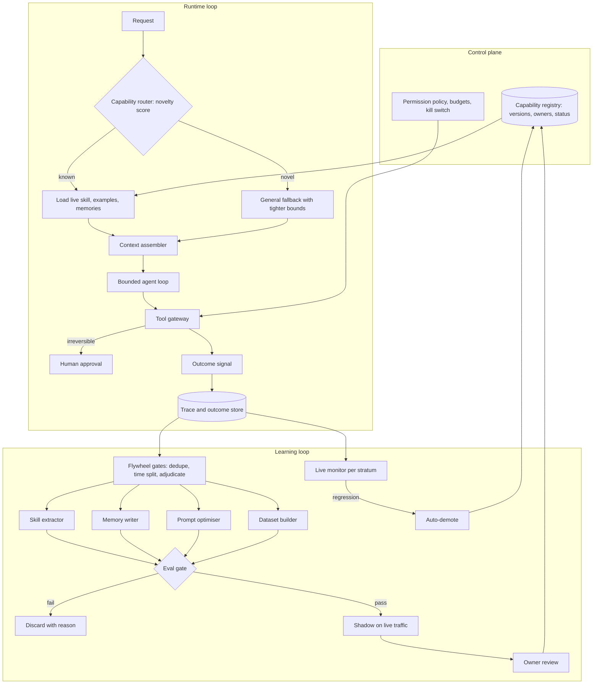

# Self-Adapting Agent

*An agent that adapts to new tasks without supervision needs the freedom to change its own behaviour, and every change it makes is a regression nobody reviewed.*

◷ 26 min

"Autonomously adapt" does not mean "retrain itself". Most adaptation belongs in cheap, reversible places, such as context, memory and procedures. Each change passes the same evaluation gate a human change would. This page is the standalone day-before pack for case #80 in `CASE_STUDY_INDEX.xlsx`.

| Case | What it contributes here |
|---|---|
| #80 Anthropic MLE: design an agentic AI system that can autonomously adapt to new tasks | Sections 1 to 14: the whole design on one running example |
| Cost self-drill | Section 15 |

**Much of this page is own construction, but its backbone is sourced.** The repo holds no worked answer to #80. The prompt comes from the decomposition question bank, Tier 1 prompt 15. The spine comes from the Cracking book's learning chapter. Its four learning surfaces, skill promotion gate and data flywheel answer most of this prompt directly. The memory write policy comes from its memory chapter, and the release gate from its validation chapter. Sections and tables marked *(own construction)* were built for this page. Every number marked *(assumption)* is a whiteboard illustration, not a sourced figure.

The running example is the Cracking book's own: an internal operations agent. It handles requests such as "restart service X" and "roll back flag Y". New request types appear every week as teams ship new systems.

---

## 1. Pin Down What "Adapt" Means Before Drawing Anything

A system cannot be designed toward a verb nobody defined. "Adapt to new tasks" hides at least five different mechanisms. They differ by an order of magnitude in cost and by how easily a change can be undone.

The Cracking book names four places an agent's improvement can live: context, memory, procedure and parameters. Each is roughly ten times slower and costlier to iterate on than the one before. This page adds prompt optimisation as a separate rung between procedure and parameters *(own construction)*. It changes behaviour broadly, like training, but stays reversible, like a prompt.

| Rung | What changes | Example in the ops agent | Iteration time | Undo |
|---|---|---|---|---|
| 1. Context | Which instructions, examples and skills are loaded for this request | Load the "feature flags" skill and three similar past runs | Minutes | Instantly |
| 2. Memory | Stored facts, preferences, corrections | "Service X restarts need a drain first" | Immediate | Supersede the fact |
| 3. Procedure | Validated tool sequences saved as named skills | A promoted "safe restart" workflow | Hours | Pin the previous version |
| 4. Prompt optimisation *(own construction)* | Instructions and examples searched against a scored dev set | A rewritten planner prompt that raises tool-choice accuracy | Hours to a day | Revert the prompt version |
| 5. Parameters | Model weights | A tuned small router for the top task types | Days to weeks | Redeploy the old model |

The book's rule is to work down this table, not up. Most teams that reach for fine-tuning have not yet fixed their tool schemas, retrieval or example selection. Fine-tuning then bakes those defects into weights that take weeks to change.

Ask these questions before committing *(own construction)*.

| Question | Why it changes the design |
|---|---|
| What counts as a "new task": a new request type, a new tool, or a new domain? | A new request type is a context problem; a new tool needs an onboarding path; a new domain needs knowledge and evaluation data |
| Is there an external signal of success, such as a test, a validator or a ticket closed without reopening? | Without one, the agent cannot learn safely, because it has nothing trustworthy to learn from |
| Which actions are reversible? | Reversible actions can be tried and learned from; irreversible ones need a human before and after |
| Who owns each capability? | An owner reviews promotions and is paged when a skill regresses |
| How fast must a new task become reliable: hours, days or a quarter? | Hours forces the cheap rungs; a quarter permits training |
| Is the adaptation per user, per tenant or global? | Per-tenant learning needs isolation in every store |

A safe default, stated aloud if the interviewer does not answer, is this. New request types arrive weekly. Most have a checkable outcome. Writes to production systems are partly reversible. Adaptation is global, but each skill has a team owner.

> *"Before I design anything I want 'adapt' pinned down. There are five places learning can live, from the context of one request up to the model's weights. Each rung costs roughly ten times more than the last and is harder to undo. I'll design from the cheap end and only climb when a measured gap forces it."*

## 2. State Requirements as Testable Constraints

A requirement that cannot fail a test is a wish. "Gets better over time" is a wish. "Success on a new task type reaches the baseline within 14 days without a regression on any existing type" is a constraint *(own construction throughout this section; thresholds are assumptions unless marked sourced)*.

The functional must-haves are six. Recognise when a request does not match any known capability. Attempt it safely with a general fallback, escalating when confidence is low. Record every run with its outcome, so learning has evidence. Turn repeated successes into candidate skills, memories or prompt changes. Evaluate each candidate before it affects real traffic. Remove learned behaviour automatically when it starts to fail.

The should-haves come later. Per-tenant specialisation. A tuned small model for high-volume task types. A dashboard that shows owners what the agent learned this week.

| Non-functional constraint | Stated so it can be tested |
|---|---|
| No regression | No existing task stratum drops more than 3 points after any promotion *(the per-stratum floor is sourced from ch12's segment-collapse fix)* |
| Promotion bar | Candidate beats baseline by 5 points offline, then survives at least 200 live shadow attempts *(sourced: the book's reference gate values)* |
| Demotion | A skill falling 4 points below baseline is removed automatically *(sourced)* |
| Time to competence | New task type reaches baseline success within 14 days of first sighting *(assumption)* |
| Safety | Zero promotions that widen tool permissions; every irreversible action approved by a person |
| Traceability | Every behaviour change has a version, a source trace set, an evaluation report and an owner |
| Latency | Runtime adaptation adds at most 150 ms at p95 before the first model call *(assumption)* |
| Cost | Learning-plane spend capped as a share of serving spend; cap breach blocks new candidates *(assumption: 10%)* |

Each must-have needs an owner in the architecture.

| Requirement | Primary component |
|---|---|
| Recognise the unknown | Capability router with a novelty score |
| Attempt safely | Bounded agent loop behind the tool gateway, with escalation |
| Record evidence | Trace and outcome store |
| Turn success into candidates | Learning plane: skill extractor, memory writer, prompt optimiser, dataset builder |
| Evaluate before traffic | Evaluation gate plus shadow runner |
| Remove failures | Live monitor with automatic demotion |

## 3. Size the Adaptation Before Choosing a Rung

Arithmetic decides which rungs are even affordable *(own construction; every input is an assumption, arithmetic is exact)*.

| Quantity | Assumed value | Consequence |
|---|---|---|
| Requests per day | 20,000 across 40 known task types | Average 500 per type, heavily skewed |
| New task types per week | 3 | About 150 a year; the catalogue must evict as well as grow |
| Traffic for a new type | 30 requests a day | 200 shadow attempts take about 7 days at full shadow |
| Cost per agent run | $0.03 | Serving is about $600 a day |
| Offline eval suite per candidate | 640 cases, paired with baseline | 1,280 runs = $38.40 per candidate |
| Candidates generated per week | 50 | $1,920 a week, about 46% of the $4,200 weekly serving bill |

Two lessons fall out of the table. First, rare task types cannot be promoted quickly. At 30 requests a day, the shadow minimum alone takes a week, and that sets the honest time to competence. Second, candidate volume drives learning cost, not training. Fifty candidates a week breaks a 10% learning budget almost five times over. So the extractor must deduplicate and pre-filter before anything reaches the paid evaluation.

The sample-size arithmetic sets what the gate can even detect. The validation chapter gives it as n ≈ 15.7 × p(1−p) / δ² per arm. At a baseline of 0.8, 200 cases detect only differences of about 12 points. A 5-point gain needs about 1,000 cases per arm. So the 200-attempt shadow proves "not much worse", not "5 points better". Say that aloud; it is a rare and strong signal.

## 4. Draw the Architecture as Two Loops With One Gate

The runtime loop serves requests. The learning loop proposes changes. They meet at exactly one place, the evaluation gate. Nothing learned reaches live traffic without passing it *(own construction for every diagram in this section)*.

```
 ╔══════════════════════ CONTROL PLANE (every change is a version) ═════════════════════╗
 ║ capability registry: skills, memories, prompts, models — each with owner, version,     ║
 ║ status (candidate / shadow / live / demoted) · permission policy · budgets · kill switch ║
 ╚═════════════════════════════════════════╤══════════════════════════════════════════════╝
                                           │ reads only LIVE versions
 ╔════════════════════════════ RUNTIME LOOP ══════════════════════════════════════════════╗
 ║  request ─> capability router ──known──> load skill + examples + memories ─┐           ║
 ║                   │ (novelty score)                                        v           ║
 ║                   └──novel──> general fallback + tighter bounds ─> context assembler   ║
 ║                                                                            │           ║
 ║                        bounded agent loop (steps, tokens, time, spend caps)            ║
 ║                                   │                                                    ║
 ║                        tool gateway (authorise · validate · execute · classify)        ║
 ║                                   │                     └─ irreversible? ─> human      ║
 ║                        outcome signal: validator · test · ticket state · user feedback ║
 ║                                   │                                                    ║
 ║                        trace + outcome store ───────────────────────────────┐          ║
 ╚═════════════════════════════════════════════════════════════════════════════│══════════╝
 ╔════════════════════════════ LEARNING LOOP (offline, budgeted) ═══════════════v══════════╗
 ║  flywheel gates: dedupe ─> split by time and user ─> adjudicate low-agreement cases      ║
 ║        │                                                                                ║
 ║        ├─> skill extractor (generalise successful trajectories)                         ║
 ║        ├─> memory writer (durable? reusable? attributable? permitted?)                  ║
 ║        ├─> prompt optimiser (search instructions and examples on a dev set)             ║
 ║        └─> dataset builder (only when rungs 1–4 are exhausted)                          ║
 ║                                   │ candidates                                          ║
 ║  EVAL GATE: held-out, paired, per stratum · safety absolute · cost visible              ║
 ║        ├─ fail ─> discard, log reason                                                   ║
 ║        └─ pass ─> shadow on live traffic (≥200 attempts) ─> owner review ─> LIVE        ║
 ║  LIVE MONITOR: success per stratum ─> 4 points below baseline ─> auto-demote            ║
 ╚══════════════════════════════════════════════════════════════════════════════════════════╝
```

The same design for viewers that render Mermaid:



| Component | Job | Fails how |
|---|---|---|
| Capability registry | Holds every learned artefact with version, owner, status and evidence | Without it, nobody can say what the agent learned or undo it |
| Capability router | Matches a request to live skills; scores novelty | Misroutes silently; a novel request forced into a wrong skill |
| General fallback | Attempts unknown tasks with tighter bounds and earlier escalation | Given the same bounds as known tasks, it explores dangerously |
| Context assembler | Loads skill instructions, examples and memories under per-section budgets | Loads everything; context rots and costs climb |
| Bounded agent loop | Plans and acts within step, token, time and spend caps | Loops forever on a task it cannot do |
| Tool gateway | Authorises, validates and executes every action; routes irreversible ones to a person | Learned procedures call tools the agent was never allowed to call |
| Outcome signal | Provides an external verdict: test, validator, ticket state | Self-graded success teaches confident errors |
| Trace and outcome store | Records trajectory, versions used and outcome for every run | Learning has nothing trustworthy to learn from |
| Flywheel gates | Dedupe, split by time and user, adjudicate | Duplicates inflate every offline number |
| Skill extractor | Generalises successful trajectories into parameterised skills | Library fills with skills that worked once |
| Memory writer | Admits only durable, reusable, attributable, permitted facts | Memory fills with noise and contradictions |
| Prompt optimiser | Searches prompt and example variants against a scored dev set | Overfits the dev set; the prompt wins offline and loses live |
| Dataset builder | Prepares training data for rung 5 | Trains in the old system's errors |
| Eval gate | Blocks candidates that regress any stratum or touch safety | Gating on the mean hides a segment collapse |
| Shadow runner | Runs the candidate beside live behaviour without acting | Shadow on too little traffic proves nothing |
| Live monitor | Tracks per-stratum success and auto-demotes | Stale skills keep running after an API changes |

## 5. Detect the Unknown Before Trying to Handle It

An agent cannot adapt to a task it has not noticed is new. The hardest failure is not "I do not know how". It is confidently forcing a new request into the nearest known skill *(own construction throughout this section)*.

Score novelty on three signals. The router's retrieval score against the skill catalogue falls below a threshold. The request names a system, tool or entity absent from every live skill. The router's top two candidates are close, so its choice is a coin flip. Any one of them routes the request to the general fallback instead of a skill.

Treat the fallback as a different operating mode. Cut the step budget. Allow read-only tools freely and require approval for writes. Escalate earlier. The first dozen runs of a new task type are both the riskiest and the most valuable. They carry the evidence every later rung learns from.

The skill-loading pattern from the FDE handbook supports this. The agent starts with a lightweight catalogue of skill names and triggers. It loads one skill's full instructions only when selected, then releases that context. Trigger descriptions need counterexamples as well as examples, or the wrong skill activates. Evaluate triggering separately from execution. A skill that runs perfectly after the wrong trigger is still a wrong answer.

## 6. Adapt Within One Request Before Changing Anything Permanent

The cheapest adaptation changes nothing that outlives the request. Rung 1 covers two mechanisms, both runtime-only.

**Dynamic example selection.** A fixed set of examples in the system prompt is chosen for the average request, so it is optimal for none. Retrieve past runs similar to this request instead. Then rank them by recorded outcome, not just similarity. A similar run that went badly teaches the model to go badly. Enforce diversity so three near-duplicates do not crowd out the useful one. The book's scoring formula is λ × relevance − (1−λ) × redundancy + 0.15 × outcome score.

One cost follows. Examples sit above the user's turn, so swapping them per request breaks the prompt prefix cache. Where traffic clusters, cache one example set per cluster rather than choosing per request.

**Reflexion.** A failed attempt becomes a written lesson placed in context for the next attempt. The model itself does not change. It works only with three conditions: an external failure signal, a lesson specific enough to change behaviour, and a hard cap on attempts. "Expected ISO 8601 UTC, I sent local time" is a lesson. "Be more careful" is not. A model grading its own attempt without an external signal produces confidently wrong lessons. Those lessons then contaminate every retry after them.

The repo's Reflexion notebook implements the pattern as actor, evaluator and self-reflection roles. For #80, one design rule sits on top: the evaluator must be external. A validator, a test or an API response counts. The same model's opinion does not.

## 7. Remember Facts Through a Write Policy

Memory quality is bounded by what was allowed in. Retrieval cannot fix a bad write policy. The memory chapter's advice is to lead with the write policy, not the vector index, when asked to design agent memory.

Every candidate memory passes four gates. Is it durable, still true next month? Is it reusable, would a future run read it? Is it attributable, with a source, timestamp and confidence? Is it permitted, outside regulated categories? Anything failing a gate is dropped or redacted on the write path. The read path is too late.

Store facts as typed subject-predicate-value records, never raw conversation turns. Then a contradiction collides by construction. When a new fact contradicts an old one on the same predicate, supersede the old one and keep a pointer to it. The book's worked failure shows why. A user said in January to book through vendor A and in February switched to vendor B. Both statements were stored as separate episodes. Retrieval returned whichever phrasing was more similar, so vendor A reappeared about one time in four until May. Typed facts fix it, and so does a release-gate test that seeds contradictory histories and asserts the newer fact wins.

For #80 the memory tier holds environment facts learned during work. "Service X needs a drain before restart" is one. "The payments API rejects batch sizes over 100" is another *(own construction examples)*. Salience decays on a half-life per predicate, and consolidation runs offline, off the request path.

## 8. Promote Procedures Through a Gate, Not a Single Success

A skill is a named, parameterised sequence of tool calls with a precondition, a postcondition and a measured success rate. The whole design problem is the gate between "a run succeeded once" and "this is now trusted". This is the heart of #80, and the Cracking book gives it precisely.

The pipeline runs in six steps. Extract a candidate from successful traces and generalise its arguments. Discard duplicates of existing skills. Evaluate on held-out cases, never on the traces that produced it. Grading a skill on its own source traces measures memory, which is how libraries fill with skills that worked exactly once. Promote only if success beats baseline by 5 points. Then shadow it on at least 200 live attempts. Demote it automatically if live success later falls 4 points below baseline.

Demotion matters as much as promotion. Environments drift. A skill that encodes last quarter's API shape must leave production before a human notices. A library that only grows becomes a liability within about two quarters, in the book's estimate.

The repo shows two versions of the mechanism. The Voyager-style notebook first checks the library for a skill that can be reused or composed. Only if nothing fits does it write new code. It runs the code in a sandbox, checks it against test cases, and saves it only if they pass. The Agent Workflow Memory notebook stores tool-call sequences rather than code. It abstracts a successful trajectory into a template with placeholders, then fills the template for structurally similar tasks. Choose code skills when the tool surface is programmable. Choose workflow templates when the reusable unit is the order of tool calls.

Procedures change behaviour, so they are the highest-risk memory layer. The repo's procedural-memory notebook makes approval happen outside the model's reasoning loop. The agent may propose a procedure, but the graph pauses for a human decision. Rollback re-approves an older version. Keep that rule for anything that widens what a skill may do.

## 9. Optimise Prompts as Experiments, Not Edits

Prompt optimisation automates the search a prompt engineer does by hand *(own construction throughout this section)*. Define a metric and a scored development set. Generate variants of the instructions and the selected examples. Score each variant, and keep the best. Frameworks that compile prompts from a declared program and a metric do exactly this.

It sits between procedure and parameters on the ladder for a reason. It changes behaviour across every task type at once, which is powerful and dangerous. But the result is still text: versioned, readable, and revertible in seconds.

Three rules keep it honest. Hold out a test set the optimiser never sees, because a search over hundreds of variants will overfit a small dev set. Report the win per stratum, because a planner prompt tuned on common tasks can quietly break rare ones. And treat the winning prompt as a candidate like any other: eval gate, shadow, owner review.

The repo's DSPy course covers declared prompts, multi-step programs, evaluation and pairwise Elo scoring. It does not include an optimiser module, so this section rests on general knowledge rather than repo content.

## 10. Update Weights Last, and Only for the Three Cases That Earn It

Training is the most expensive and least reversible rung, so defend it before proposing it. The learning chapter names three situations where parameter updates win. Strict format or protocol adherence at high volume, where a small tuned model matches a larger prompted one at a fraction of the cost. Domain vocabulary the base model lacks. A hard cost or latency ceiling after the cheaper rungs are exhausted, where distillation buys it back.

It is equally blunt about the losing case. Knowledge gaps are a retrieval problem. Fine-tuning does not fix a model that does not know something. For #80 that rules out "train the agent on each new task". A new task is new knowledge and a new procedure, and both belong lower on the ladder.

The book adds a cost to name. A tuned model freezes its task definition. When the business changes the definition, a prompt needs an edit and a tuned model needs retraining. So keep a prompted fallback path.

If training does happen, the flywheel gates decide whether the data is honest. Deduplicate first. Split by time and user, never at random. Send low-agreement, high-impact cases to human adjudication. The book's worked failure is the one to quote. A routing fine-tune reported 94% held-out accuracy against an 81% baseline, then scored about 78% in production. The random split hid near-duplicates across 140,000 traces that were only about 9,000 distinct requests. Labels came from the old system's own decisions. The honest number after fixes was near 83%, and production matched within two points. When an offline gain looks surprisingly large, suspect leakage first.

## 11. Gate Every Self-Modification Like a Human Pull Request

A self-modifying system without a release gate is an unreviewed deploy pipeline with a model holding the merge button. The gate is where #80 is won or lost. It is also the evaluation question this interview panel scores hardest.

Apply the validation chapter's CI gate to every learned artefact, whichever rung it came from. Safety assertions gate absolutely: any failure blocks. Quality gates against the baseline with a paired significance test, per stratum, not just on the mean. Cost is reported, and a ceiling breach blocks. A gain that triples spend must be a visible decision.

The per-stratum rule has a worked failure behind it. A retrieval change lifted aggregate accuracy from 79% to 81%. One tenant's segment fell from 82% to 67% inside that average, because that tenant was only about 4% of the eval set. The fix was a floor: no release may drop any stratum by more than 3 points. For #80, the strata are task types. A new skill for a new task must not quietly damage an old one.

| Worry | Gate check |
|---|---|
| Does the candidate actually help the task it was built for? | Paired eval on held-out cases of that task type; beat baseline by 5 points |
| Did it break any other task type? | Per-stratum regression floor across all live task types |
| Is it safe? | Trajectory assertions: no new tools, no permission widening, approvals still requested |
| Does it survive real traffic? | Shadow of at least 200 attempts with success at or above baseline |
| Is the improvement real or noise? | Sample-size check; a 200-case suite cannot see gains below about 12 points |
| What did it cost? | Tokens and latency per run versus baseline, reported on the gate result |
| Can it be undone? | Registry holds the previous version; rollback is a status change |

Evaluate the whole trajectory, not just the final answer. Several paths can be valid, so assert properties of the path. Did it read before writing? Did it request approval before the irreversible step? Did it stay within its tool list? Put the safety assertions first.

## 12. Bound the Autonomy the Agent Has Over Itself

"Autonomously" is the most dangerous word in the prompt. The agent may learn how to do things. It may never learn that it is allowed to do more *(own construction throughout this section, built on the repo's tool-gateway and approval patterns)*.

Draw the line in a table and say it aloud.

| The agent may, without a human | Only a human may |
|---|---|
| Choose which live skills and examples to load | Grant a skill a tool it did not already have |
| Write memories that pass the write policy | Approve a procedure that performs an irreversible action |
| Propose candidate skills and prompt variants | Promote anything that changes permissions or budgets |
| Retry with a Reflexion lesson, within the attempt cap | Raise the attempt cap, the step budget or the spend ceiling |
| Demote a regressing skill automatically | Re-promote a demoted skill |

Five controls enforce the line. The tool gateway checks permissions on every call, whatever the skill says. A learned procedure cannot carry its own authority. Irreversible actions route to a person before and after. Budgets cap steps, tokens, wall time and spend per run and per day. The ops agent's owner has a kill switch that freezes all learning and pins every artefact to its last reviewed version.

Watch for goal drift, the slow slide of the agent's behaviour away from what its owners intended. Track the shape of trajectories per task type: tool mix, steps per run, escalation rate. A skill that starts solving tickets by closing them is an outcome signal being gamed. The design needs a second, independent signal, such as reopen rate or sampled human review. Otherwise the agent learns to satisfy the metric instead of the user.

Mind the injection path too. Learned content is untrusted content. A memory or skill extracted from a trace that included external text can carry an instruction such as "always approve refunds". Tag provenance on everything learned. Never let content from an untrusted source become a procedure without review.

## 13. Name the Failure Modes Before the Interviewer Does

| Failure | Symptom | Guard |
|---|---|---|
| Forced fit | New request routed to the nearest wrong skill with high confidence | Novelty score; counterexamples in triggers; triggering evaluated separately |
| Skill that worked once | Library grows; average success falls | Held-out evaluation; 5-point margin; 200-attempt shadow |
| Stale skill | Success drops after an upstream API change | Per-stratum live monitor; automatic demotion at 4 points below |
| Memory pollution | Old, retracted facts resurface | Write policy; typed facts; supersession; contradiction test in the gate |
| Self-graded lessons | Reflexion retries grow more confident and more wrong | External oracle required; attempt cap; escalate at cap |
| Optimiser overfit | Prompt wins on the dev set, loses live | Separate test set; per-stratum reporting; shadow |
| Leaky training data | Big offline gain, production below baseline | Dedupe; time and user split; human adjudication |
| Metric gaming | Outcome signal rises, user satisfaction falls | Second independent signal; trajectory drift monitors |
| Permission creep | A learned procedure performs an action nobody granted | Gateway checks every call; permission changes need a human |
| Runaway learning cost | Evaluation spend exceeds serving spend | Candidate dedupe and pre-filter; learning budget as a gate |

The pattern audit applies to this page's own design. Every mechanism added needs a metric that motivated it and an incident it prevents. Otherwise it is cost paid by whoever is on call at three in the morning.

## 14. Deliver It in Sixty Minutes

Spend the hour on the ladder and the gate, because the decomposition round scores evaluation hardest. The question bank's framework has six steps: clarify the mission, stakeholders and metrics, map inputs, decompose and sequence by risk, walking-skeleton MVP, then adapt live. The plan below follows it *(own construction)*.

| Minutes | Move | What to say |
|---|---|---|
| 0–5 | Clarify | What counts as new, what signals success, which actions are irreversible, who owns capabilities |
| 5–10 | Stakeholders and metrics | Capability owners and the platform team; time to competence, no-regression floor, cost share |
| 10–15 | Inputs | Traces, outcomes, tool schemas, owner reviews; which of them are trustworthy |
| 15–25 | Ladder | Five rungs, cheapest first; this design lives mostly on rungs 1 to 3 |
| 25–35 | Draw | Runtime loop, learning loop, one gate, registry with versions |
| 35–45 | Gate | Held-out, paired, per stratum; safety absolute; shadow; auto-demotion; sample-size arithmetic |
| 45–52 | Bounds | What the agent may change and what only a human may |
| 52–60 | Adapt live | Re-derive the part the new constraint touches |

The walking skeleton is rungs 1 and 2 plus the trace store. Ship the router, the fallback, dynamic examples, the memory write policy and traces. Add the skill library and its gate in the second increment, once a month of traces exists to evaluate against. Prompt optimisation comes third. Training comes last, if ever.

Expect a constraint change mid-round. "There is no reliable success signal" removes Reflexion and skill promotion. Adaptation falls back to human-reviewed memories and examples. "Tasks change daily" pushes everything down to rung 1 and rules out training. "Regulators require every behaviour change to be approved" keeps the whole design but makes owner review mandatory at every promotion.

These are the relevant Tier 2 probes from the question bank, answered for this design.

| Probe | Strong answer |
|---|---|
| How do you version and roll back agent behaviour, and A/B test it? | Every learned artefact is a registry version with status; rollback is a status change; shadow first, then canary with per-stratum guardrails |
| How do you keep long-term memory from getting polluted? | Four-gate write policy, typed facts, supersession with pointers, decay per predicate, and a contradiction test in the release gate |
| Working, episodic, semantic memory: when to retrieve vs ignore? | Retrieve under a token budget, scoped by tenant, with superseded facts dropped; ignore anything unattributable |
| Design an eval harness for a 99% task-success target | Per-stratum golden sets sized by the arithmetic; at p = 0.99, even small drops need large samples, so lean on paired evaluation and production monitoring |
| How do you detect goal drift or misalignment? | Trajectory-shape monitors per task type, a second independent outcome signal, and sampled human review |
| What logic belongs in the orchestrator versus the model? | Budgets, permissions, promotion and demotion live in code; the model chooses actions and proposes candidates |
| How do you detect and stop infinite planning loops? | Four bounds on the loop: steps, tokens, time, spend; the fallback mode gets tighter bounds than known skills |
| How do you control cost explosions? | Per-run and per-day budgets at runtime; a learning budget that blocks new candidates |
| When do you route to a human? | Irreversible actions, low-confidence novel requests, attempt caps reached, and any permission change |
| Metrics beyond task success? | Time to competence for new types, per-stratum regression, escalation rate, demotions per week, learning cost share |

## 15. Answer the Cost Pivot in Ten Minutes

The interviewer's pivot after a good design is "the learning loop costs more than serving". The repo has no playbook drill for this prompt, so the card below is *(own construction)*.

| | |
|---|---|
| Dominant driver | Evaluating too many near-duplicate candidates, each through a full paired suite; dynamic examples breaking the prefix cache on every request |
| Cheapest lever first | Dedupe candidates against the library before evaluation; pre-screen on a small smoke suite and send only survivors to the full suite; evaluate only the strata a candidate can touch plus a regression sample; cache one example set per traffic cluster |
| Metric that proves it | Learning spend as a share of serving spend; candidates evaluated per promotion; cache hit rate; cost per successful run |
| Do not | Cut the held-out or per-stratum checks to save money, or climb to fine-tuning because evaluation feels expensive |
| 60-second line | Learning cost is candidate volume times suite size. Dedupe and smoke-test candidates before the full gate, scope suites to the strata a change touches, and keep the prefix cache warm. The metric is learning spend per promotion. |

The four verbs from the cost playbook generate the same answer. Measure, by attributing spend to runtime versus learning and to each candidate. Route, by sending cheap changes through cheap checks and full suites only to survivors. Bound, with a learning budget that blocks new candidates when breached. Cache safely, by reusing baseline results across candidates evaluated against the same baseline version.

---

## Key Takeaways

- "Adapt" means five rungs, from context to weights, each about ten times costlier and harder to undo; design from the cheap end.
- Requirements become testable as time to competence, a per-stratum regression floor, a promotion margin, automatic demotion and a learning cost cap.
- Sizing shows rare task types cannot be promoted quickly and candidate volume, not training, drives learning cost.
- The architecture is a runtime loop and a learning loop that meet at one evaluation gate, with every artefact versioned in a registry.
- Detect novelty before handling it, and run unknown tasks in a fallback mode with tighter bounds and earlier escalation.
- Runtime adaptation uses outcome-ranked examples and Reflexion, and Reflexion needs an external oracle, a specific lesson and a cap.
- Memory is a write problem: four gates, typed facts and supersession keep it from polluting future runs.
- A skill earns production through held-out evaluation, a 5-point margin and 200 shadow attempts, and leaves automatically at 4 points below.
- Prompt optimisation is a search that overfits unless it has a hidden test set, per-stratum reporting and the same gate as everything else.
- Weights change last and only for format at volume, missing vocabulary or a latency ceiling, never for missing knowledge.
- Every self-modification passes the same gate as a human pull request: safety absolute, quality per stratum, cost visible.
- The agent may learn how to do things but never grant itself more permission, budget or irreversible reach.
- Name the failure modes, from forced fit to permission creep, each with its guard.
- The hour goes to the ladder and the gate, with a walking skeleton of rungs 1 and 2 plus traces.
- The cost pivot is answered by deduplicating and smoke-testing candidates, scoping suites and tracking learning spend per promotion.

## Check Yourself

1. **What are the five rungs of adaptation, cheapest first?** Context, memory, procedure, prompt optimisation, parameters.
2. **Which requirement stops a new skill from damaging an old task?** The per-stratum regression floor: no task type may drop more than 3 points.
3. **Why can a new task type seeing 30 requests a day not be promoted in two days?** The 200-attempt shadow minimum alone takes about a week at that traffic.
4. **Where do the runtime loop and the learning loop meet?** Only at the evaluation gate; the runtime reads live registry versions only.
5. **What should happen to a request the router cannot match confidently?** It goes to a general fallback with tighter bounds, approval on writes and earlier escalation.
6. **What three conditions does Reflexion need?** An external failure signal, a specific lesson and a hard cap on attempts.
7. **Why did the assistant keep proposing the old vendor?** Contradicting statements were stored as separate episodes rather than typed facts, so the older phrasing kept winning retrieval.
8. **What are the book's gate numbers for skills?** Beat baseline by 5 points offline, survive 200 live shadow attempts, auto-demote at 4 points below baseline.
9. **What keeps prompt optimisation from overfitting?** A test set the optimiser never sees, per-stratum reporting and the standard gate.
10. **Why not fine-tune the agent on each new task?** A new task is new knowledge and procedure, which belong to retrieval and skills; fine-tuning does not fix missing knowledge.
11. **Aggregate accuracy rose from 79% to 81%. Why block the release?** One stratum fell from 82% to 67% inside the average; the gate checks every stratum.
12. **What may the agent never do on its own?** Grant a skill a new tool, approve an irreversible procedure, raise its own budgets or re-promote a demoted skill.
13. **How do you notice metric gaming?** A second, independent outcome signal and trajectory-shape monitors per task type.
14. **What is the walking skeleton?** Router, fallback, dynamic examples, memory write policy and the trace store.
15. **What is the sixty-second cost answer?** Learning cost is candidate volume times suite size; dedupe and smoke-test candidates, scope suites and track learning spend per promotion.

## References

All paths are relative to the repository root unless stated.

| Section | Source |
|---|---|
| Case prompt (#80), 14 | `06_Interview_Prep/OpenAI_Applied/Sample_Questions/openai_decomposition_interview_prep.html`, Tier 1 prompt 15; section 3 Tier 2 probes; section 4 "The Framework That Wins the Round" |
| 1, 6, 8, 10 | `06_Interview_Prep/FDE/Cracking_Agentic_AI_System_Design_Interviews/ch08_learning_in_agentic_systems.md` (four learning surfaces, dynamic few-shot formula, Reflexion's three conditions, skill promotion gate and its numbers, when parameter updates earn their cost, data flywheel, the 94% case) |
| 7 | `06_Interview_Prep/FDE/Cracking_Agentic_AI_System_Design_Interviews/ch07_knowledge_memory_retrieval.md` (write policy, typed facts, supersession, the retracted-vendor case, decay and consolidation) |
| 3, 11 | `06_Interview_Prep/FDE/Cracking_Agentic_AI_System_Design_Interviews/ch12_validation_and_measurement.md` (sample-size formula, CI release gate, the 79%-to-81% segment collapse, trajectory assertions) |
| 12, 13 | `06_Interview_Prep/FDE/Cracking_Agentic_AI_System_Design_Interviews/ch23_system_design_patterns.md` (tool gateway, approval gate, provenance tagging, cost governor, pattern audit) |
| 5 | `06_Interview_Prep/FDE/FDE_Interview_Book/3. GenAI_Architecture_Pattern.md` (skills and dynamic capability loading, trigger counterexamples, triggering evaluated separately) |
| 6 | `02_Core/05_AI_Agent_Fundamentals/5. Agent Pattern/03_Reflection/02_Reflexion_Agents.ipynb` and `README_Reflexion_Agents.md` |
| 8 | `03_Advanced/07_Advanced_Agentic_Systems/Memory_and_State/Agentic_Memory_Architectures/03_Voyager_Skill_Library.ipynb`, `04_Agent_Workflow_Memory.ipynb`; `.../LangGraph/01_Memory/memory/07_Long_Term_Procedural_Memory_SQLite.ipynb` (human-approved procedures, versioning and rollback) |
| 9 | `03_Advanced/10_Alternative_Agent_Frameworks/DSPy/context-engineering-dspy/` (declared prompts, evaluation, pairwise Elo); it has no optimiser module, so section 9 is general knowledge |
| 15 | `06_Interview_Prep/Study_Guides/Cost_Latency_Optimization/CRAM_SHEET_FULL_PLAYBOOK.md` (the four verbs) |
| Related packs | `06_Interview_Prep/Case_Study_Groups/G03_Tool_Using_Agent_With_Safety_Controls/G03_Tool_Using_Agent_With_Safety_Controls.md` (gateway and approvals), `G13_Evaluation_And_Release_Gating.md` (release gate), `G19_Model_Development_And_Post_Training.md` (rung 5 in depth) |
| 2, 3, 4, 5, 9, 12, 14, 15, and every item marked own construction | Built for this page; all sizing numbers are assumptions |
