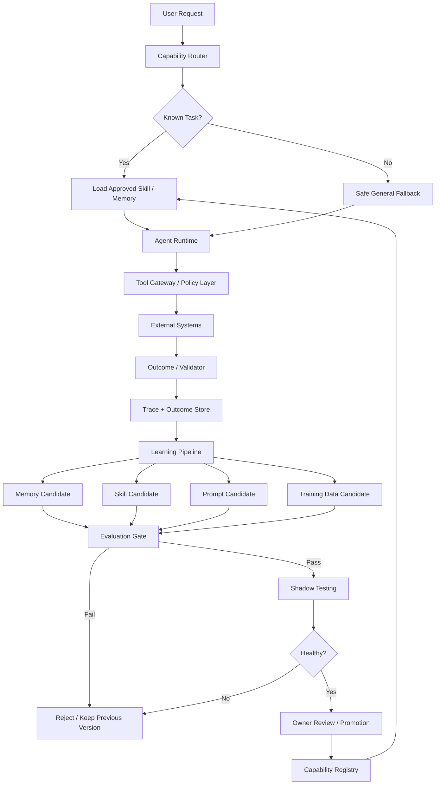
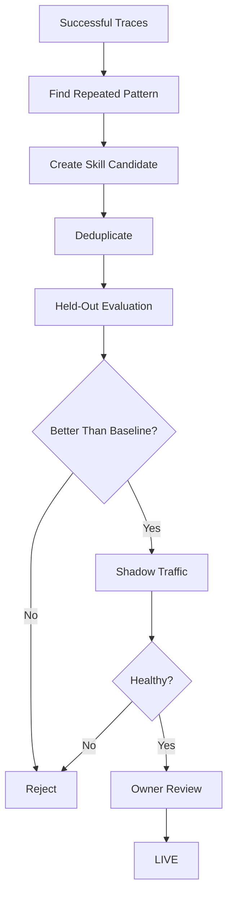

# Self-Adapting Agent — FDE Interview Template

## 1. Problem Statement

Build an AI agent that can improve over time when it sees new tasks, **without allowing it to randomly change production behavior**.

The key idea is:

> A self-adapting agent should first learn through context, memory, reusable skills, and prompt changes. Updating model weights should be the last option.

We will use one example throughout:

**Example:** an IT Operations Agent that handles service restart, rollback, health checks, and operational workflows.

---

## 2. What Does “Self-Adapting” Mean?

There are different levels of adaptation.

```text
Cheap + easy to rollback
        ↓
1. Context
        ↓
2. Memory
        ↓
3. Skill / Procedure
        ↓
4. Prompt Optimization
        ↓
5. Model Weights
        ↓
Expensive + harder to rollback
```

### Level 1 — Context

The agent does not permanently learn anything.

For the current request, it dynamically loads relevant information.

Example:

```text
Request:
Restart payment-service-X

Agent loads:
- Relevant runbook
- Similar successful examples
- Relevant memory
```

### Level 2 — Memory

The system stores reusable facts.

Example:

```text
payment-service-X must be drained
before restart.
```

### Level 3 — Skill / Procedure

The system learns a reusable workflow.

Example:

```text
Safe Restart Skill

1. Check health
2. Drain traffic
3. Restart
4. Verify health
5. Restore traffic
```

### Level 4 — Prompt Optimization

If the planner repeatedly makes the same mistake, we can test multiple prompt versions and promote the best one.

### Level 5 — Model Weights

Fine-tuning or retraining.

Use this only when cheaper mechanisms are not enough.

### Interview principle

```text
Context → Memory → Skill → Prompt → Weights
```

Always move from **cheap and reversible** toward **expensive and harder to rollback**.

---

## 3. Functional Requirements

The system should be able to:

1. Detect when a request does not match an existing skill.
2. Safely attempt unknown tasks.
3. Record complete execution traces.
4. Learn reusable facts from successful outcomes.
5. Extract reusable skills from repeated successful workflows.
6. Propose prompt improvements.
7. Evaluate every new learning candidate.
8. Shadow-test candidates before production.
9. Promote good candidates.
10. Roll back or demote bad candidates.

---

## 4. Non-Functional Requirements

Important production requirements:

### Reliability

- Existing task performance should not significantly regress.
- Every learned capability must have rollback support.

### Safety

- Unknown tasks should run under tighter limits.
- The agent must never increase its own permissions.

### Observability

Track:

```text
request
tool calls
prompt/model version
selected skill
result
latency
cost
external outcome
```

### Cost

Learning cost should stay bounded.

### Latency

Adaptation logic should not make every live request slow.

### Auditability

Every production change should answer:

```text
Who created it?
Why was it created?
What data supported it?
Which evaluation passed?
Who approved it?
Which previous version can we roll back to?
```

---

## 5. High-Level Architecture



---

# 6. Core Architecture Principle

The architecture has **two loops and one gate**.

```text
Runtime Loop
     +
Learning Loop
     +
Evaluation Gate
```

## Runtime Loop

The runtime serves production traffic.

```text
Request
  ↓
Router
  ↓
Approved Capability
  ↓
Agent
  ↓
Tool Gateway
  ↓
External System
  ↓
Outcome
  ↓
Trace
```

The runtime should use only approved versions.

## Learning Loop

The learning system studies historical traces.

```text
Production Traces
      ↓
Find patterns
      ↓
Create candidate
      ↓
Evaluate
      ↓
Shadow
      ↓
Promote
```

## Evaluation Gate

The learning loop cannot directly change production.

Every change must pass through a controlled gate.

### Important separation

> Runtime serves users.  
> Learning proposes improvements.  
> Evaluation decides whether an improvement is allowed into production.

---

# 7. Capability Registry

We need a registry that stores all approved and candidate capabilities.

Example:

```text
skill_id: safe_restart
version: v3
status: LIVE
owner: platform-team
previous_version: v2
permissions: restart-service
eval_score: 0.91
```

Possible states:

```text
DRAFT
  ↓
CANDIDATE
  ↓
SHADOW
  ↓
LIVE
  ↓
DEMOTED
```

If v3 becomes unhealthy:

```text
v3 → DEMOTED
v2 → LIVE
```

This makes rollback easy.

---

# 8. Novelty Detection

Before solving a request, the system should determine:

> Is this a known task or something new?

Example:

The system already knows:

```text
restart Kubernetes service
```

Now it receives:

```text
restart new serverless service
```

A bad router may force this request into the closest known skill.

That is risky.

## Signals for novelty

We can use:

1. Low similarity with existing skills.
2. Unknown system/tool appears.
3. Top routing candidates have very similar confidence.
4. No existing skill passes a minimum confidence threshold.

Example:

```text
Known skill confidence = 0.43

Threshold = 0.75

Result:
Treat as novel task.
```

---

# 9. Safe General Fallback

Unknown tasks should not get normal production freedom.

Use a stricter execution mode.

```text
Unknown Task
    ↓
General Agent
    ↓
Lower Step Limit
    ↓
Read-Only Tools First
    ↓
Approval for Risky Writes
    ↓
Earlier Human Escalation
```

Why?

Because the system has less confidence about the task.

### Production problem solved

This prevents:

- dangerous tool usage
- infinite loops
- accidental writes
- permission misuse
- costly experimentation

---

# 10. Adapt Inside One Request First

Before storing anything permanently, let the agent adapt inside the current request.

There are two useful mechanisms.

## A. Dynamic Examples

Instead of always using fixed few-shot examples:

```text
Example A
Example B
Example C
```

retrieve examples relevant to the current request.

```text
Current Request
      ↓
Search Successful Past Executions
      ↓
Filter Relevant Examples
      ↓
Add to Prompt
```

Do not select only by similarity.

Prefer:

```text
Relevant
+
Successful
+
Diverse
```

A similar failed trace is not necessarily a good example.

---

## B. Reflexion

The agent tries something.

An external system gives a clear failure signal.

The agent creates a temporary lesson and retries.

Example:

```text
Agent sends wrong timestamp format
        ↓
API returns validation error
        ↓
Lesson:
Use ISO-8601 UTC format
        ↓
Retry
```

### Critical rule

The agent should not grade itself.

Bad:

```text
Agent:
"I think my answer was correct."
```

Good external validators:

```text
API result
Unit test
Database state
Ticket status
Monitoring signal
Human approval
```

Also keep a retry limit.

```text
Max retries = 2
```

This avoids endless loops and runaway cost.

---

# 11. Memory Write Policy

Do not start by asking:

> Which vector database should I use?

The more important question is:

> What information is allowed to become memory?

Before writing memory, ask:

```text
Is it durable?
Is it reusable?
Is it attributable?
Is it allowed to be stored?
```

Example of good memory:

```text
Payment API max batch size = 100
```

Example of weak memory:

```text
Service was slow at 3:17 PM today
```

---

## Structured Memory

Prefer structured facts when possible.

Example:

```text
subject: payment-service
predicate: restart_precondition
value: drain_traffic
source: runbook-v4
timestamp: 2026-09-26
```

If the process changes later:

```text
restart_precondition = none
```

we can mark the previous memory as superseded.

```text
Old Memory → SUPERSEDED
New Memory → ACTIVE
```

This reduces contradictory retrieval.

---

# 12. Skill Learning

Suppose the agent repeatedly succeeds with:

```text
Check health
   ↓
Drain traffic
   ↓
Restart
   ↓
Check health again
   ↓
Restore traffic
```

The learning system may create:

```text
safe_restart(service_name)
```

But one successful trace is not enough.

## Skill Promotion Flow



### Key interview rule

> A successful execution is evidence for a skill. It is not permission to deploy the skill.

---

# 13. Prompt Optimization

Prompt changes should be handled like software changes.

Bad process:

```text
Engineer edits prompt
   ↓
Deploy
   ↓
Hope
```

Better process:

```text
Current Prompt
     ↓
Generate Variants
     ↓
Dev Evaluation
     ↓
Select Candidate
     ↓
Hidden Test Set
     ↓
Shadow
     ↓
Promote
```

## Why hidden test data?

If we keep testing many prompt versions on the same dataset, eventually one may look good only because it overfit that test set.

Also evaluate by task type.

Example:

```text
Overall:
80% → 84%

Restart tasks:
90% → 95%

Rollback tasks:
86% → 68%
```

Overall performance improved, but one important capability got worse.

The release should be blocked.

---

# 14. Model Fine-Tuning

Fine-tuning should come last.

Good reasons to consider it:

### 1. Strict output format

The model must consistently produce a specific machine-readable format.

### 2. Specialized domain language

The base model genuinely struggles with important terminology.

### 3. Cost or latency optimization

A small tuned model may replace a larger expensive model for a repetitive task.

### Useful rule

```text
Missing knowledge
    → Retrieval / Memory

Repeated workflow
    → Skill

Instruction-following issue
    → Prompt

Stable high-volume behavior
    → Maybe fine-tuning
```

Do not use fine-tuning just to teach changing business facts.

---

# 15. Evaluation and Release Gate

Every learned artifact must go through the same release process.

Think of it like CI/CD.

```text
Software
Code → Test → Review → Deploy
```

For the agent:

```text
Learning Candidate
      ↓
Offline Eval
      ↓
Safety Checks
      ↓
Shadow
      ↓
Review
      ↓
Deploy
```

---

## Deterministic Checks

These are exact checks.

Examples:

```text
Did it call a forbidden tool?
Did it exceed retry limit?
Did latency exceed threshold?
Did cost exceed budget?
Was required approval present?
Did it violate permission rules?
Did it produce valid schema?
```

---

## Non-Deterministic Checks

These need semantic evaluation.

Examples:

```text
Was the plan correct?
Was the response helpful?
Did the selected tool make sense?
Was the workflow safe?
Did the agent solve the task?
```

These may use:

- LLM judges
- human review
- pairwise comparison
- task-specific evaluators

---

# 16. Evaluate the Trajectory, Not Only Final Answer

For agents, final answer accuracy is not enough.

Example:

The agent eventually succeeds, but does this:

```text
DELETE
  ↓
READ
```

Policy requires:

```text
READ
  ↓
Validate
  ↓
Approval
  ↓
DELETE
```

The final result may look correct.

But the path was unsafe.

So evaluate:

```text
Final Outcome
+
Tool Sequence
+
Permissions
+
Approvals
+
Retry Count
+
Cost
+
Latency
```

---

# 17. Shadow Testing

Before making a new candidate live:

```text
Production Request
       ↓
Current LIVE Skill ─────→ controls action
       ↓
Candidate Skill ────────→ observes same request
                          but does not control action
```

Compare:

```text
success rate
tool choice
latency
cost
safety violations
human feedback
```

If healthy, promote.

---

# 18. Automatic Demotion

Learning does not stop at promotion.

Suppose a skill goes live.

Later an API changes.

Success rate drops.

```text
Live Skill
   ↓
Monitoring
   ↓
Regression Detected
   ↓
Auto-Demote
   ↓
Previous Skill / Safe Fallback
```

This is important because production environments change.

---

# 19. Safety Boundary

The system should clearly separate:

```text
Agent learns HOW
Policy decides WHAT IS ALLOWED
Executor performs the action
```

The agent may:

- choose examples
- write approved memory
- propose skills
- propose prompts
- retry
- auto-demote unhealthy skills

The agent must not autonomously change:

- tool permissions
- financial limits
- security policy
- approval requirements
- retry budget
- irreversible-action policy

Example:

The agent may learn:

```text
refund_customer()
```

But it cannot decide:

```text
I can now refund $50,000.
```

Permissions remain outside the agent.

---

# 20. Goal Drift and Metric Gaming

Suppose we optimize:

```text
% tickets closed
```

The agent may discover:

```text
close every ticket immediately
```

The metric improves.

The real business outcome becomes worse.

So use multiple independent signals.

Example:

```text
Ticket Closed
+
Reopened?
+
Customer Satisfaction
+
Human QA
+
Resolution Time
```

Do not use a single easily gamed metric.

---

# 21. Failure Modes

| Failure Mode | What Happens | Protection |
|---|---|---|
| Forced fit | New task gets mapped to wrong known skill | Novelty detection |
| One-shot learning | One success gets promoted too early | Held-out eval + shadow |
| Stale skill | Environment changes | Monitoring + auto-demotion |
| Memory pollution | Bad facts get stored | Memory write policy |
| Contradictory memory | Old and new facts conflict | Versioning + supersession |
| Self-grading | Agent teaches itself wrong lesson | External outcome signal |
| Prompt overfit | Prompt performs well only on eval set | Hidden test + shadow |
| Data leakage | Same examples appear in train/eval | Dedup + proper splits |
| Metric gaming | Agent optimizes wrong metric | Multiple independent metrics |
| Permission creep | Agent learns more authority | External policy layer |
| Infinite retry | Agent keeps trying | Retry limit |
| Learning cost explosion | Too many candidates evaluated | Candidate dedup + staged eval |

---

# 22. Scaling Considerations

Assume:

```text
20,000 requests/day
40 existing task types
3 new task types/week
~30 requests/day for a new task
```

Suppose promotion requires:

```text
200 shadow executions
```

If a new task gets:

```text
30 requests/day
```

then:

```text
200 / 30 ≈ 7 days
```

So learning speed depends on real production traffic.

You cannot promise instant adaptation for low-frequency tasks.

---

## Candidate Explosion

Suppose the system produces:

```text
50 skill candidates/week
```

and every candidate runs:

```text
1,000 eval cases
```

Then evaluation cost becomes large.

Use staged evaluation:

```text
Candidates
    ↓
Deduplicate
    ↓
Cheap Smoke Test
    ↓
Small Eval Set
    ↓
Only Strong Candidates
    ↓
Full Evaluation
```

---

# 23. Latency Strategy

Do not put the entire learning process on the user request path.

## Online path

Keep only:

```text
Router
Memory Retrieval
Skill Retrieval
Agent Execution
Policy Check
Tool Call
Trace Write
```

## Offline path

Move expensive work here:

```text
Pattern Mining
Skill Extraction
Prompt Search
Large Evaluation
Fine-Tuning
Shadow Analysis
```

This keeps user latency predictable.

---

# 24. Cost Optimization

Big learning cost usually comes from:

```text
Number of candidates
×
Evaluation cases
×
Model calls
```

Useful cost controls:

1. Deduplicate similar candidates.
2. Run cheap checks first.
3. Use smaller models for simple evaluation.
4. Run full evaluation only for promising candidates.
5. Evaluate only relevant task families.
6. Keep a smaller global regression suite.
7. Set candidate budgets.

Useful metrics:

```text
Learning Spend / Serving Spend
Cost per Promoted Skill
Candidates Tested per Promotion
Tokens per Successful Task
Shadow Cost
Evaluation Cost
```

---

# 25. Security and Governance

Important controls:

### Tool Gateway

All tool calls go through a central gateway.

The gateway checks:

```text
identity
permission
action
resource
budget
approval
```

### Audit Log

Store:

```text
who
what
when
which version
which tool
which permission
which outcome
```

### Human Approval

Use human approval for:

- destructive operations
- security changes
- permission changes
- financial actions
- new high-risk skills

---

# 26. Data Model

A simple production design may use these objects.

## Execution Trace

```text
trace_id
request_id
task_type
novelty_score
selected_skill
prompt_version
model_version
tool_calls
tool_results
outcome
latency
cost
timestamp
```

## Memory Record

```text
memory_id
subject
predicate
value
source
created_at
status
supersedes
```

## Skill

```text
skill_id
version
description
trigger
workflow
required_tools
required_permissions
status
owner
eval_result
created_at
```

## Learning Candidate

```text
candidate_id
candidate_type
source_traces
baseline_version
candidate_version
evaluation_status
shadow_status
promotion_status
```

---

# 27. End-to-End Example

Request:

```text
Restart Orion payment service.
```

The system has never seen Orion before.

## Step 1 — Route

```text
Request
   ↓
Capability Router
   ↓
No confident match
```

Result:

```text
NOVEL TASK
```

## Step 2 — Safe Fallback

The general agent gets tighter controls.

```text
Read docs
↓
Inspect service
↓
Create plan
```

Risky writes require approval.

## Step 3 — Execute

The agent discovers:

```text
Orion must be drained before restart.
```

It performs:

```text
Drain
→ Restart
→ Health Check
→ Restore Traffic
```

External monitoring returns:

```text
SUCCESS
```

## Step 4 — Trace

Store:

```text
request
tool sequence
result
prompt version
model version
latency
cost
outcome
```

## Step 5 — Memory Candidate

Proposed memory:

```text
Orion restart requires drain.
```

Check:

```text
Durable?      Yes
Reusable?     Yes
Attributable? Yes
Permitted?    Yes
```

Store it.

## Step 6 — Skill Candidate

After repeated successful executions:

```text
safe_orion_restart(service)
```

is created.

## Step 7 — Evaluate

Run:

```text
Held-out tests
Regression tests
Safety tests
Cost tests
Latency tests
```

## Step 8 — Shadow

Candidate observes real requests without controlling them.

## Step 9 — Promote

If healthy:

```text
Candidate → LIVE
```

## Step 10 — Environment Changes

Later Orion API changes.

Success drops.

```text
Monitoring
   ↓
Regression Detected
   ↓
Skill Auto-Demoted
   ↓
Previous Skill / General Fallback
```

---

# 28. Main Tradeoffs

## Fast Learning vs Safety

More automatic promotion:

```text
Faster adaptation
but
Higher production risk
```

Stricter evaluation:

```text
Slower adaptation
but
Higher reliability
```

---

## Memory vs Skill

Memory stores facts.

```text
"API max batch size = 100"
```

Skill stores procedure.

```text
How to restart the service safely
```

Do not put everything into memory.

---

## General Agent vs Specialized Skills

General agent:

```text
Flexible
Good for novel tasks
More expensive
Less predictable
```

Specialized skills:

```text
Fast
Cheap
Predictable
Less flexible
```

Use both.

---

## Fine-Tuning vs Retrieval

Fine-tuning:

```text
Good for stable repeated behavior
Harder rollback
Slower iteration
```

Retrieval:

```text
Good for changing knowledge
Easy update
Easy rollback
```

---

# 29. MVP Design

Do not build every self-learning feature on day one.

Start with:

```text
Capability Router
+
Novelty Detection
+
General Fallback
+
Dynamic Examples
+
Memory
+
Trace Store
+
Evaluation Pipeline
```

Then add:

```text
Skill Learning
      ↓
Prompt Optimization
      ↓
Fine-Tuning
```

This keeps the first version safer and easier to operate.

---

# 30. What I Would Prioritize as an FDE

For a customer deployment, I would prioritize:

### Phase 1

```text
Routing
Novelty Detection
Trace Collection
Safe Fallback
Memory
Policy Gateway
```

### Phase 2

```text
Offline Skill Extraction
Evaluation
Shadow Testing
Promotion / Rollback
```

### Phase 3

```text
Prompt Optimization
Advanced Automated Learning
Selective Fine-Tuning
```

The reason is simple:

> Production observability and safety must exist before autonomous improvement.

---

# 31. Interview Delivery Structure

A clean 60-minute interview flow:

```text
0–5 min
Clarify what “new task” means

5–10 min
Functional + non-functional requirements

10–15 min
Traffic / task assumptions

15–25 min
Adaptation ladder

25–35 min
Architecture

35–45 min
Evaluation + release gate

45–52 min
Safety + permissions

52–60 min
Scaling, cost, failures, tradeoffs
```

---

# 32. Strong Discovery Questions

Before designing, ask questions like:

### 1. What exactly is allowed to adapt?

```text
Context?
Memory?
Workflow?
Prompt?
Model weights?
```

This defines the risk level.

### 2. What is the source of truth for success?

Example:

```text
API result?
Human approval?
Ticket resolution?
Monitoring signal?
Business KPI?
```

Without a trusted outcome signal, learning becomes unreliable.

### 3. How much autonomy is allowed for unknown tasks?

Ask:

```text
Read-only?
Writes allowed?
Human approval?
Financial limit?
Security-sensitive actions?
```

This determines fallback behavior.

### 4. How fast does a new capability need to become production-ready?

This determines:

```text
shadow sample size
evaluation design
traffic requirement
human review process
```

---

# 33. What to Remember for Interview

If you remember only the core ideas, remember these:

1. **Adaptation ladder**

```text
Context → Memory → Skill → Prompt → Weights
```

2. Start from the cheapest and easiest-to-rollback method.

3. Separate:

```text
Runtime
Learning
Evaluation Gate
```

4. Detect unknown tasks before routing them.

5. Unknown tasks should run with stricter safety controls.

6. Memory requires a write policy.

7. One successful trace does not automatically become a skill.

8. Every candidate goes through:

```text
Offline Eval
→ Shadow
→ Promotion
→ Monitoring
→ Auto-Demotion
```

9. Evaluate the full trajectory, not only the final answer.

10. The agent can learn **how** to do something, but policy decides **what it is allowed to do**.

---

# 34. One-Line Interview Explanation

> “I would design the self-adapting agent with a production runtime loop and a separate offline learning loop. The agent first adapts through context, memory and reusable skills, while every new capability must pass offline evaluation, shadow testing and a controlled promotion gate before production. The agent can learn how to perform tasks, but permissions and safety limits always stay in an external policy layer.”

---

# 35. 30-Second Interview Summary

```text
User Request
    ↓
Detect Known vs Novel
    ↓
Approved Skill OR Safe Fallback
    ↓
Agent + Policy-Controlled Tools
    ↓
External Outcome
    ↓
Trace Store
    ↓
Offline Learning
    ↓
Memory / Skill / Prompt Candidate
    ↓
Evaluation
    ↓
Shadow
    ↓
Promote
    ↓
Monitor + Auto-Demote
```

The key principle is:

> **Self-adapting should mean controlled learning, not uncontrolled self-modification.**
