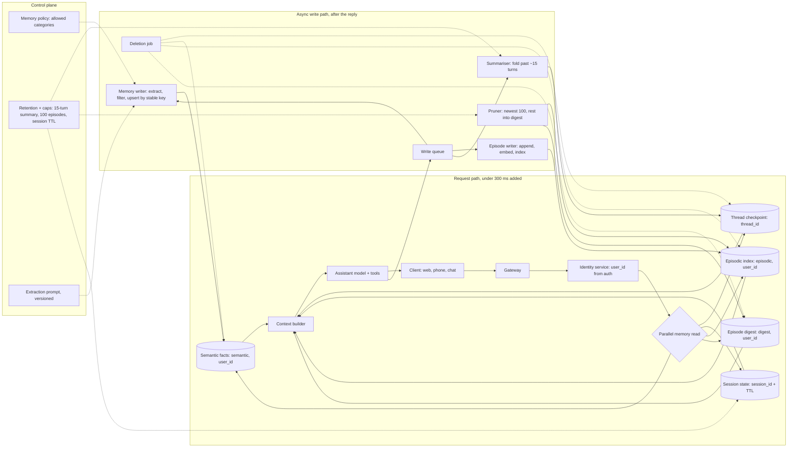

# Personal Assistant With Memory

*The assistant has to remember enough to feel personal and forget enough to stay fast, correct and private.*

◷ 24 min

A memory system is not one database with a bigger context window. It is four scopes of state, each with its own key, its own write rule and its own way to go wrong. This page turns case #98 of `CASE_STUDY_INDEX.xlsx` into one read for the day before.

| Case | What it contributes here |
|---|---|
| #98 Study-guide mock design: "Real-time personal assistant that remembers you across weeks" | The prompt, the 8-point scoring rubric and the 7-point strong answer (sections 5 to 11 and 14) |
| Memory study guide, sections 1 to 5 | Scopes, the memory taxonomy, gotchas and trade-offs (sections 5 to 13) |
| Handbook Module 03 doc 2 and Module 07 doc 5 | Three scopes of state, per-user isolation, a real 30-day retention decision (sections 2, 5 and 11) |
| Cost and latency study guides | The cost pivot (section 16) |

**The source is short.** Section 6 of the memory study guide gives a prompt, a rubric and seven bullets, about 25 lines in all. It has no diagram, no sizing and no cost. Everything beyond those 25 lines is built from the rest of the repo's memory material, and anything the repo does not say is marked *(own construction)*. Sizing figures are stated assumptions, not measurements.

The prompt, verbatim from the source:

> "Design the memory layer for a personal assistant used daily by the same users over months. It needs to hold a live conversation, recall stable preferences from weeks ago, remember what tasks it did recently, and never mix up two users' data. Keep p95 added latency from memory under 300ms."

---

## 1. Clarify What "Remembers You" Means Before Choosing a Store

Ask what the user expects the assistant to remember before drawing a box. "Remembers you" hides four different promises. Hold the conversation. Keep preferences for good. Recall what it did last week. Keep one user's life out of another's view. Each promise needs a different store with a different lifetime.

The clarifying questions *(own construction)*:

| Question | Why it changes the design |
|---|---|
| What must it recall weeks later: preferences, past tasks, or both? | Decides whether episodic memory exists at all |
| Which channels does one user reach it through? | Web, phone and chat must resolve to one `user_id` before memory can be shared |
| Can the user see, correct and erase what it remembers? | Decides whether memory is a user-facing product surface or a hidden cache |
| What must never be stored? | Health, payment or third-party data may be barred from long-term memory |
| Where must the data live? | Residency rules decide where each store physically runs |
| Is "300ms" added latency on read, write, or both? | Decides which work may run after the reply |

Answer the last one for the interviewer if they will not: the budget is for reads on the critical path. Writes run after the reply is sent *(own construction)*.

## 2. State Requirements as Testable Constraints

A requirement that cannot fail a test is a preference. "Remembers preferences" is a preference. "Recalls a preference stated 30 days ago in a new conversation" is a constraint.

The functional requirements *(own construction, from the prompt)*:

| # | Requirement |
|---|---|
| F1 | Hold a live multi-turn conversation, resolving "it" and "that one" to earlier turns |
| F2 | Recall stable preferences (time zone, preferred name, dietary rule) in any new conversation |
| F3 | Recall recently completed tasks ("the flight I booked last Tuesday") |
| F4 | Update a preference when the user restates it, without duplicating it |
| F5 | Show the user what is remembered, and forget on request |
| F6 | Survive a server restart mid-conversation |

The non-functional requirements, stated so each can fail a test:

| Constraint | Stated so it can be tested |
|---|---|
| Latency | Memory adds under 300ms at p95 to each turn *(source)* |
| Isolation | Zero cross-user reads; `user_id` comes from auth, never from the model *(source)* |
| Recall | A fact planted early is recalled 20 turns later, measured on an eval set *(study guide take-home)* |
| Bounded growth | Prompt tokens per turn flat after the summary threshold; episodes capped per user *(source)* |
| Durability | A completed turn and a saved fact survive a process restart |
| Freshness | A fact written in one conversation is readable from a new conversation within seconds *(own construction)* |
| Deletion | "Forget X" and account deletion propagate to every store, index and cache *(own construction)* |

Every requirement then needs an owner *(own construction)*.

| Requirement | Primary component(s) |
|---|---|
| F1, F6 | Thread checkpointer, context builder |
| F2, F4 | Semantic store with stable keys, memory writer |
| F3 | Episodic store, vector index, episode digest |
| F5 | Memory API behind the user's settings page, deletion job |
| Latency | Parallel read fan-out, vector index, async write queue |
| Isolation | Identity service, namespaces keyed by `user_id` |

## 3. Size the Memory Before the Model

Say the arithmetic aloud, because it shows why an index and a pruning policy are not optional. Every number is an assumption for the whiteboard *(own construction)*. The method is what gets scored.

| Step | Assumption | Result |
|---|---|---|
| Daily active users | 1M | — |
| Turns per user per day | 30 | 30M turns a day |
| Average turn rate | 30M ÷ 86,400 s | ≈ 350 turns/s |
| Peak | 3× average | ≈ 1,050 turns/s |
| Memory reads per turn | 1 semantic fetch + 1 episodic search | ≈ 2,100 reads/s at peak |
| Completed tasks per user per day | 5 | 5M episode writes a day |
| Episodes kept per user | 100 *(source cap)* | ≤ 100M live episodes |
| Stable facts per user | 50 | ≈ 50M semantic rows |
| Vector size | 1,024 dims × 4 bytes | ≈ 4 KB per episode vector, ≈ 400 GB at the cap |
| Summary calls | One per ~15 turns *(source threshold)* | 2 per user a day, ≈ 2M extra model calls, about 7% on top of 30M |

Three conclusions follow. The episode cap is what bounds the index, because without it 5M writes a day grow without limit. The read rate is modest, so latency depends on the index, not on throughput. The summary calls are a real line on the bill, so the threshold is a cost lever and not just a quality setting.

## 4. Draw the Architecture End to End

The organising rule is resolve, read, assemble, reply, then write. Identity comes first, because every key depends on it. Reads fan out in parallel inside the budget. Writes happen after the reply, off the critical path.

The whole system *(own construction)*:

```
 ╔═════════════════════ CONTROL PLANE (changes are releases) ═════════════════════╗
 ║ memory policy: what may be stored, per category · retention and caps per scope ║
 ║ summary threshold (~15 turns) · episode cap (100/user) · session TTL           ║
 ║ extraction prompt (versioned) · residency map · eval gates                     ║
 ╚══════════════════════════════════════╤═════════════════════════════════════════╝
                                        │ configures every box below
 ╔═════════════════════ DATA PLANE (calls are requests) ══════════════════════════╗
 ║                                                                                ║
 ║ client (web, phone, chat) ──> GATEWAY ──> IDENTITY SERVICE                     ║
 ║                                          user_id from the auth session         ║
 ║                                                  │                             ║
 ║                                                  v                             ║
 ║                      ┌──────── MEMORY READ FAN-OUT (parallel) ────────┐        ║
 ║                      │ thread checkpoint   key: thread_id             │        ║
 ║                      │ session state       key: session_id, TTL       │        ║
 ║                      │ semantic facts      ns: (semantic, user_id)    │        ║
 ║                      │ episodic search     ns: (episodic, user_id)    │        ║
 ║                      │                     vector index, user filter  │        ║
 ║                      │ episode digest      ns: (digest, user_id)      │        ║
 ║                      └───────────────────────┬────────────────────────┘        ║
 ║                                              v                                 ║
 ║                        CONTEXT BUILDER: system prompt + facts + digest         ║
 ║                        + top-k episodes + summary + recent turns + message     ║
 ║                                              │                                 ║
 ║                                              v                                 ║
 ║                        ASSISTANT MODEL + TOOLS (calendar, mail, booking)       ║
 ║                                              │ reply streams to client         ║
 ║                                              v                                 ║
 ║                        CHECKPOINT the turn (thread_id)                         ║
 ║                                              │ enqueue                         ║
 ╠══════════════════════════════════════════════╪═════════════════════════════════╣
 ║ ASYNC WRITE PATH (after the reply)           v                                 ║
 ║   MEMORY WRITER: extract candidate facts → policy filter → stable-key upsert   ║
 ║                  (previous value kept one version back)                        ║
 ║   EPISODE WRITER: one append per completed task → embed → index               ║
 ║   SUMMARISER: fold buffer into running summary past ~15 turns                  ║
 ║   PRUNER: keep newest 100 episodes, fold older into the rolling digest         ║
 ║   DELETION JOB: "forget X" and account deletion across every store and index   ║
 ║                                                                                ║
 ║ OBSERVABILITY: read latency per store, hit counts, writes by category — no text║
 ╚════════════════════════════════════════════════════════════════════════════════╝
```

The same flow for viewers that render Mermaid *(own construction)*:



Read the components in request order. The failure column is *own construction*.

| # | Component | Responsibility | Fails how |
|---|---|---|---|
| 01 | Gateway | Auth, rate limit, streams the reply | Closed on auth failure |
| 02 | Identity service | Resolves one `user_id` across every channel | Closed: no identity, no memory read |
| 03 | Thread checkpoint | Conversation state per `thread_id`, saved after each step | Replicated; a restart resumes from the last step |
| 04 | Session state | Short-lived context per login session, with a TTL | Degrades: session context lost, conversation continues |
| 05 | Semantic store | Stable facts under stable keys, one prior version kept | Degrades: answer without preferences, never invent one |
| 06 | Episodic store + index | One record per completed task, vector-searchable, filtered by user | Degrades: skip recall past a timeout, say so if asked |
| 07 | Episode digest | Rolling summary of episodes older than the newest 100 | Degrades: answer from recent episodes only |
| 08 | Context builder | Assembles the prompt in a fixed order within a token budget | Degrades: fewer episodes, same order |
| 09 | Assistant model + tools | Answers and acts | Fails over to a fallback model |
| 10 | Memory writer | Extracts candidate facts, applies policy, upserts by key | Retries from the queue; a lost write is re-extracted next turn |
| 11 | Episode writer | Appends, embeds and indexes a finished task | Retries from the queue |
| 12 | Summariser | Folds old turns into the running summary | Degrades: window trimming until it recovers |
| 13 | Pruner | Enforces the 100-episode cap, feeds the digest | Degrades: index grows for a while, alert fires |
| 14 | Deletion job | Propagates "forget" and account deletion everywhere | Closed: retried until every store confirms |

Point at three boundaries while the diagram is up *(own construction)*. The isolation boundary is the identity service, because every namespace below it carries a `user_id` it supplied. The latency boundary is the parallel fan-out, because the slowest store sets the turn's added latency. The write boundary is the queue, because nothing after it can slow a reply.

## 5. Separate Four Scopes and Give Each Its Own Key

Give each kind of memory its own scope, because each answers a different question. A `thread_id` answers "which conversation". A `user_id` namespace answers "which person". A system that has only the first forgets everyone between conversations. A system that confuses them leaks memory across users.

The study guide's taxonomy maps directly onto the prompt's four promises.

| Scope | Holds | Key | Write rule | Read rule | Lifetime |
|---|---|---|---|---|---|
| Thread (short-term) | The live conversation | `thread_id` | Checkpoint after each step | Summary plus recent turns | Retention policy, for example 30 days |
| Session | Login-session context, such as "planning the Lisbon trip" | `session_id` | Overwrite | Get by key | TTL, sliding or fixed |
| Semantic (long-term) | Stable facts: time zone, preferred name | `(semantic, user_id)` + stable key | Overwrite in place | Get all keys for the user | Until changed or erased |
| Episodic (long-term) | Completed tasks: "booked flight to Lisbon" | `(episodic, user_id)` + fresh key | Append one per task | Vector search, top-k | Newest 100, older folded into a digest |

Procedural memory, meaning instructions that change the assistant's behaviour, is the fifth kind in the taxonomy. Keep it out of scope for a personal assistant unless asked. If it appears, gate every change behind human approval. The study guide's gotcha is that an approval passed as a tool argument lets the model approve itself.

"Short-term" describes scope, not lifetime. A durable checkpointer keeps thread history on disk across restarts, which is the point here. Handbook Module 07 doc 5 records a real deployment with thread checkpoints in a table, 30-day retention, chosen so conversations survived an endpoint restart and stayed auditable.

Keep enterprise knowledge out of memory entirely. Handbook Module 03 doc 2 makes the distinction: a stale preference fails as mildly wrong personalisation, while an outdated policy fails as a wrong answer. They refresh on different cadences, so they live in different stores.

## 6. Bound What the Model Sees on Every Turn

Store every turn, and send the model only what this turn needs. Replaying the full history makes tokens and latency grow linearly with turns. The source answer summarises once the buffer crosses ~15 turns, so cost stays flat on long chats.

The study guide compares three options.

| Option | Costs | Buys | Choose when |
|---|---|---|---|
| Full history replay | Tokens and latency grow with every turn | No information loss | Short conversations only |
| Sliding window | Anything outside the window is gone | Flat, bounded cost | Only the last few turns matter |
| Summarisation | One extra model call per fold, and it is lossy | Bounded cost and a record of older turns | Long conversations where old facts still matter |

Pick summarisation with a window of raw recent turns. Volunteer its failure mode before the interviewer does: the summariser can drop something it judged unimportant that matters later. The semantic store is the safety net, because a preference extracted into a stable key no longer depends on the summary keeping it.

Two gotchas separate a practitioner from a reader. Trimming the prompt does not trim the stored checkpoint; only an explicit removal or a retention policy shrinks storage. A running-summary field with no merge rule can be reset by a stray input on the next call, so the summary appears never to accumulate.

The context builder assembles in a fixed order *(own construction)*: system prompt, semantic facts, episode digest, top-k episodes, running summary, recent turns, then the new message. Stable parts go first, so a provider's prefix cache can reuse them across turns.

## 7. Write Facts in Place and Events by Appending

Derive a fact's key from what the fact is, and an event's key from nothing at all. Re-stating "call me Sam" should update one row, not add a second. A fresh random key per write guarantees nothing ever overwrites.

The study guide states the rule as a pair. If a fact can change, its key must be stable. If a fact is a fresh event, a fresh key is correct. Mixing them up is how semantic memory quietly turns into a pile of duplicate facts.

**Handle a conflict explicitly.** The source answer overwrites the existing key and keeps the previous value one version back. That makes "you told me X last month, now Y" answerable instead of silently lost. Add a timestamp and the source turn to each value, so the assistant can say when it learned something *(own construction)*.

**Name what is not persisted.** The source answer keeps raw intermediate tool outputs and one-off task details in short-term or episodic memory only. They are promoted to semantic memory only when the user restates them as a standing preference. "Book me a window seat this time" is an episode. "I always want a window seat" is a fact.

Decide who chooses what to write *(own construction)*. A hard-coded rule is predictable but misses facts it did not anticipate. A model-driven writer, in the style of MemGPT's self-editing memory tools, catches more but can misjudge what is durable. Use a model extractor behind a policy filter. The model proposes; the policy decides which categories may be stored at all. Run the extractor on the write queue, never on the reply path.

## 8. Prune Episodes Into a Digest, Not Into Nothing

Cap episodic memory per user, because nothing else will. Every completed task is a fresh append with no natural ceiling, so a year-long user's row count only climbs. The source answer keeps the most recent 100 per user and folds older ones into a rolling digest rather than deleting them outright.

The digest keeps the gist of older activity at a fixed size. "Booked four trips to Lisbon this year" survives even after the four booking episodes are pruned *(own construction)*. The pruner runs as a background job on the write path, so pruning never costs a reply any latency.

Session memory needs the same discipline in a different form. A TTL marks entries for expiry, and sliding expiry extends the session on activity. The study guide's gotcha is that expiry is enforced by a sweep, not checked on every read. An expired entry can still be returned until the sweeper runs. Schedule the sweeper, or check the entry's age if a few seconds of staleness matter.

## 9. Search With an Index, Not a Scan

Search long-term memory by relevance, because a scan's cost grows with how much has been stored. An unfiltered scan over a namespace is invisible at 5 facts and slow and noisy at 500. The source answer puts an embedding index on the semantic and episodic namespaces. Recall at 1,000+ saved items then becomes a vector query, not a full scan, and that is what keeps p95 under 300ms as history grows.

The study guide flags this as a gap in the repo's own notebooks. Every long-term search there is an unfiltered scan or a similarity check by the model. None configures a real embedding index. That is the difference between working with 10 memories and working with 10,000.

Use each search shape for what it does best *(own construction)*:

| Worry | Search shape |
|---|---|
| What is this user's time zone? | Get by stable key; no search at all |
| What did I book for them last week? | Vector search on episodes, filtered by `user_id`, sorted by recency |
| Who is the manager of the person who organised that trip? | Graph memory: triples and a bounded-hop traversal |
| Did they ever mention a peanut allergy? | Keyword or field lookup, because exact recall matters more than similarity |

Semantic facts for one user are few, about 50 in the sizing, so fetch them all by key. Search is for episodes. Graph memory earns its extraction cost only when answers chain facts never stated together, so mention it and do not build it by default.

## 10. Spend the 300 ms Budget Deliberately

Budget memory like any other dependency, because a slow memory read can dominate p95 as easily as a slow retriever. The prompt allows 300ms added at p95. Spend it on reads in parallel and move every write after the reply.

A budget that fits *(own construction; figures are assumptions)*:

| Step | p95 assumption | Critical path? |
|---|---|---|
| Resolve `user_id` from the auth session | 5 ms | Yes |
| Embed the query for episode search | 40 ms | Yes, in parallel with key reads |
| Episode vector search, filtered by user, top-k | 60 ms | Yes, after the embedding |
| Semantic facts, digest, session state by key | 15 ms | Yes, in parallel |
| Thread checkpoint load | 20 ms | Yes, in parallel |
| Context assembly | 10 ms | Yes |
| **Critical-path total** | **≈ 115 ms** (5 + 40 + 60 + 10) | Leaves headroom for tail latency |
| Fact extraction, episode embed and index, summary fold, pruning | 1–3 s | No: queued after the reply |

A fact said in this thread is already in the checkpoint, so the long-term write can lag by seconds without anyone noticing. That is why every write can leave the critical path. The only freshness promise that matters is cross-conversation, and a queue that drains in seconds meets it.

Put timeouts on each read. When episode search misses its timeout, answer without it and log the miss rather than blowing the budget *(own construction)*.

## 11. Take `user_id` From Auth, Never From the Model

Read the isolation key from the server-side session on every request, because anything the model can set, a prompt can set. The source answer states it plainly: `user_id` comes from server-side session or auth config, never from a tool-call argument the model could set. Every namespace tuple includes it.

The study guide's debugging advice follows. When two users see each other's memories, audit namespace derivation first. The usual cause is a `user_id` sourced from the wrong place. A `thread_id` used by mistake as the long-term namespace causes the opposite bug: memory collapses back to per-conversation.

Channels have to agree on identity before memory can be shared. A web app and a chat bot both need to resolve to the same `user_id` at the identity layer. The memory system does not care which channel wrote a fact.

Governance follows from the same design *(own construction, building on the FDE track questions)*:

| Governance ask | Design answer |
|---|---|
| What does the assistant know about me? | Query the namespaces directly and show the rows, not the model's summary of itself |
| Forget that I said X | Delete the semantic key and its prior version; scrub matching episodes and the digest |
| Delete my account | The deletion job clears checkpoints, session state, facts, episodes, digest, vectors and caches, then confirms |
| How long is each thing kept? | Named per scope: thread retention, session TTL, facts until changed, newest 100 episodes |
| EU data stays in the EU | The residency map pins the user's stores to a region; the index is sharded by user, so it follows |

## 12. Measure Recall, Not Fluency

Measure whether the assistant remembers, not whether it sounds as if it does. A fluent answer that invents a preference is worse than one that asks again. The study guide lists memory-quality evaluation as the gap nothing in the repo's notebooks covers, so building it is the strong move.

The harness comes straight from the study guide's take-home. Plant a fact early in a long synthetic conversation. Ask for it 20 turns later. Score full history, sliding window and summarisation against each other on recall and cost. Extend it across conversations for this design: plant in thread A, ask in thread B a simulated week later *(own construction)*.

| Worry | Metric that answers it |
|---|---|
| Does it recall what it should? | Recall of planted facts, same thread and across threads |
| Does it invent what it never heard? | False-memory rate: answers that assert a fact never stated |
| Did the summary drop something that mattered? | Recall of planted facts after a summary fold |
| Does it duplicate facts? | Rows per stable key per user; should be exactly 1 |
| Is episode search finding the right task? | Recall@k on labelled "which task did I mean" questions |
| Is memory within budget? | Added latency p95 per store and in total |
| Is it isolated? | Cross-user read tests at zero, run before every release |
| Is growth bounded? | Episodes per user at the cap; prompt tokens per turn flat past the threshold |

Every metric except the last two is *own construction* built on the study guide's recall harness. Gate changes to the extraction prompt, summary threshold or cap on this suite, because each one changes what the assistant remembers.

## 13. Name the Failure Modes Before They Do

Volunteer how the design breaks, because a design with no failure modes has not been examined. Most of these come from the study guide's gotchas and FDE questions; the rest are *(own construction)*.

| Failure | Symptom | Fix |
|---|---|---|
| Random key per write | "Remember X" three times makes three rows | Key facts by what they are |
| Trimmed prompt, untrimmed store | Storage grows while prompts look bounded | Retention policy on checkpoints |
| Summary reset by stray input | The running summary never accumulates | Pass only fields meant to overwrite; add a merge rule |
| Unbounded episodes | A year-long user's search slows and gets noisy | Cap at 100, fold into the digest |
| Scan instead of index | Fine at 5 facts, slow at 500 | Embedding index with a user filter |
| `user_id` from the model | One user reads another's facts | Identity from auth only |
| Expired session still readable | A read returns an entry past its TTL | Scheduled sweeper, or check age on read |
| Stale preference wins | Assistant uses last month's value | Overwrite with one version kept; ask when a new statement contradicts an old one *(own construction)* |
| Extractor over-stores | Transient details become "facts" | Policy filter on categories; promote only restated preferences |
| Memory poisoning *(own construction)* | Text from an email or web page is saved as a user preference | Write only from the user's own turns; never from tool output |

## 14. Score Yourself Against the Rubric

Use the source's rubric as the checklist for the answer, because it is the only scored artifact the repo has for #98. Each line points to where this page answers it.

| Rubric item (verbatim from the source) | Answered in |
|---|---|
| Separates thread-scoped short-term memory from user-scoped long-term memory, and names the isolation key for each | Section 5 |
| Distinguishes semantic (stable facts), episodic (past tasks), and possibly session memory, with a different write/read pattern for each | Section 5 table |
| Bounds growth: a retention/pruning policy for episodic memory, stable keys for semantic memory | Sections 7 and 8 |
| Names a real search mechanism (embedding index + query) for long-term recall, not an unfiltered scan | Section 9 |
| Addresses the latency budget for memory reads/writes explicitly, not just for the LLM call | Section 10 |
| States the isolation guarantee: where `user_id` comes from, and that it's never model-controlled | Section 11 |
| Says what happens when memory conflicts (an old preference contradicts a new one) — not left unhandled | Section 7 |
| Names what's NOT persisted (transient task details that don't deserve a long-term write) | Section 7 |

The source's strong answer, compressed to one line per point with its figures intact:

| Point | Source answer |
|---|---|
| Short-term | Durable checkpointer keyed by `thread_id`; a summary node folds the buffer once it crosses ~15 turns |
| Semantic | Namespace `("semantic", user_id)`, stable keys like `"timezone"` and `"preferred_name"`, overwrite in place |
| Episodic | Namespace `("episodic", user_id)`, one append per completed task, pruned to the most recent 100, older ones summarised into a rolling digest |
| Search | Embedding index on both namespaces, so recall at 1,000+ items is a vector query; this keeps p95 under 300ms |
| Isolation | `user_id` from server-side session or auth config on every request, never from a tool-call argument |
| Conflicts | Overwrite, with the previous value kept one version back |
| Not persisted | Raw tool outputs and one-off task details, unless restated as a standing preference |

## 15. Deliver It in Forty-Five Minutes

Spend the time on scopes, bounds and isolation, because those are what the rubric scores. The model choice is a sentence.

| Minutes | Phase |
|---|---|
| 0–5 | Clarify the four promises and the 300ms question (section 1) |
| 5–10 | Requirements and the sizing arithmetic aloud (sections 2 and 3) |
| 10–18 | The diagram, one turn walked through read, reply and write (section 4) |
| 18–32 | Deep dive: scopes, bounding, write rules, pruning, search (sections 5 to 9) |
| 32–40 | Latency budget and isolation (sections 10 and 11) |
| 40–45 | Evaluation, failure modes and the cost pivot (sections 12, 13 and 16) |

The two-minute spoken answer *(own construction, built on the source answer)*:

> *I would split memory into four scopes, because each answers a different question. The live conversation is checkpointed by thread ID and folded into a running summary past about 15 turns, so prompt size stays flat. Session context sits under a session ID with a TTL. Stable facts like time zone live in a semantic namespace keyed by user ID, under stable keys that overwrite in place, with one prior version kept so contradictions are answerable. Completed tasks are appended to an episodic namespace, capped at the newest 100 per user, with older ones folded into a rolling digest. Episodes are searched through an embedding index filtered by user, so recall stays fast past a thousand items. On each turn, the reads fan out in parallel and fit well inside the 300 millisecond budget; every write, extraction and pruning step runs on a queue after the reply. User ID always comes from the auth session, never from the model. I would prove it with a recall harness that plants a fact and asks for it 20 turns and one conversation later, plus a false-memory rate and cross-user isolation tests.*

The lines that carry the round:

1. *"Thread ID answers which conversation; the user namespace answers which person."* (study guide)
2. *"If a fact can change, its key must be stable; if it is an event, a fresh key is correct."* (study guide)
3. *"Store everything in the thread, send the model a summary and the recent turns."* *(own construction)*
4. *"A scan is fine at five memories and wrong at five hundred."* (study guide)
5. *"Reads on the critical path, writes after the reply."* *(own construction)*
6. *"User ID comes from auth. Never from the model."* (source)
7. *"Enterprise knowledge is not memory; it is retrieval."* (Handbook Module 03)

The follow-ups, including the study guide's "skeptical staff engineer" prompts:

| Follow-up | Answer |
|---|---|
| Why three long-term memory types, not one table with an extra column? | Each has a different write rule (overwrite, append, approval-gated), and one table cannot hold three disciplines consistently |
| Justify shipping a scan instead of building the index first | Only for a pilot with a handful of facts per user; the index must land before tenure grows, and the latency metric tells when |
| A preference from a month ago contradicts what they just said | Overwrite with the new value, keep the old one a version back with its date, and mention the change if it matters to the task |
| Customer wants it to remember everything forever | Ask for retention and compliance requirements first; unbounded episodic memory is a cost and governance problem, not a free feature |
| Users report seeing each other's preferences | Audit namespace derivation; the cause is almost always a `user_id` from the wrong place |
| Demo worked with 5 facts, pilot user has 500 | That is the scan becoming visible; add the index and the episode cap |
| Why not just use a million-token context window? | The context window is working memory; it is wiped each conversation, costs tokens every turn and slows the first token |
| How would the assistant learn procedures, not just facts? | Workflow memory: abstract repeated successful task sequences into templates, retrieved by structural similarity; it pays off only on repetition |

## 16. Answer the Cost Pivot in Ten Minutes

The pivot is usually "memory made the bill go up; what do you cut?" Answer with the cost-drill card *(own construction, built on the cost study guides)*.

| Card field | Answer |
|---|---|
| Main cost driver | Input tokens: memory, summary and history re-sent on every turn; then the extra model calls for summarising and extracting |
| Cheapest lever first | Send top-k episodes, not all; fetch facts by key; fold history past ~15 turns; keep the stable prefix first so it caches; run extraction on a small model, in batches, off the reply path |
| Metric that proves it | Input tokens per turn by section (facts, digest, episodes, summary, turns); extraction and summary calls per 1,000 turns; cost per active user per day; recall on the harness |
| Do not | Stuff every memory into every prompt, or extract on every turn with the premium model |
| 60-second line | Storage is cheap; the cost is the model calls to write memory and the tokens to read it back. Retrieve a few relevant memories, summarise in steps, extract with a small model after the reply, and prove recall held with the harness. |

The cost study guide's first driver explains most surprises here. Input tokens grow with context: teams count the user's question and ignore the system prompt and hidden history, so the bill rises while traffic stays flat. Its fix list reads like this design: trim prompts, compress context, summarise history and cache static prompt parts. The study guide's FDE answer is the non-engineer version: cost scales with how often memory is written and searched, not with how much is stored.

Every strong cost answer follows four verbs in order. Measure tokens per prompt section first. Route extraction and summarising to a small model. Bound episodes, summary length and top-k. Cache safely, with the stable prefix first and the user's scope in every key.

---

## Key Takeaways

- Clarify the four promises hidden in "remembers you" and settle that the 300ms budget is for reads.
- Requirements are testable: recall 20 turns later, zero cross-user reads, flat prompt size, deletion everywhere.
- The sizing shows the 100-episode cap bounds the index and the ~15-turn summary is a cost line.
- One diagram shows resolve, read in parallel, assemble, reply, then write from a queue.
- Four scopes with four keys: thread, session, semantic and episodic, each with its own write rule.
- Store every turn, and send a running summary plus recent turns; trimming the prompt does not trim storage.
- Key facts by what they are, append events, keep one prior version, and never persist transient details as facts.
- Cap episodes at 100 and fold older ones into a digest; sweep expired sessions on a schedule.
- Fetch facts by key and search episodes through an index filtered by user.
- Reads fit in about 115 ms in parallel; every write leaves the critical path.
- `user_id` comes from auth on every request, and governance follows from the namespaces.
- Measure recall of planted facts and false memories, not fluency.
- Volunteer the failure modes: random keys, unbounded episodes, scans, model-supplied identity, memory poisoning.
- The source rubric has eight lines, and each maps to a section.
- The 45 minutes go to scopes, bounds and isolation.
- Memory cost is writes and read-back tokens: retrieve a few, summarise in steps, extract small and late.

## Check Yourself

1. **What four promises hide in "remembers you"?** Hold the conversation, keep preferences, recall past tasks, and keep users apart.
2. **Why does the 100-episode cap matter for latency, not just storage?** It bounds the index each user's search runs over, which keeps the vector query fast as tenure grows.
3. **Why is summarising every ~15 turns a cost decision?** Each fold is an extra model call; at 30 turns a day it adds about 7% more calls.
4. **What key does each scope use?** `thread_id` for the conversation, `session_id` with a TTL for the session, `(semantic, user_id)` plus a stable key for facts, `(episodic, user_id)` plus a fresh key for tasks.
5. **Why does trimming the prompt not shrink the database?** Trimming filters what the model sees; only an explicit removal or a retention policy deletes stored history.
6. **"Call me Sam" is said twice. One row or two?** One, if the key is `preferred_name`; two, if each write gets a random key.
7. **What happens when a new preference contradicts an old one?** Overwrite, keep the old value one version back with its date, so the change is answerable.
8. **"Book a window seat this time." Semantic or episodic?** Episodic; it becomes semantic only if restated as a standing preference.
9. **Why can every memory write leave the critical path?** The fact is already in the thread checkpoint, so only the cross-conversation copy lags, by seconds.
10. **Where must `user_id` come from, and why?** The server-side auth session; anything the model can set, a prompt can set.
11. **How would you test that memory works?** Plant a fact, ask 20 turns later and in a new conversation; score recall, false memories and cost.
12. **What is the sixty-second cost answer?** Storage is cheap; the model calls to write memory and the tokens to read it back are not. Retrieve a few memories, summarise in steps, extract with a small model after the reply.

## References

Paths are relative to the repository root.

| Section | Source |
|---|---|
| Prompt, 5 to 11, 14 | `06_Interview_Prep/Study_Guides/07_memory_and_state_INTERVIEW_TUTORIAL.md`, section 6: prompt, scoring rubric and worked strong answer (#98) |
| 5 to 9, 12, 13, 15 | Same guide: section 1.3 to 1.12 (scopes, trimming, summarisation, taxonomy, session TTL, MemGPT, graph memory, workflow memory), section 2 (gotchas), section 3 (trade-offs), section 4 questions 1 to 10, section 5 role tracks and take-home tasks, section 7 skeptical-engineer prompts |
| 5, 11 | `06_Interview_Prep/Handbook/03_Robust_Agents/02_State_Memory_Sessions.md` (three scopes of state, three layers of memory, per-user scoping) |
| 5 | `06_Interview_Prep/Handbook/07_Multi_Agent_Systems/05_Case_Study_Supervisor_To_Deep_Agent.md` (thread checkpoints with 30-day retention; categorised long-term memory) |
| Background for 5 to 9 | `03_Advanced/07_Advanced_Agentic_Systems/Memory_and_State/` (the 22 notebooks the study guide is built from) |
| 16 | `06_Interview_Prep/Study_Guides/Cost_Latency_Optimization/CORE_8_DRIVERS_MEMORIZE.md` (input-token driver and fixes); `CRAM_SHEET_FULL_PLAYBOOK.md` (summarised state, small models for summarisation) |
| Every table and line marked own construction, all sizing and latency figures, the cost-drill card | Built for this page from the sources' arguments; not source material |
