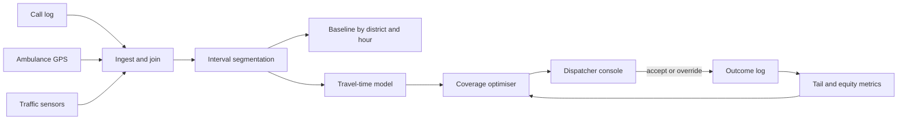
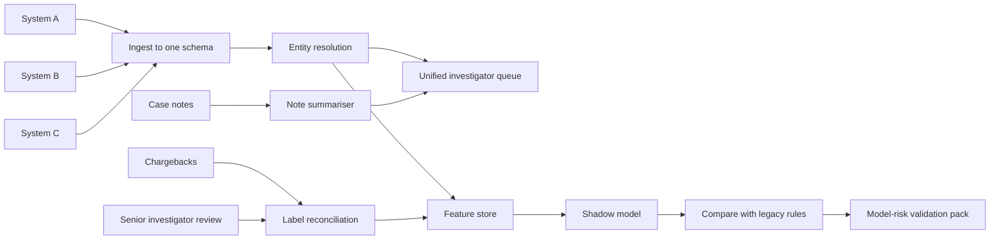
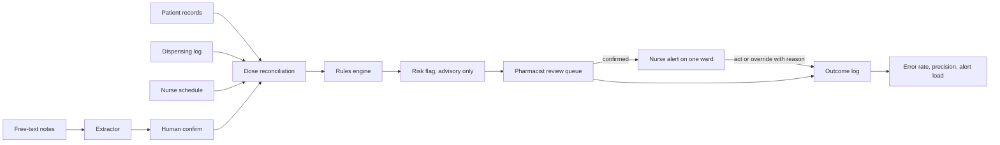

# Decomposition Classics: 911 Response Times, Bank Fraud, Medication Errors

*Commit to a plan early enough to show progress, and late enough that the mission, not the model, has chosen it.*

◷ 26 min

These three prompts are not system-design questions with a hidden right architecture. They test whether the mission gets pinned down before anything is drawn. This page teaches the method once, then runs it three times. The scoping mechanics come from G12 and the evaluation-first habit from G17, and both are named here rather than repeated.

| Case | Prompt (verbatim from the source) | What it tests, per the source |
|---|---|---|
| #67 | "A major city wants to reduce 911 emergency response times. They have call data, traffic sensor data, and ambulance GPS data. You have 60 minutes. Go." | Mission clarification (response time vs. cost vs. equity of coverage), input mapping, sequencing by risk |
| #68 | "A regional bank wants to unify fraud detection across three legacy systems acquired through M&A. None of the data is labeled consistently. How do you scope the first 90 days?" | Data quality realism, phased scoping, regulatory constraints |
| #69 | "A hospital network wants to reduce medication errors in post-surgery care. They have patient records, pharmacy dispensing logs, and nurse assignment schedules. Where do you start?" | High-stakes HITL design, safety-first decomposition |

The repo holds the three prompts, the six-step framework and the Tier 2 probes. It holds no worked answer for any of the three. Every case section is therefore *(own construction)*, built from the framework's arguments. Every number in those sections is an assumption to state aloud, not a sourced fact. Domain facts are general knowledge and are marked where they appear.

---

## 1. Recognise What the Round Is Scoring

The decomposition round is 45 to 60 minutes on a vague enterprise problem. The source describes the task as breaking it "into users, data, workflows, constraints, and a prioritized V1 — out loud, collaboratively." There is no correct answer. The interviewer watches how the path gets chosen when none is given.

Two failure modes eliminate most candidates, and both are in the source. The first is jumping to architecture before clarifying scope. One OpenAI FDE candidate reported being stopped mid-design and asked, "What questions would you ask the customer before designing anything?" The second is hand-waving evaluation. "How do you know your AI system is actually working well?" is used as a deliberate differentiator.

The scoring rewards narration. A polished answer delivered in silence scores worse than messy, well-narrated thinking. The source's pattern note settles the rest: every prompt is business goal first, data second, model last. None of these three prompts asks which model to use.

A reasoning step the interviewer cannot hear cannot be scored. So think aloud continuously, and tie every choice to how it would be evaluated.

## 2. Run the Six Steps on a Sixty-Minute Clock

The source's framework has six steps. The timings below are *(own construction)*, fitted to a 60-minute round, and the first one is the source's own.

| Minutes | Step (source) | Output to leave on the board |
|---|---|---|
| 0–5 | **Clarify the mission.** "Are we optimizing for response time, cost, accuracy, or equity of coverage? Who's the primary user?" | One sentence naming the objective, and the objectives it trades against |
| 5–10 | **Stakeholders and success metrics.** "Who calls this a success, and which number moves?" | A named owner per metric, and one north-star number |
| 10–20 | **Map the inputs.** "What data exists, what shape, who owns it, how fresh?" | The input-map table from section 3 |
| 20–30 | **Decompose into workstreams, sequence by risk.** Data ingestion and quality, the agent or model layer, the operator-facing surface | Three to five workstreams, ordered, with the ordering justified |
| 30–45 | **Walking-skeleton MVP, then iterate.** Ship the thinnest end-to-end version, even with mocked agent logic | A first slice, its architecture, and its evaluation |
| 45–60 | **Adapt live.** The interviewer changes a constraint mid-round | A re-derived plan, with no defence of the old one |

The source gives the canonical curveball: "you lost access to the GPS feed." Re-derive rather than defend. Adaptability is what is being scored in that moment.

When the customer will not confirm an assumption, state it and move on. The companion question bank's opener works for all three cases. "Before proposing a solution, I'd like to clarify the business outcome, primary user, current workflow, constraints, and how success will be measured."

The bank also sets a floor for each case. Produce five clarifying questions, three to five workstreams, three measurable success metrics, two major trade-offs, three failure modes and a phased plan. Each case section below meets that floor.

## 3. Map Every Input Before Naming a Model

A model cannot be chosen before the data that feeds it is known. The input map is the tool that forces this, and the source names its columns: shape, owner, freshness. Data-oriented thinking is the edge the source recommends leaning into.

The template below adds two columns *(own construction)*. One asks what the source can answer. The other asks what could make it lie.

| Source | Shape | Owner | Freshness | What it can answer | Quality risk |
|---|---|---|---|---|---|
| *name* | events, rows, files, free text | the team who can fix it | seconds, hours, days | the question it supports | gaps, drift, label noise, bias |

The "owner" column carries more weight than it looks. A quality problem without an owner stays a quality problem. The "quality risk" column is where the interviewer's first curveball usually lands.

## 4. Sequence Workstreams by Risk, Not by Interest

The source asks for workstreams "sequenced by risk" with the ordering justified. The usual three are data ingestion and quality, the model layer, and the operator-facing surface. The interesting one is almost never the riskiest.

Sequence by asking which unknown, if it turns out badly, kills the project *(own construction)*. That unknown goes first, because every later workstream inherits its answer. In all three cases the answer is the data, not the model.

Then build the walking skeleton. The source's definition is precise: the thinnest end-to-end version, even with mocked agent logic, "to prove the integration story." A mocked model with real data flowing end to end teaches more than a clever model on a spreadsheet.

The G12 pack carries the matching delivery mechanics: stage gates, named sign-off authorities, and refusing to start without measurable success criteria. Use its gate vocabulary when the interviewer asks how a phase ends.

---

## 5. Decompose #67: Define "Faster" Before Touching the Data

*Everything in this section is (own construction). Numbers are assumptions.*

### 5.1 Clarify the mission

"Reduce response time" hides three objectives that pull apart. The source names them: response time, cost, and equity of coverage. A citywide average can fall while the slowest neighbourhoods get slower. That is the trap to name first.

| Ask | Assumed answer | Implication |
|---|---|---|
| Which interval counts: call answered, dispatched, or on scene? | Call received to unit on scene, split into its segments | Decompose the interval before optimising it |
| Is the target an average or a percentile? | 90th percentile for the highest-priority calls, assumed at 8 minutes | Optimise the tail, not the mean |
| Must every district meet it, or only the city? | Every district, and the city reports by district | Equity becomes a hard constraint, not a nice-to-have |
| Can we add units or stations? | No new budget in year one | The levers are placement and dispatch, not headcount |
| Who acts on a recommendation? | The dispatcher, who keeps final authority | The system recommends; a human dispatches |

The last row is the safety boundary. An algorithm that dispatches without a human is out of scope for a first version.

### 5.2 Name stakeholders and metrics

The dispatcher uses the output. The EMS operations chief owns unit placement. The city council answers for equity. Residents feel the result.

The north-star metric is 90th-percentile time to scene for priority-one calls, reported by district. Three guardrail metrics sit beside it. The first is the worst district's 90th percentile, and it must not rise. The second is unit utilisation, which must not burn crews out. The third is calls left uncovered during peaks.

### 5.3 Map the inputs

| Source | Shape | Owner | Freshness | What it can answer | Quality risk |
|---|---|---|---|---|---|
| Call data (computer-aided dispatch log) | One row per call with timestamps per stage | 911 centre | Real time | Where the minutes go: answer, triage, dispatch, travel | Timestamps entered by hand under pressure; priority recoded later |
| Traffic sensors | Speed and volume per road segment | Transport department | Seconds to minutes | Travel-time estimates by time of day | Sensor gaps in outer districts, the very places equity is judged |
| Ambulance GPS | Position pings per unit | EMS fleet | Every few seconds | Actual routes, actual travel times, unit availability | Dropped pings in tunnels; units left "available" when they are not |

The quality risks shape the plan. Traffic sensors are thinnest where the equity constraint bites hardest. So the GPS feed, which records real travel, is the stronger ground truth for travel time.

### 5.4 Sequence by risk

Start by decomposing the interval, because no one yet knows where the minutes go. If most delay sits in call triage, routing optimisation is the wrong project.

| Order | Workstream | Why here |
|---|---|---|
| 1 | Join call records to GPS tracks and segment every call's interval | Every later choice depends on which segment is slow |
| 2 | Descriptive baseline by district and hour | Makes the equity gap visible before anything changes |
| 3 | Pick one lever from the baseline: triage, dispatch choice, or unit pre-positioning | The data chooses the lever, not the team's preference |
| 4 | Dispatcher-facing recommendation surface | Adoption risk is real, but only after the lever is right |

### 5.5 Build the first slice

The first slice is a report, not a model. Segment every priority-one call from the last year into answer, triage, dispatch and travel time. Show it by district and hour.

Assume the result shows travel dominates in two outer districts at night. The second slice is then a pre-positioning recommendation: where idle units should wait, by hour, to cover those districts.

The model comes last, and it is mostly not machine learning. Travel-time estimation is a regression over GPS history. Pre-positioning is a coverage optimisation, a classic operations-research problem. A language model has one sensible role: summarising free-text call notes to speed triage, and only if segment analysis says triage is slow.

### 5.6 Draw the architecture

```
 Call log ──┐                          ┌──────────────────────────┐
 GPS pings ─┼─► Ingest + join on ─────►│ Interval segmentation    │──► Baseline dashboard
 Traffic ───┘   call id / unit / time  │ (answer·triage·dispatch· │     by district × hour
                                       │  travel)                 │
                                       └────────────┬─────────────┘
                                                    ▼
                               Travel-time model ─► Coverage optimiser
                                                    │  (per hour: where idle units wait)
                                                    ▼
                                  Dispatcher console: recommendation + reason
                                                    │  accept / override (logged)
                                                    ▼
                                  Outcome log ──► equity + tail metrics ──► review
```



| Component | Job | Why it exists |
|---|---|---|
| Ingest and join | Link each call to the unit that responded and its GPS track | Without the join, no interval can be segmented |
| Interval segmentation | Split time to scene into its four segments | Chooses the lever |
| Travel-time model | Predict drive time by origin, destination and hour | Feeds the optimiser with realistic times |
| Coverage optimiser | Recommend where idle units should wait | The lever for travel-dominated districts |
| Dispatcher console | Show the recommendation and its reason | Keeps authority with the dispatcher |
| Outcome log | Record every accept and override | The evaluation data, and the audit trail |

### 5.7 Evaluate before anyone asks

Backtest the optimiser on last year's calls first. Replay history with the recommended positions and estimate time to scene. Then pilot in one district at night, with a matched district as comparison.

Two checks gate expansion. The target district's 90th percentile must improve. No other district's 90th percentile may worsen, because moving units toward one area uncovers another. Track dispatcher override rate too. A high override rate means the model is wrong or distrusted, and either one needs an answer.

### 5.8 Name the failure modes

| Failure | Consequence | Control |
|---|---|---|
| The average improves while outer districts worsen | Equity harm hidden by a good headline | District-level 90th percentile as a guardrail metric |
| GPS marks a busy unit as available | The optimiser counts a unit that cannot respond | Reconcile GPS status with dispatch status; stale status fails closed |
| Pre-positioning exhausts crews | Fatigue, then slower responses | Utilisation cap as an optimiser constraint |
| Recommendation outage during a major incident | Dispatchers lose a tool they came to rely on | Console degrades to the standard dispatch view; no call waits on the model |

### 5.9 Adapt when the GPS feed disappears

This is the source's own curveball. Without GPS, actual travel times and live availability are gone. Re-derive: fall back to traffic-sensor travel estimates, and take availability from the dispatch log's status codes.

Then say what degraded. Outer-district estimates get worse, because sensors are thinnest there. So the equity guardrail needs wider error bars, and the pilot should stay in a sensor-rich district until GPS returns.

---

## 6. Decompose #68: Scope Fraud Unification in Ninety Days

*Everything in this section is (own construction). Numbers are assumptions.*

### 6.1 Clarify the mission

"Unify fraud detection" can mean three different projects. One is a single case queue for investigators. Another is one shared set of rules. The third is one new model. They carry different risk, and the 90-day window only fits the first honestly.

| Ask | Assumed answer | Implication |
|---|---|---|
| What hurts today: losses, investigator workload, or customer friction? | Investigators work three queues and miss cross-system fraud | Unify the view and the entity first |
| Which fraud types matter most? | Card fraud and account takeover | Scope the first model to one type |
| What does the regulator expect before a model changes decisions? | Model risk review with documented validation | Plan a validation phase inside the 90 days |
| Can legacy systems be switched off? | No; all three stay live through the period | Run beside them, in shadow |
| Who owns "confirmed fraud"? | Each legacy team, each with its own definition | Label reconciliation is a workstream, not a footnote |

### 6.2 Name stakeholders and metrics

The fraud investigators use the output. The head of fraud owns losses. Model risk and compliance approve anything that changes a decision. Customers feel false positives as declined cards.

The north-star metric is fraud losses caught per investigator hour. Guardrails sit beside it: false-positive rate on legitimate customers, alert volume per investigator, and time to decision.

### 6.3 Map the inputs

| Source | Shape | Owner | Freshness | What it can answer | Quality risk |
|---|---|---|---|---|---|
| Legacy system A: transactions and alerts | Rows, one schema | Team A | Near real time | Its own alerts and outcomes | Its "fraud" label includes chargebacks later found legitimate |
| Legacy system B | Rows, a second schema | Team B | Hourly batch | Its alerts and outcomes | Unlabelled cases mean "not investigated," not "not fraud" |
| Legacy system C | Nightly files | Team C | Daily | Its alerts and outcomes | Customer identifiers differ from A and B |
| Investigator case notes | Free text | All three teams | On case close | Why a case was confirmed or cleared | Inconsistent wording; the richest signal, the least structured |
| Chargebacks and customer disputes | Events | Card operations | Days to weeks | Late but independent ground truth | Arrives long after the transaction |

The prompt's hardest constraint is in this table. "None of the data is labeled consistently" has two layers. The definitions differ between systems, and missing labels mean different things in each. A model trained on the union of the three would learn three definitions of fraud at once.

### 6.4 Plan the ninety days

Sequence by risk. The riskiest unknown is whether one consistent label can exist at all. So the label workstream starts on day one, beside entity resolution.

| Days | Phase | Exit gate | Signed by |
|---|---|---|---|
| 1–15 | **Discover.** Data access, profiling per system, one written definition of confirmed fraud per type | Access is live; profiling report published; draft label definition exists | Head of fraud; data owners |
| 16–40 | **Unify.** Entity resolution across A, B and C; relabel a stratified sample of past cases to the new definition | Match rate measured on a hand-checked sample; relabelled set reviewed by senior investigators | Senior investigators |
| 41–60 | **Single queue.** One investigator view across all three systems, with cross-system entity links; no new model | Investigators use the unified queue; cross-system cases now visible | Head of fraud |
| 61–80 | **Shadow model.** A first model on one fraud type, scoring in shadow beside legacy rules | Beats legacy rules on the relabelled holdout at the agreed false-positive rate | Model risk |
| 81–90 | **Validate and decide.** Model documentation, validation pack, go or no-go for a limited pilot | Model risk approval, or a documented reason to wait | Model risk; compliance |

The honest 90-day deliverable is the single queue plus a validated shadow model. It is not a new production model deciding on transactions. Saying so early is the regulatory realism the source asks for.

### 6.5 Choose the model last

The first value comes with no model at all. Entity resolution plus a single queue reveals fraud that crosses the three systems, and none of them could see it alone.

The model then follows from the labels. With a few thousand relabelled cases, a gradient-boosted classifier over transaction features is the sensible first choice. It is explainable enough for model risk review. Graph features over the resolved entities come next, since fraud rings show up as shared devices and accounts. A language model earns one bounded role: summarising case notes for investigators, and extracting structured reasons from them to help relabelling. A human still confirms every label.

### 6.6 Draw the architecture

```
 System A ─┐                                   ┌─► Unified investigator queue
 System B ─┼─► Ingest + map to one schema ─► Entity resolution ─┤    (cases linked across A/B/C)
 System C ─┘                                   │                └─► Feature store
 Case notes ──► note summariser (assist only) ─┘                        │
 Chargebacks ─► label reconciliation ◄── senior investigator review     ▼
                        │                                     Shadow model (one fraud type)
                        └──────── relabelled training set ───────────►  │
                                                                         ▼
                                            Compare with legacy rules ─► Model-risk validation pack
```



| Component | Job | Why it exists |
|---|---|---|
| Ingest to one schema | Map three schemas to one | Nothing else can compare across systems |
| Entity resolution | Decide which customers, cards and devices are the same | Cross-system fraud is invisible without it |
| Label reconciliation | Apply one definition of confirmed fraud | The prompt's core problem |
| Unified investigator queue | One place to work every case | The first delivered value, with no model risk |
| Note summariser | Condense free-text case history | Speeds investigators; decides nothing |
| Shadow model | Score transactions without acting | Earns evidence before any decision changes |
| Validation pack | Document data, method, performance and limits | What model risk needs to approve a pilot |

### 6.7 Evaluate against a label you trust

Hold out a relabelled sample that no training run ever sees. Compare the shadow model with the legacy rules on that holdout, at a fixed false-positive rate. A higher catch rate at the same customer friction is the claim to prove.

Score chargebacks separately, as a late but independent check. They arrive weeks after the transaction, so they validate rather than train. Measure the note summariser against investigator judgement on a sample, never as a label source.

### 6.8 Name the failure modes

| Failure | Consequence | Control |
|---|---|---|
| Training on the raw union of three label definitions | A model that learns the labelling team, not the fraud | Train only on the reconciled label |
| Reading "unlabelled" as "legitimate" | Uninvestigated fraud becomes negative training data | Treat unlabelled as unknown; sample and relabel |
| Entity resolution merges two real customers | One customer's fraud blocks another's card | Match threshold set on a hand-checked sample; merges reviewable |
| A model changes decisions before validation | Regulatory breach | Shadow only until model risk signs |
| The summariser invents a reason | Wrong label enters training | Summaries assist; a human writes the label |

### 6.9 Adapt when a legacy system cannot be accessed

Assume the interviewer says system C's vendor will not release data for 60 days. Re-derive: deliver the single queue across A and B, and design entity resolution to accept C when it arrives. Then say what that costs. Cross-system fraud touching C stays invisible, so report the queue's coverage as two of three systems and do not claim unification.

---

## 7. Decompose #69: Start Medication Safety at the Human Check

*Everything in this section is (own construction). Numbers are assumptions. Clinical practice named here is general knowledge, not repo material.*

### 7.1 Clarify the mission

The source says this case tests safety-first decomposition. The first safety question is what the system is allowed to do. The answer that survives a hospital's review is narrow: flag risk for a nurse or pharmacist, never change an order.

| Ask | Assumed answer | Implication |
|---|---|---|
| Which errors matter: wrong dose, wrong drug, wrong time, missed dose? | Missed and late doses of time-critical drugs, and wrong-dose opioids | Start with two error types, not all of them |
| How are errors recorded today? | Voluntary incident reports, known to undercount | Build a measured error rate before claiming a reduction |
| What must a clinician confirm? | Every alert is advisory; clinicians act | The system flags, a human decides |
| What alerts already exist? | Pharmacy checks at order time | Avoid duplicating them, and avoid adding noise |
| Who governs clinical decision support? | A pharmacy and therapeutics committee | It approves thresholds and rules |

Alert fatigue is the constraint that hides behind "safety-first." A system that fires constantly gets ignored, and an ignored alert is worse than none. So precision is a safety property here, not a nice-to-have.

### 7.2 Name stakeholders and metrics

Nurses administer the drugs. Pharmacists verify orders. The chief nursing officer owns ward practice. Patient safety leads own the error measurement. Patients bear the harm.

The north-star metric is the measured rate of target errors per 1,000 doses administered after surgery. Guardrails sit beside it: alerts per nurse per shift, alert override rate, and time added to administration.

### 7.3 Map the inputs

| Source | Shape | Owner | Freshness | What it can answer | Quality risk |
|---|---|---|---|---|---|
| Patient records | Orders, allergies, weights, labs, notes | Clinical informatics | Minutes | What was ordered, and for whom | Weight missing or stale; free-text notes |
| Pharmacy dispensing logs | Rows per dispense | Pharmacy | Real time | What left the pharmacy, when | Dispensed is not administered |
| Nurse assignment schedules | Nurse to patient to shift | Nursing management | Per shift | Who was responsible, and their load | Swaps and float staff not updated |

The gap between the first two rows is the finding. The data shows ordered and dispensed. It may not show administered. If bedside barcode scanning exists, administration records close the gap. If not, the first slice has to measure errors by reconciling orders against dispensing times.

### 7.4 Sequence by risk

| Order | Workstream | Why here |
|---|---|---|
| 1 | Measure: reconcile orders, dispensing and administration into a baseline error rate | Without a baseline, no reduction can be claimed |
| 2 | Find where errors cluster: drug, ward, shift, nurse load | Chooses the intervention |
| 3 | Retrospective rules, validated by pharmacists | Proves precision before anything reaches a ward |
| 4 | Advisory alerts on one ward, in shadow first | Adoption and alert fatigue are tested on real shifts |

The nurse schedule enters at step two, not as a target. The question is whether errors rise with patient load or at handover. The answer should drive staffing and handover decisions. It should never become a score for individual nurses. A tool seen as surveillance stops getting honest incident reports.

### 7.5 Build the first slice

The first slice is retrospective. Take three months of post-surgical orders for the target drugs. Reconcile each scheduled dose against dispensing and administration records. Flag doses that were late, missed, or outside the weight-based range. Pharmacists review a sample of flags and mark each true or false.

That gives a baseline error rate and a precision figure for the rules at the same time. No patient is touched.

The model comes last. Rules cover the first version: dose range per kilogram, time windows for time-critical drugs, duplicate therapy. A learned risk score comes later, ranking which patients need a pharmacist review first. A language model's role is narrow: extracting weight or allergy from free-text notes when the structured field is empty. That extraction always goes to a human for confirmation.

### 7.6 Draw the architecture

```
 Patient records ─┐
 Dispensing log ──┼─► Dose reconciliation ─► Rules engine ─────► Risk flag
 Nurse schedule ──┘   (ordered vs dispensed   (dose/kg, time      │  (advisory only)
                       vs administered)        window, duplicate) ▼
                                                        Pharmacist review queue
 Free-text notes ─► extractor (weight/allergy) ─► human confirm      │ confirm / dismiss
                                                                      ▼
                                              Nurse alert (one ward, after shadow)
                                                                      │ act / override + reason
                                                                      ▼
                                           Outcome log ─► error rate · precision · alert load
```



| Component | Job | Why it exists |
|---|---|---|
| Dose reconciliation | Line up ordered, dispensed and administered per dose | Produces the baseline and the signal |
| Rules engine | Apply committee-approved checks | Explainable, auditable, fast to change |
| Pharmacist review queue | Confirm a flag before it reaches a nurse | The human check that keeps precision high |
| Nurse alert | Show a confirmed risk at the right moment | The intervention itself |
| Extractor with human confirm | Fill missing structured fields from notes | Never writes to the record unconfirmed |
| Outcome log | Record every flag, action and override | The evaluation data and the audit trail |

### 7.7 Evaluate for precision and harm, not accuracy

Three numbers gate the pilot. The first is precision of flags, measured by pharmacist review; low precision breeds alert fatigue. The second is recall on known incidents: how many reported errors the rules would have caught. The third is the measured error rate on the pilot ward against a matched ward.

Watch alert load per nurse per shift as a hard ceiling. Read override reasons weekly. A cluster of identical overrides is a rule that is wrong.

### 7.8 Name the failure modes

| Failure | Consequence | Control |
|---|---|---|
| Too many alerts | Nurses ignore all of them, including the real ones | Pharmacist confirmation first; per-shift alert ceiling |
| A stale weight drives a dose check | A false alarm, or a missed overdose | Weight age shown with every flag; stale weight is itself a flag |
| Dispensed read as administered | Missed doses stay invisible | Use administration records, or say plainly they are missing |
| Schedules used to rank nurses | Reporting stops; safety culture erodes | Aggregate by ward and shift only; governance rule |
| System outage | Loss of a secondary check | Existing pharmacy checks remain the primary control |

### 7.9 Adapt when administration records do not exist

Assume the interviewer says there is no bedside scanning. Re-derive: measure what can be measured, which is ordered against dispensed timing. Say what that misses. Wrong-patient and wrong-time administration stay invisible. The strongest recommendation may then be bedside scanning itself, not software. Saying so is the "is AI the right solution" judgement the question bank asks for.

---

## 8. Compare the Three Side by Side

The method repeats. The mission, the riskiest input and the human boundary change every time.

| | #67 911 response | #68 Bank fraud | #69 Medication errors |
|---|---|---|---|
| Hidden conflict in the mission | Speed vs. cost vs. equity | Catch rate vs. customer friction vs. regulatory approval | Safety vs. alert fatigue vs. nurse time |
| Riskiest input | Traffic sensors, thin where equity is judged | Labels, defined three ways | Administration records, which may not exist |
| First slice | Interval segmentation report | Single investigator queue | Retrospective dose reconciliation |
| Model, chosen last | Travel-time regression plus coverage optimisation | Explainable classifier on one fraud type | Rules first, risk ranking later |
| Language model's role | Summarise call notes, if triage is slow | Summarise case notes; help relabel | Extract missing fields, human-confirmed |
| Human boundary | Dispatcher keeps authority | Model risk signs before any decision changes | Pharmacist confirms before a nurse is alerted |
| Guardrail metric | Worst district's 90th percentile | False-positive rate on legitimate customers | Alerts per nurse per shift |
| Source curveball or likely one | GPS feed lost | A legacy system withheld | No bedside scanning |

Read the fifth row as a pattern. In none of the three is a language model the core. Each gets a bounded assisting role behind a human. That is the source's pattern made concrete: goal first, data second, model last.

## 9. Answer the Tier 2 Probes These Cases Invite

The source lists 27 Tier 2 probes. These six are the ones these three cases draw. Answers are *(own construction)*.

**"When do you route to human-in-the-loop?"** Route whenever the action is irreversible, regulated, or clinical. In all three cases that means always, for version one. The system recommends and the human decides. The design question is where the human sits: the dispatcher at the console, model risk at the gate, the pharmacist before the nurse.

**"How does auditing and logging drive HITL decisions?"** Log every recommendation with its reason, and every accept or override with the human's reason. Override clusters show where the system is wrong. Falling override rates, on cases later confirmed correct, are the evidence for widening automation.

**"What metrics matter beyond task success?"** Guardrail metrics that catch harm the headline hides. The worst district's percentile, false positives on legitimate customers, and alerts per nurse per shift. Each can worsen while the headline improves.

**"Design an evaluation harness."** Backtest on history first, then shadow, then a pilot against a matched comparison. Hold out a labelled set the model never trains on. For #68 the holdout is relabelled to the one definition. For #69 it is pharmacist-reviewed.

**"Graceful degradation when the model is unavailable?"** Each design keeps the existing process as the primary path. The dispatcher's standard view, the legacy fraud rules, and the pharmacy's order-time checks all stay live. The system adds a check; an outage removes the addition, never the baseline.

**"How do you detect goal drift?"** Watch the guardrail metrics, not only the target. A fraud model can raise its catch rate by declining more customers. A coverage optimiser can cut the average by abandoning the far districts. The guardrail metric is how drift shows up.

## 10. Open Each Case in Two Minutes

Each opener is *(own construction)*. Say it before drawing anything.

**#67.** "Before designing anything, I want to pin down what faster means. Response time can be improved on average while the outer districts get slower, so I'd ask whether the target is a citywide average or a percentile every district must meet. I'd also ask which interval counts. Time to scene has four parts: answering, triage, dispatch and travel. I'd assume the goal is the 90th percentile for priority-one calls, by district, with no new budget. The first thing I'd build isn't a model. It's a join of call records and GPS tracks that shows where the minutes go. If travel dominates, the lever is where idle ambulances wait. If triage dominates, it's a completely different project. Dispatchers keep authority throughout."

**#68.** "The hard part here isn't the model, it's that three systems each mean something different by fraud. So in the first 90 days I'd deliver two things. The first is one investigator queue across all three systems, with customers matched between them. That creates value on its own, because fraud that crosses systems becomes visible. The second is a relabelled sample with one agreed definition, and a shadow model on one fraud type validated against it. Nothing changes a decision until model risk signs off. I'd also be clear that unlabelled cases mean uninvestigated, not legitimate."

**#69.** "I'd start by asking what the system is allowed to do, and I'd propose it only flags risk for a clinician. It never changes an order. Next I'd want to measure the error rate, because incident reports undercount. The first slice reconciles ordered, dispensed and administered doses for a few time-critical drugs after surgery. Pharmacists review the flags. That gives a baseline and a precision figure before any alert reaches a ward. Precision matters because alert fatigue is itself a safety risk. Nurse schedules help find where errors cluster, by load and handover, never to rank nurses."

## 11. Answer the Cost Pivot in Ten Minutes

The source has no cost drill for these cases, so the card is *(own construction)*. It is grounded in two drivers from the cost playbook: agent steps and tool calls, and batch jobs and evaluation pipelines. The pivot to expect is "this is getting expensive, where does the money go?"

| | |
|---|---|
| Dominant driver | Not model calls. It is data engineering and human review time: joins, entity resolution, relabelling and pharmacist confirmation. Model spend is small because the core models are regressions, classifiers and rules. Language models run only on notes. |
| Cheapest lever first | Keep language models off the high-volume streams: GPS pings, transactions and dispensing events. Run them only on the narrow text tasks, in batch, with a small model. Spend human review on a stratified sample, not on every record. Reuse the relabelled set as the evaluation set. |
| Metric that proves it | Cost per investigated case (#68); pharmacist minutes per confirmed flag (#69); cost per recommendation accepted (#67); language-model calls per thousand events, which should stay near zero |
| Do not | Send every transaction, GPS ping or dispense event to a language model, or cut human review below the level that keeps precision safe |
| 60-second line | These systems are cheap in compute and expensive in people. The models that matter are small. The expensive part is building one trustworthy label, so spend review time on a stratified sample and reuse it for evaluation. Keep language models on notes, in batch, and off the event streams. |

The four verbs still generate the answer. Measure human-review minutes and model calls per case. Route high-volume events to rules and small models, and text to a language model only in batch. Bound review to a sample. Cache resolved entities and reconciled labels so no one pays twice.

---

## Key Takeaways

- The round scores clarifying and narrated reasoning, and it fails architecture-first answers and hand-waved evaluation.
- Six steps on a clock turn a vague prompt into a mission, owners, an input map, ordered workstreams, a walking skeleton and a live re-plan.
- The input map, with owner and quality-risk columns, is the tool that stops a model being chosen before its data is understood.
- Workstreams go in order of which unknown could kill the project, and in all three cases that is the data.
- #67 decomposes time to scene first, protects the worst district, and treats the model as regression plus optimisation.
- #68 delivers a single queue and one reconciled label in 90 days, with a shadow model that changes nothing until model risk signs.
- #69 lets the system only flag, measures the error rate before reducing it, and treats alert fatigue as a safety risk.
- Side by side, the mission, the riskiest input and the human boundary change, and the language model is never the core.
- The Tier 2 probes are answered with human boundaries, guardrail metrics, staged evaluation and existing processes as fallback.
- Each opener names the hidden conflict and the first slice within two minutes.
- The cost pivot lands on people, not tokens: sample human review and keep language models off the event streams.

## Check Yourself

1. **What are the two failure modes the source says eliminate candidates?** Jumping to architecture before clarifying scope, and hand-waving evaluation.
2. **What are the six steps, in order?** Clarify the mission; stakeholders and success metrics; map the inputs; decompose into workstreams sequenced by risk; walking-skeleton MVP; adapt live.
3. **Which two columns does this page add to the input map, and why?** "What it can answer," which ties data to the decision, and "quality risk," where curveballs land.
4. **In #67, why segment the interval before building anything?** The slow segment chooses the lever. If triage dominates, routing work is the wrong project.
5. **In #67, which metric protects equity?** The worst district's 90th-percentile time to scene, which must not rise.
6. **In #67, what changes when GPS disappears?** Travel estimates fall back to traffic sensors, which are thin in outer districts. The pilot stays in a sensor-rich district, and equity error bars widen.
7. **In #68, why is "unlabelled" not "legitimate"?** Unlabelled cases were never investigated, so treating them as negatives teaches the model that uninvestigated fraud is fine.
8. **In #68, what is the honest 90-day deliverable?** A single investigator queue plus a validated shadow model on one fraud type, not a production model deciding transactions.
9. **In #69, why is precision a safety property?** Low precision causes alert fatigue, and ignored alerts include the real ones.
10. **In #69, why must nurse schedules never rank nurses?** Surveillance stops honest incident reporting, which the error measurement depends on.
11. **Across all three, what role does a language model play?** A bounded assisting role on free text, behind a human, never the core decision.
12. **What is the 60-second cost answer?** These systems cost people, not tokens. Sample human review, reuse the reviewed set for evaluation, and keep language models on notes in batch.

## References

All paths are relative to `06_Interview_Prep/`.

| Section | Source |
|---|---|
| Case table, 1, 2, 4, 5.9 (the GPS curveball), 9 (probe wording) | `OpenAI_Applied/Sample_Questions/openai_decomposition_interview_prep.html`: section 1 (what the round is, two failure modes, scoring), section 2 prompts 2–4 (#67, #68, #69) and the pattern note, section 3 Tier 2 probes, section 4 six-step framework |
| 2 (opener and practice floor), 7.9 ("is AI the right solution") | `OpenAI_Applied/Sample_Questions/OpenAI Applied_Engineer_Problem_Decomposition_Questions.md`: reusable answer template, preparation plan, Questions 12 and 18 |
| 4 (gate vocabulary), 6.4 (gated phases) | `AI_Engineer/Delivery Framework from Scoping to Delivery/docs/01-theory.md` (stages, gates, named sign-off authorities); `Case_Study_Groups/G12_Scoping_To_Deployed_Agent.md` |
| 11 | `Study_Guides/Cost_Latency_Optimization/CORE_8_DRIVERS_MEMORIZE.md`, drivers 5 (agent steps and tool calls) and 8 (batch jobs and evaluation pipelines) |
| 3 (added columns), 5, 6, 7, 8, 9 (answers), 10, 11 (card), and every item marked own construction | Built for this page from the sources' arguments; not source material. The repo has no worked treatment of emergency dispatch, bank fraud or medication safety. |
| Cross-references | G12 (scoping gates), G17 (evaluation raised unprompted, the #66 sibling prompt) in `Case_Study_Groups/`; #62 (building when the customer's data is poor) overlaps #68 |
