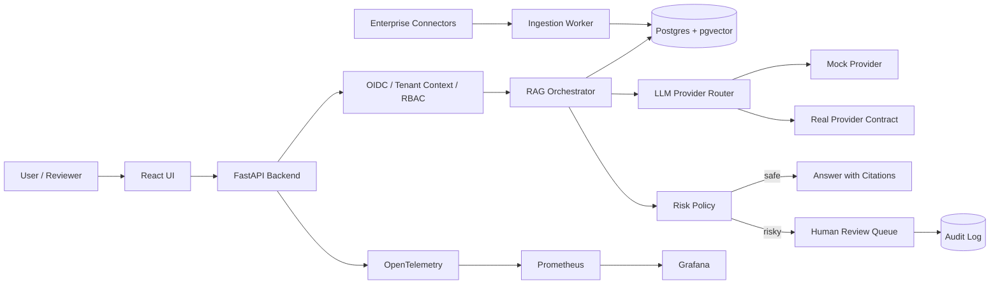

# GenAI FDE Production Lab

A production-aware companion repository for serious GenAI Forward Deployed Engineer interview preparation.

This repository helps candidates demonstrate that they can explain and build a working enterprise GenAI system, not merely study a template.

## What this repo demonstrates

- Multi-tenant RAG with permission-aware retrieval
- PostgreSQL + pgvector as the default vector-store target
- LLM provider abstraction with mock and real-provider contracts
- Real local semantic embeddings with normalized dense vectors, local caching, refresh, delete, and permission sync patterns
- Human-in-the-loop approval queue for risky AI actions
- Audit logging, review states, override reasons, and escalation logic
- Evaluation scripts and CI quality gates
- OpenTelemetry, Prometheus, and Grafana observability setup
- Incident simulations for latency, permission leakage, stale indexes, bad retrieval, and cost spikes
- MCP server example with safe tools and audit checks
- A2A-style agent communication with tenant and trace context
- Text-to-SQL validation, read-only enforcement, sandboxing, and approval gates
- Docker Compose, Kubernetes, and Terraform examples

## Honest positioning

This is a production-aware educational reference system. It is not a drop-in enterprise platform. It is built to show architecture, trade-offs, safety controls, evaluation, observability, and interview-ready reasoning.


## Semantic embedding and retrieval contract

The canonical local RAG path uses a real neural embedding model: `sentence-transformers/all-MiniLM-L6-v2`. During ingestion, every cleaned document chunk is converted into a dense numeric vector. Query text is embedded with the same configured provider. Document and query vectors are L2-normalized and compared with cosine similarity.

The default implementation runs on CPU and does not require a paid API or cloud account. The first setup normally downloads the model; after it is cached under `.cache/models`, the embedding path can run without network access. Computed chunk embeddings are cached separately in SQLite under `.cache/embeddings`.

An optional Vertex AI adapter demonstrates how the same application-level `EmbeddingProvider` contract can connect to a managed Google Cloud service. It is not required for the canonical local path.

Deterministic unit tests use a clearly labelled fake provider. It is not presented as semantic. A separate integration test uses the real local model and checks ranking behavior rather than exact floating-point values.

The local model is intended for interview preparation, architecture demonstration, and small-scale retrieval workloads. It is not claimed to be the best model for every language, domain, or production corpus. The PostgreSQL/pgvector adapter remains an explicit extension point.

Install semantic dependencies and verify the setup:

```bash
pip install -e ".[semantic]"
python scripts/download_embedding_model.py
python scripts/verify_local_embedding_setup.py
```

Optional Vertex AI support:

```bash
pip install -e ".[vertex]"
```

## Architecture



## Quickstart

```bash
cp .env.example .env
make test
make eval
make seed
```

For the full local stack:

```bash
docker compose up -d
```

## Interview demo flow

1. Seed two tenants and demo enterprise documents.
2. Ask a tenant-scoped RAG question.
3. Verify cross-tenant chunks are not retrieved.
4. Trigger a risky action such as refund approval or SQL execution.
5. Review, edit, approve, reject, or escalate the request.
6. Inspect the audit log.
7. Run evaluation quality gates.
8. Trigger an incident simulation and explain detection, mitigation, and prevention.

## What to say in interviews

Weak: "I built a RAG chatbot."

Strong: "I built a production-aware enterprise GenAI workflow with tenant-aware retrieval, permission filtering before prompt assembly, provider abstraction, HITL approval gates for risky actions, evaluation thresholds in CI, audit logging, incident simulations, and observability hooks."
