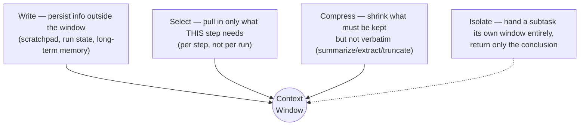
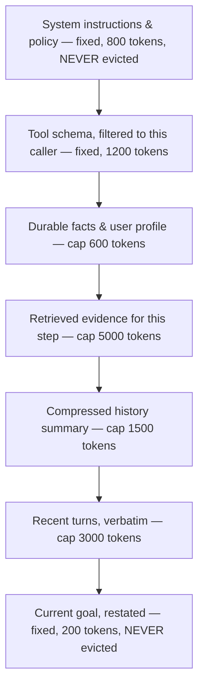
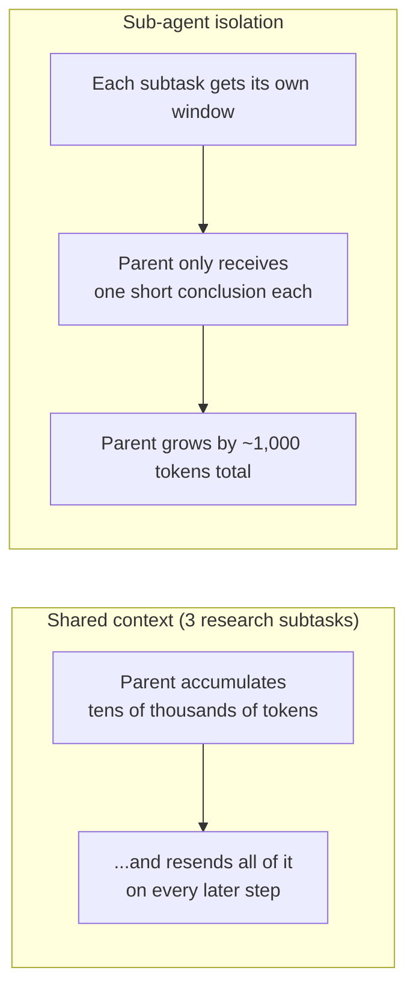

# Chapter 6 — Orchestration and Context Engineering

Picture an internal ops agent with write access to a config service, used by
about sixty engineers. Every request it gets — "bump this timeout," "roll
back that flag" — raises the same question: what should happen next, and who
decides? That's orchestration. And once it decides, what does it actually see
when it decides? That's context engineering. Both come down to spending a
scarce resource — control, and tokens — deliberately instead of by default.

## Control Is a Resource You Allocate

**Every step an agent takes was preceded by a decision about what to do
next, and that decision can live in one of three places: fixed code, a small
model, or the reasoning model itself.**

When our ops agent gets "bump the timeout on service X," you could let the
big model decide everything — or you could push that decision down to
something cheaper and more predictable, and save the big model for the cases
that actually need it.

| Where the decision lives               | Cost              | Testable?             | Handles novelty?                |
| -------------------------------------- | ----------------- | --------------------- | ------------------------------- |
| In code (a fixed edge)                 | Free              | Fully                 | No — only what you anticipated |
| In a small model (a classifier/router) | Cheap             | Against a labeled set | Only within labels you defined  |
| In the reasoning model                 | A full model call | Resists testing       | Yes                             |

**Key points**

- Most systems put far more decisions in the reasoning model than they need to, purely out of convenience — and then pay for that convenience on every single request, forever.
- The habit worth building: for each decision, ask "could this live one level down?"

> **🎯 OpenAI Interview Pointer**
> The book calls this out directly: a candidate who audits decisions this way in an interview reads as someone who has actually operated a system at cost, not just designed one on a whiteboard.

## Six Orchestration Topologies

**Six repeatable shapes cover how agent systems structure "what happens
next" — and real systems almost always compose more than one of them.**

For our ops agent: a config change request gets classified (router), most
known request types run a fixed workflow (sequential), anything ambiguous
drops into a bounded loop that reasons step by step, and if a step needs three
independent lookups, they fan out in parallel.

| Topology         | Select when                                  | Latency                     | Dominant risk                         |
| ---------------- | -------------------------------------------- | --------------------------- | ------------------------------------- |
| Sequential       | Steps are known and strictly ordered         | Sum of steps, predictable   | Rigid — no recovery path             |
| Router           | Intents are enumerable and disjoint          | One extra small call        | Silent misroute degrades quality      |
| Parallel fan-out | Subtasks are genuinely independent           | Slowest branch              | Merge conflicts, cost multiplies      |
| Bounded loop     | Next step depends on the last observation    | Variable, needs bounds      | Oscillation, no-progress cycles       |
| Hierarchical     | Distinct specialities, tools, or data scopes | Delegation overhead per hop | Coordination cost exceeds the benefit |
| Event-driven     | Work arrives async, over long horizons       | Decoupled from the request  | Ordering, duplicates, poison messages |

**Key points**

- A realistic production shape: an event consumer receives work → a router classifies it → most classes run a sequential workflow → the residual (ambiguous) class enters a bounded loop → the loop uses parallel fan-out for retrieval within a single step.
- Track the **traffic share** of each path continuously, not once at launch. Router drift — where more and more traffic silently slides into the expensive loop — is the most common silent quality regression in production agents.

> **🔍 Deep Dive: the composed orchestrator pattern**
> A router (small model) checks confidence and complexity. High confidence + low complexity → run the matching deterministic workflow. If that workflow fails structurally, it escalates to the bounded loop *once* — bounded, so a broken workflow can't silently double-spend on every request forever. Every routing decision gets logged as a metric dimension (not just a log line), because router drift is invisible without that time series.

> **🎯 OpenAI Interview Pointer**
> Naming this composition explicitly — "I'd compose these, not pick one" — is a stronger answer than naming a single topology, because it's what production systems actually look like. The book says this directly.

## Context Engineering: The Four Operations

**Context engineering is deciding exactly what goes into the model's context
window at each step, under a fixed token budget, on purpose — not by
accident. It replaced prompt engineering as the core skill for the same
reason schema design replaced query tuning: the structural decision dominates
the local one.**

Every strategy for managing context reduces to four operations:

**Key points**

- **Write** early — anything you didn't write down can't be recovered after a compaction pass.
- **Select** per step, not per run — a tool result that mattered at step 2 is usually noise by step 7.
- **Compress** is lossy by definition, so choose deliberately what to lose (extraction into a structured record beats prose summarizing beats blind truncation).
- **Isolate** is the strongest, most underused lever — more on this below.

## Deterministic Context Assembly

**Assemble every step's context in a fixed section order, with a fixed token
budget per section — and when something has to go, cut inside a section,
never across the whole window.**

For our ops agent, a step's context always looks like this, in this order:

**Key points**

- **Order buys cacheability.** Providers can only cache a prompt prefix if it's byte-identical across requests — put instructions and tool schema first, never insert anything above them, and a large share of your input tokens become cheap cache hits (Chapter 14 quantifies this).
- **Order buys debuggability.** A deterministic assembler means you can reconstruct exactly what the model saw at any step, from the trace alone — turning a guessing exercise into a reading exercise.
- When a section overflows its own cap, trim proportionally *within that section* and leave an explicit marker ("[...240 tokens omitted...]") — never silently pretend the content never existed.

> **🔍 Deep Dive: the bug that will not stay fixed by accident**
> The most common context bug is "if too long, drop from the front." Since system instructions sit at the front, a long-running agent quietly loses its policy, its tool guidance, its safety constraints — and starts behaving like a general-purpose assistant holding production credentials. **Global truncation deletes your instructions.** The fix isn't "be careful" — it's structural: mark instructions and the current goal as non-evictable, and evict only inside the other sections.

## Context Rot and Sub-Agent Isolation

**Model accuracy degrades as the context window fills up, and unevenly —
information stuck in the middle gets retrieved less reliably than information
at either end. A run with three well-chosen observations often beats the
same run stuffed with twelve.**

**Key points**

- **Isolate** when a subtask's intermediate steps aren't needed downstream — the common case for research, verification, extraction.
- **Share** context only when steps genuinely need to reason across each other's intermediates — rarer than it feels.
- On a real ten-step run, isolating typically cuts billed input tokens by **an order of magnitude**.
- The one thing you give up: auditability across the boundary. Store the sub-agent's full trace and link it from the parent's span, or a wrong conclusion becomes unexplainable.

> **🔍 Deep Dive: The Agent That Forgot Its Own Safety Policy at Step Nine**
> A real production incident from the book. An internal ops agent (this chapter's own running example) behaved correctly on short runs — but past ~8 steps, it started approving config changes its own policy prohibited, including production edits outside the approved change window. The cause: the context builder truncated from the *front* once the total got too long, and the safety policy sat at the front. By step nine, the policy was gone entirely — the model was just a general assistant holding production credentials. Worse, the team's evaluation suite only used short scenarios, so the bug was invisible to every test they had. **The fix:** sectioned assembly with non-evictable instructions, in-section eviction, an assertion that the rendered context always contains the policy hash — and a new standing requirement that any agent with write access gets tested on runs that deliberately exceed the compaction threshold.

> **🎯 OpenAI Interview Pointer**
> This exact scenario — "answer quality degrades on long runs but every component tests clean" — is a documented interview drill in this book. The strong answer starts with "reconstruct exactly what the model saw at that step" before guessing at causes, then checks instruction eviction first, then context rot. Most candidates jump straight to "maybe the model's not good enough" — naming the actual mechanism is what separates a senior answer.

---

## Cheat Sheet

| Concept                 | The one thing to remember                                                                           |
| ----------------------- | --------------------------------------------------------------------------------------------------- |
| Control placement       | Push every decision as far down as it will go — code, then small model, then reasoning model last  |
| Six topologies          | Real systems compose them; naming the composition beats naming one topology                         |
| Four context operations | Write early, select per step, compress deliberately, isolate for long horizons                      |
| Deterministic assembly  | Fixed section order + fixed budgets = cacheable and debuggable; evict inside sections, never across |
| Context rot             | Three well-chosen observations can beat twelve; isolate subtasks into their own window              |
