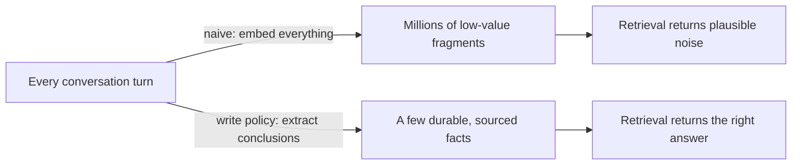
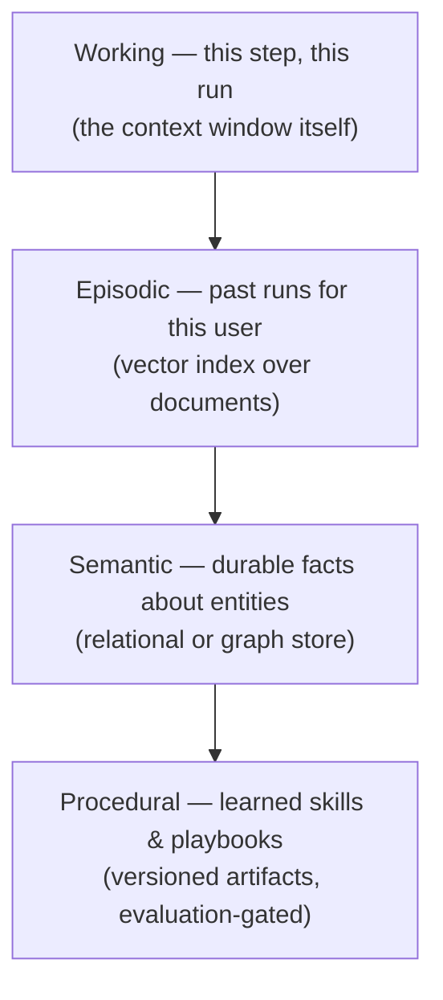
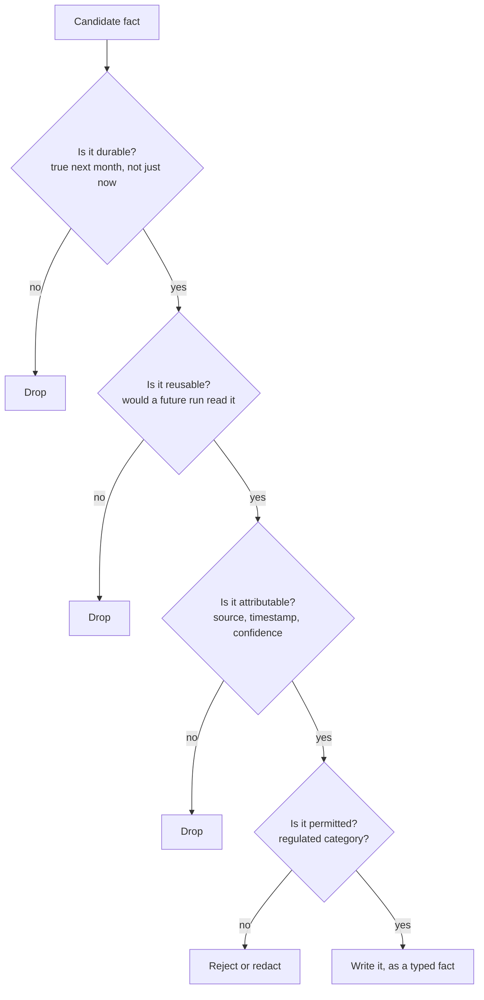
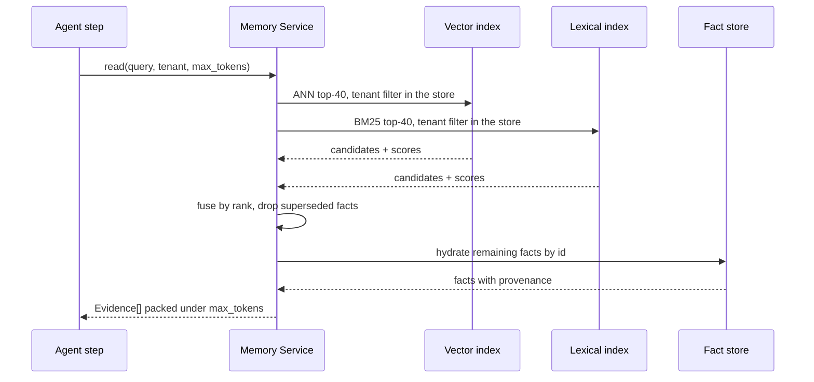
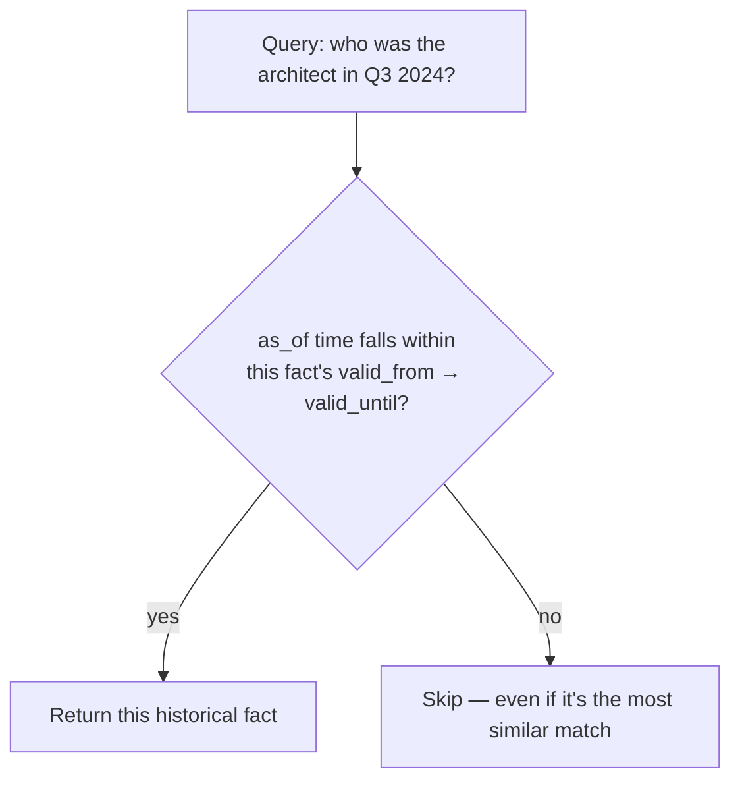

# Chapter 7 — Knowledge, Memory, and Retrieval

Picture that same ops agent, but now think months ahead: it needs to remember
that a service's on-call rotation changed, forget a config preference someone
retracted, and never leak one team's incident details to another team. Most
teams build this by dumping every conversation into a vector store and hoping
retrieval sorts it out. That's backwards. Memory is a write problem before
it's a retrieval problem — the highest-leverage decisions are about what
never gets stored in the first place.

## Memory Is a Write Problem

**The most valuable memory entries are conclusions with a source attached —
"the billing contact is finance@acme.example, confirmed 3 March from ticket
88214" — not raw transcript fragments.**

Six months of embedding every conversation turn gets you a store full of
low-value fragments, retrieval that returns plausible-looking noise, and an
agent that confidently recalls a preference the user retracted back in March.

**Key points**
- Retrieval quality is bounded above by what you chose to store — you can't retrieve your way out of a bad write policy.
- When an interviewer asks "how would you design agent memory," leading with the write policy (not the vector index) is the differentiating move.

## The Four Memory Tiers

**Four tiers, each suited to a different question and a different storage
technology — using the wrong store for a tier is where most memory systems
quietly break.**

**Key points**

| Tier | Natural query | Storage fit | Dominant failure |
|---|---|---|---|
| Working | Direct assembly | The context window | Eviction deletes instructions (Ch. 6) |
| Episodic | Similarity + recency | Vector index over documents | Unbounded growth, retrieval noise |
| Semantic | Exact key lookup + filter | Relational or property graph | Stale facts, unresolved contradictions |
| Procedural | Match by task signature | Versioned artifact registry | Promotion without an evaluation gate |

> **🔍 Deep Dive: why "what's the renewal date" breaks in a vector store**
> A fact with exactly one correct value, retrieved by similarity, comes back with several *plausible* alternatives and no way to choose between them. "This customer's tier" or "this contract's renewal date" needs exact lookup by key — not nearest-neighbor search. Teams that force semantic facts into a vector store discover this the hard way.

> **🎯 OpenAI Interview Pointer**
> "Why not just put everything in a vector store?" is a near-guaranteed follow-up. The specific answer — similarity search can't distinguish "the one correct value" from "several plausible ones" — is exactly the detail that shows real understanding.

## The Write Policy

**Before any candidate memory gets written, it has to pass four gates.**

**Key points**
- Facts are extracted as typed `(subject, predicate, value)` records at write time — never stored as raw conversation turns.
- Regulated categories (health, payment, government IDs) get enforced on the *write* path — the read path is too late.
- When a new fact contradicts an old one on the same predicate, the old one is **superseded, not deleted** — kept with a pointer, so the system can still answer "why did it believe X back in April?"

> **🔍 Deep Dive: the memory that remembered a retracted instruction for four months**
> A real case from the book. A user told a scheduling assistant in January to always book travel through a specific vendor. In February the firm switched vendors and the user said so — but through May, the assistant kept proposing the *original* vendor about one time in four. Why: both statements were stored as separate episodic entries, and retrieval just returned whichever was more *similar* to the current query — the January phrasing happened to rank higher, more often than not. Nothing in the system knew the two entries were about the same predicate, because neither had been normalized into a fact. **Fix:** extract typed facts so contradicting statements about the same predicate collide by construction, supersede instead of coexisting, and add an evaluation suite that seeds contradictory histories and asserts the newer fact wins — now part of the release gate.

## The Retrieval Contract

**Every memory read must be bounded by tokens, scoped by tenant, and
attributable to a source — those three properties are what keep memory from
being a source of randomness.**

**Key points**
- Tenancy is enforced **inside the store** (row-level security or separate indexes), not just as an application-layer filter that could silently fail open.
- Dense (embedding) search and lexical (BM25) search get combined by **rank**, not by raw score.

> **🔍 Deep Dive: fuse by rank, never by raw score**
> The obvious approach — `0.7 × cosine + 0.3 × BM25` — breaks for three reasons: cosine similarity and BM25 sit on incomparable scales, so the weights are arbitrary; BM25 scores drift as the corpus grows, silently changing the effective weighting over time; and normalizing requires knowing each score's distribution, which changes every time either index gets retuned. **Reciprocal rank fusion** fixes this: score each document as `Σ 1/(k + rank)` across the result lists (k = 60 is the standard default). Only ordinal position matters, so it's scale-free and stable across reindexing. The same principle — combine by rank, not by incomparable scores — also applies to combining a judge's rating with a heuristic metric (Ch. 12), or fusing reranker outputs.

> **🎯 OpenAI Interview Pointer**
> This is a real interview drill in the book: "explain why you'd fuse by rank rather than by score, and where else this reasoning applies." Answering with the *general principle* (ordinal beats cardinal combination when scales are incomparable) — not just the RRF formula — is what separates a strong answer.

## Consolidation, Decay, and Forgetting

**Facts should fade on a schedule, not accumulate forever — otherwise "eviction volume" becomes the only warning sign that your write policy is admitting the wrong things.**

**Key points**
- Each fact scores on **salience**, which decays with age (a configurable half-life, e.g. 90 days) unless it keeps getting retrieved and used.
- Consolidation runs **offline**, not on the request path — a background job clusters episodic facts by subject/predicate and distills them into stable semantic traits.
- Decay should happen **per predicate**, not globally — some facts (a customer's tier) barely age; others (this week's on-call engineer) age fast.

## Multi-Tenancy, Erasure, and Audit

**A regulated buyer will audit three things: that one tenant's memory can never leak to another, that deletion is actually complete, and that every answer can point to its source.**

**Key points**
- **Isolation**: enforced in the store (row-level security or physically separate indexes) — an application-level filter fails open under an untested code path, and that failure is a cross-tenant data leak.
- **Erasure**: a deletion request must remove the fact, its vector, its lexical posting, *and* every cached summary derived from it. Design this fan-out from day one — retrofitting it later is genuinely hard.
- **Explainability**: for any answer, the system must produce which memory entries contributed and their sources — this falls straight out of storing provenance in the schema, not bolting it on as a log line.

## Hierarchical Memory Compaction and Lifecycle Garbage Collection

**At millions of episodic observations, raw vector search breaks down —
index bloat, semantic collisions, contradictory recall. The fix is a
three-tier lifecycle that consolidates as data ages.**

**Key points**
- A background batch job inspects hundreds of episodic facts, clusters by subject/predicate, resolves contradictions, and writes compact consolidated traits.

> **🔍 Deep Dive: GDPR Article 17 — hard erasure, not soft deletion**
> When a "right to be forgotten" request arrives, soft-deletion isn't legally sufficient. A compliant erasure is a coordinated purge across every tier: hard-delete matching rows in the relational store → delete the corresponding vectors from the embedding index → remove subject references from the BM25 posting lists → invalidate and regenerate any cached summaries derived from the erased facts. Miss any one of these and a "deleted" fact is still recoverable somewhere.

## Bitemporal Memory: Valid-Time vs. System-Time

**A fact's real-world validity and the moment it was recorded are two
different timelines — and mixing them up means an agent answers "who's the
lead architect now" when asked "who was it in Q3 2024."**

**Key points**
- **Valid-time**: the real-world interval during which a fact was actually true.
- **System-time**: the timestamp the database recorded the assertion.
- A retrieval filter enforces both: the query's target time must fall inside the fact's valid interval, *and* the system must have known about it by then — eliminating historical anachronisms by construction, without slowing down embedding search.

> **🎯 OpenAI Interview Pointer**
> This is a sharper, more specific version of "handle time-sensitive facts" than most candidates offer. Naming valid-time vs. system-time explicitly — rather than "we'd add a timestamp" — signals you've actually hit this class of bug before.

---

## Cheat Sheet

| Concept | The one thing to remember |
|---|---|
| Memory is a write problem | Store conclusions with provenance, not transcripts — retrieval can't fix a bad write policy |
| Four memory tiers | Working (window), episodic (vector), semantic (relational/graph), procedural (versioned + eval-gated) |
| Write policy | Durable? Reusable? Attributable? Permitted? — supersede contradictions, never silently coexist |
| Retrieval contract | Bounded by tokens, scoped by tenant in the store, fused by rank never raw score |
| Decay & consolidation | Salience decays per-predicate on a half-life; consolidate offline, not on the request path |
| Tenancy & erasure | Isolation enforced in the store; deletion must fan out to vectors, postings, and cached summaries |
| Hierarchical compaction | Working → nearline episodic → offline semantic profile, consolidating as data ages |
| Bitemporal memory | Valid-time (when it was true) ≠ system-time (when it was recorded) — filter on both |
