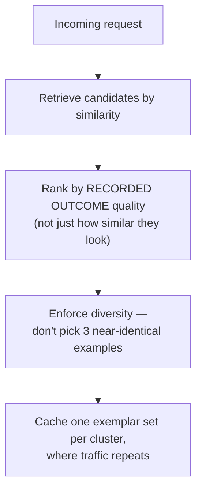
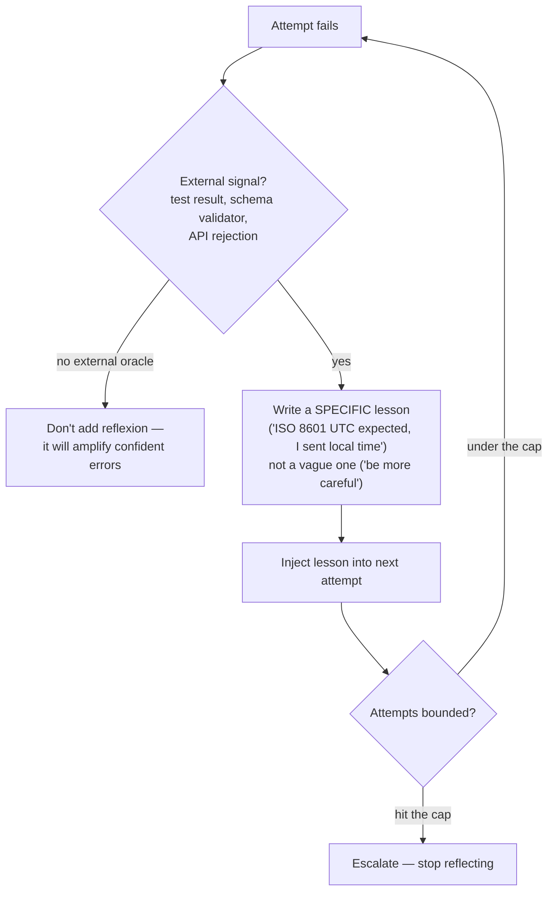
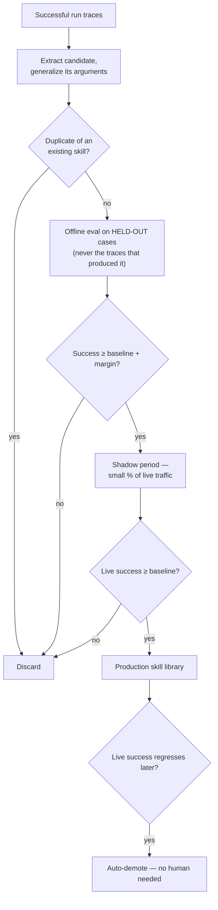
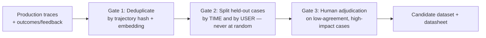

# Chapter 8 — Learning in Agentic Systems

Our ops agent has been live for months now. It's making mistakes, sure — but
also, slowly, getting better. The question this chapter answers: where does
that improvement actually live? Not every fix means retraining a model —
there are four different places learning can be stored, and they differ by
an order of magnitude in cost. The discipline is working down that list, not
jumping straight to the expensive end because it feels more impressive.

## Four Learning Surfaces

**An agentic system can improve in four places — context, memory, procedure,
or parameters — and each is roughly ten times slower and costlier to iterate
on than the one before it.**

| Surface | What it stores | Iteration time | Reversible? | Cost |
|---|---|---|---|---|
| Context | Instructions, exemplars, retrieved evidence | Minutes | Instantly | Tokens per request |
| Memory | Facts, preferences, corrections | Immediate | Yes, by supersession | Storage + retrieval |
| Procedure | Validated tool sequences, playbooks | Hours | Yes, by version pin | Evaluation runs |
| Parameters | Model weights | Days to weeks | Only by redeploy | Training + serving |

**Key points**
- Work down this table, not up. Most teams that reach for fine-tuning haven't fixed their tool schemas, retrieval, or exemplar selection yet — and fine-tuning will faithfully bake those defects into weights that then take weeks to change.
- When asked "how would you improve an underperforming agent," walking down this table in order *is* the answer.

> **🎯 OpenAI Interview Pointer**
> The book says this directly: this ordering is a strong structural answer to "how would you improve this agent" — it signals you know where cost actually lives, not just that you know fine-tuning exists.

## Dynamic Few-Shot Selection

**A fixed set of examples baked into the system prompt is a compromise —
chosen for the average request, so optimal for none. Pulling in examples that
match *this* specific request, instead, measurably improves both formatting
and tool selection.**

For our ops agent, "restart service X" and "roll back flag Y" shouldn't see
the same three examples every time.

**Key points**
- **Select on the input, score on the outcome** — an exemplar that's similar to the request but was itself a mediocre run just teaches mediocrity.
- **Enforce diversity** (a maximal-marginal-relevance pass) so the set spans different shapes of the problem instead of three near-duplicates.
- Exemplars sit above the user's turn in context — swapping them per request invalidates the **prompt prefix cache** (Ch. 6). Where traffic clusters, cache one exemplar set per cluster instead of re-selecting every time.

> **🔍 Deep Dive: the actual scoring formula**
> Each candidate scores as `λ × relevance − (1−λ) × redundancy_to_already_selected + 0.15 × outcome_score`. The redundancy term is what prevents three examples of the same shape from crowding out the one that actually matches this request's pattern.

## Verbal Reinforcement at Runtime (Reflexion)

**Reflexion turns a failure into a written lesson placed in context for the
next attempt. Nothing about the model changes — this is a runtime mechanism,
not training.**

**Key points**
- Needs three things to work: an external failure signal, a lesson specific enough to change behavior, and a hard cap on attempts.
- Without an external oracle, the model grading its own attempt tends to produce a confidently wrong lesson — which then contaminates every attempt after it.

> **🎯 OpenAI Interview Pointer**
> "Explain Reflexion and how you'd implement it in a production coding agent" is a documented interview question in this book. The strong answer names all three requirements (external oracle, specific lesson, bounded attempts) — not just "the agent reflects on its mistakes."

## The Skill Library and Its Promotion Gate

**A skill is a named, parameterized sequence of tool calls with a stated
precondition, postcondition, and measured success rate. The entire design
problem is the gate between "a run succeeded once" and "this is now a
trusted skill."**

**Key points**
- Evaluate a candidate only on **held-out cases it never produced** — grading it on its own source traces measures memorization, which is how a library fills up with skills that worked exactly once.
- Promotion needs *two* gates in sequence: beat baseline offline by a stated margin, *then* survive a shadow period on real traffic.
- Demotion is **automatic**, not just promotion — environments drift, and a skill encoding last quarter's API shape needs to leave production without a human noticing first.

> **🔍 Deep Dive: the actual gate numbers**
> The book's reference values: promotion margin = beat baseline by 5 points; shadow minimum = 200 live attempts before promotion; demotion floor = 4 points below baseline triggers automatic removal. A library that only ever grows becomes a liability within about two quarters — the demotion path is what keeps it honest.

> **🎯 OpenAI Interview Pointer**
> This entire mechanism — offline gate, shadow deployment, automatic demotion — *is* an evaluation harness applied to a learning surface. Given how heavily this kind of panel weighs eval infrastructure, being able to describe this gate precisely (not just "we test skills before using them") is high-leverage.

## When Parameter Updates Earn Their Cost

**Fine-tuning gets proposed far more often than it's actually the right call
— but it decisively is, in three specific situations.**

| Situation | Why fine-tuning wins here |
|---|---|
| Strict format/protocol adherence, at high volume | A small fine-tuned model matches a much larger prompted one, at a fraction of serving cost — and every successful production run is a free labeled example |
| Domain vocabulary the base model lacks | No amount of prompting reliably overrides a strong prior on words with unusual domain meanings |
| A hard cost or latency ceiling, after cheaper surfaces are exhausted | Distillation onto a smaller model buys the ceiling back |

**Key points**
- Knowledge gaps are a retrieval problem, full stop — fine-tuning does not fix a model not knowing something.
- What you give up: a fine-tuned model freezes your task definition. When the business definition changes — and it will — you retrain rather than edit a prompt. Keep a prompted fallback path specifically for this reason.

## The Data Flywheel

**Production traces are your most valuable training asset, and also the most
dangerous one — the failure modes are subtle, and the resulting offline
metrics look great while being meaningless.**

**Key points**
- **Deduplicate first.** Production traffic repeats far more than teams expect — 100,000 raw traces might be a few thousand distinct problems, so the model overfits to the popular ones and the eval set contains their twins.
- **Split by time and user, never at random.** A random split puts a user's near-identical requests on both sides of the split, which quietly inflates every number you'll later report upward.
- **Route low-agreement, high-impact cases to human adjudication** — an automatic outcome label (e.g. "user didn't complain") isn't the same thing as "correct."
- **Ship a datasheet with every dataset**: collection window, filters, dedup method and its effect on volume, split strategy, label source, known biases. An hour of documentation saves weeks of debugging six months later.

> **🔍 Deep Dive: The Fine-Tune That Scored 94% and Failed in Production**
> A real case from the book. A routing agent's fine-tune reported 94% accuracy on a held-out set, beating an 81% prompted baseline — then hit only ~78% in production, *below* the baseline it replaced. Three compounding errors: (1) the held-out set was split **at random** from 140,000 traces that, after dedup, turned out to be only ~9,000 distinct requests — many "held-out" items had near-twins sitting in training; (2) labels came from a previous version of the *same system's* routing decisions, so the model learned to reproduce the old system's errors, which evaluation then scored as correct; (3) the corpus covered a single quarter, missing two categories that only appear at fiscal year-end. **Fix:** deduplicate to distinct problems, split by time (most recent 4 weeks held out entirely), relabel a stratified sample by human adjudication with measured agreement. The honest number came out near 83% — and production matched it within two points.

> **🎯 OpenAI Interview Pointer**
> This case study is close to a perfect fit for an Agent-Evals-focused panel. The book's own advice: **when an offline gain looks surprisingly large, suspect leakage first** — saying that unprompted, before being asked, is described as a strong senior signal.

---

## Cheat Sheet

| Concept | The one thing to remember |
|---|---|
| Four learning surfaces | Context → memory → procedure → parameters. Exhaust the cheap ones first — each rung is ~10x costlier than the last |
| Dynamic few-shot selection | Select by similarity, rank by *outcome*, enforce diversity, watch the prefix cache |
| Reflexion | Runtime only, needs an external oracle + a specific lesson + a bounded attempt count — never self-graded |
| Skill promotion gate | Held-out offline eval → shadow traffic → production, with automatic demotion on regression |
| Fine-tuning | Earns its cost for format/protocol at volume, domain vocabulary, or a hard cost/latency ceiling — never for knowledge gaps |
| Data flywheel | Deduplicate → split by time/user, never random → human-adjudicate low-agreement cases. Suspect leakage first when a gain looks too good |
