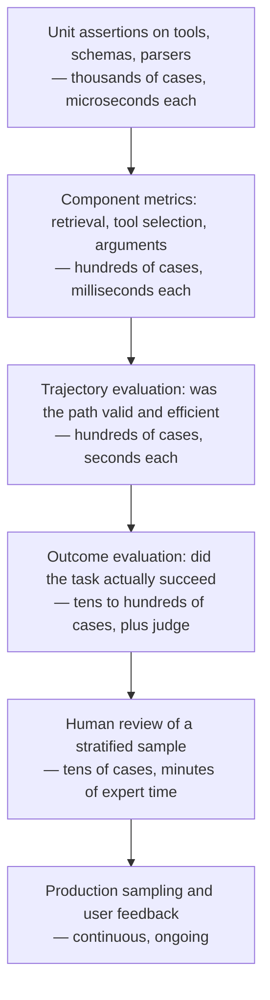
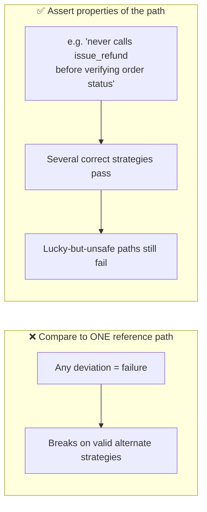
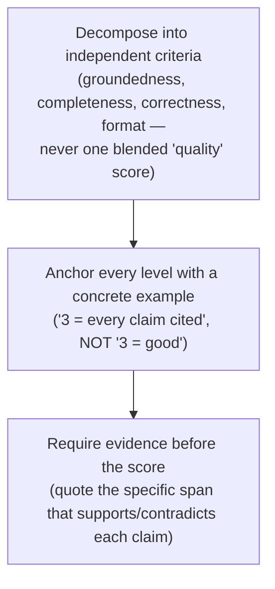
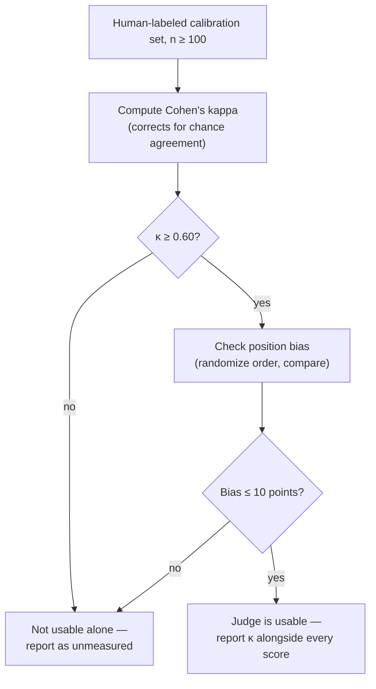
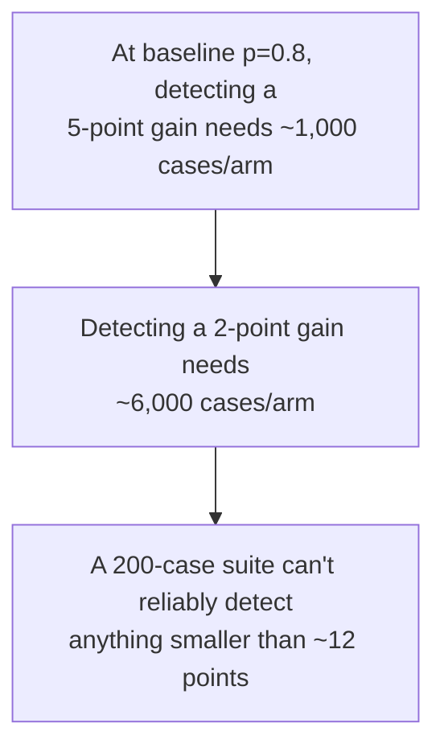
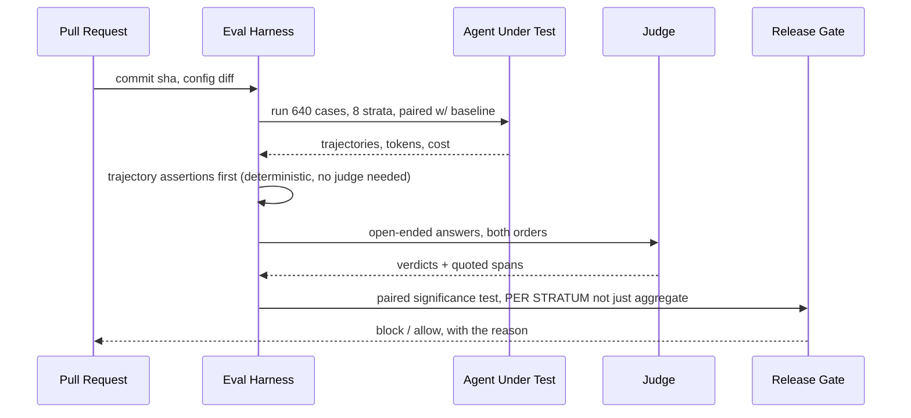

# Chapter 12 — Validation and Measurement

You've been shipping improvements to the ops agent for months. But here's the
uncomfortable question this chapter forces: how do you actually know an
improvement is real — and not noise, or worse, a gain for most users that
quietly breaks it for one team? If you can't measure your agent's quality,
latency, and cost per run, you're not running a product. You're running a
demo that happens to be in production.

## The Evaluation Pyramid

**A single accuracy number is necessary and almost useless on its own —
it can't tell you *which* subsystem caused a regression.**

If our ops agent's success rate drops from 84% to 76%, that could be
retrieval, a tool schema, planning, context assembly, or a model change. One
number can't distinguish among five hypotheses. The fix: measure
independently at every layer, cheapest first.

**Key points**
- Cost per case rises and volume falls as you go up — the cheap layers have to catch most defects before the expensive ones even run.
- A layered picture lets you localize a regression instead of just detecting one.

> **🎯 OpenAI Interview Pointer**
> The book's framing — "if you can't measure quality, latency, and cost per run, you're running a demo in production" — is a strong opening line for any evaluation-design question. It signals you think about measurement as infrastructure, not an afterthought.

## Component Metrics

**Component metrics answer "which subsystem is failing?" — each one is
cheap, deterministic where possible, and independently trackable over time.**

| Metric | Definition | Localizes |
|---|---|---|
| Tool selection accuracy | Fraction of steps where the chosen tool matches the labeled correct one | Descriptions, tool proliferation, routing |
| Argument validity | Fraction of calls passing schema validation first try | Schema design, missing enums, unstated units |
| Retrieval recall@k | Fraction of required evidence present in top k | Index, chunking, query construction |
| Context precision | Fraction of assembled context that was actually relevant | Selection policy, dilution |
| Groundedness | Fraction of claims supported by retrieved evidence | Synthesis, verification threshold |
| Step efficiency | Steps taken ÷ minimum sufficient steps | Planning quality, no-progress cycles |
| Termination correctness | Fraction of runs stopping for the right reason | Loop bounds, stopping policy |

> **🔍 Deep Dive: groundedness and correctness are different metrics**
> A claim can be fully supported by retrieved evidence *and still be wrong* — because the evidence itself was wrong or outdated. Groundedness measures faithfulness to sources; correctness measures agreement with reality. A system that only measures groundedness rewards an agent for confidently repeating a stale document.

> **🎯 OpenAI Interview Pointer**
> Interviewers probe the groundedness-vs-correctness distinction specifically, per the book. Naming both metrics — and the failure mode of optimizing only the first — is the kind of precision that separates a real evals background from a surface-level one.

## Trajectory Evaluation

**An agent can reach a correct answer through a wasteful, unsafe, or lucky
path — outcome-only evaluation can't see the difference, so it can't warn
you before the luck runs out.**

Comparing against one "reference path" fails immediately — most tasks have
several valid ways to solve them. The fix: express requirements as
**assertions over the trajectory**, not a fixed path to match.

**Key points**
- Trajectory assertions encode *policy*, executably — things like "must not call X before Y," or "must stop within N steps of sufficient evidence."
- **Write safety assertions before success-case assertions.** They encode policy in executable form, they never go obsolete, and they're the ones that matter at 3am during an incident.

> **🎯 OpenAI Interview Pointer**
> The book calls this explicitly: a candidate who describes evaluation starting from safety assertions, not accuracy, "reads as someone who has operated a system with consequences." That's a precise, quotable framing worth having ready.

## Designing a Judge Rubric

**For open-ended output there's no reference string to match against, so a
model judge is often the only scalable option — but it's a classifier you
haven't validated yet, and treating it as ground truth without validation is
the single most common measurement error in this field.**

**Key points**
- A single blended "quality" score correlates with length and fluency — it isn't measuring what you think it's measuring.
- The quotation requirement is what turns "vibes" into an actual check.

## Validating the Judge

**A judge only counts as a measurement instrument once it's calibrated
against humans — and that calibration figure has to travel with every number
the judge produces afterward.**

**Key points**
- **Never judge with the model that generated the answer.** Self-preference is measurable and real — a model rates its own output higher than an equally good answer from a different model.
- Randomize presentation order in pairwise comparison, and report an inconsistent verdict (A beats B in one order, loses in the other) as a **tie** — not a coin-flip win.

> **🔍 Deep Dive: the kappa formula, and why raw agreement isn't enough**
> Raw agreement overstates quality when one label dominates the distribution — a judge that always guesses the majority class looks great on raw agreement while adding zero information. Cohen's kappa fixes this: `κ = (observed_agreement − expected_agreement) / (1 − expected_agreement)`, where expected agreement is what two random labelers would achieve by chance given the label distribution. The book's own floor: κ below 0.60 means the judge is not usable alone.

> **🎯 OpenAI Interview Pointer**
> "Never judge with the model that generated the answer" plus the kappa/position-bias mechanics is exactly the kind of concrete, mechanism-level answer an evals-focused panel is listening for — much stronger than "we use GPT-4 as a judge."

## Golden Datasets and Sample Size Arithmetic

**The dataset determines what your numbers mean — and most reported small
improvements in this field are not actually measurable, given how small most
eval suites are.**

**Key points**
- **Stratify by segment** (intent, tenant size, data recency, difficulty) and report per stratum — aggregate accuracy hides segment collapse.
- **Include failure cases explicitly** — refusal, escalation, "insufficient evidence" cases at a realistic proportion, or the system learns to always answer.
- **Version it with a datasheet**: collection window, filters, dedup method, split strategy, label source.
- **Refresh on a schedule** and measure drift against production's actual request distribution — numbers on a stale dataset describe a system nobody uses anymore.

> **🔍 Deep Dive: the actual arithmetic**
> To detect a difference δ in a success rate near p, the sample size per arm is approximately `n ≈ 15.7 × p(1−p) / δ²`. This is why a 200-case suite reporting a 3-point gain has, almost certainly, reported noise. Two legitimate responses: run **paired evaluation** (same cases, both variants, test the per-case difference — needs far fewer cases), or accept that offline evaluation only gates large changes and detect small ones through production experiments where the traffic volume exists.

> **🎯 OpenAI Interview Pointer**
> The book is blunt about this: saying "most reported agent improvements are not measurable" *unprompted*, backed by this arithmetic, is described as "quantitative, correct, and uncomfortable" — a genuinely rare signal in an interview. This is probably the single highest-leverage line in this whole chapter for your panel.

## The CI Release Gate

**Every layer of the pyramid converges into one decision: does this change
ship? The gate has to check safety absolutely, quality against a
significance test, and cost as a visible trade — never silently.**

**Key points**
- **Safety assertions gate absolutely** — any failure blocks, no exceptions.
- **Quality gates against the baseline with a significance test, per stratum** — not just on the mean.
- **Cost is reported, and a ceiling breach blocks** — a quality gain that triples spend must be a visible decision, never a silent one.

> **🔍 Deep Dive: The Evaluation Suite That Blessed a Fifteen-Point Segment Collapse**
> A real case from the book. A document QA agent serving 11 enterprise tenants shipped a retrieval change that improved aggregate accuracy from 79% to 81%. Within two weeks, one tenant escalated — their segment had actually fallen from 82% to 67%. Why: the eval set was drawn *proportionally to traffic*, so that tenant was only ~4% of it; their corpus leaned on heavy internal abbreviations, and the change had shifted weight toward dense retrieval, which is exactly the direction that hurts exact-token matching on abbreviations. The aggregate improvement was real, and the collapse was completely invisible inside it. **Fix:** stratified reporting with a per-stratum floor — no release may drop *any* stratum by more than 3 points regardless of the aggregate — plus per-tenant production monitoring with automatic alerting.

> **🎯 OpenAI Interview Pointer**
> This case study is close to a perfect answer to "why would you gate per-stratum instead of on the mean" — a question this kind of panel is likely to ask in some form. The transferable lesson, in the book's own words: "aggregate metrics are a summary, and summaries hide exactly the failures that generate escalations."

---

## Cheat Sheet

| Concept | The one thing to remember |
|---|---|
| Evaluation pyramid | One accuracy number can't localize a regression — measure at every layer, cheapest first |
| Component metrics | Groundedness ≠ correctness — a claim can be faithfully sourced and still wrong |
| Trajectory evaluation | Assert properties of the path, not a single reference path; safety assertions come before success assertions |
| Judge rubric design | Decompose into criteria, anchor with examples, require quoted evidence before a score |
| Judge validation | Never self-judge; report Cohen's kappa (≥0.60) and position bias with every judge-derived number |
| Sample size arithmetic | A 200-case suite can't detect gains smaller than ~12 points — suspect leakage/noise before celebrating |
| CI release gate | Safety gates absolutely, quality gates per stratum with significance, cost is visible — never silent |
